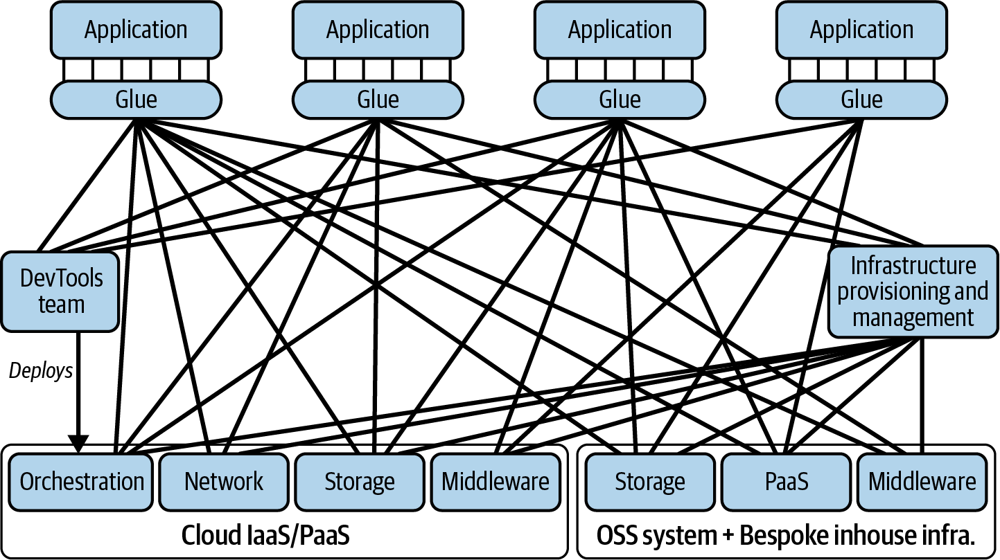
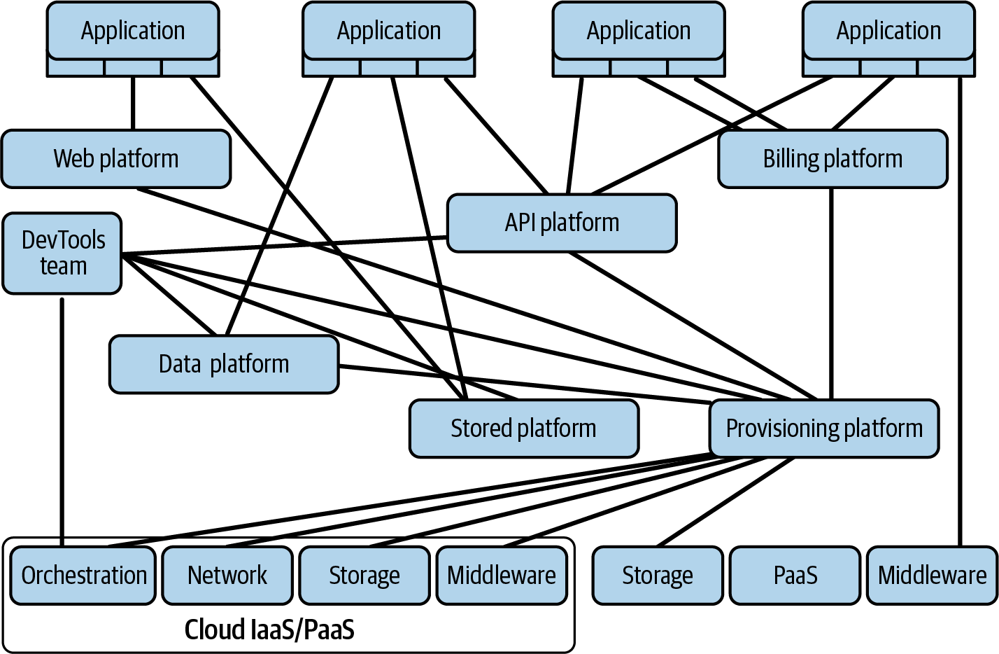
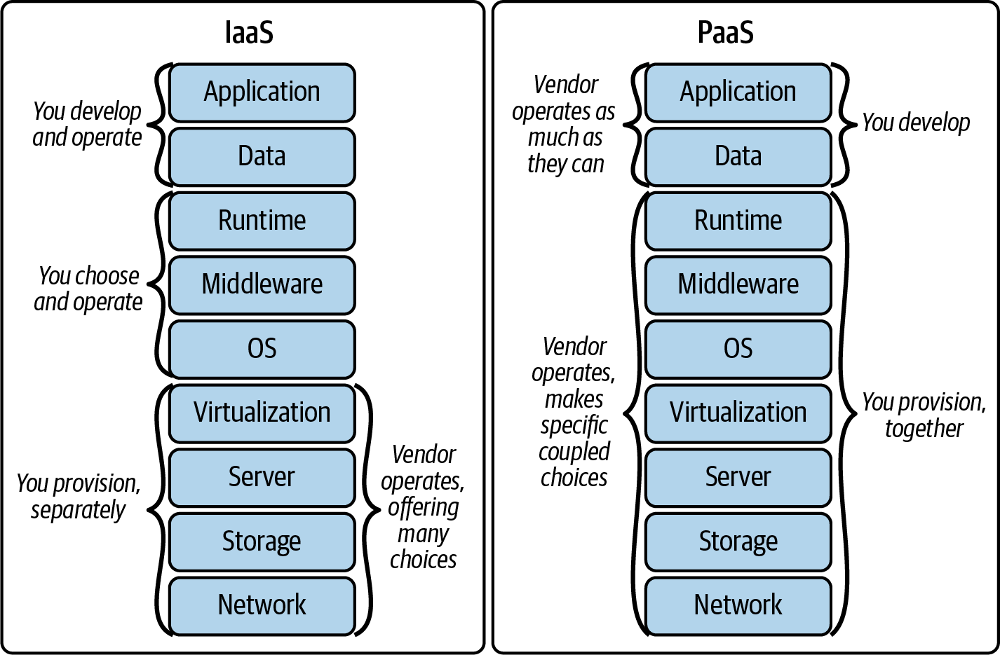

# Chapter 1: Why Platform Engineering Is Becoming Essential

> **Part I — The What and Why of Platform Engineering**

> *"She swallowed the cat to catch the bird, she swallowed the bird to catch the spider, she swallowed the spider to catch the fly; I don't know why she swallowed a fly— Perhaps she'll die!"* — Nursery rhyme

This opening chapter tells the story of how the software industry created a mess it can't clean up with the old tools. Over 25 years, cloud computing and open source gave teams incredible power to build things fast — but that power came with a hidden cost. Every team made independent decisions about tools and infrastructure, glued things together with custom scripts and config, and moved on. Multiply that by hundreds of teams and a decade of time, and you get what the authors call the "over-general swamp" — a sticky tangle of complexity that slows everyone down and makes every change expensive.

Platform engineering is the discipline that gets organizations out of this swamp. The key insight: you don't escape by mandating standards from the top or by giving every team unlimited freedom. You escape by building internal products so good that teams *choose* to use them — products that absorb the complexity of infrastructure and tooling so that application developers can focus on building business value.

## Table of Contents

- [Defining "Platform" and Other Important Terms](#defining-platform-and-other-important-terms)
  - [Platform](#platform)
  - [Platform Engineering](#platform-engineering)
  - [Leverage](#leverage)
  - [Product](#product)
- [The Over-General Swamp](#the-over-general-swamp)
- [How We Got Stuck in the Over-General Swamp](#how-we-got-stuck-in-the-over-general-swamp)
  - [Change #1: Explosion of Choice](#change-1-explosion-of-choice)
  - [Change #2: Higher Operational Needs](#change-2-higher-operational-needs)
  - [Result: Drowning in the Swamp](#result-drowning-in-the-swamp)
- [How Platform Engineering Clears the Swamp](#how-platform-engineering-clears-the-swamp)
  - [Limiting Primitives While Minimizing Overhead](#limiting-primitives-while-minimizing-overhead)
  - [Reducing Per-Application Glue](#reducing-per-application-glue)
  - [Centralizing the Cost of Migrations](#centralizing-the-cost-of-migrations)
  - [Allowing Application Developers to Operate What They Develop](#allowing-application-developers-to-operate-what-they-develop)
- [Empowering Teams to Focus on Building Platforms](#empowering-teams-to-focus-on-building-platforms)
  - [Do Platforms Support Innovation?](#do-platforms-support-innovation)
- [Wrapping Up](#wrapping-up)
- [2025 Context: The Platform Engineering Landscape Today](#2025-context-the-platform-engineering-landscape-today)

**Block types:** [Core Concept] [Deep Dive] [Anti-Pattern] [Worked Example] [Organizational Reality] [SRE/Production Lens] [Comparison] [2025 Context] [AI Impact]

---

## Defining "Platform" and Other Important Terms

### Platform

> A platform is **a foundation of self-service APIs, tools, services, knowledge, and support that are arranged as a compelling internal product.** Autonomous application teams can make use of the platform to deliver product features at a higher pace, with reduced coordination.
> — Evan Bottcher (2018), adapted by Fournier & Nowland

Let's unpack what this definition really means in practice. Imagine you're a developer on a product team and you need a new PostgreSQL database for a feature you're building. In a company *without* a platform, you might need to:
- File a ticket with the infrastructure team and wait days or weeks
- Or learn Terraform yourself, copy some config from another team, guess at the right settings
- Figure out backups, monitoring, access controls, network configuration on your own
- Hope you got the security settings right (you probably didn't)

In a company *with* a database platform, you might:
- Run a single CLI command or click a button in a portal
- Get a fully configured, backed-up, monitored database in minutes
- Have sensible defaults for security, networking, and scaling already applied
- Know that when PostgreSQL needs a version upgrade, the platform team handles it

That second experience is what "platform" means. It's not just a tool — it's an entire support system (documentation, APIs, self-service interfaces, knowledgeable humans) arranged so that you can move fast without stepping on mines.

**What is NOT a platform:**

The authors draw a sharp line here, and it's worth understanding why:

- **A wiki page** is not a platform — because there's no engineering. A page that says "here's how to set up a database" doesn't reduce your work; it just documents the work you still have to do.
- **"The cloud" by itself** is not a platform — because it's an overwhelming menu, not a curated product. AWS has 200+ services. Dumping that choice on application teams is the *opposite* of simplification.
- **A shared Terraform repo** is not a platform — because it still requires every team to understand Terraform, make configuration decisions, and maintain their own instances of the glue.

> **[Core Concept: The "What Isn't a Platform" Test]**
>
> If you're trying to figure out whether something at your organization is truly a platform or just infrastructure-by-another-name, ask three questions:
>
> 1. **Does it require engineering?** If there's no software being built and maintained — just documentation or tickets — it's not a platform. Platforms are *built things* with APIs, automation, and services running behind them.
>
> 2. **Is it coherent?** Can a new developer understand what it offers in under 10 minutes? If it's "here's access to 50 AWS services, good luck" — that's a cloud account, not a platform. A platform presents a *curated* set of capabilities that fit together.
>
> 3. **Is it designed for adoption?** Would someone *choose* to use it even without a mandate? If teams only use it because they're forced to, it's a bureaucratic control, not a product. A real platform competes for its users' attention by being genuinely better than the alternative.
>
> Many organizations call things "platforms" that fail all three tests. A JIRA board where teams request infrastructure is not a platform. A Confluence space with architecture standards is not a platform. A centralized team that writes Terraform on your behalf is not a platform (it's a service desk). This distinction matters because you manage these things very differently — platforms need product managers, roadmaps, and user research; service desks need queue management and SLAs.

### Platform Engineering

**Platform engineering** is the discipline of developing and operating platforms. But what does that actually mean day-to-day?

Think of it this way: platform engineering sits at the intersection of four things that are usually separate in organizations:

1. **Product thinking** — Understanding what your users (application developers) actually need, not what you assume they need. Doing user research. Prioritizing ruthlessly. Saying no to most requests so the product stays coherent.

2. **Software development** — Building real software: APIs, CLIs, UIs, automation pipelines. Not writing one-off scripts or managing tickets — building maintainable, tested, versioned products.

3. **Systems expertise** — Deep knowledge of cloud infrastructure, networking, databases, Kubernetes, and the operational realities of running things at scale.

4. **Operational discipline** — Running what you build with high reliability. Being on-call for the platform. Monitoring, alerting, incident response. You can't build a foundation others rely on if that foundation is shaky.

The goal of this discipline is to **manage overall system complexity in order to deliver leverage to the business.** The key word there is "manage" — not "eliminate." Complexity doesn't disappear; the platform *absorbs* it so that hundreds of application teams don't each have to wrestle with it independently.

### Leverage

> The work of a few engineers on a platform team reduces the work of the greater organization.

This is the concept that justifies every platform team's existence, so it's worth understanding deeply.

**Leverage** means that a small investment in one place creates disproportionately large returns across the organization. Platform teams achieve this in two ways:

**1. Productivity leverage — making application engineers faster:**

Imagine a platform team of 8 engineers builds a deployment system that reduces the time to ship a code change from 2 hours to 10 minutes. If the company has 400 application engineers who each deploy twice a day, that's:
- Before: 400 engineers × 2 deploys × 2 hours = 1,600 engineer-hours spent on deployment per day
- After: 400 engineers × 2 deploys × 10 minutes = 133 engineer-hours spent on deployment per day
- Savings: ~1,467 engineer-hours per day — the equivalent of 183 full-time engineers freed up to do other work

Eight platform engineers created the output equivalent of 183 additional engineers. That's leverage.

**2. Efficiency leverage — eliminating duplicate work:**

Without a platform, if 30 teams each need a CI/CD pipeline, they each build one. That's 30 teams solving the same problem, making similar mistakes, and maintaining 30 slightly different systems. With a platform, one team builds it once, and 30 teams use it. The work that would have been done 30 times is done once.

> **[SRE/Production Lens: Leverage as the Platform Team's North Star]**
>
> If you come from an SRE background, leverage maps directly to Andy Grove's formula from *High Output Management*: a manager's output equals the output of their organization plus the output of neighboring organizations they influence. Platform teams are the ultimate expression of this — they don't ship customer-facing features directly, but they multiply the output of every team that builds on them.
>
> This has a practical implication for how platform teams should measure themselves. The wrong metric: "How many features did the platform team ship this quarter?" The right metric: "How much faster can application teams move because of what the platform team built?" Concrete examples:
> - Time from "new engineer joins" to "first production deploy" (onboarding leverage)
> - Median time from "code merged" to "running in production" (deployment leverage)
> - Percentage of incidents caused by infrastructure vs. application bugs (operational leverage)
> - Number of teams that can do a database migration without platform team involvement (self-service leverage)
>
> When platform teams measure themselves by features shipped, they become feature shops. When they measure themselves by leverage delivered, they become true platforms.

### Product

> *"With the word 'product' we strive to achieve for platforms what Steve Jobs created with Apple products: against a broad range of demand for features the product is deliberately and tastefully curated, both through what it does and, more importantly, through what it leaves out."*

The word "product" is doing a lot of heavy lifting in this book, and the authors want to make sure you don't hear it as just "hire a product manager and write some user stories."

When the authors say a platform should be treated as a product, they mean:

- **You have real users** — the application developers at your company — and you need to *understand their needs deeply*, not just guess at them from the infrastructure side.
- **You make deliberate trade-offs** — you can't support every possible use case. Like a good consumer product, you pick a few things and do them exceptionally well, rather than doing everything poorly.
- **You compete for adoption** — even though your users are internal, they always have alternatives (build it themselves, use a cloud service directly, go off-platform). Your platform needs to be *genuinely better* than those alternatives, not just mandated.
- **You say "no" more than "yes"** — the hardest part. Every feature you add increases the platform's complexity, support burden, and maintenance cost. A great platform is defined as much by what it deliberately leaves out as by what it includes.

Think of it this way: if your platform were a startup and your application developers were paying customers who could switch to a competitor at any time, would they stay? If the answer is "only because they're forced to," you don't have a product — you have a mandate.

---

## The Over-General Swamp

This is the central metaphor of the chapter, and arguably of the entire book. Let's make sure it's crystal clear because the authors return to it throughout.

**The basic economics that create the swamp:**

Most people assume that the major cost of software is building it — writing the code, getting it to work the first time. In reality, at least **60–75% of the lifetime cost** of any software system comes *after* initial development: maintenance, support, upgrades, security patches, migrations, and adaptation to changing requirements. About a quarter of that post-development cost is purely "adaptive maintenance" — keeping up with changes in your dependencies, not adding any new functionality.

Now think about what the cloud and open source did. They provided an ever-growing buffet of **primitives** — general-purpose building blocks like compute instances, databases, message queues, monitoring tools, CI/CD systems. Each primitive is powerful but generic. They don't know about each other and they don't know about your application.

To make these primitives work together and work with your application, you need **"glue"** — the integration code, custom scripts, configuration files, Terraform modules, Helm charts, deployment pipelines, and management tools that connect everything. This glue holds your system together, but it also creates **stickiness** — it makes every future change expensive because you have to update all the glue along with whatever you're actually changing.

Here's where it gets bad: every application team makes their own choices from the primitive buffet and writes their own glue. Team A uses Redis with custom Terraform, Team B uses Memcached with a hand-rolled deploy script, Team C uses DynamoDB with CloudFormation. Three teams, three choices, three flavors of glue — for the exact same capability (caching). Now multiply this across databases, message queues, monitoring, logging, CI/CD, and infrastructure provisioning. Multiply again across 50 teams over 5 years. That's the swamp.


*Figure 1-1. The over-general swamp. Each application connects to multiple primitives through its own custom glue. The architecture diagram looks like a spider web, and every strand of that web is a thing someone has to maintain.*

**Why the swamp is so painful isn't the messy diagram — it's what happens when something needs to change.** Say a critical security vulnerability is found in a commonly used library. In a swamp architecture, fixing it might require:
- Identifying which teams use the affected library (hard — no central visibility)
- Each team updating their own glue in their own way (slow — different configurations everywhere)
- Testing every team's specific combination of primitives and glue (expensive — no shared test patterns)
- Coordinating across dozens of teams with different priorities (political — no one wants to stop feature work for this)

A change that *should* take days takes months. That's the swamp tax.

**The architectural principle that solves this:** "more boxes, fewer lines." Constrain how much glue exists by putting a **platform layer** between applications and primitives. Applications connect to the platform; the platform connects to the primitives. The glue exists in one place, maintained by one team.


*Figure 1-2. With a platform in place, applications talk to platform APIs. The platform team owns all the glue between the platform and the underlying primitives. When a primitive changes, one team updates one set of glue — not 50 teams updating 50 different configurations.*

> **[Deep Dive: Why Glue Is Technical Debt's Sneakiest Form]**
>
> Traditional technical debt is visible: you see the TODO comments, the known shortcuts, the "we'll fix this later" tickets. Glue is different. Glue is often *celebrated* when it's created.
>
> Here's how it happens: A team needs to ship a feature. They pick a cloud service, write 500 lines of Terraform to provision it, create a deployment script, wire up some monitoring, and launch. The team lead gets praised for shipping fast. Nobody notices that five other teams did the same thing slightly differently that same quarter — because there's no visibility across teams.
>
> A year later, the cloud provider deprecates an API. Now six teams each spend a week updating their unique glue. If there had been a platform handling this, one team would have spent a week — total effort reduced by 83%.
>
> **How to spot glue in your organization:**
> - Count unique Terraform modules (or Helm charts, or deployment pipeline configs) across your company. If teams doing similar things have totally different setups, that's glue sprawl.
> - Ask: "If we needed to upgrade Kubernetes across all clusters, how many teams would need to change their code?" If the answer is "most of them" — you're deep in the swamp.
> - Look at the last 10 security patches. How long did each take to roll out fully? If the answer is "weeks to months" — glue is slowing you down.
> - Check how many different CI/CD pipelines exist. If there are 40 variations of "build and deploy a Java service," each team is maintaining their own glue.

> **[AI Impact: Copilot Makes the Swamp Grow Faster]**
>
> Here's something the book doesn't address (it was written just as AI coding tools were taking off) but that makes the swamp problem *more urgent*, not less:
>
> AI coding assistants like GitHub Copilot, Cursor, and Claude make it trivially easy to generate infrastructure glue. A developer can prompt "write Terraform for a PostgreSQL instance on AWS with backups, monitoring, and multi-AZ failover" and get 300 lines of working configuration in 30 seconds. Before AI, the friction of writing glue was itself a mild deterrent — you had to learn Terraform, read docs, debug configs. That friction is now gone.
>
> **What this means in practice:**
> - Teams generate bespoke infrastructure code faster than ever. The swamp fills up at 10x speed.
> - Each AI-generated config is slightly different (different prompts → different outputs). Snowflake count explodes.
> - Engineers trust the AI output without fully understanding it. When it breaks at 2 a.m., nobody knows why.
> - The generated code *works* initially — so it passes code review — but nobody thinks about long-term maintenance or organizational consistency.
>
> **The paradox:** AI coding tools make individual developers more productive at creating the exact kind of custom glue that makes the *organization* slower over time. Each engineer ships faster; the company sinks deeper into the swamp.
>
> **Why this makes platforms MORE important, not less:** Without a platform, AI-assisted glue generation is like giving every team a faster shovel in a hole they should stop digging. With a platform, AI tools can help developers interact with platform APIs more effectively (writing application code that uses platform services well) — but the infrastructure glue itself doesn't exist in their codebase at all, AI-generated or otherwise. The platform absorbs the complexity so there's nothing for Copilot to poorly generate.
>
> **The flip side — AI building the platform itself is fine:**
>
> There's an important asymmetry here. The problem isn't "AI wrote code." The problem is "50 teams each have AI-generated code that nobody fully owns, understands, or maintains consistently." When the *platform team* uses AI to build the platform faster — that's just a productivity tool applied in the right place. Why?
>
> - **One codebase, one team.** The platform team owns, reviews, tests, and debugs everything — regardless of whether a human typed it or an AI generated it. There's no orphaned code floating across 50 repos.
> - **Experts are in the loop.** Platform engineers understand infrastructure deeply. They can evaluate AI output, catch mistakes, and maintain it long-term. An application developer who prompts Copilot for Terraform often can't do any of those things.
> - **The leverage math works.** AI multiplies the output of whoever wields it. Multiply 50 teams' glue-writing capacity → 50x more swamp. Multiply 1 platform team's product-building capacity → the platform ships faster → leverage is delivered to the entire org sooner.
>
> **The one caveat:** the platform team must still *understand* what the AI generates. If they're shipping Copilot output without comprehension, they've moved the "nobody understands this code" problem from 50 teams to 1 team. That's structurally better (one place to fix vs. fifty), but still fragile. The rule: if you can't explain and debug a line of code at 2 a.m., it shouldn't be in your platform — no matter who or what wrote it.
>
> **The practical test:** If a developer on your team can prompt an AI to generate Terraform/Helm/CloudFormation that goes directly into production — you don't have a platform, you have a swamp with a faster intake pipe.

> **[SRE/Production Lens: The Swamp Explains Why Incidents Hurt So Much]**
>
> If you've ever been in an incident review where the root cause turned out to be "Team X was running an old version of Y that interacted badly with Team Z's custom configuration of W" — you've seen the swamp in action during a crisis.
>
> The swamp makes incident response painful in specific ways:
>
> - **No shared mental models:** Each team's glue is different, so there's no common understanding of "how things work here." When the on-call engineer gets paged for a service they haven't seen before, they're starting from zero.
> - **Unpredictable blast radius:** Because each team's setup is unique, you can't predict what a change to a shared primitive will break. A Kafka upgrade might affect 3 teams or 30 — you don't know until things start failing.
> - **Runbooks don't generalize:** A runbook written for Team A's PostgreSQL setup won't help Team B, because Team B's Terraform, networking config, and monitoring are all different.
> - **Cascading version skew:** When teams update at different paces, you end up with version combinations that nobody has ever tested together — the source of the most confusing, hardest-to-debug production incidents.
>
> Platform engineering solves this: all teams use the same abstraction, configured the same way, monitored the same way. The on-call engineer can build expertise that transfers across teams. Blast radius is predictable. Runbooks generalize. Version upgrades happen centrally and uniformly.

---

## How We Got Stuck in the Over-General Swamp

The swamp didn't happen because engineers are careless. It happened because of two legitimate industry shifts that had unintended consequences.

### Change #1: Explosion of Choice

**The story in four acts:**

**Act 1 — The data center era:** Companies built software for the internet, which meant buying servers, racking them in data centers, and managing physical hardware. Infrastructure engineering was a big, physical discipline. Application developers were frustrated: limited server choices, constant capacity issues, and when things broke, the response was always "nothing in the system logs, must be your software."

**Act 2 — The cloud promise:** When AWS and other cloud providers arrived, application developers were thrilled. They could finally call an API and get a server in minutes instead of filing a procurement request and waiting weeks. Cloud promised freedom from hardware problems. Companies adopted it despite legitimate concerns about cost, security, and complexity.

**Act 3 — The PaaS hope:** The industry hoped that Platform as a Service (PaaS) would win. PaaS meant the cloud vendor would handle everything below your application code — scaling, deployment, networking, all of it. Heroku showed how magical this could be. But enterprise PaaS offerings (Force.com, Elastic Beanstalk, Google App Engine) couldn't support the full diversity of enterprise applications. They were too restrictive.

**Act 4 — The IaaS reality:** Instead, Infrastructure as a Service (IaaS) won. Teams preferred the flexibility of raw cloud primitives, even though it meant much more work. The result: every application team became a part-time cloud engineering team, making infrastructure decisions and writing integration glue.


*Figure 1-3. With PaaS, the vendor handles most of the operational complexity. With IaaS, your teams handle it. IaaS won on flexibility — but the cost is the swamp.*

> **[Core Concept: Kubernetes — More Glue, Not Less]**
>
> The authors make a deliberately provocative observation: Kubernetes is "an admission that both PaaS and IaaS have failed to meet enterprise needs." Here's what they mean:
>
> Kubernetes tried to find a middle ground. It said: "If your application is 'cloud native' (containerized, stateless where possible, declaratively configured), we can abstract away a lot of the IaaS complexity." And it does — Kubernetes handles scheduling, networking, scaling, and self-healing.
>
> But here's the problem: Kubernetes itself is enormously complex. It's a "leaky abstraction" — to configure it correctly for your application, you need to understand a massive amount of detail about networking, storage, resource limits, security contexts, and more. Applications now have less Terraform glue but more YAML glue. The total amount of glue hasn't decreased — it's just changed format.
>
> **The implication for platform engineers:** Kubernetes is infrastructure, not a platform. If you hand application teams raw Kubernetes access and say "here's your platform," you've just replaced one swamp with another. A platform needs to sit *on top* of Kubernetes (or whatever infrastructure you use) and present a much simpler interface to application teams. Something like: "Here's a form. Tell us your service name, which language it's in, how much traffic you expect, and whether it needs a database. We'll handle the rest."

> **[Deep Dive: What "We'll Handle the Rest" Actually Looks Like — The Layer Above Kubernetes]**
>
> The statement "tell us what you need and we'll handle the rest" raises the obvious question: *how?* What does the platform actually do between receiving that simple request and having a fully operational service running in production? This is where platform engineering becomes *engineering* — not just product thinking.
>
> **First, let's clarify where managed Kubernetes (EKS, AKS, GKE) fits:**
>
> Managed Kubernetes services solve "who runs the K8s control plane" — the cloud vendor operates etcd, the API server, the scheduler. That's valuable, but it still leaves application teams exposed to the full YAML complexity of *using* Kubernetes. You still need to write Deployments, Services, HPAs, Ingress configs, NetworkPolicies, PodDisruptionBudgets, resource requests and limits... Managed K8s solved the cluster operations problem, NOT the developer experience problem.
>
> **The platform stack:**
>
> ```
> ┌─────────────────────────────────────────┐
> │  Developer: "I need a payments service" │  ← Developer's world (simple)
> ├─────────────────────────────────────────┤
> │  Internal Platform (e.g., Ethos)        │  ← Platform abstraction (the magic middle)
> │  (CRD + Operator + Self-service UI)     │
> ├─────────────────────────────────────────┤
> │  EKS / AKS / GKE                        │  ← Managed K8s (cloud runs control plane)
> ├─────────────────────────────────────────┤
> │  AWS / Azure / GCP                       │  ← Cloud primitives (VMs, networking, storage)
> └─────────────────────────────────────────┘
> ```
>
> The platform layer sits *between* the developer and managed K8s. The developer never writes YAML. They express intent in a simple format, and the platform translates that intent into the 50+ resources needed to actually run a service.
>
> **What the developer provides (simple intent):**
>
> ```yaml
> apiVersion: platform.company.io/v1
> kind: Application
> metadata:
>   name: payments-service
> spec:
>   language: java
>   team: payments
>   tier: critical          # determines HA config, replicas, PDB
>   traffic:
>     expected: 500rps
>     scaling: auto         # platform picks HPA settings based on tier + traffic
>   dependencies:
>     - type: postgresql
>       size: medium        # platform maps to specific RDS instance class
>     - type: redis
>       purpose: cache
>   networking:
>     external: true        # gets an ingress + TLS cert
> ```
>
> **What the platform generates and manages (complex reality):**
>
> From those ~15 lines of intent, the platform creates and continuously reconciles:
> - A K8s Deployment with container image, resource limits (calculated from language + traffic), liveness/readiness probes (templated per language), and pod anti-affinity rules
> - A HorizontalPodAutoscaler configured for the traffic tier
> - A K8s Service, Ingress, and TLS certificate (auto-renewed)
> - An RDS PostgreSQL instance (via Crossplane or Terraform triggered by the platform)
> - A Redis cluster
> - Prometheus ServiceMonitor + standard alerting rules for that service tier
> - PagerDuty integration wired to the owning team's on-call rotation
> - NetworkPolicies allowing traffic from the right sources
> - PodDisruptionBudget (based on tier — critical services get stricter guarantees)
> - DNS entry
> - CI/CD pipeline
> - ... potentially 50+ total resources from those 15 lines
>
> **The four common implementation patterns for this "magic middle" layer:**
>
> | Pattern | How It Works | Best For |
> |---------|-------------|----------|
> | **Custom CRD + Operator** | Define a Kubernetes Custom Resource (e.g., `kind: Application`) with a simple schema. A controller watches for these resources and reconciles them into the actual K8s/cloud resources needed. The K8s reconciliation loop provides self-healing — if something drifts, the operator corrects it automatically. | Teams already deep in K8s. Provides ongoing day-2 operations, not just initial setup. Adobe's Ethos and similar internal platforms use this pattern. |
> | **Golden Path Templates** | Pre-built scaffolding templates (via Backstage scaffolder, Cookiecutter, or similar) generate a complete new repo with all configs, CI/CD, Helm charts, and Terraform pre-configured with sensible defaults. Developer fills in a few variables and gets a working service. | Greenfield services. Gets teams started fast. Limitation: less help with day-2 operations — once the template generates the code, the team owns it. |
> | **Platform Orchestrator** | Developer writes a "score" file (~10 lines describing what they need). The orchestrator resolves this against the target environment (dev/staging/prod) and generates the correct infrastructure config per environment. Same workload definition, different infrastructure underneath. | Multi-environment complexity. Solves "works in dev but breaks in prod" by ensuring configs are generated correctly per environment. Humanitec uses this model. |
> | **Abstraction API + GitOps** | Developer commits a small config file (~15 lines) to a repo. A platform pipeline reads it, expands it into full manifests using company-specific templates and defaults, and syncs to clusters via GitOps (ArgoCD or Flux). | Incremental adoption. Can start simple (just expand one resource type) and grow over time. Lower upfront investment than a full operator. |
>
> **Why the CRD + Operator pattern is particularly powerful:**
>
> 1. **Self-healing.** If someone manually deletes a resource or something drifts from desired state, the operator detects the difference and reconciles back. The platform inherits Kubernetes' core superpower — the declarative reconciliation loop.
>
> 2. **Upgrades are structural, not per-team.** When the platform team decides "all critical-tier services should now have 3 replicas minimum instead of 2" — they update the operator logic. On the next reconciliation loop, every `Application` with `tier: critical` gets a third replica. No migration tickets. No PRs to 50 repos. No nagging emails. It just happens.
>
> 3. **Guardrails are encoded in software.** You can't request `tier: critical` without being in the on-call rotation. You can't set `external: true` without a security review annotation. The operator enforces these at creation time — not a wiki page that says "please remember to do X."
>
> 4. **Day-2 operations are covered.** Unlike golden-path templates (which help at service creation but go silent afterward), the operator stays active for the life of the service. Certificate rotation, scaling policy updates, sidecar security patches, infrastructure upgrades — the operator handles ongoing operations continuously, not just initial setup.
>
> **The key insight:** EKS/AKS/GKE and internal platforms like Ethos aren't alternatives — they're different layers. EKS gives you a well-run Kubernetes cluster. The internal platform gives developers a way to *use* that cluster without knowing (or caring) that it's Kubernetes underneath. The managed K8s offering is an *input* to your platform, not a *replacement* for it.

**The open source angle:**

Open source created the same proliferation problem in a different dimension. Before OSS, you bought a vendor's database, message queue, and monitoring tool — limited choice, but at least consistent across your company. With OSS, each team can choose the *perfect* tool for their specific problem:
- Team A picks Redis for caching (they know it from a previous job)
- Team B picks Memcached (slightly better for their access pattern)
- Team C picks Hazelcast (they need distributed data structures)

Each choice is rational in isolation. But the company now has three caching systems to maintain, three sets of expertise to develop, three sets of security patches to apply, and zero shared operational patterns. The authors quote former Sun Microsystems CEO Scott McNealy's famous line: open source is *"free, like a puppy"* — the adoption cost is zero, but the lifetime cost of feeding, walking, and cleaning up after it is enormous.

### Change #2: Higher Operational Needs

In parallel with the explosion of infrastructure choices, the industry struggled with a separate question: **who operates all this software, and how?**

**The evolution in four phases:**

**Phase 1 — The Two-Role World (1990s):**
Before the internet mattered, most companies had two roles:
- **Software Developers** — wrote code, delivered it as a finished package, handed it off
- **Systems Administrators** — operated everything in production, managed servers, dealt with failures

This was clean but slow. Developers didn't think about operations. Operations didn't understand the code. Handoffs were formal and infrequent.

**Phase 2 — Operations Engineering (early 2000s):**
The internet made software critical to business success. Companies needed 24/7 uptime. Operations teams grew rapidly, filled with early-career sysadmins. But Agile development meant faster release cycles, which created tension: one team pushing for speed (dev) and another team responsible for stability (ops). After outages, both sides pointed fingers: "Your code was buggy." / "Your infrastructure was flaky."

**Phase 3 — DevOps (2010s):**
DevOps tried to solve the finger-pointing by merging development and operations concerns. In practice, companies implemented it two ways:

| Model | How It Worked | What Actually Happened |
|-------|---------------|----------------------|
| **Split ("DevOps team")** | Kept separate teams, but ops team did some development (deployment automation, CI/CD). Renamed "Operations" to "DevOps." | Still two teams. Still a fence. Still finger-pointing, just with fancier tooling. |
| **Merged ("You build it, you run it")** | Combined dev and ops into one team. Everyone shares on-call. | Works beautifully *when infrastructure complexity is managed*. Falls apart when every developer also needs to be a Kubernetes/Terraform/networking expert. |

**Phase 4 — SRE (2010s–2020s):**
Google published its SRE book in 2015, and the industry got excited. SRE brought rigorous practices: SLOs, error budgets, toil budgets, blameless postmortems. Many companies tried to adopt it wholesale.

But the authors make a bold claim: **"SRE, as it was originally sold, has not been a widespread success outside of Google."** The processes were too heavyweight; their success relied too much on Google's specific cultural capital and organizational focus. Most companies that adopted SRE ended up with something closer to "the ops team, renamed." They cite Dave O'Connor, a former director of SRE at Google, who wrote in 2023: *"The next stage in removing our production training wheels as an industry is to tear down the fence between SRE and Product Engineering, and make rational investments in reliability as a mindset, based on specific needs."*

The authors' conclusion: the industry doesn't need *another* operations-adjacent team with a new name. It needs to make operational excellence *structural* — embedded in the platform itself — rather than *organizational* — enforced by a separate team.

> **[SRE/Production Lens: What This Means If You Come from SRE]**
>
> Important distinction: the authors are NOT saying SRE *practices* are bad. They explicitly adopt SLOs, error budgets, and operational reviews in Chapter 6. What they're rejecting is the dedicated SRE *team* as a separate organizational unit — because it recreates the dev/ops seam under a new name.
>
> **The platform engineering answer:** Don't create a separate team to enforce reliability practices on product teams. Instead, *build platforms* that make the reliable path the easy path. Concrete examples:
> - If your deployment system automatically does canary analysis → you don't need an SRE to review every deployment plan
> - If your platform handles failover → you don't need an SRE to design high availability for each service
> - If your monitoring is provisioned automatically with sane defaults → you don't need an SRE to set up alerts per service
>
> Reliability expertise doesn't disappear — it *moves*. From a team that sits beside product engineering and tries to influence it, to a team that builds products which *embody* reliability by default. The expertise becomes code, not advice.

> **[AI Impact: AI-Assisted Platform Operations]**
>
> The authors argue that platform engineering embodies reliability by making it structural (code, not advice). AI is accelerating this in concrete ways:
>
> - **Incident triage:** When an alert fires, an LLM can correlate the alert with recent deployments, related service logs, and historical incidents to suggest a probable root cause — reducing the "Phase 1: figure out what's happening" from 20 minutes to 2 minutes. This is especially valuable for platforms because platform incidents often affect many services simultaneously, and the correlation logic is complex.
>
> - **Anomaly detection beyond static thresholds:** Traditional alerting fires when a metric crosses a threshold you set in advance. AI-powered observability tools (Datadog's Watchdog, Dynatrace's Davis) can detect anomalies you didn't know to look for — subtle performance degradations, unusual traffic patterns, slowly growing resource leaks. For platform teams responsible for foundations that many services depend on, this catches problems before they become user-facing incidents.
>
> - **Automated runbook execution:** Instead of an on-call engineer reading a runbook and executing steps manually, an AI agent can execute routine remediation steps (restart a pod, scale up replicas, failover a database connection) while notifying the human. The human reviews and intervenes only when the situation deviates from known patterns.
>
> - **Predictive scaling:** LLMs analyzing historical traffic patterns + calendar events + recent trends can predict load spikes before they arrive, allowing the platform to pre-scale. This is particularly valuable for platform services that aggregate traffic from many application services.
>
> **The key insight:** These AI capabilities work *better* on platforms than on individual services, because platforms have more data (aggregated across all users), more consistent configurations (easier to train models), and more impact per improvement (one fix helps everyone). This is another form of leverage: investing in AI-powered operations at the platform layer benefits every service running on the platform.

> **[Comparison: DevOps Handbook Connection]**
>
> The DevOps Handbook (Chapter 7) discusses Conway's Law — the observation that system architecture mirrors organizational structure. This chapter makes the complementary argument: the industry's organizational evolution (ops → DevOps → SRE → platform eng) has been *driven by* architectural changes (monolith → cloud-native → microservices → overwhelming primitives).
>
> DevOps Handbook's thesis: break down silos between dev and ops to enable flow. Platform Engineering's thesis: silos reform unless you *build products* that make the cross-functional collaboration structural and permanent. DevOps is a culture; platforms are infrastructure that makes that culture sustainable.
>
> In other words: DevOps told us "dev and ops should work together." Platform engineering tells us "here's what we should build so they don't have to think about it separately in the first place."

### Result: Drowning in the Swamp

All of these forces compound:

- More application teams making more choices from a growing menu of cloud and OSS primitives
- Each choice brings custom glue that only that team understands
- Cyber threats mean faster mandatory upgrade cycles (patches that used to come yearly now come monthly)
- Every upgrade means updating glue across every team that made a different choice
- Each greenfield project adds more unique choices to the swamp
- Over time, developers slow to a crawl — fighting configuration, debugging infrastructure issues, managing upgrades

The authors capture this vividly: the swamp is "full of hungry operational alligators (or worse, crocs!)." What they mean: it's not just that progress is slow — it's that the swamp actively *bites*. Random infrastructure issues page teams at 2 a.m. Security vulnerabilities require emergency patching across dozens of bespoke configurations. Outages cascade in unpredictable ways because nobody understands the full dependency graph.

---

## How Platform Engineering Clears the Swamp

The authors acknowledge upfront that building platforms takes **significant investment.** This includes the costs to build and support them, the overhead of limiting application teams' choices, and the organizational costs of restructuring teams and roles. Platforms aren't free — so why are they worth it?

The rest of this section presents four specific mechanisms by which that investment pays off. Each addresses a concrete pain point from the swamp and explains how platforms solve it structurally, not just procedurally.

### Limiting Primitives While Minimizing Overhead

**The problem:** Too many teams making too many independent technology choices. Someone needs to reduce the diversity — but how?

The authors identify the most common instinct — and explain why it fails. Leadership typically responds to the swamp by prescribing standards from above: the database expert picks the databases, the architect picks the tools, or the CTO decides everything. But these top-down mandates can't account for the diversity of genuine business needs across teams, and they breed resentment and workarounds (shadow IT).

The platform engineering alternative: **don't prescribe from authority — attract through quality.** Instead of mandating "you must use PostgreSQL," build a database platform so compelling that teams willingly choose it because it saves them weeks of work, handles operations they don't want to do, and comes with expert support. When the demonstrated leverage is clear, the mandate becomes unnecessary. This is the shift from "standardization by authority" to "standardization by attraction" — and it's one of the book's most important ideas.

> **[Anti-Pattern: Why Standardization by Authority Specifically Fails]**
>
> The authors use direct quotes to illustrate the mindset:
> - *"Because I am the expert in databases, I will choose which databases you can use."*
> - *"I am the architect, so I decide on all software tools."*
> - *"I am the CTO, so I decide everything."*
>
> **Why this feels right:** It's fast, clear, and the decision-maker often genuinely is an expert. It looks like decisive leadership.
>
> **Four specific failure modes:**
>
> 1. **The expert can't know all contexts.** The database expert who mandates PostgreSQL everywhere doesn't understand that the recommendation team genuinely needs a graph database, or that the real-time team needs sub-millisecond writes PostgreSQL can't provide. Blanket standards always force some teams onto the wrong tool.
>
> 2. **It creates resentment and shadow IT.** Engineers told "you must use X because I said so" find workarounds — hidden AWS accounts, unapproved SaaS tools, "temporary" solutions that become permanent. The mandate pushes the problem underground rather than solving it.
>
> 3. **It kills ownership.** When the mandated tool breaks, teams say "that's the platform team's problem, they forced us onto this." When teams *choose* a tool, they own the consequences.
>
> 4. **It stagnates.** Authority-based standards rarely get updated because updating them requires the authority to admit they were wrong (or that the world changed).
>
> **The nuance:** This doesn't mean you *never* mandate. Security and compliance situations sometimes require it. But mandates should be the exception, not the strategy — and even mandatory platforms should strive to be excellent products, because mandated-but-terrible creates the deepest resentment.

The key insight: platform engineering takes a **customer-focused product approach** that curates a small set of primitives meeting broad requirements. This requires:
- **Compromises** — you can't please every team perfectly, but you can please 80% of teams 90% of the way
- **Incremental delivery** — you don't launch a perfect platform on day one; you build credibility over time
- **Partnership** — working directly with application teams to understand what they actually need, not guessing from the infrastructure side

> **[AI Impact: Natural Language as the Platform Interface]**
>
> Here's where AI transforms the *experience* of using a platform — and makes the "attract, don't mandate" strategy much more achievable.
>
> Traditional platform interfaces require developers to learn something: a CLI with specific commands, an API with specific endpoints, a portal with specific workflows. Even a great platform has a learning curve. That curve is a barrier to adoption — and every barrier gives teams a reason to go off-platform.
>
> Now imagine this: a developer types into a chat interface (integrated into their IDE or Slack): *"I need a new service that handles about 500 requests per second, uses PostgreSQL, and needs to talk to the payments service."* The AI assistant — backed by the platform's APIs — responds: *"I'll create a new service called X with a PostgreSQL database (standard tier, which handles up to 2k req/s), network connectivity to the payments service, and the default monitoring stack. Want me to also set up the CI/CD pipeline?"*
>
> This is already happening. Companies are building AI-powered interfaces on top of platforms like Backstage. The AI layer translates natural-language intent into platform API calls. The developer doesn't need to know the CLI syntax, the API schema, or which forms to fill out. They just describe what they need.
>
> **Why this matters for platform engineering:**
>
> 1. **Adoption friction drops dramatically.** The developer doesn't need to RTFM. The AI knows the platform's capabilities and guides them to the right choice. This makes the "attract, don't mandate" strategy much easier — when using the platform is as easy as describing what you want in plain English, most teams won't bother building their own.
>
> 2. **The platform can enforce guardrails invisibly.** When a developer asks for "a database with public internet access" (a security risk), the AI can explain why that's not available and suggest the secure alternative — without the developer ever seeing a red error message or reading a policy document.
>
> 3. **Discovery of platform capabilities improves.** Most platform adoption problems aren't "the platform can't do X" — they're "the team didn't know the platform could do X." An AI interface can surface relevant capabilities that developers wouldn't have found by browsing documentation.
>
> 4. **Support load decreases.** Instead of filing a ticket asking "how do I do X?" developers ask the AI. If the AI can answer from platform documentation and APIs, the platform team never gets interrupted.
>
> **The prerequisite:** This only works if you *have* a platform with well-defined APIs and good documentation. AI can't create a platform interface where no platform exists — it would just generate more bespoke glue (see the earlier block about Copilot making the swamp worse). The AI layer is a *multiplier* on a good platform, not a replacement for one.

### Reducing Per-Application Glue

Beyond limiting *which* primitives teams use, platform engineering also reduces the *coupling* between applications and those primitives. The goal: abstract primitives into systemic platform capabilities so that application teams don't write glue at all — they interact with platform APIs that handle the underlying complexity.

The authors illustrate this with the Terraform story, which shows a common three-stage progression that many organizations go through: first, every team writes their own Terraform (chaos); then, leadership centralizes the Terraform work into one team (bottleneck); and finally — if they get it right — that central team transforms from writing glue *for* teams into building a platform that makes glue *unnecessary* for teams. The difference between stage 2 (centralized labor) and stage 3 (platform engineering) is the single most important distinction in this chapter.

> **[Worked Example: The Terraform Trap — A Three-Stage Organizational Failure]**
>
> The authors walk through a progression that many readers will recognize painfully from their own experience:
>
> **Stage 1 — "Every team writes their own Terraform"**
>
> It starts innocently. The cloud team says: "Here are your AWS accounts. Use Terraform to provision what you need." Each application team now has a few engineers who write Terraform.
>
> What actually happens:
> - Most engineers don't want to learn Terraform. It's not their core skill, and they use it infrequently — maybe once a month at most. So the work gravitates to whoever is newest (doesn't know enough to push back) or whoever is curious about DevOps (and will likely leave the team soon for a dedicated infra role).
> - The "Terraform person" on each team becomes a single point of failure. When they leave — and they always leave — the next person inherits 2,000 lines of configuration they don't understand.
> - Each team makes different decisions: different module structures, different naming conventions, different approaches to secrets management. The company now has 30 snowflake Terraform codebases.
>
> **Stage 2 — "Let's centralize the Terraform team"**
>
> Leadership notices the chaos and does the obvious thing: pulls all the Terraform-writing engineers into one central team. "This team will write Terraform for everyone else."
>
> What actually happens:
> - The centralized team becomes a **feature shop** — they take in work requests ("I need a new RDS instance with these settings") and pump them out. There's no time to think about abstractions, patterns, or automation.
> - The work is repetitive and low-creativity. Strong software engineers don't want to do this, so they leave. You're left with junior engineers copying and modifying existing configs.
> - Over time, the Terraform codebase becomes spaghetti — hundreds of slightly-different modules with no coherent architecture. Security configurations drift. Nobody has a clear picture of what's deployed where.
> - Application teams are frustrated by wait times ("I filed a ticket 3 weeks ago for a simple database"). The centralized team is frustrated by volume ("we have 200 tickets in the backlog").
> - Everyone is unhappy, but the org is stuck.
>
> **Stage 3 — Platform engineering (the way out)**
>
> Instead of writing Terraform *for* application teams, you build something that makes Terraform *invisible* to them. You go one level deeper:
> - "What do application teams actually need?" Not "a Terraform module that creates an RDS instance." They need "a database that's production-ready in 5 minutes."
> - "What opinions should we have?" Not "we'll create whatever you ask for." Instead: "We support PostgreSQL and DynamoDB. Here's when to use which. Both come with monitoring, backups, and failover built in."
> - "What can we build beyond provisioning?" Not just "here's your database" but "here's your database + connection pooling + automatic failover + query performance monitoring + easy migration tooling."
>
> The central team transforms from a "glue maintenance center" into "an engineering center that builds things" — a platform. Application teams interact with platform APIs, not with Terraform. The glue disappears from their world.
>
> **The key difference between Stage 2 and Stage 3:** In Stage 2, the central team does the same work application teams used to do, just in a different location. In Stage 3, the central team builds *software that eliminates the need for that work entirely.* Stage 2 is centralized labor. Stage 3 is engineering leverage.

> **[Organizational Reality: Recognizing and Escaping the Feature Shop]**
>
> The Stage 2 failure (feature shop) is so common it deserves extra attention. If you're on a team like this right now, here are the warning signs:
>
> - Your team measures success by "tickets closed" or "requests fulfilled," not by "developer experience improved" or "time-to-production reduced"
> - Your backlog is always growing faster than you can work through it
> - Senior engineers don't want to join your team (the work isn't intellectually challenging)
> - Application teams complain about wait times but also complain about quality
> - Nobody on your team has time to step back and ask "should we be building this differently?"
> - Your team is seen as a cost center, not a value creator
>
> **How to escape:**
> 1. Stop measuring tickets. Start measuring outcomes (deployment time, developer satisfaction, incidents caused by infrastructure).
> 2. Carve out capacity for "platform work" — even if it means saying "no" to some requests temporarily.
> 3. Pick one high-pain area and build a self-service solution. When application teams can provision a database themselves in 2 minutes instead of waiting 2 weeks for a ticket, you've demonstrated the value of the platform approach.
> 4. Use that success to justify expanding the model.
> 5. Change your team's mission statement — from "we provision infrastructure for application teams" to "we build platforms that make application teams self-sufficient."

### Centralizing the Cost of Migrations

Migrations are the hidden killer of engineering productivity. Every time an underlying dependency changes (new version of Kubernetes, PostgreSQL security patch, AWS API deprecation, library vulnerability), someone has to update the code that interfaces with it. In the swamp model, that "someone" is every team that independently chose and integrated that dependency.

Platform engineering reduces migration costs through four mechanisms:

| Mechanism | How It Works | Why It Matters |
|-----------|-------------|----------------|
| **Reducing primitive diversity** | Fewer unique systems in use across the company | If you have 3 databases instead of 12, you have 3 migration paths to manage, not 12. Simple arithmetic. |
| **Encapsulating with APIs** | Platform APIs shield apps from underlying implementation | When the platform upgrades from PostgreSQL 14 to 16, applications using the platform's database API may not need to change at all — the API contract stays the same even as the implementation changes. |
| **Creating usage observability** | Platform tracks who uses what, and how | Before a migration, you can answer "which teams are affected?" in seconds instead of weeks of archaeology. You know which teams use feature X that's changing, how they use it, and what version they're on. |
| **Having software developers on the team** | Platform teams can write sophisticated migration tooling | When APIs prove imperfect and apps DO need to change, platform engineers can build automated migration tools (codemods, schema migrators, compatibility shims) rather than asking 50 teams to each make manual changes. |

> **[SRE/Production Lens: Migrations Are Production Risk Events]**
>
> From an SRE perspective, every migration is a potential incident waiting to happen. Consider the difference:
>
> **Swamp model migrations:** 50 teams, each doing their own migration, at their own pace, with their own testing rigor, with their own rollback plan (if they have one). Some teams migrate in week 1. Some procrastinate until week 12. During those 12 weeks, you have a mix of old and new versions running simultaneously — a state nobody has tested, with unpredictable interactions. Any of those 50 independent migration attempts could cause a production incident.
>
> **Platform model migrations:** One team (the platform team) plans the migration. They test it in staging. They roll it out in tranches — first to internal services, then to low-risk applications, then progressively to the rest. They use canary analysis to detect problems early. They have a single rollback plan that covers everyone. The entire migration follows the same production safety practices you'd apply to any code release.
>
> In the swamp model, migrations are uncontrolled experiments in production with 50 independent variables. In the platform model, migrations are controlled releases with one variable, rolled out progressively. The risk difference is enormous.

> **[AI Impact: LLM-Powered Migration Tooling]**
>
> The book's fourth migration mechanism — "having software developers who can write nontrivial migration tooling" — gets dramatically more powerful with LLMs. Here's how:
>
> **The traditional migration problem:** Your platform team needs to migrate 200 services from API v1 to API v2. Even with good abstractions, some services use the API in ways that require code changes. Traditionally, the platform team would either:
> - Write a codemod (a script that programmatically rewrites code) — expensive to build, brittle with edge cases
> - Write a migration guide and ask 200 teams to do it themselves — slow, inconsistent, never fully completes
>
> **The AI-assisted approach:** LLMs can analyze each service's usage of API v1, understand the intent behind the code, and generate the correct API v2 equivalent — handling edge cases that a rigid codemod would miss. This isn't hypothetical: companies are already using LLMs for large-scale code migrations (Google has published papers on using AI for internal API migrations).
>
> **What this looks like in practice:**
> 1. Platform team defines the migration rules: "API v1 calls that look like X should become API v2 calls that look like Y"
> 2. An LLM-powered tool scans each service's codebase, identifies affected code, and generates a migration PR
> 3. The PR includes an explanation of what changed and why, so the owning team can review it meaningfully
> 4. Platform team reviews and merges the straightforward cases; only the complex edge cases need human engineering
>
> **Why this amplifies the platform model:** In the swamp, you can't do LLM-powered migrations because every team's glue is different — there's no consistent pattern for the LLM to target. With a platform, everyone uses the same API, so the migration pattern is consistent and automatable. The platform creates the *uniformity* that makes AI-assisted migration possible.
>
> **The practical result:** Migrations that previously took 6 months of nagging ("please update your service, here's the guide") can potentially be completed in weeks — the platform team generates PRs for every affected service, teams review and merge, done. The "push through the final 20%" problem (discussed in Chapter 9) becomes much more tractable when the platform team can generate the migration code for stragglers rather than just sending reminder emails.

### Allowing Application Developers to Operate What They Develop

Remember the "you build it, you run it" promise of DevOps? The idea is simple and appealing: the people who write the code should also operate it in production, because they understand it best and they'll write better code if they feel the pain of operating it.

In theory, this creates a virtuous cycle: developers experience the consequences of their design decisions (3 a.m. pages when their code breaks) → they invest more in testing, monitoring, and resilience → fewer incidents → better software.

The authors make a key observation that reframes this entire debate: *"No one loves being on call. But when teams are only on call for issues caused by their own applications, we have found that a surprising number are willing to take on operational responsibility."* The problem isn't that developers hate responsibility — it's that in the swamp, most of what they're on-call *for* has nothing to do with their application code. They're being paged for infrastructure issues they didn't cause and can't fix.

The platform's role: absorb the infrastructure complexity so that "you build it, you run it" becomes "you run *your application* on a stable foundation" rather than "you run everything including the entire cloud stack."

**Why it fails in the swamp:** When teams are on-call for their services, the majority of their pages come from *infrastructure* issues, not *application* bugs:
- The Kubernetes node ran out of memory because of a resource limit misconfiguration
- The database connection pool was exhausted because of a networking change in the VPC
- The certificate expired because the team's custom renewal script had a bug
- A cloud provider had an incident in one AZ and the application didn't failover because the team's custom health check didn't detect it

These are all infrastructure/glue problems, not application logic problems. Developers are being paged for things they didn't cause, can't fix, and don't understand. The result:
- Engineers hate on-call → push back → organization reverts to a separate ops team → the old split DevOps model returns
- Or engineers burn out and leave

> **[Core Concept: The On-Call Bargain — What the Deal Looks Like in Practice]**
>
> The platform team makes an explicit deal with application teams: "We will own operational excellence for the infrastructure layer — multi-AZ failover, database HA, certificate rotation, Kubernetes upgrades, networking stability. That's our problem, not yours. In exchange, you own operational excellence for your application layer — your bugs, your performance, your correctness."
>
> With this deal in place:
> - Application team on-call pages are mostly about *their own code* → they can fix and improve
> - Infrastructure pages go to the platform team → who are experts at this and can fix root causes systemically
> - Both teams have a manageable, understandable scope
> - The "you build it, you run it" model actually works — because the "it" each side runs is scoped to what they truly own
>
> A useful analogy: without platforms, "you build it, you run it" is like telling a restaurant chef they're also responsible for the plumbing, electrical, and building maintenance. They'll either do it poorly or quit. With platforms, it's like telling a chef they're responsible for their kitchen and their food — reasonable, fair, and within their expertise.

---

## Empowering Teams to Focus on Building Platforms

So who builds these platforms? The authors observe that four existing organizational approaches are *adjacent* to platform engineering but none of them has the right combination of focus and skills to do it alone:

| Approach | What They're Good At | What's Missing for Platform Building |
|----------|---------------------|--------------------------------------|
| **Infrastructure teams** | Robust operation of underlying infra (networking, compute, storage) | They rarely think about developer experience. Their interfaces are designed for other infra engineers, not for application developers who just want things to work. |
| **DevTools teams** | Developer productivity tools (IDEs, CI/CD, build systems) | They often stop at the boundary of production. "We get your code built and deployed; what happens after that isn't our problem." |
| **DevOps teams** | Connecting applications to production (deployment automation, glue) | They optimize per-application rather than building general solutions. Each app gets custom glue, rather than a shared platform. |
| **SRE teams** | System reliability (SLOs, incident response, toil reduction) | They often deliver impact through organizational practices and processes rather than by building better systems. And they focus narrowly on reliability, not on the full spectrum of developer needs. |

The key insight: individuals from any of these backgrounds *want* to build platforms. But their team's mission constrains them. The infrastructure engineer who wants to build a beautiful self-service provisioning portal can't, because their team is measured on "uptime of core infrastructure" and "tickets resolved," not "developer satisfaction" or "self-service adoption rate."

**Platform engineering asks these engineers to leave their silos and form new teams with a broader mission:**

- Infrastructure engineers learn to build developer-facing products, not just infra for infra engineers
- DevTools engineers learn to care about production operations, not just the pre-deploy experience
- DevOps engineers learn to build general-purpose software serving many teams, not per-app custom glue
- SRE engineers learn to build systems that *embody* reliability by default, not just practices that *enforce* it

The authors frame platform engineering as **a deliberate reset of organizational expectations** — giving you the ability to create teams with a genuinely new mission, not just the old mission under a new name. This reset is necessary because you can't transform existing teams incrementally when the rest of the organization still expects the old behavior. But it's also hard — which is why many attempts to "adopt platform engineering" fail at the organizational level even when the technical vision is clear.

> **[Organizational Reality: You Can't Just Rename Teams]**
>
> *"Changing a team's mission is not easy when the greater organization expects it to just do what it always has done."*
>
> This is one of the most practically important observations in the chapter. Many organizations try to "adopt platform engineering" by renaming their infrastructure team. The team's Slack channel goes from #infrastructure to #platform-engineering. But nothing else changes: same people, same priorities, same way success is measured, same relationship with application teams.
>
> **Why renaming doesn't work:**
> - The organization still expects the same outputs (uptime, ticket resolution)
> - Application teams still interact with them the same way (filing tickets, waiting)
> - The team still measures itself the same way (incidents resolved, SLAs met)
> - Leadership still funds them the same way (as a cost center, not a product investment)
>
> **What actually needs to change:**
> 1. **Mission:** From "keep infrastructure running" to "build products that make application teams self-sufficient and productive"
> 2. **Expectations:** The rest of the org must understand that this team is now *building* something — which means they'll spend less time on immediate request-fulfillment while they invest in automation and platform capabilities
> 3. **Measurement:** From operational metrics (uptime, tickets) to product metrics (adoption, developer satisfaction, time-to-production)
> 4. **Staffing:** You probably need to add strong software engineers (who can build platform products) and product managers (who can understand developer needs). Chapter 4 goes deep on this.
> 5. **Relationship with users:** From provider-requester (ticket queue) to product-customer (research, feedback, roadmap discussions)
>
> This is a genuine organizational transformation. It's hard. It takes time. It requires leadership commitment. But the alternative is staying in the swamp.

### Do Platforms Support Innovation?

The authors address a common concern: "If we standardize on a platform, won't we kill innovation? Won't teams be stuck using whatever the platform offers, unable to experiment with new technologies?"

Their answer is nuanced:

**Yes — platforms support innovation within bounds:**

By making application developers more productive and giving them fast, safe deployment (feature flags, A/B testing, rapid rollback), platforms free them to experiment more with *business* ideas. When deploying a new experiment takes 5 minutes instead of 5 days, teams can run more experiments. That's innovation — the kind that matters most to the business.

**No — platforms cannot support all innovation:**

There will always be cases where a team needs something the platform doesn't offer. Maybe the ML team needs GPU compute that the platform hasn't built yet. Maybe the real-time analytics team needs a new streaming database. Significant *technology* innovation often requires leaving the platform — at least temporarily.

The authors' position is clear and deliberate here: platform teams should **not** fight every exception. Sometimes teams need to go off-platform to prove out new ideas. The authors call these "shadow platforms" (the platform equivalent of shadow IT) and argue that some of them represent healthy exploration, not organizational dysfunction. The right approach is to let experiments happen independently, track which ones succeed and gain adoption, and pull proven winners into the platform when demand is clear. Fighting all exceptions inhibits innovation; allowing all exceptions recreates the swamp. The skill is knowing which is which.

> **[Anti-Pattern: The Platform Team That Fights All Exceptions]**
>
> Some platform teams, in their zeal for standardization, try to prevent any team from ever going off-platform. Every request for an exception is denied. Every team using a non-standard tool is pressured to migrate.
>
> **Why this feels right:** Consistency is genuinely valuable. Every exception adds complexity. "If we let one team use Redis and another use Memcached, we're back in the swamp."
>
> **Why it backfires:**
>
> 1. **It kills genuine innovation.** Some teams have legitimate needs that the platform can't serve yet. If the data science team can't use a vector database because "it's not on the platform," and the platform team says "we'll build vector database support in 18 months," the company just lost 18 months of potential AI product development.
>
> 2. **It creates hidden rebels.** Teams that are blocked will find workarounds — shadow cloud accounts, unapproved SaaS tools, skunkworks projects. You've now lost *visibility* into what's happening, which is worse than knowing about an approved exception.
>
> 3. **It signals arrogance.** "Only we can build things correctly" is not a stance that builds trust with intelligent, capable application engineers. It breeds resentment.
>
> **The balanced approach the authors recommend:**
>
> - Default to platform offerings for all standard use cases (the 80%)
> - Allow exceptions when teams can articulate a genuine business need that the platform can't serve
> - Track which off-platform experiments succeed — if three teams independently adopt the same tool, that's a signal the platform should add it
> - Accept that some "shadow platforms" are healthy exploration, not organizational dysfunction
> - Periodically pull successful experiments *into* the platform when demand is proven
>
> The test: ask yourself "Is this team going off-platform because our platform is missing something important, or because of 'not invented here' syndrome?" The first case is a signal to improve your platform. The second case is worth pushing back on. Learning to distinguish the two is "a key skill for platform engineering leaders" that the authors revisit in Chapter 10.

> **[AI Impact: AI/ML Infrastructure — The Newest Swamp Forming Right Now]**
>
> The book's innovation section talks about teams needing things the platform doesn't offer yet. In 2024–2025, the most dramatic example of this is AI/ML infrastructure. Virtually every company now has teams that need:
>
> - **GPU compute** — provisioning, scheduling, and cost management for training and inference
> - **Model serving** — deploying ML models as scalable API endpoints with latency guarantees
> - **Vector databases** — storing and querying embeddings for RAG and semantic search
> - **Experiment tracking** — managing model versions, metrics, datasets, and A/B tests
> - **LLMOps** — prompt management, token budget tracking, model routing, guardrails
> - **Feature stores** — shared feature computation and serving for ML models
>
> This is *exactly* the "explosion of choice" pattern from the chapter playing out in real time. Every ML team is independently choosing between SageMaker vs. Vertex AI vs. self-hosted, Pinecone vs. Weaviate vs. pgvector, MLflow vs. Weights & Biases vs. custom, vLLM vs. TGI vs. Triton. They're writing their own glue, building their own deployment scripts, managing their own GPU clusters. Sound familiar? It's a brand new swamp forming — with AI-specific primitives instead of traditional infrastructure primitives.
>
> **What this means for platform teams:**
>
> 1. **New platform capabilities are urgently needed.** If your platform handles compute, storage, and networking but not GPU workloads and model serving, your ML teams are living in the swamp while your application teams are on the platform. The gap creates resentment and inconsistency.
>
> 2. **The "let them experiment, pull in what works" pattern applies.** Don't try to platform-ify AI/ML infrastructure before the ecosystem stabilizes. But *do* track what your teams are choosing, watch for convergence, and be ready to build when 3+ teams need the same thing.
>
> 3. **The cost dynamics are different.** GPU compute is 10–100x more expensive than CPU compute. The platform's cost management and efficiency role (reducing waste through shared infrastructure) is even more impactful when a single idle GPU instance costs $30/hour.
>
> 4. **The operational complexity is higher.** GPU drivers, CUDA versions, model memory management, batch inference scheduling — these are new operational concerns that most platform teams don't have expertise in yet. You'll likely need to hire ML infrastructure specialists (the AI equivalent of the "systems specialist" role described in Chapter 4).
>
> **The meta-point:** If you're reading this book to learn platform engineering, AI/ML infrastructure is likely the next frontier your platform will need to expand into. The principles are identical (absorb complexity, provide curated self-service, reduce glue, own operations), but the technology stack is different. Think of it as "Platform Engineering, Chapter 2: Now With GPUs."

---

## Wrapping Up

The chapter's argument in plain language:

1. **The swamp is real.** Cloud and OSS made building software faster but maintaining it much harder. Custom glue spread everywhere. Everything is slow and fragile.

2. **The old approaches don't work.** Neither "give every team unlimited cloud access" nor "mandate standards from the top" nor "hire more DevOps/SRE people" solves the fundamental problem. The first creates the swamp. The second creates resentment and shadow IT. The third treats symptoms without addressing the cause.

3. **Platform engineering is the answer** — but only if you do it right. You need to build *real products* (not service desks), serve *real customer needs* (not your own priorities), and deliver *demonstrable leverage* (not just theoretical standardization benefits).

4. **The rest of the book** is about how: how to organize teams (Chapters 3-4), how to think like a product organization (Chapter 5), how to operate with excellence (Chapter 6), how to plan and deliver (Chapters 7-9), how to manage stakeholders (Chapter 10), and what success looks like (Chapters 11-14).

---

## 2025 Context: The Platform Engineering Landscape Today

> **[2025 Context: The IDP Market and Community]**
>
> Since this book was written (2024), the platform engineering movement has continued to accelerate. Here's the landscape as it stands:
>
> **Internal Developer Platforms (IDPs) — the tooling layer:**
>
> A growing ecosystem of products exists to help you build platforms:
>
> | Tool | What It Does | When to Consider It |
> |------|-------------|-------------------|
> | **Backstage** (Spotify, now CNCF) | Developer portal framework — software catalog, templates, plugins for docs/CI/CD/infra | You want a "front door" to your platform. Developers go to one place to find services, create new ones, check documentation, and see build status. |
> | **Humanitec** (Platform Orchestrator) | Workload-centric platform — developers describe what they need, platform figures out how to provide it | You want to separate "what the developer wants" from "how it's implemented on infrastructure." |
> | **Port** | Self-service portal with scorecards and software catalog | You want to give developers self-service plus visibility into standards compliance. |
> | **Kratix** | Kubernetes-native platform framework using "promises" | You're already heavily Kubernetes-native and want to define platform capabilities as K8s resources. |
> | **Crossplane** | Control plane for multi-cloud infrastructure via K8s CRDs | You want to manage cloud resources (databases, queues, etc.) using the Kubernetes API model. |
>
> **Important:** None of these tools *is* a platform. They're building blocks for building platforms. The product thinking, organizational design, and operational excellence described in this book is what turns tools into a platform.
>
> **CNCF Platform Engineering Maturity Model (2024):**
>
> The CNCF published a maturity model that maps well to this book's structure:
> - **Investment** — organizational commitment and funding (this book: Chapters 3, 10)
> - **Adoption** — how broadly the platform is used (this book: Chapter 5 on product, Chapter 14 on "loved")
> - **Interfaces** — quality of developer-facing APIs and portals (this book: Chapter 2 on abstractions)
> - **Operations** — reliability and support of the platform itself (this book: Chapter 6)
> - **Measurement** — understanding platform impact (this book: Chapters 11-13 on success)
>
> **Community signals:**
> - PlatformCon: annual virtual conference, grew to 20,000+ attendees by 2024
> - Gartner (2022): "By 2026, 80% of software engineering organizations will establish platform engineering teams"
> - Team Topologies' "platform as a product" principle has become the most-cited framing in the industry
>
> **What this means for you:** The concepts in this book aren't speculative. There's a growing ecosystem of tooling, community knowledge, and proven organizational patterns. This book provides the *thinking* — how to approach platform engineering as a discipline. The ecosystem provides *building blocks* — specific tools and patterns you can adopt. Neither is sufficient without the other: tools without product thinking creates another swamp; product thinking without tools creates slideware.

> **[Comparison: How This Book Relates to Team Topologies]**
>
> Team Topologies (Skelton & Pais, 2019) is the most commonly referenced companion book in the platform engineering space. It defined four fundamental team types:
>
> - **Stream-aligned teams** — focused on a single stream of business value (these are the "application teams" in this book)
> - **Platform teams** — provide internal services to reduce cognitive load for stream-aligned teams
> - **Enabling teams** — help stream-aligned teams overcome obstacles and learn new capabilities
> - **Complicated-subsystem teams** — own components that require deep specialist knowledge
>
> Team Topologies tells you *what* a platform team should be: a team whose purpose is reducing cognitive load for others by providing well-crafted internal products. This book (*Platform Engineering*) tells you *how* to actually build and run one:
>
> - How to staff it with the right mix of software engineers, systems engineers, and reliability engineers (Chapter 4)
> - How to treat it as a product organization with discovery, roadmaps, and user research (Chapter 5)
> - How to operate with the rigor needed to be a trusted foundation (Chapter 6)
> - How to manage the stakeholder politics that can make or break a platform team (Chapter 10)
> - How to measure whether you're succeeding (Chapters 11-14)
>
> If you've read Team Topologies and thought "okay, but HOW do I actually do this?" — this book is the answer to that question.
