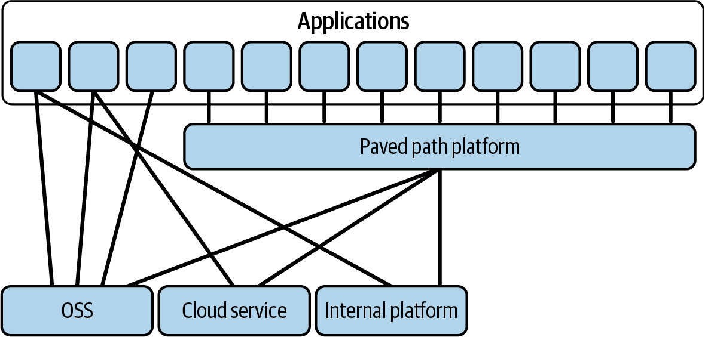
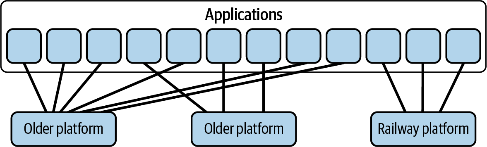
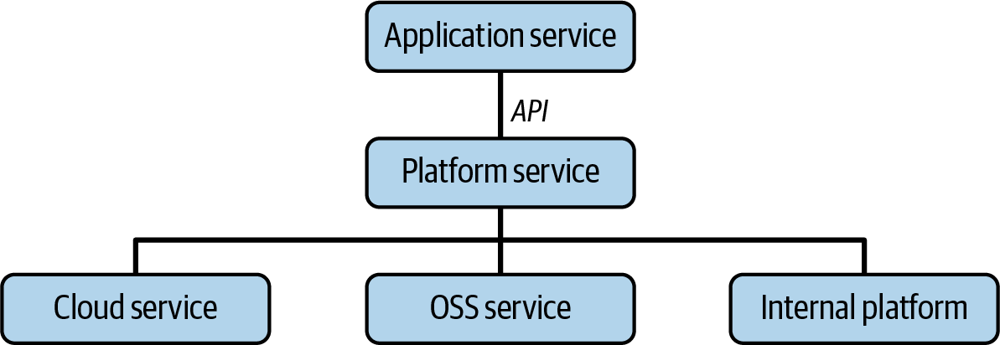
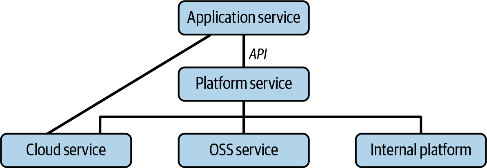
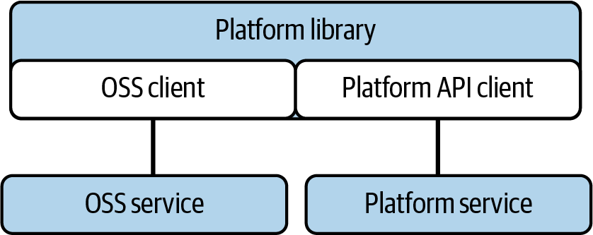
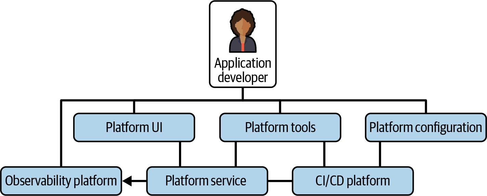
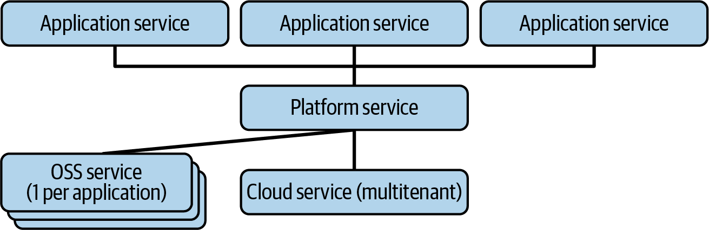
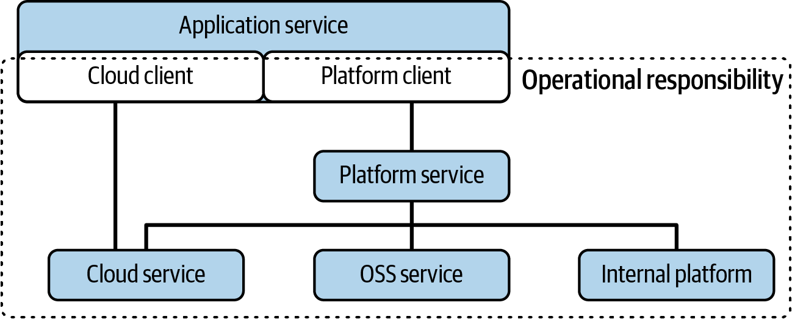

# Chapter 2: The Pillars of Platform Engineering

> **Part I — The What and Why of Platform Engineering**

> *"The carrying power of a bridge is not the average strength of the pillars, but the strength of the weakest pillar."* — Zygmunt Bauman

Chapter 1 explained *why* platform engineering exists — to escape the over-general swamp of complexity that cloud and open source created. This chapter answers the natural follow-up: *what does platform engineering actually consist of?* What are its essential components, without which you're just pushing complexity around rather than managing it?

The authors decompose platform engineering into four pillars, derived directly from their definition:

> Platform engineering is the discipline of developing and operating platforms. The goal of this discipline is to manage overall system complexity in order to deliver leverage to the business. It does this by taking a **curated product approach** to developing platforms as **software-based abstractions** that serve a **broad base of application developers**, **operating** them as foundations of the business.

Each pillar is a load-bearing structural element. Like Bauman's bridge, a platform that excels at three pillars but neglects one will fail at the weakest point — you can't compensate for missing operational discipline with outstanding product thinking, and you can't make up for absent software engineering by having great customer empathy.

## Table of Contents

- [The Four Pillars at a Glance](#the-four-pillars-at-a-glance)
- [Pillar 1: Taking a Curated Product Approach](#pillar-1-taking-a-curated-product-approach)
  - [Why "Curated" AND "Product" Together](#why-curated-and-product-together)
  - [Paved Paths — The 80% Play](#paved-paths--the-80-play)
  - [Railways — Filling Meaningful Gaps](#railways--filling-meaningful-gaps)
- [Pillar 2: Developing Software-Based Abstractions](#pillar-2-developing-software-based-abstractions)
  - [Platform Services and APIs](#platform-services-and-apis)
  - [Thick Clients](#thick-clients)
  - [OSS Customizations](#oss-customizations)
  - [Metadata Registries and IDPs](#metadata-registries-and-idps)
- [Pillar 3: Serving a Broad Base of Application Developers](#pillar-3-serving-a-broad-base-of-application-developers)
  - [Self-Service Interfaces](#self-service-interfaces)
  - [User Observability](#user-observability)
  - [Guardrails](#guardrails)
  - [Multitenancy](#multitenancy)
- [Pillar 4: Operating as Foundations](#pillar-4-operating-as-foundations)
  - [Responsibility for the Full Platform](#responsibility-for-the-full-platform)
  - [Supporting the Platform](#supporting-the-platform)
  - [Operational Discipline](#operational-discipline)
- [What Does Generative AI Mean for Platform Engineering?](#what-does-generative-ai-mean-for-platform-engineering)
- [Wrapping Up](#wrapping-up)

**Block types:** [Core Concept] [Deep Dive] [Anti-Pattern] [Worked Example] [Organizational Reality] [SRE/Production Lens] [Comparison] [2025 Context] [AI Impact]

---

## The Four Pillars at a Glance

| Pillar | One-Liner | Without It, You Get... |
|--------|-----------|------------------------|
| **Product** — Curated product approach | Deliberate, opinionated choices about what to offer and what to leave out, driven by customer needs | Service center (no strategy) or rigid dictates (no customer empathy) |
| **Development** — Software-based abstractions | Building real software that hides underlying complexity behind simpler interfaces | Just operations with customer empathy — no leverage through automation |
| **Breadth** — Serving a broad base | Supporting many application teams, not just one or two, through self-service and multitenancy | An internal service, not a scaled platform |
| **Operations** — Operating as foundations | Running the full platform (including OSS/vendor dependencies) with operational discipline | No one trusts your offerings — users become reluctant infrastructure experts |

> **[Core Concept: The Bridge Metaphor — Why All Four Must Be Strong]**
>
> Bauman's bridge quote isn't decorative. It encodes the central design insight of this chapter: platform engineering is an AND proposition, not an OR proposition.
>
> Consider what happens when you're strong on three pillars but weak on one:
>
> - **Great product thinking + software + operations, but narrow audience** — You've built an excellent internal tool for two teams. That's a shared service, not a platform. You don't get organizational leverage.
> - **Great product thinking + software + breadth, but weak operations** — You've built something everyone wants to use... until they get paged at 3 a.m. for platform issues they can't fix. Adoption collapses. Teams build workarounds.
> - **Great product thinking + breadth + operations, but no software** — You have a well-run infrastructure team with good customer empathy. But without software abstractions, every interaction requires manual coordination or the user absorbing complexity themselves. You can't scale.
> - **Great software + breadth + operations, but no product thinking** — You've built impressive technology that nobody asked for, or that solves the wrong problem, or that has an interface only its creators can love. Adoption is forced, not earned.
>
> The weakest pillar determines the carrying capacity of the whole platform. This is why the rest of the book dedicates entire chapters to each pillar's concerns: product (Chapter 5), development (implied throughout), operational excellence (Chapter 6), and breadth/scale (Chapters 7-9).

---

## Pillar 1: Taking a Curated Product Approach

### Why "Curated" AND "Product" Together

The authors are precise in their language here — they don't say "product approach" alone, and they don't say "curated approach" alone. They insist on both together, because each without the other produces a recognizable failure mode:

**Product without curation = a service center.** You respond to every customer request. You're helpful, fast, attentive. But you have no coherent strategy. Your platform grows in every direction, accumulating features nobody asked you to remove. Over time, you're maintaining everything and innovating on nothing. You're reactive, not strategic.

**Curation without product = rigid, imposed standards.** You have strong opinions about what should be offered. But those opinions are derived from technical preferences or architectural ideals rather than from understanding what your customers actually need. Application teams feel constrained by choices that don't serve them. They route around your platform. Shadow IT flourishes.

The combination — *curated product* — means: deeply understand your customers' needs (product thinking), and then deliberately choose which subset of those needs to serve exceptionally well (curation), while saying no to the rest. This is the Steve Jobs principle applied to internal infrastructure: the quality of what you leave out defines you as much as what you include.

> **[Organizational Reality: Two Failure Modes in the Wild]**
>
> **The service center trap (product without curation):**
> You'll recognize this by how the platform team talks about their work. If they say things like "we support PostgreSQL, MySQL, MongoDB, DynamoDB, Redis, Cassandra, CockroachDB, and we're evaluating TiDB because Team X asked for it" — they've become a service center. They're responding to demand without curating it. Every new addition fragments their expertise, increases their operational burden, and makes their platform wider but shallower.
>
> **The ivory tower trap (curation without product):**
> You'll recognize this when application teams say "the platform team decided we all have to use X, but X doesn't support our use case" or "the platform is great if you fit the golden path, but our team doesn't, and nobody will help us." The platform team has opinions, but those opinions weren't derived from customer research — they're derived from the platform team's own preferences, convenience, or architectural ideals.
>
> **The sweet spot:** "We support PostgreSQL and DynamoDB. We chose these because 85% of our application teams' data access patterns fit one of these two models. Here's a decision guide for which to pick. If you have a genuinely different need, talk to us — we want to understand it, even if we can't serve it today."

### Paved Paths — The 80% Play

The first type of curated platform product is the **paved path**. A paved path layers multiple existing offerings together into easy-to-use workflows. It doesn't necessarily create new infrastructure — instead, it composes existing pieces (OSS tools, cloud services, internal systems) and hides the wiring complexity.


*Figure 2-1. Architecture of a paved path platform. Most applications connect through the paved path, which integrates OSS, cloud services, and internal platforms into a single coherent experience. A few applications with outlier needs connect directly to underlying services — the path is paved, not fenced.*

The key design principle here is the **Pareto principle**: identify the 20% of use cases that cover 80% of needs, and make those work extremely well. The paved path is deliberately not a forced offering — teams with outlier needs can step off it. This is crucial for adoption: when people know they *can* leave, they're more willing to stay. It's the difference between a highway (fast, convenient, you choose to use it) and a railroad (you go where the tracks go, period).

> **[Worked Example: A Paved Path for Service Deployment]**
>
> Consider a company where deploying a new microservice involves: writing a Dockerfile, creating Kubernetes manifests (Deployment, Service, HPA, Ingress, NetworkPolicy), configuring CI/CD (build pipeline, test stage, canary deploy), setting up monitoring (Prometheus alerts, Grafana dashboard, PagerDuty integration), and wiring DNS.
>
> Without a paved path, each team does all of this independently. Teams copy YAML from other teams, modify it, get some things wrong, and discover the mistakes at 2 a.m. three months later.
>
> The paved path approach: build a single workflow (a CLI command or portal form) where a developer specifies their service name, language, expected traffic, and team ownership. The paved path composes the correct Dockerfile template, K8s manifests, CI/CD pipeline, monitoring stack, and DNS entry — all pre-configured with sensible defaults and integrated with each other.
>
> **What makes this "curated":** The paved path supports Java, Go, Python, and Node.js — because those cover 90% of services at this company. It does NOT support Rust, Haskell, or Elixir. If a team needs Rust, they step off the path — they write their own Dockerfile and deployment config. That's fine. The platform doesn't fight them; it just doesn't serve them on this axis.
>
> **The 80/20 in action:** 80% of services at this company are stateless HTTP services with a database. The paved path makes that case trivial. The 15% that are background workers or event processors get partial support (some parts of the path apply, others don't). The 5% that are truly unique (the ML inference service, the real-time websocket gateway) are off-path entirely. The platform team knows this and accepts it.

### Railways — Filling Meaningful Gaps

The second type of curated platform product is the **railway**. Unlike paved paths, which compose existing things together, railways fill gaps where no suitable product exists at all. These are new platforms built from scratch to serve a need that many application teams share but no one has solved centrally.


*Figure 2-2. Architecture of a railway platform. Applications connect to the railway platform (and possibly to older platforms) to access a capability that didn't previously exist as a shared offering. The railway is a major new infrastructure investment.*

Railways emerge from a specific discovery process:

1. **Pattern recognition:** The platform team notices that multiple application teams have built their own versions of similar functionality (each team has their own batch job runner, their own notification system, their own feature flag mechanism).
2. **Investigation:** The platform team studies how teams are working around the missing capability — what prototypes they've built, what pain points they experience.
3. **Generalization:** Taking the best ideas from these team-specific prototypes and building a properly engineered, broadly useful platform.

The authors mention specific railways they've built: a batch job platform, a notifications system, and a global application configuration platform. Each of these represents a meaningful gap — something many teams needed, that no single team could justify building to production quality, but that a platform team could build once and serve broadly.

> **[Deep Dive: Paved Paths vs. Railways — When to Build Which]**
>
> | Dimension | Paved Path | Railway |
> |-----------|-----------|---------|
> | **Nature** | Composes existing offerings into a workflow | Creates a new capability from scratch |
> | **Investment** | Moderate — glue and UX over existing systems | High — major infrastructure investment |
> | **Discovery signal** | "Using these 5 things together is painful" | "3+ teams have each built their own version of X" |
> | **Risk** | Low — existing systems work, you're just smoothing | High — you're building new infrastructure that must be reliable |
> | **Time to value** | Weeks to months | Months to a year or more |
> | **Example** | "Deploy a service" workflow integrating Docker + K8s + CI/CD + monitoring | A batch job platform replacing 8 team-specific cron-based solutions |
>
> **When to invest in a railway:**
> - At least 3 teams have independently built something similar (proves demand)
> - The team-built solutions are causing operational pain (proves need for centralization)
> - The domain is complex enough that a well-engineered shared solution is meaningfully better than N team solutions (proves leverage)
> - The capability will be needed for years, not months (proves return on major investment)
>
> **A railway that should NOT be built:** Two teams want a graph database. That's not enough signal. Maybe wait until five teams want graph querying, study their use cases, and THEN decide whether a railway or a paved path over a managed service (like Neptune or Neo4j Aura) is the right answer.

> **[Real-World Implementations: Paved Paths and Railways]**
>
> **Paved path scaffolding — Backstage Software Templates (Spotify → CNCF):**
> Developer fills in a form ("service name, language, owner") and the template generates a full repo with Dockerfile, CI pipeline, K8s manifests, monitoring config — all pre-wired. This is the chapter's "single workflow where a developer specifies a few things and the path composes the rest" made concrete. The 80/20 curation shows up in which templates exist: if your org has templates for Java/Go/Python but not Rust, that's a deliberate product decision about what the paved path covers.
>
> **Paved path orchestration — Humanitec Platform Orchestrator / Score:**
> Developer writes a ~10-line "Score" file describing workload intent (e.g., "I need a DNS name, a Postgres database, and a container running this image"). The orchestrator resolves this against environment-specific rules — same workload definition produces different infrastructure in dev vs. staging vs. prod. This implements the book's key paved-path principle: hide the wiring complexity of composing multiple systems. The developer never touches Terraform, Helm, or cloud-native APIs directly.
>
> **Paved path composition — Kratix (OSS, Syntasso):**
> Platform team defines "Promises" (compound resources) that compose multiple tools behind a single K8s-style API. E.g., a `PostgreSQL` Promise might create an RDS instance + configure backups + wire monitoring + register in service catalog — all from one YAML apply. Maps to the chapter's concept that paved paths don't create new infrastructure, they compose existing pieces and hide the integration work.
>
> **Railway: batch/workflow — Temporal:**
> The classic railway pattern: multiple teams independently built retry/scheduling/state-machine logic inside their services. Temporal extracts that into a durable workflow engine — developers write workflow code in their language, Temporal handles retries, timeouts, state persistence, and visibility. One centrally-operated platform replaces N team-specific cron-based solutions. Airflow and Argo Workflows fill similar gaps for DAG-oriented batch processing.
>
> **Railway: feature flags — LaunchDarkly / OpenFeature (CNCF):**
> The discovery pattern that births railways: "3+ teams have each built their own feature flag mechanism" (config files, environment variables, database-backed toggles). LaunchDarkly and OSS alternatives (Unleash, Flipt) provide a proper platform: flag evaluation, targeting rules, gradual rollouts, audit trails, and kill switches — shared across all services. OpenFeature (CNCF) standardizes the client API so teams aren't locked to one vendor — the platform team picks the backend, developers use a common SDK.
>
> **Railway: notifications — Novu (OSS):**
> Every team eventually builds email/SMS/push notification logic. Novu centralizes this: one API for multi-channel notifications with template management, delivery guarantees, preference centers, and observability. Maps directly to the chapter's railway example of a "notifications system" that no single team could justify building to production quality but a platform team builds once and serves broadly.

> **[Comparison: Team Topologies Connection — "Complicated Subsystem" as Railway]**
>
> In Team Topologies terminology, a railway platform often maps to what they call a "complicated subsystem" team — a team that owns a component requiring deep specialist knowledge that would be unreasonable to expect stream-aligned (application) teams to develop or maintain.
>
> The key difference: Team Topologies focuses on *why* such teams exist (cognitive load management). This book focuses on *how* to run them (as curated products with operational foundations). A railway team IS a complicated subsystem team — but one that explicitly adopts all four pillars: product thinking (understanding what customers need from this capability), software engineering (building proper abstractions), breadth (serving many teams, not just the initial requesters), and operations (running it as a foundation).

---

## Pillar 2: Developing Software-Based Abstractions

The authors state this with unusual directness:

> **"If you aren't building software, you aren't doing platform engineering."**

This is a deliberately provocative line, and they mean it. If a wiki with pointers to approved cloud offerings and onboarding instructions is sufficient for your organization, that's legitimate — but it's not platform engineering. Platform engineering starts when you write software that creates abstractions over underlying complexity, enabling application teams to interact with simpler interfaces rather than wrestling with the full complexity of the systems underneath.

The corollary: if you're starting a platform engineering initiative without software engineers, you're setting up for failure. Whether your platform offers an internal billing system or infrastructure-level compute, the leverage comes from software logic that abstracts underlying systems. Without that abstraction, you're vending infrastructure and passing all complexity through to users.

> **[Core Concept: The Abstraction Test — "Are You Building or Just Pointing?"]**
>
> A quick test to determine whether something qualifies as platform engineering under this definition:
>
> | What you offer | Building software? | Platform engineering? |
> |---------------|-------------------|---------------------|
> | A wiki page explaining how to set up PostgreSQL on AWS | No | No — documentation |
> | A Terraform module that provisions PostgreSQL with good defaults | Barely — it's configuration, not logic | Borderline — useful, but no ongoing abstraction |
> | A CLI tool that provisions, configures, monitors, and manages PostgreSQL, handling failover and upgrades automatically | Yes — significant logic | Yes — software abstracts complexity away |
> | An API where developers request "a database" and the platform decides implementation details, handles lifecycle, and shields them from operational concerns | Yes — substantial orchestration logic | Yes — full abstraction with ongoing value |
>
> The progression from top to bottom is the progression from "helpful documentation" through "useful tooling" to "genuine platform engineering." The defining line is where software logic starts making decisions and coordinating systems on behalf of the user — not just templating their inputs into configuration.

### Platform Services and APIs

The most fundamental abstraction a platform builds is a **service with APIs**. This is classic service-oriented architecture applied internally: the platform service implements logic to coordinate the behavior of underlying OSS, vendor, and in-house systems, presenting abstract APIs for application systems to use.


*Figure 2-3. Architecture of the service and API components of a platform. The application service talks to the platform through an API. The platform service coordinates cloud services, OSS services, and internal platforms behind that API, hiding their complexity.*

A few important details the authors clarify:

- A single platform may split into multiple service components internally — the "platform service" in the diagram might be a set of cooperating microservices.
- The "API" doesn't have to be traditional synchronous request/response. It could involve queuing, asynchronous messaging, or event-driven interactions.
- The service and its APIs are *why* you need software engineers from the start. Without them, you cannot create the abstractions that simplify things for application developers.

**The Encapsulation Warning:**

The authors include a critical warning for infrastructure platform teams: don't over-encapsulate. Those with pure software backgrounds often believe an API must fully encapsulate underlying systems. For example, a team whose platform is built on PostgreSQL might propose replacing direct SQL access with a proprietary API — so they can "control their fate" with migrations.


*Figure 2-4. Architecture of a platform that avoids full encapsulation. Most platform dependencies are behind the API, but one (the cloud service on the left) is left exposed. The application service can interact with it directly.*

The authors' test for when full encapsulation is appropriate:

> **Does full encapsulation make application engineers MORE productive — or does it just make things easier for the platform team to manage?**

If you encapsulate PostgreSQL behind a custom API, you've divorced your users from the entire PostgreSQL ecosystem: public documentation, Stack Overflow answers, community tools, years of institutional knowledge. You've replaced a globally understood interface (SQL) with a proprietary one that only your team documents. Unless your API is genuinely simpler and more productive for the specific use cases your customers have, you've made their lives harder while making yours easier.

> **[Anti-Pattern: The Over-Encapsulation Trap]**
>
> **How it starts:** The database platform team says "We need to fully encapsulate PostgreSQL behind our API so we can migrate to a different database engine in the future without affecting users."
>
> **Why it sounds smart:** Migration flexibility. Controlled surface area. Clean abstractions.
>
> **Why it usually fails:**
>
> 1. **You're building a worse version of something that already exists.** PostgreSQL's query interface has been refined over 30+ years. Your custom API will be a subset, full of gaps that emerge over time as users hit edges you didn't anticipate.
>
> 2. **You've destroyed the ecosystem advantage.** When a developer has a PostgreSQL question, they can Google it and find thousands of answers. When they have a question about your custom API, they can... ask your team in Slack. You've become the documentation, the support, and the community — for an interface that didn't need to be custom.
>
> 3. **The migration rarely happens.** The "we might switch databases someday" argument sounds prudent, but in practice, most platforms don't switch their core data store. You've paid a large ongoing tax (maintaining the encapsulation layer) for an event that may never occur.
>
> 4. **Users route around it.** Application developers who know they're on PostgreSQL will eventually connect directly to bypass your API when they need a feature you don't expose. Now you have two paths — worse than having one.
>
> **The better approach:** Encapsulate the *operational* complexity (provisioning, failover, backups, monitoring, connection management) but leave the *interface* standard (SQL). Users get PostgreSQL's query language and ecosystem. The platform handles everything about running PostgreSQL reliably. That's the right abstraction boundary for most infrastructure platforms.
>
> **When full encapsulation IS appropriate:** When your abstraction genuinely adds value beyond what the underlying system provides. A "message bus" API that handles routing, retry logic, dead-letter queuing, and schema evolution across multiple underlying systems (Kafka + SQS + internal queues) is more productive for users than exposing each system's native API. The test is always productivity from the user's perspective, not convenience from the platform team's perspective.

### Thick Clients

Sometimes the right abstraction lives partly in the client — code that runs within the application's process rather than in a remote platform service. This can be a **thick client library** or an executable binary (historically called a "daemon," now often called a "sidecar").


*Figure 2-5. Architecture of the thick client component of a platform. The "platform library" bundles an OSS client and a Platform API client together. The application includes this library, which handles communication with both OSS services and platform services.*

**When thick clients provide value:**

- **Reliability:** Client-side retry logic, circuit breakers, and failover that don't depend on network roundtrips to a central service
- **Performance:** Local caching, sharding logic, and load balancing decisions made at the client without added latency
- **Legacy support:** FUSE mounts that present a platform storage system as a normal filesystem for legacy applications that can't use new APIs

**The costs that make platform teams hesitate:**

- **Observability:** Code running inside the customer's process is harder to monitor and debug — you don't control the environment
- **Upgrade cycles:** Unlike a server-side platform service (which the platform team can deploy at will), a client library upgrade requires every application team to pull the new version. If teams don't upgrade, you end up supporting multiple old versions simultaneously.
- **Debugging complexity:** When something goes wrong, was it the platform library or the application code? The boundaries blur.

The authors' guidance: prefer putting complex coordination logic in the platform service (where you control deployment and observability), but don't dismiss thick clients for ideological reasons. Sometimes the trade-off genuinely favors client-side logic — especially for performance-sensitive paths where an extra network hop is unacceptable.

> **[SRE/Production Lens: The Sidecar Pattern and Operational Ownership]**
>
> The thick client problem maps directly to a familiar SRE concern: where does operational responsibility lie?
>
> With a server-side platform service, the boundary is clean: the platform team owns everything behind the API. They deploy, monitor, page, and fix. With a thick client or sidecar, the platform's code runs in the application team's infrastructure. When the sidecar consumes too much memory and the application pod gets OOM-killed — who's responsible? When the client library has a bug that causes connection leaks — who gets paged?
>
> **Practical ownership models:**
>
> | Model | How it works | Trade-off |
> |-------|-------------|-----------|
> | **Platform owns the sidecar** | Platform team monitors sidecar metrics across all deployments, detects anomalies, pushes upgrades | Works well, but requires the platform team to have visibility into every application's environment |
> | **Application owns the library** | Application team is responsible for upgrading and monitoring the client library | Scales better, but platform team loses control over rollout pace and can't guarantee library versions are consistent |
> | **Hybrid: platform pushes, app monitors** | Platform team pushes automated sidecar/library upgrades; application team pages for any issues in their pod | The most common model in practice — shared responsibility with clear escalation paths |
>
> The key SRE lesson: wherever you put code, you must put observability. If you ship a thick client, instrument it. Emit metrics from within the library (request latency, error rates, cache hit ratios, connection pool usage). Make those metrics flow to the platform team's dashboards, not just the application team's. Otherwise you've created a black box that nobody monitors until it causes an outage.

### OSS Customizations

Not every platform abstraction needs to be built from scratch. Sometimes an OSS project is *close* to providing what application engineers need, and the platform team's job is to customize it to fit the company's specific requirements.

This takes several forms:

- **Plugins:** The platform team builds plugins to an OSS system (e.g., a custom Kafka serializer, a custom Prometheus exporter, a Kubernetes operator)
- **Forks:** When the customization is too deep for plugins, the platform team maintains a fork of the OSS project
- **Upstream contribution:** The platform team contributes their customizations back to the OSS project, possibly becoming maintainers or leaders

The ability to work within and modify OSS code is part of the value-add of platform engineering. This requires software engineers who can read, understand, and modify complex codebases they didn't create — a different skill set than writing green-field services.

> **[Deep Dive: The Fork Decision — When to Fork vs. Contribute vs. Wrap]**
>
> When your platform team needs functionality that an OSS project doesn't provide, you face a three-way decision:
>
> | Approach | When to use | Long-term cost |
> |----------|-------------|----------------|
> | **Contribute upstream** | The functionality is generally useful; the project accepts contributions; you can wait for the review/merge cycle | Low — the community maintains it alongside you |
> | **Plugin/extension** | The project has a plugin architecture; your need is company-specific; you don't want to modify core code | Medium — you maintain the plugin across OSS version upgrades |
> | **Fork** | The change is invasive; the project won't accept it; you need it urgently; or the project is unmaintained | High — you now own all future security patches, bug fixes, and compatibility updates for your fork |
>
> **The fork tax:** Every fork starts as "we just need this one change." Over time, the fork diverges from upstream. Security patches require manual backporting. New features from the community don't automatically flow to your version. Eventually, you're maintaining a proprietary version of what was once open source — with all the cost that implies.
>
> **The practical rule:** Fork only when the ROI clearly justifies the long-term maintenance cost. A fork of a critical system (like a database or message broker) that you run at scale might be worth it. A fork of a CLI tool because you wanted to change the output format is almost never worth it.

### Metadata Registries and IDPs

A recurring need in platform engineering is answering questions like: Who owns this service? Which teams use this storage bucket? What would be affected if we deprecated this API? To answer these questions, you need metadata about every primitive the platform manages.

The authors identify three emerging approaches to managing this metadata:

**Tag management systems:** Cloud providers and observability platforms let you tag resources with metadata. Platform teams enforce tagging schemas and use exploration queries to answer questions about ownership, cost allocation, and usage patterns.

**API/schema registries:** Focused on compile-time information about platform and application APIs — gathering schemas, versions, and documentation into one place for governance and exploration.

**Internal Developer Portals (IDPs):** Take registries further by offering a centralized catalog for API metadata, resource metadata, AND platform configuration, with a programmable UI that lets each platform team plug in their offering.

The authors note a critical challenge: registries fail when they depend on engineers manually populating metadata. Engineers hate being curators. Success depends on *automatic* capture and labeling of metadata by the platform itself — not manual data entry by developers.

> **[Real-World Implementations: Software-Based Abstractions]**
>
> **Platform service + API — Crossplane (CNCF):**
> The chapter's "platform service that coordinates underlying systems behind an API" made literal. Crossplane runs as a K8s controller: you define a `CompositeResourceDefinition` (your platform's API) that maps to a "Composition" of cloud resources (RDS + security group + IAM role + monitoring). Developers `kubectl apply` a 5-line claim; Crossplane reconciles the full infrastructure stack. This is the diagram from Figure 2-3 — application talks to platform API, platform coordinates cloud/OSS/internal services behind it. Importantly, it follows the "don't over-encapsulate" guidance: developers still get a standard PostgreSQL connection string, not a proprietary query API.
>
> **Thick client / sidecar — Envoy Proxy (Lyft → CNCF):**
> The canonical sidecar pattern from the chapter's thick-client discussion. Envoy runs alongside every application pod, handling service discovery, load balancing, mTLS, retries, circuit breaking, and observability — all without the application knowing. This is "reliability logic that doesn't depend on network roundtrips to a central service" (it's in-process-adjacent). The operational ownership challenge the chapter describes plays out exactly: who's responsible when Envoy's memory usage grows and the pod gets OOM-killed? Istio/Linkerd service meshes answer this with centralized control planes that push config to all Envoys — the "platform owns the sidecar" model from the SRE lens section.
>
> **Thick client / sidecar — Dapr (Microsoft, CNCF incubating):**
> Takes the thick-client abstraction further: provides portable building blocks (pub/sub, state management, service invocation, secrets) as a sidecar. Application calls Dapr's local HTTP/gRPC API; Dapr translates to whatever backend the platform team configured (Kafka, Redis, Vault, etc.). This is a full illustration of the "encapsulate operational complexity but leave the interface standard" principle — the API is simple and portable, the platform handles which systems actually run underneath.
>
> **OSS customization via operators — CloudNativePG / Zalando Postgres Operator:**
> The chapter says "sometimes an OSS project is close to what you need, and the platform team customizes it." These K8s operators are exactly that: PostgreSQL is the OSS core; the operator adds platform-grade lifecycle management (automated failover, backup scheduling, rolling upgrades, connection pooling). Platform teams extend them with custom plugins (e.g., adding company-specific backup targets or integrating with internal secret stores). This is the "plugin/extension" approach from the fork decision — you customize without forking PostgreSQL itself.
>
> **Plugin architectures — Terraform Providers:**
> Terraform's provider model demonstrates how OSS plugin architectures enable platform teams to extend without forking. Need to manage an internal system through Terraform? Write a provider (Go plugin). Your platform's users get a familiar `terraform apply` workflow; the provider encapsulates your proprietary API behind it. The cost the chapter warns about is real: you now maintain that provider across Terraform version upgrades.
>
> **Metadata registries / IDPs — Backstage Software Catalog (Spotify → CNCF):**
> Implements the "metadata registry" concept: every service, API, library, infrastructure component is registered as an entity with ownership, lifecycle stage, dependencies, and documentation links. The key design choice that maps to the chapter's warning about manual curation: Backstage supports `catalog-info.yaml` files in each repo (auto-discovered via integration) so metadata is code-adjacent and updated alongside the service, not manually entered in a separate system. Port and OpsLevel take a different approach — API-driven ingestion from multiple sources (cloud APIs, K8s, CI/CD) to auto-populate without requiring developers to maintain YAML files at all.

> **[Core Concept: The IDP Question — Required or Optional?]**
>
> The authors push back explicitly against the narrative (common in 2024 vendor marketing) that an Internal Developer Portal is a *required* component of platform engineering:
>
> *"An IDP is not a requirement for building a great platform."*
>
> Their guidance is simple: **Does your customers' biggest problem involve "figuring out where to go"?** If application developers are constantly lost — unsure which platform offers what, unable to find documentation, confused about which UI to use for which task — then yes, an IDP that consolidates everything into one front door makes sense.
>
> But if developers' biggest problems are "the platform is unreliable" or "provisioning takes too long" or "I can't debug production issues" — an IDP doesn't solve those. You'd be building a pretty front door to a house with a leaking roof.
>
> **The practical test:** Ask your application developers "what's your biggest pain point with the platform?" If "finding things" is in their top 3, invest in an IDP. If it's further down the list, use wikis for documentation and links to APIs. Spend your engineering time on whatever IS in the top 3.
>
> **The vendor trap:** Many IDP vendors position their product as *the* platform engineering solution. The authors are clearly saying: the IDP is one possible component of a platform. It is not the platform itself, and it's not always the highest-priority component to build.

> **[AI Impact: AI-Powered Metadata Population and Discovery]**
>
> The authors identify a core problem: metadata registries fail when engineers must manually populate them. This is precisely where AI creates immediate value — not by replacing the platform, but by solving the "nobody wants to be a curator" problem.
>
> **Automated metadata enrichment:**
> - LLMs can analyze code repositories to automatically detect and tag service ownership, API versions, dependency relationships, and technology stacks — without requiring engineers to fill out forms.
> - Natural language analysis of commit messages, PR descriptions, and documentation can infer service purpose, team context, and lifecycle stage.
> - Anomaly detection on tags can catch stale metadata: "This service was tagged as owned by Team X, but Team X hasn't committed to this repo in 6 months."
>
> **Natural language discovery over registries:**
> Instead of requiring developers to learn the registry's query syntax or browse its UI, an AI layer lets them ask: "Which services call the payments API?" or "Who owns the service that handles user notifications in EU regions?" The AI translates natural language into registry queries — dramatically improving the "figuring out where to go" problem that IDPs try to solve.
>
> **The implication:** AI-powered metadata management may reduce the urgency of building a full IDP. If your registry is automatically populated and queryable via natural language, you get many of the IDP's discovery benefits without the heavy investment in a unified portal UI.

---

## Pillar 3: Serving a Broad Base of Application Developers

The target audience for platforms is application developers — and not one or two teams, but a *broad base* of teams. This is what distinguishes a platform from a shared service. Many teams in a microservices architecture build APIs used by other teams. That alone doesn't make them a platform team. The "platform" distinction emerges when usage broadens enough that you need to invest not just in features, but in capabilities that make the system cheaper, safer, and easier to use at scale.

The authors identify four key capabilities that enable serving breadth:

### Self-Service Interfaces

To scalably support a large customer base, self-service is non-negotiable. If every new customer onboarding requires the platform team to do manual work — or worse, requires multiple parts of the team to do coordinated manual work — you lose your leverage. The platform team becomes a bottleneck, and you're back to the ticket-queue anti-pattern from Chapter 1.


*Figure 2-6. Architecture of the self-service components of a platform. Application developers interact with the platform through three channels: a Platform UI (graphical/web), Platform tools (CLI), and Platform configuration (which integrates with CI/CD). These connect to the underlying platform services, observability platform, and CI/CD platform.*

Self-service interfaces can take multiple forms:

- **Web/graphical UIs** — good for discovery, onboarding, and infrequent tasks
- **CLI tools** — good for power users, scriptable workflows, and developer-familiar interactions
- **CI/CD integration** — good for configuration-as-code and GitOps workflows where platform changes are committed, reviewed, and applied automatically

The best platform offerings provide **layered interfaces**: easy-to-use defaults for novice users (fill in a form, click "create") AND access to underlying building blocks for power users who need more advanced control. This dual-mode design avoids the trap of making things so simple that experts feel constrained while also not making things so complex that beginners are overwhelmed.

> **[Worked Example: Layered Self-Service in Practice]**
>
> Consider a database platform offering self-service provisioning:
>
> **Novice path (web UI):**
> - Developer opens the platform portal
> - Selects "Create Database"
> - Chooses from 3 options: "Small" (dev/test), "Standard" (production), "Large" (high-traffic production)
> - Fills in: database name, owning team, purpose
> - Clicks "Create" — gets a connection string in 3 minutes
> - Behind the scenes: the platform chose PostgreSQL 16, multi-AZ, daily backups retained 30 days, connection pooling via PgBouncer, standard monitoring alerts, appropriate instance size for the tier
>
> **Power user path (CLI + config):**
> ```yaml
> apiVersion: platform/v1
> kind: Database
> spec:
>   engine: postgresql
>   version: "16"
>   size: db.r6g.xlarge
>   storage: 500Gi
>   replicas: 3
>   backup:
>     retention: 90d
>     pitr: true
>   pooler:
>     max_connections: 500
>     mode: transaction
>   extensions:
>     - postgis
>     - pg_trgm
> ```
>
> Both paths produce a production-ready database. The novice path makes decisions for you. The power user path lets you make all decisions explicitly. The critical insight: both paths use the SAME underlying platform service. The layered interface is a UX choice, not an architectural split.

> **[AI Impact: Conversational Self-Service — The Next Interface Layer]**
>
> The three self-service channels (UI, CLI, CI/CD config) are all structured interfaces that require learning syntax or navigation. AI enables a fourth channel: **conversational self-service**.
>
> A developer messages the platform's AI assistant: "I need a PostgreSQL database for our new recommendation engine. It'll handle about 1000 queries per second, needs PostGIS for geolocation, and we'll probably grow 50GB per month."
>
> The AI responds: "Based on your requirements, I'd recommend a Standard-tier PostgreSQL 16 instance with PostGIS enabled, 200GB initial storage with auto-scaling, and connection pooling configured for your query volume. I'll set up the standard monitoring alerts and wire it to your team's on-call rotation. Should I create this? Here's the equivalent config if you want to review it first..." [shows the YAML]
>
> **Why this is particularly powerful for breadth:**
> - New engineers who haven't learned the platform yet can be productive immediately
> - The AI can recommend the *right* tier/configuration based on stated needs — reducing the chance of misconfiguration
> - The AI surfaces guardrails naturally ("I notice you asked for public network access — our security policy requires private endpoints for databases. Here's how to connect via our service mesh instead...")
> - Support volume decreases because "how do I..." questions get answered without a human
>
> **The prerequisite the authors would emphasize:** This only works if you have well-designed platform APIs and clear documentation behind the AI. The AI is an interface layer over a well-built platform, not a substitute for one.

### User Observability

A less-discussed but crucial form of self-service: helping developers debug their own problems with the platform. The authors cite Tanya Reilly (author of *The Staff Engineer's Path*):

> *"One of the goals we ask our platform teams to aim for is that a user of the platform should be able to tell whether they're doing something wrong or the platform is doing something wrong."*

This is an aspirational ideal you can never fully reach — but it's the right mindset. When a developer's application is misbehaving and it uses your platform, they should have enough observability to determine: "Is this my bug, or is the platform having a problem?" Without this, every issue becomes a Slack message to the platform team: "Hey, is the database platform having problems? My app is slow." Those messages multiply across a broad user base until the platform team is drowning in triage requests.

> **[SRE/Production Lens: User Observability as a Force Multiplier]**
>
> From an SRE perspective, user observability is about blast radius containment for support load. Consider the math:
>
> - 200 application teams use your platform
> - The platform has a minor issue affecting 5% of requests
> - Without user observability: 200 teams notice something is off. 50 file support tickets. 20 post in Slack. The platform team spends 2 hours responding to everyone before even starting to fix the problem.
> - With user observability: Each team's dashboard shows "Platform health: degraded — 5% error rate on database connections. Platform team is investigating (status page link)." Most teams self-serve this information. The platform team gets 3 tickets instead of 50.
>
> **What "user observability" looks like in practice:**
>
> | Layer | What to expose | How |
> |-------|---------------|-----|
> | **Request-level** | Latency, errors, and throughput for *this application's* platform calls | Per-tenant dashboards showing your requests vs. platform averages |
> | **Resource-level** | Current utilization of resources *this application* owns | "Your database is at 85% CPU" with historical trends |
> | **Platform health** | Overall platform status (is it me or them?) | Status page, health endpoint, clear error messages that distinguish "you sent a bad request" from "we're having problems" |
> | **Diagnostic** | Tools to investigate specific issues without platform team involvement | Query logs, slow query reports, connection pool stats, audit trails — self-serve |
>
> The investment in user observability pays off not just in reduced support volume, but in faster incident detection. Often, application teams notice platform issues before the platform team does — because they're watching their own metrics more closely. Good user observability turns your users into early-warning sensors.

### Guardrails

When serving a broad base of users, you cannot expect all of them to be experts in security, compliance, reliability, and cost optimization. A simple misconfiguration can be catastrophic: an S3 bucket made public, a database without encryption, a service with no rate limiting, an instance type that costs $10,000/month when $500/month would suffice.

Guardrails are the protections and default limits that make expensive misconfigurations highly unlikely. They represent the platform's opinions about what's safe, encoded as enforcement rather than documentation.

> **[Core Concept: Guardrails vs. Gates — The Distinction That Matters]**
>
> **Gates** block you and require external approval to proceed: "Submit a ticket to the security team and wait 2 weeks for review." Gates slow everyone down, create bottlenecks, and are bypassed when possible.
>
> **Guardrails** prevent dangerous defaults while allowing informed overrides: "This database will be created with encryption enabled and private network access. If you need to change these settings, here's how and here's what you're accepting responsibility for."
>
> The difference is philosophical: gates assume people will do the wrong thing unless stopped by authority. Guardrails assume people will do the right thing if the right thing is the easy thing.
>
> **Examples of effective guardrails:**
> - Storage buckets are private by default. Making one public requires an explicit flag AND triggers a security review notification.
> - Instances above a certain cost threshold require a cost justification tag. Below the threshold, no friction.
> - Services without health checks cannot be registered in the service mesh. The platform provides a default health check if you don't specify one.
> - Database connections are pooled by default. Opting out requires understanding why (the platform explains the trade-off).
>
> **Why in-house platforms have a guardrail advantage over raw cloud:** Cloud providers offer generic guardrails (IAM policies, SCPs, budget alerts). But your company has specific requirements that change over time — a new compliance regulation, a cost reduction initiative, a security incident that reveals a new threat vector. An in-house platform can react to these changing demands and implement company-specific guardrails without waiting for your cloud provider to build them.

### Multitenancy

A broadly-used platform achieves economic efficiency only if it's built to be **multitenant** — supporting different applications within the same runtime components. For cloud providers, multitenancy is about hardware efficiency. For internal platforms, it's about **engineering time efficiency**: instead of operating one system per application, a central team provides shared systems that support many applications.


*Figure 2-7. Architecture of a platform with hybrid multitenancy. Multiple application services connect to a single platform service. The platform service connects to a multitenant cloud service AND to per-application OSS service instances. This hybrid approach gives shared infrastructure for most concerns while isolating where needed.*

Multitenancy introduces hard engineering problems: noisy neighbor isolation, fair resource allocation, per-tenant observability, security boundaries between tenants, and blast radius containment when one tenant's workload misbehaves. This is another reason platform teams need strong software and systems engineers — these aren't problems you solve with configuration; they require genuine engineering.

The authors explicitly allow for a **hybrid approach**: some components are multitenant (shared across applications), others are single-tenant (one instance per application). The decision depends on the component's characteristics — a Kubernetes cluster might be multitenant (many services share it), while individual databases might be single-tenant (each application gets its own instance for isolation and performance predictability).

> **[Real-World Implementations: Breadth Capabilities]**
>
> **Self-service with layered interfaces — Backstage (Spotify → CNCF):**
> Implements the chapter's "layered self-service" pattern directly. Novice path: developer opens the portal, clicks "Create," picks a template, fills in a form, gets a working service. Power-user path: developers interact via `catalog-info.yaml` in code (GitOps model) and Backstage API. Both paths hit the same underlying platform services. Backstage's plugin architecture means each platform team plugs their offering into one portal — the "front door" that reduces the "figuring out where to go" problem across a broad user base.
>
> **Policy-as-code guardrails — OPA/Gatekeeper (CNCF):**
> The chapter's "guardrails not gates" principle in action. OPA runs as a Kubernetes admission webhook: when a developer submits a resource (Deployment, Ingress, etc.), OPA evaluates it against Rego policies *before* it reaches the cluster. A pod requesting a public load balancer without TLS gets rejected instantly with a message explaining why and how to fix it — no ticket queue, no human reviewer, developer fixes and resubmits in seconds. Policies are version-controlled and reviewed like code, so "company-specific guardrails" (the chapter's advantage of in-house platforms over raw cloud) evolve with the org's needs. **Kyverno** does the same but policies are written as Kubernetes YAML — no new language, which lowers the adoption barrier for the "broad base" the chapter emphasizes.
>
> **Cost guardrails — Infracost:**
> Runs in CI/CD: when a developer opens a PR that changes Terraform, Infracost comments on the PR with the projected monthly cost delta. This is the chapter's cost guardrail example ("instances above a certain cost threshold require justification") automated into the developer workflow. No gate — the PR isn't blocked — but the developer and reviewer see "$2,400/month → $9,100/month" before merging. Combined with OPA policies, you can enforce hard limits too (reject instance types above a cost ceiling).
>
> **Multitenancy isolation — vCluster (Loft Labs):**
> For platforms where Kubernetes namespace-level isolation isn't enough (teams need CRDs, cluster-scoped resources, or admin access for testing), vCluster creates lightweight virtual clusters inside a shared physical cluster. Each tenant gets what feels like their own cluster (full API, their own control plane) but the underlying compute is shared. This maps to the chapter's hybrid multitenancy model: shared infrastructure for cost efficiency, but strong isolation boundaries so one tenant's experiments can't affect others. Capsule takes a lighter approach — enforcing per-tenant policies/quotas within a shared cluster without the overhead of virtual control planes.
>
> **User observability — Grafana with multi-tenancy:**
> The chapter describes user observability as "per-tenant dashboards showing your requests vs. platform averages." Grafana implements this via datasource-level filtering and dashboard variables: platform teams build a template dashboard once, and each application team sees only their data (their service's latency, their database's CPU, their error rate vs. the platform-wide baseline). Combined with Grafana's alerting, each team can set their own notification preferences on top of platform-wide alerts — enabling the "is it me or is it the platform?" self-diagnosis the chapter advocates.

> **[SRE/Production Lens: Multitenancy and the Noisy Neighbor Problem]**
>
> Multitenancy is where platform engineering and SRE concerns most directly collide. Every SRE instinctively knows: shared infrastructure means shared failure modes. When 50 services share a platform component, one service's misbehavior can affect all 49 others.
>
> **The noisy neighbor scenario:** Application A has a bug that generates 100x normal database queries. In a single-tenant world, A's database gets slow and A's team gets paged. In a multitenant world, A's burst might exhaust connection pools, increase latencies, or trigger resource limits that affect Applications B through Z — none of whose teams did anything wrong.
>
> **How platform teams mitigate this (defense in depth):**
>
> 1. **Resource quotas per tenant:** CPU limits, memory limits, connection limits, request rate limits. Each tenant gets a guaranteed share and a maximum cap.
> 2. **Isolation at the right level:** Some components truly need per-tenant isolation (databases with strict latency SLAs). Others are safe to share with proper quotas (message queues, object storage).
> 3. **Priority tiers:** Critical-tier applications get resource reservations that can't be consumed by lower-tier neighbors. Non-critical workloads run on best-effort shared capacity.
> 4. **Automated detection and throttling:** When a tenant exceeds its fair share, automatically throttle that tenant rather than letting them degrade the experience for others.
> 5. **Per-tenant observability:** When issues occur, quickly identify WHICH tenant is causing the problem. Without per-tenant metrics, "the platform is slow" takes 30 minutes to diagnose. With per-tenant metrics, "Tenant A is consuming 80% of resources" takes 30 seconds.
>
> **The trade-off the platform team must make explicitly:** Higher multitenancy = more efficient (fewer total resources, lower cost, less operational surface area). Higher isolation = more reliable (one tenant can't affect others). Where you draw this line depends on your SLAs and your blast radius tolerance. Most mature platforms end up hybrid: shared where safe, isolated where critical.

---

## Pillar 4: Operating as Foundations

The fourth pillar is what separates platform engineering from pure product development. Platforms must be *foundations* — something rock-solid stable that application engineers can trust their business on. This isn't aspirational language; it's a structural requirement. When the foundation is unstable, the entire building wobbles.

The consequence of poor platform operations is specific and pernicious: **you force your customers to become experts in the platform's operation.** That's not just a failure to provide leverage — it's actively destructive, because the only way customers become experts is through the reactive experience of the platform causing new operational issues. They learn your platform's failure modes by being paged for them at 2 a.m.

### Responsibility for the Full Platform

Platform engineering teams must operate the *full* platform — not just the software they developed in-house, but the OSS and vendor components that their platform depends on.


*Figure 2-8. Architecture demonstrating how platform teams take full operational responsibility for all components and dependencies. The dashed boundary shows the platform team's operational responsibility: it includes the application service's platform client library, the platform service, AND all underlying cloud services, OSS services, and internal platforms. When anything within this boundary has a problem, the platform team owns the resolution.*

This is where many teams fall short. They build impressive software for provisioning and configuration, but when the underlying PostgreSQL has an issue, or the cloud provider's API is degraded, or the OSS message broker has a memory leak — they point application teams at the vendor's status page and say "not our problem."

The authors identify three common anti-patterns where teams dodge full operational responsibility:

> **[Anti-Pattern: Three Ways to Dodge Operational Responsibility]**
>
> **1. Provisioning Platforms**
> "We'll spin up your PostgreSQL cluster. After that, you operate it."
>
> *What this looks like:* A slick self-service UI where developers request infrastructure. In 5 minutes, they have a database. Then... silence. When it needs a version upgrade, they're on their own. When it has a performance issue, they debug it themselves. When it has an outage at 2 a.m., they're paged.
>
> *Why it fails:* You've created development-time leverage (easy to get started) but zero operational-time leverage (you're still on your own when it matters most — in production).
>
> **2. Framework Platforms**
> "Here's a curated set of libraries and configs. You run everything."
>
> *What this looks like:* A well-maintained set of library versions (Spring Boot + specific Kafka client + specific metrics library + internal auth library), maybe with some in-house glue. Application teams compose these into their service and operate the result.
>
> *Why it fails:* When the Kafka client has a connection leak that only manifests under specific load patterns, the application team is debugging something they didn't write and don't understand. They have the framework, but they don't have an operational foundation.
>
> **3. Tools Platforms**
> "Here are tools and UIs that make it easier to manage your stuff. But it's still your stuff."
>
> *What this looks like:* A beautiful dashboard for managing Kubernetes deployments, a CLI for interacting with the service mesh, a UI for configuring alerts. But the underlying systems are the application team's responsibility.
>
> *Why it fails:* Tools make routine operations easier, but they don't help when something unexpected happens. At 2 a.m. when the service mesh is dropping packets in a way the tool doesn't surface, the application team is still alone with a system they don't deeply understand.
>
> **The common thread:** All three approaches create value at development time (easy setup, good tools, curated choices) but abandon the customer at operation time. True platform engineering means the platform team owns operations end-to-end: when your PostgreSQL has a problem, the platform team is paged, not you. When Kafka needs an upgrade, the platform team does it. When the cloud service has a degradation, the platform team mitigates it and communicates status.

> **[Comparison: DevOps Handbook — "You Build It, You Run It" Revisited]**
>
> The DevOps Handbook advocates that development teams should own production operations for their services. This chapter doesn't contradict that — it REFINES it.
>
> The DevOps Handbook's principle: teams that build software should operate it, because it creates feedback loops and accountability.
>
> The Platform Engineering refinement: that principle works beautifully *when the operational scope is bounded to things the team built and understands.* It fails when "running your service" also means "running all the infrastructure under your service."
>
> **The synthesis:** Application teams should own operations for their APPLICATION code — their bugs, their performance, their business logic. Platform teams should own operations for the PLATFORM — the infrastructure, the shared services, the underlying systems. Each side operates what they built and understand.
>
> Without platforms, "you build it, you run it" becomes "you build it, you run it, you run the database, you run the message queue, you run the service mesh, you run the monitoring stack." That's not DevOps — that's everyone doing everything poorly. With platforms, "you build it, you run it" shrinks back to a manageable scope: your application, on a foundation someone else keeps stable.

### Supporting the Platform

Platform teams face a support challenge that's qualitatively different from most application teams. Application teams with external customers have large support engineering organizations that handle most issues — only rare escalations reach the development team. Internal services with few users generate few support cases by nature.

Platform teams get neither benefit. They have a broad base of users (generating volume), those users encounter edge cases constantly (generating complexity), and the team is rarely large enough to justify dedicated support specialists (generating load on engineers).

The constant stream of customer questions comes from two main sources:

1. **Edge cases during onboarding:** "I'm trying to set up X but my situation is slightly different from the docs..."
2. **Application-specific production issues:** "My service is slow, and I think it might be the platform..." (Could be the application, the platform, or the underlying systems.)

The authors' key point: user support is an important part of platform engineering — not just in terms of practices and processes, but in terms of creating a **customer empathy culture** across the entire team. Support isn't something you hand off to the most junior person; it's an engineering activity that builds understanding of how customers actually use your platform and where the rough edges are.

> **[Organizational Reality: Support as a Product Feedback Loop]**
>
> Most engineering teams view support as a tax — time spent answering questions instead of building features. Platform teams that treat it this way are missing their best product research channel.
>
> **What support tickets actually tell you:**
> - The same question asked 5 times → your documentation is unclear or your UX is confusing
> - "How do I do X?" repeated by new customers → your onboarding flow has a gap
> - "Is this a platform issue or my issue?" asked frequently → your user observability is insufficient
> - A production issue that took 3 hours to diagnose → your debugging tools need improvement
>
> **The rotation model that works:** Many successful platform teams rotate support duty across all engineers (typically 1 week each, in a round-robin). This ensures everyone on the team regularly hears customer pain, nobody burns out on support alone, AND the engineer answering questions has the technical depth to actually help (rather than a dedicated support person who needs to escalate most things anyway).
>
> **The investment that reduces support load over time:** Every support interaction should ask "how do we prevent this question from being asked again?" — and then invest in the answer (better docs, better error messages, better guardrails, better observability). The best platform teams track support question categories and actively drive the top categories toward zero through product improvements.

### Operational Discipline

The final aspect of operating as a foundation is the hardest for teams with pure application software development backgrounds to internalize: **routine operational practices**. The authors note that some engineers think operational discipline is only necessary because "they didn't build their APIs right in the first place" — implying that if the software were perfect, operations would be unnecessary.

The authors push back hard on this. The core issue isn't code quality — it's that platforms operate systems whose major functionality predominantly comes from *someone else's code* (OSS, vendor systems, other internal services). When you're running PostgreSQL, Kafka, Redis, and a cloud provider's managed services, you're operating code you didn't write and don't fully understand. Unknown unknowns are a constant threat.

The only way to manage that threat is with a discipline that seeks to understand and address all anomalies early — before they cause acute pain. This means:

- **Regular operational reviews** (not just incident retrospectives)
- **Monitoring for anomalies** (not just threshold alerts)
- **Capacity planning** (not just scaling reactively)
- **Dependency tracking** (knowing when upstream systems are releasing changes)
- **Routine maintenance** (upgrades, certificate rotations, credential rotations, cleanup)

> **[SRE/Production Lens: Operational Discipline vs. Software Purity]**
>
> There's a cultural tension between software engineers (who believe in elegance, automation, and "doing it right so you don't have to think about it again") and operational engineers (who believe in vigilance, routine, and "checking even when things seem fine").
>
> Platform engineering requires BOTH mindsets. Here's why pure software thinking fails:
>
> **The "automate it perfectly" fallacy:** A software engineer says "let's automate certificate rotation so we never think about it again." They build the automation. It works for 11 months. On month 12, the certificate authority changes their API, the automation silently fails, and certificates expire across all services.
>
> An operational mindset adds: "automate it, AND check weekly that the automation actually ran, AND alert if certificates are within 30 days of expiry regardless of whether automation ran." This is redundant by software standards. It's essential by operational standards — because the unknown unknowns of other people's systems (the CA changing their API) make silent failures inevitable.
>
> **What operational discipline looks like for platform teams:**
>
> | Practice | What it catches | Cadence |
> |----------|----------------|---------|
> | **Dependency review** | Upstream changes that might affect you before they ship | Weekly |
> | **Anomaly investigation** | Subtle performance shifts, resource growth trends, unusual patterns | Daily (automated detection, human investigation) |
> | **Capacity projection** | Whether you'll run out of something in 30/60/90 days | Weekly |
> | **Upgrade planning** | Which OSS/vendor versions you're behind on, security exposure | Bi-weekly |
> | **Operational review** | Were there any near-misses? What's degrading slowly? | Weekly |
> | **Incident analysis** | Root causes, patterns across incidents, systemic improvements | Per-incident + monthly aggregation |
>
> The engineers who built the platform's software think about correctness. Operational discipline thinks about **continuity** — will this still be working correctly in 6 months, given everything we can't control?

> **[Real-World Implementations: Operating as Foundations]**
>
> **Full operational responsibility — OpenTelemetry + Grafana LGTM stack:**
> The chapter insists platform teams must own the *full* platform — including OSS/vendor components underneath. OpenTelemetry (CNCF) makes this practical: it provides a single instrumentation layer that collects traces, metrics, and logs from your code, your dependencies, AND the OSS systems you operate (Kafka, PostgreSQL, Redis all have OTel receivers). The Grafana LGTM stack (Loki for logs, Tempo for traces, Mimir for metrics, Grafana for visualization) gives the platform team unified observability across all layers. When PostgreSQL is slow, the platform team sees it in their dashboards — they don't point users at AWS's status page. This is the operational ownership boundary from Figure 2-8 made observable.
>
> **Automated certificate rotation — cert-manager (CNCF):**
> Directly illustrates the chapter's operational discipline discussion. cert-manager runs as a K8s controller: it automatically provisions TLS certificates from Let's Encrypt (or internal CAs), rotates them before expiry, and stores them as K8s Secrets. But — echoing the chapter's "automate it AND check that automation ran" principle — mature platform teams add: (1) a Prometheus alert if any certificate is within 14 days of expiry regardless of cert-manager's status, (2) synthetic tests that verify TLS handshakes succeed, (3) a weekly operational review check on cert-manager's reconciliation logs. The automation handles 99% of cases; the monitoring catches the 1% where the CA changed behavior.
>
> **Dependency upgrade tracking — Renovate (OSS):**
> The chapter lists "dependency tracking (knowing when upstream systems are releasing changes)" as core operational discipline. Renovate automates this: it watches all dependencies (npm, Go modules, Docker base images, Helm charts, Terraform providers) and opens PRs when updates are available — with changelogs, compatibility notes, and CI results. Platform teams configure auto-merge for patch versions and manual review for majors. This converts "weekly dependency review" from a manual spreadsheet exercise into a PR queue with automated testing, directly addressing the "upgrade planning" row in the chapter's operational discipline table.
>
> **Progressive delivery — Argo Rollouts (CNCF):**
> The chapter warns that "standard CI/CD practices require more complex logic for platforms than for applications" because platforms are stateful with low customer tolerance for interruptions. Argo Rollouts implements the careful change management the chapter advocates: canary deployments shift 5% → 20% → 50% → 100% of traffic with automated metric analysis at each step. If error rates spike during the canary, it auto-rolls back. For platform teams, this means a Kafka broker upgrade or a new API version can be rolled out incrementally — the "documented, reviewed, and tested before handling production load" principle encoded as a deployment strategy rather than a human process.
>
> **Capacity planning — KEDA + Kubecost:**
> The chapter lists "capacity projection (will you run out of something in 30/60/90 days)" as a weekly practice. KEDA (K8s Event-Driven Autoscaling) handles the reactive part — scaling platform components based on queue depth, connection count, or custom metrics (not just CPU/memory). Kubecost handles the proactive part — forecasting compute/storage growth, identifying idle resources, and projecting when current reservations will be exhausted. Together they address both sides: don't run out of capacity (KEDA auto-scales), and don't overspend on unused capacity (Kubecost finds waste).

> **[Comparison: SRE Book's "Embracing Risk" Meets "Operating Foundations"]**
>
> Google's SRE book argues for embracing risk through error budgets: if your service is more reliable than its SLO requires, you have budget to spend on velocity (deploy more aggressively, experiment more freely).
>
> For platform teams, this framework applies with a crucial asymmetry: **platform downtime is multiplied by the number of dependent services.** If your deployment platform is down for 10 minutes and 200 services depend on it, that's 200 services that can't deploy for 10 minutes. If your database platform has degraded performance for 1 hour, 50 services experience degraded performance for 1 hour.
>
> This multiplier effect means platform teams typically need TIGHTER SLOs than individual application services. Your database platform can't afford the same error budget as a single application service — because your errors propagate to dozens or hundreds of consumers.
>
> **The practical implication:** Platform teams should set their own SLOs relative to their consumers' needs, not relative to industry averages. If your consumers need 99.99% availability from their databases, your database platform needs to be significantly MORE available than that — because you're one of MANY potential sources of downtime for each consumer.

---

## What Does Generative AI Mean for Platform Engineering?

The authors devote a section to thinking about how generative AI intersects with platform engineering. They frame it as five areas of opportunity:

**1. MLOps tooling — keeping researchers in their context.** The ML/AI workflow (building, training, deploying, operating models) parallels the software development lifecycle, but the users are often researchers rather than engineers. Platform teams can provide coherent tooling that keeps these users in their preferred context (notebooks, experiment dashboards) rather than forcing them to context-switch between disparate systems. Good platform thinking here means the same thing as everywhere: understand the user's workflow and remove friction.

**2. Infrastructure efficiency platforms for training costs.** Training large models is expensive. There's a race to drive efficiencies in compute, storage, workload placement, and network costs — transparently to the researcher. As usage scales, in-house platforms may be developed for the most valuable use cases (rather than relying solely on provider APIs like OpenAI). Significant distributed systems and infrastructure R&D will be needed.

**3. Controls and data entitlements for ML on company data.** Changing regulations and consumer demands increase the need for data provenance, model explainability, and access controls. Solving these holistically across an organization's ML systems demands platform solutions — not per-team workarounds.

**4. AI helps operations only if you have the data.** ML can help you operate better, but it requires instrumentation data. For modern systems, this might be easy. For legacy applications and platforms, you need to invest in telemetry before AI can help with operations.

**5. Platforms will curate the LLM tooling ecosystem.** The world of AI tooling is fragmented (model serving, prompt management, evaluation frameworks, RAG infrastructure, agent orchestration). Platform engineers can expand their expertise to curate this ecosystem for their companies — the same pattern of absorbing complexity that platforms always provide.

> **[AI Impact: The AI Infrastructure Platform — A New Railway Forming]**
>
> The authors' five points map directly to the paved-path and railway patterns from Pillar 1:
>
> **Paved path opportunity:** Compose existing AI tools (model registries, experiment tracking, serving infrastructure) into a coherent workflow. Today's ML engineers juggle 6-10 different systems. A paved path would give them: "push your model, the platform handles evaluation, deployment, monitoring, rollback, and cost allocation."
>
> **Railway opportunity:** Build capabilities that don't exist yet as off-the-shelf products — especially around data governance for ML, cross-model evaluation, and company-specific safety controls. These are meaningful gaps that multiple teams need and no single team can justify building to production quality.
>
> **Why this matters in 2025:** Every company with AI ambitions is experiencing the same "over-general swamp" dynamics with AI tooling that they experienced with cloud infrastructure 10 years ago. Every ML team independently chooses tools, writes integration glue, and builds bespoke pipelines. The same platform engineering principles apply: curate offerings, build abstractions, serve broadly, operate as foundations.
>
> **The cost multiplier:** GPU compute is 10-100x more expensive than CPU compute. A $30/hour idle GPU instance that nobody noticed for a week is a $5,000 mistake. The platform's role in cost management and resource efficiency is dramatically more impactful for AI workloads than for traditional compute.
>
> **What's different from traditional platform engineering:**
> - Users are often researchers, not software engineers — different skills, different workflows, different expectations
> - The ecosystem is evolving monthly — premature standardization risks locking teams out of breakthroughs
> - The underlying hardware is heterogeneous and scarce — GPU scheduling is a harder problem than CPU scheduling
> - Experimentation is the core workflow — platforms must make experimentation cheaper, not harder
>
> The authors' framing is exactly right: this is "an opportunity for platform engineers to expand their expertise and value." The discipline is the same. The technology stack is new.

> **[2025 Context: Where AI Platform Engineering Stands Today]**
>
> Since the book was written, the AI platform engineering space has evolved rapidly:
>
> | Layer | Common choices (2025) | Platform engineering opportunity |
> |-------|----------------------|-------------------------------|
> | **Model serving** | vLLM, TGI, Triton, SageMaker endpoints | Curate a standard serving stack with auto-scaling, cost management, and model routing |
> | **Orchestration** | LangChain, LangGraph, CrewAI, custom | Provide opinionated frameworks for common AI patterns (RAG, agents, eval loops) |
> | **Vector storage** | pgvector, Pinecone, Weaviate, Qdrant | Decide on 1-2 supported options, operate them with the same rigor as other databases |
> | **Evaluation** | Custom, LangSmith, Braintrust, Arize | Build evaluation pipelines into CI/CD — make "test your AI" as easy as "test your code" |
> | **Guardrails** | Custom, Guardrails AI, NeMo | Platform-level content filtering, token budget management, data access controls |
> | **Observability** | LangSmith, Helicone, custom + OpenTelemetry | Trace token usage, latency, cost per request — the same user observability principle applied to LLM calls |
>
> The pattern is unmistakable: it's the cloud infrastructure explosion of 2010-2015, replayed at double speed in the AI domain. The companies that build AI platforms now will avoid the AI infrastructure swamp. The companies that let every team figure it out independently will be building that swamp — and it'll be an expensive one, given GPU costs.

---

## Wrapping Up

The chapter ends by tying the four pillars back to the failure modes that result from neglecting any one of them:

| If you lack... | The consequence is... |
|---------------|----------------------|
| **Opinions about scope** (curation) | You fail to manage overall complexity — you support everything, excel at nothing |
| **Customer-centric product thinking** | You build the wrong systems — technically impressive but useless |
| **Software engineering** | You're just doing operations with customer empathy — no leverage, no scale |
| **Broad user base** | You're building a shared service, not a platform — limited organizational impact |
| **Operational maturity** | Nobody trusts your offerings — early adopters get burned, word spreads, adoption stalls |

The authors frame this as: "If you're doing all of these things, then you're doing platform engineering." You might choose to do less in certain areas — and that might be appropriate for where your organization is today. But you should make that choice deliberately, understanding the long-term consequences rather than accidentally omitting a pillar because you didn't realize it was load-bearing.

> **[Core Concept: The Chapter's Argument in One Paragraph]**
>
> Platform engineering is not any one of its components. It is not "building developer tools" (that's just software without operational responsibility). It is not "running infrastructure really well" (that's operations without product abstraction). It is not "being responsive to developer requests" (that's a service center without curation). It is not "making one team really productive" (that's a shared service without breadth). It is the *combination* of all four pillars — curated product thinking, software-based abstraction, broad service, and operational foundations — working together. Remove any one, and you have something valuable but different from (and less than) platform engineering.

> **[Comparison: How the Four Pillars Map to Other Frameworks]**
>
> | Pillar | Team Topologies equivalent | DevOps Handbook connection | SRE Book connection |
> |--------|---------------------------|---------------------------|---------------------|
> | **Product** | "Platform as a product" principle — the platform competes for users by being good, not mandated | "Make work visible" — product thinking requires understanding customer workflows | N/A (SRE doesn't traditionally emphasize product thinking) |
> | **Development** | "Complicated subsystem team" pattern — deep technical expertise building software abstractions | "Build quality in" — the platform encodes quality practices into software rather than relying on process | "Eliminating toil" — software replaces manual operational work |
> | **Breadth** | "Reduce cognitive load for stream-aligned teams" — the platform serves broadly to reduce load across many teams | "Enable feedback" — self-service and observability create fast feedback loops | "Monitoring" — user observability is an extension of the monitoring chapter |
> | **Operations** | Implied (Team Topologies focuses on structure, not operational practices) | "Technical practices of flow" — operational discipline enables continuous flow | Core SRE territory — SLOs, error budgets, on-call practices, incident management |
>
> Platform engineering synthesizes ideas from all three books into one coherent discipline. Team Topologies tells you what team to create. The DevOps Handbook tells you what practices to adopt. The SRE book tells you how to operate reliably. This book tells you how to do all three simultaneously within a platform context.
