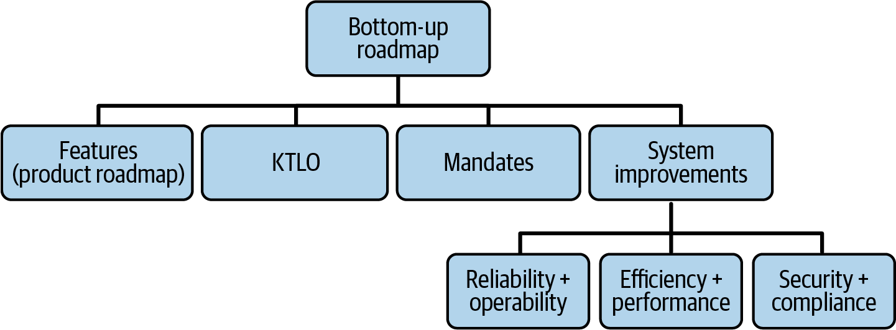

# Chapter 7: Planning and Delivery

> **Part II — Platform Engineering Practices**

> *"The best laid schemes o' mice an' men / Gang aft a-gley."* — Robert Burns

Platform teams fail not just because they build the wrong things, but because they fail to *demonstrate* they're building the right things. This chapter addresses that failure mode head-on: teams that are building well but appear — to everyone outside — to be accomplishing nothing. The causes: insufficiently planned projects that drag on without delivering value, poor communication when operational events derail plans, and missing habits for showing incremental progress.

The chapter covers three practices:
1. **Planning long-running projects** — documenting proposals, creating action plans, avoiding the "long slog"
2. **Bottom-up roadmap planning** — balancing product features with KTLO, mandates, and system improvements
3. **Communicating status** — the "Wins and Challenges" biweekly communication mechanism

The authors note explicitly: Agile alone isn't enough for platform work. Platform projects are often far too complex and long-running to leave solely to sprint planning. These guidelines layer on top of day-to-day Agile practices.

## Table of Contents

- [Planning Long-Running Projects](#planning-long-running-projects)
  - [The Proposal Document](#the-proposal-document)
  - [Going from Proposal to Action Plan](#going-from-proposal-to-action-plan)
  - [Avoiding the Long Slog](#avoiding-the-long-slog)
- [Bottom-Up Roadmap Planning](#bottom-up-roadmap-planning)
  - [Keep the Lights On (KTLO)](#keep-the-lights-on-ktlo)
  - [Mandates](#mandates)
  - [System Improvements](#system-improvements)
  - [Bringing It All Together](#bringing-it-all-together)
- [Communicating Status: Wins and Challenges](#communicating-status-wins-and-challenges)
- [Wrapping Up](#wrapping-up)

**Block types:** [Core Concept] [Deep Dive] [Anti-Pattern] [Worked Example] [Organizational Reality] [SRE/Production Lens] [Comparison] [AI Impact]

---

## Planning Long-Running Projects

Platform projects often have significantly longer timelines than application projects. Building, testing, and migrating to a new system can take months or years. Months of work may produce no user-visible output — including research time that only proves feasibility. This frustrates leaders accustomed to frequent releases.

### The Proposal Document

Before starting a long project, everyone needs to understand what you're trying to achieve. The authors recommend a written proposal covering five elements (influenced by Amazon's six-pager format):

| Element | Purpose |
|---------|---------|
| **Background, tenets, guidelines** | Current situation, how you got here, core requirements ("must support cross-regional failover"). Documents the baseline so fundamental disagreements surface early. |
| **Details of the problem** | Deep dive on what you're solving — *before* proposing solutions. Per Leslie Lamport: stating the problem first helps readers imagine alternative solutions and reveals gaps in your own understanding. |
| **Overview of possible solutions** | All reasonable options with honest pros/cons. Heads off "but have you considered X?" comments for solutions you already rejected. |
| **Proposed solution and rationale** | Your chosen approach + top 3-5 factors justifying it. Not a 20-page monster — concise enough for stakeholders to actually read. |
| **Plan of action** | What "done" looks like. Early/medium-term milestones. Success metrics. Non-technical concerns (timing, staffing, org impact). |

Review with management and lead engineers. Goal: agreement that the project is worthwhile and an action plan should be created.

### Going from Proposal to Action Plan

After buy-in, create a more detailed action plan covering:

- **Testing and acceptance criteria** — what will you validate? Assign someone to write a testing plan.
- **Dependencies** — what other teams need to participate? Do you have their buy-in? (Migration of customers is a major dependency often neglected.)
- **Headcount estimate** — how many engineers? Potential surges for testing/migration?
- **Driving adoption** — product name, early adopters lined up, documentation needed, marketing activities?
- **Milestones** — monthly for the first 12 months, quarterly beyond. Monthly concreteness forces realistic planning.

> **[Anti-Pattern: Bringing In Project Managers Too Early]**
>
> At the action plan stage, it's tempting to assign a project manager to own the project. In the authors' experience, this usually backfires:
> - Instead of creating confidence, it creates "scheduling bureaucracy"
> - Reduces engagement from the engineering lead and PM
> - Estimates become overly conservative and less accurate
>
> **When to bring in a PM:** Only when scheduling details create major risks — firm deadlines, many task dependencies, or a company culture that won't cooperate without formal scheduling.
>
> Otherwise, keep ownership with engineering leadership + product management.

### Avoiding the Long Slog

Four reasons platform projects drag on beyond their intended timeline:

**1. Overreach.** The project keeps adding goals because "since we're already doing a big project, might as well make it revolutionary." A storage system rewrite that also tried to eliminate all network-attached storage — users revolted when their familiar POSIX filesystem tools stopped working. The team had to redesign from scratch.

**2. Starting too big.** Trying to design a complex platform from scratch for a diverse user base. The authors invoke **Gall's Law**: "A complex system that works is invariably found to have evolved from a simple system that worked." If you can't write a concrete proposal your customers can understand, you've probably bitten off more than you can chew. Start with the boring, obvious parts.

**3. Unclear problem space.** Nobody knows exactly what problem they're solving. Teams fail to commit to either a paved path or a railway approach, try both, fail at both, then double down searching for the "right use case" — what one colleague calls *"sh*terating."*

**4. Project team turnover.** Long projects lose people → knowledge loss → remaining team slows → project drags → more people leave. A vicious cycle. Good documentation (proposals, plans) is the main protection against this.

> **[Real-World Implementations: Proposal & Planning Artifacts]**
>
> **Proposal documents — Architecture Decision Records (ADRs, adr-tools OSS):**
> The chapter's proposal document has 5 elements (background, problem, options, proposed solution, plan). ADRs capture the same structure in a lightweight, version-controlled format — especially the "overview of possible solutions with honest pros/cons" and "proposed solution with rationale." Each ADR is a short Markdown file committed to the repo, so the decision history travels with the code. When the chapter warns about project team turnover causing knowledge loss, ADRs are the antidote — a new engineer can read `docs/decisions/` and understand not just what was built, but WHY alternatives were rejected. `adr-tools` (OSS) provides CLI commands to create/supersede/link ADRs. Google Design Docs and Uber's open-sourced RFC template serve a similar purpose but are heavier-weight (suited for the chapter's "long-running project" proposals that need management buy-in before work starts).
>
> **Action plan tracking — Linear:**
> The chapter describes converting proposals into action plans with milestones, dependencies, and headcount estimates. Linear's project model maps well to platform work specifically: projects have target dates and progress indicators, issues have parent/child relationships (for decomposing "migrate 50 services" into per-team sub-tasks), and cycles provide the monthly milestone cadence the chapter recommends. Crucially for the chapter's anti-pattern about project managers: Linear's progress tracking is driven by issue status (automated from PRs), not by a PM manually updating a Gantt chart. The engineers' workflow IS the status report.
>
> **Dependency visualization — Backstage System Model + C4 (Structurizr):**
> The chapter's action plan requires documenting "what other teams need to participate." Backstage's entity model (System → Component → API → Resource) makes cross-team dependencies visible in the catalog: you can see which teams consume your platform's APIs and would be affected by a migration. Structurizr (C4 model tooling) goes deeper for the proposal phase: architecture diagrams at four zoom levels (Context → Container → Component → Code) help communicate "here's what we have today, here's what we're proposing, here's what changes for dependent teams." These diagrams in the proposal document answer the chapter's concern about "surfacing fundamental disagreements early."

> **[Organizational Reality: Platform Projects and Gall's Law]**
>
> Gall's Law is perhaps the most important design principle for platform teams to internalize:
>
> *"A complex system that works is invariably found to have evolved from a simple system that worked. A complex system designed from scratch never works and cannot be made to work. You have to start over, beginning with a working simple system."*
>
> For platforms, this means:
> - Don't design a universal platform for all customers on day one. Start with one customer, one use case, one working simple system.
> - The platform teams that succeed usually started from a prototype (their own or one team's) and generalized it incrementally — exactly the "railway" pattern from Chapter 2.
> - If your proposal requires detailed input from a "diverse set of customers" before you can begin, that's a red flag. You don't understand the problem well enough yet. Start smaller.

---

## Bottom-Up Roadmap Planning

The product roadmap (from Chapter 5) covers new features. But platform teams face delivery AND operational pressure simultaneously. Without explicit planning for operational work, teams either neglect operations (leading to "operational hell") or neglect features (leading to "this team never ships anything").

The bottom-up roadmap makes the split explicit by accounting for four pools of work:

*Figure 7-1. The bottom-up roadmap combines KTLO (nondiscretionary operations), mandates (top-down edicts), system improvements (proactive investment), and the product roadmap (features) into a single realistic plan.*

### Keep the Lights On (KTLO)

Truly nondiscretionary work — what's required to keep the business running:
- On-call incident response
- Essential user support
- Remediating operational/security incidents and critical postmortem items

**Estimate it** from historical data for on-call and support rotations. For incident remediation (inherently unpredictable), use last planning period's volume minus any events that took > 2 months (those are extraordinary and shouldn't be "planned for").

**Target:** KTLO should account for **no more than 40%** of total team workload. More than that risks burnout.

### Mandates

Top-down edicts from executive leadership — often with hard timelines:
- Migrations driven by other platform teams
- Infrastructure initiatives (new cloud provider, acquisitions, new regions)
- Compliance/security initiatives (deprecating old dependencies, achieving HIPAA)
- Strategic business initiatives ("AI features in all products")

The planning challenge: some "essential" mandates will be killed once leadership sees total cost. You can't say no unilaterally, but you also can't plan assuming all mandates proceed. **Estimate** which are likely to move forward AND high-impact, and communicate capacity constraints to your leadership chain as early as possible.

### System Improvements

Work that prevents future problems: improving reliability, efficiency, and security before they become acute. Three categories, each tracked as a separate stack-ranked list:

**Reliability and operability:**
- Reducing toil (automating linear-scaling work)
- Improving testing (unit, load, fuzz, integration)
- Release engineering (blue/green, canary, shadow deployments)
- Observability investments
- Reducing variations (deprecated API versions, old platform versions, customer-specific feature flags)
- System changes (tuning GC, swapping libraries, adding caches)

**Efficiency and performance:**
- **FinOps** (tagging resources, spend reports, rightsizing, reservation optimization, vendor negotiation) — needs a specialist once you hit ~200 engineers
- **Performance engineering** (deep system tuning that creates dramatic cost savings) — best done by systems engineers on each platform team, not a centralized "performance team" that evangelizes without fixing

**Security and compliance:**
- Some are architectural (covered in Chapter 8)
- Others are incremental (similar to reliability work)
- Best done by platform teams themselves, with security org providing analysis, advocacy, and consultation

> **[SRE/Production Lens: The 70/20/10 Model for Non-KTLO Work]**
>
> After KTLO is accounted for, the authors suggest Google's innovation allocation model for the remaining capacity:
>
> | Allocation | Focus | Example |
> |-----------|-------|---------|
> | **70%** | Core initiatives (incremental work on current platforms) | Feature delivery, reliability improvements, performance tuning |
> | **20%** | Adjacent innovation (platform rearchitectures) | Major architectural changes that deliver value over 6-12 months |
> | **10%** | Transformational innovation (new platforms) | Building entirely new platform capabilities |
>
> This is a guideline, not a budget. Teams will differ in how much leverage they get from adjacent/transformational work. The authors caution: don't communicate this as a "budget" that leadership grants. It's a frame for discussion, not an entitlement.

### Bringing It All Together

**Cadence:** Deep from-scratch planning annually. Lighter refresh each quarter.

**Merging at one level up (skip manager):** Highly valuable. Small enough group for real conversations about standards. Creates a document everyone can read. Enables better people allocation between teams.

**Don't merge higher.** Above the skip-manager level, information loses fidelity and the process becomes political. The authors cite Ian's experience at AWS: middle managers padded estimates to justify hiring; headcount often got reallocated before hires arrived; everyone became cynical about the planning exercise.

> **[Real-World Implementations: Bottom-Up Roadmap Tooling]**
>
> **KTLO measurement — LinearB / Swarmia:**
> The chapter says "estimate KTLO from historical data" and target no more than 40% of team workload. LinearB and Swarmia make this measurable by categorizing engineering work (from git, PRs, and issue labels) into buckets: planned features, bugs, KTLO/toil, and unplanned work. You can see "last quarter, 52% of our capacity went to KTLO" — which the chapter says is the signal that you're overloaded and need Stage 3 support help or a reliability investment push. Without measurement, teams argue feelings ("we spend too much time on toil" vs. "no we don't") instead of acting on data.
>
> **FinOps — Infracost + Kubecost + FinOps Foundation FOCUS spec:**
> The chapter places FinOps under "system improvements" and says it needs a specialist once you hit ~200 engineers. Infracost operates in CI: Terraform PRs get cost projections before merge, catching "$500/month → $10,000/month" mistakes at review time. Kubecost runs inside K8s clusters, attributing real spend to teams/namespaces/services and identifying idle resources — the "rightsizing and reservation optimization" the chapter mentions. The FinOps Foundation's FOCUS spec (open standard for cost data) normalizes billing across AWS/Azure/GCP so platform teams can build cross-cloud cost dashboards without vendor-specific ETL. Together, these tools make cost a first-class signal in the bottom-up roadmap: "save $200K/quarter by rightsizing" becomes a concrete system improvement item competing for the 70% allocation.
>
> **Reliability investments — Litmus (CNCF) + k6 (Grafana):**
> The chapter lists "improving testing" and "reducing variations" as reliability system improvements. Litmus implements chaos engineering for platforms: inject pod failures, network partitions, or disk pressure into your platform components to validate that failover works before customers discover it doesn't. This fits the chapter's 70/20/10 model — it's a "core initiative" (testing existing platforms' resilience), not a new feature. k6 (Grafana Labs) provides load testing as code: write JavaScript scenarios simulating platform API traffic, run them in CI, and catch performance regressions before they reach production. For platform teams specifically, k6 is valuable for validating that a database platform handles 200 concurrent provisioning requests — the multi-tenant load pattern that doesn't show up in functional tests.
>
> **Security & compliance — Trivy + Falco (both CNCF) + SLSA framework:**
> The chapter says security work is best done by platform teams themselves (not a separate security team). Trivy scans container images, IaC files, and running clusters for vulnerabilities and misconfigurations — platform teams integrate it into their CI pipeline so security issues surface as PR checks, not as quarterly audit findings. Falco monitors runtime behavior (unexpected process execution, sensitive file access, privilege escalation) — it's the "anomaly detection" practice the chapter describes, applied to security. SLSA (Supply-chain Levels for Software Artifacts, Google-originated) provides a framework for hardening the build pipeline itself — ensuring platform artifacts haven't been tampered with between build and deploy. These map to the chapter's "incremental security" improvements that accumulate over multiple planning cycles.

> **[Anti-Pattern: Innersourcing as an Escape Valve]**
>
> The authors include a long anti-pattern about relying on "innersourcing" (allowing other teams to contribute code to your platform like an open source project) as a way to avoid hard prioritization decisions.
>
> **Why it sounds good:** "Anyone blocked can just write the code themselves!"
>
> **Why it fails:**
> - Most engineers don't want to read and modify someone else's codebase
> - Those who do contribute often torture the code for their niche use case
> - The platform team still has to support and operate the contributed code
> - When contributions introduce bugs, the platform team gets paged (unlike open source, where maintainers don't get 2 a.m. alerts)
>
> **Camille's story:** Her service discovery platform innersourced client libraries. A Perl client author started using ZooKeeper features beyond the API scope, introduced a bug, and took down the entire service.
>
> **The lesson:** "Don't use innersourcing to avoid hard conversations with your customers about priorities." If customers are blocked, that's a product/planning problem to solve — not an excuse to let anyone modify your production systems.

---

## Communicating Status: Wins and Challenges

Even when you plan and deliver well, if stakeholders don't see progress, they assume nothing is happening. Platform teams with long-term focus appear to accomplish "very little from day to day." The authors use **biweekly Wins and Challenges** updates to create transparency.

**The mechanism:** Every two weeks, walk up the org tree with bullet-point updates on major accomplishments ("wins") and issues ("challenges"). Each level selects the most important points from below and rewrites them for a broader audience.

**Format (per bullet):** Short bold summary + Situation → Action → Result. Keep it scannable. Use numbers whenever possible.

**Who writes:** Engineering managers gather from their teams. Directors aggregate. VP selects highlights for peers/boss/stakeholders.

**Why it works for platform teams specifically:**
- Creates a record of incremental progress (useful for performance reviews and planning reflections)
- Forces managers to account for what *actually* happened (sprints often fail to capture this)
- Provides stakeholders transparency at regular intervals — building trust that the team is tackling real problems
- Highlights team as a lever to earn respect and resources

**Why include Challenges:**
- **Internal:** Gives management visibility into collaboration issues, stability problems, or delivery blockers before they escalate
- **External:** Builds trust through transparency. Acknowledging incidents, delays, and personnel changes shows the team is on top of things. Sometimes surfaces problems senior leaders can unblock.

> **[Core Concept: The Platform Visibility Problem]**
>
> Platform teams suffer from a unique visibility challenge: their best work is invisible. When the platform is running well, nobody notices — just like nobody praises functioning plumbing. The only visibility comes when things break.
>
> This creates a structural disadvantage in organizations that reward visible output:
> - Application teams ship features customers see → praised
> - Platform teams prevent incidents that never happen → unnoticed
> - Platform teams do a seamless migration → nobody realizes it was hard
> - Platform teams invest in reliability → "why is this team so big when nothing seems to change?"
>
> Wins and Challenges is a deliberate countermeasure. It transforms invisible work into visible communication. "We reduced mean-time-to-recovery from 45 minutes to 12 minutes this quarter" is invisible unless you write it down and share it. "Zero customers impacted during the PostgreSQL 14→16 migration affecting 200 databases" is invisible unless you celebrate it.
>
> The authors frame this as an *obligation*, not a nice-to-have: "You owe it to your peers and boss and customers to create transparency into your work, and you owe it to your team to think about how the work can be broken down and delivered more frequently."

---

> **[Real-World Implementations: Status Communication]**
>
> **Biweekly Wins & Challenges — Geekbot + Notion/Confluence:**
> The chapter describes a specific communication mechanism: biweekly bullets that walk up the org tree, each level selecting and rewriting highlights for a broader audience. Geekbot (Slack bot) automates the collection: every two weeks it prompts engineers "what were your wins? what are your challenges?" and aggregates responses into a summary. Engineering managers then curate into Notion or Confluence pages — one page per period, a living record of incremental progress. This addresses the chapter's point that platform work is "invisible until it breaks" — the biweekly cadence forces visibility even during quiet periods where everything is running well. The archive becomes valuable at performance review time and planning reflections.
>
> **Internal status pages — Cachet (OSS) / Instatus:**
> The chapter says platform teams must communicate operational events that derail plans. Internal status pages serve two purposes simultaneously: (1) during incidents, they reduce the "50 Slack messages asking if the platform is down" problem by giving a single source of truth, and (2) historically, they document the operational events that explain why feature delivery slipped — the "Challenges" half of the communication mechanism. Cachet is self-hosted OSS with component-level status, incident updates, and scheduled maintenance announcements. The key insight: an internal status page used honestly builds the trust the chapter says platforms need — customers see that you acknowledge problems quickly and resolve them.
>
> **DORA metrics as visibility tool — Sleuth / LinearB:**
> The chapter's "Platform Visibility Problem" section notes that platform teams' best work is invisible. DORA metrics (deployment frequency, lead time, change failure rate, MTTR) provide concrete numbers to communicate. Sleuth tracks these per-service automatically from deploy events and incident data. For platform teams specifically, the compelling metric isn't "we deployed 47 times this quarter" — it's "our platform enabled application teams to deploy 12,000 times this quarter with 0.3% change failure rate." This reframes platform success in terms of the leverage the chapter keeps emphasizing: how much faster can application teams move because of what the platform built?
>
> **Automated changelogs — Release Please (Google OSS):**
> The chapter notes that platform customers have "low tolerance for interruptions" and need to understand what's changing. Release Please reads Conventional Commits from your git history and auto-generates versioned changelogs + GitHub releases. Platform teams use this to communicate what changed in each platform version without manually writing release notes. For customers, it answers "what's new in the database platform this month?" without requiring a dedicated newsletter effort. Combined with Backstage's announcements plugin (which surfaces changelogs directly in the developer portal), this turns "platform team never communicates" into automated, always-current release communication.

---

## Wrapping Up

The chapter's three practices layer to solve a single meta-problem: **platforms are complex, long-running investments that are easy to misperceive as slow, expensive, and unproductive.** Good planning makes the work tractable. Bottom-up roadmaps make the capacity trade-offs explicit. Communication makes the progress visible.

Don't tackle all at once. Start where it's most relevant:
- If your team is in execution mode → start Wins and Challenges
- If you can't explain your capacity constraints → estimate KTLO
- If long projects keep dragging → invest in proposal documentation

The recurring theme: documentation (proposals, plans, updates) isn't bureaucracy — it's the mechanism that survives team turnover, justifies resources, earns trust, and keeps long-running projects on track.
