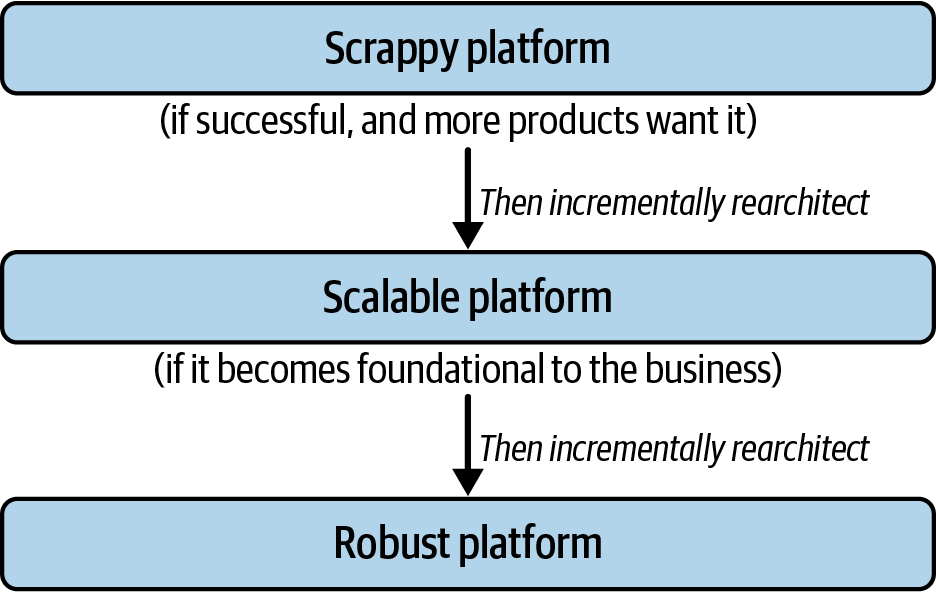

# Chapter 8: Rearchitecting Platforms

> **Part II — Platform Engineering Practices**

> *"If you don't end up regretting your early technology decisions, you probably overengineered."* — Randy Shoup

Even when platform teams follow the incremental improvement model perfectly — start small, iterate, invest in KTLO — they can still hit a wall. Load increases, operational issues multiply, KTLO grows, capacity for features shrinks, best engineers leave from frustration, and critical infrastructure freezes in time. The culprit: incremental system improvements, while offering the highest *short-term* benefits, cannot address deep architectural bottlenecks.

This chapter makes the case for **rearchitecture** — iteratively reimplementing a system's architecture while it remains live and continues serving load — as fundamentally preferable to building a v2 (a new system with a different architecture requiring customers to migrate). The authors frame rearchitectures not as failures but as evidence of a successful platform supporting a growing business that now has the opportunity to evolve.

The chapter then extends into three supporting concerns: how to build security into platform architecture (a guest section by Kelly Shortridge), the technical guardrails that make large architectural changes survivable, and the management/planning framework that gets rearchitectures funded and delivered incrementally over 3-5 years.

## Table of Contents

- [Why Rearchitecting Is Preferred to Building a v2](#why-rearchitecting-is-preferred-to-building-a-v2)
  - [Different Engineering Mindsets](#different-engineering-mindsets)
  - [Architectural Needs Drive Mindset Demands](#architectural-needs-drive-mindset-demands)
  - [Why It Is Hard to Build v2 Platforms, but Possible to Rearchitect](#why-it-is-hard-to-build-v2-platforms-but-possible-to-rearchitect)
  - [Getting Pioneer Agility on Robust Platforms](#getting-pioneer-agility-on-robust-platforms)
- [Addressing Security with Architecture](#addressing-security-with-architecture)
  - [Platform Architecture to Reduce Security Hazards](#platform-architecture-to-reduce-security-hazards)
  - [Use Paved Paths to Make Applications Secure by Default](#use-paved-paths-to-make-applications-secure-by-default)
- [Guardrails for Rearchitectures](#guardrails-for-rearchitectures)
  - [Compatibility](#compatibility)
  - [Testing](#testing)
  - [Lower Environments](#lower-environments)
  - [Tranches, Slow Rollouts, and Staying a Version Behind](#tranches-slow-rollouts-and-staying-a-version-behind)
- [Planning for Rearchitectures](#planning-for-rearchitectures)
  - [Step 1: Think Big on Final Rearchitecture Goals](#step-1-think-big-on-final-rearchitecture-goals)
  - [Step 2: Factor in Migration Costs](#step-2-factor-in-migration-costs)
  - [Step 3: Determine Major 12-Month Wins](#step-3-determine-major-12-month-wins)
  - [Step 4: Get Leadership Buy-in, and Be Prepared to Wait](#step-4-get-leadership-buy-in-and-be-prepared-to-wait)
- [Wrapping Up](#wrapping-up)

**Block types:** [Core Concept] [Deep Dive] [Anti-Pattern] [Worked Example] [Organizational Reality] [SRE/Production Lens] [Comparison] [2025 Context] [AI Impact]

---

## Why Rearchitecting Is Preferred to Building a v2

The chapter begins by acknowledging the temptation: if your architecture is fundamentally wrong for your scale, wouldn't it be easier to start fresh? The authors argue no, for two structural reasons rooted in team psychology and organizational culture.

First, the **second-system effect** (Fred Brooks, 1975): teams that have built only one version of a system assume they can correct every deficiency the second time. The v2 design balloons in scope. Management adds headcount, which adds complexity. Many v2s are canceled; those that ship often find users have moved on.

But the authors go beyond Brooks's observation. They argue the deeper problem is that v2 projects ask engineering teams to hold three incompatible mindsets simultaneously.

### Different Engineering Mindsets

Drawing on Simon Wardley's model of **pioneers, settlers, and town planners**, the authors map these archetypes to platform maturity stages:

| Mindset | Motivation | Trade-off Orientation | What "Right" Looks Like |
|---------|-----------|----------------------|------------------------|
| **Pioneers** | Explore the unknown, create from ambiguity | Speed over robustness | It works (sort of). Half the time it doesn't. Crazy ideas. |
| **Settlers** | Turn prototypes into products, build trust | Balance of rigor and agility | Manufacturable, profitable, differentiated. |
| **Town Planners** | Industrialize at scale, economies of scale | Efficiency and reliability over speed | Faster, better, smaller, more efficient. |

The key insight: these are not just different skill sets but different *definitions of quality*. Teams waste enormous energy debating technical and process decisions when the underlying disagreement is actually which mindset should govern. The authors prefer to call these "mindsets" rather than "types of people" — individuals can shift (somewhat), but it's very hard for a team to operate in multiple mindsets at once.

> **[Core Concept: Wardley's Mindsets as Architectural Compass]**
>
> The pioneers/settlers/town planners model isn't just a team-composition insight — it's a decision framework for *when to invest in what kind of work*:
>
> - **Don't ask town planners to pioneer.** They'll over-engineer the prototype, spending months on reliability concerns for something that might be thrown away.
> - **Don't ask pioneers to maintain.** They'll get bored, cut corners on operational concerns, or propose rewriting everything.
> - **Don't ask settlers to start from zero.** They thrive when there's an existing prototype to harden, not when there's only ambiguity.
>
> The organizational implication: successful platform evolution requires *transitions* between mindsets — not one team wearing all three hats. This is why rearchitecture (a settler/town planner activity) works better than v2 (which demands pioneer + settler + town planner simultaneously).

### Architectural Needs Drive Mindset Demands

The authors introduce a model of architectural maturity (Table 8-1) mapping four system capabilities — features, reliability, security, and efficiency — to three maturity stages, each aligned with the corresponding engineering mindset:

| | Scrappy Platform (Pioneer) | Scalable Platform (Settler) | Robust Platform (Town Planner) |
|---|---|---|---|
| **Feature Delivery** | Agile. Frequent revision as customer ambiguity resolves. | Balancing big customers wanting certainty vs. small customers wanting agility. | Large customers dominate; small customers wait. |
| **Reliability** | Low. Users tolerate outages because apps are young. | Operational rigor. Established apps demand higher requirements. | Metric-driven. Three nines baseline, five nines desired. Per-customer SLAs. |
| **Security** | Low. Applications "do the right thing." | Paved paths limit impact of mistakes. | Secure by design. Assumes compromises will happen. |
| **Efficiency** | Afterthought — system lacks scale. | Optimizing for dominant loads. | System-wide efficiency focus on dollars saved. |
| **Team Focus** | Customer collaboration for feature delivery to enable growth. | Investment in scalability to keep up with growth. | Forward planning to simultaneously maximize all four dimensions. |
| **Optimal Mindset** | Pioneer | Settler | Town Planner |

Architecture is defined as "the fundamental design decisions that will forever constrain the system's capabilities, even as individual components are improved." When growth outpaces architectural capacity, rearchitecture becomes necessary — not because the team failed, but because success created demands the original architecture was never designed to meet.

> **[SRE/Production Lens: The Four Forces That Trigger Rearchitecture]**
>
> The table identifies four forces, but from an operations perspective, they don't trigger rearchitecture equally:
>
> 1. **Reliability** is usually the loudest signal — it manifests as pages, incidents, and customer escalations. But it's often a *lagging* indicator; by the time reliability degrades, the architecture has been straining for months.
>
> 2. **Efficiency** is the sneakiest trigger — costs grow linearly (or worse) with scale, but nobody notices until a quarterly bill review or a FinOps team raises alarms. The "relational database storing blobs" example is classic: it works fine until your AWS bill triples in a quarter.
>
> 3. **Security** creates the most urgent rearchitectures — a breach or compliance mandate can force architectural changes with hard deadlines, no negotiation.
>
> 4. **Features** is the most politically charged — a single large customer demanding capabilities the architecture can't support may force a rearchitecture that benefits only them in the short term.
>
> Mature platform teams instrument for all four: SLO dashboards (reliability), cost-per-request metrics (efficiency), security posture scores (security), and feature-request dependency mapping (features). The team that can show "at current growth, we hit architectural limits in Q3" gets funded; the team that says "we need to rearchitect because the code is ugly" does not.

### Why It Is Hard to Build v2 Platforms, but Possible to Rearchitect

Two core issues kill v2 projects:

1. **Scope explosion.** A v2 bundles architecture changes + design corrections + new features. This makes it fundamentally high-risk no matter how talented the team.

2. **Cultural mismatch.** Platform organizations operating scalable/robust systems have teams aligned to settler/town planner mindsets. But greenfield v2 development demands pioneer agility with ambiguous requirements — directly conflicting with the team's established culture.

Rearchitectures avoid both traps:

1. **Natural scope limits.** By delivering within the logical construct of the existing platform, you constrain yourself to fixing architecture without bells and whistles. Keeping the system live forces you to minimize customer-visible change and think carefully about the change approach.

2. **Mindset alignment.** Rearchitectures are settler/town planner work — requiring a balance of rigor and agility, not pioneer "move fast and break things" energy.

*Figure 8-1. How a platform is successfully rearchitected over time — shifting mindset as architectural capabilities are rebuilt for more scale and robustness.*

> **[Comparison: v2 Rewrites vs. Rearchitecture in the Literature]**
>
> The authors' argument maps onto a broader pattern across software engineering writing:
>
> - **Joel Spolsky (2000), "Things You Should Never Do":** Netscape's rewrite-from-scratch disaster. The v2 took three years, during which competitors caught up. The rewrite threw away years of bug fixes encoded in "ugly" code.
>
> - **Martin Fowler's Strangler Fig Pattern:** The canonical rearchitecture approach — incrementally replacing parts of a legacy system by routing requests through a new system, one endpoint at a time. This is exactly the live-system-stays-running philosophy the chapter advocates.
>
> - **Marianne Bellotti, *Kill It with Fire* (2021):** Referenced directly in this chapter. Bellotti argues that the impulse to "burn it down and start over" is emotionally satisfying but usually wrong. Legacy systems encode institutional knowledge that a v2 will painfully rediscover.
>
> - **Will Larson, *An Elegant Puzzle* (2019):** Larson's "systems migration" framework parallels this chapter's planning steps: prove the new system works, migrate a small percentage, iterate, expand.
>
> The common thread: successful large-scale system evolution is always incremental, always maintains a working system, and always constrains scope. The literature is essentially unanimous that "clean rewrites" fail for systems with real users.

### Getting Pioneer Agility on Robust Platforms

What about sudden technology shifts (public cloud, generative AI) that require pioneer energy on robust platforms? The authors share a concrete case: a platform organization years away from full cloud support, with application teams demanding elastic compute *now*.

Their solution: staff a small "Public Cloud Platform" team with pioneers, embed them with application teams, task them with integration into existing platforms but stress that *moving fast is more important than doing it right*. Accept the mess.

After ~18 months, the pioneers had turned duplicate capabilities into duplicate platforms. The transition: move the systems into existing platform teams, offer pioneers a chance to stay (most won't — they'll find new greenfields). Key leadership responsibility: ease tension between pioneer and existing teams by communicating the integration plan.

> **[Organizational Reality: The Pioneer Integration Playbook]**
>
> The case study reveals a repeatable pattern with five phases:
>
> 1. **Seed** — Staff pioneers, embed with early-adopter customers, give explicit permission to make a mess.
> 2. **Grow** — Pioneers deliver value fast. Existing platform teams watch nervously. Leaders communicate "we'll integrate eventually."
> 3. **Tension** — Pioneers want independence. Existing teams see "duplicate platforms." Leaders absorb frustration from both sides.
> 4. **Transition** (~18 months) — Move systems into existing platforms. Existing teams own integration and scale-up. Pioneers offered choice: stay or find new greenfields.
> 5. **Acknowledgment** — Explicitly recognize contributions on both sides. The pioneers' "mess" wasn't failure — it was the seed from which scalable capabilities grew.
>
> Critical failure mode: skipping step 5, or worse, publicly blaming pioneers for "technical debt." This poisons future pioneer recruitment — nobody will volunteer for the next high-risk, high-ambiguity project if the last team was scapegoated.
>
> The 18-month timeline is notable — it's long enough for pioneers to create real value but short enough to prevent full platform duplication. Leaders who let this run for 3+ years end up with the "five platforms in the same area" anti-pattern described in the chapter's conclusion.

---

## Addressing Security with Architecture

The authors invite Kelly Shortridge (author of *Security Chaos Engineering*) to write this section. Her core argument: security should be treated as a platform architecture concern, not a human behavior problem.

### Platform Architecture to Reduce Security Hazards

Shortridge frames security through the lens of **resilience** — the ability for a system to adapt its functioning in response to changing conditions and continue operating successfully. The goal: minimize the *impact* of failure rather than attempting to *prevent* all failure.

**Design-based security solutions** have two key traits:
1. They do not depend on human behavior
2. They provide substantial separation of the user from the hazard

Two operations on hazards:
- **Eliminate hazards** — excise things that can produce harm (e.g., rewrite a component in a memory-safe language)
- **Reduce hazards** — curtail what can cause harm without fully eliminating it (e.g., standardize an authentication component)

Through the lens of resilience, reduce application team choices to those that:
- Minimize potential impact of failure
- Minimize human intervention required to circumnavigate hazards
- Preserve possibilities for growth and innovation

The section then provides nine concrete patterns where platform engineering creates security value that simultaneously benefits feature delivery, reliability, and efficiency:

| Pattern | Security Benefit | Cross-cutting Benefit |
|---------|-----------------|----------------------|
| Automated testing tools | Integration tests catch component interactions attackers exploit | Devs focus on app behavior, not tool selection |
| Standardized deployment (IaC) | Automatic cleanup removes drift and stale attack paths | Teams focus on building, not deploying |
| Configuration management | Vanquish data sharing between stages; prevent prod data in dev | Simplify environment instantiation/destruction |
| Token/secrets management | Avoid systems that mishandle "fissile material" of access keys | Teams build without worrying about key handling |
| Standardized observability (distributed tracing) | More vantage points to spot unwanted activity before it cascades | Holistic perspective for incident response |
| Standard service/web frameworks | Eliminate XSRF, XSS, CORS, cookie management concerns | Engineers focus on business value delivery |
| Common auth/authz middleware | Prevent DIY inconsistencies that foment disaster at scale | Plug-and-play service validation |
| Compute with declarative access control | Prevent "infrastructure islands" with overly permissive access | Teams declare communication intent, not manage networks |
| Tenant-isolated architectures | Even with security failures, attackers can't access other tenants' data | Simplify implementation and performance concerns |

> **[Deep Dive: Security as Platform Feature, Not Tax]**
>
> Shortridge's framing is radical in its implications: security is not a set of constraints imposed on engineers ("awareness training," "security checklists") but a *platform capability* delivered to engineers. The metaphor shift:
>
> - **Traditional:** Security team writes rules. Application teams must follow rules. Non-compliance is audited.
> - **Shortridge's model:** Platform team builds guardrails. Application teams can't NOT be secure (or must actively opt out). The secure way is the fast way.
>
> This maps directly to the broader platform-as-a-product philosophy of Chapter 5: if your security offering makes engineers slower, they'll work around it. If it makes them faster (and more secure by default), they'll adopt voluntarily.
>
> The organizational implication is that security engineers should be *embedded in platform teams*, not in a separate security org that issues mandates. Their value comes from understanding system context well enough to design hazard elimination/reduction into the architecture — not from running vulnerability scanners after the fact.

> **[SRE/Production Lens: The Security-Reliability Convergence]**
>
> Shortridge's patterns reveal something SREs have long intuited: security and reliability are architecturally convergent. Every pattern that makes a system more secure also makes it more reliable:
>
> - **IaC with automatic cleanup** eliminates both stale attack surfaces AND configuration drift that causes outages
> - **Standardized observability** helps both incident responders AND threat hunters
> - **Tenant isolation** prevents both blast radius from attacks AND blast radius from bugs
> - **Declarative access control** prevents both unauthorized access AND accidental cross-service interference
>
> This convergence means platform teams shouldn't plan "security projects" and "reliability projects" as separate work streams. The highest-leverage investments improve both simultaneously. When prioritizing rearchitecture work, score candidates on both dimensions and you'll find the top items are the same.
>
> The practical test: "If this component fails in the worst possible way, do both the security and reliability outcomes improve under the new architecture?" If yes, that's your highest-priority rearchitecture target.

### Use Paved Paths to Make Applications Secure by Default

The concept of **paved paths** — well-integrated, supported solutions that make the safer way the easier way — is the implementation mechanism for security by design. The key: developers must *opt out* of the safe option rather than opt in.

Physical-world analogy: newer cars lock by default when you walk away with the keys.

Software equivalent: default service templates using IaC that automatically demolish unused infrastructure — removing drift, data exposure, and stale attack paths without human intervention.

**Prioritization questions for what to build:**
- What security checks/tasks fall on application teams at each stage of delivery?
- What security mechanisms are standard requirements in software?
- Are there security checklists teams must complete before deployment?
- What security incidents or near-misses were blamed on "human error" recently?

**Categories of paved paths that solve security while improving other dimensions:**
- API protection (XSRF, rate limiting, DDoS, WAF)
- Authentication and authorization
- Caching compliance and static asset caching
- Certificate management and secure network protocols
- Static and dynamic analysis tooling
- Automated testing frameworks (fuzzing, pen tests, chaos experiments, smoke tests)

> **[Real-World Implementations: Security-as-Platform-Feature]**
>
> **Hazard elimination — Rust/memory-safe rewrites (Android, Chrome, NSA guidance):**
> Shortridge's example of "rewriting a component in a memory-safe language" to eliminate hazards has moved from theory to industry practice. Google's Android team reported that as they shifted new code to Rust, memory safety vulnerabilities dropped from 76% of total vulnerabilities to 24% over four years — WITHOUT retroactively rewriting old code. The new architecture simply stopped introducing the dominant hazard class. For platform teams, this means: when rearchitecting a component that historically produces memory-safety CVEs (parsers, serializers, network protocol handlers), choosing Rust/Go over C/C++ is not premature optimization — it's hazard elimination with measurable results. The CISA "Secure by Design" guidance (2024) and NSA recommendations explicitly endorse this approach.
>
> **Paved paths for secrets — HashiCorp Vault + External Secrets Operator (ESO):**
> The chapter lists "token and secrets management" as a platform pattern that avoids teams mishandling "fissile material." Vault provides the centralized secrets engine (dynamic credentials with TTLs, automatic rotation, audit logging). But the paved path isn't Vault alone — it's Vault + ESO (Kubernetes-native operator) that syncs secrets into pods as native K8s Secrets without application code ever touching Vault APIs directly. The application team's experience: declare `ExternalSecret` in their manifest, and the secret appears. No Vault SDK, no authentication logic, no risk of logging credentials. If they need a database password, they get one that rotates hourly and was never committed to any repo. The "opt-out required" property of paved paths is enforced by cluster policy: pods without ESO-managed secrets get flagged by admission controllers.
>
> **Standardized observability for security — OpenTelemetry + Grafana Tempo + Falco:**
> Shortridge emphasizes "standardized observability (especially distributed tracing)" for spotting unwanted activity. OpenTelemetry provides the vendor-neutral instrumentation layer — auto-instrumentation agents inject trace context without developer effort (the "doesn't depend on human behavior" criterion). Grafana Tempo stores traces cheaply at scale. The security angle: Falco (CNCF runtime security) correlates system call anomalies with trace IDs from OTel, meaning when Falco detects "unexpected process execution in container X," the platform team can immediately pull the full distributed trace showing what request triggered that execution — bridging the gap between "anomaly detected" and "here's the attack chain." This is the security-reliability convergence in action: the same tracing infrastructure that helps SREs debug latency also helps security teams trace intrusions.
>
> **Tenant isolation — AWS SCP + OPA/Gatekeeper + Cilium network policies:**
> The chapter's "tenant-isolated architectures" pattern needs multiple enforcement layers in practice. AWS Service Control Policies (SCPs) provide account-level blast radius — even an admin in one tenant's account cannot access another's resources. Within Kubernetes, OPA/Gatekeeper enforces that workloads can only reference their own namespace's resources (the "declarative access control" pattern). Cilium adds network-level isolation: L7 network policies ensure Service A in Tenant 1 literally cannot send packets to Service B in Tenant 2, enforced at the kernel level via eBPF. The architectural beauty: none of these require application developers to write isolation logic. The platform provides it by default, and the only way to weaken it is to explicitly request an exception (which triggers review). This is Shortridge's principle in pure form — separation of user from hazard without depending on human behavior.

---

## Guardrails for Rearchitectures

For rearchitecting to succeed, existing users should ideally not even notice the change. Scrappy platforms weren't built with major architectural changes in mind — making big changes without thinking through user impact burns goodwill. The guardrails:

### Compatibility

Backward-compatibility breaks are "exceptionally deadly for multitenant platforms." When backward-breaking changes are unavoidable:

1. Introduce the change as a **new API** (major version upgrade)
2. Give users **long lead time** to migrate
3. Only turn off the old API after migration completes
4. Eventually delete the old API

**Version policy decision:** How many versions live in production simultaneously? More versions = faster release cadence but larger compatibility matrix. Fewer versions = easier reasoning about new code but slower releases.

### Testing

"Testing in production" via feature flags and shadow deployments is fine for applications, but for **foundational infrastructure platforms** it is "not acceptable to trade delivery speed for even slight perturbations in quality or performance."

Investment areas:
- **Full integration test environments** with users' dependent tests (monorepo advantage)
- **User-submitted tests** even without a monorepo
- **Property-based testing and fuzzing** — identifies failures without a fully provisioned simulation environment
- **Deep synthetic monitoring** that can supplant functional integration testing (Ian's experience at AWS) — but this is NOT "YOLO production testing." It requires solid shadow/canary deployments where only synthetic monitoring is scheduled to new deployments until monitors pass.

### Lower Environments

Pre-production environments serve dual purpose: customers' pre-release testing AND your validation strategy. Once you've vetted changes with your own testing, releasing to pre-prod gives you thorough integration testing as customers run their own vetting on your release candidates.

**Caveat:** Customers deserve stable lower environments. If you regularly release broken systems to lower environments, go back and invest more in earlier testing. The goal: "test in pre" is far better than "test in prod," but only if pre-prod is kept reasonably stable.

### Tranches, Slow Rollouts, and Staying a Version Behind

All modern release management practices apply:
- Canary releases
- Slow rollouts to tranches of machines
- Releasing to subsets of customers
- Beta releases

**Additional wisdom for internal platforms:** Stay slightly behind the latest OSS releases for underlying infrastructure. Let the community test before you adopt. Especially true if you're a small company, have sensitive infrastructure, or limited testing investment.

**But:** Don't be so late that you're "out of window" for community support and miss security patches.

> **[SRE/Production Lens: The Rearchitecture Release Ladder]**
>
> The four guardrails form a natural progression — a "release ladder" that each architectural change should climb:
>
> 1. **Compatibility gate** — Does the change break any existing API contracts? If yes, stop and redesign as a versioned migration.
> 2. **Testing gate** — Does the change pass the full integration suite, property tests, and fuzzing? If not, it doesn't leave the developer's branch.
> 3. **Lower environment gate** — Does the change survive real customer workloads in pre-production for N days without regression? If not, it doesn't proceed.
> 4. **Progressive rollout gate** — Does the change survive canary (1%), then small tranche (10%), then large tranche (50%), then full rollout — with automated rollback at each stage if error rates spike?
>
> The key operational insight: each rung should have **automated rollback criteria**. For infrastructure platforms, "I'll just roll it back quickly" is a fantasy — rolling back a database engine version or a compute scheduler often requires state migration. Define rollback procedures *before* starting the rollout, including data compatibility implications.
>
> This ladder maps to SRE error budgets naturally: a rearchitecture phase that consumes too much error budget at any rung gets paused and investigated, not pushed forward under schedule pressure.

> **[Real-World Implementations: Rearchitecture Guardrail Tooling]**
>
> **API compatibility enforcement — Buf (Protobuf) + Optic (REST):**
> The chapter says "backward compatibility breaks are exceptionally deadly for multitenant platforms." Buf provides automated breaking-change detection for Protocol Buffers: when an engineer submits a PR modifying a `.proto` file, Buf's CI check compares against the previously published schema and blocks merges that remove fields, change types, or rename RPCs without a version bump. For REST APIs, Optic does the equivalent: it captures API traffic (or reads OpenAPI specs), diffs against the baseline, and flags breaking changes. Both implement the chapter's principle as a CI gate — engineers literally cannot merge a backward-breaking change without an explicit override (which triggers review). This makes the "introduce as new API version" pattern enforceable rather than advisory.
>
> **Progressive rollout — Argo Rollouts + Flagger (CNCF):**
> The chapter's "tranches, slow rollouts" section describes what Argo Rollouts and Flagger implement natively in Kubernetes. Argo Rollouts provides canary and blue-green deployment strategies with automated promotion/rollback based on metric analysis: deploy to 5% of traffic, wait 10 minutes, check error rate and latency from Prometheus — if degraded, auto-rollback; if healthy, promote to 20%, repeat. Flagger (works with Istio/Linkerd/NGINX) adds the service mesh dimension: it can route traffic based on headers (sending only synthetic monitoring to the canary first — exactly the "only synthetic monitoring gets scheduled to new deployment" pattern the chapter describes from AWS). For platform rearchitectures specifically, the value is that rollout policies are *declarative* — the desired progression is defined in YAML, not dependent on an engineer remembering to check dashboards at 2 a.m.
>
> **Property-based testing — Hypothesis (Python) + fast-check (TypeScript) + jqwik (Java):**
> The chapter recommends "property-based testing and fuzzing" as a powerful approach that doesn't require a full simulation environment. Property-based testing tools generate thousands of random inputs constrained by developer-specified properties ("for any valid tenant ID, the API returns a result within 200ms" or "for any sequence of create/delete operations, the final state is consistent"). For platform rearchitectures, this is transformative: instead of writing 50 hand-crafted test cases for a new storage engine, you define invariants ("reads after writes always return the written value," "concurrent deletes are idempotent") and the framework finds edge cases you'd never imagine. Hypothesis has found bugs in CPython, NumPy, and major databases — it excels at the "complex interactions between components" that characterize platform internals.
>
> **Lower environment validation — Terraform Cloud ephemeral workspaces + Crossplane compositions:**
> The chapter discusses using pre-production environments for integration validation. Terraform Cloud's ephemeral workspaces allow spinning up a complete replica of a platform's infrastructure for a single PR — run the full customer test suite against it, then tear it down. Crossplane takes this further for Kubernetes-native platforms: Compositions define "what a complete platform environment looks like" declaratively, and the platform team can stamp out per-PR environments on demand. This addresses the chapter's concern about keeping pre-prod stable: if each rearchitecture change gets its own isolated environment, you never degrade the shared pre-production environment that customers depend on.

---

## Planning for Rearchitectures

The most common reason necessary rearchitectures don't happen: they get stuck in planning and never get "funded." The typical failure cascade:

1. Lead engineer writes detailed plan of needed architecture
2. Architectural review confirms alignment
3. Annual planning math shows it cuts too far into feature budget
4. Request for additional headcount denied (new headcount goes to business initiatives)
5. Platform leadership spreads limited budget across all teams (no team gets enough)
6. Told "let's wait until next year"
7. Team scrapes by for 12 months with incremental improvements
8. Next year's stronger case backfires — leadership views demonstrated ability to scrape by as evidence rearchitecture isn't needed

The authors propose a four-step planning framework to break this cycle:

| Step | Purpose | Time Horizon |
|------|---------|-------------|
| 1. Think big | Top-down view of all value a completed rearchitecture adds | 3-5 years |
| 2. Factor migration costs | Reality check on what customers must do | Full project lifecycle |
| 3. Determine 12-month wins | Find high-value features deliverable as partial implementation | 12 months |
| 4. Get leadership buy-in | Secure commitment to defend the project through turbulence | Ongoing |

> **[Anti-Pattern: New Hires Leading the Rearchitecture]**
>
> A newly hired engineer with experience at the "next level of platform maturity" seems like the perfect rearchitecture lead. They've seen what good looks like! They question the status quo! But this fails because:
>
> - The architecture YOUR organization needs differs from what they built at their last company — but they can't see this yet
> - They lack full understanding of your current platform's details
> - They lack understanding of your company's culture
> - They haven't built trust relationships with major platform users
>
> **The right approach:** For the first 12 months, new hires should *give feedback on* longer-tenured engineers' proposals and *contribute to* (not lead) rearchitecture initiatives. This builds understanding and relationships simultaneously.
>
> **For managers:** This is hard for high achievers eager to prove themselves. Invest heavily in 1:1s during those first 12 months. Show you're invested in their long-term success. Give them projects that build understanding and relationships quickly — just not the most politically charged, architecturally complex project that requires deep institutional trust to succeed.

### Step 1: Think Big on Final Rearchitecture Goals

Planning window: 3-5 years for full delivery. Push for the edge of what's possible. Wary of "architecture astronauts" but not too wary — later steps filter out unrealistic proposals.

**Look to all four categories of system capability:**

- **Features:** What features with substantial business value could the new architecture enable that the existing architecture struggles to support?
- **Efficiency:** Can you make the system substantially more cost-effective? Can performance improvements unlock new application capabilities?
- **Reliability:** Can you make the system substantially less likely to have operational issues at even higher load?
- **Security:** Can you make the system substantially less likely to be breached, or substantially less costly to keep compliant?

**Look at subsuming adjacent systems:**
Can you absorb existing platforms or customer systems with adjacent capabilities — particularly smaller, narrower, or slower-growing systems (especially shadow platforms)?

**Look to big bets around OSS and vendor systems:**
Examine everywhere you use OSS/vendor systems AND everywhere you have in-house components duplicating popular OSS/vendor systems. Ask: does a big bet on replacement unlock significant new capabilities over the next 5-10 years?

> **[Worked Example: Evaluating the Mesos to Kubernetes Big Bet]**
>
> The authors recount evaluating whether to bet on Kubernetes when they had a working Mesos-based compute platform running ~20% of total workload. Three criteria guided the decision:
>
> **1. Adjacent business need for large investment in rearchitecture.**
> Containerization coincided with their move from on-premises to public cloud. The business value of cloud migration brought enough headcount that delivery and migration could be done well over five years.
>
> **2. Current platform had feature gaps in subsuming adjacent systems.**
> Mesos was great for large-scale batch processes but Kubernetes had broader "out of the box" support for the range of tasks needed to containerize 100% of workloads.
>
> **3. Disparity in ecosystem trajectory.**
> More momentum in Kubernetes: conference talks, conference sizes, startup vendors building businesses on it, Google Trends. No companies making new bets on Mesos — everyone starting fresh chose Kubernetes.
>
> **The counter-example:** At other companies, the Mesos-to-Kubernetes bet was WRONG — because Mesos already ran almost all compute load AND they were already on public cloud. The migration was a "costly sideways move" with no adjacent business value to justify the cost.
>
> **The framework:** If you're not meeting ALL three criteria (feature gaps, ecosystem trajectory, adjacent business value), be wary of rearchitecting around an external technology. One criterion isn't enough — the bet needs all three to justify the migration cost and organizational disruption.

> **[2025 Context: Applying the Three Criteria to AI Infrastructure Decisions]**
>
> In 2025, platform teams face a decision eerily parallel to the Mesos-vs-Kubernetes moment: should you bet on AI-native infrastructure (GPU orchestration, inference serving platforms, vector databases, agent frameworks)?
>
> Applying the chapter's three criteria:
>
> 1. **Adjacent business need?** If your company is investing heavily in AI/ML products (and thus providing headcount for infrastructure), YES. If AI is speculative "innovation theater," NO — you'll be building infrastructure nobody uses at scale.
>
> 2. **Feature gaps in current platform?** If your existing compute platform can't efficiently schedule GPU workloads, manage model artifacts, or handle the bursty inference traffic patterns — YES. If your workloads are still predominantly stateless HTTP services, the feature gap isn't pressing.
>
> 3. **Ecosystem trajectory?** The AI infrastructure ecosystem in 2025 is still in rapid flux (vLLM, Ray Serve, Triton, KServe all competing). Unlike Kubernetes in 2017-2018 (which had clearly won), no single inference platform has achieved "inevitable" status. This argues for cautious bets — adopt components with clear escape paths rather than all-in architectural commitments.
>
> The chapter's lesson: don't let hype replace criteria. "Everyone is talking about AI infrastructure" is not the same as "all three criteria are satisfied for YOUR organization."

### Step 2: Factor in Migration Costs

The first counterbalance to thinking big. Chapter 9 will cover migration execution in depth; at this stage you need to "plan for a plan."

Many great rearchitecture proposals fall apart due to migration costs — or rather, SHOULD fall apart, because too often teams wave hands at what it means for existing customers to migrate. The authors have seen proposals where only after asking "How will existing customers move to it?" did the team discover hundreds of development-years of migration work (e.g., migrating millions of lines of RDBMS code to a key/value store, or years of data-processing scripts from POSIX filesystem to S3-type object store).

**When engineers are out of touch with business reality:** Ask a product manager or engineering manager to evaluate whether migration costs are reasonable.

> **[Organizational Reality: The Migration Cost Blind Spot]**
>
> Why do intelligent engineers consistently underestimate migration costs? Several structural reasons:
>
> 1. **Architecture diagrams don't show migration.** When you design a new system, you draw boxes and arrows showing the end state. The transitional state — where both old and new systems coexist, data flows between them, and customers are partially migrated — is far more complex than either the start or end state, but it rarely appears in architecture documents.
>
> 2. **Migration work has no champion.** Engineers are excited about building the new thing. Nobody is excited about writing migration scripts, dual-write logic, backward-compatibility shims, and customer communication. This work gets "estimated" as 10% of the project but often consumes 40-60%.
>
> 3. **Customer migration depends on OTHER teams' priorities.** You can build a perfect new system, but if your customers' teams are busy with their own roadmaps, they won't migrate on your timeline. This dependency is the single most common rearchitecture timeline risk.
>
> The antidote: force the team to write a "migration narrative" alongside the architecture proposal. For each customer category, describe: what they have to change, how long it takes them, what breaks if they don't, and what incentive they have to prioritize it. If you can't write this narrative concretely, you don't understand your migration costs yet.

### Step 3: Determine Major 12-Month Wins

A 3-5 year project that only delivers value at the end is too risky — both because stakeholders may kill it politically, and because the hypothesis itself may be wrong. The best validation is shipping something.

**Finding 12-month wins:** Lead engineer partners with product manager to dig into the product backlog for high-value features previously deemed "too hard" given the current architecture. Three conditions must be met:

1. Deliverable in 12 months as a partial implementation of the new architecture
2. Showcases capabilities of the new architecture
3. At least one application team commits to immediately leveraging the new features

The third condition is usually hardest — business partners can't guarantee their own roadmaps will align.

**Mitigation: Three-tier goal structure**

| Goal Level | Description | Risk Level |
|-----------|-------------|-----------|
| **Goal 1** | Something audacious that moves the needle for a specific business | High (partner may reprioritize) |
| **Goal 2** | Something smaller that still adds substantial new value (potentially different partner) | Medium |
| **Goal 3** | Get new architecture components in production serving real customer load | Low (fully within your control) |

Aim for Goal 1, fall back to Goal 2 if the partner can't commit, fall back to Goal 3 if something unforeseen happens on either side. This gives you two ways to demonstrate business value and a guaranteed baseline of production-serving code.

**Repeat annually.** Every year, reset with new goals, new partners, and the next rearchitecture phase. If a team cannot deliver any incremental value in 12 months (no part in production taking real load), ask the hard question: is this rearchitecture worth it, or have you fallen victim to the second-system effect?

> **[Core Concept: The Three-Tier Goal as Risk Management]**
>
> The three-tier goal structure is a risk management technique disguised as project planning:
>
> - **Goal 1** is the business case (justifies continued investment)
> - **Goal 2** is the hedge (protects against partner dependency)
> - **Goal 3** is the floor (ensures no year is "wasted" — you always have new architecture in production learning from real load)
>
> The genius is that all three goals share the same initial work. You're not maintaining three separate project plans — you're building one thing with three definitions of "success" depending on how external factors play out.
>
> For SREs, Goal 3 is particularly important: getting the new architecture components into production early (even with minimal load) reveals operational characteristics — deployment complexity, monitoring gaps, failure modes, resource consumption — that pure design exercises never surface. A rearchitecture that's been in production for 6 months (even at 1% of load) is qualitatively safer to expand than one that's been in staging for 18 months.

### Step 4: Get Leadership Buy-in, and Be Prepared to Wait

Platform organizations usually have several rearchitectures to consider simultaneously. Leaders must evaluate whether each is the right thing AND the right time. Particular caution when:

- Rearchitecture requires additional headcount or internal transfers
- Demands substantial work from other teams (migrations, integrations)
- Delays shorter-timeline improvements and features
- Carries reputational risk if not done well or on time

**Why leadership buy-in is non-negotiable:** A 3-5 year focused investment needs a defender. Leaders will have to protect the project through layoffs, reorganizations, and high-priority mandates. If they didn't evaluate and commit to the value, they won't risk their reputation defending it.

**When told "not at this time":** Accept it. The costs are large, the future unpredictable. The company may be better off waiting for a great technology with great business impact rather than investing in a good-but-not-great rearchitecture now.

> **[Organizational Reality: The Waiting Game Is Strategic, Not Passive]**
>
> "Be prepared to wait" sounds like resigned acceptance, but the authors frame waiting as an active posture:
>
> - **While waiting, keep improving incrementally.** The 70% "core initiatives" allocation from Chapter 7 continues. Each improvement extends the runway.
> - **While waiting, accumulate evidence.** Track incidents caused by architectural limitations. Quantify the cost of workarounds. Document customer requests you can't fulfill. This builds a stronger case for next year.
> - **While waiting, watch for trigger events.** Technology shifts (new OSS standard), business shifts (new compliance mandate), or organizational shifts (new leadership with different priorities) can suddenly make a previously-rejected rearchitecture proposal urgent and fundable.
> - **While waiting, build relationships.** The trust, understanding, and partnerships you develop while NOT doing the rearchitecture are exactly what you'll need when it finally gets approved.
>
> The anti-pattern of waiting: going "heads down" for a year, getting told no again, and becoming bitter. Instead, treat the waiting period as preparation that makes eventual execution faster and lower-risk.

---

## Wrapping Up

The chapter closes with two opposing failure modes:

**Failure mode 1: Over-investing in rearchitectures.** Teams invest in too many simultaneously, earning a reputation for "building systems for the sake of building systems." The planning framework guards against this.

**Failure mode 2: Never rearchitecting.** Leaders with startup backgrounds assume business growth will always fund building better v2s on new technology. This works for a while, but eventually:
- Migration challenges dominate (new platform isn't the best replacement for ALL customers)
- Customer enthusiasm for migrating wanes as the company grows
- Pioneer-heavy teams love building new platforms but don't think about driving reluctant migrations
- You end up with five platforms in the same area, three deprecated, two not yet production-ready

The prescription: invest in platform rearchitectures judiciously. Build guardrails so the business isn't disrupted. Invest where confidence in net benefits of new technology is highest. "Anything less is a poor platform product strategy."

> **[Comparison: Kill It with Fire vs. This Chapter]**
>
> Marianne Bellotti's *Kill It with Fire* and this chapter agree on the fundamental point: don't rewrite from scratch. But they approach from different angles:
>
> - **Bellotti** focuses on systems that are already "legacy" — aging, poorly understood, under-staffed. Her concern is the impulse to throw them away without understanding why they exist.
> - **Fournier/Nowland** focus on systems that are successful but outgrowing their architecture. Their concern is the impulse to build v2s that combine too many changes at once.
>
> Both arrive at the same operational prescription: incremental transformation of live systems. Both warn about the human tendency to underestimate the knowledge encoded in existing systems. Both emphasize that the transition state (old + new coexisting) is harder than either endpoint.
>
> Where this chapter adds unique value: the **planning framework** (think big, factor migration, find 12-month wins, get buy-in) and the **mindset model** (pioneers/settlers/town planners as explanation for WHY v2s fail culturally, not just technically). These give platform leaders a structured argument for rearchitecture investment that Bellotti's more narrative-driven approach doesn't provide.

> **[AI Impact: LLMs Reshaping Rearchitecture Economics]**
>
> LLM-assisted development is changing the rearchitecture calculus in several ways:
>
> **Migration cost reduction:** The most painful part of rearchitecture — migrating existing code, writing compatibility shims, updating tests — is increasingly automatable. LLM-powered codemods (e.g., ast-grep + LLM for semantic transformations, or Anthropic/Google migration tools) can convert API usage patterns across thousands of files with human review but not human authorship. This doesn't eliminate migration cost, but may reduce the "hundreds of development-years" estimates that kill proposals.
>
> **Testing amplification:** Property-based testing and fuzzing — which the chapter recommends as guardrails — benefit enormously from LLM-generated property specifications. Engineers describe invariants in natural language; LLMs generate the formal properties and edge-case generators. This lowers the barrier to comprehensive testing that makes rearchitectures safe.
>
> **Documentation survival:** The chapter warns about project team turnover causing knowledge loss. LLM-powered knowledge retrieval (over ADRs, proposals, and architectural documents) means new team members can query the rearchitecture's history conversationally rather than reading 50 documents sequentially. The institutional knowledge encoded in written proposals becomes more accessible, not less.
>
> **The risk:** LLMs make it EASIER to write rearchitecture proposals — potentially flooding the pipeline with plans that wouldn't survive the chapter's four-step framework. The planning discipline becomes more important, not less, when the cost of generating ambitious proposals approaches zero.
