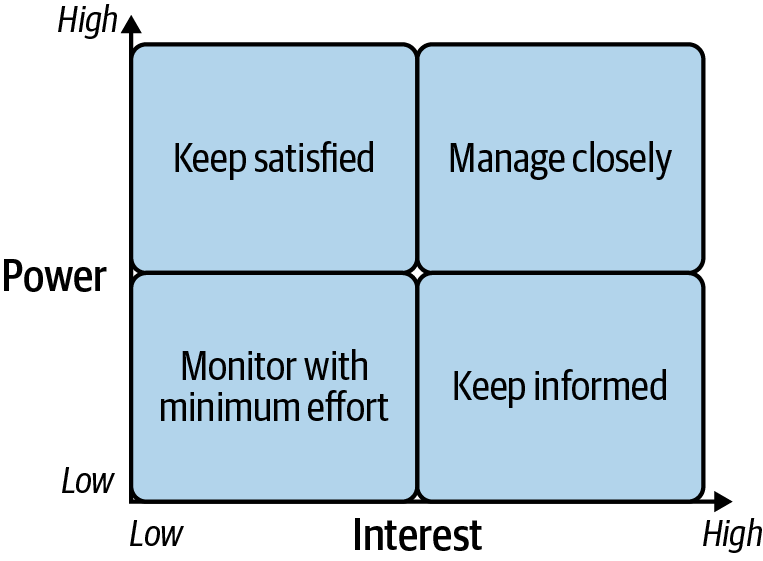
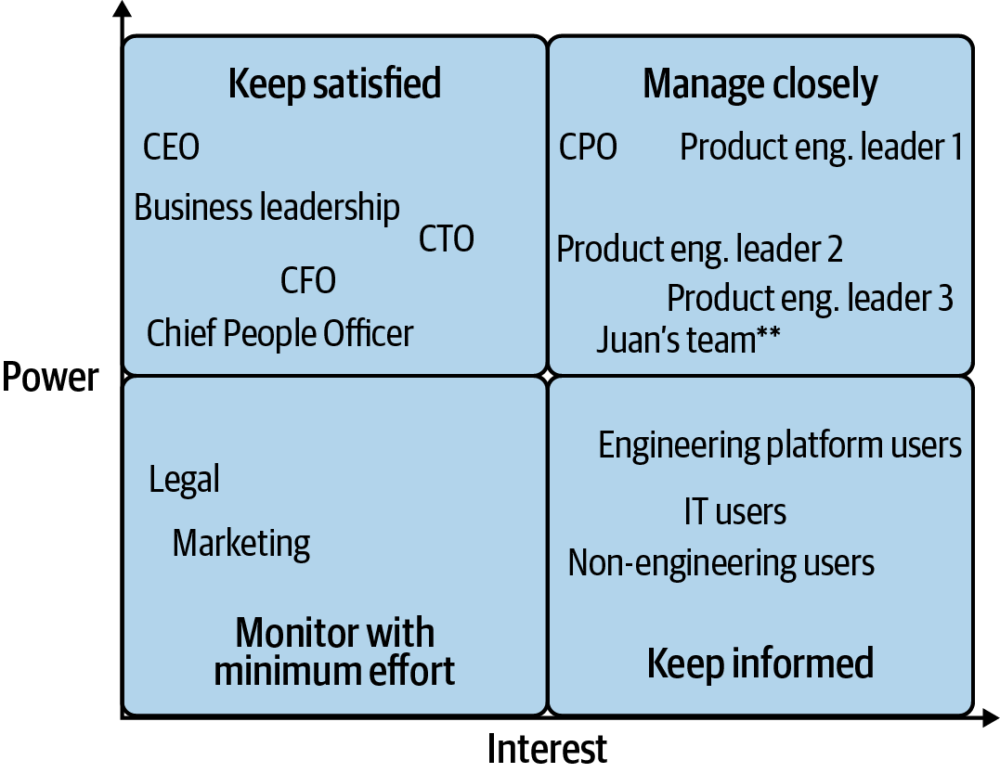

# Chapter 10: Managing Stakeholder Relationships

> **Part II — Platform Engineering Practices**

> *"Queens never make bargains."* — The Red Queen, in Lewis Carroll's *Through the Looking Glass*

Stakeholder management is the make-or-break capability for platform engineering leaders. The painful truth: no matter how well you deliver a rock-solid, customer-focused platform, if key stakeholders don't believe in your investments, you will be unsuccessful. A charismatic peer with a compelling vision can bleed off valuable investment on the basis of a good idea and a little execution — even when you know the new platform can't come close to providing all of the features of your current offering.

This chapter reframes stakeholder management not as "politics" but as an organizational inevitability driven by Dunbar's number. Once an organization exceeds 50-150 people, mini-organizations form with diverging practices, beliefs, and priorities. The "right decision for the business" from your perspective may not be the right decision from someone else's. Stakeholder management ensures your peers appreciate your context — so when conflicts arise, they don't just listen to their own team's complaints and blame you for everything.

The authors cover: mapping stakeholders using the power-interest grid, communicating with the right level of transparency, finding acceptable compromises (including on shadow platforms), and surviving budget scrutiny.

## Table of Contents

- [Is Stakeholder Management Just Unnecessary Politics?](#is-stakeholder-management-just-unnecessary-politics)
- [Stakeholder Mapping: The Power-Interest Grid](#stakeholder-mapping-the-power-interest-grid)
- [Communicating with the Right Transparency](#communicating-with-the-right-transparency)
  - [Beware of Oversharing Detail](#beware-of-oversharing-detail)
  - [The Stakeholder Is Always Right](#the-stakeholder-is-always-right)
  - [Use Regular 1:1s Judiciously](#use-regular-11s-judiciously)
  - [Track Expectations and Commitments](#track-expectations-and-commitments)
  - [Scale Up with Interlock Meetings and Customer Advisory Boards](#scale-up-with-interlock-meetings-and-customer-advisory-boards)
  - [Increase Communication During Rough Patches](#increase-communication-during-rough-patches)
- [Finding Acceptable Compromises](#finding-acceptable-compromises)
  - [Be Clear About the Business Impact](#be-clear-about-the-business-impact)
  - [Sometimes Say "Yes, with Compromises"](#sometimes-say-yes-with-compromises)
  - [Saying "No" Without Ruining the Relationship](#saying-no-without-ruining-the-relationship)
  - [Compromising on Shadow Platforms](#compromising-on-shadow-platforms)
- [Money Troubles: Cost and Budget Management](#money-troubles-cost-and-budget-management)
  - [Step 1: Figure Out Who Will Benefit Tomorrow](#step-1-figure-out-who-will-benefit-tomorrow)
  - [Step 2: Group the Work into Teams](#step-2-group-the-work-into-teams)
  - [Step 3: Come with Suggestions of What to Cut](#step-3-come-with-suggestions-of-what-to-cut)
- [Wrapping Up](#wrapping-up)

**Block types:** [Core Concept] [Deep Dive] [Anti-Pattern] [Worked Example] [Organizational Reality] [SRE/Production Lens] [Comparison] [Real-World Implementations]

---

## Is Stakeholder Management Just Unnecessary Politics?

Many engineers believe stakeholder management is just politics and dealing with bad actors. The authors used to agree — until they realized that peers they admired were also accused of self-interest and empire-building. The insight: the problem is much more about **organization size** than individuals.

**Dunbar's number** (50-150 people): at this threshold, organizations split into mini-organizations with diverging practices, beliefs, and priorities. Even with strong company culture, the "right decision for the business" differs depending on where you sit. Stakeholder management ensures peers have appreciation of your perspective and context so that when conflicts arise, they engage rather than simply blame.

The village metaphor: when customers act like a clannish village, it's perfectly natural. When their "mayor" (manager) brings the village's biggest problems to your attention, they expect it to become YOUR biggest problem too. You'd do the same in their position — gossip with peers about a dependency team's problems, then escalate to your own leadership.

> **[Organizational Reality: Dunbar's Number and Platform Teams]**
>
> Dunbar's number provides the structural explanation for why platform teams — which by definition serve multiple "villages" — face disproportionate stakeholder pressure. Platform teams sit at the intersection of every village's interests. Each village naturally prioritizes its own needs and views the platform through the lens of "what have you done for me lately?"
>
> This explains several common patterns:
> - Why platform teams get blamed for problems that are shared responsibilities (the village only sees its own perspective)
> - Why a single loud complaint from one team can overshadow quiet satisfaction from ten others (the mayor amplifies their village's pain)
> - Why "just build great technology" is insufficient — organizational structure itself creates friction independent of technical quality
> - Why the most technically excellent platform leaders sometimes fail — they optimized for engineering quality while ignoring the organizational reality that their continued existence depends on perceived value, not actual value
>
> The implication: stakeholder management isn't overhead on "real work." It IS part of the real work for anyone leading a platform team in an organization beyond Dunbar's number.

---

## Stakeholder Mapping: The Power-Interest Grid

The power-interest grid is a simple four-quadrant model for determining which stakeholders need your time. The y-axis is increasing power; the x-axis is increasing interest.

*Figure 10-1. Power-interest grid, showing the four quadrants of stakeholders based on their power within the organization and interest in your work*

**Quadrant definitions:**

| Quadrant | Power | Interest | Action |
|----------|-------|----------|--------|
| **Top-right** | High | High | Manage closely — spend significant time understanding these stakeholders |
| **Top-left** | High | Low | Keep satisfied — don't waste their attention, but maintain the relationship |
| **Bottom-right** | Low | High | Keep informed — overlap with product management's customer engagement |
| **Bottom-left** | Low | Low | Monitor — they only vaguely know what you do |

**High-power, high-interest stakeholders** are critical business leaders (or those with support of critical business leaders) who have either a direct product whose delivery depends on you, or a team unhappy with what you're delivering. The emphasis is negative: most are busy people who don't engage deeply when things are going well. If you make this group unhappy, you raise the risk of shadow platforms — or worse, your team getting broken up and absorbed.

*Figure 10-2. The power-interest grid showing Juan's stakeholders*

> **[Worked Example: Juan's Power-Interest Map]**
>
> Juan is VP of Platform Engineering. His team builds all common platforms and tools for every other engineering group. Three major product engineering teams are his stakeholders, plus nontechnical teams (Finance, HR). He reports to the CTO. Current state: nontechnical users are happy, product teams see platform as a "necessary nuisance."
>
> **Top-right (Manage Closely):** The CPO and leaders from the three major engineering teams — particularly those who rely on Juan's team most for their own product deliverables AND the most ambitious ones. Because Juan's team is not yet seen as a value-add, the minute the platform struggles, someone from this group will make a play. Juan's own team is also here, but lower on the power axis than his peers.
>
> **Critical insight:** Prioritizing making your own engineering team happy OVER your most powerful stakeholders is a tempting bargain that too often ends in tears. Senior stakeholders can tell when they are treated with secondary importance and will use it against you.
>
> **Top-left (Keep Satisfied):** The CTO (content to let things play out), business leaders busy with other things, the CFO, and chief people officer. This is an opportunity — nudging them into more engagement improves Juan's odds of surviving a battle with ambitious peers. But don't waste their attention.
>
> **Bottom-right (Keep Informed):** The actual engineering teams who use the platform day-to-day. They care about roadmap and features. Product management does most stakeholder management for this group.
>
> **Bottom-left (Monitor):** People who rarely interact with Juan's team. They'll care only when something is going very wrong.

**Self-assessment questions for building your own stakeholder map:**

- Who has the ear of the most senior leadership?
- Which teams are considered indispensable vs. nice-to-have? Where does MY team sit on this spectrum?
- If I did everything perfectly but a stakeholder still didn't like me, how much would it matter?
- Which stakeholder groups are the loudest? Of these, which are most respected?
- If my team overdelivered for this stakeholder, would it matter?

> **[SRE/Production Lens: The Power-Interest Grid for Reliability Investments]**
>
> The power-interest grid has a direct analog in how SRE/platform teams should think about reliability investment prioritization:
>
> - **Top-right services:** High business criticality AND high incident frequency. These get dedicated SRE attention, tighter SLOs, and priority in capacity planning. An outage here is an existential risk to the platform team's reputation.
> - **Top-left services:** High business criticality, low incident frequency. These are the "satisfied but powerful" stakeholders of your reliability practice — everything's fine until it isn't, and when it isn't, it's catastrophic. Investment here is insurance: chaos engineering, disaster recovery testing, game days.
> - **Bottom-right services:** Lower criticality but high incident rate. These consume disproportionate on-call attention. They're noisy but not existential — the analog of the engaged-but-lower-power engineering teams who use your platform daily.
> - **Bottom-left services:** Low criticality, low incident rate. Monitor only.
>
> The key insight: just as Juan's most important stakeholders are NOT the engineers using his platform daily (they're bottom-right), your most important reliability investments are NOT necessarily the noisiest services. They're the ones where a failure would cause your most powerful stakeholders to question the platform's existence.

---

## Communicating with the Right Transparency

Once you've mapped stakeholders, think about communication: how much do you tell them, when do you tell them, and how?

### Beware of Oversharing Detail

Too much transparency causes just as many problems as too little. Four failure modes:

**1. External micromanagement.** Providing too much transparency encourages stakeholders to treat you like an execution arm they control — undermining your strategy and creating unnecessary second-guessing.

**2. Tuning you out.** Stakeholders drowned by minutiae start ignoring you. When things go wrong, this overload contributes to mistrust — they feel you're deliberately distracting them from meaningful information.

**3. Focusing on the wrong details.** Stakeholders given too much information sometimes fixate on things that don't matter. Example: a stakeholder looking at 24 green SLO graphs obsesses over the one slightly red noisy measure, even though the engineering team is comfortable it's just noise.

**4. Relationship damage.** Highly technical platform leaders try to resolve disagreements by dumping engineering details on stakeholders. Unless stakeholders are prepared to evaluate that level of nuance, they're left thinking the leader is a bad communicator.

**The guideline:** For broad messaging (including Wins and Challenges from Chapter 7), focus on what message you want stakeholders to take away. Don't compromise accuracy — but send the message without extra detail. If specific stakeholders ask for more, you'll know what's important to them and can tune accordingly.

> **[Anti-Pattern: The Technical Details Dump]**
>
> Platform leaders with strong technical backgrounds often believe that providing MORE technical evidence will settle disagreements. This almost always backfires:
>
> - A VP of Infrastructure presents 15 slides of latency histograms to explain why a migration timeline can't be shortened. The product VP's takeaway: "I don't understand what they're doing, and they can't explain it simply."
> - A platform architect sends a 3000-word RFC to stakeholders explaining why their architecture choice is correct. The stakeholders' takeaway: "They're being defensive and making this more complicated than it needs to be."
>
> The underlying mistake: assuming that the person who provides the most detailed argument wins. In reality, stakeholders evaluate communication quality, not technical accuracy. If you can't make your case in business terms they understand, you lose — regardless of whether you're technically correct.
>
> **What works instead:** Make your case in terms of business impact. "If we shorten the migration timeline by 4 weeks, we accept a 30% probability of a multi-hour outage affecting $X revenue" is more persuasive than any latency histogram.

### The Stakeholder Is Always Right

Stakeholders amplify the worst noise from their own teams. A small mishap you handled well internally becomes "that platform team is a bad owner" or "builds technology for the sake of building technology." You approach the stakeholder hoping for a rational cost/benefit discussion — instead, they double down, question your leadership choices, and say they "just want matters solved."

This comes down to the old sales saying: "The customer is always right." We think that because stakeholders are also engineering leaders they should have a balanced perspective. Unfortunately, this is rarely the case. Common patterns:

- **Internal vendor mentality:** Stakeholders view you as a vendor and don't believe you can appreciate their jobs — especially because they think you're the source of many of their problems. Resistant to hearing ideas from you about what their teams could do better.
- **I could do your job better:** Stakeholders believe they could manage your team better, even though their advice addresses only the subset of problems that impacts them.
- **Amnesia about past value:** Stakeholders forget what you did yesterday or how much better the platform is now vs. a year ago. Human nature: people stop noticing the absence of problems.

**The acceptance:** The sooner you accept that customers will rarely be satisfied, that their leaders will always bring you problems, and that your job is to roll with it and keep moving forward, the happier you will be.

> **[Organizational Reality: The Asymmetry of Platform Perception]**
>
> The "stakeholder is always right" framing reveals a fundamental asymmetry in how platform teams are perceived:
>
> **What stakeholders remember:**
> - The time the platform was down for 2 hours during a product launch
> - The feature request that took 6 months to deliver
> - The migration that required their team to change 200 lines of code
>
> **What stakeholders forget:**
> - The 364 days the platform was up
> - The 50 features that shipped on time
> - The migration that you absorbed entirely so they didn't have to change anything
>
> This isn't malice — it's cognitive bias (negativity bias + adaptation). The practical implication: you must ACTIVELY communicate value (per Chapter 7's Wins and Challenges) because silence is interpreted as absence of value, never as "everything is working perfectly." Platform teams that rely on their work speaking for itself are structurally disadvantaged against teams whose work is inherently visible.

### Use Regular 1:1s Judiciously

Incoming platform leaders should begin with several stakeholder 1:1s to hear concerns, assess power/interest, and understand needs and motivations. But beware of relying on this technique indefinitely.

**Three warnings about 1:1s:**

1. **They scale linearly.** As your platform grows, you can't maintain the same depth with all relationships. Slowing cadence with some stakeholders signals their unimportance.

2. **Bad relationships make 1:1s painful.** When the relationship is strained, stakeholders view unnecessary 1:1s as yet another cost your team imposes on them.

3. **Privacy is a weakness.** When most stakeholders tell you in private they're happy with your trade-offs, unhappy stakeholders aren't there to hear it. Telling unhappy stakeholders "my other stakeholders agree with me" sounds whiny, even when accurate.

**Recommended cadence:**
- **Quarterly** 1:1s with "Keep Satisfied" / "Keep Informed" stakeholders
- **Monthly** 1:1s with "Manage Closely" stakeholders

### Track Expectations and Commitments

A typical day: commit to looking into something in a stakeholder 1:1 → go straight into another meeting → get paged into an operational event → details forgotten. The stakeholder may not raise it next time (they probably didn't track it either) — but it will resurface at an inopportune time as a "missed commitment."

**Don't rely on memory.** Write down commitments. Don't take formal minutes in a shared document (comes across as political scorekeeping). Instead: take private notes, then email the stakeholder with exact expectations so they can clarify.

> **[Deep Dive: Commitment Tracking as Trust Infrastructure]**
>
> The commitment tracking advice seems like "Communication 101" — but it has outsized impact for platform teams specifically because:
>
> 1. **Volume problem:** Platform leaders have MORE stakeholders than typical engineering leaders (you serve everyone), so the surface area for dropped commitments is larger.
> 2. **Interrupt-driven days:** Operational events disrupt platform leaders more than application team leaders. The "paged into an incident, forgot the commitment" scenario is weekly, not rare.
> 3. **Asymmetric memory:** Stakeholders remember what you promised (it maps to their pain). You don't remember (it was one of 15 commitments that day). This creates a structural trust deficit.
> 4. **Compound effect:** One dropped commitment is forgiven. Three in a quarter becomes "that team can't be relied on." The perception compounds faster than individual instances would suggest.
>
> A lightweight system (even a running note per stakeholder in your task manager, reviewed before each 1:1) prevents the slow erosion of trust that no amount of good engineering can repair.

### Scale Up with Interlock Meetings and Customer Advisory Boards

Because 1:1s don't scale, you need broader meetings. The most popular form: **interlock meetings** — representatives of the platform group meet with stakeholders to discuss work in progress and get feedback. Held biweekly, monthly, or quarterly depending on stakeholder sensitivity.

At the quarterly level: **Customer Advisory Boards (CABs).**

Often owned by product management, but don't leave ALL communication to product/program managers. When stakeholders are struggling due to operational challenges or engineering delivery issues, the best people to own that communication are the engineers who operate and deliver the platform.

**Preparation essentials:**
- What you want to get out of the meeting
- What information and decisions will be presented
- How to let participants have a voice while keeping structure (anti-pattern: presenting slides for 55 minutes, leaving 5 minutes for questions)

**When these meetings work best:** They help your loudest critics understand they're in disagreement not only with you, but with most of your other stakeholders.

**When they go poorly:** You're soliciting opinions on decisions that extend beyond stakeholders' understanding of trade-offs — the meeting becomes a battle over which teams' needs are most important.

> **[Real-World Implementations: Stakeholder Communication at Scale]**
>
> **Power-Interest mapping — Miro/FigJam stakeholder templates:**
> The chapter's power-interest grid is a living document, not a one-time exercise. Miro and FigJam offer dedicated stakeholder mapping templates with the four quadrants. The value: making the map visual and shareable with your leadership team so that "who should we engage on this decision?" has a documented answer, not a guess. Update it quarterly as organizational power shifts (reorgs, new executives, project completions that reduce interest). The anti-pattern: keeping the map in your head, where it dies when you leave the role.
>
> **1:1 commitment tracking — Notion relations / 15Five:**
> The chapter warns about dropped commitments eroding trust. Notion's relational databases let you maintain a "Stakeholder Commitments" table linked to both the stakeholder record and your task system — before each 1:1, filter to see open commitments for that person. 15Five (or similar async check-in tools) can capture commitments as action items tied to meeting dates. The key: review the list BEFORE the meeting, not after. Walking in and proactively updating "here's where we are on X from last time" signals reliability without the stakeholder having to ask.
>
> **Interlock meetings and CABs — Productboard / Aha! customer portal:**
> The chapter describes interlock meetings where stakeholders give feedback on work in progress. Productboard's customer portal lets stakeholders submit and vote on feature requests asynchronously — reducing the "everyone fights for airtime in the meeting" problem. The interlock meeting then becomes about decisions and trade-offs, not about collecting requests. Aha!'s ideas portal serves the same function. Both tools address the chapter's concern about meetings "turning into a battle over which teams' needs are most important" — because raw demand is already captured and ranked before the meeting starts.
>
> **Stakeholder satisfaction measurement — quarterly NPS/CSAT surveys (SurveyMonkey/Typeform):**
> The chapter says stakeholders "rarely be satisfied" but doesn't prescribe measurement. A quarterly 5-question survey to platform customers (not their leaders) gives you quantitative signal on satisfaction trends. Track over time. The survey itself signals that you care — and the results give you ammunition in stakeholder 1:1s. "Our customer satisfaction improved from 3.2 to 4.1 this quarter" is a data point that's hard for a hostile stakeholder to dismiss.

### Increase Communication During Rough Patches

When things are going well: keep stakeholder meetings lightweight, let product management handle most engagement.

When things are NOT going well (operational instability, features not delivered, budget crunch): **ramp up transparency and communication until the rough patch has passed.** Bring the right information, conveyed by the appropriate owners, and supplement meetings with email/chat updates as needed.

---

## Finding Acceptable Compromises

Even with great planning and communication, you'll face disagreements and escalations. Stakeholders believe that being closer to business revenue means they understand "right" better than an internal platform team. You must address these thoughtfully — ensuring stakeholders feel their perspective is considered even when you think they're unreasonable.

Determining "what platform work will be of highest value to the business" is generally **not feasible** — it involves different judgments about probable value of what will be built on top of it. Escalating up the chain often results in leadership demurring: too many uncertainties for a definitive call. Instead, they want you to **compromise.**

### Be Clear About the Business Impact

When you're saying no, the worst thing you can do is lean on excuses. If you want to reach a compromise, you have to make your case in **terms of business impact** — not technical complexity, not team capacity, not architectural purity.

Common excuses that don't work:
- "The platform is unstable so changes are hard" (stakeholder hears: you built it badly)
- "We're future-proofing" (stakeholder hears: you're gold-plating instead of helping me)
- "We've had turnover" (stakeholder hears: you can't retain people)
- "You keep changing your minds" (stakeholder hears: you're blaming us)

**The standard:** At the point of saying no, look at the current status and value of your work:
- How much is dedicated to things customers want NOW as a high priority?
- How much is invested in speculative work, future-proofing, or stability/debt remediation?
- Even for stability work: you're measuring something — report on how it's improving.

**Your stakeholders should not need to accept your word about business impact. They should be able to SEE it.**

> **[SRE/Production Lens: Making Reliability Work Visible as Business Impact]**
>
> The "be clear about business impact" advice is particularly challenging for reliability investments, which are by nature preventative. How do you demonstrate business impact for something that prevents an incident that never happened?
>
> **Techniques that work:**
> - **Cost of downtime calculation:** "Our platform serves 2000 req/sec for the checkout service. At $X revenue/minute, every minute of downtime costs $Y. This reliability investment reduced our P(outage) from Z% to W% per quarter."
> - **Incident trend reporting:** "12 months ago we had 4 SEV-1 incidents per quarter affecting your team. After our stability investment, we're at 0.5. Here's the trend chart."
> - **Comparative evidence:** "Teams on our platform experienced 3x fewer production incidents than teams on the shadow platform last quarter."
> - **Toil reduction as delivered capacity:** "Automating failover testing freed 2 engineers' worth of capacity, which we redirected to Feature X that you requested."
>
> The meta-lesson: SRE/platform teams that can't translate reliability into business language will always lose budget fights to teams with visible output. The measurement discipline from Chapter 6 (SLOs, operational metrics) exists specifically to provide this translation layer.

### Sometimes Say "Yes, with Compromises"

It's common to work against a roadmap that neglects small things important to smaller customer groups. But small doesn't mean uninfluential. Check their position in your stakeholder map — they might be:
- The darling of an important executive
- Quick to complain and influential on broader opinion
- Working on a high-profile project everyone watches
- A team you owe because you keep deprioritizing their requests

**When to say yes:** Particularly when something does NOT imply a large up-front investment or high ongoing support burden. Buy political capital by flexing for high-profile customers.

**Two extremes to avoid:**

| Extreme | Behavior | Result |
|---------|----------|--------|
| **Always "yes"** | Every request causes you to jump and patch in features | Frankenstein's monster platform — harder to evolve, no overarching goal. Sign of discomfort saying no, or lacking clear strategy. |
| **Always "no"** | Totally inflexible, build only what YOU think is right | Stakeholders frustrated, and when you hit any setback, they point out you're impossible to work with AND can't execute. |

**The vision trap:** The least effective platform leaders the authors managed were often the ones with the STRONGEST technical and product vision. They believed vision gave them sufficient knowledge to make right choices for the business. They refused to compromise, insisted all current problems were the result of past compromises, and when setbacks hit, frustrated stakeholders piled on.

**Compromise mechanics:** Look for compromises around scope and timing:
- Is there a stripped-down offering you can create faster for their most valuable needs?
- Can they adjust their timelines to give you extra time while they work on other parts?
- Negotiate the minimal realistic "yes," then inform other stakeholders of any priority changes.

> **[Worked Example: Jordan West's "Yes, with Compromises"]**
>
> Jordan joined a platform team formed after a reorg. Prior team's reputation: couldn't deliver. Initial strategy: greatly limit scope — said yes to delivering THREE things in 12 months, delivered above and beyond.
>
> **Result of saying no:** The next year, complaints shifted from "can't deliver" to "says no too much." Feedback was overwhelming.
>
> **Pivot:** "Yes, with compromises" to many more things, but greatly limiting scope of each.
>
> **Example 1 — Graph storage:** Committed to support only small and medium use cases in first release, explicitly excluding "hot path" workloads that could bring the website down. Communicated that next planning round would revisit larger-scale solution.
>
> **Example 2 — Versioned datasets:** (Data from warehouse into OLTP databases.) Long-term vision: incremental updates. First year commitment: data movement for static datasets only.
>
> **Outcome:** Both approaches covered good portions of use cases, keeping early adopters happy. Those wanting full feature sets were satisfied because a plan and timeline existed. Team perception improved dramatically.
>
> **The lesson:** The pendulum swings. "Prove you can deliver" (say yes to few things, deliver excellently) eventually must evolve to "prove you can serve broadly" (say yes to many things with limited scope). Neither extreme works permanently.

### Saying "No" Without Ruining the Relationship

This depends on the relationship, your team's positioning, and magnitude of the request. Assuming you CAN ultimately say no (even if it costs political points):

**Four "no" patterns:**

**1. Not yet, priority call.** You think it's valuable but can't prioritize now. Leave stakeholder with clarity on WHEN you might deliver it, plus options if they need it sooner. You might guide them through implementing it themselves (something you can take back later). Offer someone from your team to partner on the build — helps them and gives you design input.

**2. Not yet, technical call.** You're not technically ready to provide the feature. The partner team can't unblock you. Explain the technical blockers. Don't back down — pretending you can build what they want will damage your reputation and stability long-term. Still look for workarounds they could use until you're ready.

**3. No, product strategy call.** Not everything belongs in your platform. Resist empire-building by saying yes to everything someone requests. Understand your core mission. Mission creep dilutes value and makes the platform harder to support. Goes over best if your platform allows workarounds, self-managed extensions, or you can point them to a different system.

**4. No, technical call.** Some things aren't technically feasible. This is why platform teams need former engineers in leadership: they understand that not every good idea can be built. Don't be afraid to say no to infeasible things — just explain WHY to the engineers.

**General guidance for hard "no" conversations:**
- Don't make it about ego
- Stakeholders aren't "stupid" for not seeing limitations
- Have a plan or recommendation for what else they can do
- Leave them feeling you care about their problem even though you can't help
- Don't shut them down completely — offer alternatives

> **[Comparison: The Four "No" Patterns and When Each Applies]**
>
> | Pattern | Signal to Stakeholder | Risk if Misapplied | When to Use |
> |---------|----------------------|---------------------|-------------|
> | **Not yet (priority)** | "We value this but other things come first" | Stakeholder hears "never" if you keep repeating it | When you genuinely plan to do it and can give a realistic timeline |
> | **Not yet (technical)** | "We literally can't yet" | Sounds like incompetence if overused | When there are genuine technical prerequisites |
> | **No (strategy)** | "This doesn't belong in our platform" | Perceived as empire-hoarding if the thing IS clearly platform-adjacent | When adding it would dilute your core mission |
> | **No (technical)** | "This can't be built safely" | Sounds like lack of ambition | When operational/architectural reality makes it genuinely infeasible |
>
> The meta-skill: choosing the RIGHT "no" pattern. Giving a "not yet, priority" answer when the real answer is "no, strategy" just defers conflict and creates false expectations. Being honest about which type of "no" you're delivering builds long-term credibility even when it's uncomfortable short-term.

### Compromising on Shadow Platforms

Shadow platforms duplicate the function of a current platform, often using different underlying OSS/vendor technologies with a slightly different feature set or system profile. Infuriating to platform engineers, who want to prevent "the wrong thing" from happening and escalate to management.

**Five drivers of shadow platform creation:**

1. **Can't wait, won't wait.** A burning need that can't get on platform team's schedule. May be false urgency or may be a legitimate tight window of business opportunity.

2. **Novel demand.** Team needs something not on anyone else's radar (e.g., a graph database for a brand-new business). You won't support it because no other teams are asking.

3. **Don't want to collaborate.** Poor relationship with platform team. Impatience with coordination overhead. Past bad experiences. Conflict avoidance — engineers prefer building alone rather than negotiating with another team.

4. **Don't appreciate the operator cost.** Team hears your "no," decides to build it anyway, not understanding the operational cost will be far more than they bargained for. Likely to boomerang into something you have to support.

5. **Engineers just want to build.** Application teams have engineers who'd rather build new systems than add incremental product features. Some companies INCENTIVIZE this by making promotion dependent on building new systems — creating perverse motivation to invent big problems rather than collaborate with platform teams.

> **[Anti-Pattern: Promotion-Driven Shadow Platforms]**
>
> The fifth driver — "engineers just want to build" — is the most insidious because it's incentive-driven, not need-driven. When a company's promotion criteria require "building something new from scratch" (common at FAANG-influenced companies), engineers are structurally incentivized to:
>
> 1. Frame existing platform capabilities as insufficient (to justify building something new)
> 2. Build a shadow platform optimized for their promotion case (demonstrating "technical leadership")
> 3. Get promoted based on the launch
> 4. Move to a new role, leaving the shadow platform to rot (or worse, leaving it for the platform team to maintain)
>
> The platform team is left with: (a) a competing system that fragments the ecosystem, (b) no one willing to maintain it, and (c) a precedent that encourages others to do the same.
>
> **The fix is organizational, not technical:** Engineering leadership must recognize "chose to use and improve the existing platform" as equally promotion-worthy as "built a new one." Until that changes, shadow platforms will keep appearing no matter how good your stakeholder management is.

**Strategies for dealing with shadow platforms:**

**Break down the silos.** Clean up us-versus-them culture in your own team. Engage with other teams' leadership. Get earlier insight into their needs. Become a trusted advisor they consult before building on their own.

**Partner on urgent issues.** Technology innovation necessarily means getting away from existing solutions. If it seems like a genuine need not covered by your platform, it may be best to let them run — but partner to help with the build and understand what's created. Set clear boundaries about whether you'll eventually take over support and operations.

**Be patient and accept cleanup duty.** Sometimes a team will build something no matter what. Coach yourself to be humble about what you do/don't know. Sometimes you'll be surprised by what the shadow team pulls off. At the very least, stakeholders learn what it means to operate a scrappy platform — and better understand your problems. Yes, sometimes you end up taking over their barely-working system and turning it into platform-quality. Embrace cleanup as an opportunity: good ideas often come from people close to a problem.

> **[Organizational Reality: The Shadow Platform Lifecycle]**
>
> Shadow platforms follow a predictable lifecycle that platform leaders should recognize early:
>
> **Phase 1 — Honeymoon (months 1-6):** Team is excited, building fast, showing progress. Platform team looks slow by comparison. Executive attention is positive: "look at what this small team accomplished."
>
> **Phase 2 — Reality (months 6-18):** Operational costs mount. On-call burden grows. Original builders start leaving or losing interest. Edge cases multiply. The "simple" platform turns out to need all the things the main platform already has: observability, auth, multi-tenancy, backup/restore, capacity planning.
>
> **Phase 3 — Reckoning (months 18-36):** Either: (a) the shadow platform gets abandoned and users migrate back, (b) the platform team absorbs it (the "cleanup crew" scenario), or (c) it limps along as an under-maintained liability that nobody owns.
>
> **The platform leader's leverage:** Time. If you maintain the relationship through phases 1 and 2 (offering help, not gloating, keeping communication open), you're positioned to absorb the good ideas in phase 3 without the organizational damage of having fought a war during phase 1. The worst response — escalating to block the shadow platform during the honeymoon phase — makes you look threatened and territorial, even when you're technically right about the long-term costs.

---

## Money Troubles: Cost and Budget Management

The most painful moment for platform teams: a downturn (economic or company-specific) when someone starts asking whether your team should really exist, what you're working on, and whether you're adding enough value.

**Two brutal truths about platform teams in downturns:**

**Roadmaps don't matter.** Your bottom-up plan from Chapter 7? Everything beyond KTLO will be viewed as irrelevant plans made when times were good. Every team ends up rejustifying size and roadmap — business-aligned application teams aren't spared either.

**Metrics don't help.** Platform teams at best have loose metrics aligned to outcomes. Developer productivity? Few care when the company is trying to survive. Reliability? You'll be asked why a smaller team can't do better. Efficiency? Rarely matters unless you can save significant money quickly.

**The mandate:** Tie your work much more directly to the success of protected business outcomes. Enable someone's pet project, make the flagship product team's engineering lead happy, or sell a story about unacceptable risks. Now is the time to align with business outcomes.

### Step 1: Figure Out Who Will Benefit Tomorrow

Go through all work NOT in KTLO. For each major project: which customers want it, and what's the value?

**Projects closely coupled to high-profile business initiatives:** Talk them up even more. Bucket loosely related discretionary work with these initiatives. Build more valuable things by tying work to highest-value customers.

**Projects that don't line up with big business cases:** Three options:

| Option | When | Action |
|--------|------|--------|
| **Pause** | Early, unclear, overstaffed | Stop completely. Not the time for expensive speculation. |
| **Shrink** | Has some kernel of value | Fold into something everyone agrees is important. |
| **Sell the value** | Team feels strongly | Make the case for business benefit. Get stakeholders aligned. Accelerate to value creation. Get a specific senior sponsor. Give team a chance to sell — cutting is demotivating. |

### Step 2: Group the Work into Teams

Do NOT report on which individuals are doing what (invites pointless scrutiny, pretends accuracy you don't have).

**Group work into chunks:**
- No smaller than a single project team (3-5 people)
- No bigger than a double-sized team (10-12 people)

This prevents the mistake of saying you can trim every area evenly. Teams should NOT be uniformly overstaffed by some percentage. When doing justifications (or cuts), determine **whole initiatives to cut** so you can spare other initiatives and retain their focus.

### Step 3: Come with Suggestions of What to Cut

**Critical principle:** If you try to defend everything and claim you can't possibly cut anything, you signal that you aren't taking the situation seriously. People respond to strength and weakness.

**The approach:**
- Preemptively decide what should be reduced or eliminated
- Come to the table ready with suggestions
- Inform suggestions with customer/stakeholder feedback (if no one understands why you're doing something and you can't explain it, that's a red flag)
- Don't let suggestions be entirely decided by stakeholder feedback either — YOU are the expert and owner
- Defend the things others don't understand but you strongly believe are essential

**Outcome:** You may cut more than you want. But by strategizing ahead, you preserve the most important investments (barring a massive 40-50% cut mandate). Strong stakeholder relationships minimize pain — trust gives you power to shape cuts the way you think is best.

> **[SRE/Production Lens: Budget Cuts and the Reliability Cliff]**
>
> Platform teams face a unique danger during budget cuts: the **reliability cliff**. Unlike application teams where cutting headcount linearly reduces feature output, cutting platform/SRE headcount can create a nonlinear collapse:
>
> - At full strength: team handles operations + improvements + features
> - At 80%: team handles operations + some improvements, features slow
> - At 60%: team handles operations only, improvements stop, tech debt accumulates
> - At 50%: team can barely handle operations, on-call burden becomes unsustainable, attrition accelerates
> - Below 50%: cascading failure — incidents increase because no one has time to fix root causes, each incident consumes more capacity, further reducing time for fixes
>
> **Making this visible to budget decision-makers:**
> - Map the KTLO estimate from Chapter 7 directly to headcount: "At X people, our KTLO consumes 100% of capacity. Zero feature delivery, zero improvement."
> - Show the historical correlation between team size and incident rate
> - Present the "what will break" list honestly: "At Y people, we cannot maintain SLO for Service Z. Here is the business impact."
>
> The three-step budget process from this chapter (identify business value, group by teams, come with cut suggestions) must include this cliff analysis. Your "suggestions of what to cut" should explicitly avoid the cliff: suggest cutting whole initiatives while preserving minimum viable operational capacity.

> **[Real-World Implementations: Budget Defense and Cost Attribution]**
>
> **Cost attribution — Kubecost / CloudZero / Apptio:**
> The chapter's Step 1 ("figure out who will benefit tomorrow") requires knowing which business units benefit from which platform investments. Kubecost attributes Kubernetes spend to teams/namespaces/labels, answering "how much of the platform cost serves Team X's workloads?" CloudZero maps cloud spend to business dimensions (products, features, customers) rather than just AWS accounts — the "which customers want it and what's the value" question from the chapter. Apptio (IBM) operates at the IT financial management level, connecting technology spend to business capabilities. Together, these tools transform the budget conversation from "platform costs $X" (a liability) to "platform enables $Y of business value distributed across these teams" (an investment).
>
> **Initiative grouping — OKR frameworks (Gtmhub/Quantive, Ally.io):**
> The chapter's Step 2 says "group work into chunks no smaller than a project team." OKR tools provide the structural framework: each Key Result maps to a team-sized initiative. During budget review, you can show "here are our 8 Key Results, each staffed by 4-8 people, here's the business objective each serves." Cutting becomes a conversation about which objectives to drop, not which individuals to fire. The OKR structure also makes Step 3 easier: objectives with weaker business alignment become natural candidates for "suggestions of what to cut."
>
> **Stakeholder trust during cuts — blameless budget postmortems:**
> The chapter emphasizes that strong pre-existing stakeholder relationships minimize pain during cuts. One practice that builds this trust: after a budget cut round, run a "budget postmortem" with key stakeholders — what was cut, what was preserved, what the expected impact is, and how you'll monitor for problems. This mirrors incident postmortems: transparent, blameless, focused on outcomes. Stakeholders who feel included in the aftermath (even if they weren't consulted on the cuts themselves) are less likely to use the situation against you later.

---

## Wrapping Up

Platform teams live and die on stakeholder relationship management. You need to understand how stakeholders relate to your team, what they care about, and how to communicate and negotiate effectively. This doesn't come naturally to engineers, but you can't just delegate it to product management and hope it takes care of itself.

**Key touchpoints:**
- 1:1s for private relationship-building
- Interlocks and advisory meetings for group alignment
- Increased communication during tough times

**Negotiation principles:**
- Say yes when it's easy
- Say yes when the request has clear, pressing business value
- Say no (or not yet) when necessary, accepting that shadow platforms may result
- Always aim for win/win — even providing advice on someone else's platform builds future leverage

**Budget survival:**
- Know which areas could be cut vs. which are must-dos
- Show that you take budget cuts seriously
- Come to the table with suggestions — don't just defend everything
- Strong relationships established BEFORE the crisis provide the power to shape cuts favorably

The relationship with your stakeholders doesn't need to be a zero-sum game. You are all playing for the same larger team, and the goal is to win through the best business outcomes.

> **[Core Concept: The Platform Leader's Paradox]**
>
> This chapter reveals a fundamental paradox of platform leadership: the skills that make someone an excellent platform BUILDER (deep technical vision, strong opinions on architecture, high standards for code quality) are often orthogonal to — or even in tension with — the skills that make someone a successful platform LEADER (political awareness, willingness to compromise, communication calibrated to audience, comfort with ambiguity about "right" answers).
>
> The authors' observation that "the least effective platform leaders were often the ones with the strongest technical and product vision" is not an indictment of technical excellence. It's a warning about the transition: the same conviction that let you build a great system from scratch can become rigidity when the job shifts from "build the right thing" to "navigate organizational complexity while building a good-enough thing that enough people support."
>
> Platform leadership requires holding two truths simultaneously:
> 1. You probably DO know better than your stakeholders what the platform should look like technically
> 2. Being right about technology while being wrong about relationships still results in failure
>
> The successful platform leader finds ways to be technically excellent AND organizationally savvy — not by sacrificing one for the other, but by recognizing that stakeholder management is an engineering discipline in its own right: understanding the system (the organization), measuring its behavior (power-interest mapping), operating it reliably (communication cadence), and optimizing for outcomes (compromise mechanics).
