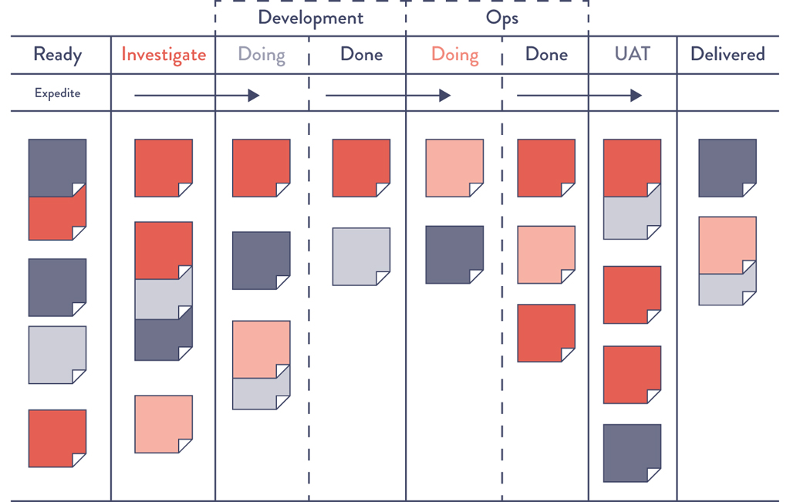
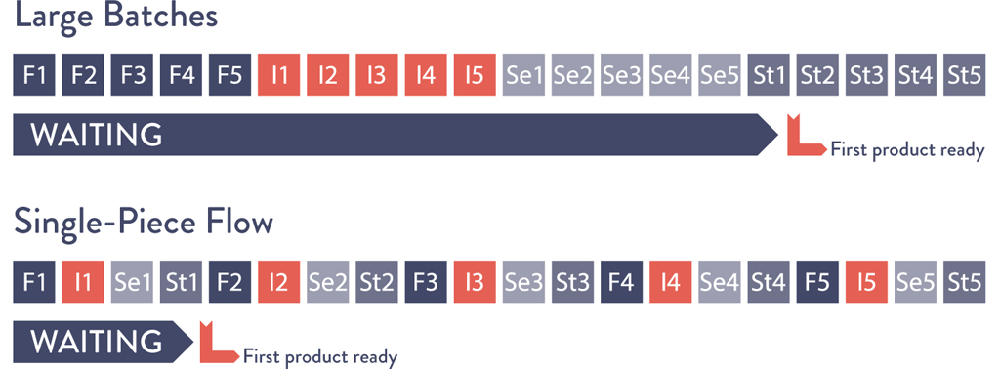

# Chapter 2: The First Way — The Principles of Flow

> **Part I -- The Three Ways**

This chapter is the operational manual for the First Way, introduced conceptually in Chapter 1. Where Chapter 1 defined the Three Ways at a high level, Chapter 2 dives deep into the mechanics of achieving fast, smooth, left-to-right flow through the technology value stream. It covers six concrete principles -- making work visible, limiting WIP, reducing batch sizes, reducing handoffs, identifying and elevating constraints, and eliminating waste -- each illustrated with manufacturing analogies, software examples, and a powerful healthcare case study. These principles form the foundation that everything in Parts III and IV of the book builds upon.

## Table of Contents

- [Make Our Work Visible](#make-our-work-visible)
- [Limit Work in Process (WIP)](#limit-work-in-process-wip)
- [Reduce Batch Sizes](#reduce-batch-sizes)
- [Reduce the Number of Handoffs](#reduce-the-number-of-handoffs)
- [Continually Identify and Elevate Our Constraints](#continually-identify-and-elevate-our-constraints)
  - [The Typical Constraint Progression in DevOps Transformations](#the-typical-constraint-progression-in-devops-transformations)
- [Eliminate Hardships and Waste in the Value Stream](#eliminate-hardships-and-waste-in-the-value-stream)
  - [The Nine Categories of Waste and Hardship](#the-nine-categories-of-waste-and-hardship)
  - [Case Study: Flow and Constraint Management in Healthcare (2021)](#case-study-flow-and-constraint-management-in-healthcare-2021)
- [Conclusion](#conclusion)
- [How Generative AI Is Reshaping the Principles of Flow](#how-generative-ai-is-reshaping-the-principles-of-flow)
  - [GenAI and Visibility of Work](#genai-and-visibility-of-work)
  - [GenAI and WIP / Batch Sizes](#genai-and-wip--batch-sizes)
  - [GenAI and Handoffs](#genai-and-handoffs)
  - [GenAI and Constraint Identification](#genai-and-constraint-identification)
  - [GenAI and Waste Elimination](#genai-and-waste-elimination)
  - [The Meta-Question: Does AI Change the Principles of Flow?](#the-meta-question-does-ai-change-the-principles-of-flow)

---

## Make Our Work Visible

The chapter opens with the fundamental problem that distinguishes technology from manufacturing: **work in the technology value stream is invisible.** In manufacturing, you can physically see inventory piling up on the factory floor, you can watch parts move between stations, and you can spot bottlenecks with your eyes. In technology, work lives in ticketing systems, code repositories, email threads, chat messages, and -- worst of all -- in people's heads. Because the work is invisible, flow impediments and piling queues remain hidden until a deadline is missed or production breaks.

The invisibility problem is compounded by how easy it is to transfer work in technology. In manufacturing, moving inventory between work centers requires physical effort -- forklifts, carts, staging areas -- which makes the transfer visible and naturally discourages frivolous handoffs. In technology, transferring work is as simple as reassigning a ticket, which means work can "bounce between teams endlessly due to incomplete information, or work can be passed onto downstream work centers with problems that remain completely invisible until we are late delivering what we promised to the customer or our application fails in the production environment."

**The solution: visual work boards.** The authors advocate for kanban boards or sprint planning boards where work is represented on physical or electronic cards. Work originates on the left side (often pulled from a backlog), moves through columns representing work centers, and finishes on the right side in a column labeled "done" or "in production."

The critical requirement is that the kanban board must **span the entire value stream**, from requirements through development, testing, staging, and into production. Work is defined as completed only when it reaches the right side of the board -- not when Development finishes coding.

*Source: David J. Andersen and Dominica DeGrandis, Kanban for IT Ops, training materials for workshop, 2012.*

Key benefits of making work visible:

- **Prioritization in context of global goals:** When all work for each work center sits in visible queues, stakeholders can prioritize based on organizational goals rather than local urgency.
- **Single-tasking on highest priority:** Each work center can focus on the highest-priority item until completion, increasing throughput.
- **Surfacing unnecessary handoffs:** Visual boards expose handoff steps that introduce errors and delays.
- **Measuring lead time:** You can simply measure from when a card enters the board to when it reaches "done."

> **[Deep Dive: Designing an Effective Kanban Board for the Technology Value Stream]**
>
> The book's Figure 2.1 shows columns for Requirements, Dev, Test, Staging, and In Production. In practice, designing an effective board requires careful thought:
>
> **Column design should mirror your actual value stream, not an idealized one.** If your real process includes "Waiting for Security Review" and "Waiting for CAB Approval," those should be explicit columns -- even though they represent waste. Making waste visible is the first step to eliminating it.
>
> **Separate "doing" from "waiting" within each stage.** A common pattern:
>
> | Dev (Doing) | Dev (Done / Waiting for QA) | QA (Doing) | QA (Done / Waiting for Deploy) | Deploy |
> |---|---|---|---|---|
> | Card A | Card B, Card C | Card D | Card E, Card F, Card G | Card H |
>
> In this example, you can immediately see that the queue between QA and Deploy is growing (3 cards waiting). This is a visual signal of a downstream constraint. Without the explicit "waiting" columns, this queue would be invisible.
>
> **Card design matters too.** Each card should show at minimum: (1) what the work is, (2) who is working on it, (3) when it entered the current column, and (4) any blocked status. Some teams add a "days in column" counter that turns yellow at 2 days and red at 5 -- a visual aging indicator that makes stale work impossible to ignore.
>
> **Physical vs. digital boards:** Physical boards (sticky notes on a whiteboard) have an advantage for co-located teams: they are always visible, require no login, and the act of physically moving a card creates a small ritual of progress. Digital boards (Jira, Azure DevOps, Trello, Linear) are necessary for distributed teams and offer analytics (cycle time charts, cumulative flow diagrams) that physical boards cannot. Many teams use both: a physical board in the team area for daily standups and a digital board for metrics and remote access.

> **[Insight]** The phrase "work is not done when Development completes the implementation of a feature -- rather, it is only done when our application is running successfully in production, delivering value to the customer" echoes Chapter 1's assertion that value is only created in production. But here it is operationalized: the board physically enforces this definition by placing "done" at the far right, past production deployment. This is a subtle but powerful organizational design choice. When "done" means "in production," it changes who feels responsible for what. Developers can no longer throw work over the wall and call it complete. QA cannot sign off and forget. Everyone on the board is collectively responsible until the card reaches the rightmost column. This shared accountability is one of the cultural mechanisms that breaks down the Dev vs. Ops silo.

> **[2024+ Context]** The "make work visible" principle has evolved significantly since the book's publication. Modern engineering intelligence platforms like **LinearB**, **Jellyfish**, **Sleuth**, and **Faros AI** automatically generate flow visualizations from data in GitHub/GitLab, Jira, and CI/CD systems -- no manual board management required. **Cumulative flow diagrams (CFDs)** are now standard in most project management tools, showing WIP accumulation and throughput trends over time. The DORA 2023 report found that teams with high visibility into their delivery pipeline had 30% better lead time performance. Additionally, **value stream management (VSM) platforms** like Planview Viz (formerly Tasktop), Broadcom ValueOps, and ServiceNow DevOps go beyond team-level kanban to provide portfolio-level flow visualization across hundreds of teams and value streams -- the enterprise-scale version of what this chapter describes.

---

## Limit Work in Process (WIP)

Manufacturing work is typically governed by production schedules that are generated regularly (daily, weekly) based on customer orders, due dates, and available parts. Technology work is far more dynamic -- especially in shared services where teams must satisfy many stakeholders. Daily work becomes dominated by "the priority du jour," with urgent requests coming through every possible channel: ticketing systems, outage calls, emails, phone calls, chat rooms, and management escalations.

**The core problem is that interrupting technology workers is easy because the consequences are invisible.** In manufacturing, disruptions are visible and costly -- they require breaking the current job and scrapping incomplete work, which naturally discourages frequent interruptions. In technology, switching an engineer to a new task appears costless to everyone except the engineer. But studies have shown that even simple tasks like sorting geometric shapes degrade significantly when multitasking, and since technology work is far more cognitively complex, the effects are much worse.

**The solution: enforce WIP limits using the kanban board.** WIP limits set an upper bound on the number of cards that can be in any given column or work center at one time. For example, if the testing column has a WIP limit of three, no new cards can enter testing until one of the three current cards is completed or moved back to queue.

Dominica DeGrandis, author of *Making Work Visible*, is quoted: "controlling queue size [WIP] is an extremely powerful management tool, as it is one of the few leading indicators of lead time -- with most work items, we don't know how long it will take until it's actually completed."

**The counter-intuitive power of WIP limits:** When WIP is limited, people may find they have nothing to do because they are waiting on someone else. Although it is tempting to start new work ("it's better to be doing something than nothing"), the far better action is to find out what is causing the delay and help fix that problem. This is the critical behavioral shift: WIP limits expose problems that were previously hidden by busyness.

As David J. Anderson, author of *Kanban: Successful Evolutionary Change for Your Technology Business*, said: **"Stop starting. Start finishing."**

The chapter includes a footnote referencing Taiichi Ohno's analogy: enforcing WIP limits is like **draining water from the river of inventory** to reveal all the rocks (problems) that obstruct fast flow. When WIP is high, problems are submerged and invisible. When WIP is low, every problem is exposed and demands attention.

> **[Deep Dive: The Mathematics of WIP Limits -- Little's Law in Practice]**
>
> Chapter 1 introduced Little's Law: **Lead Time = WIP / Throughput.** This chapter operationalizes it. Here is a concrete worked example:
>
> **Scenario:** A team has a throughput of 8 stories per week (measured over the last quarter). They currently have 40 stories in various stages of "in progress" across the board.
>
> **Current lead time:** 40 / 8 = **5 weeks** per story.
>
> **If WIP is limited to 16:** 16 / 8 = **2 weeks** per story.
>
> **If WIP is limited to 8:** 8 / 8 = **1 week** per story.
>
> Notice: nobody worked faster. Throughput stayed at 8 stories/week. The only change was reducing the number of things in flight -- and lead time dropped by 80%. This is why WIP limits are so powerful: they improve lead time without requiring anyone to work harder or longer.
>
> **But what about the "idle" time?** When a developer finishes their card and the WIP limit prevents them from starting a new one, they have three productive options:
>
> 1. **Help unblock downstream work.** If testing is backed up, pair with a tester. If deployment has a problem, swarm on it. This is exactly the behavior the First Way wants.
> 2. **Reduce technical debt.** Use the slack to refactor, improve documentation, or automate a manual process.
> 3. **Learn.** Read about a new technology, take an internal training, or mentor a junior colleague.
>
> All three options are more valuable to the organization than starting yet another feature that will sit in a queue for weeks.
>
> **Setting WIP limits:** A common starting heuristic is **WIP limit = team size / 2** for "doing" columns. So a team of 6 developers would set a Dev WIP limit of 3. This forces pairing/collaboration and prevents the team from working on 6 things at once. The number should be adjusted empirically: if the team is always idle, raise it slightly; if queues are still growing, lower it.

> **[Insight]** The deepest insight in this section is that **WIP limits are a management tool, not a productivity tool.** They don't make individuals faster; they make the system's problems visible. When a WIP limit forces a developer to stop starting new work and instead help clear a downstream bottleneck, the system learns something important: that the bottleneck exists and needs structural attention. Without WIP limits, developers stay busy coding (locally optimal) while queues silently grow downstream (globally suboptimal). The discomfort of "I have nothing to do" is the system's signal that something is wrong -- and WIP limits ensure that signal can no longer be ignored. This is Ohno's "draining the river" in action: lowering the water level (WIP) to expose the rocks (problems).

> **[2024+ Context]** Research on WIP limits has continued to validate their effectiveness. The 2023 DORA report found that teams using explicit WIP limits had **significantly lower lead times** and higher deployment frequency. The *Making Work Visible* book by Dominica DeGrandis (referenced in this chapter) has become a standard reference, with its framework of "five time thieves" (too much WIP, unknown dependencies, unplanned work, conflicting priorities, neglected work) gaining widespread adoption. Modern tools like **Linear** and **Shortcut** have WIP limits built into their board configurations, and **GitHub Projects** now supports custom automation that can enforce WIP limits by blocking column additions. The challenge remains cultural: in a 2024 survey by LinearB, only 34% of engineering teams reported using explicit WIP limits, despite the evidence. The gap between knowing and doing remains large.

---

## Reduce Batch Sizes

Before the Lean manufacturing revolution, large batch sizes (lot sizes) were standard practice, especially for operations where setup or changeover was expensive. The classic example: producing car body panels requires setting large, heavy dies onto metal stamping machines -- a process that can take days. When changeover costs are high, the temptation is to stamp as many panels as possible per setup, creating large batches.

**The problem with large batches:** They result in skyrocketing WIP levels, high variability in flow that cascades through the entire plant, long lead times, and poor quality. If a defect is found in one panel, the entire batch may need to be scrapped.

**The Lean lesson: to shrink lead times and increase quality, continually shrink batch sizes.** The theoretical lower limit is **single-piece flow**, where each operation is performed one unit at a time (also known as "batch size of one" or "1x1 flow").

### The Envelope Simulation

The chapter uses the classic "envelope game" from *Lean Thinking* by James P. Womack and Daniel T. Jones to illustrate the dramatic difference between large and small batch sizes.

**Setup:** 10 brochures to mail. Each requires 4 steps: (1) fold the paper, (2) insert into envelope, (3) seal the envelope, (4) stamp the envelope. Each operation takes 10 seconds per envelope.

**Large batch strategy (mass production):** Fold all 10, then insert all 10, then seal all 10, then stamp all 10.
- First completed envelope produced at: **310 seconds**
- If a folding error is discovered during sealing: earliest detection at **200 seconds**, and all 10 must be refolded and reinserted.

**Small batch strategy (single-piece flow):** Fold one, insert, seal, stamp -- then start the next.
- First completed envelope produced at: **40 seconds** (8x faster than large batch)
- If a folding error occurs: detected immediately, only one brochure needs rework.

*Source: Stefan Luyten, "Single Piece Flow," Medium.com, August 8, 2014.*

**Small batch sizes result in:** less WIP, faster lead times, faster detection of errors, and less rework.

### Application to the Technology Value Stream

The authors draw a direct parallel to software: large batch releases (e.g., annual release cycles with an entire year's worth of code deployed at once) create the same problems as large manufacturing batches -- sudden, high WIP, massive disruptions to downstream work centers, poor flow, and poor quality. The larger the change going into production, the more difficult errors are to diagnose and fix, and the longer they take to remediate.

Eric Ries is quoted from *Startup Lessons Learned*:

> "The batch size is the unit at which work-products move between stages in a development [or DevOps] process. For software, the easiest batch to see is code. Every time an engineer checks in code, they are batching up a certain amount of work. There are many techniques for controlling these batches, ranging from the tiny batches needed for continuous deployment to more traditional branch-based development, where all of the code from multiple developers working for weeks or months is batched up and integrated together."

**The technology equivalent of single-piece flow is continuous deployment:** each change committed to version control is individually integrated, tested, and deployed into production. The practices enabling this are described in Part IV of the book.

> **[Deep Dive: Why Small Batches Seem Counter-intuitive -- and the Math That Proves Them Right]**
>
> Many engineers and managers resist small batches because of "transaction cost" thinking: "If each deployment costs us an hour of effort, we should batch up changes to minimize the number of deployments." This logic is valid only when deployment cost is fixed and high. The entire DevOps strategy is to **drive the transaction cost of deployment toward zero** through automation.
>
> Consider the economics:
>
> | Scenario | Batch Size | Deployments/Month | Deploy Cost/Each | Total Deploy Cost | Avg Lead Time | Avg Defect Detection |
> |---|---|---|---|---|---|---|
> | Manual quarterly deploy | 500 changes | 0.33 | 80 hours | 26 hours/month | 6 weeks | Weeks to months |
> | Monthly deploy | 125 changes | 1 | 40 hours | 40 hours/month | 3 weeks | Days to weeks |
> | Weekly deploy (semi-automated) | 30 changes | 4 | 4 hours | 16 hours/month | 4 days | Hours to days |
> | Daily deploy (fully automated) | 6 changes | 22 | 10 minutes | 3.7 hours/month | < 1 day | Minutes to hours |
>
> The key insight: as automation drives per-deployment cost down, total deployment cost *decreases* even as frequency *increases*. Meanwhile, lead time and defect detection time improve dramatically. The investment in deployment automation pays for itself many times over by reducing emergency fix costs, rework, and the blast radius of defects.
>
> The envelope simulation makes this tangible: the total time to complete all 10 envelopes is the same regardless of batch strategy (400 seconds of processing), but the *flow characteristics* -- time to first delivery, defect detection speed, and WIP -- are radically different.

> **[Insight]** The connection between batch size and quality is often underappreciated. Large batches don't just slow down delivery -- they make debugging exponentially harder. When 500 changes go out at once and something breaks, the search space for the root cause is 500 changes. When 5 changes go out, the search space is 5 changes -- a 100x reduction in diagnostic complexity. This is why high-performing organizations that practice continuous deployment often have both the highest deployment frequency *and* the lowest change failure rate. Small batches don't sacrifice quality for speed; they improve both simultaneously. This counterintuitive result is one of the core insights of Lean and DevOps.

> **[2024+ Context]** The small-batch principle has been further validated by the **DORA 2023/2024 reports**, which continue to show that elite performers deploy on demand (multiple times per day) with change failure rates below 5%. The rise of **feature flags** (LaunchDarkly, Split, Flagsmith, and now built into platforms like Vercel and Netlify) has further decoupled deployment from release. Teams can deploy code continuously in small batches while controlling feature visibility separately -- achieving single-piece flow at the deployment level while maintaining business control over when customers see changes. **Trunk-based development** (covered in Chapter 11) is the version control strategy that enables small batches, and its adoption among high performers has reached 74% according to the 2023 Accelerate State of DevOps survey.

---

## Reduce the Number of Handoffs

When deployment lead times are measured in months, it is often because there are hundreds or even thousands of operations required to move code from version control to the production environment. Each operation may require a different department: functional testing, integration testing, environment creation, server administration, storage administration, networking, load balancing, and information security.

**Each handoff requires communication:** requesting, specifying, signaling, coordinating, and often prioritizing, scheduling, deconflicting, testing, and verifying. This may involve different ticketing systems, technical specification documents, meetings, emails, phone calls, file shares, FTP servers, and Wiki pages.

**Each handoff is a potential queue.** When handoffs depend on shared resources between value streams (e.g., centralized operations teams), lead times become long enough that constant escalation becomes necessary just to meet deadlines.

**Knowledge is inevitably lost with each handoff.** With enough handoffs, work can completely lose the context of the problem being solved or the organizational goal being supported. The chapter gives a concrete example: a server administrator receives a ticket requesting user account creation with no context about what application the accounts are for, why they are needed, what the dependencies are, or whether this is recurring work.

**The solution: reduce handoffs** by either:
1. **Automating significant portions of the work** -- eliminating the need for a human handoff entirely.
2. **Building platforms and reorganizing teams** so they can self-service builds, testing, and deployments, rather than being constantly dependent on others.

The result: increased flow by reducing time work spends waiting in queue and reducing non-value-added time. (See Appendix 4 of the book.)

> **[Deep Dive: The Hidden Cost of Handoffs -- A Quantitative View]**
>
> Each handoff introduces three types of cost:
>
> 1. **Queue time:** The receiving team has their own backlog. Your request joins their queue. Average wait times for shared services (DBA, networking, security review) in large enterprises commonly range from 3 days to 3 weeks per request.
>
> 2. **Information loss:** Even with detailed documentation, handoffs lose context. Research on information transfer in organizations suggests that each handoff retains only 50-80% of the relevant context. After 4 handoffs: 0.65^4 = ~18% of original context remains (assuming 65% retention per handoff). This is why the server admin has no idea what the user accounts are for.
>
> 3. **Error introduction:** Each handoff is an opportunity for misinterpretation. "Create a staging environment" might mean different things to the requester (a full replica of production) and the fulfiller (a minimal VM with basic configuration).
>
> **The compounding effect:** A deployment pipeline with 12 handoffs, each averaging 2 days of queue time and 80% information retention, means:
> - Queue time alone: 12 x 2 = **24 days** of waiting
> - Context retained: 0.8^12 = **6.9%** of original information
>
> This explains why large enterprises experience the "telephone game" effect: by the time a feature request reaches production, it barely resembles the original intent.
>
> **Automation eliminates handoffs entirely** for predictable, repeatable work. Self-service platforms eliminate the queue (no waiting for another team) and the information loss (the requesting team retains full context because they do the work themselves).

> **[Insight]** The handoff reduction principle is the organizational design counterpart to the architectural principle of loose coupling. Just as loosely coupled services can be deployed independently without coordinating with other services, self-sufficient teams can deliver value independently without coordinating through handoff queues. This is the core argument for cross-functional teams (combining Dev, QA, Ops, and Security skills within a single team) and for platform engineering (providing self-service capabilities that eliminate the need for tickets to shared services). The organizational structure must mirror the desired architecture -- this is Conway's Law, covered in detail in Chapter 7. Every handoff in your delivery process is a signal that your organizational boundaries don't match your value stream boundaries.

> **[2024+ Context]** The **platform engineering** movement (2022-2024) is the most significant modern response to the handoff problem. Instead of every team filing tickets to centralized Ops, Security, or DBA teams, platform teams build self-service internal developer platforms (IDPs) that allow stream-aligned teams to provision infrastructure, set up CI/CD, configure monitoring, and deploy to production without any human handoff. The 2024 Gartner Hype Cycle placed platform engineering at the "Peak of Inflated Expectations," but CNCF surveys show genuine adoption: 78% of organizations report having some form of platform engineering initiative. Tools like **Backstage** (Spotify), **Humanitec**, **Kratix**, and **Port** provide the scaffolding. The key metric for platform teams: **time-to-first-deploy for a new service** -- which measures how many handoffs remain between "I have an idea" and "it's running in production."

---

## Continually Identify and Elevate Our Constraints

To reduce lead times and increase throughput, we must **continually identify our system's constraints and improve their work capacity.** The chapter draws directly on Dr. Eliyahu Goldratt's Theory of Constraints (from *Beyond the Goal*):

> "In any value stream, there is always a direction of flow, and there is always one and only constraint; any improvement not made at that constraint is an illusion." -- Dr. Goldratt

The logic is straightforward: if you improve a work center *before* the constraint, work merely piles up at the bottleneck faster. If you improve a work center *after* the constraint, it remains starved, waiting for work to clear the bottleneck. Only improving the constraint itself will increase the throughput of the entire system.

**Goldratt's Five Focusing Steps:**

1. **Identify** the system's constraint.
2. **Exploit** the system's constraint (maximize its capacity with existing resources).
3. **Subordinate** everything else to the above decisions (align all other work centers to support the constraint).
4. **Elevate** the system's constraint (invest in increasing its capacity).
5. **If the constraint has been broken**, go back to step one -- but do not allow inertia to cause a system constraint. (The constraint will move elsewhere; repeat the cycle.)

### The Typical Constraint Progression in DevOps Transformations

As organizations progress from deployment lead times measured in months/quarters to lead times measured in minutes, the constraint typically shifts through this progression:

| Constraint | Symptom | Countermeasure |
|---|---|---|
| **Environment creation** | Weeks/months to get production or test environments | Create on-demand, completely self-serviced environments that are always available |
| **Code deployment** | Each deployment requires weeks and hundreds/thousands of manual steps (e.g., 1,300 manual steps involving 300 engineers) | Automate deployments completely; make them self-service for any developer |
| **Test setup and run** | Two weeks to set up test environments/data plus four weeks for manual regression testing | Automate tests and parallelize them so test rate keeps up with development rate |
| **Overly tight architecture** | Every code change requires committee meetings and cross-team approvals | Create loosely coupled architecture enabling safe, autonomous changes |
| **Development / Product Owners** (the ideal constraint) | Limited by the number of good business hypotheses and development capacity | This is where you *want* the constraint -- the organization is limited only by ideas and the ability to code them |

The authors note that after all the infrastructure and process constraints are broken, the constraint should rest with Development or product owners. This is the desired state: "Because our goal is to enable small teams of developers to independently develop, test, and deploy value to customers quickly and reliably, this is where we want our constraint to be."

High performers, regardless of whether they are in Development, QA, Operations, or Infosec, share one goal: **maximize developer productivity.**

> **[Deep Dive: Goldratt's Five Focusing Steps -- Applied to a Real DevOps Scenario]**
>
> **Scenario:** A company's deployment lead time is 6 weeks. After value stream mapping, they discover:
> - Development: 1 week
> - Code review: 2 days
> - Waiting for test environment: 2 weeks (CONSTRAINT)
> - Testing: 1 week
> - Waiting for change approval: 3 days
> - Deployment: 2 days
>
> **Step 1 -- Identify:** The constraint is test environment provisioning (2-week wait).
>
> **Step 2 -- Exploit:** Maximize what you have. Can existing test environments be shared more effectively? Can test environments be recycled faster after use? Can tests be split to run on smaller environments?
>
> **Step 3 -- Subordinate:** Align everything else to the constraint. Don't let developers push more work into the queue upstream of the constraint -- that just increases WIP. Instead, have idle developers help automate the environment provisioning process.
>
> **Step 4 -- Elevate:** Invest in containerized, on-demand test environments (Docker, Kubernetes). Now environments can be spun up in minutes instead of weeks. Cost: infrastructure investment + engineering time to containerize.
>
> **Step 5 -- Repeat:** With environment creation solved (now takes 5 minutes), the new constraint shifts. Perhaps it's now the manual testing (1 week). Repeat the five steps for the new constraint: identify (manual testing), exploit (prioritize test cases by risk), subordinate (developers write automated tests instead of new features), elevate (build a comprehensive automated test suite), repeat.
>
> **The key discipline:** Resist the temptation to improve everything simultaneously. If you speed up code review (already 2 days) while the environment constraint (2 weeks) persists, you've achieved nothing for lead time -- work just waits longer before the bottleneck. This focused approach is what separates effective improvement from the "improve everything equally" approach that wastes effort.

> **[Insight]** The final destination in the constraint progression -- where the constraint is Development/Product -- is profound. It means the entire delivery pipeline has been cleared of impediments, and the only limit on value delivery is how fast the organization can generate and validate good ideas. This is the state where the technology organization is no longer "the long tent pole" (as Maya Leibman described American Airlines' IT in the Chapter 1 case study) but instead is a frictionless conduit from hypothesis to customer value. Very few organizations reach this state, but it is the north star. The progression also explains why DevOps transformations feel like they're always finding new problems: each solved constraint reveals the next one. This is not failure -- it is the expected behavior of a system undergoing continuous improvement.

---

## Eliminate Hardships and Waste in the Value Stream

Shigeo Shingo, one of the pioneers of the Toyota Production System, believed that **waste constituted the largest threat to business viability.** The Lean definition of waste is "the use of any material or resource beyond what the customer requires and is willing to pay for." Shingo defined seven major types of manufacturing waste: inventory, overproduction, extra processing, transportation, waiting, motion, and defects.

The chapter makes an important note about modern interpretations: "eliminating waste" can have a "demeaning and dehumanizing context." The goal is reframed as **reducing hardship and drudgery in daily work through continual learning** to achieve organizational goals. The book uses the term "waste" to imply this more modern, humane definition throughout.

### The Nine Categories of Waste and Hardship

Mary and Tom Poppendieck, in *Implementing Lean Software Development: From Concept to Cash*, adapted manufacturing waste categories for software. The book lists their seven categories plus two additional ones from Damon Edwards:

| Category | Definition | Example |
|---|---|---|
| **Partially done work** | Work not yet completed, sitting in queues. Loses value over time as it becomes obsolete. | Requirement docs not yet reviewed, features waiting for QA, code waiting in a PR |
| **Extra processes** | Additional work that does not add value to the customer. | Documentation not used downstream, approvals that add no value, redundant reviews |
| **Extra features** | Features not needed by the organization or customer ("gold plating"). | Adding complexity and effort to testing/managing unnecessary functionality |
| **Task switching** | People assigned to multiple projects, forced to context-switch and manage cross-project dependencies. | Engineers on 3 projects simultaneously, unable to focus on any |
| **Waiting** | Delays requiring resources to sit idle until they can complete current work. | Waiting for environment provisioning, waiting for approvals, waiting for code review |
| **Motion** | Effort to move information/materials between work centers; waste from non-colocation. | Handoffs requiring additional communication to resolve ambiguities |
| **Defects** | Incorrect, missing, or unclear information. The longer between creation and detection, the harder to resolve. | Bugs, unclear specs, misconfigured environments |
| **Nonstandard or manual work** (Edwards) | Reliance on non-rebuilding servers, test environments, and manual configurations. | Snowflake servers, manual deployments, hand-crafted test data |
| **Heroics** (Edwards) | Individuals/teams forced to perform unreasonable acts to achieve organizational goals. | Nightly 2 AM production fixes, creating hundreds of tickets per release, weekend deployments |

The goal is to make these wastes and hardships visible and to systematically alleviate or eliminate them to achieve fast flow.

> **[Deep Dive: Diagnosing Waste in Your Own Value Stream -- A Practical Checklist]**
>
> Use this checklist in a team retrospective or value stream mapping session. For each category, score your team 1-5 (1 = minimal waste, 5 = severe waste):
>
> | Category | Diagnostic Questions | Your Score (1-5) |
> |---|---|---|
> | Partially done work | How many items are "in progress" right now? How many have been in progress for over a week? Over a month? | |
> | Extra processes | When was the last time someone skipped a required step and nothing bad happened? Which approvals exist because of a single past incident? | |
> | Extra features | What percentage of features shipped in the last quarter are actively used by customers? (Track with feature flags + analytics.) | |
> | Task switching | How many projects is each engineer actively working on? How many Slack channels does each person monitor daily? | |
> | Waiting | What is your average queue time between stages? What percentage of lead time is wait time? | |
> | Motion | How many teams must be coordinated for a typical deployment? How many meetings are required per feature? | |
> | Defects | What is your change failure rate? What percentage of deployments require a hotfix within 48 hours? | |
> | Nonstandard/manual work | How long does it take to set up a new developer's environment from scratch? Can you rebuild any server from scratch in under an hour? | |
> | Heroics | How often do people work outside normal hours for production issues? Is there a "hero" the team depends on for critical knowledge? | |
>
> **Focus improvement on the highest-scoring categories first.** Remember Goldratt: improving anything other than the constraint is an illusion. The highest-scoring categories are likely where your constraint lives.

> **[Insight]** The addition of "Heroics" as a waste category is particularly important and often overlooked. In many organizations, heroic behavior is celebrated rather than recognized as a system failure. When someone stays up all night fixing a production incident, they get praised -- but the systemic question "why does our system require someone to stay up all night?" is never asked. The DevOps perspective is that heroics are a symptom of broken flow, inadequate automation, or missing feedback loops. Every act of heroism should trigger a systemic investigation: what process or tooling failure made this heroism necessary, and how do we prevent it from being necessary again? This reframes heroism from a badge of honor to a signal for improvement -- without devaluing the individual's effort.

### Case Study: Flow and Constraint Management in Healthcare (2021)

This case study, new to the second edition, powerfully demonstrates that DevOps and constraint management theories apply far beyond software development. At the DevOps Enterprise Summit 2021, **Dr. Chris Strear**, an emergency physician for more than nineteen years, described how flow principles transformed patient outcomes at his hospital.

**The problem (circa 2007):** The hospital had severe flow problems. Patients were being "boarded" in the emergency department for hours or even days while waiting for inpatient beds. The emergency department was on **ambulance diversion for sixty hours a month** -- meaning for sixty hours each month, the ER was closed to the sickest patients in the community. One month, diversion hit over **200 hours.**

> "It was horrible. We couldn't keep nurses. It was such a hard place to work that nurses would quit. And we relied on temporary nurses, on agencies for placing nurses, or traveler nurses to fill in the gaps in staffing. For the most part, these nurses weren't experienced enough to work in the kind of emergency setting where we practiced. It felt dangerous to come to work every day. It felt dangerous to take care of patients. We were just waiting around for something bad to happen." -- Dr. Chris Strear

**The catalyst:** The hospital president recognized how bad things were and formed a committee for flow. Dr. Strear had previously been introduced to *The Goal* by Eliyahu Goldratt, and constraint management profoundly influenced his approach.

**The results -- within one year:**
- Ambulance diversion dropped from **60 hours/month to 45 minutes/month**
- Reduced length of stay for all admitted patients
- Shortened time patients spent in the emergency department
- Virtually eliminated patients who left without being seen (previously leaving due to long waits)
- All achieved during a period of **record volumes, record ambulance traffic, and record admissions**
- The department was able to stop hiring temporary nurses and fill staff completely with dedicated, qualified emergency nurses
- The department became the **number one place for emergency nurses to want to work** in the Portland/Vancouver area

> "Honestly, I'd never been a part of anything that amazing before, and I haven't been since. We made patient care better for tens of thousands of patients, and we made life better for hundreds of healthcare workers in our hospital." -- Dr. Chris Strear

**Dr. Strear's principles for making flow work:**

1. **Leaders must walk the walk, not just talk the talk.** Flow must be important in deeds, not just words. Leaders must create bandwidth for the people who will make changes. If a nurse manager has fifteen committee meetings and flow is the sixteenth task, it signals that flow is sixteenth in priority.

2. **Leaders must actively clear work off people's plates.** This conveys in a "real, tangible, palpable sense" that flow is the most important task. It also makes the people doing the work more effective.

3. **Break down silos.** Flow must be viewed through the whole system, not individual departments. Each department, taken individually, has competing interests. Moving a patient out of the ER creates work for the inpatient unit. People are incentivized differently throughout the hospital.

4. **"No" can't be the final word.** When discussing how to improve flow, someone saying "we can't do that because that's not how we've done things" is unacceptable. "No is okay, as long as it's followed up with another idea to try. Because if I have a lousy idea, but it's the only idea out there, then you know what? My lousy idea is the best idea we got going."

5. **Measure and reward systemically, not locally.** Department managers measured only on their own department's metrics will optimize locally. If improving flow shifts burden from one unit to another, the receiving unit shouldn't be penalized -- because flow through the hospital overall improved. "Make sure that what you're measuring is commensurate with what your overall goals are."

6. **Everything is artificial and negotiable.** How systems are set up -- organizational structures, processes, handoffs -- is all human-made. "How a body responds to a treatment, that's not artificial, that is a natural law. But where you put a patient, who's in charge of them, how you move a patient from one unit to another, we all just made that up and then perpetuated it. That's all negotiable."

> **[Insight]** This healthcare case study is placed in the chapter for a powerful reason: it strips away every technology-specific excuse. No one can say "but our situation is different" when a hospital emergency department -- with life-and-death stakes, regulatory constraints, union rules, physical space limitations, and decades of institutional inertia -- achieved a 99% reduction in ambulance diversion using the same flow and constraint principles. Dr. Strear's observation that "we all just made that up and then perpetuated it" is perhaps the single most important sentence in the entire case study. Every process, every approval gate, every organizational boundary, every deployment window that prevents fast flow was invented by humans and can be reinvented by humans. The constraints that matter are natural laws (physics, computation, network latency). Everything else is negotiable.

> **[Deep Dive: Mapping Dr. Strear's Principles to DevOps Practice]**
>
> Dr. Strear's six principles for flow in healthcare map directly to technology value stream practices:
>
> | Healthcare Principle | DevOps Equivalent |
> |---|---|
> | Leaders must walk the walk | Engineering leadership participates in on-call, attends post-mortems, uses the same tools as the team |
> | Create bandwidth by clearing other work | Dedicate teams to improvement; don't make DevOps transformation "the 16th project" on top of existing work |
> | Break down silos / view flow through the whole system | Cross-functional teams; shared metrics across Dev, QA, Ops, Security; value stream mapping |
> | "No" must come with an alternative | Blameless post-mortems; "yes, and" culture; improvement kata (try something, measure, adjust) |
> | Measure and reward systemically | DORA metrics measured at the value stream level, not individual team level; shared SLOs |
> | Everything is artificial and negotiable | Challenge "sacred cow" processes: CAB reviews, manual approvals, deployment windows, change freezes |

---

## Conclusion

The chapter summarizes the six principles for improving flow through the technology value stream:

1. **Make work visible** -- using kanban boards and visual management
2. **Limit WIP** -- enforce WIP limits to expose problems and reduce lead time
3. **Reduce batch sizes** -- moving toward single-piece flow and continuous deployment
4. **Reduce handoffs** -- through automation and self-service platforms
5. **Identify and elevate constraints** -- using Goldratt's five focusing steps
6. **Eliminate waste and hardship** -- systematically removing the nine categories of waste

The specific practices that enable fast flow in the DevOps value stream are presented in Part IV of the book. The next chapter covers The Second Way: The Principles of Feedback.

---

## How Generative AI Is Reshaping the Principles of Flow

> **[GenAI + Chapter 2 Concepts]** Every principle in this chapter -- visibility, WIP limits, batch sizes, handoffs, constraints, and waste -- is being actively reshaped by Generative AI. Here is a principle-by-principle analysis:

### GenAI and Visibility of Work

AI is transforming the "make work visible" principle from passive visualization to active intelligence:

| Traditional Visibility | AI-Enhanced Visibility |
|---|---|
| Kanban board shows cards in columns | AI analyzes board patterns and predicts which items will miss their SLA |
| Cumulative flow diagram shows WIP trends | AI detects anomalous WIP accumulation and alerts before it becomes a bottleneck |
| Developer manually updates card status | AI auto-updates status based on git activity, CI/CD events, and PR state |
| Manager reviews board in standup | AI generates daily flow summary: "3 items blocked, 2 items aging past SLA, test queue growing" |

**Emerging tools:** GitHub Copilot Workspace (previewed 2024) begins to automate the flow from issue to implementation plan. Platforms like LinearB and Jellyfish use AI to surface "hidden work" (unreported technical debt, untracked meetings) that never appears on kanban boards.

**The risk:** AI-generated visibility can create information overload. The principle remains: visibility should drive action, not dashboards.

### GenAI and WIP / Batch Sizes

AI coding assistants (Copilot, Cursor, Cody, Amazon CodeWhisperer) dramatically accelerate code production. This has a direct, potentially dangerous interaction with WIP and batch size principles:

- **Without WIP limits:** AI-assisted developers produce code faster, which means more items enter the pipeline simultaneously. If downstream stages (review, testing, deployment) are not equally accelerated, WIP between stages explodes -- violating the First Way.
- **With WIP limits:** AI's speed advantage is channeled productively. When a developer finishes a task faster thanks to AI, the WIP limit forces them to help clear downstream work rather than starting yet another feature.
- **Batch sizes naturally shrink** when AI assists: generating a complete, well-tested change for a small, focused task becomes easier, which encourages smaller commits and more frequent deployments.

**The critical lesson:** AI amplifies whatever system you already have. If your system enforces small batches and WIP limits, AI makes it faster. If your system has no flow discipline, AI makes the chaos worse.

### GenAI and Handoffs

AI is beginning to eliminate handoffs directly:

- **Code review handoff:** AI pre-reviews code (CodeRabbit, GitHub Copilot code review, Amazon CodeGuru), catching style violations, potential bugs, and security issues before a human reviewer even sees the PR. This reduces the "bounce-back" rate and improves %C/A at the handoff.
- **Testing handoff:** AI generates tests alongside code (Copilot, Diffblue Cover), reducing the handoff from Dev to QA for basic test coverage.
- **Documentation handoff:** AI generates API documentation, runbooks, and deployment guides from code, reducing the "write docs then hand off to Ops" motion.
- **Incident response handoff:** AI summarizes incidents, correlates logs, and drafts root cause analyses (PagerDuty AIOps, Datadog Watchdog), reducing the handoff from on-call engineer to incident commander to post-mortem author.

**The net effect:** Fewer human handoffs, less information loss, shorter queues. But AI handoffs introduce a new risk: if the AI-generated artifact (test, review, doc) is wrong, it may create a false sense of completeness -- reducing %C/A while appearing to improve it. Human oversight of AI-generated work is a new critical control point.

### GenAI and Constraint Identification

AI is becoming a tool for identifying constraints themselves:

- **Value stream analytics:** AI can analyze cycle time data across all stages and automatically identify which stage is the current bottleneck -- no manual value stream mapping needed.
- **Predictive constraint identification:** By analyzing historical patterns, AI can predict where the next constraint will emerge as current ones are resolved.
- **Anomaly detection in flow metrics:** AI can detect when a normally fast stage suddenly becomes slow (e.g., test runtime doubling due to a flaky test), alerting teams before the constraint causes visible lead time degradation.

### GenAI and Waste Elimination

AI directly targets several of the nine waste categories:

| Waste Category | AI Intervention |
|---|---|
| Partially done work | AI nudges: "This PR has been open for 5 days -- close it or merge it" |
| Extra processes | AI identifies approval steps that have never rejected anything -- candidates for elimination |
| Extra features | AI analyzes feature usage data to flag unused features before they are built |
| Task switching | AI manages context: summarizes where you left off, reconstructs mental model when you return to a task |
| Waiting | AI auto-approves low-risk changes, auto-provisions environments, auto-merges passing PRs |
| Motion | AI acts as the intermediary between teams, translating requests into the receiving team's format |
| Defects | AI catches defects earlier: in the IDE (before commit), in the PR (before merge), in staging (before production) |
| Nonstandard/manual work | AI generates IaC from manual configurations, scripts from runbooks, tests from specifications |
| Heroics | AI handles routine incident response, reducing the need for 2 AM human intervention |

### The Meta-Question: Does AI Change the Principles of Flow?

**No -- AI accelerates them.** The six principles in this chapter remain fully valid:

1. Making work visible is still essential -- AI just makes visibility smarter.
2. WIP limits are *more* important with AI, not less -- because AI increases production speed without inherently increasing processing capacity downstream.
3. Small batches still beat large batches -- AI makes small batches easier to produce.
4. Reducing handoffs still matters -- AI eliminates some handoffs and creates new ones (human-to-AI and AI-to-human).
5. Constraint identification remains the key discipline -- AI helps find constraints faster.
6. Waste elimination is still the goal -- AI automates away some waste and introduces new categories (hallucinated code, AI-generated false positives, over-reliance on AI suggestions).

The organizations that will benefit most from AI in their delivery pipeline are those that already practice good flow discipline. AI is a force multiplier, and force multiplied by zero is still zero.

**Further reading:**
- [Making Work Visible by Dominica DeGrandis](https://itrevolution.com/product/making-work-visible/) -- the definitive guide to the first two principles in this chapter (visibility and WIP)
- [The Goal by Eliyahu Goldratt](https://www.tocinstitute.org/the-goal-book.html) -- the foundational text for Theory of Constraints, referenced extensively in this chapter
- [Project to Product by Mik Kersten](https://projecttoproduct.org/) -- flow metrics for the technology value stream
- [DORA's Quick Check](https://dora.dev/quickcheck/) -- free tool to measure your delivery performance against the four key metrics
- [Lean Thinking by Womack and Jones](https://www.lean.org/store/book/lean-thinking/) -- source of the envelope simulation and the broader philosophy of small batches
- [Backstage by Spotify](https://backstage.io/) -- open-source internal developer portal implementing the self-service/platform principles that reduce handoffs
- [Team Topologies by Skelton and Pais](https://teamtopologies.com/) -- organizational patterns for reducing handoffs through team design
