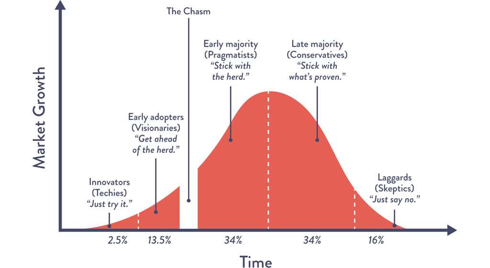
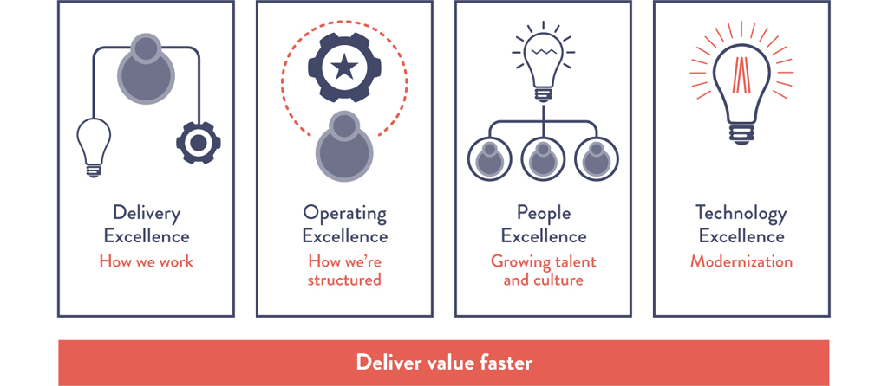

# Chapter 5: Selecting Which Value Stream to Start With

> **Part II — Where to Start**

This chapter addresses the single most consequential decision in a DevOps transformation: **which value stream to start with.** The choice determines not only the difficulty of the transformation but also who will be involved, how teams must organize, and whether early results will build momentum or erode confidence. The chapter provides a decision framework built around four dimensions — greenfield vs. brownfield, systems of engagement vs. systems of record, team receptivity, and expansion strategy — illustrated through extended case studies from Nordstrom, Kessel Run (US Air Force), American Airlines, National Instruments, and HMRC.

## Table of Contents

- [Case Study: Nordstrom's DevOps Transformation (2013-2015)](#case-study-nordstroms-devops-transformation-2013-2015)
  - [Nordstrom's Mobile Application](#nordstroms-mobile-application)
  - [Nordstrom's In-Store Cafe Bistro Systems](#nordstroms-in-store-cafe-bistro-systems)
  - [Scaling Across All Customer-Facing Value Streams](#scaling-across-all-customer-facing-value-streams)
- [Greenfield vs. Brownfield Services](#greenfield-vs-brownfield-services)
  - [Greenfield Projects](#greenfield-projects)
  - [Brownfield Projects](#brownfield-projects)
  - [Examples of Successful Brownfield Transformations](#examples-of-successful-brownfield-transformations)
  - [Case Study: Kessel Run — The Brownfield Transformation of a Mid-Air Refueling System (2020)](#case-study-kessel-run--the-brownfield-transformation-of-a-mid-air-refueling-system-2020)
- [Consider Both Systems of Record and Systems of Engagement](#consider-both-systems-of-record-and-systems-of-engagement)
- [Start With the Most Sympathetic and Innovative Groups](#start-with-the-most-sympathetic-and-innovative-groups)
- [Expanding DevOps Across Our Organization](#expanding-devops-across-our-organization)
  - [The Three Phases of Coalition Building](#the-three-phases-of-coalition-building)
  - [Case Study: Scaling DevOps Across the Business — American Airlines' DevOps Journey Part 2 (2020)](#case-study-scaling-devops-across-the-business--american-airlines-devops-journey-part-2-2020)
  - [Case Study: Saving the Economy From Ruin — HMRC (2020)](#case-study-saving-the-economy-from-ruin--hmrc-2020)
- [Conclusion](#conclusion)
- [How Generative AI Is Reshaping Value Stream Selection](#how-generative-ai-is-reshaping-value-stream-selection)
  - [GenAI and the Greenfield vs. Brownfield Decision](#genai-and-the-greenfield-vs-brownfield-decision)
  - [GenAI and Adoption Curve Dynamics](#genai-and-adoption-curve-dynamics)
  - [GenAI and Platform Engineering at Scale](#genai-and-platform-engineering-at-scale)

---

## Case Study: Nordstrom's DevOps Transformation (2013-2015)

The chapter opens with the Nordstrom case study, which serves as the primary illustrative example for the entire chapter's framework. Courtney Kissler, VP of E-Commerce and Store Technologies, described this journey at the DevOps Enterprise Summit in 2014 and 2015.

**Context:** Nordstrom, founded in 1901, had $13.5 billion in annual revenue (2015). In 2011, during a board of directors meeting, leadership studied the fates of Blockbuster, Borders, and Barnes & Noble — traditional retailers destroyed by their failure to create competitive e-commerce capabilities. This created existential urgency.

**The starting state (2011):**

> "In 2011, the Nordstrom technology organization was very much optimized for cost — we had outsourced many of our technology functions, we had an annual planning cycle with large batch, 'waterfall' software releases. Even though we had a 97% success rate of hitting our schedule, budget, and scope goals, we were ill-equipped to achieve what the five-year business strategy required from us, as Nordstrom started optimizing for speed instead of merely optimizing for cost." — Courtney Kissler

> **[Insight]** The 97% success rate on schedule, budget, and scope is a telling detail. By traditional project management metrics, Nordstrom's IT was performing well. But "on time, on budget, on scope" measures *output*, not *outcome*. The projects were delivered as planned, but the planning cycle itself (annual, waterfall, large batch) meant the organization couldn't respond to market changes fast enough. This is a common pattern: organizations that measure project success by the iron triangle (scope/time/cost) can score perfectly while still failing strategically. The shift from "optimizing for cost" to "optimizing for speed" required entirely different metrics — deployment frequency, lead time, feedback loops — which is exactly what DevOps provides.

**Key decision:** Kissler's team decided **not** to cause upheaval across the whole organization. Instead, they focused on specific, bounded areas where they could experiment, learn, and demonstrate early wins. They chose three areas: the customer mobile application, in-store restaurant systems, and digital properties. Each was selected because **business goals were not being met**, making the teams more receptive to a different way of working.

### Nordstrom's Mobile Application

**The problem:** The Nordstrom mobile application had uniformly negative customer reviews at launch. Worse, the existing structure only allowed updates to be released **twice per year** — any fix would take months to reach customers.

**The approach:**
- Created a dedicated product team solely supporting the mobile application
- Goal: enable the mobile team to independently implement, test, and deliver value to customers — **no longer dependent on coordinating with scores of other teams**
- Moved from annual planning to a **continuous planning process**
- Created a single prioritized backlog based on customer need (eliminating conflicting priorities from supporting multiple products)
- Eliminated testing as a separate phase — integrated it into everyone's daily work

**Results:** Doubled the features delivered per month. Halved the number of defects.

> **[Deep Dive: Why Nordstrom's Mobile Fix Worked]**
>
> The Nordstrom mobile transformation succeeded because it addressed all three of the most common bottlenecks simultaneously:
>
> | Bottleneck | Before | After | DevOps Principle |
> |-----------|--------|-------|-----------------|
> | **Release coupling** | Mobile updates bundled with other releases, twice per year | Independent, on-demand releases | Small batch sizes, reduced WIP |
> | **Team coupling** | Mobile team coordinated with scores of other teams | Dedicated team, single product focus | Loosely coupled architecture and org |
> | **Testing phase** | Testing as a separate gate at end of cycle | Testing integrated into daily work | Build quality in, shift left |
>
> The compounding effect of removing all three bottlenecks at once explains the dramatic result (2x features, 0.5x defects). Each improvement reinforced the others: independent releases made testing feedback faster, which improved quality, which reduced rework, which freed more capacity for features.

> **[2024+ Context]** Nordstrom's approach — creating a dedicated, autonomous product team with end-to-end ownership — is now recognized as the **stream-aligned team** pattern from *Team Topologies* (Skelton & Pais, 2019). The key properties are: (1) the team owns a single product or business domain end-to-end, (2) it can build, test, and deploy independently, and (3) it has a single prioritized backlog aligned to customer outcomes. The DORA 2023 report found that teams with these properties had 30% better delivery performance than teams without them. What Nordstrom discovered empirically in 2013, the industry has since validated through research and codified into a repeatable organizational pattern.

### Nordstrom's In-Store Cafe Bistro Systems

**Different business need:** Unlike the mobile app (where the goal was speed-to-market), the restaurant systems needed **decreased cost and increased quality**. In 2013, Nordstrom completed eleven "restaurant re-concepts" (menu/format changes requiring application updates) that caused customer-impacting incidents. They had forty-four more planned for 2014 — a 4x increase.

> "One of our business leaders suggested that we triple our team size to handle these new demands, but I proposed that we had to stop throwing more bodies at the problem and instead improve the way we worked." — Courtney Kissler

**The approach:** Identified problematic areas (work intake and deployment processes) and focused improvement efforts there.

**Results:**
- Reduced code deployment lead times by **60%**
- Reduced production incidents by **60-90%**

> **[Insight]** The contrast between the mobile app and the restaurant systems is instructive. The mobile app needed speed; the restaurant systems needed reliability. Both were solved with the same DevOps principles (small batches, automated testing, continuous improvement) but with different emphasis. This demonstrates that DevOps is not just about "going fast" — it is about **fast flow of safe changes**. The restaurant system transformation focused on the "safe" part (reducing incidents) while the mobile app focused on the "fast" part (doubling feature throughput). Both are expressions of the First Way. This matters because organizations often frame DevOps as "a developer thing for consumer-facing apps" — the restaurant systems case shows it applies equally to back-office, operations-heavy workloads.

### Scaling Across All Customer-Facing Value Streams

By 2015, the successes gave the teams confidence that DevOps principles were applicable to a wide variety of value streams. Kissler was promoted to VP of E-Commerce and Store Technologies.

> "We needed to increase productivity in all our technology value streams, not just in a few. At the management level, we created an across-the-board mandate to reduce cycle times by 20% for all customer-facing services." — Courtney Kissler

Kissler acknowledged the challenges: "This is an audacious challenge. We have many problems in our current state — process and cycle times are not consistently measured across teams, nor are they visible."

> "From a high-level perspective, we believe that techniques such as value stream mapping, reducing our batch sizes toward single-piece flow, as well as using continuous delivery and microservices will get us to our desired state. However, while we are still learning, we are confident that we are heading in the right direction, and everyone knows that this effort has support from the highest levels of management." — Courtney Kissler

> **[Insight]** The Nordstrom scaling story follows a classic pattern: prove with two contrasting value streams (mobile app for speed, restaurant systems for reliability) -> earn credibility -> scale to all value streams. The 20% cycle time reduction mandate works because it is specific, measurable, and time-bounded — but it is paired with honesty about the current state ("process and cycle times are not consistently measured"). This combination of ambition and humility is characteristic of successful transformations. The mandate gives direction; the honesty gives permission to start by measuring before improving.

---

## Greenfield vs. Brownfield Services

The chapter borrows urban planning terminology to categorize transformation candidates:

**Greenfield:** New software projects built from scratch, with few constraints. Like building on undeveloped land — no existing structures to demolish, no hazardous materials to remove.

**Brownfield:** Existing products already serving customers, potentially running for years or decades. Like building on previously industrialized land — significant technical debt, legacy architectures, missing test automation, unsupported platforms.

### Greenfield Projects

**Advantages for DevOps pilots:**
- Funded and staffed (or being staffed)
- No existing codebase, architecture, processes, or team dynamics to work around
- Often used to demonstrate feasibility of public/private clouds, deployment automation, and similar tools

**Example: National Instruments Hosted LabVIEW (2009).** National Instruments was a thirty-year-old organization with five thousand employees and $1 billion in annual revenue. To bring the Hosted LabVIEW product to market quickly, they created a new team that operated outside existing IT processes. Team composition: one applications architect, one systems architect, two developers, one system automation developer, one operations lead, and two offshore operations staff. Using DevOps practices, they delivered to market in **half the time** of normal product introductions.

> **[Insight]** The National Instruments example reveals a critical success factor that is easy to overlook: the team was "allowed to operate outside of the existing IT processes." This is the organizational equivalent of a clean room. Greenfield technical projects that must still comply with brownfield organizational processes (annual planning, heavyweight change management, centralized procurement) rarely achieve their full potential. The freedom has to be both technical *and* organizational. This is why Chapter 6 discusses creating dedicated transformation teams that can operate with different rules.

### Brownfield Projects

Despite the common belief that DevOps is primarily for greenfield projects, the data tells a different story:

- **Over 60%** of transformation stories shared at the DevOps Enterprise Summit in 2014 were brownfield projects
- Research from the *State of DevOps Reports* found that **the age of the application or even the technology used was not a significant predictor of performance**
- What predicted performance was **whether the application was architected (or could be re-architected) for testability and deployability**

> **[Deep Dive: Why Brownfield Transformations Are Often Higher-Value]**
>
> The book notes: "That the services that have the largest potential business benefit are brownfield systems shouldn't be surprising. After all, these are the systems that are most relied upon and have the largest number of existing customers or highest amount of revenue depending upon them."
>
> Consider the math:
>
> | Factor | Greenfield Pilot | Brownfield Core System |
> |--------|-----------------|----------------------|
> | **Current revenue at stake** | $0 (not launched yet) | $50M+ annually |
> | **Current users affected** | 0 | 100,000+ |
> | **Deployment frequency (before)** | N/A | Monthly or quarterly |
> | **Lead time (before)** | N/A | 3-6 months |
> | **Potential value of 50% lead time reduction** | Modest (faster time to market for one new product) | Enormous (entire organization moves 2x faster on core business) |
>
> Greenfield transformations are lower risk but also lower reward. Brownfield transformations are higher risk but can deliver transformative business impact. The ideal strategy, as Nordstrom demonstrated, is to use greenfield (or low-risk brownfield) as proving grounds and then apply the learnings to high-value brownfield systems.

Teams supporting brownfield projects may actually be **more receptive** to DevOps experimentation — particularly when there is a widespread belief that traditional methods are insufficient and a sense of urgency around improvement.

### Examples of Successful Brownfield Transformations

The chapter provides four detailed examples:

**American Airlines (2020):** Applied DevOps to their loyalty product running on Siebel (a legacy COTS system). Moved onto a hybrid cloud model and invested in CI/CD pipelines for end-to-end automation. Results: more than fifty automated deployments in a few months, 2x faster loyalty web service response times, 32% cost optimization in the cloud. The transformation changed the conversation between business and IT — instead of IT being the bottleneck, teams deployed faster than the business could validate and accept.

**CSG (2013):** $747 million revenue, 3,500+ employees. Initial scope: bill printing (COBOL mainframe + twenty surrounding platforms). Started daily deployments to production-like environments. Doubled customer release frequency (2x to 4x annually). Reduced code deployment lead times from two weeks to less than one day.

**Etsy (2009):** 35 employees, $87 million revenue. After "barely surviving the holiday retail season," transformed virtually every aspect of operations. Became one of the most admired DevOps organizations. Successful 2015 IPO.

**HP LaserJet (2007):** Implemented automated testing and continuous integration for firmware. Created faster feedback enabling developers to quickly confirm command codes worked. (Full case study in Chapter 11.)

> **[Insight]** The four brownfield examples span remarkably different contexts: a COBOL mainframe (CSG), a legacy COTS product (American Airlines/Siebel), a web application (Etsy), and firmware (HP LaserJet). The lesson is emphatic: **the technology stack does not determine whether DevOps is applicable.** What matters is whether the application can be made testable and deployable in smaller increments. Even COBOL mainframes and firmware can be incrementally improved. The excuse "our technology is too old/different for DevOps" is the most common — and the most thoroughly debunked — objection in the field.

### Case Study: Kessel Run — The Brownfield Transformation of a Mid-Air Refueling System (2020)

This is one of the chapter's two extended case studies added in the Second Edition.

**Background:** In October 2015, the US Air Force struck a Doctors Without Borders hospital in Afghanistan, believing it to be an enemy stronghold. Unclassified analysis showed that failures in the IT ecosystem contributed to this devastating outcome — the crew didn't have the latest data to identify the hospital.

> "Basically, a failed IT ecosystem caused an AC130 gunship to attack the wrong building." — Adam Furtado, Chief of Platform for Kessel Run

> "What happened here was not some kind of black swan event, it was predictable and it's going to happen again." — Adam Furtado

**The organizational context:** Named after Han Solo's famous smuggling route (an homage to their need to "smuggle" new ways of working into the Department of Defense), Kessel Run was the continuing effort within the US Air Force to solve tough business challenges that traditional defense IT was not solving effectively.

The state of DOD IT circa 2010: "Walking into the DOD to work was like walking into a time machine, a completely analog environment circa 1974 where many collaborative tools, like chats and Google Docs, weren't possible." Eric Schmidt, Executive Chairman at Google, testified to Congress that "the DOD violates every rule of modern product development."

Broader government IT statistics: According to the US Digital Service, **94% of federal IT projects** were behind schedule or over budget, and **40% were never delivered.**

**The approach:** The Kessel Run coalition focused on modernizing the Air Force's Air Operation Centers (AOCs) — physical locations from which the Air Force strategizes, plans, and executes air campaigns. These ran on archaic infrastructure — "a recent search showed 2.8 million Excel and PowerPoint files on one of the servers in one of the locations."

They applied **Gall's Law** ("if you want a complex system to work, build a simpler system first, then improve over time") and the **Strangler Fig Pattern** (also known as the Encasement Strategy) to incrementally modernize twenty-two physical locations.

**The specific starting point:** Mid-air refueling coordination. This process required massive coordination to ensure refueling tankers were at the right place, time, and altitude with the right hardware. Pilots planned daily using color pucks, an Excel macro, and lots of data entry.

**The team:** Applied DevOps principles, extreme programming, and balanced team models.

**Results:**
- Initial MVP delivered in **weeks**
- Efficiency gains kept one aircraft and crew from flying every day: **$214,000/day fuel savings**
- After thirty iterations: doubled the savings (two aircraft/crew on ground daily)
- **$13 million in fuel savings per month**
- **Cut the planning crew in half**

> **[Deep Dive: The Strangler Fig Pattern and Gall's Law]**
>
> Kessel Run's approach exemplifies two complementary principles:
>
> **Gall's Law:** "A complex system that works is invariably found to have evolved from a simple system that worked." The inverse is also true: a complex system designed from scratch never works. Kessel Run didn't try to replace the entire AOC infrastructure at once. They started with one process (mid-air refueling) and built a simple, working replacement.
>
> **Strangler Fig Pattern:** Named after the tropical plant that grows around a host tree, eventually replacing it. In software, this means building new functionality alongside the old system, gradually redirecting traffic/processes to the new system, and eventually decommissioning the old one. At twenty-two physical locations, each with their own software and hardware, a big-bang replacement would have been impossibly risky. The Strangler Fig approach let them modernize incrementally while keeping the whole system operational.
>
> These patterns are the standard playbook for brownfield transformations in 2024+. Martin Fowler's original articulation of the Strangler Fig Pattern (2004) has become one of the most cited patterns in enterprise modernization.

> **[Insight]** The Kessel Run case study is the most extreme "brownfield" example in the book — not just legacy technology, but legacy technology in the most bureaucratic, risk-averse organization imaginable (the US Department of Defense). If DevOps principles can be applied to mid-air refueling coordination in the military, there is no credible technical or organizational excuse for why they can't be applied elsewhere. The case also powerfully illustrates that the consequences of poor IT can extend far beyond business metrics — in this case, to loss of life. The urgency created by the 2015 hospital strike gave the Kessel Run team the executive sponsorship and organizational cover needed to work outside normal DOD processes. Tragically, it often takes a crisis to create the conditions for transformation.

---

## Consider Both Systems of Record and Systems of Engagement

The Gartner bimodal IT framework distinguishes between:

| Type | Description | Pace of Change | Focus | Gartner Label |
|------|------------|----------------|-------|---------------|
| **Systems of Record** | ERP-like systems (MRP, HR, financial reporting) | Slower | Correctness of transactions and data; regulatory compliance (e.g., SOX) | Type 1: "Doing it right" |
| **Systems of Engagement** | Customer-facing or employee-facing systems (e-commerce, productivity apps) | Faster | Rapid feedback loops, experimentation | Type 2: "Doing it fast" |

**The book's position:** While this categorization is convenient, **it creates a false dichotomy.** Six years of *State of DevOps Report* data show that high performers achieve **both** high throughput AND high reliability simultaneously. DevOps breaks the "fast vs. right" tradeoff.

> "We've adopted a philosophy that rejects bimodal IT because every one of our customers deserves speed and quality. This means that we need technical excellence, whether the team is supporting a thirty-year-old mainframe application, a Java application, or a mobile application." — Scott Prugh, VP of Product Development, CSG

**The architectural argument:** Because systems are interdependent, the ability to change any system is limited by the system that is **most difficult to safely change** — which is almost always a system of record. Even when new functionality is added only to greenfield systems of engagement, they often cause reliability problems in the brownfield systems of record they rely on.

**Conclusion:** When improving brownfield systems, we should aim to reduce complexity, improve reliability/stability, AND make them faster, safer, and easier to change. Making downstream systems safer to change helps the entire organization more quickly and safely achieve its goals.

> **[Insight]** The bimodal IT critique is one of the book's strongest positions. Gartner's bimodal model essentially says: "Some systems need to be fast and innovative (Mode 2) and some need to be stable and reliable (Mode 1), and they require different approaches." DevOps says: "No. The same practices that make systems faster also make them more stable. Speed and stability are not tradeoffs — they are correlated." The DORA research emphatically supports the DevOps position: elite performers deploy 973x more frequently than low performers while having 3x lower change failure rates. The bimodal model, taken literally, gives organizations permission to leave their most critical systems (systems of record) mired in slow, manual, error-prone processes. This is the opposite of what the data recommends.

> **[2024+ Context]** The bimodal IT debate has largely been settled in favor of the DevOps position. Gartner itself has evolved its guidance, increasingly emphasizing "continuous delivery" and "platform engineering" for all system types. The emergence of **platform engineering** as a discipline (2022-2024) provides a practical mechanism for bringing DevOps capabilities to systems of record: the platform team builds self-service infrastructure, CI/CD pipelines, and observability tooling that can be adopted by any team, regardless of whether they own a system of engagement or a system of record. The DORA 2024 report reinforced this, finding no significant correlation between system type and delivery performance — the practices matter, not the category. Organizations still using bimodal IT as a framework are, by the data, choosing to underperform with their most critical systems.

---

## Start With the Most Sympathetic and Innovative Groups

Geoffrey A. Moore's **technology adoption life cycle** from *Crossing the Chasm* provides the framework for understanding organizational receptivity:


*Source: Moore and McKenna, Crossing the Chasm, 15.*

The spectrum:
- **Innovators** — eager to try new approaches
- **Early adopters** — see the potential, willing to invest
- **Early majority** — pragmatic, want proven approaches
- **Late majority** — skeptical, adopt when it becomes the norm
- **Laggards** — resist change until forced

The **chasm** represents the classic difficulty of moving beyond innovators and early adopters to reach the broader organization.

**The book's recommendation:** In the early stages, focus energy on teams that already believe in DevOps and have a demonstrated desire and ability to innovate. **Do not spend time trying to convert conservative groups.** Create successes with less risk-averse groups and expand from there.

Even with the highest levels of executive sponsorship, **avoid the big-bang approach** (starting everywhere all at once). Focus efforts on a few areas, ensure those initiatives succeed, and expand from there.

> **[Deep Dive: Mapping the Adoption Curve to Your Organization]**
>
> In practice, you can identify where teams fall on the adoption curve by looking for signals:
>
> | Group | Signals | Approach |
> |-------|---------|----------|
> | **Innovators** (2-3%) | Already experimenting with CI/CD, containers, or IaC on their own; attend meetups/conferences; read books like this one | Empower them. Give them freedom and resources. They are your seeds. |
> | **Early adopters** (10-15%) | Frustrated with current processes; open to new ideas; have tried to improve locally but hit organizational barriers | Recruit them. They provide credibility and critical mass. |
> | **Early majority** (35%) | "Show me the data." Want proof it works before committing. | Don't target them first. Let the evidence from innovators and early adopters do the convincing. |
> | **Late majority** (35%) | "This is how we've always done it." Will adopt only when it becomes the organizational default. | Address them last. By the time you reach them, the platform/tooling should make DevOps the path of least resistance. |
> | **Laggards** (15%) | Active resistance. May see DevOps as threatening to their role or expertise. | Don't fight them. Build around them. Eventually, the organization shifts and they either adapt or self-select out. |
>
> **The critical insight:** You don't need to convince everyone. You need to reach ~15-20% (innovators + early adopters) and create visible success. Social proof does the rest.

> **[Insight]** The "most sympathetic and innovative groups" strategy is not about avoiding hard problems — it's about sequencing. Starting with resistant groups means spending enormous energy on organizational change management before you've even demonstrated that the technical practices work. Starting with willing groups lets you focus energy on the technical practices, generate evidence, and then use that evidence to bring along the less convinced. It is a Lean approach to change management itself: minimize WIP (don't try to change everyone at once), get fast feedback (quick wins with willing teams), and iterate (expand based on what you learn). The common mistake is for a senior executive to mandate a top-down, organization-wide transformation — which skips directly to the early majority without building the evidence base, and creates the exact "big bang" failure mode the book warns against.

---

## Expanding DevOps Across Our Organization

Once early successes are established, the chapter outlines a structured approach to expansion, adapted from a course by Dr. Roberto Fernandez (MIT).

**Core principle:** Break larger improvement goals into small, incremental steps. This creates improvements faster and enables early detection of wrong choices — "by detecting our errors early, we can quickly back up and try again, making different decisions armed with our new learnings."

### The Three Phases of Coalition Building

**Phase 1: Find innovators and early adopters.** Focus on teams who actually want to help — "kindred spirits and fellow travelers who are the first to volunteer." Ideally, these are people who are respected and have high influence, giving the initiative more credibility.

**Phase 2: Build critical mass and silent majority.** Expand to more teams and value streams. Work with receptive teams even if they aren't the most visible or influential. Create a "bandwagon effect" that increases influence. **Specifically bypass dangerous political battles** that could jeopardize the initiative.

**Phase 3: Identify the holdouts.** The high-profile, influential detractors who are most likely to resist (and possibly sabotage) the effort. Tackle this group **only after** establishing a silent majority and enough successes to protect the initiative.

> "Leading change requires courage, especially in corporate environments where people are scared and fight you. But if you start small, you really have nothing to fear. Any leader needs to be brave enough to allocate teams to do some calculated risk-taking." — Ron van Kemenade, CIO, ING

> **[Deep Dive: The Coalition-Building Phases as a Risk Management Strategy]**
>
> The three phases map to a deliberate risk management approach:
>
> ```
> Phase 1: Low-risk experiments → build evidence
>    ↓ evidence creates credibility
> Phase 2: Medium-risk expansion → build momentum
>    ↓ momentum creates political cover
> Phase 3: High-risk confrontation → address resistance
>    ↓ success becomes the new default
> ```
>
> **Why "bypass dangerous political battles" in Phase 2?** Because political fights are high-energy, low-information events. You burn organizational capital without generating evidence. A political fight about "whether DevOps works" before you have proof is an argument about beliefs. The same fight after you have fifteen teams showing 50% lead time improvements is an argument about data. Timing matters more than eloquence.
>
> **The holdout paradox:** Organizations often want to convert the most influential skeptics first ("if we can convince the VP of Infrastructure, everyone else will follow"). This is backwards. Influential skeptics have the most to lose from change and the most organizational power to block it. Convert them last, when the evidence is overwhelming and the organizational momentum is irresistible.

> **[2024+ Context]** The coalition-building model maps remarkably well to the **platform engineering adoption pattern** that has emerged in 2022-2024. Phase 1 teams become the "early tenants" of an Internal Developer Platform (IDP). Their feedback shapes the platform's golden paths and self-service capabilities. Phase 2 teams adopt the platform because it makes the right thing the easy thing — not because they were convinced by a presentation, but because the platform reduced their cognitive load and deployment friction. Phase 3 holdouts eventually adopt because the platform has become the organizational standard, and working outside it requires more effort than working within it. This is the most powerful insight for modern DevOps expansion: **make the desired behavior the path of least resistance** through platform engineering, and adoption follows naturally.

### Case Study: Scaling DevOps Across the Business — American Airlines' DevOps Journey Part 2 (2020)

This continues the American Airlines story from Part 1 (Chapter 1). By year three, they realized that DevOps was a **business transformation**, not just an IT initiative. Ross Clanton was brought in as Chief Architect and Managing Director.

**Scaling strategy — Two focuses:**
1. **The Why:** Building a competitive advantage
2. **The How:** Business and IT teams working together to maximize business value

**Four key pillars of transformation:**
1. **Delivery excellence:** How we work (practices, product mindset)
2. **Operating excellence:** How we're structured (product taxonomy, funding model, operating model, prioritization)
3. **People excellence:** Growing talent and culture (including evolving leadership behaviors)
4. **Technology excellence:** Modernization (infrastructure, technology foundation, automation, cloud)


*Source: Maya Leibman and Ross Clanton, "DevOps: Approaching Cruising Altitude," DevOps Enterprise Summit-Virtual Las Vegas 2020.*

**Scaling culture — Three key attributes:**
1. **Passion:** Teams focused on delighting customers, being the best at getting better, embracing failure
2. **Selflessness:** Collaborate and share knowledge/code across the organization (innersourcing), making space for others' voices
3. **Accountability:** Own the outcomes even when hard; how you do something is as important as what you do

> "Culture eats strategy for breakfast." — Peter Drucker, quoted by Ross Clanton

**Pandemic adaptation values (2020):**
- Action and doing over analysis
- Collaboration over silos
- Clarity of mission over trying to do everything
- Empowerment over personal stamp on every effort
- Getting something out (MVP) versus getting something perfect
- "We can do this" versus hierarchy
- Finishing versus starting (limiting WIP)

**New vocabulary (Table 5.1):**

| Before | After |
|--------|-------|
| "I want to create a pop-up to incentivize people to download the mobile app." | (Focus on customer outcomes, not specific solutions) |
| "Fragile applications are prone to failure." | (Resilience-oriented framing) |
| "What did our competitors do?" | "What do our customers value?" |
| "When will this project be done?" | "When do we start seeing value?" |
| "What went wrong?" | "What did we learn and how can I help?" |
| "I want a completely new website." | "What's the first thing we can try to experiment with this idea?" |

**Leadership transformation:** Instead of throwing requirements over a wall, American Airlines created teams of stakeholders from business, IT, Design, etc. Leaders pivoted to serving teams, removing impediments and constraints. Status meetings were replaced with **playback meetings (demos).**

> ". . . [the transformation] is making us more efficient, we get projects done more quickly, the projects delivered are more designed to what the users need . . . What I'm most proud of is the champion of delivery transformation is not IT anymore; it's the business leaders who embraced it." — Doug Parker, CEO, American Airlines

> **[Insight]** The vocabulary shift table is deceptively powerful. Language shapes thought. When a leader asks "When will this project be done?" they are framing work as a project with a defined end state. When they ask "When do we start seeing value?" they are framing work as a continuous stream of value delivery. The first framing leads to big-bang releases; the second leads to incremental delivery. The first framing makes "done" binary; the second makes "value" continuous. American Airlines understood that changing how people talk is a prerequisite to changing how they think, which is a prerequisite to changing how they work. This is a practical application of the Third Way (continual learning) — creating new mental models through new vocabulary.

### Case Study: Saving the Economy From Ruin — HMRC (2020)

**Context:** HMRC (Her Majesty's Revenue and Customs) is the UK's tax collection agency. In 2020, during the COVID-19 pandemic, HMRC distributed hundreds of billions of pounds to UK citizens and businesses. Around 25% of the entire UK workforce was supported by public money. **HMRC built the technology to do this in four weeks.**

> "We knew we would have millions of users, but nobody could actually tell us how many. So whatever we built had to be accessible to everyone and had to be capable of paying out billions into bank accounts within hours of launch. It also needed to be secure, with checks being conducted before money was paid out." — Ben Conrad, HMRC Head of Agile Delivery

**Result:** All services launched on time, most a week or two ahead of schedule, with no issues. **94% user satisfaction rating.** HMRC went from being the least popular government department to the one customers relied on most.

**The enabler: MDTP (Multichannel Digital Tax Platform)**

MDTP is a mature digital platform that had evolved over seven years. Key characteristics:

- The largest digital platform in UK government and one of the largest in the UK
- Hosts approximately **1,200 microservices**
- Built by **2,000+ people** in **70 teams** across **8 geographic locations**
- Approximately **100 deployments to production per day**
- Self-service: "A service can be created, developed, and deployed on our platform without any direct involvement from platform teams at all"

> "The most important aspect of delivering a system at speed is the ability for engineers to 'just get on with it.'" — Matt Hyatt, Technical Delivery Manager, Equal Experts

**Opinionated platform (paved road / guardrails):**
- Microservices must be written in **Scala** using the **Play framework**
- Persistence must use **Mongo**
- Common actions (e.g., file upload) must use common platform services
- Benefits: faster delivery, simpler support, team mobility, reusable components

> "We can provide common services and reusable components that we know work with all the services. It also allows people to move between services, and, indeed, allows the services to move to new teams without worrying about whether our people have the required skills to do the job." — Matt Hyatt

**COVID-19 adaptations:**
- Embedded a **platform engineer into each COVID-19 digital service team** to safely "short-circuit" existing processes
- Made people working on key services identifiable via Slack so requests for help could be prioritized by the entire 2,000-person community
- Teams adapted composition and communication quickly, then flexed back to normal after services launched

> **[Deep Dive: HMRC's MDTP as the Platform Engineering Ideal]**
>
> MDTP embodies virtually every principle that the Platform Engineering community would later codify:
>
> | Platform Engineering Principle | MDTP Implementation |
> |-------------------------------|---------------------|
> | **Platform as a product** | Evolved over 7 years based on tenant feedback |
> | **Self-service** | Teams create, develop, and deploy without platform team involvement |
> | **Golden paths / opinionated defaults** | Scala/Play, Mongo, common components |
> | **Automated pipelines** | Code built and deployed through environments automatically |
> | **Built-in observability** | Automated dashboards and alerting via Kibana and Grafana |
> | **Abstracted infrastructure** | Teams focus on apps; no direct AWS access |
> | **Governance baked in** | Technology choices constrained by platform, not by manual review |
>
> The COVID-19 response proved the platform's value in the most extreme way possible: teams that had never worked together could spin up new services in weeks because the platform handled all the undifferentiated heavy lifting. This is the ultimate test of a platform — can new teams deliver at the same velocity as established teams? MDTP passed that test under the most intense pressure imaginable.

> **[2024+ Context]** The HMRC/MDTP case study has become a canonical reference in the Platform Engineering community. It was cited in the **CNCF Platforms White Paper (2023)** as an example of a mature, product-oriented platform. The key insight that has been generalized: **an opinionated platform trades local flexibility for global velocity.** Individual teams cannot choose their own tech stack (a constraint), but the entire organization benefits from faster delivery, easier team mobility, simpler support, and battle-tested components. This tradeoff — one that many organizations struggle to accept — is what makes MDTP work at scale. The Platform Engineering movement (2022-2024) has adopted MDTP's approach as a design principle: "make the right thing the easy thing, and the wrong thing the hard thing." Backstage (Spotify), Port, Humanitec, and Kratix all embody this philosophy.

---

## Conclusion

> "Little fish learn to be big fish in little ponds." — Peter Drucker

By carefully choosing where and how to start, organizations can experiment and learn in areas that create value without jeopardizing the rest of the organization. This builds the base of support, earns the right to expand DevOps more broadly, and gains the recognition and gratitude of an ever-larger constituency.

> **[Insight]** The Drucker quote captures the chapter's essential wisdom. The temptation for ambitious leaders is to start with the biggest, most visible, most impactful value stream — the "big pond." But starting big means the consequences of failure are also big, and failure in a high-profile initiative can poison the well for all future DevOps efforts. Starting small (the "little pond") allows the team to develop competence, generate evidence, and build confidence. The small wins create the credibility needed to take on bigger challenges. This is not timidity — it is strategic sequencing. The chapter's case studies demonstrate this pattern consistently: Nordstrom started with mobile and restaurant systems (not their entire e-commerce platform), Kessel Run started with mid-air refueling (not the entire AOC), and HMRC's MDTP evolved over seven years before it was tested under COVID-19 pressure.

---

## How Generative AI Is Reshaping Value Stream Selection

> **[GenAI + Chapter 5 Concepts]** The decision of which value stream to start with — the central question of this chapter — is being transformed by AI in three significant ways.

### GenAI and the Greenfield vs. Brownfield Decision

AI is fundamentally changing the economics of brownfield transformation:

- **AI-assisted code comprehension:** Tools like GitHub Copilot, Amazon Q Developer, and Sourcegraph Cody can analyze legacy codebases and generate documentation, test suites, and architectural diagrams for systems that were previously opaque. This reduces the "unknown unknowns" risk that makes brownfield transformations frightening.
- **AI-powered test generation:** One of the biggest barriers to brownfield DevOps is the absence of automated tests. AI tools (Diffblue Cover, CodiumAI, Copilot) can generate test suites for existing code, creating a safety net that enables incremental refactoring.
- **AI-assisted migration:** Tools are emerging that can translate code between languages and frameworks (e.g., COBOL to Java), making the Strangler Fig Pattern faster to execute. AWS has invested heavily in this with Amazon Q Code Transformation (formerly CodeWhisperer for Code Transformation).

**The implication:** The gap between greenfield and brownfield difficulty is narrowing. AI makes brownfield systems more comprehensible, testable, and migrateable — which means organizations can start with higher-value brownfield systems earlier in their transformation journey.

### GenAI and Adoption Curve Dynamics

AI tools are shifting where teams fall on Moore's adoption curve:

- Teams that were previously in the "early majority" (cautious, wanting proof) may move to "early adopter" status when they see AI-powered tools that make DevOps practices easier to adopt (e.g., AI-generated CI/CD pipelines, AI-assisted infrastructure-as-code).
- Conversely, some "laggards" may become even more resistant as AI increases the pace of change, widening the gap between adopters and non-adopters.
- The **chasm** may be easier to cross because AI-powered platforms can make DevOps practices accessible without requiring deep expertise — lowering the activation energy for the early majority.

### GenAI and Platform Engineering at Scale

The HMRC case study shows how a mature platform enabled rapid delivery. AI is accelerating platform maturity:

- **AI-generated golden paths:** Platforms can use AI to automatically generate service templates, CI/CD configurations, and observability setups based on the requirements of each new service.
- **AI-powered platform support:** Instead of filing tickets to the platform team, developers can ask an AI assistant trained on platform documentation, patterns, and past incidents.
- **AI-driven platform optimization:** Platforms can use AI to analyze usage patterns, identify underutilized components, and recommend improvements — making the platform itself a continuously learning system.

The implication for "where to start": if your organization has an AI-augmented platform, the cost of onboarding any value stream drops significantly, making the "which value stream" decision less consequential — you can start with more value streams in parallel because the platform absorbs the complexity.

**Further reading:**
- [Crossing the Chasm by Geoffrey A. Moore](https://www.harpercollins.com/products/crossing-the-chasm-3rd-edition-geoffrey-a-moore) — the original framework for technology adoption dynamics
- [Strangler Fig Application Pattern (Martin Fowler)](https://martinfowler.com/bliki/StranglerFigApplication.html) — the pattern used by Kessel Run for brownfield modernization
- [CNCF Platforms White Paper](https://tag-app-delivery.cncf.io/whitepapers/platforms/) — modern platform engineering principles exemplified by HMRC's MDTP
- [Team Topologies — Key Concepts](https://teamtopologies.com/key-concepts) — the organizational model that formalizes the "stream-aligned team" pattern Nordstrom discovered
- [DORA Quick Check](https://dora.dev/quickcheck/) — assess your current state to inform value stream selection
- [The Other Side of Innovation (Govindarajan & Trimble)](https://www.hbs.edu/faculty/Pages/item.aspx?num=38930) — the research on dedicated transformation teams referenced in Chapter 6
