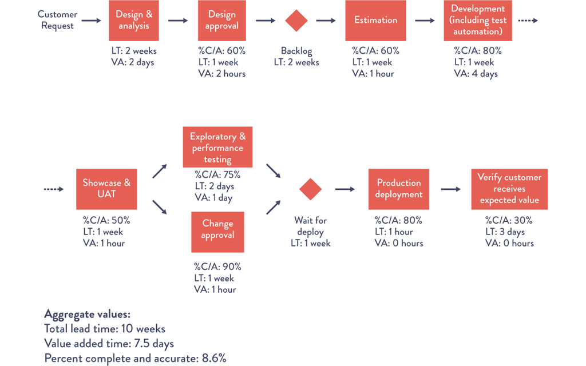
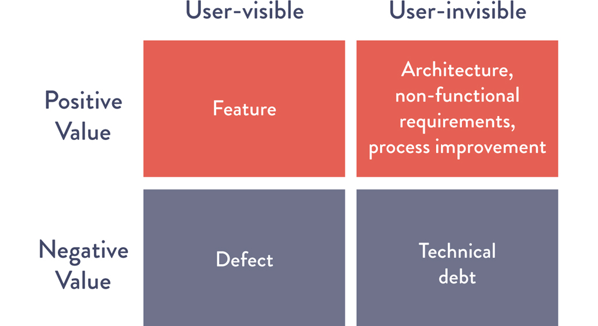

# Chapter 6: Understanding the Work in Our Value Stream, Making It Visible, and Expanding It Across the Organization

> **Part II — Where to Start**

After selecting a value stream for DevOps transformation (Chapter 5), this chapter addresses the next critical step: **deeply understanding how work actually flows through that value stream.** The chapter provides a complete operational playbook covering value stream mapping, team identification, the creation of dedicated transformation teams, goal-setting, capacity management (the "20% tax"), technical debt management, and the use of tools to reinforce desired behaviors. It is anchored by two powerful case studies — Nordstrom's Cosmetics Business Office COBOL application and LinkedIn's Operation InVersion — that demonstrate opposite ends of the technical debt spectrum.

## Table of Contents

- [Case Study: Nordstrom's Experience With Value Stream Mapping](#case-study-nordstroms-experience-with-value-stream-mapping)
- [Identifying the Teams Supporting Our Value Stream](#identifying-the-teams-supporting-our-value-stream)
- [Create a Value Stream Map to See the Work](#create-a-value-stream-map-to-see-the-work)
  - [What to Focus On](#what-to-focus-on)
  - [Building the Map](#building-the-map)
  - [Using the Map to Guide Improvement](#using-the-map-to-guide-improvement)
- [Creating a Dedicated Transformation Team](#creating-a-dedicated-transformation-team)
  - [Agree On a Shared Goal](#agree-on-a-shared-goal)
  - [Keep Our Improvement Planning Horizons Short](#keep-our-improvement-planning-horizons-short)
  - [Reserve 20% of Capacity for Non-Functional Requirements and Reducing Technical Debt](#reserve-20-of-capacity-for-non-functional-requirements-and-reducing-technical-debt)
  - [Case Study: Operation InVersion at LinkedIn (2011)](#case-study-operation-inversion-at-linkedin-2011)
- [Increase the Visibility of Work](#increase-the-visibility-of-work)
- [Use Tools to Reinforce Desired Behavior](#use-tools-to-reinforce-desired-behavior)
- [Conclusion](#conclusion)
- [How Generative AI Is Reshaping Value Stream Understanding and Visibility](#how-generative-ai-is-reshaping-value-stream-understanding-and-visibility)
  - [GenAI and Value Stream Mapping](#genai-and-value-stream-mapping)
  - [GenAI and Technical Debt Management](#genai-and-technical-debt-management)
  - [GenAI and Tooling for Shared Visibility](#genai-and-tooling-for-shared-visibility)

---

## Case Study: Nordstrom's Experience With Value Stream Mapping

The chapter opens with a continuation of the Nordstrom story from Chapter 5, focusing on a specific value stream mapping exercise that produced unexpectedly powerful results.

**The target:** The Cosmetics Business Office application — a COBOL mainframe application supporting in-store beauty and cosmetic department managers. The application allowed managers to register new salespeople for product lines to track sales commissions, enable vendor rebates, etc.

**The background:** Courtney Kissler explained that she had personally supported this technology team earlier in her career. For nearly a decade, during each annual planning cycle, the organization debated migrating this application off the mainframe. Even with full management support, they never got around to it.

**The value stream mapping workshop:** Kissler's team assembled everyone with accountability for delivering value to internal customers — business partners, the mainframe team, shared service teams, and others.

**The discovery:**

> "What they discovered was that when department managers were submitting the 'product line assignment' request form, we were asking them for an employee number, which they didn't have — so they would either leave it blank or put in something like 'I don't know.' Worse, in order to fill out the form, department managers would have to inconveniently leave the store floor in order to use a PC in the back office. The end result was all this wasted time, with work bouncing back and forth in the process." — Courtney Kissler

**The experiments:**
1. Deleted the employee number field from the form; let another department capture that information downstream. Result: **four-day reduction** in processing time.
2. Replaced the PC application with an iPad application that allowed managers to submit information without leaving the store floor. Result: processing time reduced to **seconds**.

**The outcome:**

> "With those amazing improvements, all the demands to get this application off the mainframe disappeared. Furthermore, other business leaders took notice and started coming to us with a whole list of further experiments they wanted to conduct with us in their own organizations. Everyone in the business and technology teams was excited by the outcome because [it] solved a real business problem, and, most importantly, they learned something in the process." — Courtney Kissler

> **[Deep Dive: Why the Mainframe Was Never the Problem]**
>
> This case study contains one of the most important lessons in the entire book, and it's easy to miss: **the COBOL mainframe was not the bottleneck.** For a decade, the organization assumed the mainframe was the problem and debated migration. Value stream mapping revealed that the actual constraints were:
>
> | Assumed Problem | Actual Problem |
> |----------------|----------------|
> | COBOL mainframe is old and slow | The request form asked for data the submitter didn't have |
> | Need to migrate to modern platform | Managers had to leave the store floor to use a PC in the back office |
> | Migration budget never approved | Rework loops from incomplete forms consumed most of the processing time |
>
> **The fix cost almost nothing** compared to a mainframe migration. Deleting a form field and deploying an iPad app solved the real problem. A mainframe migration would have taken years and millions of dollars — and if the same form with the same broken field had been migrated to the new platform, the same problem would have persisted.
>
> **The lesson:** Before investing in large-scale technical changes, map the value stream to find the actual constraint. It may be a process problem, a form field, a handoff, or a policy — not a technology problem at all. Value stream mapping prevents the most expensive mistake in technology: solving the wrong problem with impressive technology.

> **[Insight]** The Nordstrom COBOL case study is the chapter's most important teaching. It demonstrates that value stream mapping is not just a documentation exercise — it is a **diagnostic tool** that can redirect millions of dollars of investment. For a decade, the "obvious" solution was a mainframe migration. Value stream mapping revealed that the bottleneck was a form field and a physical access constraint. This pattern recurs constantly in organizations: the loudest proposed solution (rewrite the system, migrate to the cloud, adopt microservices) often addresses the wrong constraint. The value stream map forces you to look at the entire flow of work, including the human and process elements, not just the technology. The most effective improvements are frequently the cheapest ones — but you can only see them if you map the full value stream first.

### Continuous Learning (Sidebar)

The chapter includes an important sidebar on incremental work. With better understanding of the entire value stream and where real constraints were, the team could make **targeted improvements** — many of which were much less expensive and more effective than originally imagined. Even if the COBOL environment eventually needs migration (maybe someday it becomes the constraint), the teams were able to take smart, targeted steps to speed up value delivery along the way.

> **[Insight]** "Even if the COBOL environment eventually needs to be migrated" is a key qualifier. The chapter is not saying mainframe migration is never appropriate — it's saying that the decision should be driven by actual constraint analysis, not assumptions. If you fix the process bottleneck and the mainframe itself becomes the next constraint (perhaps throughput or latency limits are reached), then migration makes sense. But by that point, you've already captured the easy wins and your migration project is informed by real data about what the system actually needs, rather than vague assumptions about "modernization." This is the Theory of Constraints in action: find and fix the current bottleneck, then find the next one.

---

## Identifying the Teams Supporting Our Value Stream

In value streams of any complexity, **no one person knows all the work** required to create value for the customer. The required work must be performed by many different teams who are often far removed from each other on org charts, geographically, or by incentive structures.

After selecting a candidate application or service, the next step is to identify all members of the value stream responsible for creating value. The chapter lists the key roles:

| Role | Responsibility |
|------|---------------|
| **Product Owner** | Internal voice of the business; defines the next set of functionality |
| **Development** | Developing application functionality |
| **QA** | Ensuring feedback loops exist to verify the service functions as desired |
| **IT Operations / SRE** | Maintaining production environments; ensuring service levels are met |
| **Infosec** | Securing systems and data |
| **Release Managers** | Managing and coordinating production deployment and release processes |
| **Technology Executives / Value Stream Manager** | "Ensuring that the value stream meets or exceeds the customer [and organizational] requirements for the overall value stream, from start to finish" |

> **[Insight]** The list of roles is a diagnostic tool in itself. If you cannot identify who fills each role for your value stream, you have a structural problem before you even start mapping. Common gaps: (1) no clearly identified Product Owner (requirements come from "the business" as a vague collective), (2) no Infosec involvement until late in the process (security as an afterthought), (3) no Value Stream Manager (nobody owns end-to-end flow, only individual stages). Each gap represents a missing feedback loop. The value stream mapping exercise often fails not because of poor facilitation but because the right people aren't in the room — and you can't get the right people in the room if you haven't identified who they are.

> **[2024+ Context]** The role list reflects the organizational reality circa 2015-2020. In modern organizations practicing DevOps, several of these roles have evolved:
>
> - **SRE** has become a more formalized discipline (Google's SRE book, 2016, and subsequent SRE Workbook). Many organizations now have dedicated SRE teams or embed SRE practices within stream-aligned teams.
> - **Release Managers** are becoming less common as continuous delivery matures. In high-performing organizations, releases are automated and don't require dedicated coordination. The role persists mainly in organizations still doing batch releases.
> - **Platform Engineers** are a new role not listed here. They build and maintain the Internal Developer Platform that all other teams consume. In Team Topologies terms, they are the "platform team."
> - **Value Stream Manager** maps to what Team Topologies calls the "stream-aligned team" lead or what SAFe calls the "Release Train Engineer" — someone accountable for end-to-end flow.

---

## Create a Value Stream Map to See the Work

After identifying value stream members, the next step is to create a **value stream map** — a concrete understanding of how work is performed.

**The typical value stream flow:**
1. Product owner formulates a customer request or business hypothesis
2. Work is accepted by Development
3. Features are implemented in code and checked into version control
4. Builds are integrated and tested in a production-like environment
5. Code is deployed into production
6. Value is (ideally) created for customers

In traditional organizations, this value stream may consist of **hundreds or thousands of steps**, requiring work from **hundreds of people**. Documenting it may require a **multi-day workshop** assembling all key constituents, removed from the distractions of daily work.

> "In my experience, these types of value stream mapping exercises are always an eye-opener. Often, it is the first time when people see how much work and heroics are required to deliver value to the customer. For Operations, it may be the first time that they see the consequences that result when developers don't have access to correctly configured environments, which contributes to even more crazy work during code deployments. For Development, it may be the first time they see all the heroics that are required by Test and Operations in order to deploy their code into production, long after they flag a feature as 'completed.'" — Damon Edwards, co-founder of Rundeck

### What to Focus On

The investigation should focus on:

1. **Places where work must wait weeks or even months** — such as getting production-like environments, change approval processes, or security review processes
2. **Places where significant rework is generated or received**

> **[Deep Dive: How to Conduct a Value Stream Mapping Workshop]**
>
> The book prescribes a practical approach. Here is an expanded step-by-step:
>
> **Preparation (1-2 weeks before):**
> - Identify all roles in the value stream (use the list above)
> - Invite one representative from each role who has authority to change their portion
> - Reserve a room with a large wall and sticky notes (or virtual equivalent)
> - Pick a recent, representative work item to trace through the system
>
> **Day 1: Map the current state (4-8 hours):**
> 1. Start with the trigger (customer request or business hypothesis)
> 2. Walk through each step, asking: "What happens next? Who does it? How long does it take? How long does it wait before someone starts?"
> 3. For each step, capture:
>    - **Process time** (hands-on-keyboard time)
>    - **Lead time** (total elapsed time including waiting)
>    - **%C/A** (what percentage of incoming work is usable as-is?)
> 4. Stop at 5-15 high-level process blocks — avoid getting lost in minutiae
> 5. Calculate total lead time, total process time, and overall process efficiency
>
> **Day 2: Identify constraints and design future state (4-8 hours):**
> 1. Mark the biggest wait times and lowest %C/A handoffs
> 2. For each constraint, brainstorm hypotheses about root causes
> 3. Design a future state map with specific, measurable improvements
> 4. Set a target date (3-12 months)
> 5. Identify first experiments to test
>
> **Common findings from first-time value stream maps:**
>
> | Finding | Typical Impact |
> |---------|---------------|
> | Total process efficiency below 15% | 85%+ of lead time is waiting, not working |
> | One handoff has %C/A below 50% | More than half of work items require rework at this stage |
> | Environment provisioning takes 2-6 weeks | Testing is blocked, creating a queue that dominates lead time |
> | Change approval takes 1-3 weeks | Deployment is delayed by a policy constraint, not a technical one |
> | Nobody in the room knows the full end-to-end process | The value stream has never been documented before |

### Building the Map

The first pass should consist only of **high-level process blocks** — typically 5 to 15 blocks, achievable in a few hours even for complex value streams. Each block should include:

- **Lead time** and **process time** for a work item to be completed
- **%C/A** (percent complete and accurate) as measured by downstream consumers

*Source: Humble, Molesky, and O'Reilly, Lean Enterprise, 139.*

> **[Insight]** The instruction to limit the first pass to 5-15 process blocks is not about simplicity for its own sake — it is about preventing analysis paralysis. Value stream mapping can expand indefinitely if you try to capture every sub-step, exception path, and edge case. The first map should be "good enough to act on," not "complete." The goal is to identify the biggest constraints, not to document every detail. Teams that spend weeks creating a perfect map before acting on it are, ironically, violating the very principles they're trying to adopt (small batches, fast feedback, iterate). Map quickly, identify the worst bottleneck, fix it, re-map. The map is a living document, not a deliverable.

### Using the Map to Guide Improvement

Once the metric to improve is identified, the next steps are:
1. Perform deeper observations and measurements to understand the problem
2. Construct an **idealized future state value stream map** — a target condition to achieve within 3-12 months
3. Leadership defines the future state and guides teams to brainstorm hypotheses and countermeasures
4. Teams perform experiments, interpret results, and iterate

> **[2024+ Context]** Value stream mapping has been digitized. Tools like Plutora, Tasktop (now Planview Viz), Miro (with VSM templates), and LeanIX now support continuous, data-driven value stream mapping — automatically pulling lead times and wait times from Jira, GitHub, and CI/CD systems rather than relying on sticky notes and estimates. The DORA team's "value stream management" research (2023-2024) found that organizations using automated value stream metrics identified bottlenecks 3x faster than those relying on periodic manual mapping exercises. The principle is unchanged, but the execution has shifted from "periodic workshop" to "continuous instrumentation."

---

## Creating a Dedicated Transformation Team

This section addresses one of the most common failure modes of DevOps transformations: the transformation initiative being consumed by daily operations.

**The core tension:** DevOps transformations are inevitably in conflict with ongoing business operations. Successful businesses have created mechanisms to perpetuate current practices — specialization, efficiency focus, bureaucracies, approval processes, controls. These mechanisms are designed to survive adverse conditions ("one can remove half the bureaucrats, and the process will still survive").

**The research basis:** Dr. Vijay Govindarajan and Dr. Chris Trimble (*The Other Side of Innovation*) studied how disruptive innovation is achieved despite these forces. Their case studies: customer-driven auto insurance at Allstate, digital publishing at the Wall Street Journal, trail-running shoes at Timberland, and the first electric car at BMW.

**Their conclusion:** Organizations need a **dedicated transformation team** that operates outside the rest of the organization (the "performance engine"). The transformation team is the "dedicated team"; the organization running daily operations is the "performance engine."

**Implementation requirements:**

1. **Assign members solely to the transformation** — not "maintain all your current responsibilities but spend 20% of your time on this new DevOps thing"
2. **Select generalists** with skills across a wide variety of domains
3. **Select people with strong relationships** and mutual respect across key areas of the organization
4. **Create separate physical or virtual space** (dedicated chat channels, etc.) to maximize internal communication and provide some isolation

**Accountability:** The team must be held accountable for a **clearly defined, measurable, system-level result** — e.g., "reduce deployment lead time from code committed to successfully running in production by 50%."

If possible, **free the transformation team from many of the rules and policies** that restrict the rest of the organization. Established processes are institutional memory — the dedicated team needs to create new processes and learnings.

> **[Deep Dive: Why "20% of Your Time" Never Works]**
>
> The book explicitly warns against the most common anti-pattern: asking people to maintain their current responsibilities while also spending 20% of their time on transformation.
>
> **Why it fails:**
>
> | Factor | "20% Side Project" | Dedicated Team |
> |--------|-------------------|----------------|
> | **Priority conflicts** | Daily operations always win (urgent beats important) | No competing priorities |
> | **Context switching** | Constant switching between transformation work and daily work destroys productivity (research shows 20-40% loss per context switch) | Deep focus on transformation |
> | **Accountability** | "I couldn't work on DevOps this sprint because production was on fire" — always a valid excuse | Clear, measurable, non-negotiable goal |
> | **Team cohesion** | Team members rarely overlap in schedule, creating coordination overhead | Dedicated co-location (physical or virtual) |
> | **Organizational signal** | "This isn't important enough to dedicate people" | "This is important enough to fund full-time" |
>
> The organizational signal is the most underappreciated factor. When leadership says "do this in your spare time," the entire organization interprets it as "this isn't really a priority." When leadership says "we are pulling eight people off their current work to focus on this full-time for six months," the interpretation is: "they're serious."

> **[Insight]** The Govindarajan/Trimble research on the "dedicated team vs. performance engine" maps directly to the **Explore vs. Exploit** tension from organizational theory (March, 1991). The performance engine exploits existing capabilities; the dedicated team explores new ones. Most organizations are structurally optimized for exploitation (efficiency, repeatability, scale) and structurally hostile to exploration (experimentation, learning, change). Creating a dedicated team is not just about headcount — it is about creating an organizational structure that can explore without being killed by the forces of exploitation. This is why the chapter recommends freeing the team from existing rules and policies: you cannot explore if you are constrained by the rules designed for exploitation.

### Agree On a Shared Goal

The most important part of any improvement initiative: **a measurable goal with a clearly defined deadline**, between six months and two years in the future.

**Properties of a good goal:**
- Requires considerable effort but is still achievable
- Creates obvious value for the organization and customers
- Agreed upon by executives and known to everyone in the organization

**Limit the number of simultaneous initiatives** to prevent overly taxing organizational change management capacity.

**Example improvement goals:**
- Reduce the percentage of budget spent on product support and unplanned work by 50%
- Ensure lead time from code check-in to production release is one week or less for 95% of changes
- Ensure releases can always be performed during normal business hours with zero downtime
- Integrate all required information security controls into the deployment pipeline to pass compliance requirements

**Iteration cadence:** Transformation work should be done iteratively, typically in 2-4 week cycles. Each iteration: agree on goals, do the work, review progress, set new goals.

> **[Insight]** The example goals are carefully constructed. Notice that each one is: (1) **system-level** (not about one team's performance but the whole value stream), (2) **outcome-oriented** (not "adopt tool X" but "achieve result Y"), and (3) **time-bounded** (with a deadline). The goal "ensure lead time from code check-in to production release is one week or less for 95% of changes" is particularly well-crafted because it includes both a target (one week), a scope (95% of changes — acknowledging that some complex changes may take longer), and an implicit current state to measure against. Bad transformation goals, by contrast, are activity-based ("adopt Kubernetes," "move to microservices," "implement CI/CD") — they describe means, not ends, and can be "achieved" without improving any customer-relevant outcome.

### Keep Our Improvement Planning Horizons Short

Like a startup doing product/customer development, the initiative should generate measurable improvements or actionable data **within weeks** (worst case: months).

**Benefits of short planning horizons:**
- Flexibility to reprioritize and replan quickly
- Decreased delay between effort and realized improvement (strengthening feedback loops)
- Faster learning from each iteration
- Reduced activation energy to get improvements started
- Quicker realization of improvements that make meaningful differences in daily work
- Less risk that the project is killed before demonstrating outcomes

> **[Insight]** "Less risk that our project is killed before we can generate any demonstrable outcomes" is the most pragmatically important benefit. Transformation initiatives are politically vulnerable — they require investment (people, time, budget) before they show returns. An 18-month waterfall-style transformation plan creates an 18-month window where leadership must maintain faith with no evidence. A 2-week iteration cycle means that within a month, the team can show concrete improvements (even small ones), which provides political ammunition to continue. This is the Third Way applied to organizational change: generate fast feedback on the transformation itself, so that course corrections happen in weeks rather than months.

### Reserve 20% of Capacity for Non-Functional Requirements and Reducing Technical Debt

**The core problem:** Organizations that need improvement most have the least time to spend on it. Technical debt, like financial debt, consumes capacity through "interest payments" — daily workarounds for unfixed problems.

> "Organizations that struggle with financial debt only make interest payments and never reduce the loan principal, and they may eventually find themselves in situations where they can no longer service the interest payments. Similarly, organizations that don't pay down technical debt can find themselves so burdened with daily workarounds for problems left unfixed that they can no longer complete any new work."

**The prescription:** Invest at least **20% of all Development and Operations capacity** on:
- Refactoring
- Automation
- Architecture improvements
- Non-functional requirements (NFRs) — the "ilities": maintainability, manageability, scalability, reliability, testability, deployability, security

**The Marty Cagan formulation:**

> "The deal [between product owners and] engineering goes like this: Product management takes 20% of the team's capacity right off the top and gives this to engineering to spend as they see fit. They might use it to rewrite, re-architect, or re-factor problematic parts of the code base . . . whatever they believe is necessary to avoid ever having to come to the team and say, 'we need to stop and rewrite [all our code].' If you're in really bad shape today, you might need to make this 30% or even more of the resources. However, I get nervous when I find teams that think they can get away with much less than 20%." — Marty Cagan, *Inspired*

*Source: "Machine Learning and Technical Debt with D. Sculley," Software Engineering Daily podcast, November 17, 2015.*

**The consequence of not paying the 20% tax:** Technical debt increases to the point where the organization spends **all** its cycles paying down debt. Services become so fragile that feature delivery grinds to a halt because all engineers are working on reliability issues or workarounds. Additionally, the accumulated pressure of technical debt contributes to increased burnout.

> **[Deep Dive: The 20% Tax — A Worked Example]**
>
> Consider a team with 10 engineers, each contributing 40 hours/week = 400 total engineering hours per week.
>
> **Without the 20% tax:**
>
> | Quarter | Feature Work | Tech Debt Interest | Net Feature Output | Cumulative Debt |
> |---------|-------------|-------------------|-------------------|----------------|
> | Q1 | 400 hrs/wk | 20 hrs/wk workarounds | 380 hrs/wk effective | Growing |
> | Q2 | 400 hrs/wk | 60 hrs/wk workarounds | 340 hrs/wk effective | Growing faster |
> | Q3 | 400 hrs/wk | 120 hrs/wk workarounds | 280 hrs/wk effective | Accelerating |
> | Q4 | 400 hrs/wk | 200 hrs/wk workarounds | 200 hrs/wk effective | Crisis |
>
> By Q4, **50% of capacity** is consumed by workarounds. Feature output has nearly halved despite no change in team size.
>
> **With the 20% tax (80 hrs/wk dedicated to debt reduction):**
>
> | Quarter | Feature Work | Tech Debt Work | Workarounds | Net Feature Output |
> |---------|-------------|---------------|-------------|-------------------|
> | Q1 | 320 hrs/wk | 80 hrs/wk | 20 hrs/wk (reduced by fixes) | 300 hrs/wk |
> | Q2 | 320 hrs/wk | 80 hrs/wk | 15 hrs/wk | 305 hrs/wk |
> | Q3 | 320 hrs/wk | 80 hrs/wk | 10 hrs/wk | 310 hrs/wk |
> | Q4 | 320 hrs/wk | 80 hrs/wk | 5 hrs/wk | 315 hrs/wk |
>
> By Q4, feature output is **315 hrs/wk** vs. 200 hrs/wk without the tax — **58% more features** despite investing less raw time in features. The 20% tax *pays for itself* because it reduces the interest payments on technical debt.
>
> **The key insight:** The 20% tax feels like you're "losing" 20% of feature capacity. In reality, you're gaining capacity over time because you're reducing the hidden tax of workarounds. It's the same math as compound interest: a small, consistent investment yields exponentially better long-term results.

> **[Insight]** The 20% figure is a heuristic, not a law. Cagan's guidance is "at least 20%," and he notes that organizations in bad shape may need 30% or more. The right number depends on the current level of technical debt. The important principle is that the allocation must be **non-negotiable and structural** — not "we'll do tech debt work when we have spare time" (you never will) but "80% of capacity is the maximum available for features, period." Making it structural means it survives priority pressure. When a product manager says "we need 100% of the team on this urgent feature," the engineering leader can point to the policy: "80% of the team is available. The other 20% is maintaining the foundation that makes the 80% productive."

### Case Study: Operation InVersion at LinkedIn (2011)

This is the chapter's most extended case study and serves as both a cautionary tale and a success story.

**Context:** LinkedIn was created in 2003. By end of first week: 2,700 members. By 2015: over 350 million members generating tens of thousands of requests per second.

**The technical architecture:** LinkedIn primarily ran on **Leo**, a monolithic Java application that served every page through servlets and managed JDBC connections to Oracle databases. By 2010, two critical services had been decoupled (member connection graph and member search), and nearly 100 services were running outside Leo. But Leo itself was deployed only **once every two weeks.**

**The crisis (2010-2011):**

> "Leo was often going down in production; it was difficult to troubleshoot and recover, and difficult to release new code. . . . It was clear we needed to 'kill Leo' and break it up into many small functional and stateless services." — Josh Clemm, Senior Engineering Manager, LinkedIn

> "When LinkedIn would try to add a bunch of new things at once, the site would crumble into a broken mess, requiring engineers to work long into the night and fix the problems." — Ashlee Vance, Bloomberg

By fall 2011, "late nights were no longer a rite of passage or a bonding activity, because the problems had become intolerable."

**The decision:** Kevin Scott, VP of Engineering (joined three months before the IPO), launched Operation InVersion: **completely stop all engineering work on new features** and dedicate the entire department to fixing core infrastructure.

> "You go public, have all the world looking at you, and then we tell management that we're not going to deliver anything new while all of engineering works on this [InVersion] project for the next two months. It was a scary thing." — Kevin Scott

**The results:** LinkedIn created:
- An entire suite of software and tools for development
- Automated systems to examine code for bugs and interaction issues
- The ability to launch new services directly to the live site
- **Major upgrades to the site three times a day** (from once every two weeks)

By 2015: from ~150 services in 2010 to **over 750 services.**

> "Scaling can be measured across many dimensions, including organizational. . . . [Operation InVersion] allowed the entire engineering organization to focus on improving tooling and deployment, infrastructure, and developer productivity. It was successful in enabling the engineering agility we need to build the scalable new products we have today." — Josh Clemm

> "Your job as an engineer and your purpose as a technology team is to help your company win. If you lead a team of engineers, it's better to take a CEO's perspective. Your job is to figure out what it is that your company, your business, your marketplace, your competitive environment needs. Apply that to your engineering team in order for your company to win." — Kevin Scott

> **[Deep Dive: Operation InVersion — Before and After]**
>
> | Metric | Before InVersion | After InVersion |
> |--------|-----------------|-----------------|
> | **Deployment frequency** | Once every 2 weeks | 3x per day |
> | **Number of services** | ~150 (mostly coupled to Leo) | 750+ (independent microservices) |
> | **Engineer experience** | "Late nights" and "the site would crumble" | "Fewer late-night cram sessions" |
> | **Deployment model** | Manual, batch, "big bang" | Automated, per-service, continuous |
> | **Architecture** | Monolithic (Leo) | Microservices with decoupled deployment |
> | **Time investment** | 2 months of zero feature work | Paid for itself through velocity increase |
>
> **The math of InVersion:** Two months of zero feature work sounds expensive. But consider:
> - Before InVersion, increasingly more time was spent on workarounds and fire-fighting (let's estimate 40-60% of capacity)
> - After InVersion, nearly all capacity was available for productive work
> - Net gain: within 6-12 months, the organization had produced more features than it would have without InVersion
>
> This is the exact pattern the 20% tax is designed to prevent. LinkedIn didn't pay the tax incrementally, so they eventually had to pay it all at once — two months of total focus on technical debt. The book's argument: it's better to pay 20% continuously than 100% in a crisis.

> **[Insight]** Operation InVersion is the chapter's strongest argument for the 20% tax. LinkedIn is a textbook example of what happens when you skip it: technical debt accumulates until it requires a "debt crisis" — a complete halt to feature development. The two months of InVersion were equivalent to a bankruptcy restructuring: painful, public, and avoidable. The lesson is not "do an InVersion" — it's "maintain the 20% tax so you never need an InVersion." The book frames this with the financial debt analogy: organizations that only make interest payments (workarounds) without reducing the principal (technical debt) will eventually face insolvency (total development halt). The 20% tax is the equivalent of paying more than the minimum on your credit card.

> **[2024+ Context]** LinkedIn's architectural journey continued well beyond Operation InVersion. By 2020, they had evolved into one of the most sophisticated microservices architectures in the industry, with thousands of services, a mature CI/CD platform, and advanced service mesh capabilities. Kevin Scott went on to become CTO of Microsoft, where he has applied similar principles at vastly larger scale. The "kill the monolith" pattern that InVersion initiated became the standard enterprise modernization playbook, codified by Sam Newman in *Monolith to Microservices* (2019). However, the pendulum has also swung: by 2023-2024, there is increasing recognition that microservices carry their own costs (operational complexity, distributed system challenges), leading to the "right-sized services" or "modular monolith" movement. The lesson is not "microservices are always better" but "your architecture should enable independent deployment and testing" — which can be achieved through microservices, modular monoliths, or other approaches.

---

## Increase the Visibility of Work

To know if progress is being made toward goals, **everyone in the organization must know the current state of work.** The information displayed must be:
- Up to date
- Constantly revised to ensure it helps understand progress toward current target conditions

> **[Insight]** "Constantly revised" is an underappreciated requirement. Many organizations create elaborate dashboards during a transformation kickoff and then never update them. The metrics that matter in month 1 (e.g., "do we have a CI pipeline?") are different from the metrics that matter in month 6 (e.g., "what is our deployment frequency?") and month 12 (e.g., "what is the business impact of faster deployment?"). A static dashboard becomes wallpaper — people stop seeing it. A living dashboard that evolves with the transformation keeps attention focused on the current constraint. This mirrors the American Airlines progression from Chapter 5: inputs (Year 1) to outputs (Year 2) to outcomes (Year 3).

---

## Use Tools to Reinforce Desired Behavior

> "Anthropologists describe tools as a cultural artifact. Any discussion of culture after the invention of fire must also be about tools." — Christopher Little

In the DevOps value stream, tools reinforce culture and accelerate desired behavior changes.

**Goal:** Reinforce that Development and Operations have shared goals AND a common backlog of work, ideally in a shared work system with shared vocabulary, so that work can be prioritized globally.

**Shared work queue benefits:**
- Instead of Dev using Jira while Ops uses ServiceNow, both use the same system
- When production incidents appear alongside development work, it becomes obvious when incidents should halt other work (especially on a kanban board)
- Improvement projects are prioritized from a global perspective

**Chat tools** (Slack, IRC, HipChat, etc.) enable:
- Fast information sharing (vs. filling out forms processed through predefined workflows)
- Ability to invite others as needed
- History logs automatically recorded for posterity and post-mortem analysis
- Dynamic where team members can quickly help others — reducing response time from days to minutes

**The downside of chat:**

> "In a chat room, if someone doesn't get an answer in a couple of minutes, it's totally accepted and expected that you can bug them again until they get what they need." — Ryan Martens, Founder/CTO, Rally Software

The expectation of immediate response can prevent people from getting necessary work done. Teams may decide that certain types of requests should go through more structured, asynchronous tools.

> **[Deep Dive: The Shared Tooling Spectrum]**
>
> The chapter's advice on tooling can be organized along a spectrum of integration:
>
> | Level | Description | Example | Cultural Effect |
> |-------|-------------|---------|----------------|
> | **Separate tools, no visibility** | Dev and Ops use completely different systems | Dev in Jira, Ops in ServiceNow, no cross-linking | Reinforces silos; neither team sees the other's work |
> | **Separate tools, cross-linked** | Different systems but with integration/links | Jira ticket linked to ServiceNow incident | Basic visibility but different workflows and vocabulary |
> | **Shared tool, separate boards** | Same system but separate views per team | Both in Jira but Dev board and Ops board | Shared vocabulary; easier to see cross-team dependencies |
> | **Shared tool, shared board** | Single prioritized backlog visible to all | One kanban board with all work types (features, incidents, tech debt) | Full visibility; global prioritization; cultural integration |
>
> The book advocates moving toward the right side of this spectrum. Each step to the right increases shared context and reduces the friction of cross-team collaboration.

> **[Insight]** The observation that tools are "cultural artifacts" is profound. Tool choices are not neutral technical decisions — they encode organizational values. An organization that uses separate ticketing systems for Dev and Ops is encoding the value "these are separate concerns." An organization that uses a shared system with a single backlog is encoding "these are the same concern." Similarly, an organization that requires all changes to go through a manual approval form is encoding "we don't trust our engineers." An organization that uses automated policy-as-code in the CI/CD pipeline is encoding "we trust our engineers and verify with automation." When the book says "use tools to reinforce desired behavior," it means: choose tools that make the desired culture the path of least resistance.

> **[2024+ Context]** The tooling landscape has evolved dramatically since this edition was written. The convergence the chapter advocates has accelerated:
>
> - **Platform engineering tools** (Backstage, Port, OpsLevel, Cortex) now provide a single developer portal that surfaces information from Jira, GitHub, CI/CD, incident management, and infrastructure — eliminating the "separate tools, no visibility" problem at the portal level.
> - **ChatOps** has evolved beyond simple chat rooms into **AI-powered assistants** that can answer questions, trigger deployments, query dashboards, and even draft incident responses — making the "fast information sharing" benefit of chat rooms even more powerful while mitigating the interruption problem through asynchronous AI response.
> - **Internal Developer Platforms (IDPs)** are the ultimate expression of "tools reinforcing desired behavior" — they make the right thing (following organizational standards, using shared libraries, deploying through the pipeline) the easy thing, and the wrong thing (snowflake configurations, manual deployments, bypassing security) the hard thing.

---

## Conclusion

This chapter established the operational playbook for understanding and improving a selected value stream:

1. **Identify all teams** supporting the value stream — no one person knows the full picture
2. **Create a value stream map** — make the invisible work visible, focus on wait times and rework
3. **Create a dedicated transformation team** — sole allocation, generalists, strong relationships, separate space
4. **Agree on a shared, measurable goal** — system-level, outcome-oriented, 6-24 month horizon
5. **Keep planning horizons short** — 2-4 week iterations, generate evidence quickly
6. **Reserve 20% capacity** for non-functional requirements and technical debt reduction
7. **Increase visibility** — up-to-date, evolving dashboards that track progress toward target conditions
8. **Use tools to reinforce behavior** — shared work systems, chat, global prioritization

The Nordstrom and LinkedIn case studies demonstrate two complementary lessons: value stream mapping can reveal that the "obvious" technical solution is wrong (Nordstrom — the mainframe wasn't the problem), and failing to invest in technical health leads to crisis (LinkedIn — Operation InVersion as emergency debt restructuring).

---

## How Generative AI Is Reshaping Value Stream Understanding and Visibility

> **[GenAI + Chapter 6 Concepts]** The practices in this chapter — value stream mapping, dedicated teams, technical debt management, and tool-driven visibility — are being reshaped by Generative AI in significant ways.

### GenAI and Value Stream Mapping

AI is transforming value stream mapping from a periodic workshop exercise to a continuous, data-driven capability:

- **Automated flow analysis:** Tools like Jellyfish, LinearB, Pluralsight Flow, and Faros AI can automatically reconstruct value stream maps by analyzing data from Jira, GitHub/GitLab, CI/CD systems, and incident management platforms. Instead of asking people "how long does this step take?", the tool measures it directly.
- **AI-identified bottlenecks:** Machine learning models can identify patterns in flow data that humans miss — e.g., "PRs from Team A take 3x longer to review when they touch the payments module" or "deployment lead time increases 40% during the last week of each sprint."
- **Natural language querying:** Engineering leaders can ask questions like "What is the average time from PR merge to production for the checkout service?" and get instant answers, rather than scheduling a mapping workshop.

**The implication:** Value stream mapping becomes less of an event and more of a capability. The initial workshop is still valuable for building shared understanding across teams, but ongoing optimization is driven by real-time data and AI analysis.

### GenAI and Technical Debt Management

The 20% tax becomes more effective when AI helps identify and prioritize technical debt:

- **AI-powered code analysis:** Tools like SonarQube (with AI extensions), CodeScene, and Sourcegraph can identify architectural issues, complexity hotspots, and maintenance burdens that constitute technical debt — making the "principal" visible and quantifiable.
- **AI-assisted refactoring:** GitHub Copilot and similar tools can suggest refactoring approaches, generate tests for legacy code (enabling safer refactoring), and even perform automated code transformations.
- **Predictive debt modeling:** AI models can estimate the "interest rate" of specific technical debt items by analyzing how often they cause incidents, how much developer time they consume in workarounds, and how they affect deployment lead time. This enables data-driven prioritization of the 20% tax allocation.

**The implication:** The 20% tax can be spent more intelligently when AI identifies where debt reduction will yield the highest return. Instead of relying on engineer intuition ("we should refactor the authentication module"), teams can see data-driven recommendations ("the authentication module causes 34% of deployment rollbacks and adds an average of 2 hours to every PR that touches it — refactoring it would save 40 engineer-hours per month").

### GenAI and Tooling for Shared Visibility

The "use tools to reinforce desired behavior" principle extends naturally to AI-powered tools:

- **AI-generated dashboards:** Given a set of goals (e.g., "reduce deployment lead time by 50%"), AI can automatically configure dashboards that track relevant metrics, alert on regressions, and suggest next actions.
- **AI-powered incident correlation:** When production incidents appear alongside development work (the shared backlog the chapter advocates), AI can automatically correlate incidents to recent deployments, affected services, and responsible teams — making the "stop and fix" feedback loop faster.
- **AI chatbot for organizational knowledge:** The chapter discusses how chat rooms enable fast information sharing. AI-powered chatbots (trained on internal documentation, runbooks, post-mortems, and codebase) can provide instant answers to engineering questions, reducing the interruption burden on human experts while maintaining the speed benefits of chat.

**The meta-lesson:** AI doesn't change the principles in this chapter — you still need to understand your value stream, dedicate capacity to improvement, manage technical debt, and make work visible. But AI dramatically accelerates the speed at which these practices can be implemented and the precision with which improvement efforts can be targeted. The 20% tax yields higher returns when guided by AI-driven insights. Value stream maps are more accurate when built from real data. And visibility tools are more useful when AI surfaces the signal in the noise.

**Further reading:**
- [Value Stream Mapping by Karen Martin and Mike Osterling](https://www.ksmartin.com/books/value-stream-mapping/) — the definitive guide to the practice described in this chapter
- [The Other Side of Innovation by Govindarajan and Trimble](https://www.hbs.edu/faculty/Pages/item.aspx?num=38930) — the research basis for the dedicated transformation team
- [Inspired by Marty Cagan](https://www.svpg.com/inspired-how-to-create-products-customers-love/) — the source of the 20% tax recommendation
- [Monolith to Microservices by Sam Newman](https://samnewman.io/books/monolith-to-microservices/) — strategies for the architectural transformation LinkedIn undertook
- [DORA Quick Check](https://dora.dev/quickcheck/) — measure your current value stream performance
- [CodeScene](https://codescene.com/) — AI-powered technical debt analysis and prioritization
- [Backstage by Spotify](https://backstage.io/) — developer portal that implements the "shared visibility" principle
