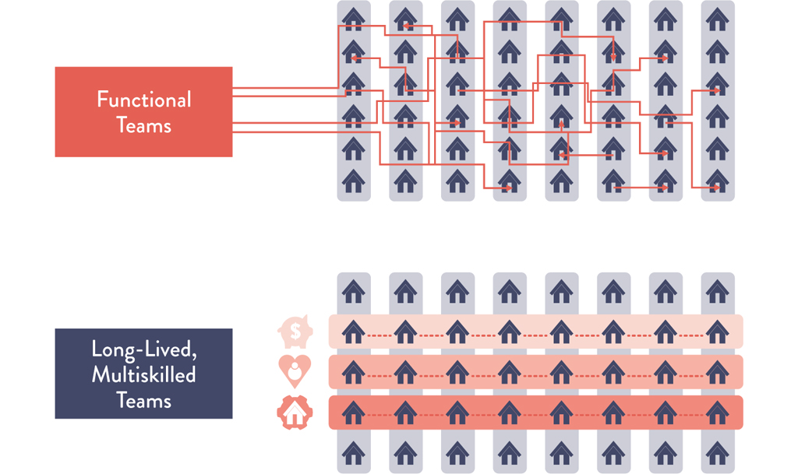

# Chapter 8: How to Get Great Outcomes by Integrating Operations into the Daily Work of Development

> **Part II -- Where to Start**

This chapter addresses the fundamental organizational challenge of DevOps: how to get centralized, functionally oriented Operations teams to work effectively alongside many independent Development teams with diverse needs. It presents three broad strategies -- self-service platforms, embedded Ops engineers, and Ops liaisons -- plus guidance on integrating Ops into daily Dev rituals. The chapter anchors these strategies in real-world case studies from Big Fish Games and Nationwide Building Society, showing how both a gaming company and the world's largest building society achieved dramatically better outcomes by breaking down silos between Dev and Ops.

## Table of Contents

- [Big Fish Games Case Study](#big-fish-games-case-study)
  - [Continuous Learning -- Team Topologies Connection](#continuous-learning--team-topologies-connection)
- [Create Shared Services to Increase Developer Productivity](#create-shared-services-to-increase-developer-productivity)
- [Embed Ops Engineers into Our Service Teams](#embed-ops-engineers-into-our-service-teams)
- [Assign an Ops Liaison to Each Service Team](#assign-an-ops-liaison-to-each-service-team)
- [Integrate Ops into Dev Rituals](#integrate-ops-into-dev-rituals)
  - [Invite Ops to Our Dev Standups](#invite-ops-to-our-dev-standups)
  - [Invite Ops to Our Dev Retrospectives](#invite-ops-to-our-dev-retrospectives)
  - [Make Relevant Ops Work Visible on Shared Kanban Boards](#make-relevant-ops-work-visible-on-shared-kanban-boards)
  - [Case Study: Nationwide Building Society (2020)](#case-study-nationwide-building-society-2020)
- [Conclusion](#conclusion)
- [How Generative AI Is Reshaping Dev/Ops Integration](#how-generative-ai-is-reshaping-devops-integration)
  - [GenAI and Self-Service Platforms](#genai-and-self-service-platforms)
  - [GenAI and the Ops Liaison / Embedded Ops Model](#genai-and-the-ops-liaison--embedded-ops-model)
  - [GenAI and Dev Rituals](#genai-and-dev-rituals)
  - [The Meta-Question: Does AI Replace the Need for Ops Integration?](#the-meta-question-does-ai-replace-the-need-for-ops-integration)

---

## Big Fish Games Case Study

The chapter opens with the story of **Big Fish Games**, a company that develops and supports hundreds of mobile and thousands of PC games, with more than $266 million in revenue in 2013. **Paul Farrall**, VP of IT Operations, ran the centralized Operations organization and was responsible for supporting multiple business units, each with significant autonomy.

**The problem:** Each business unit had dedicated Development teams who often chose wildly different technologies. When these groups wanted to deploy new functionality, they had to compete for a common pool of scarce Ops resources. Everyone struggled with unreliable test and integration environments and extremely cumbersome release processes. The result was long lead times, constant reprioritization and escalation, and poor deployment outcomes.

**Farrall's solution -- the Ops Liaison Model:**

> "When Dev teams had problems with testing or deployment, they needed more than just technology or environments. What they also needed was help and coaching. At first, we embedded Ops engineers and architects into each of the Dev teams, but there simply weren't enough Ops engineers to cover that many teams. We were able to help more teams with what we called an Ops liaison model and with fewer people." -- Paul Farrall

Farrall defined **two types of Ops liaisons:**

1. **Business Relationship Manager** -- Worked with product management, line-of-business owners, project management, Dev management, and developers. Their responsibilities:
   - Became intimately familiar with product group business drivers and road maps
   - Acted as advocates for product owners inside of Operations
   - Helped product teams navigate the Operations landscape to prioritize and streamline work requests

2. **Dedicated Release Engineer** -- Became intimately familiar with the product's Development and QA issues. Their responsibilities:
   - Helped product management get what they needed from the Ops organization
   - Were familiar with typical Dev and QA requests for Ops and often executed necessary work themselves
   - Pulled in dedicated technical Ops engineers (DBAs, Infosec, storage engineers, network engineers) as needed
   - Helped determine which self-service tools the entire Operations group should prioritize building

**Outcomes:**
- Dev teams across the organization became more productive and achieved their team goals
- Teams could prioritize around global Ops constraints, reducing mid-project surprises
- Increased overall project throughput
- Working relationships with Operations and code release velocity were noticeably improved
- All achieved without adding new headcount

> "The Ops liaison model allowed us to embed IT Operations expertise into the Dev and Product teams without adding new headcount." -- Paul Farrall

The three broad strategies that emerged from this transformation:

1. **Create self-service capabilities** to enable developers in the service teams to be productive
2. **Embed Ops engineers** into the service teams
3. **Assign Ops liaisons** to the service teams when embedding Ops is not possible

> **[Deep Dive]** The Big Fish Games case is instructive because it illustrates a common constraint in DevOps transformations: there are never enough Ops engineers to embed into every team. The Ops liaison model is a pragmatic compromise. The key insight is that the two liaison roles address two different failure modes. The Business Relationship Manager solves the *strategic alignment* problem -- Dev teams building things that surprise Ops at deployment time. The Dedicated Release Engineer solves the *tactical execution* problem -- Dev teams blocked waiting for Ops work. Most organizations that struggle with Dev/Ops integration are experiencing both simultaneously, which is why a single "Ops point of contact" often fails: the role requires both strategic and tactical skills. Splitting the role, as Farrall did, is an underappreciated design choice.

> **[Insight]** Notice that Farrall started by trying to embed Ops engineers into every team, found it unsustainable due to headcount constraints, and evolved to the liaison model. This is a common and healthy pattern in DevOps transformations: start with the ideal, discover the constraint, and design a pragmatic alternative that preserves the core benefits. The worst outcome would have been to do nothing because full embedding was impossible. The liaison model captures perhaps 80% of the benefit at 30% of the cost.

### Continuous Learning -- Team Topologies Connection

The book explicitly connects the Big Fish Games approach to the **Team Topologies** framework by Matthew Skelton and Manuel Pais (summarized in Chapter 7):

- The **single centralized Operations organization** providing infrastructure functionality for the entire organization maps to a **platform team**
- The **Ops liaisons** map to members of **enabling teams** -- they don't own the work but help stream-aligned teams become more capable
- The market-oriented product teams map to **stream-aligned teams**

Additionally, Ops engineers can be integrated into the Dev team's daily rituals: standups, planning, and retrospectives. This daily integration is what makes the liaison model work in practice rather than just on an org chart.

> **[2024+ Context]** The Team Topologies framework has become the dominant organizational design vocabulary in the DevOps world since its publication in 2019. The Big Fish Games pattern of platform team + enabling team is now explicitly recommended by Team Topologies practitioners. The key evolution since this book was written is the concept of **interaction modes**: platform teams should provide their capabilities via an "X-as-a-Service" mode (self-service, minimal collaboration overhead), while enabling teams operate in a "facilitating" mode (temporary, hands-on coaching). The Ops liaisons at Big Fish Games were essentially operating in facilitating mode. Modern platform engineering practice (see Humanitec, Backstage, Port) has formalized the "X-as-a-Service" side, while the SRE consulting model at Google formalizes the enabling/facilitating side. The two sides complement each other: platforms handle the routine, liaisons/enablers handle the exceptions and the coaching.

---

## Create Shared Services to Increase Developer Productivity

One way to enable market-oriented outcomes is for Operations to create a set of **centralized platforms and tooling services** that any Dev team can use. Examples include:

- Production-like environments
- Deployment pipelines
- Automated testing tools
- Production telemetry dashboards

The goal: enable Dev teams to spend more time building functionality for their customer, as opposed to obtaining all the infrastructure required to deliver and support that feature in production.

**Key design principles for shared services:**

1. **Automated and on-demand** -- All platforms and services should ideally be automated and available on demand without requiring a developer to open up a ticket and wait for someone to manually perform work. This ensures that Operations doesn't become a bottleneck (e.g., "We received your work request, and it will take six weeks to manually configure those test environments").

2. **Not mandated, but irresistible** -- In almost all cases, internal teams should not be mandated to use these platforms. Platform teams must win over and satisfy their internal customers, sometimes competing with external vendors. This creates an effective internal marketplace that ensures platforms are the easiest and most appealing choices available (the path of least resistance).

3. **Cumulative collective experience baked in** -- Platforms should embed the cumulative and collective experience of everyone in the organization -- QA, Operations, Infosec -- creating an ever-safer system of work. For example: a shared platform with a version control repository with pre-blessed security libraries, a deployment pipeline that automatically runs code quality and security scanning tools, deploying into known good environments with production monitoring tools pre-installed.

4. **Real product development** -- Creating and maintaining these platforms is real product development. The customers are internal Dev teams, not external customers. An internal platform team with poor customer focus will create tools everyone hates and quickly abandons.

> "Without these self-service Operations platforms, the cloud is just Expensive Hosting 2.0." -- Damon Edwards

> "Support our engineering teams' innovation and velocity. We don't build, bake, or deploy anything for these teams, nor do we manage their configurations. Instead, we build tools to enable self-service. It's okay for people to be dependent on our tools, but it's important that they don't become dependent on us." -- Dianne Marsh, Director of Engineering Tools at Netflix

> **[Deep Dive]** The Netflix model described by Dianne Marsh captures the gold standard for internal platform teams: dependency on tools, not on people. This distinction is critical. When teams depend on *people* (opening tickets, waiting for Ops to perform work), you get queues, bottlenecks, and frustration. When teams depend on *tools* (self-service APIs, automated pipelines, pre-configured environments), the "bottleneck" scales horizontally -- a tool can serve 100 teams as easily as 10. The platform team's job shifts from "doing work for Dev teams" to "building tools that let Dev teams do the work themselves." This is fundamentally a different operating model, and it requires platform teams to think like product teams: understanding user needs, measuring adoption, iterating on usability, and marketing their capabilities internally.

**Additional platform team responsibilities:**

- Help customers learn their technology
- Help migrate off of other technologies
- Provide coaching and consulting to elevate the state of the practice
- Facilitate standardization so engineers can quickly become productive even when switching teams
- Continually look for internal toolchains being widely adopted and decide which make sense to support centrally
- Prefer expanding what's already working over building from scratch -- "designing a system upfront for reuse is a common and expensive failure mode of many enterprise architectures"

**For organizations with approved-tools-only policies:** Start by removing this requirement for a few teams (such as the transformation team) so you can experiment and discover what capabilities make teams more productive.

> **[Insight]** The "not mandated, but irresistible" principle is one of the most important and most frequently violated ideas in the chapter. Many organizations create internal platforms and then mandate their use, which removes the feedback signal that drives quality. If teams are forced to use a bad platform, the platform team never feels the pain. If teams can choose, adoption rate becomes the ultimate quality metric. Low adoption is a signal to improve, not a reason to mandate. This also connects to the broader DevOps principle of treating internal teams as customers: real customers can take their business elsewhere. The tension, of course, is that too much freedom leads to fragmentation (ten different CI/CD tools, five different container orchestrators), while too much mandate leads to stagnation. The sweet spot is usually: provide a compelling default path that most teams voluntarily choose, while allowing exceptions for teams with genuinely different needs.

> **[2024+ Context]** This section essentially describes what the industry now calls **Platform Engineering** and **Internal Developer Platforms (IDPs)**. Since the book was written, this has evolved from an ad hoc practice into a recognized discipline with its own conferences (PlatformCon), tooling ecosystem (Backstage, Humanitec, Port, Kratix, Crossplane), and practitioner community. Key developments:
>
> - **Backstage** (open-sourced by Spotify in 2020) has become the de facto standard for developer portals, providing a single interface for service catalogs, documentation, CI/CD status, and self-service templates ("golden paths")
> - **Humanitec** and similar tools provide a "Platform Orchestrator" -- a layer that sits between developers and infrastructure, abstracting away Kubernetes, Terraform, and cloud provider complexity into simple, developer-facing APIs
> - The **CNCF Platform Engineering Maturity Model** (2023) provides a framework for assessing how mature your internal platform is, from "provisional" (ad hoc scripts) to "optimized" (fully self-service, telemetry-driven, continuously improved)
> - **Team Topologies** explicitly codified the platform team as one of four fundamental team types, giving organizational legitimacy to what was previously an informal practice
> - The **DevEx (Developer Experience)** movement (Noda, Storey, Greiler, 2023) provides frameworks for measuring the impact of these platforms on developer productivity, focusing on feedback loops, cognitive load, and flow state
>
> The principle in the book -- "make life so much easier for Dev teams that they will overwhelmingly decide that using our platform is the easiest, safest, and most secure means to get their applications into production" -- is now the explicit north star of the entire Platform Engineering movement.

---

## Embed Ops Engineers into Our Service Teams

Another strategy is to enable product teams to become more self-sufficient by **embedding Operations engineers within them**, reducing their reliance on centralized Operations. These product teams may also be completely responsible for service delivery and service support.

**How embedding changes dynamics:**

- Ops engineers' priorities are driven almost entirely by the goals of the product teams they are embedded in, rather than Ops focusing inwardly on solving their own problems
- Ops engineers become more closely connected to internal and external customers
- Product teams often have the budget to fund hiring of these Ops engineers, though interviewing and hiring decisions will likely still be done from the centralized Operations group (to ensure consistency and quality)

> "In many parts of Disney, we have embedded Ops (system engineers) inside the product teams in our business units, along with inside Development, Test, and even Information Security. It has totally changed the dynamics of how we work. As Operations Engineers, we create the tools and capabilities that transform the way people work, and even the way they think. In traditional Ops, we merely drove the train that someone else built. But in modern Operations Engineering, we not only help build the train, but also the bridges that the trains roll on." -- Jason Cox, Disney

**Embedded Ops engineer lifecycle for new projects:**

1. **Early project phase:** Help decide what to build and how to build it, influence product architecture, help with internal and external technology choices, help create new capabilities in internal platforms, possibly generate new operational capabilities
2. **Post-release phase:** Help with production responsibilities of the Dev team, participate in all Dev team rituals (planning meetings, daily standups, demonstrations)
3. **Maturity phase:** As the need for Ops knowledge decreases, Ops engineers may transition to different projects or engagements -- team composition changes throughout a product's life cycle

**Cross-training advantage:** Pairing Dev and Ops engineers together is an extremely efficient way to cross-train operations knowledge into a service team. It can also transform operations knowledge into **automated code** that can be far more reliable and widely reused.

> **[Deep Dive]** The embedded Ops model described here is essentially the precursor to what Google formalized as the **Site Reliability Engineering (SRE)** model. In Google's implementation, SRE teams are embedded into product areas and take on production responsibility, but with a key twist: they have an explicit "error budget" contract with Dev teams. If the service burns through its error budget (too many incidents, too much downtime), the SRE team can hand back operational responsibility to the Dev team until reliability improves. This creates a natural feedback loop that the generic "embedded Ops" model lacks. The book's description of Ops engineers transitioning away as the product matures echoes Google's concept of SRE "graduating" a service -- handing it back to the Dev team once operational maturity is achieved. The key lesson: embedding should be temporary and purposeful, not permanent. The goal is to transfer knowledge, not create a permanent dependency.

> **[Insight]** Jason Cox's quote about "building the bridges that the trains roll on" captures a subtle but important shift in how Operations should see its role. Traditional Ops is reactive and custodial: keeping existing systems running. Modern Operations Engineering is generative: creating capabilities that enable others. This is the difference between a team that responds to tickets and a team that builds platforms. The psychological shift is enormous -- it transforms Ops from a cost center ("we keep the lights on") to a capability multiplier ("we make everyone else more productive"). This reframing is often more important than any organizational restructuring, because it changes how Ops engineers see their own work and career trajectory.

> **[2024+ Context]** The embedded Ops model has evolved into several formalized patterns in the industry:
>
> - **Google's SRE embedding model:** SRE teams are embedded with product teams but maintain a separate reporting line and explicit service level objectives (SLOs) as contracts. The "error budget" mechanism ensures Dev teams don't take reliability for granted.
> - **Team Topologies "enabling team" pattern:** An enabling team works closely with stream-aligned teams for a limited time to build capability, then moves on. This matches the book's description of Ops engineers transitioning away as knowledge transfers.
> - **"You build it, you run it" (YBIYRI):** Some organizations (especially cloud-native ones) have moved beyond embedding altogether: Dev teams own production operations entirely, with platform teams providing the tools. This is the logical endpoint of the embedded model -- the knowledge has been fully transferred.
> - **The SRE "consulting" model:** Some large organizations (LinkedIn, Uber, Dropbox) have SRE teams that act as internal consultants, helping product teams improve reliability without permanently embedding. This is closer to the Ops liaison model described in the next section.

---

## Assign an Ops Liaison to Each Service Team

For organizations where embedding Ops engineers into every team is not feasible (due to cost, scarcity, or other constraints), the **Ops liaison** model provides many of the same benefits with fewer people.

**Etsy's "Designated Ops" model:** The centralized Operations group continues to manage all environments (production and pre-production) to ensure consistency. The designated Ops engineer is responsible for understanding:

- What the new product functionality is and why it's being built
- How it works as it pertains to **operability, scalability, and observability** (diagramming is strongly encouraged)
- How to **monitor and collect metrics** to ensure the progress, success, or failure of the functionality
- Any **departures from previous architectures and patterns**, and the justifications for them
- Any extra needs for **infrastructure** and how usage will affect infrastructure capacity
- **Feature launch plans**

**How the liaison operates:**
- Attends team standups
- Integrates Dev team needs into the Operations road map
- Performs needed operational tasks
- Escalates resource contention or prioritization issues
- Evaluates and prioritizes conflicts in the context of wider organizational goals

**Scaling considerations:** The Ops liaison model allows supporting more product teams than the embedded model. The goal is to ensure that Ops is not a constraint for product teams. If liaisons are stretched too thin and product teams can't achieve their goals, the options are:
1. Reduce the number of teams each liaison supports
2. Temporarily embed an Ops engineer into specific teams

> **[Deep Dive]** The Etsy "Designated Ops" checklist is worth examining closely because it defines the **non-functional requirements (NFRs)** that every product team should be addressing but often doesn't until it's too late. Operability, scalability, observability, monitoring, capacity planning, and launch planning -- these are the operational concerns that, when ignored during development, create the "wall of confusion" between Dev and Ops at deployment time. The liaison model works because it forces these conversations early: the Ops liaison asks these questions during development, not at deployment. This is essentially a lightweight, human-driven version of what modern "production readiness reviews" or "pre-flight checklists" formalize. The key is that the questions are asked by someone with deep operational expertise who can spot gaps that Dev teams might miss -- not because Dev teams are careless, but because they lack the operational context.

> **[Insight]** The three models -- self-service platforms, embedded Ops, and Ops liaisons -- are not mutually exclusive. In practice, most organizations use all three simultaneously: self-service platforms for routine needs (spinning up environments, deploying code), embedded Ops engineers for new or complex projects, and Ops liaisons for steady-state teams. The choice of which model to use for a given team depends on the team's maturity, the complexity of their operational needs, and the availability of Ops talent. This is a spectrum, not a binary choice. The sign that you've got the balance right is that Dev teams rarely feel blocked by Ops, and Ops engineers rarely feel surprised by what Dev teams are building.

---

## Integrate Ops into Dev Rituals

When Ops engineers are embedded or assigned as liaisons, the next step is to integrate them into **daily Dev rituals**. The goal is to help Ops engineers and other non-developers understand Development culture and proactively integrate into all aspects of planning and daily work. This ensures Operations can plan ahead and radiate needed knowledge into product teams, influencing work long before it reaches production.

> "I believe DevOps works a lot better if Operations teams adopt the same agile rituals that Dev teams have used -- we've had fantastic successes solving many problems associated with Ops pain points, as well as integrating better with Dev teams." -- Ernest Mueller

Note: Agile practices are not a prerequisite. The goal is to discover what rituals the product teams follow, integrate into them, and add value.

### Invite Ops to Our Dev Standups

The **daily standup** (popularized by Scrum) is a quick meeting where everyone presents three things:
1. What was done yesterday
2. What is going to be done today
3. What is preventing you from getting your work done

**Why Ops should attend:** Information about upcoming work is typically compartmentalized within the Development team. By having Ops engineers attend Dev standups, Operations gains awareness of the Development team's activities, enabling better planning and preparation.

**Examples of value Ops gains from standups:**
- Discovering that a product team is planning a big feature rollout in two weeks, so the right people and resources can be made available
- Highlighting areas where closer interaction or more preparation is needed (e.g., creating more monitoring checks or automation scripts)
- Ops can help solve current team problems (e.g., improving performance by tuning the database instead of optimizing code)
- Ops can prevent future problems before they become crises (e.g., creating more integration test environments to enable performance testing)

### Invite Ops to Our Dev Retrospectives

The **retrospective** is held at the end of each development interval. The team discusses:
- What was successful
- What could be improved
- How to incorporate successes and improvements in future iterations

This is one of the primary mechanisms for organizational learning and development of countermeasures, with resulting work implemented immediately or added to the team's backlog.

**Why Ops should attend:** Operations can benefit from new learnings, and when there is a deployment or release in that interval, Operations should present the outcomes and resulting learnings, creating a feedback loop into the product team.

**Examples of Ops feedback in retrospectives:**

- "Two weeks ago, we found a monitoring blindspot and agreed on how to fix it. It worked. We had an incident last Tuesday, and we were able to quickly detect and correct it before any customers were impacted."
- "Last week's deployment was one of the most difficult and lengthy we've had in over a year. Here are some ideas on how it can be improved."
- "The promotion campaign we did last week was far more difficult than we thought it would be, and we should probably not make an offer like that again. Here are some ideas on other offers we can make to achieve our goals."
- "During the last deployment, the biggest problem we had was that our firewall rules are now thousands of lines long, making it extremely difficult and risky to change. We need to re-architect how we prevent unauthorized network traffic."

**The improvement work imperative:** The additional work identified during retrospectives falls into the broad category of improvement work -- fixing defects, refactoring, automating manual work. Product managers may want to defer or deprioritize this in favor of customer features. However:

> **Improvement of daily work is more important than daily work itself.** All teams must have dedicated capacity for improvement work (e.g., reserving 20% of all capacity, scheduling one day per week or one week per month). Without doing this, team productivity will almost certainly grind to a halt under the weight of technical and process debt.

> **[Deep Dive]** The 20% rule for improvement work is not arbitrary -- it reflects hard-won experience from organizations that have tracked the cost of deferred improvement. When improvement work is perpetually deferred, technical debt compounds: builds get slower, environments become more fragile, manual processes multiply, and eventually the team spends more time fighting fires than building features. The 20% figure is a floor, not a ceiling. Some organizations in heavy technical debt need 30-40% for a period to dig out. The key mechanism is making it *structural* rather than aspirational: if improvement work is a "nice to have" that gets bumped whenever a deadline looms, it will never happen. Google's famous "20% time" and Atlassian's "ShipIt Days" are formalized versions of this principle. The most effective approach is to make improvement work a first-class citizen on the team's kanban board, with WIP limits and priorities just like feature work.

> **[Insight]** The retrospective examples given in the book are carefully chosen to illustrate different types of Ops feedback: operational success stories (the monitoring fix), deployment difficulty (process improvement needed), business decision impact (the promotion campaign), and architectural debt (firewall rules). Each type creates a different kind of learning for the product team. The monitoring success story reinforces good behavior. The deployment difficulty feedback identifies process waste. The promotion feedback connects product decisions to operational consequences. The firewall feedback surfaces technical debt that has become a risk. A healthy retrospective should include all four types regularly. If the only feedback from Ops is "the deployment was fine," either the system is remarkably mature or the feedback loop is broken.

### Make Relevant Ops Work Visible on Shared Kanban Boards

Development teams commonly make their work visible on a project board or kanban board. However, it is far less common to show the relevant **Operations work** that must be performed for the application to run successfully in production. As a result, necessary Operations work is not discovered until it becomes an urgent crisis.

**Why Ops work belongs on the kanban board:**
- Operations is part of the product value stream
- Enables everyone to see all the work required to move code into production
- Keeps track of all Operations work required to support the product
- Makes blocked Ops work visible, highlighting areas needing escalation or improvement
- Visibility is a key component in properly recognizing and integrating Ops work into relevant value streams

> **[Insight]** The invisibility of Ops work is one of the most insidious problems in Dev/Ops integration. When Ops work isn't on the board, it doesn't get planned for, prioritized, or tracked. This creates a pattern where Dev "finishes" a feature but it can't actually be deployed because nobody planned for the environment configuration, monitoring setup, database migration, or security review that Ops needs to perform. The feature is "done" on the Dev board but blocked in reality. Putting Ops work on the shared board doesn't just improve visibility -- it changes the team's definition of "done" from "code complete" to "running in production." This is a small change that has outsized impact on how teams plan and prioritize work.

---

### Case Study: Nationwide Building Society (2020)

**Nationwide Building Society** is the world's largest building society, with sixteen million members. In 2020, **Patrick Eltridge** (Chief Operating Officer) and **Janet Chapman** (Mission Leader) discussed their continued journey to better ways of working at the DevOps Enterprise Summit London-Virtual.

**The challenge:** As a larger, older organization, Nationwide faces the challenges of a "hyper fluid and hyper competitive environment." They started their transformation in the IT department, mainly around change activities and Agile practices in IT delivery, seeing measurable but limited benefits.

> "We deliver well and reliably, but slowly. We need to get from start to finish more quickly and to surprise and delight our members not only with the quality of our products and services, but the speed at which they are delivered." -- Janet Chapman

**The transformation -- Member Mission Operating Model:**

With the help of **Jonathan Smart** (Sooner Safer Happier author) and his team from Deloitte, Nationwide was in the middle of an organizational pivot from a functional organization to one **fully aligned to member needs** underpinned by stronger Agile and DevOps practices. The key objective was to **bring "run" and "change" activities together** into long-lived and multiskilled teams.

**The old way:**

> "Currently, when we process a mortgage application it gets broken into parts among all the functional teams. We all do our bits and then reassemble the outcome, test it to see what we got wrong, and then see if it fits the needs of the member and fix it if it doesn't. And when we want to improve performance or reduce cost, we seek to improve the efficiency or reduce the capacity of the teams of individual specialists. What that way of working doesn't do is optimize the flow of work to our members from beginning to end, right across and through those teams." -- Patrick Eltridge

**The new way:**

Nationwide made it easy for members to tell them what they wanted. Then they brought together all the people and tools necessary into a **single team** to make that "want." Everyone on the team can see all the work. They organize themselves to smooth the path and optimize delivery in a safe, controlled, and sustainable manner. If a bottleneck appears, they add people or change the process -- they do **not** add a queuing mechanism as a first response.

*Source: Chapman, Janet, and Patrick Eltridge. "On A Mission: Nationwide Building Society," presentation at DevOps Enterprise Summit-Virtual London 2020.*

**Results:** By moving from functional teams in silos to long-lived, multiskilled teams, Nationwide saw:
- Dramatically improved throughput
- Improvements in risk and quality
- Lower costs

**The COVID-19 test:** Nationwide had a unique opportunity to put their new ways of working to the test during the pandemic. When the UK went into lockdown, call centers were swamped due to staff absences. They needed to enable contact center staff to work from home and enable branch staff to take calls.

This initiative had been discussed for years but would have taken **nine months and cost more than 10 million pounds** under the old model, so it never got done.

**With the new model:**
1. Gathered everyone necessary around the same "virtual" table
2. Worked through in real time how to enable an agent to work from home
3. Completed in **four days**
4. Then directed calls to branch networks (four more days)
5. Solved the regulatory recording problem over the weekend (another four days)

> "Afterwards, I asked the team how many corners we'd cut? How many policies we'd breached? How many security holes we'd now need to plug? They looked at me and said, 'Well, none. We had all the specialists we needed to do it properly right there. We stuck to the policies, it's secure, it's fine.'" -- Patrick Eltridge

> "When everyone you need is aligned on the most important task at the same time, you get real pace and real collaboration on solving problems. That, in essence, is what a mission is to us." -- Patrick Eltridge

**Ongoing evolution:** Nationwide is now:
- Aligning people from old functional teams into long-lived, multiskilled mission teams and underlying value streams
- Evolving governance and financial management to support local decision-making and continuous funding of consistent teams
- Integrating run and change activities into long-lived teams to enable continuous improvement
- Applying systems thinking to identify and remove failure demand from flows

> "I think of Agile as our means and DevOps as our target. This is very much a work in progress, and we're consciously allowing the issues and opportunity to merge as we work to implement this. We're not following a templated approach. It is most important to people to go on this journey of learning and unlearning, often with coaches, but not having the answers handed to them by a central team of experts." -- Patrick Eltridge

**The broader lesson:** Beyond simply bringing Dev and Ops together, Nationwide brought together teams with *all* the skills necessary to bring value to market -- moving from multiple functional teams to single, multiskilled teams. This illustrates the power of breaking down silos to move faster.

> **[Deep Dive]** The Nationwide case study is remarkable for two reasons. First, the COVID-19 response demonstrates that the multiskilled team model isn't just faster in theory -- it's faster by orders of magnitude in practice. Nine months became four days. That's not a 10% improvement; it's a 60x improvement. And crucially, it was achieved without cutting corners on security, compliance, or quality. This demolishes the common objection that "we can't go faster without sacrificing quality." The opposite is true: when all the specialists are at the same table, quality is *higher* because decisions are made with full context, not passed between silos where context is lost at each handoff.
>
> Second, Eltridge's observation about queuing is profound: "If a bottleneck does appear, they add people or change the process. What they don't do is add a queuing mechanism as a first response." In traditional organizations, the first response to a bottleneck is always a queue: a ticket, a backlog, a waiting list. But queues don't solve bottlenecks; they formalize them. They make waiting the default mode. The multiskilled team model eliminates queues by keeping all necessary skills within the team, so work doesn't have to leave the team to get done.

> **[Insight]** Eltridge's framing -- "Agile as our means and DevOps as our target" -- is a useful mental model. Agile practices (standups, retrospectives, sprints) are the daily working methods. DevOps principles (fast flow, fast feedback, continual learning) are the strategic goals. You can do Agile without achieving DevOps outcomes (many organizations run sprints but still deploy quarterly). The practices are necessary but not sufficient; they must be aimed at the right target. This connects back to the American Airlines case study in Chapter 1, where by Year 3, Agile was no longer an objective -- it had become invisible infrastructure in service of business outcomes.

> **[2024+ Context]** The Nationwide story is a textbook example of what Team Topologies calls the transition from **complicated subsystem teams** organized by specialty to **stream-aligned teams** organized by value stream. The "Member Mission Operating Model" is essentially a stream-aligned team structure where each "mission" team owns a complete flow of value to the member. Key parallels with current thinking:
>
> - **Inverse Conway Maneuver:** Nationwide deliberately restructured their teams to match the desired architecture of work flow (end-to-end, member-facing), rather than letting the functional org chart dictate how work flows. This is precisely the Inverse Conway Maneuver described in Chapter 7.
> - **Continuous funding of teams (not projects):** Nationwide's shift to continuous funding of consistent teams mirrors the "fund teams, not projects" principle advocated by Marty Cagan (Inspired, Empowered) and now widely adopted in product-led organizations. This removes the project funding cycle as a bottleneck and allows teams to continuously improve their products.
> - **Integrating "run" and "change":** The separation of "run the service" (Ops) and "change the service" (Dev) is one of the most persistent organizational anti-patterns. Nationwide explicitly broke this apart. In modern SRE practice, this is the equivalent of "you build it, you run it" -- the same team is responsible for both evolving and operating their service.

---

## Conclusion

The chapter presents a coherent strategy for integrating Operations into the daily work of Development. The three broad strategies operate at different scales:

| Strategy | Best For | Ops Investment | Dev Autonomy |
|---|---|---|---|
| **Self-service platforms** | Routine, repeatable needs | Low per team (high upfront) | Highest |
| **Embedded Ops engineers** | New/complex projects; knowledge transfer | High | Medium |
| **Ops liaisons** | Steady-state teams; scarce Ops talent | Medium | Medium-High |

All three are complemented by integrating Ops into Dev rituals (standups, retrospectives, kanban boards), which creates the daily feedback loops necessary for the strategies to work in practice rather than just on org charts.

The key insight running through the entire chapter: **Operations should not be a gate that work passes through, but a capability that is woven into the fabric of how Development teams work every day.** When this is done well, the result is user-oriented outcomes -- fast flow, reliable deployments, and teams that can deliver value independently -- regardless of how the organization chart is drawn.

---

## How Generative AI Is Reshaping Dev/Ops Integration

> **[GenAI + DevOps]** The organizational patterns described in this chapter -- self-service platforms, embedded Ops, Ops liaisons, and ritual integration -- are all being reshaped by Generative AI. Here is a concept-by-concept analysis:

### GenAI and Self-Service Platforms

The self-service platform model is the area most directly enhanced by GenAI:

| Platform Capability | Traditional Self-Service | With GenAI |
|---|---|---|
| **Environment provisioning** | Developer fills out a form or runs a CLI command | Developer describes what they need in natural language; AI generates the infrastructure-as-code |
| **Deployment pipelines** | Developer configures YAML/HCL from templates | AI generates pipeline config from intent, suggests best practices, auto-fixes failures |
| **Monitoring setup** | Developer manually configures dashboards and alerts | AI analyzes the service and auto-generates SLO-appropriate monitoring based on service type and traffic patterns |
| **Troubleshooting** | Developer reads logs and dashboards | AI correlates logs, metrics, and traces to surface probable root causes and suggest remediations |
| **Documentation** | Developer writes runbooks manually | AI generates runbooks from code, deployment history, and incident history |

**Key implication:** AI makes platforms more accessible by lowering the cognitive load on developers. Instead of learning the platform's API, developers can describe what they want. This accelerates the "path of least resistance" principle -- the easier the platform is to use, the more teams will voluntarily adopt it.

**Emerging tools:**
- [Kubecost + AI](https://www.kubecost.com/) -- AI-powered cost optimization for Kubernetes
- [Harness AI](https://www.harness.io/) -- AI-assisted deployment pipelines and verification
- [Datadog AI](https://www.datadoghq.com/) -- AI-powered anomaly detection and root cause analysis
- [GitHub Copilot for Infrastructure](https://github.com/features/copilot) -- AI-assisted Terraform, Kubernetes YAML, and CI/CD configuration

### GenAI and the Ops Liaison / Embedded Ops Model

AI is changing the economics of the Ops liaison and embedded Ops models:

- **AI as a "first-line Ops liaison":** AI chatbots trained on internal infrastructure documentation, runbooks, and past incident reports can answer many of the routine questions that Dev teams currently bring to their Ops liaison. This frees human liaisons to focus on higher-value strategic work (architecture reviews, capacity planning, launch readiness).
- **AI-augmented cross-training:** When Ops engineers are embedded in Dev teams to cross-train, AI can accelerate this by generating documentation, explaining infrastructure code, and creating interactive tutorials from existing operational knowledge.
- **AI-generated non-functional requirements:** The Etsy "Designated Ops" checklist (operability, scalability, observability) can be partially automated by AI that analyzes a service's architecture and generates a pre-populated checklist of operational concerns specific to that service.

### GenAI and Dev Rituals

- **Standup preparation:** AI can summarize overnight incidents, deployment status, and infrastructure changes before the standup, giving the Ops liaison a concise briefing.
- **Retrospective analysis:** AI can analyze incident timelines, deployment metrics, and change failure rates to generate data-driven retrospective talking points.
- **Kanban board automation:** AI can auto-detect when a feature implies Ops work (e.g., a new database, a new external integration) and automatically create Ops tasks on the shared board.

### The Meta-Question: Does AI Replace the Need for Ops Integration?

**No.** AI amplifies the strategies described in this chapter but does not replace them. The fundamental challenge -- that Dev teams need operational knowledge to build production-ready software, and Ops teams need development context to support services effectively -- is a *human coordination* problem, not a technical one. AI can make the coordination more efficient (faster information sharing, automated routine tasks, better visibility), but the organizational design patterns (embedded Ops, liaisons, shared rituals) remain necessary.

The risk is actually the opposite: organizations that adopt AI tooling without the organizational integration described in this chapter may produce more code faster that is *less* operationally sound -- because AI coding assistants are optimized for functionality, not operability, scalability, or observability. The Ops liaison who asks "how will we monitor this?" and "what happens at 10x traffic?" is more important, not less, in an AI-accelerated development environment.

**Further reading:**
- [Platform Engineering on Kubernetes (Manning, 2024)](https://www.manning.com/books/platform-engineering-on-kubernetes) -- modern platform engineering patterns
- [Team Topologies -- Key Concepts](https://teamtopologies.com/key-concepts) -- the organizational model underlying the chapter's strategies
- [Google SRE Workbook (free online)](https://sre.google/workbook/table-of-contents/) -- practical implementation of the embedded SRE model
- [Backstage by Spotify](https://backstage.io/) -- open-source developer portal for self-service platforms
- [Internal Developer Platform (IDP) Guide by Humanitec](https://humanitec.com/blog/what-is-an-internal-developer-platform) -- comprehensive overview of modern IDPs
- [CNCF Platform Engineering Maturity Model](https://tag-app-delivery.cncf.io/whitepapers/platform-eng-maturity-model/) -- framework for assessing platform maturity
