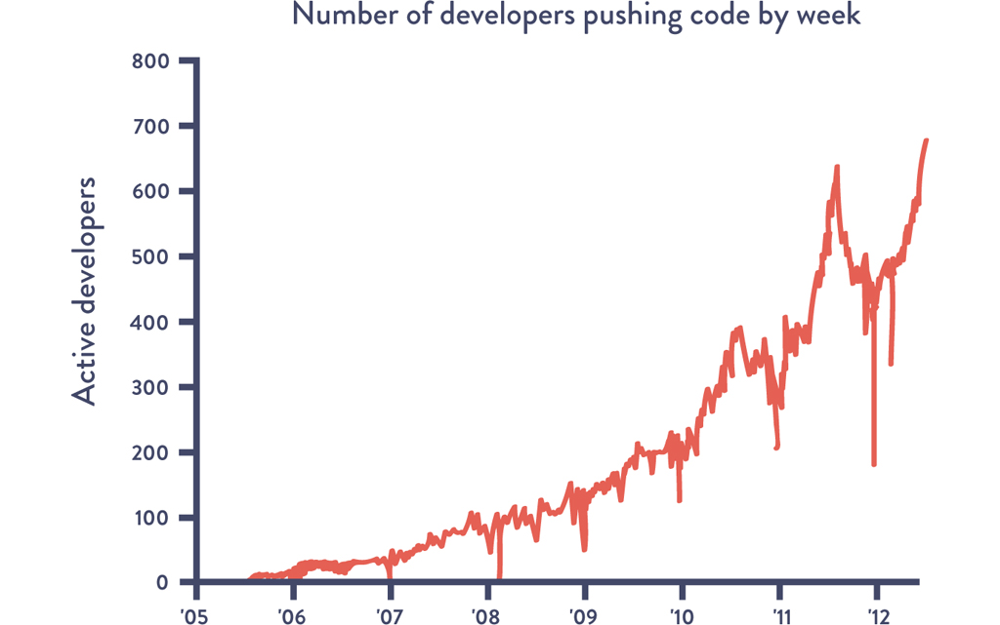
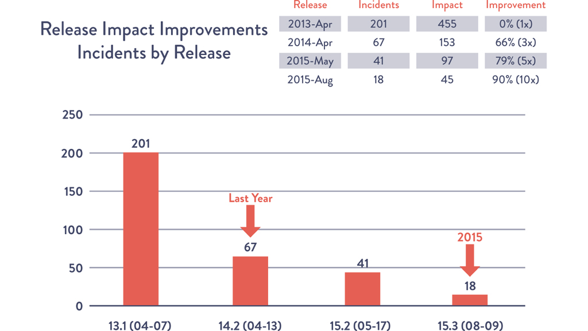
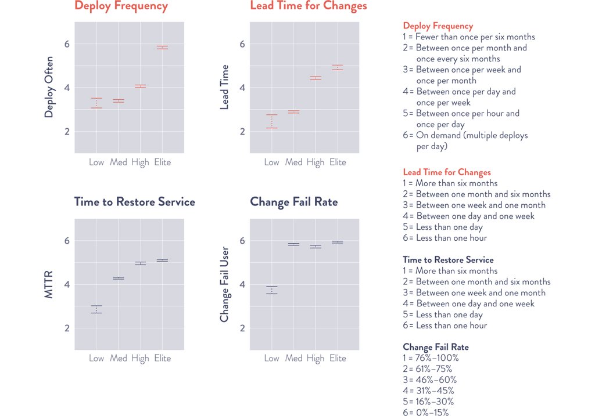
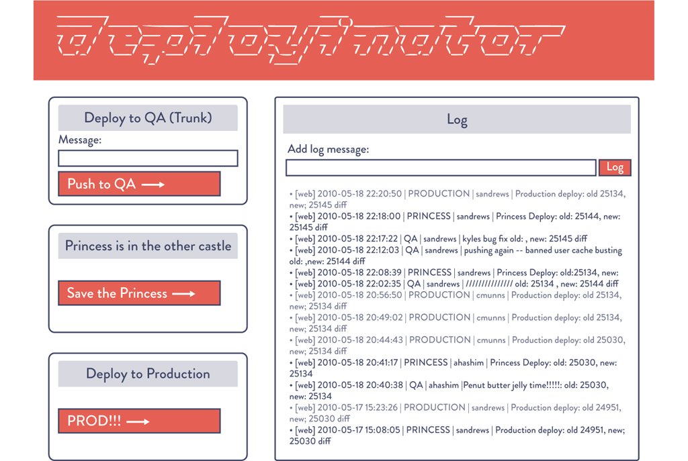
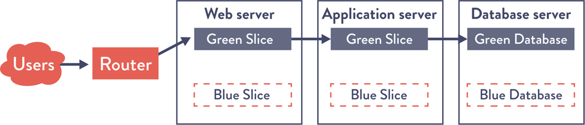
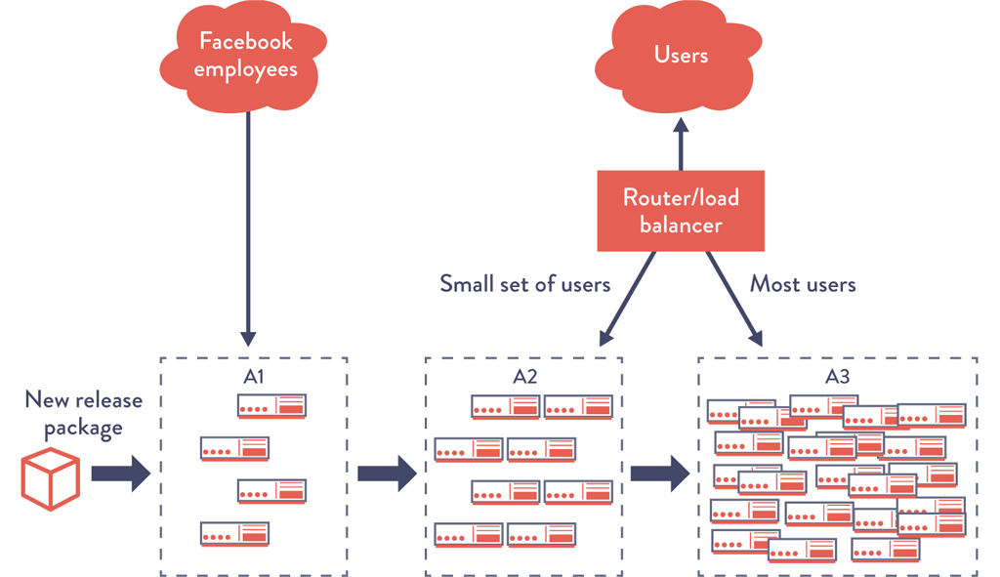
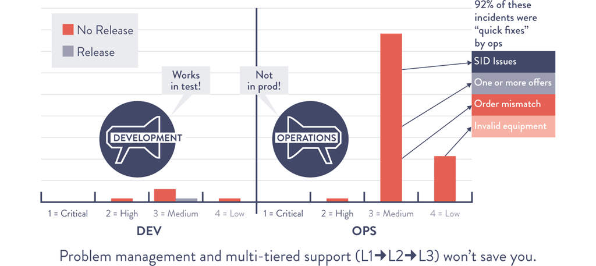
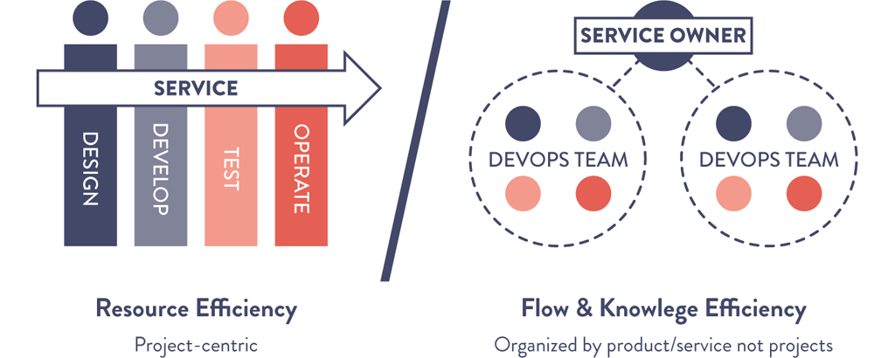
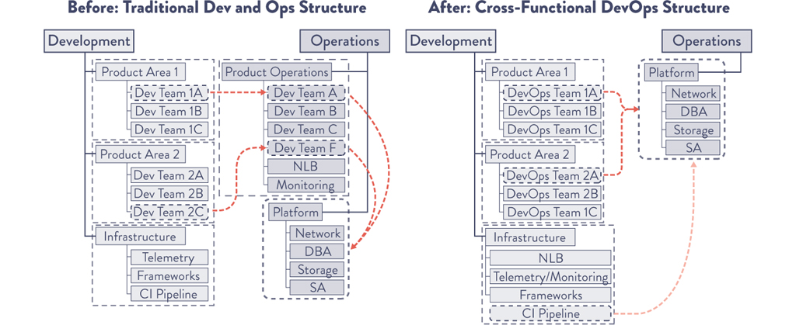

# Chapter 12: Automate and Enable Low-Risk Releases

> **Part III — The Technical Practices of Flow**

This is the longest and most practice-dense chapter in the book. It covers the full spectrum of deployment and release automation — from automating the deployment process to decoupling deployments from releases, to environment-based patterns (blue-green, canary, cluster immune systems) and application-based patterns (feature toggles, dark launches). Multiple landmark case studies (Facebook, Etsy, CSG, Dixons Retail) illustrate how these patterns transform releases from high-drama nighttime events into routine daily operations.

## Table of Contents

- [Automate Our Deployment Process](#automate-our-deployment-process)
  - [Case Study: Daily Deployments at CSG International (2013)](#case-study-daily-deployments-at-csg-international-2013)
  - [Enable Automated Self-Service Deployments](#enable-automated-self-service-deployments)
  - [Integrate Code Deployment into the Deployment Pipeline](#integrate-code-deployment-into-the-deployment-pipeline)
  - [Case Study: Etsy Self-Service Developer Deployment (2014)](#case-study-etsy-self-service-developer-deployment-2014)
- [Decouple Deployments from Releases](#decouple-deployments-from-releases)
  - [Environment-Based Release Patterns](#environment-based-release-patterns)
    - [The Blue-Green Deployment Pattern](#the-blue-green-deployment-pattern)
    - [Dealing with Database Changes](#dealing-with-database-changes)
    - [Case Study: Dixons Retail Blue-Green POS (2008)](#case-study-dixons-retail-blue-green-pos-2008)
    - [The Canary and Cluster Immune System Release Patterns](#the-canary-and-cluster-immune-system-release-patterns)
  - [Application-Based Patterns to Enable Safer Releases](#application-based-patterns-to-enable-safer-releases)
    - [Implement Feature Toggles](#implement-feature-toggles)
    - [Perform Dark Launches](#perform-dark-launches)
    - [Case Study: Dark Launch of Facebook Chat (2008)](#case-study-dark-launch-of-facebook-chat-2008)
  - [Survey of Continuous Delivery and Continuous Deployment](#survey-of-continuous-delivery-and-continuous-deployment-in-practice)
  - [Case Study: DORA Continuous Delivery Research (2018-2019)](#case-study-dora-continuous-delivery-research)
  - [Case Study: Creating a Win-Win for Dev and Ops at CSG (2016)](#case-study-creating-a-win-win-for-dev-and-ops-at-csg-2016)
- [Conclusion](#conclusion)
- [How Generative AI Is Reshaping Release Automation](#how-generative-ai-is-reshaping-release-automation)

---

The chapter opens with **Chuck Rossi**, Director of Release Engineering at Facebook, describing their daily code push process (2012): starting at 1 PM, the team enters "operations mode." All developers with changes going out must be present and check in on IRC — **any developers not present have their changes automatically removed** from the deployment package. If test dashboards and canary tests are green, they "push the big red button and the entire Facebook.com server fleet gets the new code delivered. Within twenty minutes, thousands and thousands of machines are up on new code with no visible impact to the people using the site."

*Source: Chuck Rossi, "Ship early and ship twice as often."*

Rossi later doubled release frequency to twice daily, giving engineers not on US West Coast the ability to "move and ship as quickly as any other engineer in the company."

**Kent Beck** (creator of XP, technical coach at Facebook) commented: "Chuck Rossi made the observation that there seem to be a fixed number of changes Facebook can handle in one deployment. If we want more changes, we need more deployments."

> **[Deep Dive: The Paradox of More Frequent Deployments]**
>
> Beck's observation is counterintuitive but mathematically sound. If each deployment can safely handle ~50 changes, then to ship 200 changes per day you need 4 deployments, not 1 deployment of 200 changes. A single large deployment of 200 changes has combinatorial risk — any of the 200 changes could interact badly with any other, creating ~20,000 potential pairwise interactions. Four deployments of 50 changes each have only ~1,225 pairwise interactions each, and problems are isolated to a smaller blast radius. **More frequent = more total deployments = less risk per deployment = less total risk.** This is the small-batch-size principle from Chapter 2 applied to releases.

The underlying problem: when deployments are painful, we do them less often → differences accumulate → batch size grows → risk grows → deployments become more painful. A self-reinforcing downward spiral. The solution: **make deployments routine, automated, repeatable, and predictable.**

---

## Automate Our Deployment Process

To achieve Facebook-like outcomes, we need automated deployment mechanisms. Steps to automate:

- Packaging code for deployment
- Creating preconfigured VM images or containers
- Automating deployment and configuration of middleware
- Copying packages/files onto production servers
- Restarting servers, applications, or services
- Generating configuration files from templates
- Running automated smoke tests
- Running testing procedures
- Scripting and automating database migrations

**Key principle:** Re-architect to remove steps (especially slow ones) and reduce handoffs. Development must work closely with Operations to ensure co-created tools work downstream.

**Deployment pipeline requirements:**
1. **Deploy the same way to every environment** — production deployments succeed because they've been performed many times already in earlier pipeline stages
2. **Smoke test deployments** — test connections to supporting systems, run a single test transaction. Fail the deployment if tests fail.
3. **Maintain consistent environments** — dev, test, and production share a common build mechanism

> **[Insight]** "Deploy the same way to every environment" is one of the most violated principles in practice. Teams that have one deployment process for dev/test and a different (manual, more "careful") process for production are essentially practicing their deployment process in a completely different way than they'll execute it when it matters most. It's like a basketball team that practices free throws with a different ball than they use in games. The whole point of the deployment pipeline is that production deployment is just one more stage of the same automated process.

### Case Study: Daily Deployments at CSG International (2013)

**Context:** CSG International — North America's largest SaaS-based customer care and billing provider, 65M+ subscribers, tech stack from Java to mainframe. Scott Prugh, Chief Architect and VP of Development, led the improvement effort.

**The problem:** Dev teams used CI to deploy to test environments daily, but production releases were performed by a separate Ops team only twice per year.

> "It was as if we had a 'practice team' that practiced daily in low-risk test environments, perfecting their processes and tools. But our production 'game team' got very few attempts to practice, only twice per year. Worse, they were practicing in the high-risk production environments, which were often very different than the pre-production environments." — Scott Prugh

**Solution:** Created a **Shared Operations Team (SOT)** responsible for managing ALL environments (dev, test, production) and performing daily deployments into dev/test plus production releases every 14 weeks. Because SOT deployed daily, any unfixed problem would recur the next day — creating tremendous motivation to automate and fix issues. Deployments ran ~100 times before production release.

They also made non-production environments match production as closely as possible, including security access rights and load balancers.

> "We made non-production environments as similar to production as possible, and we sought to emulate production constraints in as many ways as possible. Early exposure to production-class environments altered the designs of the architecture to make them friendlier." — Prugh

**Database migration approach:** Cross-trained developers, automated schema changes, executed them daily against sanitized customer data with realistic load testing. Removed handoffs to DBAs.

**Results:**
- Production incidents down **91%**
- MTTR down **80%**
- Deployment lead time from 14 days to **1 day**
- Deployments became so routine that **"the Ops team was playing video games by the end of the first day"**
- 50% of the time, customers received value in half the time

*Daily deployments and increasing release frequency resulted in decreased incidents and MTTR. Source: Scott Prugh & Erica Morrison, DOES15.*

> **[Deep Dive: Why More Frequent Deployments Reduce Incidents — The Math]**
>
> CSG's results seem paradoxical: deploying more often led to 91% fewer incidents. The mechanism:
>
> | Factor | Before (2x/year) | After (daily to test, quarterly to prod) |
> |--------|-------------------|------------------------------------------|
> | Changes per deployment | ~1,000 | ~5-10 |
> | Blast radius of failure | Entire release | A few changes |
> | Time to identify root cause | Days/weeks (which of 1,000 changes?) | Minutes (which of 5 changes?) |
> | Practice runs before prod | 0 | ~100 |
> | Environment parity | Low (different constraints) | High (matched to prod) |
>
> Each factor compounds. Small batches × practiced process × production-like environments = dramatically lower risk per deployment AND fewer deployments that fail.

### Enable Automated Self-Service Deployments

> "As a developer, there has never been a more satisfying point in my career than when I wrote the code, when I pushed the button to deploy it, when I could see the production metrics confirm that it actually worked in production, and when I could fix it myself if it didn't." — Tim Tischler, Director of Operations Automation, Nike

DORA research shows: separation of duties can be effectively implemented through **code review** rather than requiring Ops to perform all deployments. Automated test suites that must pass before changes can be submitted, combined with peer review, are substantially more effective.

**Self-service requirements:**
- **Build:** Deployment pipeline creates packages from version control deployable to any environment
- **Test:** Anyone can run automated test suites on their workstation or test systems
- **Deploy:** Anyone with access can deploy using scripts checked into version control

> **[Insight]** The shift from "Ops deploys" to "anyone deploys" is not about removing oversight — it's about shifting oversight from a manual gate (a human pressing a button) to an automated gate (the pipeline enforcing quality). The automated pipeline is actually *more* rigorous than a manual approval because it checks every change, every time, consistently. A human reviewer at 2 AM on a Friday is far less reliable than an automated test suite.

### Integrate Code Deployment into the Deployment Pipeline

The deployment pipeline must provide:
- Packages suitable for production deployment
- At-a-glance readiness of production environments
- Push-button, self-service deployment for any suitable version
- Automatic recording for audit/compliance (commands, machines, timestamps, authorizer, binary hashes, source control versions)
- Smoke tests post-deployment
- Fast feedback on deployment success

DORA 2019 data: elite performers deploy on demand with lead times in minutes/hours; lowest performers have lead times measured in months.

*Source: Forsgren et al., Accelerate: State of DevOps Report, 2019.*

### Case Study: Etsy Self-Service Developer Deployment (2014)

Unlike Facebook's release-engineer-managed deployments, at Etsy **anyone** could deploy — Dev, Ops, Infosec. New engineers deployed on their first day. **Even dogs and board members** have deployed to production.

> "By the time 8am rolls around on a normal business day, 15 or so people and dogs are starting to queue up, all of them expecting to collectively deploy up to 25 changesets before the day is done." — Noah Sussman, Test Architect, Etsy

**Process:**
1. Engineer joins deploy queue in chat room
2. Runs all 4,500 unit tests locally (<1 minute, external calls stubbed)
3. Checks code into trunk
4. 7,000 automated trunk tests run on CI (11 minutes, parallelized across 10 Jenkins machines)
5. Smoke tests (cURL-based system tests)
6. Functional tests on "Princess" — a production server taken out of rotation (exact production match)
7. When it's their turn: press "Prod" button in **Deployinator** (internal tool)
8. Everyone in IRC and email gets notification with diff link

*Source: Erik Kastner, "Quantum of Deployment," CodeasCraft.com, 2010.*

**Evolution:** In 2009, Etsy deployments caused stress and fear. By 2011, 25-50 deploys per day, routine operation.

> **[2024+ Context]** Etsy's Deployinator model — self-service, chat-integrated, one-click deployment — has become the template for modern deployment tooling. Tools like **Argo Rollouts**, **Flux**, **Spinnaker**, and **Harness** provide this out of the box. The "deploy queue in chat" pattern evolved into **ChatOps** (popularized by GitHub's Hubot) where deployment commands are issued directly in Slack/Teams. Modern Internal Developer Platforms (Backstage, Port, OpsLevel) provide Deployinator-like self-service UIs as a standard feature.

---

## Decouple Deployments from Releases

**Critical distinction:**
- **Deployment:** Installing a specified version of software to an environment. May or may not be associated with a feature release.
- **Release:** Making a feature available to customers (all or a segment).

> **[Deep Dive: Why This Distinction Matters]**
>
> When deployment = release, every deploy is high-stakes because it immediately affects customers. This creates fear of deploying, which leads to infrequent deploys, which leads to large batch sizes, which leads to higher risk.
>
> When deployment ≠ release, deploys become routine infrastructure operations (low-stakes), and releases become business decisions (when to expose features). This separation enables:
> - Deploying code during business hours without customer impact
> - Testing features in production before customers see them
> - Gradual rollout to catch problems with small user segments
> - Instant rollback by toggling features off (no redeploy needed)
>
> The organizational implication is equally important: **Dev/Ops own deployment success** (technical), while **Product owns release success** (business outcomes). Clear accountability.

**Two categories of release patterns:**

| Pattern Type | How It Works | Requires Code Changes? |
|-------------|-------------|----------------------|
| **Environment-based** | Multiple environments, switch which one is live | No — infrastructure-level |
| **Application-based** | Feature toggles control visibility per-feature | Yes — code-level |

### Environment-Based Release Patterns

These require no application code changes — implemented entirely at the infrastructure level.

#### The Blue-Green Deployment Pattern

Two production environments (blue and green). Only one serves customer traffic at any time.

*Source: Humble and North, Continuous Delivery, 261.*

**Process:** Deploy to inactive environment → test → switch traffic (change router/load balancer setting) → inactive becomes new staging. **Rollback:** Switch traffic back.

**Benefits:**
- Deploy during business hours
- Simple changeover (router/symlink change)
- Dramatically improves work conditions for deployment teams
- Easy to retrofit onto existing systems

> **[Deep Dive: Blue-Green Implementation Variants]**
>
> The book lists many ways to implement blue-green:
> - Multiple Apache/NGINX servers on different interfaces
> - Multiple virtual roots on Windows IIS bound to different ports
> - Different directories with a symbolic link determining which is live (e.g., Capistrano for Rails)
> - Multiple service versions listening on different ports
> - Two data centers with traffic switching (also validates disaster recovery)
> - Different availability zones in the cloud
>
> The simplest modern approach: Kubernetes with two Deployment objects behind a Service, switching the Service selector between them.

#### Dealing with Database Changes

Two approaches when blue-green deployments involve schema changes:

1. **Two databases (blue and green):** Put blue DB in read-only mode → backup → restore to green → switch traffic. **Risk:** Potential transaction loss on rollback.

2. **Decouple database changes from application changes (preferred):**
   - Only make **additive** changes (never mutate existing objects)
   - Make no assumptions about which database version is in production
   - Uses the **expand/contract pattern**: first add new objects, then later remove old ones
   - Used by IMVU (~2009), enabling 50 deploys/day including database changes

> **[Insight]** The expand/contract pattern for database migrations is one of the most practically important techniques in this entire book. It means: never rename a column — add a new column, migrate data, update code to use new column, then remove old column in a later deploy. Never drop a table — stop writing to it, deploy code that reads from the new location, then drop in a later deploy. Each step is independently deployable and reversible. This is slower than a single migration script, but infinitely safer.

> **[2024+ Context]** Database migration tooling has matured significantly. **Flyway**, **Liquibase**, and **Atlas** (from Ariga) provide version-controlled, repeatable migrations. **PlanetScale** (for MySQL) and **Neon** (for Postgres) offer database branching — creating isolated database copies for each feature branch, analogous to git branches for code. This makes the blue-green database pattern trivially easy for development and testing. **SchemaHero** provides Kubernetes-native declarative database schema management.

### Case Study: Dixons Retail Blue-Green POS (2008)

Dan Terhorst-North and Dave Farley applied blue-green deployments to **thousands of point-of-sale systems** across hundreds of retail stores for Dixons Retail (large British retailer).

**Problem:** Traditional POS upgrades were big-bang weekend projects requiring full downtime. Not enough network bandwidth to upgrade all POS systems simultaneously.

**Solution:** Blue-green strategy — two production versions of centralized server supporting old and new POS clients simultaneously. New client software sent to stores over slow links weeks before upgrade, installed in inactive state. When ready, store managers chose when to release.

**Key outcome:** Store managers were empowered to decide their own release timing — significantly better than centralized IT choosing for them.

> **[Insight]** This case study is included deliberately to show that blue-green deployments are not just for web services. POS systems, embedded devices, mobile apps — the pattern applies universally. The specific mechanism changes (you can't "switch a load balancer" for a POS terminal), but the principle of deploying to an inactive state and then atomically switching is technology-agnostic.

#### The Canary and Cluster Immune System Release Patterns

**Canary release:** Automates promotion to successively larger, more critical environments while monitoring performance. Named after coal miners' canaries.

*Source: Humble and Farley, Continuous Delivery, 263.*

Facebook's canary groups:
- **A1:** Production servers serving only internal employees
- **A2:** Small percentage of customers (deployed after acceptance criteria met)
- **A3:** Rest of production (deployed after A2 meets criteria)

**Cluster immune system:** Extends canary by linking production monitoring to release process — **automatically rolls back** when user-facing performance deviates from expected range (e.g., conversion rate drops below historical 15-20%).

Two benefits:
1. Catches defects hard to find through automated tests (e.g., CSS change hiding a critical page element)
2. Reduces time to detect and respond to degraded performance

> **[Deep Dive: Comparing Release Patterns]**
>
> | Pattern | Complexity | Risk Reduction | Rollback Speed | Code Changes Needed? |
> |---------|-----------|----------------|----------------|---------------------|
> | **Blue-Green** | Low | Medium | Seconds (traffic switch) | No |
> | **Canary** | Medium | High | Minutes (stop promotion) | No |
> | **Cluster Immune System** | High | Very High | Automatic (seconds) | No |
> | **Feature Toggles** | Medium | Very High | Instant (config change) | Yes |
> | **Dark Launch** | High | Highest | Instant (toggle off) | Yes |
>
> Most mature organizations use a **combination**: feature toggles for per-feature control, canary for infrastructure safety, cluster immune system for automatic rollback.

> **[2024+ Context]** The canary and cluster immune system patterns are now built into standard tooling:
> - **Argo Rollouts** (Kubernetes): declarative progressive delivery with automated canary analysis and rollback
> - **Flagger** (by Flux/Weaveworks): automated canary, A/B, and blue-green deployments for Kubernetes
> - **AWS CodeDeploy**, **Google Cloud Deploy**: managed canary deployments
> - **Service meshes** (Istio, Linkerd): traffic splitting by percentage at the network level, enabling canary without application changes
> - **Spinnaker**: multi-cloud deployment platform with canary analysis (Kayenta) that statistically compares canary vs. baseline metrics
>
> The "cluster immune system" concept has evolved into **automated rollback based on SLO violation** — if the error budget burns too fast during a deployment, the system automatically reverts. This is the SRE error budget model applied to releases.

### Application-Based Patterns to Enable Safer Releases

Implemented in application code, providing per-feature control over visibility.

#### Implement Feature Toggles

Feature toggles (a.k.a. feature flags) selectively enable/disable features without code deployment. Implemented by wrapping logic/UI in conditional statements controlled by configuration.

**Capabilities of feature toggles:**
- **Roll back easily:** Disable problematic features via config change (much faster than full rollback)
- **Graceful degradation:** Under extreme load, reduce functionality to serve more users (disable CPU-intensive features like recommendations)
- **Increase resilience in SOA:** If a downstream service isn't ready or fails, toggle off the feature that depends on it while keeping the rest of the app running
- **A/B testing:** Modern toggle frameworks (LaunchDarkly, Split, Optimizely) enable experiments testing feature impact on business metrics

> **[Deep Dive: Feature Toggle Categories]**
>
> Not all feature toggles are the same. Martin Fowler identifies four types:
>
> | Toggle Type | Lifespan | Dynamic? | Purpose |
> |-------------|----------|----------|---------|
> | **Release toggles** | Days-weeks | Usually static | Hide incomplete features in production |
> | **Experiment toggles** | Days-weeks | Dynamic (per-user) | A/B testing, measuring feature impact |
> | **Ops toggles** | Permanent | Dynamic | Circuit breakers, graceful degradation |
> | **Permission toggles** | Permanent | Dynamic (per-user) | Premium features, entitlements |
>
> **Critical hygiene:** Release toggles should be short-lived and removed once the feature is fully launched. Accumulating stale toggles creates technical debt — dead code paths that are never tested. Many teams set a policy: every toggle has an expiration date.

> **[2024+ Context]** Feature flag management has become a mature product category:
> - **LaunchDarkly**, **Split.io**, **Flagsmith** (open-source), **Unleash** (open-source): purpose-built feature flag platforms with targeting, audit logs, and gradual rollouts
> - **OpenFeature**: CNCF sandbox project creating a vendor-neutral standard API for feature flags, analogous to what OpenTelemetry did for observability
> - DORA 2023 research found that teams using feature flags had measurably better deployment outcomes

#### Perform Dark Launches

Feature toggles enable **dark launching**: deploying functionality to production while keeping it invisible to users, then testing with production traffic.

**How it works:** After all code is in production (feature disabled), modify user sessions to make invisible calls to new functionality. Log/discard results instead of displaying them. Progressively increase simulated load (1% of users → 5% → 50%). Find and fix problems under realistic production conditions before the real launch.

> "Increases everyone's confidence almost to the point of apathy, as far as fear of load-related issues are concerned." — John Allspaw (VP of Operations, Flickr), writing to Yahoo! executive management

> "All the code supporting every feature we're planning to launch over the next six months has already been deployed onto our production servers. All we need to do is turn it on." — Chuck Rossi, Facebook

### Case Study: Dark Launch of Facebook Chat (2008)

**Context:** Facebook had 70M daily active users. Building Chat was one of the largest technical undertakings, taking almost a year, using C++, JavaScript, PHP, and their first use of Erlang.

**The challenge:** "The most resource-intensive operation performed in a chat system is not sending messages. It is rather keeping each online user aware of the online-idle-offline states of their friends." — Eugene Letuchy (worst-case O(n³) computational complexity)

**Dark launch process:**
1. Throughout the year-long project, Chat code was checked into version control and deployed to production at least daily
2. First visible only to Chat team, then all internal employees, hidden from external users via **Gatekeeper** (Facebook's feature toggling service)
3. Every user session loaded a **test harness** — Chat UI hidden, but browser client sent invisible test messages to the back-end chat service already in production
4. This simulated production-like loads throughout the entire project

**Launch day:** Only two steps needed — modify Gatekeeper config to make Chat visible, and have users load new JavaScript. If something went wrong, reverse the two steps.

**Rollout:** Internal employees → 1% of customers → 5% → full customer base.

> "The secret for going from zero to seventy million users overnight is to avoid doing it all in one fell swoop." — Eugene Letuchy

> **[Insight]** The Facebook Chat case study is the definitive illustration of why decoupling deployment from release matters. The Chat code was deployed to production hundreds of times over the course of a year — each deployment was low-risk because it was small and invisible. The "release" (making it visible to users) was just a config change. Compare this to the traditional approach: build for a year in isolation, then deploy AND release simultaneously on launch day — a recipe for disaster at 70M-user scale. The dark launch approach converted an impossible "hope it works" launch into a scientifically validated, gradually revealed feature.

### Survey of Continuous Delivery and Continuous Deployment in Practice

**Jez Humble's updated definitions (2015):**

> **Continuous Delivery:** "When all developers are working in small batches on trunk, or everyone is working off trunk in short-lived feature branches that get merged to trunk regularly, and when trunk is always kept in a releasable state, and when we can release on demand at the push of a button during normal business hours."

> **Continuous Deployment:** "In addition to the above, when we are deploying good builds into production on a regular basis through self-service — which typically means that we are deploying to production at least once per day per developer, or perhaps even automatically deploying every change a developer commits."

**Relationship:** CI → CD (delivery) → CD (deployment). Each is a prerequisite for the next.

**Important nuance:** At Amazon and Google, most teams practice continuous delivery, with some doing continuous deployment — considerable variation between teams based on the risks they manage.

### Case Study: DORA Continuous Delivery Research (2018-2019)

DORA's research shows continuous delivery is a key predictor of elite performance. Components:
- Teams can deploy on demand to production throughout the software delivery lifecycle
- Fast feedback on quality and deployability available to everyone
- Team members prioritize keeping the system in a deployable state

### Case Study: Creating a Win-Win for Dev and Ops at CSG (2016)

**The sequel to the 2013 CSG case study.** After improving releases dramatically, CSG discovered that operations was still suffering.

> "We had basically improved our development stance significantly but had done little to improve the production operations environment. We got the exact result we had optimized for: great code quality and poor operations quality." — Scott Prugh

**Surprising data:**
- Release incidents had improved ~90% (from 201 to 24)
- Release incidents were only **2%** of all incidents — **98% were in production operations**
- 92% of production incidents were quick restorations fixed by operations

*Image courtesy of Scott Prugh.*

**Prugh's diagnostic questions:**
- Were different organizational goals working against system goals?
- Did development's lack of operations understanding result in hard-to-run software?
- Did a lack of shared mission create a lack of empathy across teams?
- Did handoffs contribute to elongated lead time?
- Did a lack of engineering skills in operations prevent improvements?

**Solution:** Created **"Service Delivery Teams"** that build AND run the software — bringing Dev and Ops onto one team.

*Image courtesy of Scott Prugh.*

*Image courtesy of Scott Prugh.*

**Erica Morrison (VP Software Engineering) on the experience of Dev leaders discovering Ops reality:**

> "As I got more involved with the Network Load Balancer team, I quickly started to feel like I was in *The Phoenix Project*... There was invisible work/work in multiple systems: one system for stories, another for incidents, another for CRQs, another for new requests. And TONS of email... My brain was exploding, trying to track it all. The cognitive load from managing all the work was huge... Basically whoever screamed the loudest went to the top of the queue."

**Multi-pronged approach to fix:**
1. Culture change via John Shook's model: "Change Behavior to Change Culture"
2. Brought developers in to automate key operational problems (traffic reporting, device reporting, Jenkins orchestration)
3. Added telemetry and monitoring to common platform (StatHub)
4. Automated deployments with rollback support
5. Got all config in code and version control with CI practices
6. Brought all work into a single backlog (automated pulling from many systems into one)

**Morrison's key learnings:**

> "Probably our biggest surprise is how hard Ops really is. It's one thing to read about it but quite another to experience it first-hand... We also reaffirmed that change is one of the key intersection points of opposing goals between Dev and Ops... We now understand that getting Dev and Ops working together to both design and implement the change creates a win-win that improves both speed and stability."

> **[Deep Dive: The CSG Two-Part Case Study as a Maturity Model]**
>
> The CSG story across 2013 and 2016 illustrates a common trap in DevOps transformations:
>
> **Phase 1 (2013):** Optimize the deployment pipeline — automate deployments, increase frequency, improve code quality. Results: dramatic improvement in release metrics.
>
> **Phase 2 (2016):** Discover that optimizing deployment is necessary but not sufficient. 98% of incidents came from production operations, not releases. The pipeline was great; the production environment was still a mess.
>
> **The lesson:** DevOps is not just about CI/CD. It requires bringing Dev and Ops together organizationally, not just tooling-wise. The "build/run" team model (you build it, you run it) closes the loop that deployment automation alone cannot.

> **[2024+ Context]** The CSG journey from siloed teams to "Service Delivery Teams" that build and run software directly foreshadowed **Team Topologies' stream-aligned teams** (Skelton & Pais, 2019) — cross-functional teams owning a service end-to-end. The "you build it, you run it" model has become the default at most DevOps-mature organizations. Amazon formalized this as the **"two-pizza team"** model. Google's SRE model provides a variant where dedicated reliability engineers partner with (but don't replace) development teams. The key insight from CSG applies universally: improving the pipeline without improving the operational environment only solves half the problem.

---

## Conclusion

As the Facebook, Etsy, and CSG examples show, releases and deployments do not have to be high-risk, high-drama affairs. They can be routine and part of everyone's daily work. By doing this, deployment lead times drop from months to minutes, allowing organizations to deliver value without chaos.

> **[Insight]** This chapter's case studies form a spectrum of deployment maturity: CSG 2013 (automated pipeline, quarterly releases) → Etsy (self-service, 25-50 deploys/day) → Facebook (twice daily fleet-wide push with canary) → CSG 2016 (build/run teams closing the full loop). The progression is not about tools — it's about progressively removing the barriers between "code written" and "customer value delivered." Each case study also demonstrates that the improvements were incremental, not revolutionary — each organization started from a painful state and improved step by step.

---

## How Generative AI Is Reshaping Release Automation

> **[GenAI + DevOps]** The release automation practices in this chapter are among the most directly impacted by Generative AI.

**AI-Assisted Deployment Risk Assessment:** AI can analyze the contents of a deployment (changed files, test coverage, dependency changes, historical failure patterns for similar changes) and produce a risk score. Low-risk deployments auto-promote; high-risk ones get additional review or slower canary rollout. This is the "cluster immune system" made intelligent — instead of simple threshold-based rollback, AI can detect subtle multi-signal degradations.

**AI-Powered Canary Analysis:** Traditional canary analysis compares statistical distributions of metrics between canary and baseline. AI extends this to high-dimensional analysis — simultaneously evaluating hundreds of metrics and log patterns to detect anomalies that simple threshold comparisons miss. Kayenta (Spinnaker's canary analysis tool) and Argo Rollouts are adding ML-based analysis.

**AI-Generated Rollback Decisions:** When a deployment causes issues, AI can analyze production telemetry, determine the root cause, and recommend whether to rollback, fix-forward, or toggle off a specific feature — compressing incident response from hours to minutes.

**AI and Feature Flag Optimization:** AI can analyze A/B test results in real-time and automatically adjust rollout percentages, or halt rollouts when negative signals appear — making the dark launch process more autonomous.

**AI-Generated Database Migrations:** Tools like GitHub Copilot and Claude can generate expand/contract migration scripts from natural language descriptions, reducing the manual effort of the safest (but most tedious) migration pattern.

**The key tension:** AI makes deployments faster and more autonomous, but also introduces new risks — AI-generated code may contain subtle bugs that pass automated tests. The deployment safety net (canary, immune system, feature toggles, observability) becomes MORE important, not less, in an AI-accelerated world.

**Further reading:**
- [Argo Rollouts Documentation](https://argoproj.github.io/argo-rollouts/) — progressive delivery for Kubernetes
- [LaunchDarkly Feature Management](https://launchdarkly.com/) — industry-leading feature flag platform
- [OpenFeature](https://openfeature.dev/) — CNCF standard for feature flags
- [Martin Fowler on Feature Toggles](https://martinfowler.com/articles/feature-toggles.html) — definitive taxonomy of toggle types
- [Spinnaker Kayenta](https://spinnaker.io/docs/guides/user/canary/) — automated canary analysis
- [Flagger Progressive Delivery](https://flagger.app/) — Kubernetes-native canary/A-B/blue-green automation
