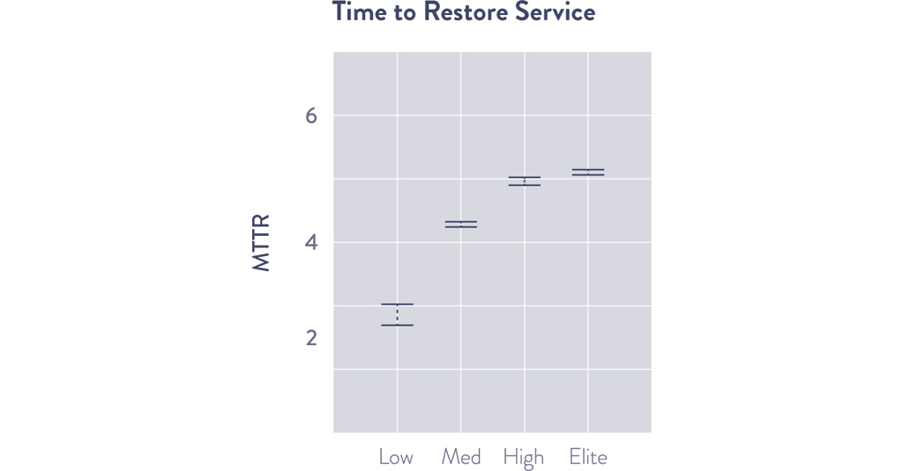
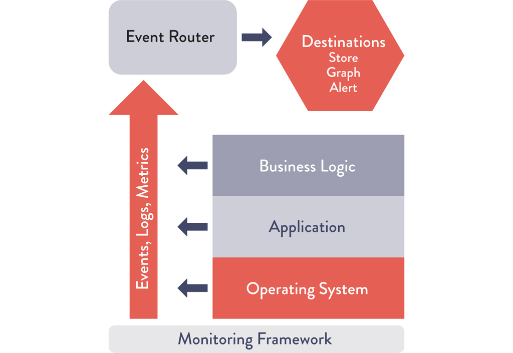
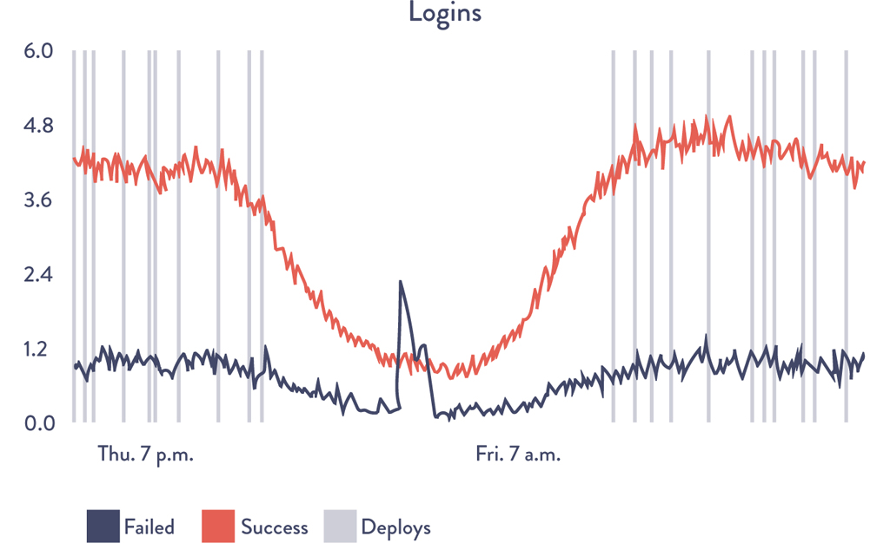
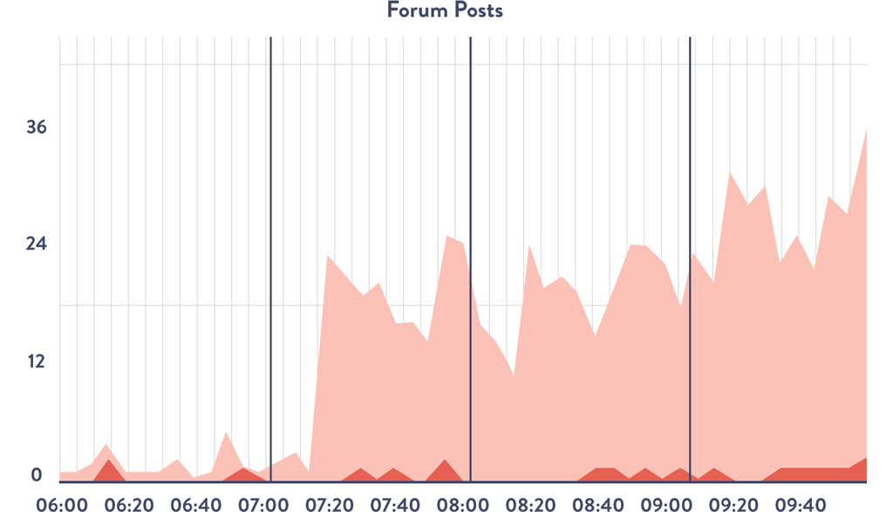

# Chapter 14: Create Telemetry to Enable Seeing and Solving Problems

> **Part IV -- The Technical Practices of Feedback**

This chapter opens the feedback section of the book by establishing the foundational practice that makes all other feedback loops possible: **telemetry**. Without pervasive, centralized, self-service telemetry at every layer of the application stack, organizations are blind -- reduced to rebooting servers and blaming developers when things go wrong. The chapter builds a complete argument, from infrastructure through application logging, problem-solving discipline, self-service metrics, information radiators, and gap analysis, all grounded in real-world case studies from Etsy, LinkedIn, and DORA research. The core thesis is that the best-performing organizations do not merely react to incidents; they build systems that generate enough data to detect, diagnose, and resolve problems before customers even notice -- and they make that data visible to everyone.

## Table of Contents

- [Create Our Centralized Telemetry Infrastructure](#create-our-centralized-telemetry-infrastructure)
- [Create Application Logging Telemetry That Helps Production](#create-application-logging-telemetry-that-helps-production)
- [Use Telemetry to Guide Problem Solving](#use-telemetry-to-guide-problem-solving)
- [Enable Creation of Production Metrics as Part of Daily Work](#enable-creation-of-production-metrics-as-part-of-daily-work)
- [Create Self-Service Access to Telemetry and Information Radiators](#create-self-service-access-to-telemetry-and-information-radiators)
  - [Case Study: Creating Self-Service Metrics at LinkedIn (2011)](#case-study-creating-self-service-metrics-at-linkedin-2011)
- [Find and Fill Any Telemetry Gaps](#find-and-fill-any-telemetry-gaps)
  - [Application and Business Metrics](#application-and-business-metrics)
  - [Infrastructure Metrics](#infrastructure-metrics)
  - [Case Study: Continuous Learning -- DORA 2019](#case-study-continuous-learning--dora-2019)
  - [Overlaying Other Relevant Information Onto Our Metrics](#overlaying-other-relevant-information-onto-our-metrics)
- [Conclusion](#conclusion)
- [How Generative AI Is Reshaping Telemetry and Observability](#how-generative-ai-is-reshaping-telemetry-and-observability)

---

## Case Study: DevOps Transformation at Etsy (2012)

The chapter opens with the Etsy case study, which frames the entire argument for production telemetry. Michael Rembetsy and Patrick McDonnell described how production monitoring was a critical part of Etsy's DevOps transformation that started in 2009. Etsy was standardizing its entire technology stack to the LAMP stack (Linux, Apache, MySQL, and PHP), abandoning a patchwork of different technologies that were increasingly difficult to support.

At the 2012 Velocity Conference, McDonnell described the risk this created:

> "We were changing some of our most critical infrastructure, which, ideally, customers would never notice. However, they'd definitely notice if we screwed something up. We needed more metrics to give us confidence that we weren't actually breaking things while we were doing these big changes, both for our engineering teams and for team members in the nontechnical areas, such as marketing."

McDonnell went on to explain:

> "We started collecting all our server information in a tool called Ganglia, displaying all the information into Graphite, an open-source tool we invested heavily into. We started aggregating metrics together, everything from business metrics to deployments. This is when we modified Graphite with what we called 'our unparalleled and unmatched vertical line technology' that overlaid onto every metric graph when deployments happened. By doing this, we could more quickly see any unintended deployment side effects. We even started putting TV screens all around the office so that everyone could see how our services were performing."

The results were staggering in scale. By enabling developers to add telemetry to their features as part of their daily work, Etsy created enough telemetry to help make deployments safe:

- **By 2011:** Etsy was tracking over **200,000 production metrics** at every layer of the application stack (application features, application health, database, operating system, storage, networking, security, etc.) with the top 30 most important business metrics prominently displayed on their "deploy dashboard."
- **By 2014:** They were tracking over **800,000 metrics**, showing their relentless goal of instrumenting everything and making it easy for engineers to do so.

Ian Malpass, an engineer at Etsy, captured the culture perfectly:

> "If Engineering at Etsy has a religion, it's the Church of Graphs. If it moves, we track it. Sometimes we'll draw a graph of something that isn't moving yet, just in case it decides to make a run for it. . . . Tracking everything is key to moving fast, but the only way to do it is to make tracking anything easy. . . . We enable engineers to track what they need to track, at the drop of a hat, without requiring time-sucking configuration changes or complicated processes."

### DORA Research Context

The chapter anchors Etsy's story with hard data from DORA:

- In the **2015 State of DevOps Report**, high performers resolved production incidents **168 times faster** than their peers, with the median performer having an MTTR measured in **minutes**, while the low performer had an MTTR measured in **days**.
- In DORA's **2019 State of DevOps Report**, elite performers resolved production incidents **2,604 times faster** than their low-performing peers, with the median elite performer having an MTTR measured in **minutes**, while the median low performer had an MTTR measured in **weeks**.


*Source: Forsgren et al., Accelerate: State of DevOps (2019).*

> **[Insight]** The 2,604x gap between elite and low performers is not explained by better engineers or better hardware. It is explained by telemetry. Elite performers know what is happening in their systems at all times. Low performers are blind until something catastrophic enough surfaces through customer complaints. The MTTR gap is a *telemetry* gap more than anything else. When you can see the problem, you can fix it in minutes. When you cannot see it, you spend days figuring out what is even wrong.

---

## Create Our Centralized Telemetry Infrastructure

Operational monitoring and logging is by no means new. Multiple generations of Operations engineers have used and customized monitoring frameworks (e.g., HP OpenView, IBM Tivoli, BMC Patrol/BladeLogic) to ensure the health of production systems. Data was typically collected through agents running on servers or through agent-less monitoring (e.g., SNMP traps or polling-based monitors), with GUI front ends and reporting often augmented through tools such as Crystal Reports.

Similarly, the practices of developing applications with effective logging are not new -- mature logging libraries exist for almost all programming languages. However, for decades the result has been **silos of information**: Development only creates logging events interesting to developers, and Operations only monitors whether environments are up or down. When inopportune events occur, no one can determine why the entire system is not operating as designed or which specific component is failing.

The Microsoft Operations Framework (MOF) study in 2001 found that organizations with the highest service levels rebooted their servers **twenty times less frequently** than average and had **five times fewer "blue screens of death."** High performers used a disciplined approach to solving problems, using production telemetry to understand possible contributing factors -- what Kevin Behr, Gene Kim, and George Spafford called a **"culture of causality"** in *The Visible Ops Handbook*.

To enable this disciplined problem-solving behavior, we need to design our systems so that they are continually creating **telemetry**, widely defined as:

> "an automated communications process by which measurements and other data are collected at remote points and are subsequently transmitted to receiving equipment for monitoring."

The goal is to create telemetry within our applications and environments, both in our production and pre-production environments as well as in our deployment pipeline.

> **[Deep Dive: Telemetry Infrastructure Architecture]**
>
> James Turnbull's *The Art of Monitoring* describes a modern monitoring architecture developed and used by Operations engineers at web-scale companies (Google, Amazon, Facebook). The architecture has two major components:
>
> **1. Data Collection at the Business Logic, Application, and Environments Layer**
>
> At each layer, we create telemetry in the form of events, logs, and metrics:
>
> - **Logs** may be stored in application-specific files on each server (e.g., `/var/log/httpd-error.log`), but preferably all logs are sent to a common service that enables easy centralization, rotation, and deletion. Most operating systems provide this (syslog for Linux, Event Log for Windows, etc.).
> - **Metrics** are gathered at all layers of the application stack. At the OS level, tools like collectd or Ganglia collect CPU, memory, disk, and network usage over time. The Cloud Native Computing Foundation has created the **OpenTelemetry** open standard for metrics and tracing data. Other tools include Apache SkyWalking, AppDynamics, and New Relic.
>
> **2. An Event Router Responsible for Storing Events and Metrics**
>
> This capability enables visualization, trending, alerting, anomaly detection, and so forth. By collecting, storing, and aggregating all telemetry, we enable further analysis and health checks. This is also where configurations related to services are stored and where threshold-based alerting and health checks occur. Examples include **Prometheus**, **Honeycomb**, **Datadog**, and **Sensu**.
>
> **Log-to-Metric Transformation:** Once logs are centralized, they can be transformed into metrics by counting them in the event router. For example, a log event such as `"child pid 14024 exit signal Segmentation fault"` can be counted and summarized as a single segfault metric across the entire production infrastructure. By transforming logs into metrics, statistical operations can be performed on them -- such as anomaly detection to find outliers and variances even earlier in the problem cycle (e.g., alerting if segfaults went from "ten last week" to "thousands in the last hour").
>
> **Deployment Pipeline Telemetry:** In addition to collecting telemetry from production services and environments, we must also collect telemetry from the deployment pipeline -- when automated tests pass or fail, when deployments occur to any environment, and how long builds and tests take to execute. Detecting conditions like "performance test takes twice as long as normal" allows us to find and fix errors before they reach production.
>
> **Self-Service Access:** Everything should be done through self-service APIs, as opposed to requiring people to open up tickets and wait to get reports.


*Source: Turnbull, The Art of Monitoring, Kindle edition, chap. 2.*

Adrian Cockcroft made a critical observation about the reliability requirements of monitoring itself:

> "Monitoring is so important that our monitoring systems need to be more available and scalable than the systems being monitored."

> **[2024+ Context: Modern Telemetry Infrastructure]**
>
> The telemetry infrastructure landscape has been fundamentally reshaped since the book's publication:
>
> - **OpenTelemetry (OTel)** has become the dominant open standard, merging the former OpenTracing and OpenCensus projects. It is now a CNCF graduated project and provides vendor-neutral APIs, SDKs, and the OpenTelemetry Collector for metrics, logs, and traces across all major languages. The "three pillars of observability" (metrics, logs, traces) are unified under a single framework.
> - **Datadog** has emerged as the leading commercial all-in-one observability platform, integrating APM, infrastructure monitoring, log management, real user monitoring (RUM), security monitoring, and CI/CD visibility into a single platform.
> - **Grafana Labs** (Grafana, Loki, Tempo, Mimir) provides an open-source observability stack that has become the de facto standard for organizations preferring self-hosted or hybrid solutions. Grafana Cloud offers a managed version.
> - **Honeycomb** pioneered the concept of **Observability 2.0**, which shifts from the "three pillars" model (where metrics, logs, and traces are separate) to a unified, high-cardinality event-based model. Honeycomb's core argument: traditional monitoring asks "is this metric within threshold?" while observability asks "why is this system behaving this way?" -- a fundamentally different question that requires different tooling.
> - **SRE practices and SLOs** (Service Level Objectives) have matured alongside telemetry. Google's SRE book introduced the concept; tools like **Nobl9**, **Datadog SLOs**, and **Grafana SLO** now provide native SLO tracking that ties telemetry directly to customer-facing reliability promises. The key shift: instead of alerting on every metric threshold, teams define error budgets based on SLOs and only alert when the error budget is being consumed too quickly.
> - **eBPF-based observability** (tools like **Cilium**, **Pixie**, **Groundcover**) provides kernel-level telemetry without requiring application instrumentation -- solving the problem of instrumenting legacy or third-party code.
>
> The fundamental architecture the book describes (data collection + event router + visualization/alerting) remains accurate, but the implementation has shifted from bespoke open-source assemblies to either comprehensive commercial platforms or well-integrated open-source stacks.

---

## Create Application Logging Telemetry That Helps Production

Now that we have a centralized telemetry infrastructure, we must ensure that the applications we build and operate are creating sufficient telemetry. We do this by having Dev and Ops engineers create production telemetry as part of their daily work, for both new and existing services.

Scott Prugh, CTO at CSG, drew a vivid analogy:

> "Every time NASA launches a rocket, it has millions of automated sensors reporting the status of every component of this valuable asset. And yet, we often don't take the same care with software -- we found that creating application and infrastructure telemetry to be one of the highest return investments we've made. In 2014, we created over one billion telemetry events per day, with over one hundred thousand code locations instrumented."

The guiding principle is clear: **every feature should be instrumented.** If it was important enough for an engineer to implement, then it is important enough to generate enough production telemetry to confirm that it is operating as designed and that the desired outcomes are being achieved.

Every member of the value stream uses telemetry differently. Developers may temporarily create more telemetry to diagnose problems on their workstation. Ops engineers use telemetry to diagnose production problems. Infosec and auditors review telemetry to confirm the effectiveness of required controls. Product managers use telemetry to track business outcomes, feature usage, or conversion rates.

> **[Deep Dive: Logging Levels]**
>
> To support these various usage models, different logging levels are used, some of which may also trigger alerts:
>
> | Level | Purpose | Example |
> |---|---|---|
> | **DEBUG** | Anything that happens in the program; most often used during debugging. Often disabled in production but temporarily enabled during troubleshooting. | Variable values, method entry/exit |
> | **INFO** | Actions that are user-driven or system-specific. | `"beginning credit card transaction"` |
> | **WARN** | Conditions that could potentially become an error. These will likely initiate an alert and troubleshooting. | A database call taking longer than a predefined threshold |
> | **ERROR** | Error conditions. | API call failures, internal error conditions |
> | **FATAL** | Conditions that require termination. | A network daemon that cannot bind a network socket |
>
> **Dan North**, a former ThoughtWorks consultant involved in several projects where core continuous delivery concepts took shape, provides the definitive heuristic for choosing between ERROR and WARN:
>
> > "When deciding whether a message should be ERROR or WARN, imagine being woken up at 4 AM. Low printer toner is not an ERROR."
>
> This is deceptively simple but profoundly practical. An ERROR should trigger an alert that might wake someone up. If the condition does not warrant that level of urgency, it is a WARN.

### What to Log

To ensure we have information relevant to the reliable and secure operations of our service, we should ensure that all potentially significant application events generate logging entries. The chapter provides a comprehensive list assembled by **Anton A. Chuvakin**, a research VP at Gartner's GTP Security and Risk Management group:

- Authentication/authorization decisions (including logoff)
- System and data access
- System and application changes (especially privileged changes)
- Data changes, such as adding, editing, or deleting data
- Invalid input (possible malicious injection, threats, etc.)
- Resources (RAM, disk, CPU, bandwidth, or any resource with hard or soft limits)
- Health and availability
- Startups and shutdowns
- Faults and errors
- Circuit breaker trips
- Delays
- Backup success/failure

To make it easier to interpret these log entries, we should create **logging hierarchical categories**, such as for non-functional attributes (e.g., performance, security) and for attributes related to features (e.g., search, ranking).

> **[Deep Dive: Metrics, Logs, and Traces -- The Three Pillars of Observability]**
>
> The chapter uses "telemetry" as an umbrella term, but modern observability practice distinguishes three distinct signal types:
>
> | Signal | What It Is | Strengths | Weaknesses |
> |---|---|---|---|
> | **Metrics** | Numeric measurements aggregated over time (counters, gauges, histograms) | Cheap to store, fast to query, excellent for dashboards and alerting | Low cardinality -- cannot tell you *which* specific request failed |
> | **Logs** | Discrete, timestamped text records of events | Rich context per event, human-readable, good for debugging specific issues | Expensive to store at scale, hard to query across millions of events |
> | **Traces** | Records of a request's journey through distributed services (spans connected by trace IDs) | Show the full path and timing of a request across microservices | Require instrumentation in every service, sampling decisions are complex |
>
> The book's discussion of transforming logs into metrics (counting segfaults) is an example of bridging these signals. Modern OpenTelemetry SDKs generate all three from a single instrumentation point:
>
> ```
> // Conceptual: one instrumentation point, three signals
> span = tracer.start_span("process_payment")     // trace
> meter.counter("payments.processed").add(1)        // metric
> logger.info("Payment processed", {order_id, amount})  // log
> ```
>
> **The Honeycomb/Observability 2.0 argument** challenges the three-pillar model itself: rather than maintaining three separate systems for metrics, logs, and traces, store everything as high-cardinality structured events and query them in any dimension. This eliminates the need to decide in advance which signals to collect and enables exploratory debugging of novel failure modes. Charity Majors, CEO of Honeycomb, summarizes: "Observability is about being able to ask arbitrary new questions of your system without shipping new code."

> **[Insight]** The NASA analogy from Scott Prugh is more than rhetoric. Rockets have millions of sensors because the cost of not knowing what is happening far exceeds the cost of instrumentation. The same is true for software -- but the software industry has been slow to internalize this because software failures usually do not kill people. However, the economic argument is the same: the cost of a production outage (lost revenue, customer trust, engineering time spent firefighting) almost always exceeds the cost of comprehensive instrumentation. The chapter's implicit argument is that *under-instrumentation is a form of technical debt that compounds with interest*.

---

## Use Telemetry to Guide Problem Solving

High performers use a disciplined approach to solving problems. This is in contrast to the more common practice of using **rumor and hearsay**, which can lead to the unfortunate metric of **"mean time until declared innocent"** -- how quickly can we convince everyone else that we did not cause the outage.

When there is a **culture of blame** around outages and problems, groups may avoid documenting changes and displaying telemetry where everyone can see them to avoid being blamed for outages. Other negative outcomes include a highly charged political atmosphere, the need to deflect accusations, and the inability to create institutional knowledge around how incidents occurred and the learnings needed to prevent them from happening again.

In contrast, telemetry enables the **scientific method** for problem resolution:

1. **What evidence do we have** from our monitoring that a problem is actually occurring?
2. **What are the relevant events and changes** in our applications and environments that could have contributed to the problem?
3. **What hypotheses can we formulate** to confirm the link between proposed causes and effects?
4. **How can we prove** which hypotheses are correct and successfully affect a fix?

The value of fact-based problem-solving lies not only in significantly faster MTTR (and better customer outcomes), but also in its reinforcement of the perception of a **win/win relationship between Development and Operations**.

The chapter notes the historical context from *The Visible Ops Handbook*: high-performing organizations recognize that **80% of all outages are caused by change** and **80% of MTTR is spent trying to determine what changed.** This is why overlaying deployment markers on telemetry graphs is so critical -- it immediately narrows the search space.

> **[Insight]** The concept of "mean time until declared innocent" is a devastating critique of blameful incident cultures. In such cultures, telemetry is not seen as a tool for learning but as a weapon for blame. The rational response of teams in that environment is to hide information -- fewer dashboards, less logging, no deployment markers. This is a perverse outcome where the organizational culture *actively degrades* the quality of telemetry, making future incidents harder to diagnose, which leads to more blame, which leads to even less telemetry. It is a death spiral. The chapter's implicit prescription is that telemetry and blamelessness must be adopted together. One without the other is unstable.

---

## Enable Creation of Production Metrics as Part of Daily Work

To enable everyone to find and fix problems in their daily work, we need to make it as easy as possible for anyone in Development or Operations to create telemetry for any functionality they build. In the ideal, **it should be as easy as writing one line of code** to create a new metric that shows up in a common dashboard.

This philosophy guided the development of **StatsD**, one of the most widely used metrics libraries, created and open-sourced at Etsy. John Allspaw described the design rationale:

> "We designed StatsD to prevent any developer from saying, 'It's too much of a hassle to instrument my code.' Now they can do it with one line of code. It was important to us that for a developer, adding production telemetry didn't feel as difficult as doing a database schema change."

StatsD can generate timers and counters with one line of code (in Ruby, Perl, Python, Java, and other languages) and is often used in conjunction with **Graphite** or **Grafana**, which render metric events into graphs and dashboards.

The chapter provides a concrete example: a single line of PHP code --

```php
StatsD::increment("login.successes")
```

-- creates a user login event. The resulting graph shows the number of successful and failed logins per minute, with vertical lines overlaid to represent production deployments.


*Source: Ian Malpass, "Measure Anything, Measure Everything."*

When we generate graphs of our telemetry, we **overlay deployment events** because the significant majority of production issues are caused by production changes, including code deployments. This is part of what allows us to have a high rate of change while still preserving a safe system of work.

More recently, the emergence of the **OpenTelemetry standard** has provided a way for data collectors to communicate with metrics storage and processing systems. There are OpenTelemetry integrations with all major languages, frameworks, and libraries, and most popular metrics and observability tools accept OpenTelemetry data.

> **[2024+ Context: OpenTelemetry and the Modern Instrumentation Stack]**
>
> The StatsD model that the chapter celebrates has largely been superseded by **OpenTelemetry (OTel)**, which provides the same "one line of instrumentation" experience but with far richer semantics:
>
> - **OTel auto-instrumentation** means that for common frameworks (Spring Boot, Express.js, Django, Flask, .NET, Rails), traces and basic metrics are generated automatically with zero code changes -- just add the OTel agent or SDK.
> - **OTel manual instrumentation** follows the StatsD philosophy but generates correlated metrics, logs, and traces from a single point.
> - **OTel Collector** acts as a vendor-neutral telemetry pipeline, receiving data in any format and routing it to any backend (Prometheus, Datadog, Honeycomb, Grafana Tempo, Splunk, etc.).
>
> The practical implication: teams no longer need to choose a monitoring vendor before instrumenting. Instrument once with OTel, and route to any backend later.
>
> **Grafana** has evolved from a visualization layer into a full observability platform. The LGTM stack (Loki for logs, Grafana for visualization, Tempo for traces, Mimir for metrics) provides an open-source alternative to commercial platforms, with Grafana Cloud offering a managed SaaS version.
>
> **SLOs (Service Level Objectives)** connect telemetry to business commitments. Instead of alerting on individual metric thresholds ("CPU > 80%"), modern SRE practice defines SLOs ("99.9% of requests complete in under 200ms") and alerts only when the **error budget** is being consumed faster than expected. This dramatically reduces alert fatigue while ensuring that alerts always represent genuine customer impact.

---

## Create Self-Service Access to Telemetry and Information Radiators

After enabling Development and Operations to create and improve production telemetry, the next goal is to **radiate this information to the rest of the organization**. Anyone who wants information about any running service should be able to get it without needing production system access, privileged accounts, or having to open a ticket and wait for days.

By making telemetry fast, easy to get, and sufficiently centralized, everyone in the value stream can share a **common view of reality**. Production metrics are typically radiated on web pages generated by centralized servers such as Graphite or equivalent technologies.

The chapter emphasizes that production telemetry should be **highly visible**, placed in central areas where Development and Operations work, so everyone interested can see how services are performing. At a minimum, this includes everyone in the value stream: Development, Operations, Product Management, and Infosec. This is often referred to as an **information radiator**, defined by the Agile Alliance as:

> "the generic term for any of a number of handwritten, drawn, printed, or electronic displays which a team places in a highly visible location, so that all team members as well as passers-by can see the latest information at a glance: count of automated tests, velocity, incident reports, continuous integration status, and so on. This idea originated as part of the Toyota Production System."

> **[Deep Dive: Information Radiators]**
>
> Information radiators promote responsibility among team members by actively demonstrating two values:
>
> - **The team has nothing to hide from its visitors** (customers, stakeholders, etc.).
> - **The team has nothing to hide from itself:** it acknowledges and confronts problems.
>
> The chapter advocates extending this transparency outward:
>
> - **Internal customers:** Creating internal service status pages so that other teams can see how the services they depend on are performing.
> - **External customers:** Creating publicly viewable service status pages so that customers can learn how services are performing.
>
> Ernest Mueller describes the value of this transparency:
>
> > "One of the first actions I take when starting in an organization is to use information radiators to communicate issues and detail the changes we are making -- this is usually extremely well-received by our business units, who were often left in the dark before. And for Development and Operations groups who must work together to deliver a service to others, we need that constant communication, information, and feedback."
>
> There may be resistance to providing this transparency, but the chapter argues that broadcasting customer-impacting problems (rather than keeping them secret) demonstrates that the organization values transparency, helping to build and earn customer trust.
>
> **Practical implementation patterns:**
>
> - **TV dashboards** in office common areas (as Etsy famously deployed)
> - **Status pages** (e.g., Atlassian Statuspage, Instatus, Better Uptime) for external customers
> - **Shared Grafana/Datadog dashboards** with open permissions for internal teams
> - **Slack/Teams integrations** that post key metrics and alerts to public channels
> - **Deployment notification channels** that broadcast every production change with links to metrics

> **[Insight]** The concept of information radiators connects directly to the First Way's principle of making work visible (Chapter 2). In Chapter 2, the focus was on making *work items* visible through kanban boards. Here in Chapter 14, the focus is on making *system behavior* visible through telemetry dashboards. Together, they provide two complementary forms of visibility: what we are doing (work) and what is happening as a result (telemetry). An organization that has both can answer both "what are we building?" and "is what we built actually working?" This dual visibility is the foundation for data-driven decision-making at every level.

---

### Case Study: Creating Self-Service Metrics at LinkedIn (2011)

LinkedIn was created in 2003 to help users connect "to your network for better job opportunities." By November 2015, LinkedIn had over 350 million members generating tens of thousands of requests per second, resulting in millions of queries per second on back-end systems.

**Prachi Gupta**, Director of Engineering at LinkedIn, wrote in 2011 about the importance of production telemetry:

> "At LinkedIn, we emphasize making sure the site is up and our members have access to complete site functionality at all times. Fulfilling this commitment requires that we detect and respond to failures and bottlenecks as they start happening. That's why we use these time-series graphs for site monitoring to detect and react to incidents within minutes. . . . This monitoring technique has proven to be a great tool for engineers. It lets us move fast and buys us time to detect, triage, and fix problems."

**The problem (2010):** Even though LinkedIn was generating an incredibly large volume of telemetry, it was extremely difficult for engineers to get access to the data, let alone analyze it.

**The solution -- InGraphs:** This began as **Eric Wong's summer intern project** at LinkedIn. Wong described the pain point:

> "To get something as simple as CPU usage of all the hosts running a particular service, you would need to file a ticket and someone would spend 30 minutes putting [a report] together."

At the time, LinkedIn was using Zenoss to collect metrics. Wong explains: "Getting data from Zenoss required digging through a slow web interface, so I wrote some python scripts to help streamline the process. While there was still manual intervention in setting up metric collection, I was able to cut down the time spent navigating Zenoss' interface."

Over the course of the summer, Wong continued adding functionality to InGraphs:

- Engineers could see exactly what they wanted to see
- Calculations across multiple datasets
- Week-over-week trending to compare historical performance
- Custom dashboards to select exactly which metrics to display on a single page

**The outcome:** Gupta notes an extraordinary result:

> "The effectiveness of our monitoring system was highlighted in an instant where our InGraphs monitoring functionality tied to a major web-mail provider started trending downwards and the provider realized they had a problem in their system only after we reached out to them!"

What started as a summer internship project became one of the most visible parts of LinkedIn operations. InGraphs was so successful that the real-time graphs were featured prominently in the company's engineering offices where visitors could not fail to see them.

**Key takeaway:** Self-service metrics empower problem-solving and decision-making at the individual and team level, and provide necessary transparency to build and earn customers' trust.

> **[Insight]** The LinkedIn case study illustrates a pattern that repeats across the industry: the value of telemetry is often gated not by the availability of data but by the accessibility of data. LinkedIn was generating enormous volumes of telemetry in 2010, but it was locked behind a slow interface that required filing tickets to access. The transformation was not about collecting more data; it was about making existing data self-service. This is a crucial distinction. Many organizations believe their telemetry problem is "we don't collect enough data." More often, the real problem is "we collect plenty of data but nobody can access it without heroic effort." Solving the accessibility problem often delivers more value than solving the collection problem.

---

## Find and Fill Any Telemetry Gaps

With centralized telemetry infrastructure in place and the ability to quickly create production telemetry throughout the application stack, the next step is to identify any gaps that impede the ability to quickly detect and resolve incidents. This is especially relevant if Dev and Ops currently have little (or no) telemetry.

Achieving this requires telemetry at **all levels of the application stack** for all environments, as well as for the deployment pipelines that support them:

| Level | Examples |
|---|---|
| **Business level** | Number of sales transactions, revenue of sales transactions, user sign-ups, churn rate, A/B testing results |
| **Application level** | Transaction times, user response times, application faults |
| **Infrastructure level** (database, OS, networking, storage) | Web server traffic, CPU load, disk usage |
| **Client software level** (JavaScript in browser, mobile app) | Application errors and crashes, user-measured transaction times |
| **Deployment pipeline level** | Build pipeline status (red/green for automated test suites), change deployment lead times, deployment frequencies, test environment promotions, environment status |

By having telemetry coverage at all of these levels, we can see the health of everything our service relies upon, using **data and facts instead of rumors, finger-pointing, blame, and so forth**.

Furthermore, monitoring application and infrastructure faults (abnormal program terminations, application errors and exceptions, server and storage errors) enables detection of **security-relevant events**. These errors are often indicators that a security vulnerability is being actively exploited.

After every production incident, we should identify any **missing telemetry** that could have enabled faster detection and recovery. Better yet, we can identify these gaps during feature development in our peer review process.

---

### Application and Business Metrics

At the application level, the goal is to ensure telemetry is generated not only around application health (memory usage, transaction counts, etc.) but also to measure the extent to which **organizational goals** are being achieved (number of new users, user login events, user session lengths, percent of users active, feature usage frequency, etc.).

For example, for an e-commerce service, we want telemetry around all user events that lead up to a successful revenue-generating transaction. These metrics vary according to domain and organizational goals:

- **E-commerce site:** Maximize time spent on site, increasing likelihood of a sale.
- **Search engines:** Minimize time spent on site, since long sessions may indicate difficulty finding results.

In general, business metrics will be part of a **customer acquisition funnel** -- the theoretical steps a potential customer takes to make a purchase. For an e-commerce site, measurable journey events include total time on site, product link clicks, shopping cart adds, and completed orders.

**Ed Blankenship**, Senior Product Manager for Microsoft Visual Studio Team Services, describes the approach:

> "Often, feature teams will define their goals in an acquisition funnel, with the goal of their feature being used in every customer's daily work. Sometimes they're informally described as 'tire kickers,' 'active users,' 'engaged users,' and 'deeply engaged users,' with telemetry supporting each stage."

The goal is for every business metric to be **actionable**. Metrics that are not actionable are likely **vanity metrics** that provide little useful information -- these should be stored but likely not displayed, let alone alerted on.

Ideally, anyone viewing information radiators should be able to make sense of the information in the context of desired organizational outcomes (revenue, user attainment, conversion rates, etc.). We should define and link each metric to a business outcome metric at the earliest stages of feature definition and development, and measure outcomes after deploying in production.

Further business context can be created by displaying time periods relevant to high-level business planning (peak holiday selling seasons, end-of-quarter financial close, scheduled compliance audits). This serves as a reminder to avoid scheduling risky changes when availability is critical.


*Source: Mike Brittain, "Tracking Every Release," CodeasCraft.com, December 8, 2010.*

> **[Insight]** Figure 14.4 is a fascinating example of telemetry that bridges the gap between engineering activity and business outcomes. By overlaying deployment markers onto a graph of user forum posts, the team can literally see the customer excitement (or frustration) that each deployment creates. This is the kind of telemetry that makes the feedback loop from Chapter 3 (the Second Way) tangible: you deploy, you see the customer reaction, you learn, you adjust. It also demonstrates that telemetry is not purely a technical concern -- the most valuable telemetry often measures human behavior and business outcomes rather than CPU utilization.

---

### Infrastructure Metrics

Just as with application metrics, the goal for production and non-production infrastructure is to generate enough telemetry that if a problem occurs in any environment, we can quickly determine whether infrastructure is a contributing cause and pinpoint exactly what in the infrastructure is contributing (database, operating system, storage, networking, etc.).

As much infrastructure telemetry as possible should be visible across all technology stakeholders, ideally organized by service or application. When something goes wrong in an environment, we need to know exactly what applications and services are being affected.

In decades past, creating links between a service and the production infrastructure it depended on was a manual effort (ITIL CMDBs, configuration definitions in alerting tools like Nagios). Increasingly, these links are now registered automatically within services, dynamically discovered and used in production through tools such as **ZooKeeper, Etcd, Consul, Istio**, etc. These tools enable services to register themselves, storing information that other services need to interact (IP address, port numbers, URIs). This solves the manual nature of the ITIL CMDB and is absolutely necessary when services are made up of hundreds, thousands, or even millions of nodes with dynamically assigned IP addresses.

Graphing business metrics alongside application and infrastructure metrics allows detection of correlated failures. For instance, seeing that new customer sign-ups dropped to 20% of daily norms while database queries take five times longer than normal immediately focuses problem solving.

**Jody Mulkey**, CTO of Ticketmaster/LiveNation, captures the importance of business-oriented metrics:

> "Instead of measuring Operations against the amount of downtime, I find it's much better to measure both Dev and Ops against the real business consequences of downtime: how much revenue should we have attained, but didn't."

---

### Case Study: Continuous Learning -- DORA 2019

DORA's 2019 State of DevOps Report found that **infrastructure monitoring contributed to continuous delivery**. The visibility and fast feedback it provides to all stakeholders is key to helping everyone see the outcomes of build, test, and deployment activities.

In addition to monitoring production services, we also need telemetry for services in **pre-production environments** (development, test, staging, etc.). This enables finding and fixing issues before they go into production, such as detecting ever-increasing database insert times due to a missing table index.

---

### Overlaying Other Relevant Information Onto Our Metrics

Even after creating a deployment pipeline that allows small and frequent production changes, changes still inherently create risk. Operational side effects are not just outages but also significant disruptions and deviations from standard operations.

To make changes visible, we overlay all production deployment activities on our graphs. For a service that handles a large volume of inbound transactions, production changes can result in a significant **settling period** where performance degrades substantially as all cache lookups miss. Understanding how quickly performance returns to normal and taking steps to improve it is critical for quality of service.

Similarly, other useful operational activities should be overlaid -- when the service is under maintenance or being backed up -- in places where we may want to display or suppress alerts.

---

## Conclusion

The improvements enabled by production telemetry from Etsy and LinkedIn show how critical it is to see problems as they occur so we can search out the cause and quickly remedy the situation. By having all elements of our service emitting telemetry -- whether in our application, database, or environment -- and making that telemetry widely available, we can find and fix problems long before they cause something catastrophic, ideally long before a customer even notices something is wrong.

The result is not only happier customers but also, by reducing the amount of firefighting and crises, a happier and more productive workplace with less stress and lower levels of burnout.

> **[Insight]** The chapter's conclusion makes an important but easily overlooked point: telemetry does not just improve technical outcomes (faster MTTR, fewer incidents). It improves *human* outcomes (less stress, less burnout, happier workplace). This is because the worst part of production incidents for engineers is not the technical challenge -- it is the helpless feeling of not knowing what is wrong. Telemetry eliminates that helplessness. When you can see the problem, you feel empowered to fix it. When you are flying blind, every minute of an outage feels like an eternity of dread. The emotional and psychological benefits of comprehensive telemetry are as significant as the technical benefits, and they compound over time by reducing turnover and increasing the attractiveness of the organization to top talent.

---

## How Generative AI Is Reshaping Telemetry and Observability

> **[GenAI + DevOps]** Generative AI is transforming every aspect of the telemetry lifecycle -- from instrumentation to analysis to incident response. Here is a detailed examination of how AI intersects with the practices described in this chapter:

### GenAI and Instrumentation

| Traditional Approach | AI-Enhanced Approach |
|---|---|
| Developer manually adds logging/metrics code | AI auto-suggests instrumentation points based on code analysis (e.g., "this function handles payments but has no error logging") |
| Choosing logging levels requires judgment | AI recommends logging levels based on patterns in similar services |
| Missing telemetry discovered only during incidents | AI scans codebase for instrumentation gaps and flags them in code review |

**Emerging capabilities:**
- **GitHub Copilot and Cursor** can generate OpenTelemetry instrumentation code inline, including span creation, metric counters, and structured log statements.
- **Amazon CodeGuru Profiler** automatically identifies under-instrumented code paths and suggests improvements.

### GenAI and Anomaly Detection / Alerting

Traditional threshold-based alerting ("alert if CPU > 80%") produces enormous volumes of false positives and misses novel failure modes. AI-powered anomaly detection is transforming this:

- **Datadog Watchdog** uses unsupervised ML to automatically detect anomalies across all telemetry without manual threshold configuration.
- **Dynatrace Davis AI** performs automatic root cause analysis by correlating anomalies across metrics, logs, and traces.
- **New Relic AI** and **Splunk ITSI** use ML to reduce alert noise by clustering related alerts and surfacing the most likely root cause.
- **PagerDuty AIOps** correlates alerts across multiple monitoring tools to reduce alert fatigue and accelerate triage.

### GenAI and Incident Response

AI is compressing the incident lifecycle -- from detection through diagnosis to resolution:

- **AI-generated incident summaries:** Tools like PagerDuty, Rootly, and incident.io use LLMs to synthesize logs, metrics, and traces into human-readable incident summaries.
- **AI-assisted root cause analysis:** Given a set of correlated signals, LLMs can hypothesize likely root causes and suggest investigation paths -- essentially automating the "scientific method" the chapter describes.
- **AI-drafted postmortems:** After an incident is resolved, AI can draft initial postmortem documents from timeline data, chat transcripts, and telemetry data, freeing engineers to focus on analysis and action items rather than documentation.
- **Natural language querying of telemetry:** Instead of writing PromQL, LogQL, or SPL queries, engineers can ask questions in natural language ("Show me the p99 latency for the payment service over the last hour, broken down by region") and get results. Honeycomb, Datadog, and Grafana all now offer some form of natural language query interface.

### GenAI and the "Culture of Causality"

The chapter describes how high-performing organizations cultivate a "culture of causality" -- using data to understand what happened rather than resorting to blame. GenAI amplifies this culture by:

- Making telemetry data more accessible to non-experts (natural language interfaces)
- Reducing the skill barrier for complex analysis (AI explains query results)
- Accelerating hypothesis generation during incidents (AI suggests "this looks similar to the incident on March 15 where a database migration caused connection pool exhaustion")
- Creating institutional memory by indexing past incidents and making them searchable with semantic understanding

### The Risk: AI Hallucination in High-Stakes Telemetry

A critical caution: AI-generated analysis of production telemetry can be wrong. When an LLM hypothesizes a root cause during an incident, that hypothesis may be a hallucination. Teams must maintain the discipline of the scientific method the chapter describes -- hypotheses (whether human-generated or AI-generated) must be verified against evidence before acting on them. AI should be treated as a highly capable junior engineer: its suggestions are valuable starting points, not authoritative conclusions.

### Further Reading

- [OpenTelemetry Documentation](https://opentelemetry.io/docs/) -- the definitive guide to the modern telemetry standard
- [Observability Engineering by Charity Majors, Liz Fong-Jones, and George Miranda](https://info.honeycomb.io/observability-engineering-oreilly-book-2022) -- the book that defines Observability 2.0
- [Google SRE Book -- Monitoring Distributed Systems](https://sre.google/sre-book/monitoring-distributed-systems/) -- Google's foundational practices for telemetry and alerting
- [Datadog Learning Center](https://learn.datadoghq.com/) -- free courses on modern observability practices
- [Grafana Tutorials](https://grafana.com/tutorials/) -- hands-on guides for the open-source observability stack
- [Honeycomb Blog](https://www.honeycomb.io/blog) -- thought leadership on high-cardinality observability and AI-assisted debugging
- [DORA Research Program](https://dora.dev/) -- ongoing research connecting telemetry practices to organizational performance
- [Site Reliability Engineering by Betsy Beyer et al.](https://sre.google/sre-book/table-of-contents/) -- the original SRE handbook with deep treatment of monitoring, alerting, and SLOs
