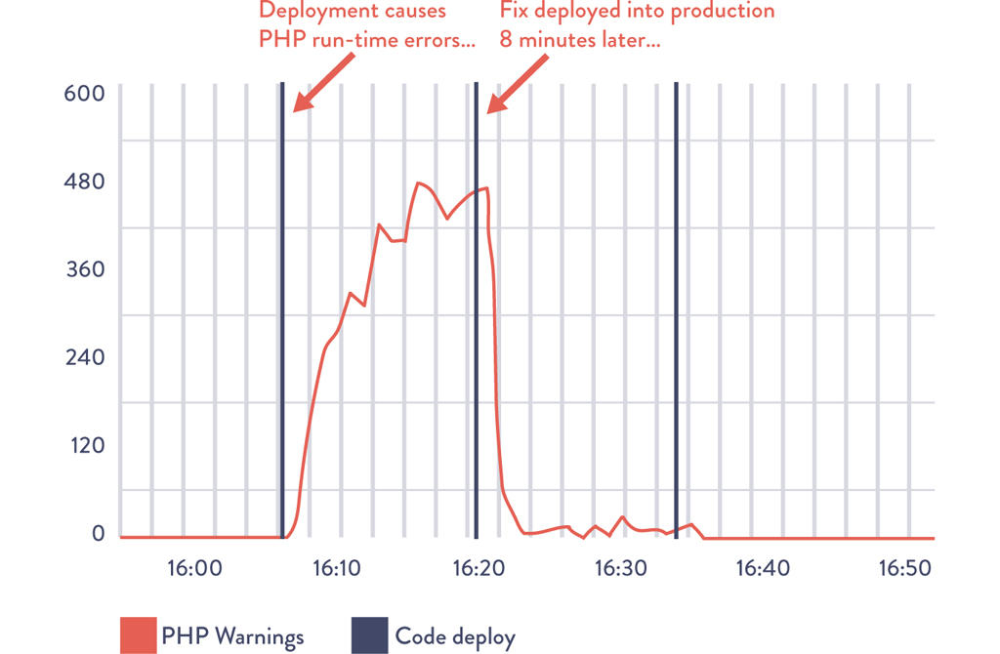
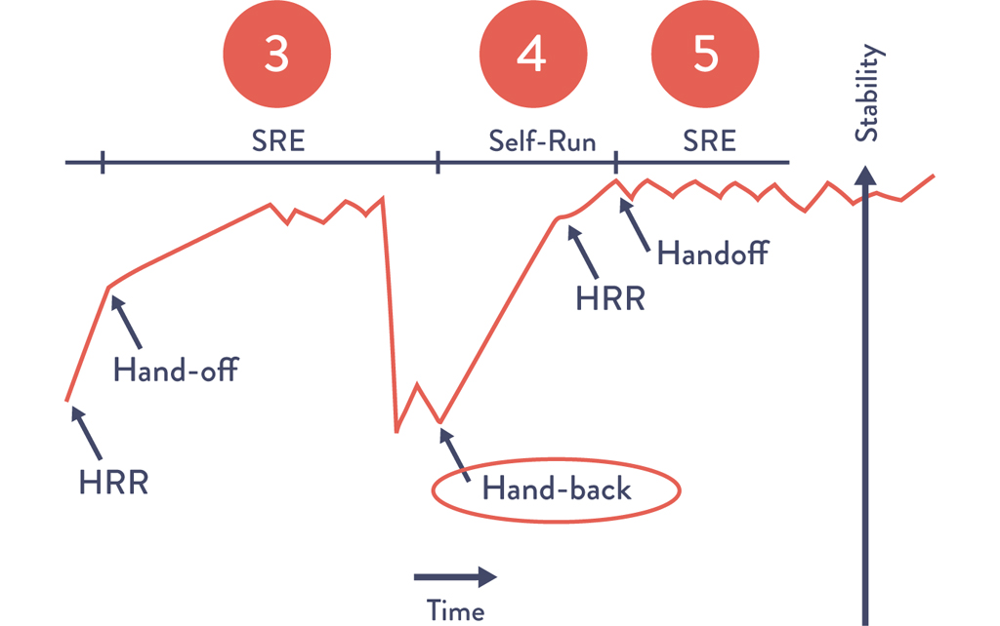
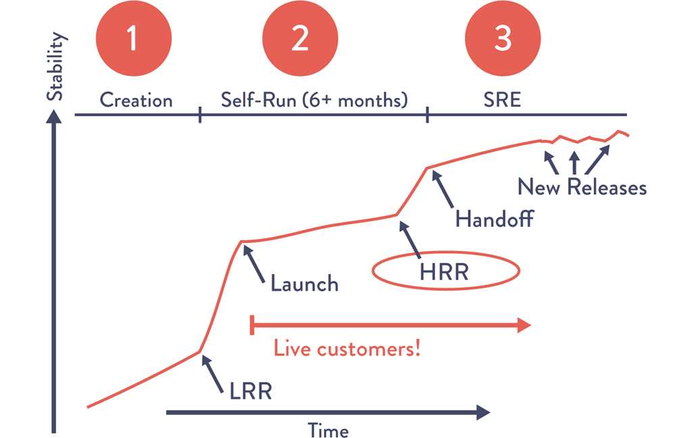

# Chapter 16: Enable Feedback So Development and Operations Can Safely Deploy Code

> **Part IV — The Technical Practices of Feedback**

This chapter addresses the critical feedback mechanisms that make production deployments safe and routine rather than terrifying and risky. It opens with the Right Media story — a company where both Dev and Ops were initially paralyzed by the fear of deploying code — and traces the progression from fear to confidence through production telemetry, shared pager rotation, downstream observation, and self-managed services. The chapter establishes that deployment is never "done" until the code is operating as designed in production, and that the feedback loops created here are the foundation for everything that follows in Part IV. The Google SRE launch readiness review (LRR) and handoff readiness review (HRR) case study demonstrates how a functional Ops organization can scale these feedback mechanisms across thousands of services.

## Table of Contents

- [The Right Media Story: From Fear to Confidence](#the-right-media-story-from-fear-to-confidence)
- [Use Telemetry to Make Deployments Safer](#use-telemetry-to-make-deployments-safer)
- [Dev Shares Pager Rotation Duties with Ops](#dev-shares-pager-rotation-duties-with-ops)
- [Have Developers Follow Work Downstream](#have-developers-follow-work-downstream)
- [Have Developers Initially Self-Manage Their Production Service](#have-developers-initially-self-manage-their-production-service)
  - [Launch Guidance and Requirements](#launch-guidance-and-requirements)
  - [Regulatory and Compliance Considerations](#regulatory-and-compliance-considerations)
  - [The Service Handback Mechanism](#the-service-handback-mechanism)
  - [Case Study: The Launch and Handoff Readiness Review at Google (2010)](#case-study-the-launch-and-handoff-readiness-review-at-google-2010)
- [Conclusion](#conclusion)
- [How Generative AI Is Reshaping Feedback for Safe Deployment](#how-generative-ai-is-reshaping-feedback-for-safe-deployment)

---

## The Right Media Story: From Fear to Confidence

**Context:** In 2006, Nick Galbreath was VP of Engineering at Right Media, an online advertising platform serving over ten billion impressions daily. The competitive landscape demanded the ability to respond to market conditions within minutes, which meant Development had to deploy code changes into production as fast as possible.

**The key irony:** Dev often complains about Ops being afraid to deploy code. But at Right Media, when developers were given the power to deploy their own code, they became just as afraid of performing deployments. This fear was shared by both Dev and Ops.

**Galbreath's observed progression** — a pattern he saw repeated across many teams:

1. **Paralysis stage:** No one in Dev or Ops is willing to push the "deploy code" button, despite having a fully automated deployment process. The fear of being the first person to bring production systems down is paralyzing.
2. **First brave volunteer:** Someone pushes their code into production. Inevitably, due to incorrect assumptions or production subtleties, the first deployment does not go smoothly. Because there is not enough production telemetry, the team only finds out about problems when customers report them.
3. **Telemetry awakening:** The team urgently fixes the code and pushes it to production again — but this time with more production telemetry added to applications and the environment. Now they can confirm that the fix restored service correctly and can detect this type of problem before a customer tells them next time.
4. **Growing confidence:** More developers start pushing their own code to production. They still break things (complex systems guarantee this), but now they can quickly see what functionality broke and quickly decide whether to roll back or fix forward. This is celebrated as a huge victory.
5. **Proactive improvement:** Developers proactively seek more peer reviews. Everyone helps write better automated tests to catch errors before deployment. Developers start checking ever-smaller increments of code more frequently into the deployment pipeline.
6. **Virtuous cycle:** The team is deploying code more frequently than ever, and service stability is better than ever too.

> "We have rediscovered that the secret to smooth and continuous flow is making small, frequent changes that anyone can inspect and easily understand." — Nick Galbreath

**The security bonus:** As the person also responsible for security, Galbreath noted:

> "It's reassuring to know that we can deploy fixes into production quickly, because changes are going into production throughout the entire day. Furthermore, it always amazes me how interested every engineer becomes in security when you find problems in their code that they are responsible for and that they can quickly fix themselves."

**The key takeaway:** It is not enough to merely automate the deployment process. We must also integrate the monitoring of production telemetry into our deployment work and establish the cultural norm that everyone is equally responsible for the health of the entire value stream.

> **[Deep Dive: The Right Media Progression as a Maturity Model]**
>
> Galbreath's progression is one of the most practical deployment maturity models in the book, and it maps cleanly to specific technical capabilities:
>
> | Stage | Technical Capability Required | Cultural Shift |
> |-------|------------------------------|----------------|
> | Paralysis | Automated deployment exists but unused | Fear dominates; no one owns deployment |
> | First deployment | Deployment automation | One brave person breaks the ice |
> | Telemetry awakening | Application and infrastructure monitoring | Team learns that visibility = safety |
> | Growing confidence | Dashboards, rollback/fix-forward capability | Team celebrates recovery, not perfection |
> | Proactive improvement | Peer review, automated testing | Quality shifts left; batch sizes shrink |
> | Virtuous cycle | Full CI/CD with telemetry | Deployment becomes routine, boring, safe |
>
> Most organizations stall at stages 1-2 because they invest in deployment automation without investing in telemetry. The automation gets them to the point of being able to deploy, but without telemetry, each deployment remains a leap of faith. The critical unlock is stage 3: when you can see what is happening in production in real-time, fear transforms into informed decision-making.

> **[Insight]** The Right Media story demolishes one of the most persistent myths in technology organizations: that Dev wants to deploy fast and Ops is the bottleneck. In reality, deployment fear is universal. When developers are given the responsibility (and consequences) of deploying their own code, they experience the same anxiety Ops has always felt. The solution is not to give one side more courage — it is to give both sides better information through telemetry, smaller changes through batch size reduction, and faster recovery through automated rollback. Fear is rational in the absence of feedback; confidence is rational in its presence.

> **[2024+ Context]** The Right Media progression mirrors what the industry now calls "progressive delivery" — a term coined by James Governor of RedMonk in 2018. Modern progressive delivery platforms (LaunchDarkly, Split.io, Harness, Flagsmith) formalize this progression by combining feature flags, canary releases, and automated rollback with real-time telemetry. The key evolution since 2006 is that this is no longer a bespoke, team-by-team journey — it is a purchasable platform capability. Organizations adopting progressive delivery report 50-70% reductions in deployment-related incidents (LaunchDarkly 2023 report). The emotional progression Galbreath describes — from fear to confidence — is now systematically engineered rather than organically discovered.

---

## Use Telemetry to Make Deployments Safer

The first step is ensuring that production telemetry is actively monitored whenever anyone performs a production deployment. This allows whoever is doing the deployment — Dev or Ops — to quickly determine whether features are operating as designed after the new release is running in production.

**The core principle:** We should never consider our code deployment or production change to be "done" until it is operating as designed in the production environment.

**What to do during deployment:**
- Actively monitor the metrics associated with the feature during deployment
- Ensure we have not inadvertently broken our service — or worse, broken another service
- If our change breaks or impairs any functionality, quickly work to restore service, bringing in whoever else is required to diagnose and fix the issue

**Recovery options when something goes wrong:**
1. **Feature toggles** — Turn off broken features (often the easiest and least risky option since it involves no deployments to production)
2. **Fix forward** — Make code changes to fix the defect, pushed through the deployment pipeline
3. **Roll back** — Switch back to the previous release using feature toggles, or by taking broken servers out of rotation using blue-green or canary release patterns

**The DevOps maxim:** By using these approaches and the required architecture, we "optimize for MTTR, instead of MTBF" — optimizing for recovering from failures quickly, as opposed to attempting to prevent all failures.

*Source: Mike Brittain, "Tracking Every Release."*

**The Etsy example:** Figure 16.1 shows a deployment of a PHP code change at Etsy that generated a spike in PHP runtime warnings. The developer quickly noticed the problem within minutes and generated a fix and deployed it into production, resolving the issue in less than ten minutes.

**Overlay deployment events on metric graphs:** Because production deployments are one of the top causes of production issues, each deployment and change event should be overlaid onto metric graphs. This ensures that everyone in the value stream is aware of relevant activity, enabling better communication and coordination, as well as faster detection and recovery.

> **[Deep Dive: The Three Recovery Strategies Compared]**
>
> Each recovery strategy has different risk profiles and is appropriate in different contexts:
>
> | Strategy | Speed | Risk | When to Use |
> |----------|-------|------|-------------|
> | **Feature toggle off** | Seconds | Lowest | Feature is flag-guarded; disabling it has no side effects on other features |
> | **Roll back** | Minutes | Low-Medium | Previous version is known-good; database schema has not changed; no backward-incompatible API changes |
> | **Fix forward** | Minutes-Hours | Medium-High | Rollback is impossible (schema migration already applied); the fix is simple and well-understood |
>
> The key insight is that **the safest recovery option should be decided before deployment, not during an incident.** Teams should have a pre-deployment checklist that includes: "If this deployment fails, our recovery plan is X." Feature toggles are the default because they require no deployment and can be executed by anyone. Roll back is the fallback when toggles are not available. Fix forward is the option of last resort, appropriate only when the team has high confidence in the fix and automated testing to validate it quickly.
>
> Etsy's ten-minute resolution in Figure 16.1 was possible because the developer (a) was watching telemetry during deployment, (b) immediately saw the PHP warning spike, (c) had a fast deployment pipeline to push the fix, and (d) could confirm the fix worked via the same telemetry. Remove any one of these four capabilities and the ten-minute resolution becomes a multi-hour incident.

> **[Insight]** The practice of overlaying deployment events on metric graphs is deceptively simple but profoundly impactful. Without this overlay, when a metric anomaly appears, the first question in any incident is "did something change?" — and answering it requires checking deployment logs, asking in chat rooms, and hunting through change records. With the overlay, the correlation between "deployment at 2:14 PM" and "error rate spike at 2:15 PM" is visually obvious and immediate. This single practice can cut Mean Time to Detect (MTTD) by 50% or more because it eliminates the investigation step of "what changed?" The deployment marker on the graph answers it instantly.

> **[2024+ Context]** Modern observability platforms have made deployment-correlated telemetry a standard feature. Datadog's "Deployment Tracking," Grafana's annotations API, New Relic's "Deployments" view, and Honeycomb's "markers" all provide this overlay capability out of the box. The next evolution is **automated deployment correlation** — tools like Sleuth, LinearB, and Faros AI that automatically detect deployment events, correlate them with metric changes, and proactively alert when a deployment appears to have caused a regression. Some platforms now use ML-based change point detection to automatically flag "this deployment caused a 15% increase in p99 latency" without any human needing to watch dashboards in real-time. The Etsy practice from 2012 is now a commodity feature — but the principle that deployment is not done until telemetry confirms success remains the essential insight.

---

## Dev Shares Pager Rotation Duties with Ops

Even when production deployments go flawlessly, complex services will still have unexpected problems — incidents and outages at inopportune times (every night at 2 AM). Left unfixed, these cause recurring problems and suffering for Ops engineers downstream, especially when the problems are not made visible to the upstream engineers who created them.

**The systemic problem:** Even if a production problem results in a defect being assigned to the feature team, it may be prioritized below new features. The problem keeps recurring for weeks, months, or even years, causing continual chaos and disruption in Operations. This is upstream work centers locally optimizing for themselves while degrading performance for the entire value stream.

**The solution:** Put developers, development managers, and architects on pager rotation. This is exactly what Pedro Canahuati, Facebook Director of Production Engineering, did in 2009. This ensures everyone in the value stream gets visceral feedback on upstream architectural and coding decisions they make.

> "We found that when we woke up developers at 2 AM, defects were fixed faster than ever." — Patrick Lightbody, SVP of Product Management at New Relic (2011)

**The cultural shift:** Operations no longer struggles, isolated and alone, with code-related production issues. Instead, everyone helps find the proper balance between fixing production defects and developing new functionality, regardless of where they reside in the value stream.

**A critical side effect:** Shared pager rotation helps Development management see that business goals are not achieved simply because features have been marked as "done." The feature is only done when it is performing as designed in production, without causing excessive escalations or unplanned work for either Development or Operations.

> ITIL defines warranty as when a service can run in production reliably without intervention for a predefined period of time (e.g., two weeks). This definition of warranty should ideally be integrated into the collective definition of "done."

**Universally applicable:** This practice applies equally to market-oriented teams (responsible for both developing the feature and running it in production) and functionally oriented teams. As Arup Chakrabarti, Operations Engineering Manager at PagerDuty, observed in 2014:

> "It's becoming less and less common for companies to have dedicated on-call teams; instead, everyone who touches production code and environments is expected to be reachable in the event of downtime."

**The underlying principle:** When developers get feedback on how their applications perform in production — including fixing them when they break — they become closer to the customer. This creates buy-in that everyone in the value stream benefits from.

> **[Deep Dive: Implementing Shared Pager Rotation Effectively]**
>
> Shared pager rotation is one of those practices that sounds simple but fails spectacularly if implemented poorly. Key considerations:
>
> **What works:**
> - **Gradual onboarding:** Start developers with "shadow on-call" where they observe an experienced Ops engineer handle incidents before taking primary responsibility
> - **Runbooks:** Provide clear, step-by-step runbooks for known failure modes so on-call developers are not starting from zero
> - **Escalation paths:** Define clear escalation paths so a developer on call at 2 AM knows exactly who to contact if they cannot resolve an issue
> - **Rotation fairness:** Ensure rotations are equitable across teams and individuals; burnout from unbalanced rotations defeats the purpose
> - **Post-incident follow-through:** Ensure that issues discovered during on-call shifts are tracked and prioritized, not just patched and forgotten
>
> **What fails:**
> - **Throwing developers into on-call without training or documentation** — this creates resentment, not empathy
> - **Making on-call a punishment** — if on-call is perceived as a burden rather than a learning opportunity, it breeds toxicity
> - **No authority to fix root causes** — if developers experience production pain but are told to keep shipping features instead of fixing the underlying issues, the feedback loop is broken
> - **No compensation or time-off** — on-call work outside business hours should be recognized and compensated
>
> The Facebook model works because it is part of a broader culture where production health is a first-class concern, not an afterthought. The pager rotation is a mechanism, but the culture is the enabler.

> **[Insight]** The Lightbody quote ("when we woke up developers at 2 AM, defects were fixed faster than ever") reveals a fundamental truth about human motivation: people optimize for what they personally experience. When developers never feel the pain of a 2 AM page, production stability is an abstract concern that loses every prioritization battle against new features. When they do feel it, stability becomes viscerally important and gets fixed. This is not about punishment — it is about closing the feedback loop. The same principle applies in reverse: when Ops engineers participate in sprint planning and understand the business pressure to ship features, they become more empathetic to the trade-offs Dev faces. Shared responsibility creates shared understanding.

> **[2024+ Context]** The "you build it, you run it" philosophy has become the industry standard, formalized through the "full-service ownership" model popularized by Amazon and codified in the Team Topologies framework as a characteristic of stream-aligned teams. Modern on-call management platforms (PagerDuty, Opsgenie, Rootly, Incident.io, FireHydrant) have made shared rotation operationally easier with features like automatic escalation, on-call scheduling, incident timelines, and post-incident review workflows. The DORA 2023 report found that teams practicing full-service ownership had 30% better change failure rates and 40% better MTTR compared to teams with separate on-call groups. However, the industry has also learned that "you build it, you run it" without guardrails leads to burnout — leading to the emerging practice of "sustainable on-call" with explicit limits on page volume, mandatory post-on-call rest days, and "toil budgets" that cap the percentage of time spent on operational work (Google's SRE model recommends no more than 50% operational work).

---

## Have Developers Follow Work Downstream

One of the most powerful techniques in interaction and user experience design (UX) is **contextual inquiry** — when the product team watches a customer use the application in their natural environment, often working at their desk. Doing so often uncovers startling ways that customers struggle with the application: requiring scores of clicks to perform simple tasks, cutting and pasting text from multiple screens, or writing down notes on paper. These are all examples of compensatory behaviors and workarounds for usability issues.

**The developer reaction:** The most common reaction for developers after participating in a customer observation is dismay, often stating, "How awful it was seeing the many ways we have been inflicting pain on our customers." These observations almost always result in significant learning and a fervent desire to improve.

**Applying it internally:** The goal is to use this same technique to observe how our work affects our internal customers. Developers should follow their work downstream to see how downstream work centers interact with their product to get it running in production.

**What developers gain:** By seeing customer difficulties firsthand, they make better and more informed decisions in their daily work. This creates feedback on the non-functional aspects of the code — all the elements not related to the customer-facing feature — and identifies ways to improve deployability, manageability, operability, and so on.

**Specific improvements discovered by following work downstream include:**
- Automating complex, manual steps (e.g., pairing application server clusters that require six hours)
- Performing packaging of code once instead of creating it multiple times at different stages
- Working with testers to automate manual test suites (removing a common bottleneck for more frequent deployment)
- Creating more useful documentation instead of having someone decipher developer application notes

**Gene Kim's personal story:**

> "One of the worst moments of my professional career was in 2006 when I spent an entire morning watching one of our customers use our product. I was watching him perform an operation that we expected customers to do weekly, and, to our extreme horror, we discovered that it required sixty-three clicks. This person kept apologizing, saying things like, 'Sorry, there's probably a better way to do this.' Unfortunately, there wasn't a better way to do that operation. Another customer described how initial product setup took 1,300 steps. Suddenly, I understood why the job of managing our product was always assigned to the newest engineer on the team — no one wanted the job of running our product. That was one of the reasons I helped create the UX practice at my company, to help atone for the pain we were inflicting on our customers." — Gene Kim

**UX design and the value stream:** UX design enables the creation of quality at the source and results in far greater empathy for fellow team members in the value stream. Ideally, UX design helps create codified non-functional requirements added to the shared backlog of work, eventually allowing proactive integration into every service built.

> Jeff Sussna's concept of "digital conversations" further codifies how to achieve UX goals by helping organizations understand the customer journey as a complex system. Key concepts include: designing for service (not software), minimizing latency and maximizing strength of feedback, designing for failure and operating to learn, using Operations as an input to design, and seeking empathy.

> **[Deep Dive: Contextual Inquiry Applied to Internal Operations]**
>
> The chapter draws a direct parallel between external UX observation and internal operational observation. Here is what this looks like in practice:
>
> | External UX Observation | Internal Ops Observation |
> |------------------------|------------------------|
> | Watch a customer struggle with 63 clicks to complete a task | Watch an Ops engineer spend 6 hours manually pairing application server clusters |
> | Discover customers are copying/pasting between screens | Discover Ops engineers are manually copying config files between environments |
> | Learn that initial setup takes 1,300 steps | Learn that deploying a new service requires a 47-step manual runbook |
> | Create UX improvements that reduce customer friction | Create automation, self-service tools, and better documentation that reduce Ops friction |
>
> The emotional impact is the same in both cases: developers are shocked and dismayed when they see the pain they have caused. This emotional response is the catalyst for change — it transforms abstract "non-functional requirements" into visceral, personal motivation. A developer who has watched an Ops engineer spend six hours on a task that could be automated will never again deprioritize that automation work.
>
> **How to implement:** Schedule "deployment observation days" where developers sit with Ops engineers during actual deployments of their code. Have them take notes on every manual step, every workaround, every moment of confusion. Then use those notes to create a prioritized backlog of operability improvements. Repeat quarterly.

> **[Insight]** The 63-clicks story and the 1,300-step setup story are powerful because they illustrate a blind spot that is nearly universal in software development: the people who build a system rarely experience what it is like to operate or use that system day-to-day. Developers interact with their code through an IDE; operators interact with it through deployment scripts and monitoring dashboards; customers interact with it through a UI. These are fundamentally different experiences, and without deliberately crossing those boundaries, each group develops a distorted picture of the system. Following work downstream is the DevOps equivalent of "management by walking around" — it replaces assumptions with observations.

---

## Have Developers Initially Self-Manage Their Production Service

Even when developers are writing and running their code in production-like environments in their daily work, Operations may still experience disastrous production releases because it is the first time anyone actually sees how the code behaves during a release and under true production conditions. Operational learnings often happen too late in the software life cycle.

**The anonymous Ops engineer's lament:**

> "In our group, most system administrators lasted only six months. Things were always breaking in production, the hours were insane, and application deployments were painful beyond belief — the worst part was pairing the application server clusters, which would take us six hours. During each moment, we all felt like the developers personally hated us."

**The Google model:** One potential countermeasure is to do what Google does: have Development groups self-manage their services in production to prove they are stable before they become eligible for an SRE team to manage. By having developers responsible for deployment and production support, the transition to Operations becomes far smoother.

**Preventing organizational risk:** To prevent problematic self-managed services from going into production and creating organizational risk, define launch requirements that must be met before services interact with real customers and are exposed to real production traffic. Ops engineers should act as consultants to help product teams make their services production-ready.

### Launch Guidance and Requirements

Launch guidance helps ensure that every product team benefits from the cumulative and collective experience of the entire organization, especially Operations. Requirements include:

- **Defect counts and severity:** Does the application actually perform as designed?
- **Type/frequency of pager alerts:** Is the application generating an unsupportable number of alerts in production?
- **Monitoring coverage:** Is the coverage of monitoring sufficient to restore service when things go wrong?
- **System architecture:** Is the service loosely coupled enough to support a high rate of changes and deployments in production?
- **Deployment process:** Is there a predictable, deterministic, and sufficiently automated process to deploy code into production?
- **Production hygiene:** Is there evidence of enough good production habits that would allow production support to be managed by anyone else?

**How this differs from traditional checklists:** These requirements specifically mandate effective monitoring, reliable and deterministic deployments, and architecture built to support fast and frequent deployments. If any deficiencies are found, the assigned Ops engineer should help the feature team resolve the issues or even help re-engineer the service.

### Regulatory and Compliance Considerations

At this time, we should also learn whether the service is subject to any regulatory compliance objectives:

- **Revenue significance:** If it generates more than 5% of total revenue of a publicly held US corporation, it is a "significant account" and in scope for SOX Section 404 compliance
- **Availability risk:** Does the service have high user traffic or high outage/impairment costs?
- **Data sensitivity:** Does the service store payment cardholder information (credit card numbers) or personally identifiable information (Social Security numbers, patient care records)?
- **Other regulatory requirements:** US export regulations, PCI-DSS, HIPAA, and so forth

This information ensures effective management of not only the technical risks but also security and compliance risks, providing essential input into the design of the production control environment.

### The Service Handback Mechanism

*Source: "SRE@Google: Thousands of DevOps Since 2004," YouTube video, 45:57, posted by USENIX, January 12, 2012.*

For services already in production, a different mechanism ensures that Operations is never stuck with an unsupportable service. This is the **service handback** — when a production service becomes sufficiently fragile, Operations has the ability to return production support responsibility back to Development.

When a service goes back into a developer-managed state, the role of Operations shifts from production support to consultation, helping the team make the service production-ready again.

**Why this matters:** The handback serves as a pressure escape valve, ensuring that Operations is never trapped managing a fragile service while ever-increasing technical debt buries them and amplifies a local problem into a global problem. It also ensures Operations has enough capacity to work on improvement work and preventive projects.

> **[Deep Dive: The Economics of the Service Handback]**
>
> The service handback is one of the most elegant organizational mechanisms in the book because it creates a natural market for operational quality:
>
> - **Without handback:** Dev ships code with poor operability. Ops absorbs the pain. Dev has no incentive to improve because they never feel the consequences. Ops becomes increasingly overloaded, quality degrades further, and a vicious cycle ensues.
> - **With handback:** Dev ships code with poor operability. Ops absorbs the pain temporarily, then hands the service back. Dev now feels the consequences directly — they are paged at 2 AM, they spend time on incident response instead of features, they experience the operational burden firsthand. This creates a powerful incentive to invest in operability before requesting Ops support again.
>
> The handback mechanism works because it aligns incentives. It makes the cost of poor operability visible and felt by the people who can fix it (the developers who wrote the code), rather than externalized to people who can only work around it (the operators).
>
> In organizations with project-based funding, there may be no developers to hand the service back to (the team has been disbanded or lacks budget). Potential countermeasures include: holding an improvement blitz, temporarily funding improvement efforts, or retiring the service.

> **[Insight]** The handback mechanism is perhaps one of the best demonstrations of mutual respect between Dev and Ops engineers at Google. It communicates two things simultaneously: (1) Ops respects Dev enough to support their services when they are well-built, and (2) Dev respects Ops enough to accept responsibility when their services are not. Without the handback, the relationship devolves into a one-way dumping ground where Dev throws code over the wall and Ops suffers in silence. The handback makes the relationship transactional and transparent: "We will support your service if and only if it meets these standards." This is not adversarial — it is honest.

### Case Study: The Launch and Handoff Readiness Review at Google (2010)

**Background:** Google has a functional orientation for their Ops engineers, referred to as "site reliability engineers" (SRE), a term coined by Ben Treynor Sloss in 2004. Treynor Sloss started with a staff of seven SREs that grew to over 1,200 SREs by 2014.

> "If Google ever goes down, it's my fault." — Ben Treynor Sloss

> Treynor Sloss has resisted creating a single-sentence definition of what SREs are, but he once described SREs as "what happens when a software engineer is tasked with what used to be called operations."

**Organizational structure:**
- Every SRE reports to Treynor Sloss's organization (ensuring consistency of quality staffing and hiring)
- SREs are embedded into product teams across Google (which also provide their funding)
- SREs are scarce and assigned only to product teams of the highest importance or those with regulatory requirements
- Products that do not meet the criteria remain in a developer-managed state
- Even when products become important enough for an SRE, developers must have self-managed their service in production for at least six months before eligibility

**Two safety checks for critical release stages:**

| Review | When Performed | Purpose | Stringency |
|--------|---------------|---------|------------|
| **Launch Readiness Review (LRR)** | Before any new Google service is made publicly available to customers and receives live production traffic | Ensure the service can safely handle real customers | Self-reported by product teams; baseline standards |
| **Handoff Readiness Review (HRR)** | When the service transitions to an Ops/SRE-managed state (usually months after LRR) | Ensure the service is supportable by someone other than its creators | Far more stringent; higher acceptance standards |

**How it works:** Any product team going through an LRR or HRR has an SRE assigned to help them understand and achieve the requirements. The LRR and HRR checklists evolve over time so every team benefits from the collective experiences of all previous launches, successful or unsuccessful.

> "Every time we do a launch, we learn something. There will always be some people who are less experienced than others doing releases and launches. The LRR and HRR checklists are a way to create that organizational memory." — Tom Limoncelli

*Source: "SRE@Google: Thousands of DevOps Since 2004," YouTube video, 45:57, posted by USENIX, January 12, 2012.*

**The teams that succeed fastest:**

> "The teams that have the fastest HRR production approval are the ones that worked with SREs earliest, from the early design stages up until launch. And the great thing is, it's always easy to get an SRE to volunteer to help with your project. Every SRE sees value in giving advice to project teams early, and will likely volunteer a few hours or days to do just that." — Tom Limoncelli

**Cultural reinforcement:** Helping product teams early is an important cultural norm continually reinforced at Google:

> "Helping product teams is a long-term investment that will pay off many months later when it comes time to launch. It is a form of 'good citizenship' and 'community service' that is valued, it is routinely considered when evaluating engineers for SRE promotions." — Tom Limoncelli

**Key outcomes:** Having product teams self-manage their own services brings learning to the front, giving them valuable insight into how their code behaves in true production conditions. This practice also strengthens the relationship and understanding between Dev and Ops, creating a cultural feedback loop.

> **[Deep Dive: The LRR/HRR as an Organizational Learning System]**
>
> The LRR and HRR checklists are not static documents — they are living artifacts that evolve with every launch. This is the Third Way (Continual Learning) made concrete:
>
> 1. **A team launches a service** and something unexpected happens (e.g., a monitoring gap causes a delayed incident detection)
> 2. **The post-incident review** identifies the gap and proposes a new checklist item (e.g., "must have alerting on error rate with <5 minute detection time")
> 3. **The checklist is updated** so that all future teams must address this issue before launch
> 4. **Every subsequent team** benefits from this learning without having to experience the failure themselves
>
> This is exactly what the book means by "transforming local discoveries into global improvements" (Third Way). The LRR/HRR checklists are the mechanism that converts one team's incident into every team's prevention.
>
> The genius of the SRE consultation model is that it is non-blocking and voluntary. SREs are not gatekeepers who say "no" — they are consultants who say "here's how to get to yes." The distinction matters enormously for culture: gatekeepers create adversarial relationships; consultants create collaborative ones.

> **[Insight]** The six-month self-management requirement before SRE eligibility is one of the most underappreciated details in this case study. It serves three functions simultaneously: (1) it forces developers to learn how their code behaves in production, building empathy and operational skill; (2) it provides a natural proving ground that separates services that are genuinely production-ready from those that merely appear so on paper; (3) it protects the SRE organization from being overwhelmed by immature services. The six-month period is long enough to encounter real production conditions (traffic spikes, dependency failures, data growth) but short enough to maintain development team motivation. It is a brilliant example of a policy that creates the right incentives for all parties.

> **[2024+ Context]** Google's SRE model has been widely adopted and adapted across the industry. The publication of the Google SRE Book (2016), the SRE Workbook (2018), and Building Secure & Reliable Systems (2020) — all freely available online — made these practices accessible to organizations of all sizes. Platform engineering teams at companies like Spotify, Netflix, and Shopify have adopted variants of the LRR/HRR process, often calling them "production readiness reviews" (PRRs). The key modern evolution is automation: tools like OpsLevel, Cortex, and Port now provide "service maturity scorecards" that automatically assess services against a configurable set of production readiness criteria — essentially automating the LRR/HRR checklist. Some organizations have implemented "service level objectives (SLOs) as gates" — a service must maintain its SLO for a defined period before it qualifies for additional platform support. The principle remains the same: earn operational support by demonstrating operational maturity.

---

## Conclusion

This chapter discussed the feedback mechanisms that enable improvement at every stage of daily work:

1. **Deploying changes into production** with active telemetry monitoring
2. **Fixing code when things go wrong** by sharing pager rotation duties
3. **Having developers follow their work downstream** to create empathy and discover operability issues
4. **Creating non-functional requirements** (launch guidance) that help development teams write production-ready code
5. **Handing problematic services back** to be self-managed by Development when necessary

By creating these feedback loops, we make production deployments safer, increase the production readiness of code created by Development, and help create a better working relationship between Development and Operations by reinforcing shared goals, responsibilities, and empathy.

**The connecting thread:** Every practice in this chapter is about closing a feedback loop that would otherwise remain open. Without telemetry, deployment outcomes are invisible. Without shared pager rotation, production pain is invisible to Dev. Without following work downstream, operational friction is invisible. Without launch guidance, collective organizational learning is invisible. Without the handback mechanism, the cost of poor operability is invisible. Making the invisible visible — and felt — is the essence of the Second Way.

---

## How Generative AI Is Reshaping Feedback for Safe Deployment

> **[GenAI + Chapter 16 Concepts]** Every feedback mechanism in this chapter — deployment telemetry, pager rotation, downstream observation, launch readiness, and service handback — is being augmented or transformed by Generative AI. Here is a concept-by-concept analysis:

### GenAI and Deployment Telemetry

| Traditional Practice | With GenAI |
|---------------------|-----------|
| Human watches dashboards during deployment | AI monitors telemetry streams and alerts on anomalies in real-time during deployment |
| Developer manually correlates deployment event with metric changes | AI automatically correlates deployments with metric deviations, generating natural-language explanations ("Deployment #4521 caused a 23% increase in p99 latency, likely due to the new database query in the checkout service") |
| Post-incident analysis requires manual log review | AI summarizes logs, identifies root cause hypotheses, and drafts incident reports |
| Feature toggle decisions made by on-call engineer | AI recommends toggle decisions based on error rate trends and historical patterns |

**Emerging tools:** Datadog's Watchdog AI, New Relic AI, Grafana's ML-powered alerting, and PagerDuty's AIOps all provide AI-augmented deployment monitoring. GitHub Copilot and similar tools can generate monitoring configurations and alerting rules from natural-language descriptions.

### GenAI and Shared Pager Rotation

- **AI-powered runbooks:** Instead of static runbooks, AI assistants (integrated into Slack/PagerDuty) can guide on-call developers through incident response in real-time, answering questions like "What is the normal error rate for this service?" or "What changed in the last deployment?"
- **Incident triage automation:** AI can perform initial incident triage, categorizing severity, identifying affected services, and suggesting remediation steps before a human is paged
- **On-call preparation:** AI can generate personalized on-call briefings ("Here are the three services you are on-call for this week, their current health status, recent deployments, and known issues")

### GenAI and Following Work Downstream

- **Automated operability analysis:** AI can analyze code changes and predict operational impact — flagging changes that lack logging, monitoring, or error handling
- **AI-generated non-functional requirements:** Based on analysis of production incidents, AI can automatically suggest non-functional requirements for new services ("Services in this domain typically require circuit breakers for external API calls, based on 14 incidents in the last 6 months")
- **Production readiness automation:** AI can assess code against LRR/HRR-style checklists, identifying gaps before human review

### GenAI and Service Handback

- **Automated service health scoring:** AI can continuously assess service health against handback criteria, providing early warning when a service is trending toward handback-eligible fragility
- **Remediation suggestions:** When a service is at risk of handback, AI can prioritize and suggest the specific improvements most likely to improve stability

### The Key Tension

AI can dramatically compress the feedback loop — from hours to minutes to seconds. But the chapter's deeper lesson is about empathy and shared responsibility, which AI cannot replace. A developer who has never been woken at 2 AM by a page will not develop the same visceral understanding of production pain, regardless of how good the AI-generated incident summary is. AI makes feedback faster and richer; humans must still feel it and act on it.

**Further reading:**
- [Google SRE Book — Service Best Practices](https://sre.google/sre-book/service-best-practices/) — detailed LRR/HRR guidance
- [Google SRE Workbook](https://sre.google/workbook/table-of-contents/) — practical implementation of SRE concepts
- [OpenTelemetry Documentation](https://opentelemetry.io/docs/) — the standard for implementing deployment telemetry
- [LaunchDarkly Progressive Delivery Guide](https://launchdarkly.com/progressive-delivery/) — modern feature flag and progressive delivery practices
- [PagerDuty Incident Response Guide](https://response.pagerduty.com/) — open-source incident response best practices
- [Cortex Service Catalog](https://www.cortex.io/) — automated service maturity scoring and production readiness
