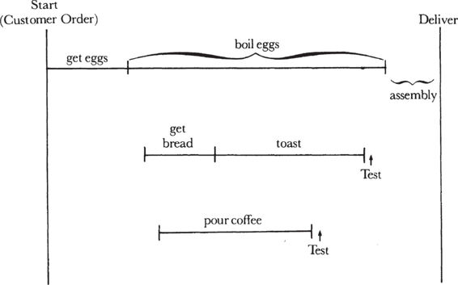
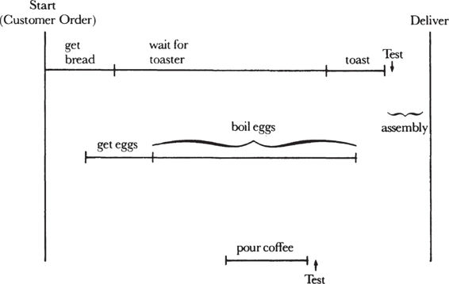

# Chapter 1: The Basics of Production — Part 1

> **High Output Management** — Andrew S. Grove
> *Production Flow Fundamentals*

Grove opens with what might be the most deceptively simple metaphor in all of management literature: making breakfast. You're a waiter. Your job is to serve a breakfast consisting of a three-minute soft-boiled egg, buttered toast, and coffee — all three items delivered simultaneously, each of them fresh and hot. That's it. From this humble starting point, he derives the foundational principles of production that apply to *any* system that transforms inputs into outputs — whether that system is a semiconductor fab, a software delivery pipeline, a recruiting funnel, or a criminal justice system.

The chapter establishes that **production's charter** is to build and deliver products:
1. At a **scheduled delivery time** (the customer expects breakfast 5-10 minutes after sitting down — not instantly, not an hour later)
2. At an **acceptable quality level** (the egg must be cooked right, the toast not burned)
3. At the **lowest possible cost** (you can't have infinite staff or unlimited inventory)

Grove is blunt about the tension: *"Production's charter cannot be to deliver whatever the customer wants whenever he wants it, for this would require an infinite production capacity or the equivalent — very large, ready-to-deliver inventories."* There is no way to satisfy all three constraints perfectly. The manager's job is to find the best balance.

For a Senior EM, this chapter is essential because **your organization is a production system**, and every concept Grove introduces here maps directly to how you build, ship, and operate software at scale.

## Table of Contents

- [The Breakfast Factory as Management Metaphor](#the-breakfast-factory-as-management-metaphor)
- [The Limiting Step](#the-limiting-step)
  - [How Grove Identifies the Limiting Step](#how-grove-identifies-the-limiting-step)
  - [Identifying Your Limiting Step](#identifying-your-limiting-step)
  - [The Recruiting Pipeline Example](#the-recruiting-pipeline-example)
- [Time Offsets and Production Flow](#time-offsets-and-production-flow)
  - [Grove's Flow Diagrams](#groves-flow-diagrams)
  - [Working Backward from Delivery](#working-backward-from-delivery)
- [Three Production Operations](#three-production-operations)
  - [Process Manufacturing](#process-manufacturing)
  - [Assembly](#assembly)
  - [Test](#test)
  - [Rework — When Test Fails](#rework--when-test-fails)
- [Capacity Constraints and Trade-offs](#capacity-constraints-and-trade-offs)
  - [The Toaster Queue Problem](#the-toaster-queue-problem)
  - [Four Levers: Equipment, Manpower, Inventory, Time](#four-levers-equipment-manpower-inventory-time)
  - [Finding the Most Cost-Effective Deployment](#finding-the-most-cost-effective-deployment)

**Block types in this chapter:** [Core Concept] [Modern Lens] [Senior EM Application] [SRE Lens] [Production Thinking] [Practical Toolkit] [Anti-Pattern] [AI & Automation] [Grove vs. Modern] [Metrics That Matter] [Scenario] [Mental Model] [Go Deeper]

---

## The Breakfast Factory as Management Metaphor

Grove's genius is choosing breakfast — not semiconductors, not software — as his teaching vehicle. By grounding production theory in something universally understood, he forces the reader to see production principles *everywhere*. The breakfast factory is not an analogy. It's a lens.

The three constraints Grove establishes are the same three constraints every production system faces:

| Constraint | Breakfast | Software Delivery | SRE Operations |
|------------|-----------|-------------------|----------------|
| **Scheduled delivery time** | 5-10 minutes after the customer sits down | Sprint commitments, release dates, SLAs | Incident response SLOs (time to detect, time to resolve) |
| **Acceptable quality** | Egg cooked right, toast not burned, coffee hot | Code that passes tests, meets acceptance criteria, doesn't regress | Changes that don't degrade reliability, SLO-compliant releases |
| **Lowest possible cost** | Minimize waste, staff, and idle equipment | Minimize engineering hours, infrastructure cost, rework | Minimize toil, on-call burden, incident frequency |

> **[Core Concept: The Production Triad — Time, Quality, Cost]**
>
> Grove's triad — **time, quality, cost** — is the fundamental tension in every system you manage. You cannot optimize all three simultaneously. Every decision you make as a Senior EM is implicitly choosing which of these to prioritize and which to sacrifice at the margin.
>
> This is not the "project management triangle" (scope, time, cost) though they're related. Grove's version is deeper because it applies to *ongoing operations*, not just projects. Your CI/CD pipeline, your incident response process, your hiring funnel, your quarterly planning cycle — each one is a production system perpetually balancing these three forces.
>
> **The Senior EM trap:** Optimizing one dimension without understanding the cost to the others. You push for faster deployments (time) and get more incidents (quality). You invest heavily in reliability (quality) and blow your infrastructure budget (cost). You cut headcount (cost) and miss delivery commitments (time). Grove's insight is that *understanding the trade-offs* — not eliminating them — is the job.

> **[SRE Lens: SLOs and Error Budgets ARE Grove's Production Triad]**
>
> Grove's triad — time, quality, cost — may sound abstract until you realize that **SLOs and error budgets are its direct codification** for reliability engineering. Google's SRE book (2016) essentially took Grove's three constraints and turned them into a formal contract:
>
> | Grove's Constraint | SRE Implementation | Concrete Example |
> |-------------------|--------------------|-----------------|
> | **Scheduled delivery time** | **SLO targets** — latency percentiles, availability windows | "99.9% of requests complete within 300ms" — this IS the customer's "breakfast in 5-10 minutes" |
> | **Acceptable quality** | **Error budgets** — the allowable failure rate before action is required | "We can tolerate 43.2 minutes of downtime per month" — this quantifies what "acceptable" means |
> | **Lowest possible cost** | **Toil budgets and efficiency targets** — minimize operational overhead per unit of reliability | "On-call engineers should spend <50% of time on toil" — this is the cost lever |
>
> **The error budget is Grove's most powerful insight made operational.** Grove says you can't have infinite quality — you have to balance quality against time and cost. The error budget makes this explicit: *here is exactly how much unreliability we accept in exchange for velocity*. When the budget is healthy, ship features (optimize for time). When the budget is burning, fix reliability (optimize for quality). When the budget is consistently unused, you're over-investing in reliability (optimize for cost — loosen SLOs or reduce infra spend).
>
> **Where most SRE teams get this wrong:** They treat SLOs as a reporting exercise rather than a decision-making framework. The SLO dashboard exists, but nobody changes behavior when the error budget burns. That's like Grove's waiter having a timer for the egg but ignoring it — the indicator exists but doesn't drive the production flow. SLOs only work when they *actually change what the team does*: error budget policies must have teeth (feature freezes, mandatory reliability sprints, postmortem triggers).
>
> **The Senior EM role:** You are the one who negotiates the triad with stakeholders. Product wants features (time). Customers need reliability (quality). Finance wants efficiency (cost). Your job is to set SLOs that encode the *agreed* balance — then use error budgets to enforce it without constant re-negotiation. This is exactly what Grove is describing when he says the manager must "find the most cost-effective way to deploy resources."

> **[Modern Lens: From Factory to Flow — How This Concept Evolved]**
>
> Grove wrote in 1983, when manufacturing was the dominant metaphor for productive work. Today, knowledge work has its own production theories that build on Grove's foundations:
>
> - **Lean Software Development** (Poppendieck & Poppendieck, 2003): Directly extends Grove's production thinking to software. Concepts like value stream mapping, pull systems, and eliminating waste are Grove's breakfast factory scaled up.
> - **Flow (Csikszentmihalyi, 1990) and Team Flow**: The psychological state of productive focus. Grove's "production flow" is about materials; modern thinking adds the human dimension — how do you design systems that keep *people* in flow?
> - **DORA Metrics / Accelerate** (Forsgren, Humble, Kim, 2018): The four key metrics — deployment frequency, lead time for changes, change failure rate, mean time to restore — are essentially Grove's triad (time, quality, cost) operationalized for software delivery. The research proved empirically that you *can* improve all three simultaneously, which refines Grove's trade-off model: the trade-offs are real for any *given* system design, but redesigning the system can shift the frontier.
> - **Platform Engineering** (2020s): The modern incarnation of Grove's factory. Internal developer platforms are production systems designed to give engineering teams self-service capabilities while maintaining quality and reducing cognitive overhead. A well-designed platform is Grove's "continuous egg-boiler" for software teams — automated, reliable, predictable output.
>
> What hasn't changed: the fundamental insight that *any* productive activity can be understood as a production flow, and that understanding the flow is the prerequisite to improving it.

---

## The Limiting Step

The first and perhaps most powerful concept Grove introduces: **the limiting step**. In any production flow, one step determines the overall pace and shape of the entire operation. Everything else must be planned around it.

### How Grove Identifies the Limiting Step

Grove walks through it concretely. You have three breakfast components:
- **Egg** — needs to be fetched and boiled for 3 minutes. The longest prep time, and the most important item to the customer.
- **Toast** — about 1 minute in the toaster.
- **Coffee** — already steaming in the kitchen; just pour it.

The egg takes the longest. It's also what the customer cares most about. Therefore, **the egg is the limiting step**, and you must plan the entire operation around it.

> *"The first thing we must do is to pin down the step in the flow that will determine the overall shape of our operation, which we'll call the* limiting step."

Grove is precise about why this matters: you work backward from the delivery time. The egg defines the total throughput time (how long the whole process takes from start to delivery). You calculate when to start the toast and when to pour the coffee by *offsetting* them from the egg's timeline, so everything finishes simultaneously.

> **[Core Concept: The Limiting Step]**
>
> The limiting step is not just "the bottleneck." It's more nuanced than that. Grove identifies it by three possible characteristics:
>
> 1. **Longest duration** — the step that takes the most time (the egg in breakfast)
> 2. **Most expensive** — the step with the highest cost (student plant visits in recruiting — his second example)
> 3. **Most sensitive/critical** — the step where quality matters most (the egg is also what the customer judges the breakfast by)
>
> In any given system, these three may or may not be the same step. The power of the concept is that you must *identify which one is limiting your particular flow* and reorganize everything around it.
>
> **The profound implication:** Most managers spend their energy trying to speed up or improve *every* step in their process. Grove says: find the ONE step that constrains the whole system, and focus your optimization there. Improving non-limiting steps is waste — it creates local efficiency without global improvement. Making the coffee faster doesn't make the breakfast arrive sooner if the egg is still the constraint.

> **[Mental Model: Theory of Constraints (Goldratt, 1984)]**
>
> One year after Grove published *High Output Management*, Eliyahu Goldratt published *The Goal*, which formalized the limiting step concept into a complete management philosophy: the **Theory of Constraints (TOC)**.
>
> Goldratt's five focusing steps map directly onto what Grove describes in this chapter:
>
> | Step | Description | Grove's Breakfast Equivalent |
> |------|-------------|----------------------------|
> | 1. **Identify** the constraint | Find the bottleneck | "Pin down the limiting step" — the egg takes the longest |
> | 2. **Exploit** the constraint | Maximize throughput of the bottleneck — don't waste it | Plan everything around the egg; never leave an egg idle in the flow |
> | 3. **Subordinate** everything else | Align all other steps to the constraint's pace | Time offsets — stagger toast and coffee around egg timing |
> | 4. **Elevate** the constraint | Invest to increase the bottleneck's capacity | Buy a continuous egg-boiler (Grove's later example) |
> | 5. **Repeat** | The constraint will shift — find the new one | "Toaster capacity has become the limiting step" (Grove shows this!) |
>
> Grove actually demonstrates step 5 in the chapter: when toaster capacity becomes limited (you're waiting in a queue for the toaster), the limiting step *shifts* from the egg to the toast, and the entire flow must be reconceived. This is crucial — **the limiting step is not static**. Every time you improve the current bottleneck, a new one emerges. This cycle never ends.
>
> **[Go Deeper]** *The Goal* by Eliyahu Goldratt is the essential companion to this chapter. It's written as a novel — a plant manager has 90 days to save his factory — and you'll internalize TOC naturally. *The Phoenix Project* (Kim, Behr, Spafford, 2013) is the same story retold for IT/DevOps. Both are direct descendants of Grove's thinking.

### Identifying Your Limiting Step

> **[Senior EM Application: Finding Your Org's Limiting Step]**
>
> As a Senior EM, your "breakfast" is software delivery — from idea to production. Your production flow looks something like:
>
> ```
> Requirements → Design → Implementation → Code Review → Testing → Deployment → Monitoring
> ```
>
> **Where is your limiting step?** It's different for every organization, and it *shifts* over time. Common patterns:
>
> | If your limiting step is... | Symptoms you'll see | What to optimize |
> |----------------------------|---------------------|-----------------|
> | **Design/Architecture** | Engineers start coding before design is settled, leading to rework. PRs languish because reviewers question the fundamental approach. | Invest in upfront design reviews, architecture decision records (ADRs), and RFC processes. Often the limiting step for teams shipping complex distributed systems. |
> | **Code Review** | PRs sit for days. Engineers context-switch while waiting. Deployment queues back up. | Reduce PR size (small PRs get faster reviews), set review SLAs, establish a review rotation, consider pair programming to eliminate the review queue entirely. |
> | **Testing/QA** | The test suite takes 45 minutes. Flaky tests cause retries. Manual QA creates a multi-day queue. | Invest in test infrastructure: parallel test execution, flaky test quarantine, shift-left testing, contract testing to reduce end-to-end test dependency. |
> | **Deployment** | Deployments are risky, slow, and infrequent. They require change approval boards, maintenance windows, and war rooms. | Progressive delivery (canary, feature flags), automated rollback, deployment pipeline automation. Often the limiting step for organizations with heavy compliance requirements. |
> | **Incident Response / Reliability** | Teams spend so much time firefighting that project work stalls. On-call burden prevents focus. | Reduce incident frequency through reliability investment. Error budgets create an explicit trade-off: when budget is burning, stop feature work and fix reliability. |
>
> **How to find it empirically:** Use value stream mapping (detailed toolkit below). Track a unit of work (a feature, a bug fix) from the moment it enters your system to the moment it's in production. Measure *wait time* at each stage. The stage with the longest wait time is almost certainly your limiting step — and it's usually wait time (sitting in a queue), not work time (being actively processed), that dominates.

> **[Practical Toolkit: Value Stream Mapping for Software Delivery]**
>
> Value Stream Mapping (VSM) is the operational technique for finding your limiting step. It originated from Toyota Production System and was adapted for software by Mary and Tom Poppendieck.
>
> **How to do it:**
>
> 1. **Pick a recent unit of work** — a feature or bug fix that went through your normal process.
> 2. **Walk the flow backward** from production to inception (Grove's approach — start from the delivery point).
> 3. **At each stage, record two times:**
>    - **Process time** — how long someone was actively working on it
>    - **Wait time** — how long it sat idle (in a queue, awaiting review, blocked on another team)
> 4. **Calculate flow efficiency:** `process time / (process time + wait time) × 100%`
>
> Typical results for software teams:
> - **Flow efficiency: 5-15%** — meaning 85-95% of the lead time is *waiting*, not working
> - The biggest wait times are usually between stages: waiting for review, waiting for test environments, waiting for deployment windows, waiting for approvals
>
> **Example value stream map:**
>
> ```
> Stage              Process Time    Wait Time    Notes
> ──────────────────────────────────────────────────────────
> Requirements       2 hours         3 days       Waiting for PM clarification
> Design             4 hours         1 day        Waiting for architecture review
> Implementation     3 days          —            Active coding
> Code Review        2 hours         2.5 days     PR sitting in queue
> Testing            1 hour          4 hours      CI pipeline queue
> Deployment         15 min          2 days       Next deployment window
> ──────────────────────────────────────────────────────────
> TOTAL PROCESS:     ~4.3 days
> TOTAL WAIT:        ~8.7 days
> FLOW EFFICIENCY:   33% (better than average, but still 2/3 waiting)
> LIMITING STEP:     Requirements wait (3 days) — PM is the bottleneck
> ```
>
> **Tools for this:**
> - **Jira / Linear** — track state transitions and time-in-state
> - **Jellyfish, LinearB, Sleuth, Swarmia** — engineering analytics platforms that automate cycle time measurement
> - **Datadog CI Visibility, Buildkite Analytics** — pipeline-specific flow metrics
> - **Manual whiteboard exercise** — often the most revealing first step. Gather the team, draw the flow, mark the wait times. Do this before buying any tool.
>
> **The insight Grove gives you:** Once you've identified the limiting step, *subordinate everything else to it*. If code review is the bottleneck, it doesn't matter how fast you code or how automated your deployment is — the system throughput is capped by review speed. Optimize there first. Everything else is secondary.

> **[SRE Lens: Incident Response IS a Production Flow]**
>
> If you manage SRE teams, you already run a production system — and it's not just the software delivery pipeline. **Incident response itself is a production flow** with the same structure Grove describes:
>
> ```
> DETECTION → TRIAGE → MITIGATION → RESOLUTION → POSTMORTEM → SYSTEMIC FIX
>   (egg)      (toast)   (coffee)     (assembly)    (test)       (rework)
> ```
>
> **Identifying the limiting step in your incident pipeline:**
>
> | Possible Limiting Step | Symptoms | Grove's Optimization |
> |-----------------------|----------|---------------------|
> | **Detection** (time to detect) | Customers report outages before your monitoring catches them. SLO breaches go unnoticed for minutes/hours. | This is like the egg — the most critical step. Invest in better observability: structured logging, distributed tracing, real-user monitoring, anomaly detection. If detection is slow, *nothing downstream matters* because the incident is already causing customer impact while you're unaware. |
> | **Triage** (time to understand) | Alerts fire but the on-call can't determine severity or affected systems. Multiple responders waste time investigating the wrong thing. | This is a *test* failure — the signal (alert) doesn't carry enough information to classify the problem. Fix alert quality: include runbook links, blast radius indicators, affected SLOs, recent deployments. |
> | **Mitigation** (time to stop the bleeding) | The team knows what's wrong but can't act fast enough. Rollbacks are manual and scary. Config changes require full deploys. | This is a *capacity/tooling* constraint. Invest in automated rollback, feature flags for kill switches, circuit breakers, pre-staged mitigation runbooks. Every second of mitigation delay is measured in customer impact and error budget burn. |
> | **Postmortem** (learning from the incident) | Incidents repeat because the root cause is never properly analyzed. Postmortems are skipped or are blame-fests that produce no action items. | This is the *test of the production flow itself*. A postmortem that doesn't produce action items is like a unit test that always passes — it provides no signal. Blameless postmortems with tracked action items are Grove's "rework" loop applied to operations. |
>
> **Time offsets in incident response:** Grove plans backward from delivery (breakfast served). For incident response, plan backward from **resolution**:
> - To resolve in 30 min, mitigation must start by minute 15
> - To mitigate by minute 15, triage must complete by minute 10
> - To triage by minute 10, detection must fire by minute 5
> - Therefore: your monitoring must detect issues within 5 minutes — that's the constraint that shapes everything
>
> **The meta-insight for Senior EMs:** Track MTTD (mean time to detect), MTTT (mean time to triage), MTTM (mean time to mitigate), and MTTR (mean time to resolve) *separately*. Most teams only track MTTR, which hides where the actual limiting step is. If your MTTR is 60 minutes but 45 of those are detection, optimizing your rollback process (mitigation) won't help — you need better alerting. This is Grove's exact point: optimize the limiting step, not the step that's easiest to improve.
>
> **[Practical Toolkit: Incident Response Value Stream Map]**
>
> Run this exercise after every major incident (or quarterly on your aggregate data):
>
> ```
> Incident: [service] outage on [date]
>
> Timeline:
> ──────────────────────────────────────────────────────
> T+0:00   Impact starts (customer-facing)
> T+8:00   Alert fires (MTTD = 8 min)                    ← Detection
> T+12:00  On-call acknowledges, opens bridge (4 min)     ← Triage start
> T+22:00  Root cause identified (10 min triage)          ← Triage complete
> T+28:00  Mitigation applied — rollback (6 min)          ← Mitigation
> T+30:00  Customer impact ends (MTTR = 30 min)           ← Resolution
> ──────────────────────────────────────────────────────
>
> Limiting step: Detection (8 min of 30 min = 27% of total)
> Why: Alert threshold was too conservative; SLO-based alert
>      would have fired at T+2:00
> Action: Implement SLO burn-rate alerting for this service
> Projected impact: MTTD drops from 8 min to ~2 min → MTTR
>                   drops from 30 min to ~24 min (20% improvement)
> ```

> **[AI & Automation: AI as Constraint Shifter]**
>
> AI-powered tooling is actively shifting where the limiting step sits in software delivery. This is exactly Goldratt's step 5 — elevate one constraint and watch the next one emerge:
>
> | Traditional Bottleneck | AI Impact | Where the Constraint Shifts To |
> |----------------------|-----------|-------------------------------|
> | **Code writing** | Copilot, Cursor, Claude Code — dramatically faster code generation | Review and verification become the constraint. More code produced = more code to review. |
> | **Code review** | AI review tools (CodeRabbit, Sourcery, PR-Agent, Amazon CodeGuru) flag issues automatically | Human judgment on design and architecture decisions — the one thing AI can't reliably do (yet) |
> | **Testing** | AI test generation (Diffblue, CodiumAI), AI-assisted debugging | Test strategy and knowing *what* to test. AI generates tests for code that exists; humans decide what *should* exist. |
> | **Documentation** | AI-generated docs, ADRs, runbooks | Keeping generated docs accurate and up to date. AI can write plausible-looking docs that are subtly wrong. |
> | **Incident triage** | AIOps platforms (PagerDuty AIOps, BigPanda, Moogsoft) — automated correlation and routing | Root cause analysis and systemic fix decisions — still requires deep system understanding |
>
> **The meta-insight:** AI doesn't eliminate bottlenecks — it *shifts* them. This is Goldratt's step 5 playing out in real time. As AI accelerates code generation, the limiting step moves downstream to review, testing, and deployment. As AI helps with testing, it moves to design and architectural judgment.
>
> **For Senior EMs:** Your job is to anticipate these shifts. If your team adopts AI coding assistants and suddenly produces 3x more code, but your review process hasn't changed, you've just created a massive bottleneck at review. Plan the *system*, not just the individual step.

### The Recruiting Pipeline Example

Grove extends the limiting step concept to Intel's college recruiting process. The flow:
1. **Campus interviews** — managers visit colleges and interview seniors
2. **Phone screening** — promising candidates are screened further
3. **Plant visits** — screened candidates fly to Intel for intensive interviews (the most expensive step — travel costs plus senior manager time)
4. **Offers** — employment offered to the best candidates
5. **Acceptances** — some accept, some don't; those who accept eventually start work

The **plant visit is the limiting step** — not because it takes the longest, but because it's the **most expensive** per candidate. To optimize, you screen more aggressively *before* the expensive step (phone interviews filter candidates so a higher percentage of plant visitors get offers).

Grove also notes that **time offsets** apply: working backward from graduation day, the recruiter staggers campus visits, phone screens, and plant visits so everything happens at the right time.

> **[Senior EM Application: Your Hiring Funnel as a Production System]**
>
> Grove's 1983 recruiting example maps perfectly to modern tech hiring:
>
> | Grove's Era | Modern Equivalent | Why it's (not) the Limiting Step |
> |------------|-------------------|----------------------------------|
> | Campus interview | Resume screen / recruiter call | Low cost per candidate — not the constraint |
> | Phone screen | Technical phone screen | Moderate cost — filtering step |
> | Plant visit | On-site interview loop (4-6 hours × 4-6 engineers) | **Highest cost step:** 20-30 hours of engineering time per candidate. This is the constraint. |
> | Offer extended | Offer extended | Administrative cost — not the constraint |
> | Offer accepted | Offer accepted | In competitive markets, this *becomes* the constraint |
>
> **Grove's principle applied:** Maximize the ratio of offers-to-onsites. Every on-site that doesn't convert to an offer is waste — specifically, it wastes your most expensive resource (senior engineer time in interviews). To improve this ratio:
>
> - **Better screening before the on-site:** Structured phone screens with rubrics, take-home assessments (controversial — watch for equity issues and candidate drop-off), pair programming sessions
> - **Clear hiring bar alignment:** Calibrate interviewers so they're evaluating the same things. If your on-site pass rate is below 30%, your pre-screening isn't working — you're wasting the expensive step.
> - **Debrief quality:** Quick, structured debriefs prevent "maybe" hires and end-of-day recency bias
>
> **Modern complication Grove didn't face:** In 2024+, the on-site is often a virtual loop, which reduces *cost per candidate* (no travel) but doesn't reduce *engineering time*. The limiting step has partially shifted to **offer acceptance** — in competitive markets, candidates have multiple offers and your close rate becomes the constraint. This means investing in candidate experience, fast offer turnaround (days, not weeks), and compelling team narratives becomes the optimization target.
>
> **Another modern complication — AI-generated applications:** The resume screen stage is being overwhelmed by AI-generated applications, fundamentally changing the flow. When the input volume explodes, the first filtering step can become the new limiting step even though it's cheap per unit — because the sheer volume collapses the filter.

> **[Metrics That Matter: Hiring Funnel Health]**
>
> Track these to manage your hiring pipeline as a production system:
>
> | Metric | Healthy Range | What It Signals |
> |--------|--------------|-----------------|
> | **Screen-to-onsite ratio** | 3:1 to 5:1 | Pre-screening effectiveness |
> | **Onsite-to-offer ratio** | 2:1 to 3:1 | Interview calibration and bar alignment |
> | **Offer acceptance rate** | >70% | Competitiveness, candidate experience, speed |
> | **Time-to-fill** | <45 days (IC), <60 days (manager) | Overall pipeline velocity |
> | **Interviewer hours per hire** | <40 hours | Efficiency of the limiting step |
> | **Source-of-hire yield** | Varies by channel | Which sourcing channels produce best conversion at lowest cost |
>
> If these metrics are unhealthy, don't just "try harder" — find the limiting step in *your* funnel and fix *that*.

---

## Time Offsets and Production Flow

### Grove's Flow Diagrams

Grove illustrates time offsets with a production flow diagram. This is the key visual in the chapter:


*Grove's production flow diagram: The egg (top line) starts first because it takes the longest. Toast (middle) starts later, offset by the right amount. Coffee (bottom) starts last because it's fastest. All three converge at the assembly/delivery point on the right. Test steps (visual inspection) happen after toast and coffee. This is the core idea: plan backward from delivery, stagger each step by its duration, so everything arrives simultaneously.*

The horizontal axis is time, running left (customer order) to right (delivery). The egg's timeline is the longest bar — it sets the overall throughput time. Toast and coffee are shorter bars, offset to start later so they finish at the same moment as the egg. Test steps (visual inspection — is the toast brown? is the coffee steaming?) happen inline.

> **[Core Concept: Planning Backward from the Constraint]**
>
> Most people plan forward: "First we'll do A, then B, then C, and we'll be done by... let's see... whenever C finishes." Grove says plan *backward*: "We need to deliver by time T. The longest step takes X. So that step must start at T minus X. The next step takes Y, so it starts at T minus (the appropriate offset)..."
>
> This is not just scheduling. It's a *mode of thinking*. Backward planning forces you to:
> 1. **Start with the deadline** — the customer's need, not your convenience
> 2. **Identify the critical path** — the chain of steps that determines total throughput time
> 3. **Reveal slack** — steps that have buffer time (coffee has lots of slack) and steps that don't (the egg has zero slack)
> 4. **Surface conflicts early** — "Wait, step A and step C both need the same person at the same time" becomes visible when you plan backward, but invisible when you plan forward
>
> **Why this matters more at senior levels:** As a Senior EM, your "production flows" have longer cycle times and more dependencies. Quarterly planning, headcount requests, architecture reviews, compliance certifications — these all have long lead times and hard deadlines. Planning forward ("let's start the RFC and see when it's done") almost always results in missing the window. Planning backward ("the architecture review board meets March 15, so the RFC needs to be final by March 1, which means draft by Feb 15, which means we need to start research *now*") is how you hit windows.

> **[Practical Toolkit: Backward Planning in Practice]**
>
> **For a quarterly reliability initiative:**
>
> ```
> TARGET: Reduce P99 latency of payments service from 2s to 500ms by end of Q3
>
> Working backward from Sept 30:
>
> Sept 30   — Metric validated in production for 2 weeks          (delivery)
> Sept 15   — Full rollout complete                                (deploy)
> Sept 1    — Canary validated, load tested                        (test)
> Aug 15    — Implementation complete, PR merged                   (build)
> Aug 1     — Design approved, dependencies identified             (design)   ← START HERE
> July 15   — Performance profiling complete, root causes known    (investigate)
> July 1    — Kick off: team allocated, on-call coverage arranged
>
> LIMITING STEP: Performance investigation (July 1-15)
>   — requires production traffic analysis during peak hours
>   — depends on observability tooling being in place
>   — cannot be parallelized easily
>
> TIME OFFSET: Design (Aug 1-15) can overlap with implementation
>              of "easy wins" identified during investigation
> ```
>
> **For a hiring plan:**
>
> ```
> TARGET: Two senior SREs onboarded and productive by Jan 1
>
> Working backward:
>
> Jan 1   — Engineers productive (onboarded)           (delivery)
> Dec 1   — Engineers start (2-week notice typical)    (deploy)
> Nov 15  — Offers accepted                            (close)
> Nov 1   — Offers extended                            (decide)
> Oct 15  — On-site interviews complete                (test)     ← LIMITING STEP
> Oct 1   — Phone screens complete                     (screen)
> Sept 15 — Sourcing pipeline full, JDs posted         (source)
> Sept 1  — Headcount approved, job levels defined     (plan)     ← START HERE
> ```
>
> Notice: if you start sourcing in October thinking "we need someone by Q1," you're already too late. Backward planning reveals this *before* you miss the deadline — which is exactly what Grove's time offsets are designed to do.

> **[SRE Lens: Backward Planning for Reliability Milestones]**
>
> SRE teams are often the *worst* at backward planning. Reliability initiatives are typically framed as ongoing work ("we should improve monitoring," "we need to reduce toil") rather than deliverables with deadlines. But the most effective SRE leaders apply Grove's backward planning to reliability just as rigorously as product teams apply it to features.
>
> **Common SRE milestones that require backward planning:**
>
> - **Production readiness reviews (PRRs):** New service launching in 8 weeks? Work backward: what SLOs, monitoring, alerting, runbooks, load test results, and on-call rotation need to exist by launch? When does each need to start?
> - **On-call rotation transitions:** Moving on-call ownership from SRE to the product team? Work backward from the handoff date: what training, shadowing, runbook writing, and escalation path documentation needs to happen?
> - **SLO adoption:** Org-wide SLO rollout by EOY? Work backward: instrumentation → baseline measurement → SLO definition workshops → error budget policy negotiation → dashboard deployment → team training. Each step has dependencies.
> - **Disaster recovery testing:** Annual DR test scheduled for November? Work backward: what failover mechanisms need to be validated? What runbooks updated? What team exercises conducted first?
>
> **The failure mode:** SRE teams that don't plan backward end up perpetually "almost ready." The monitoring is 80% done, the runbooks cover 60% of failure modes, the load test "hasn't been scheduled yet." Meanwhile, the service launches on time because product timelines don't wait — and SRE scrambles to catch up post-launch, which is exactly the scenario Grove warns against (catching the rotten egg after serving it to the customer).
>
> **The Senior EM move:** For every reliability milestone, create a backward-planned timeline with clear dependencies and share it with your product counterparts. This transforms reliability from "SRE will handle it" (vague, easy to deprioritize) into "here's what needs to happen by when, and here's what blocks the launch if it doesn't" (concrete, creates accountability).

> **[Grove vs. Modern: From Gantt Charts to Kanban to Feature Flags]**
>
> Grove's time offsets are essentially what a Gantt chart visualizes — dependencies and staggered start times. Modern software teams have largely moved away from Gantt charts toward Kanban and flow-based systems, but the underlying principle is identical:
>
> | Grove's Concept | Waterfall Era | Modern Equivalent |
> |----------------|---------------|-------------------|
> | Time offsets | Gantt charts, PERT charts | Dependency mapping in Jira/Linear, sprint pre-planning |
> | Limiting step | Critical path method (CPM) | Bottleneck analysis, cumulative flow diagrams |
> | Plan backward from delivery | Milestone-driven planning | "Working backward" docs (Amazon's PR/FAQ), sprint goals derived from quarterly targets |
> | Stagger component readiness | Phase gates | Feature flags — deploy components independently, activate together |
>
> **What's genuinely new:** Feature flags and trunk-based development let you *decouple* deployment from release. In Grove's factory, all components had to be ready simultaneously — you can't serve the toast without the egg. In modern software, you can deploy the "toast" and "coffee" ahead of time (behind feature flags, invisible to users) and only "serve the breakfast" when the "egg" (the limiting component) is ready. This is a fundamental advancement over Grove's model — it eliminates the simultaneous-readiness constraint and reduces coordination cost dramatically.
>
> But the *planning* principle remains: you still need to know what the limiting step is, and you still need to plan backward from when you want to "serve" the full feature. Feature flags change *how* you manage time offsets, not *whether* you need them.

---

## Three Production Operations

Grove identifies three fundamental types of production operations that exist in *every* production flow:

1. **Process manufacturing** — physically or chemically transforms material. Boiling changes a raw egg into a cooked egg. Compiling transforms source code into a working program. Training transforms raw data into a sales strategy. The input and output are fundamentally different things.

2. **Assembly** — combines components into a new entity. The egg, toast, and coffee together make a breakfast. Modules plus an API plus a UI make a product. The individual parts gain collective value by being combined.

3. **Test** — examines the characteristics of a component or the finished whole. You visually inspect that the coffee is steaming and the toast is brown. You run a "dry run" of a sales presentation with a pilot audience. You unit-test each module of a compiler before assembling the whole.

Grove illustrates with three concrete examples beyond breakfast:

**Sales training:** Converting raw product data into selling strategies (process) → combining strategies, market data, brochures, and flip charts into a coherent presentation (assembly) → running a dry run with a pilot group of salespeople (test). If the dry run fails, the material goes back for **rework** — a concept he introduces here that will recur throughout.

**Compiler development:** Building individual software components from specifications (process) → each piece undergoes a **unit test** (test) → if a piece fails, it's returned for rework → passing pieces are assembled into the complete compiler (assembly) → a **system test** validates the final product before shipping (test).

> **[Core Concept: Process, Assembly, Test — The Universal Triad]**
>
> These three operations are universal because *every productive activity* involves transforming inputs (process), combining outputs (assembly), and verifying results (test). The power of this framework is that it forces you to classify what your team is actually doing at each step — and then ask whether each operation type is getting appropriate investment.
>
> | Operation | Software Engineering | SRE / Platform | Management |
> |-----------|---------------------|----------------|------------|
> | **Process** | Writing code, designing architecture, analyzing data, building features | Building automation, creating runbooks, performance tuning, incident response | Strategic planning, synthesizing feedback, writing strategy docs |
> | **Assembly** | Integrating components, building features from modules, composing microservices into a system | Assembling deployment pipelines, composing monitoring dashboards from signals, integrating alerting with response workflows | Combining team roadmaps into org strategy, merging inputs from multiple stakeholders into decisions |
> | **Test** | Unit tests, integration tests, code review, QA, acceptance testing | Chaos engineering, load testing, canary analysis, SLO validation, game days | Reviewing OKR progress, conducting 360 feedback, assessing team health surveys, retrospectives |
>
> **The insight for Senior EMs:** Most engineering teams over-invest in **process** (building things) and under-invest in **test** (verifying things work) and **assembly** (integrating things together). Integration pain and insufficient testing are the two most common sources of late-stage rework. As a Senior EM, audit the balance. If your teams are coding fast but integration is painful and testing is an afterthought, you have a production flow problem — and you're paying for it in rework cycles.

> **[SRE Lens: Observability as the "Test" Operation for Production Systems]**
>
> Grove's three operations — process, assembly, test — map perfectly to how SRE teams think about production systems. The insight that's easy to miss: **observability IS the test operation, running continuously in production.**
>
> | Grove's Operation | In Software Delivery | In Production Operations (SRE) |
> |------------------|----------------------|-------------------------------|
> | **Process** | Writing and deploying code | The running system processing requests — every API call is a "process" step transforming a request into a response |
> | **Assembly** | Integrating components into a deployable artifact | Microservices composing to handle complex workflows — a checkout flow is "assembled" from auth, inventory, payments, and notification services |
> | **Test** | CI tests, QA, staging validation | **Observability: metrics, logs, traces, SLO monitoring, alerting** — continuously testing whether the production system is operating within spec |
>
> Grove describes visual inspection of the toast (is it brown?) and coffee (is it steaming?). Modern observability does exactly this, but at scale and continuously:
>
> - **Metrics** = checking the temperature gauge on the egg-boiler (is latency within range? is error rate within budget?)
> - **Logs** = detailed notes about each breakfast prepared (what happened during this specific request?)
> - **Traces** = following one breakfast order through every station (how did this specific request flow across services?)
> - **Alerts** = the alarm that sounds when the egg-boiler temperature drifts out of spec (SLO burn rate exceeds threshold)
> - **SLO dashboards** = the quality control board showing today's output statistics (are we within our error budget?)
>
> **Grove's key insight applied:** He says you should prefer **in-process inspection** (checking the thermometer while eggs are boiling) over **functional testing** (cracking open a finished egg to check it). In SRE terms:
>
> - **Functional testing = synthetic monitoring:** You periodically send a test request and check the response. Like cracking an egg — it tells you if the output is good, but you had to consume a test slot to find out, and you only catch problems at the check interval.
> - **In-process inspection = real-time SLO monitoring on actual traffic:** You're continuously watching *every* request against your SLO thresholds. Like the thermometer in the boiler — it detects drift *before* the output degrades, and it doesn't consume production capacity.
>
> **The SRE priority:** Invest in in-process inspection (SLO-based monitoring on real traffic) over functional testing (synthetic checks) wherever possible. Synthetics still have value — they catch issues when there's no organic traffic (overnight, new regions) — but they should not be your primary quality signal. This is Grove's principle applied directly.

> **[Production Thinking: Your CI/CD Pipeline IS Grove's Production Flow]**
>
> Map your delivery pipeline to Grove's operations and you'll see the pattern instantly:
>
> ```
> PROCESS:    Feature branches, individual module development, API design
>                 ↓
> TEST:       Unit tests on individual components (Grove's "unit test")
>                 ↓
> ASSEMBLY:   Pull request merge, integration build, service composition
>                 ↓
> TEST:       Integration tests (Grove's "system test")
>                 ↓
> PROCESS:    Deploy to staging (environment transformation)
>                 ↓
> TEST:       E2E tests, smoke tests in staging
>                 ↓
> ASSEMBLY:   Deploy to production (join the live system)
>                 ↓
> TEST:       Production smoke tests + SLO monitoring (ongoing)
> ```
>
> Grove's compiler example from 1983 maps almost exactly to this flow: individual pieces undergo unit tests after the process step, then are assembled into the full system, then undergo system tests. He was describing CI/CD thirty years before the term existed.
>
> **Rework in software terms:** Grove mentions rework — when a unit test fails, the defective piece goes back to the process phase. In software, this is:
> - **The PR feedback loop:** Review comments → code changes → re-review → more comments → more changes. Each cycle is rework.
> - **CI failures:** Build breaks → fix → re-run. Each re-run is rework.
> - **Bug bounces:** QA finds a bug → developer fixes → QA re-tests → finds another bug. Each bounce is rework.
>
> Minimizing rework cycles is a key leverage point. The best teams reduce rework through:
> - Clear upfront design (less rework at implementation — catching the rotten egg at delivery, not at the table)
> - Small PRs (faster review cycles when rework does happen)
> - Automated linting and formatting (eliminate trivial rework entirely)
> - Pair/mob programming (real-time rework instead of async cycles — the feedback loop shrinks from days to seconds)

### Rework — When Test Fails

> **[Modern Lens: Testing in the Age of Continuous Delivery]**
>
> Grove's test operations have evolved dramatically since 1983. His model assumes a sequential flow: build it, then test it, and if the test fails, rework it. Modern practice has compressed and interlaced this cycle:
>
> | Testing Approach | Era | Philosophy |
> |-----------------|-----|-----------|
> | **Test at the end** | Pre-2000s | Build everything, then verify. Expensive rework when things fail late. |
> | **Test-Driven Development** | 2000s (Kent Beck) | Write the test *first*, then build to pass it. The test defines the spec. |
> | **Continuous Testing** | 2010s | Automated tests run at every commit, every merge, every deploy. Tests are woven into the process, not a separate phase. |
> | **Testing in Production** | 2020s | Canary deployments, feature flags, observability-driven verification. Production IS a test environment (for a small % of traffic). |
> | **AI-Assisted Testing** | 2024+ | AI generates test cases, identifies coverage gaps, predicts failure risk from code changes. Test creation becomes partially automated. |
>
> **The big shift — "testing in production":** This is the most significant departure from Grove's model. Grove assumes you can catch all defects *before* the customer sees them. Modern distributed systems are too complex for that — you *will* have production failures. So you build systems that detect and recover quickly (SLOs, error budgets, automated rollback, circuit breakers) rather than trying to prevent all failures at the gate.
>
> **This doesn't invalidate Grove.** His "detect problems at the lowest-value stage" principle (covered in Part 2) still holds. But the definition of "lowest-value stage" has expanded. A canary deployment exposing 1% of traffic is a much lower-value stage than full production — it's a *test* step dressed up as a *deployment* step. Feature flags let you "ship" code without "releasing" it — the flag flip is the real delivery, and everything before it is effectively still in the test phase.

---

## Capacity Constraints and Trade-offs

### The Toaster Queue Problem

Grove now introduces complications. What if the toaster has limited capacity? What if there's a line of waiters waiting to use it?

If you didn't account for the queue, your three-minute egg becomes a six-minute egg — because the egg is done but the toast isn't ready yet. **The limiting step has shifted** from the egg to the toaster.

Here's Grove's revised flow diagram showing this shift:


*With limited toaster capacity, the entire flow is reconceived. The toast timeline (top line) is now the longest bar — it includes "get bread," "wait for toaster," and "toast." The egg (middle) and coffee (bottom) are subordinated to the toast timeline. Notice how the flow is fundamentally restructured, not just tweaked. The limiting step changed, so the entire production plan changed. This is what happens in real organizations when a new bottleneck emerges — you can't just patch the old plan.*

This is a crucial insight: **the flow diagram looks completely different** depending on which step is the limiting one. It's not a minor adjustment — the whole shape of the operation changes.

Grove then escalates the complications. What if you're stuck in the toaster line when it's time to start your egg? Now you have a genuine resource conflict — you need to be in two places at once. He presents several possible solutions:

1. **Specialization** — hire an egg-cooker, a toast-maker, a coffee-pourer. But this creates *"an immense amount of overhead"* — management complexity, communication cost, likely more expensive than it's worth.

2. **Ask a colleague for help** — another waiter puts your toast in while you handle the egg. But *"when you have to depend on someone else, the results are likely to be less predictable."*

3. **Add equipment** — buy another toaster. But this is an *"expensive addition of capital equipment"* that may sit idle during slow periods.

4. **Build inventory** — run the toaster continuously, keep a stock of hot toast, throw away what's unused. But this means *waste*.

### Four Levers: Equipment, Manpower, Inventory, Time

From these options, Grove derives the four fundamental levers of production capacity:

> *"Equipment capacity, manpower, and inventory can be traded off against each other and then balanced against delivery time."*

> **[Core Concept: The Four-Way Trade-off]**
>
> | Lever | Breakfast Factory | Software Org | Cost / Downside |
> |-------|------------------|--------------|-----------------|
> | **Equipment/Tooling** | Buy another toaster | Better CI servers, paid dev tools, faster build infrastructure | Capital expenditure; may sit idle during low-usage periods |
> | **Manpower** | Hire specialists (egg-cooker, toast-maker) | Hire more engineers, create specialized roles | Most expensive and least flexible — hiring takes months, people need onboarding, and communication overhead grows |
> | **Inventory** | Keep hot toast ready, throw away what's unused | Pre-built libraries, shared platform services, reusable components, cached build artifacts | Waste (unused inventory decays — libraries go stale) + maintenance cost |
> | **Delivery time** | Customers wait longer | Longer sprint cycles, less frequent releases, extended timelines | Customer/stakeholder patience erodes; competitive pressure increases |
>
> **The key insight:** These four are always in tension. You can't optimize all four simultaneously. Every org implicitly makes trade-offs between them — the question is whether those trade-offs are *deliberate* (because someone thought it through) or *accidental* (because that's just how things evolved).

### Finding the Most Cost-Effective Deployment

> *"Your task is to find the* most cost-effective *way to deploy your resources — the key to optimizing all types of productive work."*

Grove adds something important here — it's about *thinking through the relationships*, not precise calculations:

> *"You probably won't use a stopwatch to conduct a time-and-motion study... What is important is the thinking you force yourself to go through to understand the relationship between the various aspects of your production process."*

This is Grove at his pragmatic best. He's not asking for Six Sigma analysis. He's asking managers to *understand the system well enough to make informed trade-offs* instead of making decisions by instinct or tradition.

> **[Scenario: The Build Queue Problem]**
>
> Your CI system takes 40 minutes for a full test suite. With 30 engineers merging PRs, the build queue backs up. Engineers wait hours for green builds. Deployment frequency drops. Frustration rises. Sound familiar?
>
> **Applying Grove's four-lever trade-off framework:**
>
> | Option | Lever | Trade-off | Cost |
> |--------|-------|----------|------|
> | Add parallel build agents, upgrade machines | Equipment | Faster builds, but more infra to manage | ~$20-50K/year in cloud compute |
> | Dedicate 1-2 engineers to optimizing the test suite and build pipeline | Manpower | Systemic improvement, but those engineers aren't building features | ~$400-600K/year fully loaded |
> | Cache test results, incremental builds, only re-test changed modules | Inventory | Complexity cost — must maintain cache invalidation, risk of stale results | Engineering time to build, ongoing maintenance |
> | Merge less often, batch changes into fewer builds | Delivery time | Developer experience degrades, integration risk increases, feedback loop lengthens | Morale cost, quality cost |
>
> **The right answer (usually):** Start with **inventory** (caching, incremental testing — highest leverage, lowest monetary cost), then add **equipment** (more build agents — moderate cost, immediate impact), then invest **manpower** (dedicated build infra engineer — high cost but systemic improvement). Accept slower delivery only as a last resort — it creates a vicious cycle.
>
> **Grove's meta-point:** The thinking matters more than the math. You don't need to calculate exact ROI for each option. You need to *understand the relationships* so you can make informed trade-offs instead of defaulting to the most common (and often most expensive) response: throwing headcount at the problem.

> **[SRE Lens: On-Call as Capacity Management — The Toaster Queue for Humans]**
>
> Grove's toaster queue problem — waiters stuck in line, unable to start their eggs — is the *exact* dynamic of on-call overload. When on-call engineers are stuck responding to incidents (queued at the "toaster"), they can't do project work (the "egg" that defines their real output). The limiting step shifts from project delivery to incident response.
>
> **Mapping Grove's four levers to on-call capacity:**
>
> | Grove's Lever | On-Call Equivalent | Example |
> |-------------|-------------------|---------|
> | **Equipment** | Better tooling — automated runbooks, self-healing systems, improved alerting quality | Investing in auto-remediation so the "toaster runs itself" — PagerDuty + Rundeck auto-restarting pods, auto-scaling responding to load spikes, circuit breakers isolating failures |
> | **Manpower** | Larger on-call rotation, dedicated incident responders | Moving from a 4-person to a 6-person rotation reduces per-person burden by 33%. But this is expensive — it means 2 more engineers cycling through on-call instead of doing project work |
> | **Inventory** | Pre-written runbooks, pre-staged rollback artifacts, cached mitigation procedures | Runbooks are literal "inventory" — pre-built solutions to known problems, ready to deploy without engineering effort. The cost: they go stale if not maintained, and they don't cover novel failures |
> | **Delivery time** | Accept slower incident response — longer detection windows, relaxed SLOs | This is the one lever SRE teams almost *never* pull, but sometimes should. If your SLO is tighter than your customers actually need, you're over-investing in on-call capacity (quality) at the expense of project velocity (time). Relaxing SLOs from 99.99% to 99.9% can dramatically reduce on-call burden. |
>
> **The SRE-specific trap:** Most SRE orgs only pull the manpower lever ("we need more on-call engineers") when the real constraint is tooling or runbook quality. Adding a 7th person to a 6-person rotation doesn't help if the problem is that every alert requires 30 minutes of manual investigation because there are no runbooks and the dashboards are useless.
>
> **The toil connection:** Google's SRE book says teams should spend no more than 50% of time on toil (operational work). This is a *capacity constraint* in Grove's terms — half your "toaster time" is reserved for "egg-making" (project work). When toil exceeds 50%, the limiting step has shifted from project constraints to operational constraints, and the entire team's production flow needs to be reconceived — just as Grove reconceives the breakfast flow when the toaster queue changes the limiting step.
>
> **Metrics to watch:**
> - **Pages per on-call shift** — if trending up, your "toaster queue" is growing
> - **% of on-call time spent on real incidents vs. false alarms** — false alarms are waste (like burnt toast you throw away)
> - **Toil percentage per engineer** — the key capacity metric
> - **Project work completion rate during on-call weeks** — measures how badly on-call is interfering with the "egg" work

> **[Senior EM Application: Headcount Is Almost Never the Right First Answer]**
>
> Grove's trade-off framework reveals something counterintuitive: **manpower is the most expensive and least flexible lever**. Hiring takes months. Engineers need 3-6 months to ramp up. They create communication overhead (Brooks's Law — adding people to a late project makes it later). And if you hire wrong, the cost is enormous in money, team morale, and management time.
>
> Yet the default response to every bottleneck in most orgs is: "We need more people."
>
> **Before requesting headcount, exhaust the other levers in this order:**
>
> 1. **Tooling (equipment):** Can better tools solve this? A $50K/year observability platform that saves 2 hours/week per engineer across a 10-person team is worth $500K+ in reclaimed engineering time. A faster CI pipeline that saves 30 min/day per engineer × 20 engineers = 10 engineer-days/month reclaimed.
> 2. **Inventory (reuse):** Can shared platforms, libraries, or templates eliminate duplicated work? If three teams are each building their own deployment pipeline, that's a platform team problem, not a headcount problem.
> 3. **Process improvement:** Can the work be done differently? Trunk-based development with feature flags might eliminate the PR queue bottleneck without adding reviewers.
> 4. **Scope reduction:** Can you do less? Cut the feature set, reduce the project scope, defer non-critical work. This is the highest-leverage move and the one most managers resist because it requires saying "no" to stakeholders.
>
> **Only then:** If the bottleneck persists after tooling, reuse, process, and scope are optimized — *now* headcount is the right answer, and you can justify it clearly to your director because you've already tried everything cheaper and can show why they weren't sufficient.

> **[AI & Automation: AI as the Fifth Lever]**
>
> Grove's four levers — equipment, manpower, inventory, delivery time — arguably need a modern addition: **automation/AI**. AI-powered tools are a distinct lever because they can reduce the need for *all four* of the traditional levers simultaneously:
>
> | Traditional Lever | How AI Reduces Pressure on It |
> |------------------|-------------------------------|
> | Equipment | AI-optimized build systems, intelligent test selection (only run tests affected by changes — like Bazel/Nx but smarter) |
> | Manpower | AI pair programming (Copilot, Claude Code, Cursor) multiplies individual output; AI code review reduces reviewer load per PR |
> | Inventory | AI-generated boilerplate, scaffolding, and templates — "just-in-time inventory" for code, created on demand rather than maintained |
> | Delivery time | AI-accelerated cycle time at every stage — faster writing, faster review, faster debugging, faster incident triage |
>
> **But AI also creates new constraints:**
> - **Review burden increases** — more code generated means more code to review for correctness, security, and architectural alignment. The review queue can explode.
> - **Quality variance** — AI-generated code has different failure modes than human-written code: subtle incorrectness, security anti-patterns, hallucinated APIs, plausible-looking code that doesn't actually work for edge cases.
> - **Skill atrophy risk** — if engineers rely heavily on AI for implementation, their deep understanding of systems may decay over time, making them less effective at debugging, architecture, and incident response — exactly the high-judgment tasks that remain after AI handles the routine.
>
> **For Senior EMs:** Treat AI tooling adoption as a *production system change*, not just a "productivity hack." When you introduce AI coding assistants, monitor for the downstream effects: Has review time increased? Are incidents changing character (e.g., more subtle bugs)? Is the team's architectural judgment being maintained? Manage the *system*, not just the tool. Grove's framework gives you the vocabulary: what's the new limiting step after AI accelerated the old one?

> **[Anti-Pattern: The Specialist Trap]**
>
> Grove warns explicitly about the cost of specialization: *"you could turn your personnel into* specialists *by hiring one egg-cooker, one toast-maker, one coffee-pourer, and one person to supervise the operation. But that, of course, creates an immense amount of* overhead, *probably making it too expensive to consider."*
>
> He then presents the alternative — asking a colleague for help — and notes the downside: *"when you have to depend on someone else, the results are likely to be less predictable."*
>
> **In software teams, the specialist trap manifests as:**
>
> - **Micro-team silos:** Separate teams for frontend, backend, database, infrastructure — each with their own backlog, their own sprint, their own priorities. Every feature requires coordination across 4 teams. The assembly cost (meetings, tickets, waiting, miscommunication) dwarfs the process cost (actually building). This is Grove's "overhead" writ large.
>
> - **Individual knowledge silos:** "Only Sarah knows how the billing system works." Sarah becomes the limiting step for every billing-related change. Her vacation creates a production risk. Her departure would be catastrophic.
>
> - **Role specialization walls:** Separate QA, DevOps, SRE, and Security teams that "throw work over the wall" to each other. Each handoff is a queue. Each queue is a delay. Each delay is cost.
>
> **The corrective:** Cross-functional teams that own the full flow. This is the core insight behind DevOps, platform engineering, and the "you build it, you run it" philosophy. It's also why Grove preferred generalist "waiters" who could handle the full breakfast over specialized egg-cookers — the coordination cost of specialists often exceeds the efficiency gain of their specialization.
>
> **The nuance Grove acknowledges:** He doesn't say specialization is *always* wrong. At scale, some specialization is necessary — you need database experts, security specialists, infrastructure engineers. The question is whether they're **embedded in delivery teams** (reducing coordination cost, increasing shared context) or **centralized in service teams** (increasing coordination cost but enabling deeper expertise and consistent standards). There's no universal right answer — the right answer depends on where your limiting step is and how much of your throughput time is assembly vs. process.

> **[SRE Lens: The Embedded vs. Centralized SRE Question — Grove's Framework Applied]**
>
> The biggest organizational design question in SRE is exactly Grove's specialist trap: **Should SREs be specialized and centralized, or generalized and embedded in product teams?** This debate has raged since Google published the SRE book, and Grove gives us the vocabulary to analyze it:
>
> | Model | Grove's Analog | Strengths | Weaknesses |
> |-------|---------------|-----------|------------|
> | **Centralized SRE team** | Specialist egg-cookers serving all waiters | Deep expertise, consistent standards, shared tooling, career path clarity | Queue-based handoffs (product teams wait for SRE), context loss ("we don't know your service"), SRE becomes a bottleneck — literally the toaster queue problem |
> | **Embedded SREs in product teams** | Each waiter makes their own full breakfast | Fast response, deep service context, tight product-SRE feedback loops | Inconsistent practices, lonely SREs (no SRE peers for growth), reliability standards drift across teams, duplication of effort |
> | **Hybrid / Platform SRE** | Specialist egg-boiler *machine* that all waiters use | Centralized platforms + tooling that embedded engineers consume. Best of both worlds when executed well. | Requires significant platform investment. The platform team itself can become the bottleneck if under-resourced. |
>
> **Applying Grove's production thinking to decide:**
>
> 1. **Where is your limiting step?** If product teams are bottlenecked on SRE reviews, approvals, or on-call support → centralized SRE is the constraint → embed or build self-service platforms.
> 2. **What's your assembly cost?** If every reliability initiative requires 3 meetings to coordinate between SRE and product → the coordination overhead (Grove's "overhead" from specialization) is too high → embed.
> 3. **What's your quality risk?** If embedded engineers lack deep expertise and incidents are getting mishandled → insufficient specialization is degrading quality → centralize expertise (or at least create SRE guilds/chapters for knowledge sharing).
> 4. **What's your inventory?** Platforms, shared tooling, and golden paths are *inventory* in Grove's terms — pre-built capacity that reduces the need for per-team specialist work. The more mature your platform inventory, the more viable embedded models become.
>
> **The evolution most orgs go through:**
> 1. **No SRE** → developers do everything → works until scale/reliability demands outstrip developer bandwidth
> 2. **Centralized SRE** → specialized team handles reliability → works until the SRE team becomes the bottleneck for every product team
> 3. **Embedded SRE** → SREs join product teams → works until standards drift and SREs feel isolated
> 4. **Platform SRE** → small centralized team builds self-service platforms, product teams own their own reliability using those platforms → the mature state, but requires significant investment
>
> This progression maps exactly to Grove's breakfast factory evolution: lone waiter → specialized roles → continuous automated equipment (the egg-boiler). The platform is the egg-boiler — it encodes expertise into tooling so that non-specialists can produce reliable output.

---

**Part 1 covered:** The breakfast factory metaphor, the production triad (time/quality/cost), the limiting step concept, time offsets and backward planning, the three production operations (process/assembly/test), rework cycles, and capacity trade-offs (equipment/manpower/inventory/delivery time).

**Part 2 covers:** Continuous operations and the shift from flexibility to efficiency, testing and quality control (functional tests vs. in-process inspection vs. receiving inspection), inventory management and the concept of "opportunity at risk," adding value through the production process, detecting problems at the lowest-value stage, and the criminal justice system as a stunning production flow example.

---

*Further reading for Part 1:*
- *The Goal* by Eliyahu Goldratt — the definitive treatment of the Theory of Constraints, told as a novel
- *The Phoenix Project* by Gene Kim et al. — Goldratt's ideas applied to IT/DevOps, also a novel
- *Lean Software Development* by Mary and Tom Poppendieck — extends manufacturing lean thinking to software
- *Accelerate* by Nicole Forsgren et al. — empirical research proving the link between delivery performance and org outcomes
- *Value Stream Mapping* by Karen Martin and Mike Osterling — practical guide to the technique
- *Continuous Delivery* by Jez Humble and David Farley — the bible of modern deployment pipelines
- *Team Topologies* by Matthew Skelton and Manuel Pais — the modern answer to Grove's specialization vs. generalization question
