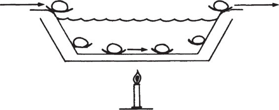

# Chapter 1: The Basics of Production — Part 2

> **High Output Management** — Andrew S. Grove
> *Quality, Inspection, Inventory, Adding Value, and Systemic Thinking*

Part 1 covered the foundational concepts: the breakfast factory metaphor, the limiting step, time offsets, the three production operations (process/assembly/test), and the four-way capacity trade-off. Part 2 covers the second half of Chapter 1, where Grove scales the breakfast factory into a high-volume continuous operation and introduces concepts that become even more important at scale: the trade-off between efficiency and flexibility, three types of quality inspection, inventory management, the principle of adding value, and the powerful rule of detecting problems at the lowest-value stage. He closes with a striking application of production thinking to the criminal justice system — demonstrating that these principles apply far beyond breakfast or semiconductors.

## Table of Contents

- [Continuous Operations: The Efficiency–Flexibility Trade-off](#continuous-operations-the-efficiencyflexibility-trade-off)
  - [The Continuous Egg-Boiler](#the-continuous-egg-boiler)
  - [What You Gain and What You Lose](#what-you-gain-and-what-you-lose)
- [Quality Control: Three Types of Inspection](#quality-control-three-types-of-inspection)
  - [Functional Testing](#functional-testing)
  - [In-Process Inspection](#in-process-inspection)
  - [Receiving Inspection](#receiving-inspection)
  - [The Hierarchy of Inspection](#the-hierarchy-of-inspection)
- [Inventory and the Concept of "Opportunity at Risk"](#inventory-and-the-concept-of-opportunity-at-risk)
  - [How Much Inventory to Carry](#how-much-inventory-to-carry)
  - [Opportunity at Risk](#opportunity-at-risk)
- [Adding Value: The Core Principle](#adding-value-the-core-principle)
  - [Detect Problems at the Lowest-Value Stage](#detect-problems-at-the-lowest-value-stage)
- [The Criminal Justice System as a Production Flow](#the-criminal-justice-system-as-a-production-flow)
  - [When the Wrong Step Limits the Process](#when-the-wrong-step-limits-the-process)
- [Chapter 1 Synthesis: The Production Lens for Everything](#chapter-1-synthesis-the-production-lens-for-everything)

**Block types in this chapter:** [Core Concept] [Modern Lens] [Senior EM Application] [SRE Lens] [Production Thinking] [Practical Toolkit] [Anti-Pattern] [AI & Automation] [Grove vs. Modern] [Metrics That Matter] [Scenario] [Mental Model] [Go Deeper]

---

## Continuous Operations: The Efficiency–Flexibility Trade-off

### The Continuous Egg-Boiler

Grove scales the breakfast factory into a high-volume operation. Instead of a waiter boiling eggs one at a time, you buy a **continuous egg-boiler** — a machine that takes in raw eggs at one end and outputs a constant supply of perfectly boiled three-minute eggs at the other. You match it with a continuous toaster. Specialized personnel load equipment and deliver product.


*Grove's continuous egg-boiler: eggs enter from the left, travel through heated water, and emerge perfectly boiled on the right. A constant, predictable supply — but only of three-minute eggs. This is automation at scale: high throughput, consistent quality, zero flexibility.*

### What You Gain and What You Lose

Grove is explicit about the trade-off:

**You gain:**
- **Lower cost** — automation replaces manual labor for repetitive tasks
- **More predictable quality** — the machine produces the same output every time, removing human variability

**You lose:**
- **Flexibility** — *"it cannot now readily provide a four-minute egg, because automated equipment is not very flexible."*
- **Customization** — *"we can no longer prepare each customer's order exactly when and how he requests it."*

Grove frames this as a contract with the customer: *"our customers have to adjust their expectations if they want to enjoy the benefits of our new mode."*

> **[Core Concept: The Efficiency–Flexibility Trade-off]**
>
> This is one of the most important trade-offs in all of operations, and Grove states it with remarkable clarity: **continuous operations deliver lower cost and higher consistency, at the expense of flexibility.** You cannot have both maximum efficiency and maximum flexibility. Every system sits somewhere on a spectrum:
>
> | | Flexible (Craft) | | Efficient (Continuous) |
> |--|---|---|---|
> | **How it works** | Each item produced individually, to order | Batched production, some standardization | Fully automated, standardized output |
> | **Breakfast** | One waiter, one customer, custom eggs | Kitchen with batch equipment, standard menu | Continuous egg-boiler, fixed three-minute eggs |
> | **Software** | Custom-built feature per customer request | Standard platform with configurable options | Fully automated CI/CD with golden paths and templates |
> | **SRE** | Manual incident response per incident | Runbooks for known scenarios | Auto-remediation, self-healing systems |
> | **Cost** | Highest per unit | Moderate | Lowest per unit |
> | **Quality variance** | High (depends on the individual) | Moderate | Low (machine-consistent) |
> | **Flexibility** | Maximum — any request | Moderate — within the menu | Minimum — only what's designed |
>
> **The trap:** Many organizations try to be fully flexible AND fully efficient simultaneously. They build a "platform" (efficiency) but allow unlimited exceptions (flexibility). The result: the worst of both worlds. The platform is never complete because exceptions keep proliferating, and the exceptions are expensive because they don't benefit from platform economies.
>
> **Grove's principle applied to your decisions:** When you build a shared platform, golden path, or standardized process, you are choosing the continuous egg-boiler. Be explicit with your stakeholders about what you're gaining (speed, consistency, lower cost) and what you're giving up (custom requests take longer or aren't supported). The conversation is not "should we standardize?" but "where on the flexibility–efficiency spectrum should we sit, and who needs to adjust their expectations?"

> **[SRE Lens: The Automation Spectrum in Operations]**
>
> Grove's continuum from "waiter making one breakfast at a time" to "continuous egg-boiler" maps directly to the SRE automation maturity journey:
>
> | Stage | Grove Equivalent | SRE Practice | Example |
> |-------|-----------------|--------------|---------|
> | **1. Manual** | Waiter makes each breakfast individually | SSH into servers, manually run commands, debug by reading logs | Engineer manually restarts a crashed pod, reads logs in terminal |
> | **2. Documented** | Waiter follows a recipe card | Written runbooks that a human executes step-by-step | Runbook says "check service health, then restart, then verify" — human does each step |
> | **3. Semi-automated** | Kitchen with timers and batch equipment | Scripts that automate parts of the response, human triggers them | Bash script that restarts the service and verifies health — human decides when to run it |
> | **4. Fully automated** | Continuous egg-boiler | Auto-remediation — system detects and fixes known issues without human intervention | Kubernetes liveness probes auto-restart unhealthy pods. PagerDuty + Rundeck auto-runs remediation. |
> | **5. Self-healing** | Egg-boiler that also auto-adjusts temperature | Systems that not only fix symptoms but adapt to prevent recurrence | Auto-scaling adjusts capacity before load spikes hit. Circuit breakers isolate failures. Canary deployments auto-rollback on SLO violation. |
>
> **Grove's warning applies at every level:** Each step up gains efficiency and consistency but loses flexibility. A self-healing system that auto-rolls back any deployment with elevated error rates is great — until you're deploying a migration that *intentionally* causes brief elevated errors during switchover. The automation doesn't know the difference. You need escape hatches, overrides, and human judgment about *when* to bypass the machine.
>
> **The toil connection:** Google SRE defines toil as "manual, repetitive, automatable, tactical, devoid of long-term value." The journey from stage 1 to stage 5 is literally the journey of eliminating toil. But Grove warns that automation isn't free — the egg-boiler can break in new ways the manual waiter never faced (temperature drift, described next). Every layer of automation introduces new failure modes that require new monitoring. This is why SRE teams that automate away toil must *simultaneously* invest in observability for the automation itself.
>
> **Practical rule:** Automate the response to incidents that (a) happen frequently, (b) have well-understood remediation, and (c) where the blast radius of incorrect automation is bounded. Keep manual response for novel incidents where context and judgment matter. This is the "three-minute eggs on the machine, four-minute eggs by hand" principle.

> **[Senior EM Application: Platform Engineering as the Continuous Egg-Boiler]**
>
> The most direct modern analog to Grove's continuous egg-boiler is the **internal developer platform (IDP)**. Platform engineering teams build standardized "golden paths" — pre-configured CI/CD pipelines, infrastructure templates, observability stacks, security-compliant deployment patterns — that product teams consume.
>
> The parallel to Grove is exact:
>
> | Continuous Egg-Boiler | Internal Developer Platform |
> |----------------------|---------------------------|
> | Produces a constant supply of three-minute eggs | Produces a constant supply of production-ready deployments |
> | Cannot readily produce four-minute eggs | Cannot readily accommodate non-standard tech stacks or unique deployment patterns |
> | Customers adjust expectations for lower cost and consistent quality | Product teams adopt the golden path in exchange for faster, safer, cheaper deployments |
> | Requires specialized personnel to load and maintain | Requires a dedicated platform team to build and support |
> | New failure modes (temperature drift) require new monitoring | Platform outages become cross-org incidents; platform monitoring is critical |
>
> **The Senior EM decision:** If you're evaluating whether to build or invest in a platform, Grove's framework clarifies the question. Ask:
> - **What % of your work is "three-minute eggs"?** If 80%+ of deployments follow a standard pattern, the platform (continuous operation) is worth it. If every deployment is unique, you need flexible craft (waiters).
> - **What's the cost of exceptions?** When a team can't use the platform, what does the workaround cost? If exceptions are rare and cheap, the platform's rigidity is fine. If exceptions are frequent and expensive, the platform needs more flexibility.
> - **Who "adjusts expectations"?** Product teams must accept the platform's constraints. This requires organizational agreement — a platform that nobody adopts is a waste. Grove says the customer adjusts expectations in exchange for benefits. The platform team must make the benefits (speed, reliability, lower cognitive load) genuinely compelling enough that teams *want* to adopt.

> **[Modern Lens: Microservices, Containers, and the New Flexibility–Efficiency Frontier]**
>
> When Grove wrote in 1983, the efficiency–flexibility trade-off was relatively fixed: you chose a point on the spectrum and lived with it. Modern technology has partially *shifted the frontier* — making it possible to be more efficient AND more flexible than before:
>
> - **Containers and Kubernetes:** Standardized packaging (efficiency) that can run any workload (flexibility). The container is a "standard egg shape" that the egg-boiler can handle, regardless of what's inside.
> - **Microservices:** Each service can be a separate "production line" optimized for its specific output, while the assembly layer (API gateway, service mesh) composes them flexibly. You can have a three-minute-egg service AND a four-minute-egg service, each optimized.
> - **Infrastructure as Code (Terraform, Pulumi):** Standardized infrastructure provisioning (efficiency) with parameterized configurations (flexibility). The "egg-boiler" has adjustable temperature settings.
> - **Feature flags:** Deploy one standard artifact (efficiency) and customize behavior per customer segment at runtime (flexibility). The breakfast comes off one production line but each plate can be configured differently.
>
> **But the fundamental trade-off still holds.** Even with all these tools, there is still a cost to flexibility. Microservices introduce network complexity. Feature flags create combinatorial testing challenges. Configurable infrastructure is harder to reason about than fixed infrastructure. Grove's insight remains: you're always trading off, the question is where you set the dial. Modern tools give you better dials, not a magic setting that eliminates the trade-off.

---

## Quality Control: Three Types of Inspection

Grove now asks: what can go wrong with the continuous egg-boiler? And — critically — *how do you detect problems?*

He introduces three distinct types of quality inspection, each catching problems at a different point in the production flow.

### Functional Testing

> *"Performing a* functional test *is one way. From time to time you open an egg as it comes out of the machine and check its quality. But you will have to throw away the egg tested."*

A functional test examines the **finished output** to determine if it meets specifications. You check a completed egg by cracking it open. The test answers: "Is this output good?" But it has two significant costs:
1. **It destroys the product being tested** — the cracked egg can't be served
2. **It only catches problems after they've occurred** — by the time you find a bad egg, many more bad eggs may have already been produced and served

### In-Process Inspection

> *"A second way involves* in-process inspection, *which can take many forms. You could, for example, simply insert a thermometer into the water so that the temperature could be easily and frequently checked. To avoid having to pay someone to read the thermometer, you could connect an electronic gadget to it that would set off bells anytime the temperature varied by a degree or two."*

In-process inspection monitors the **process itself** rather than the output. Instead of checking every egg, you check the *water temperature* — the condition that produces good eggs. If the temperature drifts, you know the eggs are at risk *before* you serve a bad one.

Grove's key principle:

> *"Whenever possible, you should choose in-process tests over those that destroy product."*

### Receiving Inspection

> *"The eggs going into it could be cracked or rotten, or they could be over- or undersized, which would affect how fast they cook. To avoid such problems, you will want to look at the eggs at the time of receipt, something called* incoming *or* receiving inspection."

Receiving inspection checks the **raw materials** before they enter the production process. You inspect the eggs when the supplier delivers them — checking for cracks, rot, and size consistency. If the inputs are bad, no amount of process control will produce good outputs.

### The Hierarchy of Inspection

> **[Core Concept: The Three Inspections — A Hierarchy of Quality Control]**
>
> Grove establishes a clear hierarchy, from least to most effective:
>
> | Inspection Type | What It Checks | When It Catches Problems | Cost of Catching Late | Grove's Breakfast Example |
> |----------------|---------------|------------------------|----------------------|-------------------------|
> | **Functional test** | Finished output | After production is complete | Highest — bad outputs may have already reached customers; product destroyed by testing | Crack open a finished egg — destroys the egg, only catches problems already in the pipeline |
> | **In-process inspection** | Process conditions | During production | Moderate — catches drift before outputs go bad, but some WIP may be affected | Thermometer in the water — detects temperature drift before eggs are ruined |
> | **Receiving inspection** | Raw materials / inputs | Before production begins | Lowest — prevents bad inputs from entering the system at all | Check eggs at delivery — rejects cracked or rotten eggs before boiling |
>
> **The principle:** Catch problems as early as possible — ideally before they enter the production flow at all. Every step deeper into the process that a defect travels, the more expensive it becomes to detect and fix.
>
> **The preference order:**
> 1. **Best:** Receiving inspection — prevent bad inputs from entering
> 2. **Next best:** In-process inspection — detect drift before outputs degrade
> 3. **Last resort:** Functional testing — verify finished output (expensive, after the fact)
>
> This doesn't mean functional testing is useless — it's the final safety net. But relying *primarily* on functional testing is the most expensive and least effective quality strategy. Most organizations do exactly this: they wait until the end to test, then scramble to fix the problems they discover. Grove is saying: move your quality checks upstream.

> **[SRE Lens: The Three Inspections in Reliability Engineering]**
>
> Grove's three inspections map directly to how SRE teams should think about quality gates:
>
> | Grove's Inspection | SRE Implementation | Example |
> |-------------------|-------------------|---------|
> | **Receiving inspection** (check raw materials before they enter production) | **Pre-merge checks and PR-level validation** — catch problems before code enters the main branch | Linting, static analysis, unit tests in CI, security scanning (SAST), dependency vulnerability checks, architecture fitness functions. These are "egg inspection at delivery" — reject bad inputs before they enter the production pipeline. |
> | **In-process inspection** (monitor production conditions continuously) | **SLO monitoring, real-time observability, canary analysis** — monitor the production process continuously for drift | SLO burn-rate alerts, latency percentile dashboards, error rate monitoring, resource utilization tracking, deployment canary analysis. These are "thermometer in the water" — they detect when conditions are drifting before customers are affected. |
> | **Functional testing** (check finished output, at a cost) | **Synthetic monitoring, periodic health checks, chaos experiments** — test the output by consuming it | Synthetic transactions that simulate user workflows every 60 seconds, periodic load tests, chaos engineering experiments that intentionally break things to test recovery. These are "cracking open the egg" — they consume test resources and only catch problems at check intervals. |
>
> **The SRE quality strategy, in order of investment priority:**
>
> 1. **Invest most in receiving inspection:** Shift left. Catch bugs, performance regressions, and security issues in CI before merge. A bug caught in a PR costs minutes to fix. The same bug caught in production costs hours to triage, plus customer impact, plus error budget burn, plus postmortem time.
>
> 2. **Invest next in in-process inspection:** Build comprehensive observability. SLO-based monitoring on real traffic is the thermometer in the water — it tells you the system is drifting *before* customers notice. This is where most SRE teams should be spending the bulk of their reliability engineering effort.
>
> 3. **Use functional testing as a safety net, not the primary strategy:** Synthetics and chaos experiments have value, but they're the most expensive form of inspection (they consume resources, they only catch problems at test intervals, and they can't cover all failure modes). They should complement, not replace, in-process monitoring.
>
> **The failure mode Grove warns about:** If you crack open every egg (run full integration tests on every change), you waste massive resources. If you only check the thermometer (only look at aggregate metrics), you miss specific bad outputs. If you only inspect at receiving (only run unit tests), you miss system-level interactions. The answer is all three, properly weighted — with the heaviest investment in receiving and in-process, and functional testing as the final safety net.

> **[Production Thinking: Shift-Left Testing IS Grove's Receiving Inspection]**
>
> The modern software movement of "shift-left testing" — moving tests earlier in the development lifecycle — is directly based on Grove's principle, even though most practitioners don't cite him. The progression:
>
> ```
> TRADITIONAL (functional test oriented):
>
>   Code → Code → Code → Code → [BIG TEST AT THE END] → Fix → Retest → Ship
>                                        ↑
>                         Problems found here are expensive
>
> SHIFT-LEFT (receiving + in-process oriented):
>
>   [Lint] → Code → [Unit test] → [PR review] → [Integration test] → [Canary] → Ship
>     ↑         ↑           ↑             ↑               ↑              ↑
>   Receiving  In-process  Receiving   Receiving     In-process    Functional
>   inspection inspection  inspection  inspection    inspection      test
> ```
>
> Every stage is a quality gate. The earliest gates (linting, unit tests) are Grove's receiving inspection — they reject bad inputs before they enter the more expensive downstream stages. The middle gates (integration tests, canary analysis) are in-process inspection. The final gate (production monitoring) is functional testing — checking actual customer-facing output.
>
> **The cost curve Grove implies:**
>
> | Where defect is caught | Cost to fix (approximate) |
> |----------------------|--------------------------|
> | IDE / pre-commit (receiving) | Seconds to minutes |
> | CI / pre-merge (receiving) | Minutes to hours |
> | Staging / pre-deploy (in-process) | Hours to a day |
> | Canary / early production (in-process) | Hours plus limited customer impact |
> | Full production (functional test) | Hours to days plus customer impact, error budget burn, incident response cost, postmortem |
> | Customer-reported (no test at all) | Days to weeks plus trust damage, potential revenue loss, public embarrassment |
>
> This curve is exponential, not linear. Grove doesn't quantify it precisely, but the principle is clear: **every stage deeper that a defect travels, the cost of fixing it roughly multiplies by 10x.** This is sometimes called the "1-10-100 rule" in quality management — a dollar to prevent, ten to detect, a hundred to fix.

> **[AI & Automation: AI-Powered Inspection at Every Stage]**
>
> AI is transforming all three of Grove's inspection types, making each more effective:
>
> | Grove's Inspection | Traditional Approach | AI-Enhanced Approach |
> |-------------------|---------------------|---------------------|
> | **Receiving** (pre-merge) | Rule-based linting, static analysis, manually written unit tests | AI code review (CodeRabbit, Sourcery) catching logic errors and security issues that rule-based tools miss. AI-generated test cases covering edge cases humans overlook. AI-powered SAST tools with lower false-positive rates. |
> | **In-process** (monitoring) | Threshold-based alerting ("alert if error rate > 1%") | Anomaly detection ML models that learn normal patterns and alert on *any* deviation (Datadog ML monitors, Honeycomb BubbleUp, Moogsoft). SLO burn-rate prediction — "at current rate, error budget exhausts in 4 hours." |
> | **Functional** (end-to-end testing) | Scripted synthetic monitors, manual exploratory testing | AI-generated synthetic tests that explore unexpected paths. Visual regression testing AI (Percy, Applitools) catching UI changes. AI-powered chaos engineering that intelligently targets likely failure points. |
>
> **The new capability AI uniquely enables:** Connecting the inspections. Traditional tools at each stage operate independently — the linter doesn't know what the monitoring system sees. AI systems can correlate: "this PR changed the retry logic → the canary deployment shows increased latency on the retry path → the code change likely introduced a regression." This cross-stage correlation — connecting receiving inspection results to in-process inspection signals — is a capability Grove couldn't have imagined, but it's exactly what his framework calls for: catching problems at the lowest-value stage by using upstream signals to predict downstream failures.

> **[Scenario: The Silent Temperature Drift — When In-Process Inspection Fails]**
>
> Grove describes the egg-boiler's water temperature "quietly" going out of spec. The word "quietly" is key — the failure is silent. Everything looks normal until you crack open an egg and find it's undercooked.
>
> **In SRE terms, this is the gradual degradation failure mode:**
>
> Your service's P99 latency has been slowly increasing — from 200ms to 250ms to 300ms to 400ms over three months. No single change caused a spike. No alert fired because each day's increase was within the noise threshold. But cumulatively, customer experience has degraded significantly. Conversion rates are down 2%. Nobody noticed because nobody was watching the slow drift.
>
> **This is a failure of in-process inspection.** You had monitoring (the thermometer was installed), but your alerting was configured for acute failures (temperature drops to zero) not chronic drift (temperature slowly rises by 1 degree per day).
>
> **The fix — SLO-based monitoring with burn-rate alerting:**
>
> - **SLO:** 99.5% of requests complete within 300ms
> - **Error budget:** 0.5% of requests can exceed 300ms per 30-day rolling window
> - **Burn-rate alert:** "If error budget consumption rate exceeds 2x normal for 6 hours, page"
>
> This catches the slow drift that threshold alerts miss. When P99 creeps from 200ms to 300ms, the % of requests exceeding the SLO threshold gradually increases, the error budget burn rate rises, and the alert fires *before* the budget is exhausted — not after three months of silent degradation.
>
> **The meta-lesson:** Grove's distinction between functional testing (checking the output) and in-process inspection (checking the conditions) is the difference between **reactive** and **proactive** operations. Reactive: you find out there's a problem when customers complain. Proactive: you detect the drift in conditions that will eventually cause customer impact, and you fix it before they notice. The gap between these two is what separates SRE organizations that are constantly firefighting from those that are consistently ahead of problems.
>
> **[Metrics That Matter: In-Process Inspection Quality]**
>
> How do you know if your in-process inspection is working?
>
> | Metric | What It Tells You | Healthy Signal |
> |--------|------------------|----------------|
> | **% of incidents detected by monitoring vs. reported by customers** | Whether your "thermometer" catches problems before customers do | >80% detected internally |
> | **MTTD (mean time to detect)** | How fast your inspection catches problems after they begin | <5 min for P1 incidents |
> | **Alert signal-to-noise ratio** | Whether your alerts are meaningful or crying wolf | >80% of alerts are actionable |
> | **False positive rate** | Whether your thermometer is properly calibrated | <20% of pages are false alarms |
> | **Time between failure start and customer impact** | Your buffer zone — how much warning your inspection gives you | Enough time to mitigate before SLO breach |

---

## Inventory and the Concept of "Opportunity at Risk"

### How Much Inventory to Carry

Grove introduces inventory through a practical problem: if the eggs delivered to your factory are bad (cracked, rotten, wrong size), you reject them — but now you have *no eggs*. Your factory shuts down.

The solution: **raw material inventory**. Keep extra eggs on hand so that a bad delivery doesn't stop production.

But how much? Grove gives a clear formula:

> *"You should have enough to cover your consumption rate for the length of time it takes to replace your raw material."*

If your egg supplier delivers once a day, keep one day's worth of eggs. If the supplier delivers twice a day, keep half a day's worth. The principle: **inventory = consumption rate × replacement time.**

But inventory isn't free:

> *"Remember, inventory costs money, so you have to weigh the advantage of carrying a day's supply against the cost of carrying it."*

### Opportunity at Risk

Then Grove introduces a concept that elevates inventory from a simple calculation to a strategic decision: **opportunity at risk.**

> *"What would it cost if you had to shut your egg machine down for a day? How many customers would you lose? How much would it cost to lure them back? Such questions define the opportunity at risk."*

The cost of running out of inventory isn't just the lost revenue for the day. It includes:
- **Customers lost permanently** — some won't come back
- **Cost to win them back** — marketing, discounts, reputation repair
- **Cascade effects** — if the egg machine stops, the toast is wasted too (all downstream work is wasted)
- **Opportunity cost** — what else could the idle workers be doing?

> **[Core Concept: Inventory = Insurance Against Disruption, Priced by Opportunity at Risk]**
>
> Grove's inventory formula is deceptively simple: keep enough to cover your consumption during the replacement cycle. But the *strategic* question is the one most managers miss: **how do you price the downside of running out?**
>
> That's what "opportunity at risk" answers. It's not "how much do the eggs cost?" It's "what happens to your entire operation — and your customers — if you run out?"
>
> **The calculation:**
> ```
> Inventory cost = (units stored) × (cost per unit) × (carrying cost rate)
>
> Stockout cost  = (lost revenue during downtime)
>                + (customers permanently lost × lifetime value)
>                + (cost to recover reputation)
>                + (downstream waste — all partially completed work)
>                + (idle worker cost)
>
> Optimal inventory: where marginal inventory cost ≈ marginal reduction in stockout risk
> ```
>
> For a breakfast factory, this is straightforward. For a software organization, "opportunity at risk" is the concept that justifies investments that seem expensive in isolation but are cheap compared to the cost of failure.

> **[SRE Lens: Redundancy as Inventory — How SRE Teams Apply Grove's Principle]**
>
> In SRE, "inventory" manifests as **redundancy** — extra capacity, replicated data, pre-provisioned failover systems. Grove's formula and "opportunity at risk" concept directly inform every redundancy decision:
>
> | SRE Inventory Type | What It Is | Cost | Opportunity at Risk (What Happens Without It) |
> |-------------------|-----------|------|----------------------------------------------|
> | **Spare capacity (over-provisioning)** | Running more servers/pods than current load requires | Extra compute cost — can be 20-50% above baseline | Auto-scaling can't react fast enough to traffic spikes; requests timeout; SLO breached; error budget burns |
> | **Multi-region deployment** | Running the service in 2+ geographic regions | 2x+ infrastructure cost, plus data replication complexity | Single-region outage takes the service offline globally; MTTR becomes hours (waiting for region recovery) instead of minutes (failover) |
> | **Database replicas** | Read replicas, cross-region replication, backups | Storage cost, replication lag management, operational complexity | Primary database failure means data loss and extended outage; recovery from backup takes hours |
> | **Cached data (CDN, Redis, etc.)** | Pre-computed or pre-fetched copies of frequently accessed data | Memory/storage cost, cache invalidation complexity | Every request hits the origin; latency increases; origin overloaded during traffic spikes |
> | **Pre-staged rollback artifacts** | Previous known-good version ready for instant deployment | Storage cost (minimal), pipeline complexity to maintain | Bad deployment requires rebuilding the previous version — rollback takes 30 min instead of 2 min |
> | **Runbook inventory** | Pre-written procedures for known failure scenarios | Engineering time to write and maintain; stale runbook risk | On-call engineers facing unfamiliar scenarios must investigate from scratch; MTTR increases 3-10x |
>
> **Applying Grove's formula to capacity planning:**
>
> ```
> Spare capacity = peak consumption rate × time to scale up
>
> If: peak traffic = 10,000 RPS
>     auto-scaling takes 3 minutes to add capacity
>     traffic can spike by 50% in those 3 minutes
>
> Then: spare capacity = 5,000 RPS of headroom at all times
> ```
>
> **Applying "opportunity at risk" to justify redundancy investments:**
>
> The question isn't "how much does multi-region cost?" It's "what happens if a region goes down and we're NOT multi-region?"
>
> ```
> Multi-region annual cost:     $500K additional infrastructure
> Single-region outage risk:    1 event per year (historical average)
> Average outage duration:      4 hours
> Revenue impact:               $200K/hour (for an e-commerce service)
> Customer lifetime value lost:  $300K (churn from extended outage)
> SLA penalty:                  $100K (contractual)
>
> Opportunity at risk:          ($200K × 4) + $300K + $100K = $1.2M
>
> Multi-region ROI:             $1.2M risk / $500K cost = 2.4x
> ```
>
> This is exactly the calculation Grove is teaching — but applied to infrastructure instead of eggs. Most SRE teams know intuitively that redundancy is important, but Grove gives you the *vocabulary* to justify it to finance and leadership: "The opportunity at risk is $1.2M. The inventory cost is $500K. The insurance is worth it."

> **[Senior EM Application: The Hidden Inventories in Your Organization]**
>
> Grove's inventory concept extends beyond obvious things like server capacity. As a Senior EM, you maintain several "inventories" that most managers don't explicitly think about:
>
> | Hidden Inventory | What It Is | Why You Need It | Cost of Running Out |
> |-----------------|-----------|-----------------|-------------------|
> | **Hiring pipeline** | Pre-screened candidates ready for interviews | Attrition is unpredictable; when someone leaves, you need to start hiring immediately | Position open for 3-6 months instead of 1-2; team is understaffed; remaining engineers burn out |
> | **Cross-trained engineers** | People who can cover multiple services or roles | On-call coverage, vacation coverage, attrition resilience | Single points of failure; one person's departure cripples a service; vacation guilt |
> | **Technical design inventory** | Pre-made design docs, architecture templates, RFC frameworks | New projects need design foundations; without templates, every project starts from scratch | Every design effort reinvents the wheel; quality varies wildly; time to first PR increases |
> | **Political capital** | Goodwill and trust accumulated with stakeholders | You need to spend it during hard conversations (budget cuts, deadline extensions, org changes) | When you need to push back or escalate, you have no credibility; your requests are denied |
> | **Error budget** | Remaining tolerance for failure before SLO breach | Operational buffer that allows you to take risks (deployments, migrations, experiments) | Feature freeze; no deployments allowed; team is stuck in defensive mode |
>
> **The "opportunity at risk" for each:**
> - Running out of **hiring pipeline** → months of understaffing → burnout → more attrition → vicious cycle
> - Running out of **cross-trained engineers** → a single departure causes a production risk
> - Running out of **political capital** → you can't protect your team from unreasonable demands
> - Running out of **error budget** → you lose the ability to ship, experiment, or take any risk
>
> Grove's principle: size your inventory to cover your consumption rate during the replacement time. For hiring: if attrition rate is 15%/year on a 10-person team (1.5 departures/year) and time-to-fill is 3 months, you should always have at least one candidate in the late stages of your pipeline. For cross-training: if any engineer's departure would leave a service uncovered, you need to start cross-training *now* — the "replacement time" for tribal knowledge is months, not weeks.

---

## Adding Value: The Core Principle

Grove now introduces a concept that ties everything together:

> *"All production flows have a basic characteristic: the material becomes more valuable as it moves through the process."*

He walks through the value chain explicitly:
- A **raw egg** has some value
- A **boiled egg** is more valuable (process manufacturing added value)
- A **fully assembled breakfast** (egg + toast + coffee) is more valuable still (assembly added value)
- The **breakfast placed in front of the customer** at "Andy's Better Breakfasts" is most valuable of all (the brand, the service, the experience add value)

Similarly:
- A **college student** on campus has some potential value to the company
- A **college student who has passed phone screening** is more valuable (investment in evaluation)
- A **candidate with a completed plant visit** is more valuable still (substantial investment in evaluation)
- A **candidate with an accepted offer** is the most valuable (the entire pipeline's investment is concentrated here)

### Detect Problems at the Lowest-Value Stage

From this principle, Grove derives what may be the single most important operational rule in the chapter:

> *"A common rule we should always try to heed is to detect and fix any problem in a production process at the* lowest-value stage *possible."*

His examples:
- **Find the rotten egg at delivery** (receiving inspection — lowest value stage) rather than having the customer discover it (highest value stage, maximum waste)
- **Reject a college candidate at the campus interview** (low investment) rather than during the plant visit (high investment — travel costs, manager time already spent)
- **Find the compiler bug in the unit test** (individual component — low assembly value) rather than in the system test (full product — maximum rework cost)

> **[Core Concept: Detect Problems at the Lowest-Value Stage]**
>
> This is the governing principle behind all of Grove's inspection types. It's simple to state but profound in its implications:
>
> **Every step in a production process adds value. Every defect that passes a step wastes all the value added from that point on.**
>
> A rotten egg caught at delivery wastes nothing — just the cost of one raw egg. A rotten egg discovered by the customer wastes: the boiling time, the toast, the coffee, the assembly labor, the server's delivery time, the customer's meal experience, and potentially the customer's future business.
>
> Stated as a formula:
> ```
> Waste from a defect = Σ (value added at each stage the defect passed through)
>                     + customer impact if the defect reaches the customer
>                     + rework cost to fix the defect
>                     + opportunity cost of the rework time
> ```
>
> **This principle is not about being cheap or cutting corners.** It's about being *strategically vigilant at the right points.* Invest in catching problems where catching them is cheapest — at the inputs and during the process — rather than at the output where the sunk cost is highest.

> **[SRE Lens: The Cost Multiplier of Production Defects]**
>
> For SRE teams, Grove's "lowest-value stage" principle has a very concrete implication: **the cost of a defect in production is orders of magnitude higher than the cost of the same defect caught earlier.**
>
> Here's why the multiplier is so high in operations specifically:
>
> | Defect Caught At | Direct Cost | Indirect Cost | Total Approximate Multiplier |
> |-----------------|------------|---------------|----------------------------|
> | **PR review** (lowest value) | Developer fixes in minutes | None | **1x** (baseline) |
> | **CI pipeline** | Developer investigates, fixes, re-runs pipeline | Pipeline blocked for other PRs during investigation | **5-10x** |
> | **Staging / pre-production** | Developer investigates, deploys fix to staging, re-validates | Staging environment may be shared; other teams blocked | **10-50x** |
> | **Canary (1% production)** | Automated rollback + developer investigation + re-deploy | Small customer impact, error budget consumed, incident declared | **50-100x** |
> | **Full production** | Incident response: page on-call, incident bridge, mitigation, root cause analysis, fix, deploy, validate, postmortem | Customer impact at scale, SLO violation, error budget burned, trust damage, postmortem time for 5+ people, potential revenue loss | **100-1000x** |
> | **Customer-reported (no detection)** | All of the above + delayed detection | Extended customer impact, reputational damage, potential media coverage, regulatory implications | **1000x+** |
>
> **This is why "shift left" isn't just a buzzword — it's a direct application of Grove's most important production principle.** Every dollar invested in catching defects earlier saves 10-1000 dollars catching them later. This is the economic argument for:
> - **Better CI pipelines** (automated receiving inspection)
> - **Comprehensive observability** (automated in-process inspection)
> - **Canary deployments** (early functional testing with bounded blast radius)
> - **Pre-merge security scanning** (receiving inspection for vulnerabilities)
> - **Architecture fitness functions** (receiving inspection for systemic properties)
>
> **The Senior EM argument to leadership:** "We want to invest $200K in improving our CI pipeline and observability stack. Here's why: last quarter, we had 12 production incidents. 8 of them were defects that *could* have been caught in CI with better testing, or detected by monitoring before customers noticed. Each production incident cost an average of $50K in engineering time, customer impact, and error budget. That's $400K in waste that a $200K investment would largely prevent. The ROI is 2x in the first quarter alone." This is Grove's "opportunity at risk" argument applied directly.

> **[Mental Model: The Swiss Cheese Model of Defect Detection]**
>
> James Reason's Swiss Cheese Model (originally for accident causation) is the perfect visual for Grove's multi-layer inspection approach:
>
> ```
> Defect →  [Receiving]  →  [In-Process]  →  [Functional]  →  Customer
>              Inspection      Inspection       Test
>
>            ┌──────────┐   ┌──────────┐   ┌──────────┐
>            │  ○       │   │      ○   │   │   ○      │
>            │     ○    │   │  ○       │   │       ○  │
>            │  ○    ○  │   │     ○    │   │  ○       │
>            └──────────┘   └──────────┘   └──────────┘
>               Slice 1        Slice 2        Slice 3
> ```
>
> Each inspection layer is a "slice of cheese" — it catches *most* defects but has holes (gaps in coverage). No single slice is perfect. The key to safety is that the **holes don't align** — what one layer misses, the next catches.
>
> **Applied to SRE:**
> - **Slice 1 (Receiving):** CI tests, linting, security scans — catches most obvious bugs but misses system-level interactions, performance regressions under load, and configuration issues
> - **Slice 2 (In-Process):** SLO monitoring, canary analysis, performance baselines — catches degradation and interaction bugs but misses rare edge cases and long-tail failures
> - **Slice 3 (Functional):** Synthetic monitoring, chaos experiments, game days — catches resilience gaps and rare scenarios but can't test every possible failure mode
>
> A customer-facing incident means the defect passed through ALL slices. Your job isn't to make each slice perfect (impossible) — it's to ensure the holes are in different places and as small as practical.

---

## The Criminal Justice System as a Production Flow

Grove closes Chapter 1 with a bold application of production thinking to a completely different domain: the criminal justice system. He treats it as a production flow whose purpose is "finding criminals and putting them into jail."

The flow, as Grove describes it:

```
Crime reported → Police respond → Investigation → Arrest → Build case →
  Indictment → Trial → Conviction → Sentencing/Appeals → Jail
```

At each stage, cases drop out:
- Many reported crimes lead to no further action
- Many investigations end for lack of evidence
- Many arrests don't result in indictment
- Many trials end in acquittal or dismissal
- Some convictions result in suspended sentences
- Some convictions are overturned on appeal
- **Only a very small fraction** of the original flow makes it all the way to jail

### When the Wrong Step Limits the Process

Grove then does the math: if you add up all the costs of the entire system (police, investigators, prosecutors, courts, judges, juries) and allocate them only to those criminals who actually end up in jail, **the cost per conviction works out to well over a million dollars.** This is because the vast majority of cases drop out at various stages, but the system's costs are incurred at every stage for every case.

Then the devastating insight:

> *"Everyone knows that prisons are overcrowded, and that many criminals end up serving shorter jail terms or no jail terms at all because cells are in such short supply."*

The **cost of building a jail cell** is about $80,000. The annual cost of keeping a person in jail is $10-20,000. These are tiny amounts compared to the million dollars invested in obtaining each conviction.

> *"Not to jail a criminal in whom society has invested over a million dollars for lack of an $80,000 jail cell clearly misuses society's total investment in the criminal justice system. And this happens because we permit the wrong step (the availability of jail cells) to limit the overall process."*

This is the **limiting step** principle applied devastatingly. The system's limiting step *should be* obtaining a conviction (the most expensive and difficult step). Instead, it's limited by jail capacity (a comparatively cheap resource). The result: massive systemic waste — society spends millions to convict people who then can't be jailed because there aren't enough $80K cells.

> **[Core Concept: Misidentified Limiting Steps Create Systemic Waste]**
>
> This is the capstone lesson of Chapter 1. Grove isn't just saying "find the bottleneck." He's saying something more powerful: **when the wrong step becomes the limiting step, the entire system's investment is wasted.**
>
> The criminal justice example is striking because:
> 1. The actual expensive step (investigation → conviction) costs millions per case
> 2. The step that limits the system (jail capacity) costs $80K per cell
> 3. The mismatch means millions of dollars of invested work is thrown away because the cheapest part of the system is under-resourced
>
> **The generalized principle:** Look at your entire production flow. Identify the most expensive step (where the most investment accumulates). Then ask: is the system limited by that step, or by something else that's comparatively cheap to fix? If the answer is the latter, you have a catastrophic misallocation of resources.

> **[Senior EM Application: Where This Shows Up in Engineering Organizations]**
>
> The criminal justice pattern — expensive work wasted because a cheap downstream resource is constrained — appears constantly in engineering:
>
> | Expensive Work (the "conviction") | Cheap Constraint (the "jail cell") | Waste Created |
> |---------------------------------|-----------------------------------|--------------|
> | 3 months of design + implementation + testing for a feature | Deployment window is only once per month (a "jail cell" shortage) | Feature sits for weeks after it's ready; value delivery delayed; team demoralizes |
> | 6 engineer-hours per candidate in on-site interviews (the hiring pipeline investment) | Offer approval takes 2 weeks because comp committee meets biweekly | Top candidates accept other offers while waiting; all interview time wasted |
> | 2 sprints of reliability engineering to reduce MTTR | Change advisory board takes 3 weeks to approve the production deployment | Reliability improvement delayed 3 weeks; incidents continue at the old rate; team's work sits idle |
> | Architecture review board invests 20 person-hours reviewing an RFC | Team can't get a staging environment to validate the architecture (environment shortage) | Design approved but can't be tested; risk surfaces later in production instead of staging |
> | On-call engineer spends 45 minutes diagnosing an incident, identifies the fix | Deploying the fix requires a full CI pipeline run (40 minutes) even for a one-line config change | Customer impact extends by 40 minutes; error budget burns unnecessarily |
>
> **In every case, the pattern is the same:** Significant upstream investment is wasted or delayed because a comparatively cheap downstream resource is constrained. The fix is almost always cheaper than the waste it causes — but the fix requires *seeing the system as a whole* rather than optimizing each stage independently.
>
> **The diagnostic question (from Grove's framework):** "What step is *actually* limiting our overall production, and is it the step that *should* be limiting it?" If your most expensive work (engineering time, design effort, candidate evaluation) is bottlenecked by your cheapest resource (deployment capacity, approval meetings, environments), you have a misidentified limiting step — and fixing it is almost always a high-leverage investment.

> **[SRE Lens: The Deployment Pipeline as Criminal Justice System]**
>
> The criminal justice parallel maps uncomfortably well to organizations with heavy change management processes:
>
> ```
> CRIMINAL JUSTICE:                    HEAVY CHANGE MANAGEMENT:
>
> Crime reported                       Feature requested
> Police investigate                   Developer investigates/designs
> Build case (expensive)               Implement + test (expensive)
> Trial (expensive)                    Code review + QA (expensive)
> Conviction (very expensive)          Ready for production (very expensive)
> [JAIL CAPACITY = LIMITING STEP]      [CAB APPROVAL = LIMITING STEP]
> Many convictions wasted              Many completed features sit in queue
> ```
>
> If your change advisory board meets once a week and reviews 20 changes in a 2-hour meeting (6 minutes per change), it doesn't matter how fast your teams code, review, and test. **The CAB is the jail cell** — the cheapest, most easily expanded resource that's constraining the entire system and wasting all the expensive upstream work.
>
> **Quantify it using Grove's "opportunity at risk" framework:**
>
> ```
> Average engineering investment per change:    40 engineer-hours
> Average CAB wait time:                        5 business days
> Changes waiting for CAB at any given time:    15
> Value of delayed changes:                     15 × 40 hours = 600 engineer-hours sitting idle
> Cost of expanding CAB capacity:               Move to daily 30-min reviews, or auto-approve
>                                               low-risk changes = ~10 hours/week of committee time
>
> ROI:  600 hours freed / 10 hours invested = 60x leverage
> ```
>
> This is Grove's criminal justice argument in miniature: you're wasting millions (engineer-hours) because of a constraint that costs almost nothing to fix (more frequent reviews or risk-based auto-approval).
>
> **The modern SRE solution:** Progressive delivery replaces the CAB model entirely. Instead of a committee approving changes before deployment, automated canary analysis validates changes *during* deployment. If the canary shows degradation, it auto-rolls back. If the canary is healthy, it promotes to full production. The "jail cell" (approval capacity) is replaced by automated verification — which scales infinitely and is faster than any committee. This is the production thinking Grove is teaching: when you identify the misidentified limiting step, sometimes the solution is to automate it out of existence.

> **[Production Thinking: Grove's Chapter 1 Principles as a Diagnostic Framework]**
>
> The criminal justice example ties together every concept from the chapter into a diagnostic framework you can apply to any system:
>
> | Diagnostic Question | Concept | What to Look For |
> |-------------------|---------|-----------------|
> | What is the limiting step? | Limiting step (egg, toaster, jail cell) | The stage that determines overall throughput — longest, most expensive, or most critical |
> | Is it the *right* limiting step? | Criminal justice example | Is the system bottlenecked by its most expensive step (good) or by a cheap downstream resource (waste)? |
> | Are we planning backward from delivery? | Time offsets | Is every upstream step timed to finish just as the limiting step needs it? Or are things sitting in queues? |
> | What are the process, assembly, and test operations? | Three operations | Can you identify each? Is test underweighted? Is assembly creating coordination overhead? |
> | What are our inspection layers? | Functional test / in-process / receiving | Where do we catch defects? How much escapes to the customer? |
> | Are we detecting problems at the lowest-value stage? | Adding value principle | Where in the flow are most defects discovered? If it's late, waste is high. |
> | What trade-offs are we making between equipment, manpower, inventory, and time? | Four-way trade-off | Are these trade-offs deliberate or accidental? |
> | What's our opportunity at risk? | Inventory / opportunity at risk | What's the cost of the system going down? Does our redundancy match that cost? |
> | Where are we on the flexibility–efficiency spectrum? | Continuous operations | Are we standardized where we should be? Flexible where we need to be? |

---

## Chapter 1 Synthesis: The Production Lens for Everything

Grove's first chapter establishes a complete vocabulary for understanding *any* productive system. Here's the full concept map:

```
                        PRODUCTION SYSTEM
                              │
              ┌───────────────┼───────────────┐
              │               │               │
         CONSTRAINTS     OPERATIONS       QUALITY
              │               │               │
    ┌────┬────┴────┐    ┌────┬┴───┐    ┌──────┼──────┐
    │    │         │    │    │    │    │      │      │
  Time Quality   Cost  Proc Asm Test Recv  In-Proc Func
    │    │         │                   │      │      │
    └────┴────┬────┘                   └──────┴──┬───┘
              │                                  │
        TRADE-OFFS                         INSPECTION
              │                            HIERARCHY
    ┌────┬────┴────┬────┐                    │
    │    │         │    │              Lowest-Value
  Equip  Man    Inven  Time            Stage Rule
              │
         ┌────┴────┐
         │         │
    Limiting   Time
      Step    Offsets
         │
    ┌────┴────┐
    │         │
  Right    Wrong
  Limit    Limit
  (good)   (waste)
```

> **[Go Deeper: The Full Reading List for Chapter 1]**
>
> Grove's Chapter 1 ideas have been extended, formalized, and applied by many subsequent thinkers. The complete map:
>
> | Concept | Grove's Treatment | Best Follow-Up Reading |
> |---------|------------------|----------------------|
> | Limiting step | Breakfast factory, recruiting, criminal justice | *The Goal* — Eliyahu Goldratt (1984). Theory of Constraints as a complete philosophy. |
> | Time offsets, production flow | Backward planning from the egg | *Critical Chain* — Eliyahu Goldratt (1997). TOC applied to project management. |
> | Three operations (process/assembly/test) | Breakfast, compiler, sales training | *Lean Software Development* — Poppendieck & Poppendieck (2003). Operations mapped to software. |
> | Efficiency–flexibility trade-off | Continuous egg-boiler vs. manual waiter | *The Second Machine Age* — Brynjolfsson & McAfee (2014). How automation reshapes this trade-off. |
> | Quality inspection hierarchy | Functional / in-process / receiving | *Out of the Crisis* — W. Edwards Deming (1982). The quality revolution that transformed manufacturing. |
> | Shift-left, lowest-value stage | Rotten egg at delivery vs. at the table | *Continuous Delivery* — Humble & Farley (2010). The deployment pipeline as a quality system. |
> | Inventory and opportunity at risk | Raw egg inventory, factory shutdown cost | *The Toyota Way* — Jeffrey Liker (2004). Just-in-time inventory and lean thinking. |
> | Production thinking applied to knowledge work | Introduction's "all employees produce" | *The DevOps Handbook* — Kim, Humble, Debois, Willis (2016). Factory thinking for software delivery. |
> | Value stream mapping | Implicit in Grove's flow diagrams | *Value Stream Mapping* — Karen Martin & Mike Osterling (2013). The practical technique. |
> | Observability as in-process inspection | Thermometer in the egg-boiler | *Observability Engineering* — Majors, Fong-Jones, Miranda (2022). Modern observability practice. |
> | SLOs/Error budgets as the production triad | Time/quality/cost | *Implementing Service Level Objectives* — Hidalgo (2020). SLOs as production constraints. |
> | Platform engineering as continuous operations | Continuous egg-boiler | *Team Topologies* — Skelton & Pais (2019). Platform teams as enabling infrastructure. |

---

*Part 2 completes Chapter 1. Next: Chapter 2 — Managing the Breakfast Factory (indicators, the black box, controlling future output, and the art of managing production operations at scale).*
