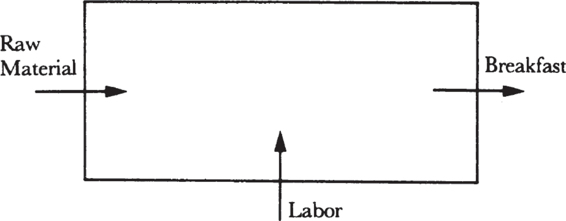
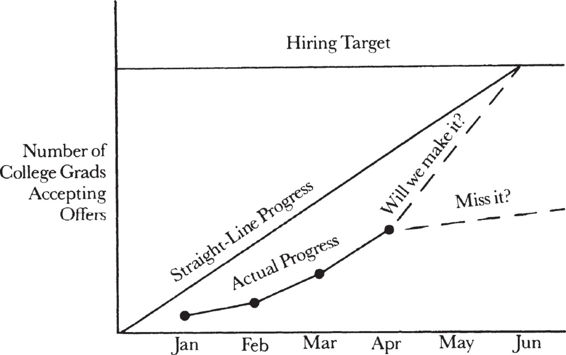
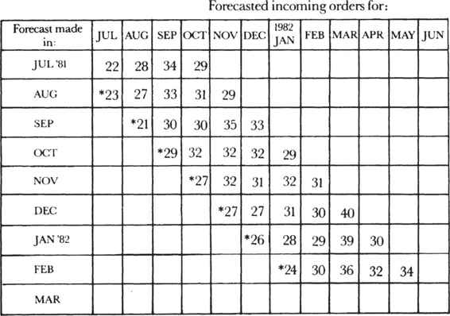
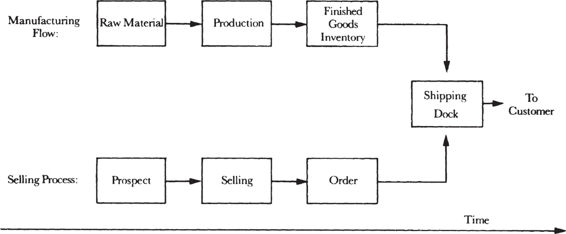

# Chapter 2: Managing the Breakfast Factory — Part 1

> **High Output Management** — Andrew S. Grove
> *Indicators, the Black Box, and Controlling Future Output*

Chapter 1 taught you to *design* a production system. Chapter 2 teaches you to *manage* one. The breakfast factory has scaled — you now have a substantial staff, automated equipment, and multiple production lines. The question shifts from "how do I make breakfast?" to "how do I know if the factory is running well, and how do I steer it?" Grove's answer: **indicators** — carefully chosen measurements that give you visibility into the factory's operation, warn you of problems before they hit, and let you control future output.

This chapter introduces the **black box** model of management (you can't see everything, so you cut windows into the box), the hierarchy of indicators (leading, trend, linearity, stagger charts), the critical distinction between building to order versus building to forecast, and the first mention of **leverage** — the concept that will become the book's central idea in Chapter 3.

## Table of Contents

- [The Five Key Indicators](#the-five-key-indicators)
  - [Grove's Five for the Breakfast Factory](#groves-five-for-the-breakfast-factory)
  - [Paired Indicators: Effect and Counter-Effect](#paired-indicators-effect-and-counter-effect)
  - [Output vs. Activity: The Cardinal Rule](#output-vs-activity-the-cardinal-rule)
- [The Black Box](#the-black-box)
  - [Cutting Windows into the Box](#cutting-windows-into-the-box)
  - [Leading Indicators](#leading-indicators)
  - [The Linearity Indicator](#the-linearity-indicator)
  - [Trend Indicators](#trend-indicators)
  - [The Stagger Chart](#the-stagger-chart)
- [Controlling Future Output](#controlling-future-output)
  - [Build to Order vs. Build to Forecast](#build-to-order-vs-build-to-forecast)
  - [Matching Two Parallel Flows](#matching-two-parallel-flows)
  - [Inventory as Slack](#inventory-as-slack)

**Block types:** [Core Concept] [Modern Lens] [Senior EM Application] [SRE Lens] [Production Thinking] [Practical Toolkit] [Metrics That Matter] [Anti-Pattern] [AI & Automation] [Scenario] [Mental Model] [Go Deeper]

---

## The Five Key Indicators

Grove poses a direct question: you arrive at your breakfast factory each morning. **Which five pieces of information would you want to look at immediately?**

### Grove's Five for the Breakfast Factory

| # | Indicator | What It Tells You | Why First Thing |
|---|----------|-------------------|-----------------|
| 1 | **Sales forecast** | How many breakfasts should you plan to deliver today? | Sets the day's production target |
| 2 | **Yesterday's variance** (plan vs. actual) | How many did you deliver yesterday versus what you planned? | Tells you how accurate your forecast is — calibrates confidence |
| 3 | **Raw material inventory** | Do you have enough eggs, bread, and coffee? | If too little, order more now. If too much, cancel today's delivery. |
| 4 | **Equipment condition** | Did anything break down yesterday? | If so, repair it or rearrange the production line before the day starts |
| 5 | **Manpower** | Are all your people available today? | If two waiters are sick, you need a plan now — temporary help, or reassign someone |

Grove adds a sixth that he calls a **quality indicator**: a customer complaint log maintained by the cashier. If a waiter generated more complaints than usual yesterday, speak to him first thing.

The key insight:

> *"All these indicators measure factors essential to running your factory. If you look at them early every day, you will often be able to do something to correct a potential problem before it becomes a real one during the course of the day."*

> **[Core Concept: Indicators Direct Attention — You Steer Where You Look]**
>
> Grove makes an observation that sounds simple but has profound implications:
>
> *"Indicators tend to direct your attention toward what they are monitoring. It is like riding a bicycle: you will probably steer it where you are looking."*
>
> This is both the power and the danger of measurement. If you measure inventory levels, you'll drive them down — which is good until your inventory becomes so lean that you can't respond to demand changes. If you measure deployment frequency, you'll push for more deploys — which is good until you sacrifice quality for speed.
>
> **The lesson:** Indicators are not neutral observers. They are *steering mechanisms*. Choose them carefully because your organization will optimize for whatever you measure, whether or not that's what you intended.

### Paired Indicators: Effect and Counter-Effect

Grove's solution to the steering problem: **pair indicators** so that both the effect and counter-effect are measured together.

> *"In the inventory example, you need to monitor both inventory levels and the incidence of shortages. A rise in the latter will obviously lead you to do things to keep inventories from becoming too low."*

He gives another example from compiler development: measuring the completion date of each module against its capability. Watching this pair prevents two failure modes: the perfect compiler that's never ready (quality over-optimized, delivery sacrificed) and the rushed compiler that's inadequate (delivery over-optimized, quality sacrificed).

> *"Joint monitoring is likely to keep things in the optimum middle ground."*

> **[SRE Lens: Paired Indicators in Reliability Engineering]**
>
> Paired indicators are fundamental to SRE practice, even if teams don't always use Grove's language for them. Every SRE metric has a natural counter-metric:
>
> | Primary Indicator | What You'll Over-Optimize | Paired Counter-Indicator | What It Prevents |
> |------------------|--------------------------|-------------------------|-----------------|
> | **Deployment frequency** | Push for more deploys — might sacrifice stability | **Change failure rate** | Deploying fast but breaking things |
> | **MTTR (mean time to resolve)** | Rush to close incidents — might skip root cause analysis | **Incident recurrence rate** | "Fixing" the same problem repeatedly without addressing root cause |
> | **SLO compliance %** | Over-invest in reliability — might slow feature delivery | **Feature delivery velocity** | Gold-plating reliability while product stagnates |
> | **Toil reduction %** | Automate everything — might over-engineer automation for rare events | **Time-to-automate ROI** | Spending 2 weeks automating a task that happens once a quarter |
> | **On-call page count** | Suppress alerts aggressively — might hide real problems | **Undetected incident rate** | Silence that masks degradation |
> | **Error budget remaining** | Burn budget to ship fast — might erode customer trust | **Customer satisfaction / NPS** | Technically within SLO but customer experience is poor |
>
> **The DORA metrics are paired by design.** Deployment frequency + lead time (speed) paired against change failure rate + MTTR (stability). High performers excel at *both pairs simultaneously*. Low performers optimize one at the expense of the other.
>
> **A practical rule:** For every dashboard you build, ask: "If my team optimized aggressively for this metric, what would break?" Then add the counter-metric to the same dashboard.

### Output vs. Activity: The Cardinal Rule

Grove states the first rule of indicators bluntly:

> *"A measurement — any measurement — is better than none. But a genuinely effective indicator will cover the* output *of the work unit and not simply the* activity *involved. Obviously, you measure a salesman by the orders he gets (output), not by the calls he makes (activity)."*

The second rule: what you measure should be a **physical, countable thing**. He gives examples of administrative work output:

| Function | Output Indicator |
|----------|-----------------|
| Accounts payable | # Vouchers processed |
| Custodial | # Square feet cleaned |
| Customer service | # Sales orders entered |
| Data entry | # Transactions processed |
| Employment | # People hired (by type) |
| Inventory control | # Items managed |

Each of these output indicators should be **paired with a quality counter-metric**: vouchers processed paired with error rate, square feet cleaned paired with a quality rating.

> **[Core Concept: Output Over Activity — The Most Violated Principle in Management]**
>
> This is the most commonly violated management principle in knowledge work. Why? Because *activity is visible and output is often not.* You can see that an engineer is writing code (activity). You can see that a manager is in meetings all day (activity). Whether the code solves the right problem or the meetings produce decisions is much harder to see.
>
> **Common output-vs-activity confusions:**
>
> | Activity (Looks Like Work) | Output (Actually Creates Value) |
> |---------------------------|-------------------------------|
> | Lines of code written | Features shipped and adopted by users |
> | PRs reviewed | Defects caught that would have reached production |
> | Meetings attended | Decisions made and communicated |
> | Incidents responded to | Systemic improvements that reduce future incidents |
> | Emails/Slack messages sent | Alignment achieved across teams |
> | Hours worked | Problems solved |
>
> **The danger for Senior EMs:** At your level, it's easy to fill your day with activity — meetings, Slack conversations, strategy discussions, executive updates — and feel productive because you're busy. Grove's test: *what output did your organization produce because of your activity?* If you can't answer that, you're confusing busyness with production.

> **[Senior EM Application: Your Five Morning Indicators]**
>
> Grove's exercise — "which five things would you look at first thing every morning?" — is directly applicable. As a Senior EM, your breakfast factory is your engineering org. What should your daily dashboard show?
>
> | # | Indicator | What It Tells You | Where to Find It |
> |---|----------|-------------------|-----------------|
> | 1 | **SLO status / error budget burn** | Are your services healthy? Is reliability trending toward a breach? | SLO dashboard (Datadog, Grafana, Nobl9) |
> | 2 | **Deployment pipeline status** | Did anything break in CI/CD overnight? Are deploys flowing? | CI/CD dashboard (GitHub Actions, Jenkins, ArgoCD) |
> | 3 | **Incident count and severity (last 24h)** | Any new incidents? What's the trend? | PagerDuty, Opsgenie, or incident management tool |
> | 4 | **Team capacity** | Who's on-call, on PTO, or blocked? Any staffing gaps? | Team calendar, on-call schedule |
> | 5 | **Sprint/project progress vs. plan** | Are your teams on track for quarterly goals? Any surprises? | Jira/Linear sprint board, OKR tracker |
>
> **Paired counter-indicators for each:**
> 1. SLO status ↔ deployment frequency (reliability paired with velocity)
> 2. Pipeline status ↔ flaky test count (pipeline health paired with test quality)
> 3. Incident count ↔ incident recurrence rate (volume paired with learning)
> 4. Team capacity ↔ on-call burden per person (availability paired with sustainability)
> 5. Sprint progress ↔ scope change rate (delivery paired with scope stability)

---

## The Black Box

Grove introduces a powerful mental model: treat your factory as a **black box**. Raw materials and labor flow in; output flows out.


*Grove's black box: Raw Material enters from the left, Labor enters from the bottom, and Breakfast exits to the right. You can't see inside — you only see inputs and outputs. This model applies to any production process: a hiring funnel (applicants in, hires out), a sales training program (raw data in, trained salespeople out), a billing department (customer data in, invoices out).*

The black box sorts out what the inputs, output, and labor are. But to manage effectively, you need to see *inside* the box — to understand the internal workings and predict future output.

### Cutting Windows into the Box

Grove's solution: **cut windows** into the black box. Each window is an indicator that lets you see some aspect of what's happening inside, giving you advance warning of what the output will look like.

> *"By looking through the openings, we can better understand the internal workings of any production process and assess what the future output is likely to be."*

He then describes four types of "windows":

### Leading Indicators

> *"Leading indicators give you one way to look inside the black box by showing you in advance what the future might look like. And because they give you time to take corrective action, they make it possible for you to avoid problems."*

Grove adds a crucial caveat — leading indicators only work if you **believe in them and act on them**:

> *"For leading indicators to do you any good, you must believe in their validity... To take big, costly, or worrisome steps when you are not yet sure you have a problem is hard. But unless you are prepared to act on what your leading indicators are telling you, all you will get from monitoring them is anxiety."*

> **[Core Concept: Leading Indicators — The Courage to Act on Early Signals]**
>
> This is one of the most psychologically acute observations in the book. The *technical* problem of identifying leading indicators is solvable. The *human* problem — acting on them before the evidence is conclusive — is much harder.
>
> Grove is describing what Kahneman would later call "acting under uncertainty." A leading indicator shows a *possible* future problem. Not a certain one. The temptation is to wait for confirmation — which, by definition, arrives too late. The manager who acts on leading indicators looks foolish 30% of the time (the indicator was wrong, the problem didn't materialize, resources were wasted). But the manager who waits for lagging indicators looks incompetent 100% of the time a real problem hits.
>
> **The asymmetry:** The cost of acting on a false leading indicator is usually small (wasted effort, brief overcorrection). The cost of ignoring a true leading indicator is usually large (missed deadline, customer impact, blown budget, lost employees). The expected value of acting on leading indicators is strongly positive.

> **[SRE Lens: SLO Burn-Rate Alerts ARE Leading Indicators]**
>
> The most important leading indicator in SRE is the **SLO burn-rate alert**. Traditional threshold alerts ("error rate > 1%") are lagging indicators — they fire after the problem is already affecting customers. Burn-rate alerts fire when the *rate of error budget consumption* exceeds what's sustainable:
>
> - **Lagging (threshold):** "Error rate is 2%" → the problem is already happening
> - **Leading (burn-rate):** "At current consumption rate, error budget exhausts in 6 hours" → the problem is *developing*, and you have time to act
>
> Grove's warning applies directly: *"Unless you are prepared to act on what your leading indicators are telling you, all you will get is anxiety."* An SLO burn-rate alert that fires and gets snoozed is worse than no alert — it trains the team to ignore signals.
>
> **Other leading indicators for SRE teams:**
>
> | Leading Indicator | What It Predicts | Action Window |
> |------------------|-----------------|---------------|
> | Error budget burn rate | SLO breach within hours/days | Hours to mitigate |
> | Deployment frequency slowdown | Team is stuck or scared to deploy → technical debt accumulating | Weeks to investigate |
> | On-call page rate trending up | On-call burnout and potential attrition within months | Weeks to address root causes |
> | PR review cycle time increasing | Development velocity will drop within 1-2 sprints | Days to unblock |
> | Capacity utilization approaching 80% | Latency spikes during next traffic peak | Days to scale |
> | Attrition in peer teams | Your team is next if root cause is org-wide | Months to counteract |

### The Linearity Indicator

Grove introduces a specific type of leading indicator: the **linearity indicator**. It plots actual progress against a straight-line ideal trajectory.


*Grove's linearity indicator: The Y-axis is "Number of College Grads Accepting Offers," the X-axis is months (Jan through Jun). The straight diagonal line shows ideal linear progress toward the hiring target. The curved line below shows actual progress — lagging behind the ideal. By April, actual progress is far below the line, signaling that the remaining two months would need a dramatically higher acceptance rate to hit the target. The indicator flashes the warning in April; without it, you'd discover the miss in June when nothing can be done.*

Grove explains the power: *"The linearity indicator flashes an early warning, allowing us time to take corrective action. Without it, we would discover that we had missed our target in June, when nothing can be done about it."*

He extends this to manufacturing: a factory that makes monthly goals regularly might seem healthy. But if you check linearity and find that output is concentrated in the last week of the month, you know the manager isn't using resources efficiently — and one minor breakdown near month-end could cause a total miss.

> **[Practical Toolkit: Linearity Indicators for Engineering Orgs]**
>
> Linearity indicators are underused in software. Most teams track whether they hit the sprint goal or the quarterly OKR — but not the *trajectory* toward it. Adding linearity tracking gives you weeks of early warning.
>
> **For sprint delivery:**
> ```
> Day of Sprint:  1  2  3  4  5  6  7  8  9  10
> Ideal (linear): 10 20 30 40 50 60 70 80 90 100%
> Actual:         5  8  15 20 25 30 35 60 80 95%
>                                          ↑
>                              Hockey stick — most work done in last 3 days
>                              Risk: any disruption in final days = miss
> ```
>
> **For quarterly OKR progress:**
> ```
> Month:          M1    M2    M3
> Target:         33%   67%   100%
> Actual:         15%   35%    ?
>                               ↑
>                 Linearity gap says: you need 65% in M3 when
>                 your average has been 25%. The OKR is at risk.
> ```
>
> **For hiring pipeline (Grove's exact example, modernized):**
> ```
> Week:     W1   W4   W8   W12  W16  W20  W24
> Target:   1    2    3    4    5    6    7 hires
> Actual:   0    1    1    2    3    ?    ?
>                                    ↑
>              Need 4 hires in 8 weeks when pace has been
>              3 in 16 weeks. Escalate sourcing immediately.
> ```

### Trend Indicators

Grove describes trend indicators as output measured against time AND against a standard:

> *"A display of trends forces you to look at the future as you are led to extrapolate almost automatically from the past. This extrapolation gives us another window in our black box."*

The key addition: comparing to a standard makes you think about *why* results differ from expectations, not just *what* the results are.

### The Stagger Chart

The stagger chart is Grove's favorite forecasting tool and the one he's most passionate about:


*Grove's stagger chart: Each row is a forecast made in a given month. Each column is the month being forecasted. The starred numbers are actuals. Reading diagonally (the same column across different rows) shows how the forecast for a given month changed over time. For example, forecasted orders for January 1982 were: 29 (Oct forecast), 32 (Nov), 31 (Dec), 28 (Jan actual — marked with star). The chart reveals not just what you predict, but how your predictions change — which is a far more valuable signal than any single forecast.*

Grove explains: each month you forecast the next several months of output. The next month, you do it again. The chart shows how each month's forecast compares to previous forecasts and eventually to the actual result. The *variation between successive forecasts* is the most valuable signal — it tells you whether your outlook is improving or deteriorating, and it holds forecasters accountable because everyone can see how their earlier predictions compared to reality.

> *"I would go as far as to say that it's too bad that all economists and investment advisers aren't obliged to display their forecasts in a stagger chart form."*

> **[Senior EM Application: The Stagger Chart for Capacity Planning]**
>
> The stagger chart is criminally underused in engineering management. Most teams forecast once (annual planning or quarterly goals) and then discover the forecast was wrong when they miss the target. A stagger chart makes forecast drift visible *as it happens*.
>
> **Example: Infrastructure capacity stagger chart**
>
> | Forecast made in: | Q3 demand | Q4 demand | Q1 demand |
> |-------------------|----------|----------|----------|
> | **July** | 10K RPS | 12K RPS | 15K RPS |
> | **August** | *11K RPS* | 13K RPS | 16K RPS |
> | **September** | — | 14K RPS | 18K RPS |
> | **October** | — | *14.5K RPS* | 19K RPS |
>
> (*italics* = actual)
>
> Reading this: Q1 demand forecast has been revised upward every single month (15 → 16 → 18 → 19K). The trend says: your original capacity plan is insufficient. Act now — don't wait for Q1 to discover you're under-provisioned.
>
> **Where stagger charts add the most value:**
> - **Hiring plans** — headcount forecasts revised monthly against actual pipeline
> - **Capacity planning** — traffic/compute forecasts revised as usage data comes in
> - **Project timelines** — completion date forecasts revised sprint by sprint
> - **Budget forecasts** — infrastructure spend forecasts revised as costs are realized
>
> **The accountability effect:** Grove notes that when forecasters know their predictions will be displayed alongside later forecasts and actuals, they take the task much more seriously. This is as true for engineering leads estimating project timelines as it is for economists forecasting GDP.

> **[AI & Automation: AI-Powered Leading Indicators]**
>
> Grove's "windows into the black box" are exactly what modern observability and engineering analytics aim to provide. AI is making these windows sharper:
>
> | Grove's Indicator Type | Traditional Implementation | AI-Enhanced Version |
> |-----------------------|--------------------------|-------------------|
> | **Leading indicators** | Hand-picked metrics with thresholds | ML anomaly detection that learns normal patterns and alerts on *any* deviation — catches signals humans wouldn't think to monitor |
> | **Linearity indicators** | Manual tracking of progress vs. plan | AI-powered project forecasting (LinearB, Jellyfish) that predicts completion probability based on historical velocity data |
> | **Trend indicators** | Charts of output over time | Time-series forecasting models that extrapolate trends and flag inflection points automatically |
> | **Stagger charts** | Monthly forecast revisions compared manually | Automated forecast drift detection that alerts when successive estimates are diverging from the original plan |
>
> **The key insight AI adds:** Grove's indicators require a human to decide *what* to measure. AI can surface *unexpected* correlations — "deploy frequency dropped 20% in the same two-week period that Slack message volume in the #platform channel increased 3x" — that reveal problems a human might not think to connect. This is "cutting new windows into the black box" that you didn't know you needed.

---

## Controlling Future Output

### Build to Order vs. Build to Forecast

Grove introduces two fundamental approaches to controlling factory output:

**Build to order:** You produce only what a customer has already requested. The breakfast factory works this way — you make breakfast when the customer sits down. Furniture factories work this way — you order a sofa and wait months.

**Build to forecast:** You produce based on a *prediction* of future demand. Intel works this way because manufacturing throughput times are long and customers demand fast response. You commit resources to anticipated demand before orders materialize.

> *"To build to forecast, you risk capital to respond to anticipated future demand in good order."*

The risk: *"the factory could be in an immense amount of trouble if the orders do not materialize or if they materialize for a product other than the one anticipated. In either case, unwanted inventory is the result."*

Grove notes that most operations are a hybrid: the breakfast factory builds to customer order, but *buys supplies* based on forecast. College recruiting is build-to-forecast (you recruit before you know exactly which positions will need filling). Software products are typically built to forecast (anticipated market needs rather than specific orders).

### Matching Two Parallel Flows


*Grove's two parallel flows: The top flow is manufacturing (Raw Material → Production → Finished Goods Inventory → Shipping Dock → To Customer). The bottom flow is selling (Prospect → Selling → Order → Shipping Dock). Both flows operate on separate time cycles. Ideally, the product and the order arrive at the shipping dock at the same time. When they don't match — you have either an unfulfilled customer order or unsold finished product.*

Grove describes the ideal: *"the order for the product and the product itself should arrive on the shipping dock at the same time."* In practice, this rarely happens — customers change their minds, manufacturing misses deadlines, and forecasts are wrong. The mismatch creates waste in both directions.

His solution: both manufacturing AND sales should independently create forecasts, and both should be held accountable for their predictions. This creates the dual accountability that the stagger chart makes visible.

### Inventory as Slack

Because neither the sales flow nor the manufacturing flow is perfectly predictable, Grove says you should *"deliberately build a reasonable amount of 'slack' into the system."* Inventory is the most obvious form of slack.

Key principles for inventory:
1. **Keep inventory at the lowest-value stage** — raw eggs, not finished breakfasts (from Chapter 1)
2. **More inventory = more flexibility** but also more cost
3. **Use stagger charts** to improve forecast accuracy over time, which reduces the inventory you need

> **[Production Thinking: Build to Order vs. Build to Forecast in Software]**
>
> Most software teams unconsciously operate in a hybrid mode without applying Grove's framework. Making it explicit improves decision-making:
>
> | Aspect | Build to Order | Build to Forecast | Hybrid (Typical) |
> |--------|---------------|-------------------|-------------------|
> | **Feature development** | Only build features customers explicitly request | Build features based on predicted market/user needs | Product team forecasts what users will want; validates with research/data before committing engineering |
> | **Infrastructure** | Provision servers when load arrives | Pre-provision based on capacity forecasts | Auto-scaling (reactive) + reserved instances (forecasted) — literally both approaches coexisting |
> | **Hiring** | Hire only when a position opens | Hire based on forecasted growth and attrition | Pipeline maintained continuously; offers made when headcount approved — but approval is based on forecast |
> | **On-call tooling** | Build runbooks when incidents happen | Build runbooks for predicted failure modes before they happen | Build for known patterns (forecast); add for novel patterns as they emerge (order) |
>
> **The SRE-specific insight:** Capacity planning is the purest form of "build to forecast" in engineering. You must provision infrastructure *before* the traffic arrives. Under-forecast and you get outages during peak load. Over-forecast and you waste money on idle infrastructure. Grove's principles apply directly:
>
> 1. **Use stagger charts** — update capacity forecasts monthly, compare to previous forecasts, spot drift early
> 2. **Maintain inventory (slack)** — keep headroom above forecast (typically 20-30% buffer)
> 3. **Keep inventory at the lowest-value stage** — reserve generic compute (easy to repurpose) rather than pre-configured application instances (hard to repurpose if forecast is wrong)

> **[SRE Lens: The Two Parallel Flows of Feature Delivery and Reliability]**
>
> Grove's "two parallel flows meeting at the shipping dock" maps to a challenge every SRE leader faces: **feature delivery and reliability work must converge at production.**
>
> ```
> FEATURE FLOW:     Requirements → Design → Build → Test → Deploy → Production
>                                                                       ↓
>                                                              [Shipping Dock]
>                                                                       ↑
> RELIABILITY FLOW: SLO definition → Monitoring → Alerting → Runbooks → Production
> ```
>
> The ideal: when a feature reaches production, the reliability infrastructure (monitoring, alerting, runbooks, capacity) is already in place. When they don't match:
>
> - **Feature arrives without reliability:** The service is in production but has no monitoring, no runbooks, no SLOs. The first incident is a scramble. This is "an unfulfilled order" — the customer (production) has the product but not the support infrastructure.
> - **Reliability arrives without features:** The SRE team built monitoring and alerting for a service that hasn't launched yet, or for a feature that was cancelled. Wasted effort. This is "unsold finished product."
>
> **Grove's solution applied:** Both flows should have independent forecasts and be held accountable. The product team forecasts feature delivery dates. The SRE team forecasts reliability readiness dates. Both are tracked with linearity indicators. If the reliability flow falls behind the feature flow (monitoring won't be ready by launch), the stagger chart shows the drift *before* launch day.
>
> **The practical mechanism:** Production Readiness Reviews (PRRs) are the "shipping dock" — the convergence point where both flows must meet. A PRR checklist ensures features don't ship without monitoring, alerting, SLOs, and runbooks in place. Without this convergence point, the two flows drift apart.

---

**Part 1 covered:** Grove's five daily indicators, paired indicators, output vs. activity, the black box model, four types of indicators (leading, linearity, trend, stagger), and controlling output through build-to-order vs. build-to-forecast.

**Part 2 covers:** Quality assurance (gate inspections vs. monitoring vs. variable inspections), the embassy visa factory case study, productivity (working faster vs. working smarter), the introduction of leverage, and work simplification.

---

*Further reading for Part 1:*
- *Measure What Matters* by John Doerr — OKRs as the modern indicator system
- *Accelerate* by Nicole Forsgren et al. — the DORA metrics as paired indicators for software delivery
- *Thinking in Bets* by Annie Duke — decision-making under uncertainty (relevant to acting on leading indicators)
- *The Signal and the Noise* by Nate Silver — forecasting, prediction, and the stagger chart mindset
- *Implementing Service Level Objectives* by Alex Hidalgo — SLOs as leading indicators for reliability
