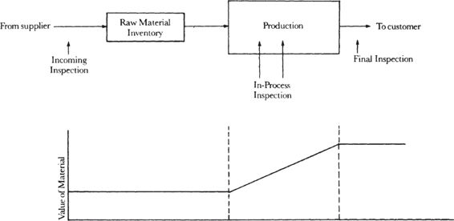

# Chapter 2: Managing the Breakfast Factory — Part 2

> **High Output Management** — Andrew S. Grove
> *Quality Assurance, Productivity, and the Introduction of Leverage*

Part 1 covered indicators, the black box model, and controlling future output. Part 2 covers the second half of Chapter 2: Grove's quality assurance framework (the trade-off between thoroughness and flow disruption), a brilliant case study applying production thinking to the U.S. Embassy's visa processing, the definition of productivity, and — critically — the first introduction of **leverage**, which becomes the central concept of the entire book starting in Chapter 3.

## Table of Contents

- [Assuring Quality: Inspection Strategies](#assuring-quality-inspection-strategies)
  - [The Three Inspection Points (Revisited)](#the-three-inspection-points-revisited)
  - [Gate Inspections vs. Monitoring](#gate-inspections-vs-monitoring)
  - [Variable Inspections](#variable-inspections)
  - [The Reliability Exception](#the-reliability-exception)
- [The Embassy Visa Factory](#the-embassy-visa-factory)
  - [The Problem](#the-problem)
  - [The Production Thinking Solution](#the-production-thinking-solution)
  - [Variable Inspection as Managerial Tool](#variable-inspection-as-managerial-tool)
- [Productivity: Faster vs. Smarter](#productivity-faster-vs-smarter)
  - [Definition of Productivity](#definition-of-productivity)
  - [Two Ways to Improve Productivity](#two-ways-to-improve-productivity)
  - [The Introduction of Leverage](#the-introduction-of-leverage)
  - [Work Simplification](#work-simplification)

**Block types:** [Core Concept] [Modern Lens] [Senior EM Application] [SRE Lens] [Production Thinking] [Practical Toolkit] [Anti-Pattern] [AI & Automation] [Scenario] [Mental Model]

---

## Assuring Quality: Inspection Strategies

### The Three Inspection Points (Revisited)

Grove formalizes the three inspection types from Chapter 1 into production terminology:


*Grove's inspection hierarchy with value curve. Top: the production flow showing three inspection points — Incoming Inspection (at raw material inventory), In-Process Inspection (during production), and Final Inspection (before shipping to customer). Bottom: the value of material curve — flat during raw materials stage, rising steeply during production, and highest at the output stage. The key principle is visual: inspect at the left (low value), not the right (high value).*

| Inspection Point | Production Term | When | What It Catches |
|-----------------|----------------|------|-----------------|
| Before production | **Incoming / receiving inspection** | At raw material delivery | Bad inputs (rotten eggs, cracked shells) |
| During production | **In-process inspection** | While work is being done | Process drift (temperature changes, quality degradation) |
| After production | **Final / outgoing quality inspection** | Before shipping to customer | Defective finished product |

The governing principle: *"reject before investing further value."*

### Gate Inspections vs. Monitoring

Grove now introduces a critical distinction between two inspection *methods* — and the trade-off between them:

**Gate-like inspection:** All material is *held* at the inspection point until tests are completed. If it passes, it moves forward. If it fails, it's sent back for rework or scrapped. The entire flow stops at this point until the verdict is in.

**Monitoring:** A *sample* of the material is taken and tested. The bulk of the material continues to flow through production without waiting. If several successive samples fail, you stop the line.

> *"What is the trade-off here? If we hold all the material, we add to throughput time and slow down the manufacturing process. A monitor produces no comparable slowdown but might let some bad material escape before we can act on the monitor's results."*

Grove's rule of thumb:

> *"We should lean toward monitoring when experience shows we are not likely to encounter big problems."*

And the counter-intuitive insight:

> *"For the same money we can do a lot more monitoring than gate-type inspections; if we do the former, we may well contribute more to the overall quality of the product than if we choose less frequent gate-like inspections."*

> **[Core Concept: Gate vs. Monitor — Throughput vs. Safety]**
>
> This is one of the most practically useful distinctions in the book. Every quality check in your organization is either a gate (blocks flow until verified) or a monitor (samples and allows flow to continue). The trade-off:
>
> | | Gate Inspection | Monitoring |
> |--|----------------|------------|
> | **How it works** | Everything stops until inspected | Sample tested, bulk flows through |
> | **Throughput impact** | High — adds to lead time | Low — minimal disruption |
> | **Defect escape risk** | Low — nothing gets through unchecked | Moderate — bad material can pass between sample checks |
> | **Cost per unit** | High — every unit inspected | Low — only samples inspected |
> | **Best when** | Defects are common or consequences are severe | Defects are rare and consequences are manageable |
>
> **The key insight:** Many organizations default to gate inspections for everything because it *feels* safer. But Grove points out that the throughput cost of gates is real, and for the same budget, more frequent monitoring can achieve better *overall* quality than less frequent gating. The question is: what's the cost of a defect escaping vs. the cost of slowing the flow?

> **[SRE Lens: Gate vs. Monitor in the Deployment Pipeline]**
>
> Every stage of a CI/CD pipeline is either a gate or a monitor. Understanding which to use where is one of the most impactful decisions an SRE leader makes:
>
> | Pipeline Stage | Gate or Monitor? | Rationale |
> |---------------|-----------------|-----------|
> | **Linting / static analysis** | **Gate** — blocks merge | Fast (seconds), catches whole categories of bugs, zero throughput cost |
> | **Unit tests** | **Gate** — blocks merge | Fast (minutes), high signal, defects at this stage are cheap to fix |
> | **Integration tests** | **Gate or monitor** — depends on suite speed | If fast (<10 min): gate. If slow (>30 min): consider monitoring (run on sample of changes, gate only on critical paths) |
> | **Security scanning (SAST)** | **Gate for critical**, monitor for low severity | Critical vulnerabilities must block. Low-severity findings can be tracked without blocking. |
> | **Canary deployment** | **Monitor** — deploys to small %, monitors metrics | Bulk of traffic continues on old version. If canary fails, roll back. Classic Grove monitoring pattern. |
> | **Full production deployment** | **Monitor** — progressive rollout with SLO monitoring | Traffic gradually shifts. SLO metrics are monitored continuously. If degradation detected, auto-rollback. |
> | **Change Advisory Board (CAB)** | **Gate** — blocks deployment until approved | Often the most expensive gate in the pipeline. Grove would ask: is the defect escape risk high enough to justify the throughput cost? For most changes: no. |
>
> **The CAB analysis using Grove's framework:**
> - CAB is a gate inspection applied to *every* change
> - It adds days to throughput time
> - It catches problems at the *highest-value stage* (code is already written, tested, and reviewed)
> - A better approach (per Grove): use monitoring (canary + SLO monitoring) with gate inspection only for high-risk changes (database migrations, security-sensitive changes, changes touching financial systems)
>
> This is exactly the pattern that progressive delivery implements: gate for the few, monitor for the many.

### Variable Inspections

Grove introduces a third approach: **variable inspection frequency**. Since quality levels vary over time, inspection frequency should too:

> *"If for weeks we don't find problems, it would seem logical to check less often. But if problems begin to develop, we can test ever more frequently until quality again returns to the previous high levels."*

The advantage: lower cost AND less interference with production flow. But Grove notes it's rarely used in practice: *"Probably because we are creatures of habit and keep doing things the way we always have."*

### The Reliability Exception

Grove adds one absolute rule to the inspection framework:

> *"One should* never *let substandard material proceed when its defects could cause a complete failure — a* reliability problem *— for our customer."*

He uses the example of cardiac pacemaker components: if a defective component is caught in the factory, the cost is a replacement part. If it fails after implantation, *"the cost of the failure is much more than a financial one."*

> *"Simply put, because we can never assess the consequences of an unreliable product, we can't make compromises when it comes to reliability."*

> **[SRE Lens: The Reliability Exception in Software Systems]**
>
> Grove's reliability exception — never compromise on defects that could cause complete failure — maps directly to how SRE teams should think about **blast radius**:
>
> | Defect Type | Blast Radius | Inspection Approach |
> |------------|-------------|-------------------|
> | UI styling bug | Low — cosmetic impact only | **Monitor** — fix in next deploy cycle |
> | Feature logic error | Medium — wrong behavior for subset of users | **Gate** — catch in code review + integration test before merge |
> | Data corruption bug | **Critical** — could permanently damage customer data | **Gate with redundancy** — mandatory code review + integration test + staging validation + canary with close monitoring. Never compromise. |
> | Authentication/authorization bypass | **Critical** — security breach could affect all users | **Gate** — security review mandatory. This is Grove's pacemaker component. |
> | Database migration with no rollback | **Critical** — could cause extended outage with no recovery path | **Gate** — mandatory staging dry-run, explicit rollback plan verified, DBA review |
>
> **Grove's principle operationalized:** For low-blast-radius defects, use monitoring (canary, progressive rollout). For high-blast-radius defects — anything that could cause data loss, security breach, or extended outage — use gate inspections with no exceptions. The cost of slowing the flow is real; the cost of a reliability failure is catastrophically higher.
>
> **The practical rule:** Classify every change by blast radius before it enters the pipeline. Low-risk: monitor path (fast, automated). High-risk: gate path (slower, human review required). This is exactly the risk-based change management that modern SRE replaces the CAB with.

---

## The Embassy Visa Factory

Grove tells one of the book's most memorable stories — the U.S. Embassy in London drowning in visa applications — and uses it to demonstrate how production thinking applies to *any* system.

### The Problem

- ~1 million British citizens apply for U.S. visas annually
- **98% are approved** without any issue
- 60 employees process up to 6,000 applications per day
- 60,000 to 80,000 British passports are in the embassy's hands at any time
- Lines of 100+ people stand outside the building daily
- The embassy tried expediting schemes: newspaper ads asking tourists to apply early, drop-off boxes for same-day service

**None of it worked.** The expediting only made things worse because *"nothing was done to address the basic issue: to speed the processing of visas overall. Time and money were spent to classify various kinds of applications slated for different processing times, but this only created more logistical overhead with no effect on output."*

### The Production Thinking Solution

Grove's solution is elegant and directly derived from the inspection principles he just taught:

> *"The bureaucratic minds at the embassy would need to accept that a 100 percent check of the visa applicants is unnecessary."*

If 98% of applications are approved without question, then performing a full inspection on every single application is a gate inspection with a 98% pass rate — an enormous throughput cost for minimal quality benefit. Grove proposes replacing it with **sampling-based quality assurance** — a monitoring approach:

- Process most applications with minimal verification (fast throughput)
- Perform thorough inspections on a targeted sample (selected by predetermined criteria — risk-based)
- The sampling approach provides deterrence comparable to 100% checking (just as IRS audits induce compliance without examining every tax return)

> **[Production Thinking: The Visa Factory Pattern in Engineering]**
>
> Grove's embassy example is a universal anti-pattern: **gate-inspecting everything at 100% when the defect rate is 2%.** This pattern appears constantly in engineering orgs:
>
> | "Visa Factory" Pattern | Defect Rate | Production Thinking Fix |
> |-----------------------|------------|------------------------|
> | **All PRs require senior engineer review** | 95%+ of PRs are fine | Risk-based review: auto-approve low-risk changes (formatting, docs, test-only); senior review only for high-risk (core logic, data models, security) |
> | **All deployments require CAB approval** | 98%+ of deployments succeed | Auto-approve standard deployments via canary validation; CAB only for high-risk changes |
> | **All incidents require a full postmortem** | 80%+ are minor with obvious root causes | Full postmortem for P1/P2; lightweight "5-why" for P3/P4; track patterns across minor incidents |
> | **All new services require full production readiness review** | Most follow standard patterns | Automated PRR checklist for standard services; full review only for novel architectures |
> | **All access requests require security team approval** | 90%+ are routine | Auto-approve based on role-based access policies; security review only for elevated privileges |
>
> **In every case, the fix is the same:** Replace 100% gate inspection with risk-based monitoring plus targeted inspection. Process the 98% fast, inspect the 2% thoroughly. Total quality may actually *improve* because the inspection resources freed up from routine applications can be concentrated on the high-risk ones.

> **[Anti-Pattern: The Expediting Trap]**
>
> Grove points out that the embassy's "solutions" (newspaper ads, drop-off boxes, different processing tiers) actually made things *worse* by adding logistical overhead without improving throughput. This is the **expediting trap**: when a system is bottlenecked, adding complexity to manage the queue makes the bottleneck worse, not better.
>
> **In engineering, expediting looks like:**
> - Creating "fast-track" and "standard" PR review lanes → now reviewers are context-switching between two queues, and the categorization itself takes time
> - Adding a "critical hotfix" deployment path alongside the normal path → now you maintain two deployment pipelines, and people argue about which path their change qualifies for
> - Creating "severity tiers" for on-call pages with different response SLAs → the time spent triaging severity could have been spent fixing the issue
>
> **Grove's lesson:** Don't expedite. Simplify. Reduce the total inspection burden so that *everything* flows faster, rather than creating fast lanes that add overhead for everyone.

### Variable Inspection as Managerial Tool

Grove connects variable inspection to management:

> *"When a manager digs deeply into a specific activity under his jurisdiction, he's applying the principle of variable inspection. If the manager examined everything his various subordinates did, he would be meddling, which for the most part would be a waste of his time."*

But if the manager *never* inspects, subordinates learn they won't be checked, and quality drifts. Variable inspection — deep-diving occasionally, unpredictably, into specific areas — maintains quality without creating either meddling or neglect.

> **[Senior EM Application: Variable Inspection as a Management Practice]**
>
> This is one of the most practical pieces of management advice in the book. As a Senior EM, you can't review every PR, attend every standup, or read every incident report. But you also can't be completely hands-off or quality will drift.
>
> **The variable inspection approach:**
>
> 1. **Establish a baseline of trust** through regular indicators (dashboards, metrics, 1-1s)
> 2. **Deep-dive periodically and unpredictably** into specific areas:
>    - Read a random PR from each team once a week (are standards being followed?)
>    - Attend a standup unannounced once a month (is the team's process healthy?)
>    - Read a recent incident postmortem in detail (is learning happening?)
>    - Review a team's on-call dashboard (is alert quality good? are pages actionable?)
> 3. **Increase frequency when problems appear** — if a deep-dive reveals issues, inspect that area more often until quality returns
> 4. **Decrease frequency when quality is consistently high** — free up your time for areas that need more attention
>
> **The unpredictability matters.** If your team knows you always review PRs on Tuesday, they'll pay extra attention to Tuesday PRs. If they know you might review any PR at any time, the general standard stays high — this is Grove's IRS analogy applied to management.
>
> **The balance:** Variable inspection is not "gotcha management." You're not trying to catch people doing something wrong. You're maintaining quality through *attention* — showing that the work matters enough for you to look at it closely sometimes, while trusting your team enough to not look at everything always.

---

## Productivity: Faster vs. Smarter

### Definition of Productivity

Grove gives the simplest possible definition:

> **Productivity = Output / Labor required to generate the output**

This is the black box distilled: stuff goes in, stuff comes out. Productivity is the ratio of output to input.

### Two Ways to Improve Productivity

**Way 1: Do what you're doing, but faster.**

> *"This could be done by reorganizing the work area or just by working harder."*

You get more *activities per employee-hour*. The nature of work doesn't change — you just do more of it per unit of time.

**Way 2: Change the nature of the work.**

> *"We want to increase the ratio of output to activity, thereby increasing output even if the activity per employee-hour remains the same. As the slogan has it, we want to 'work smarter, not harder.'"*

### The Introduction of Leverage

This is where Grove introduces the concept that will dominate Chapter 3 and arguably the entire book:

> *"Here I'd like to introduce the concept of* leverage, *which is the output generated by a specific type of work activity. An activity with high leverage will generate a high level of output; an activity with low leverage, a low level of output."*

His examples:

- A waiter who can boil two eggs and operate two toasters simultaneously delivers two breakfasts for almost the same effort as one — **high leverage**
- A software engineer using a high-level programming language solves many problems per hour — **high leverage**
- A software engineer writing in machine code (ones and zeros) needs many more hours for the same problems — **low leverage**

> *"A very important way to increase productivity is to arrange the work flow inside our black box so that it will be characterized by high output per activity, which is to say high-leverage activities."*

> **[Core Concept: Leverage — The Most Important Concept in the Book]**
>
> Leverage is Grove's key contribution to management thinking. It reframes productivity from "how much do you do?" to "how much output does each thing you do generate?"
>
> Two implications that Grove will develop fully in Chapter 3:
>
> 1. **Not all activities are equal.** Some produce 10x the output of others for the same effort. A manager's job is to identify and prioritize high-leverage activities.
>
> 2. **Working harder on low-leverage activities is still low productivity.** If you spend 10 hours doing something that generates minimal output, doing it in 8 hours doesn't fundamentally change anything. You need to *change what you're doing*, not just how fast.
>
> **For Senior EMs, the leverage question is:** "Of all the things I could do today, which ones will produce the most output for my organization?" Writing a strategy doc that aligns three teams (high leverage) vs. attending a status meeting where nothing will be decided (low leverage). Coaching a manager on how to run better 1-1s (high leverage, multiplied across their reports) vs. fixing a bug yourself (low leverage for a manager, however satisfying).

> **[SRE Lens: High-Leverage vs. Low-Leverage Reliability Work]**
>
> Applying Grove's leverage concept to SRE work:
>
> | High Leverage (do more of this) | Low Leverage (do less of this) |
> |-------------------------------|-------------------------------|
> | Building a shared observability platform used by 20 teams | Building custom monitoring for one service |
> | Writing an auto-remediation that handles 50 incidents/month automatically | Manually remediating the same incident type for the 50th time |
> | Conducting a postmortem that produces a systemic fix preventing a class of incidents | Writing a postmortem that only fixes the one specific failure that occurred |
> | Training product engineers to own their own reliability (multiplied across all teams) | Being the single reliability expert everyone depends on (bottleneck) |
> | Setting SLOs that create shared language between SRE and product teams | Having ad-hoc reliability conversations that produce no lasting alignment |
> | Automating toil that consumes 10 engineer-hours/week | Optimizing a one-time task that takes 2 hours annually |
>
> **The leverage multiplier test:** Before starting any work, ask: "How many times will the output of this work be *used*?" A runbook used once has low leverage. A platform used by 20 teams has 20x leverage. An auto-remediation triggered 50 times/month has 50x monthly leverage. Prioritize work with the highest usage multiplier.

### Work Simplification

Grove introduces work simplification as a concrete technique for increasing leverage:

1. **Create a flow chart** of the production process as it exists — every single step, no prettying up
2. **Count the number of steps** — know your starting point
3. **Set a target for reduction** — Grove says 30-50% reduction is reasonable in the first round
4. **Question why each step is performed** — many exist by tradition or because a formal procedure requires them, with no practical necessity

> *"We found that in a wide range of administrative activities at Intel, substantial reduction — about 30 percent — could be achieved in the number of steps required to perform various tasks."*

He references the visa factory: the embassy didn't need to process 100% of applicants. Many of the steps existed because "that's how it's always been done."

> **[Practical Toolkit: Work Simplification for Engineering Processes]**
>
> Grove's work simplification method is immediately applicable to any engineering process that feels slow:
>
> **Step 1: Map the current flow (don't pretty it up)**
> ```
> Current deployment process:
> 1. Developer creates PR
> 2. Developer adds reviewers manually
> 3. Reviewer 1 reviews (waits avg 1.5 days)
> 4. Developer addresses comments
> 5. Reviewer 1 re-reviews
> 6. Reviewer 2 reviews (waits avg 1 day)
> 7. Developer addresses comments
> 8. Both reviewers approve
> 9. Developer merges PR
> 10. CI runs full test suite (40 min)
> 11. Developer triggers deploy to staging
> 12. Developer manually smoke tests staging
> 13. Developer requests CAB approval (waits avg 3 days)
> 14. CAB approves
> 15. Developer triggers deploy to production
> 16. Developer monitors for 30 min
> Total: 14 steps, ~6 days lead time
> ```
>
> **Step 2: Count steps → 14 active steps**
>
> **Step 3: Target → reduce to 8-10 steps (30-40% reduction)**
>
> **Step 4: Question each step**
> - Step 2: Why manual? → Auto-assign reviewers based on code ownership (CODEOWNERS)
> - Steps 3-5 + 6-8: Why two sequential reviews? → One reviewer + AI review for standard PRs
> - Step 10: Why full suite? → Incremental testing — only run tests affected by changes
> - Steps 11-12: Why manual staging? → Automated staging deployment + automated smoke tests
> - Steps 13-14: Why CAB? → Replace with automated canary validation for standard changes
>
> **Simplified flow:**
> ```
> 1. Developer creates PR → auto-assigned reviewer
> 2. AI pre-review + human review (parallel)
> 3. Developer addresses comments
> 4. Reviewer approves
> 5. Auto-merge → incremental CI (10 min)
> 6. Auto-deploy to canary → automated validation
> 7. Auto-promote to full production → SLO monitoring
> Total: 7 steps, ~1-2 days lead time
> ```
>
> **Reduction: 14 → 7 steps (50%), 6 days → 1-2 days lead time.** Exactly in Grove's predicted range.

> **[Core Concept: Output vs. Activity — The Soft Professions Trap]**
>
> Grove closes the chapter with a warning that applies directly to engineering management:
>
> *"In the work of the soft professions, it becomes very difficult to distinguish between output and activity. And as noted, stressing output is the key to improving productivity, while looking to increase activity can result in just the opposite."*
>
> This is the trap: in knowledge work, *activity looks like output.* Writing code looks productive. Attending meetings looks productive. Sending emails looks productive. But unless the activity generates output (shipped features, resolved incidents, improved reliability, developed people), it's just motion.
>
> **The Senior EM test:** At the end of each week, list your top 5 time investments. For each, answer: "What output did this produce?" If the answer is vague ("I kept things running," "I stayed aligned"), you spent time on activity, not output. High-leverage managers can point to specific outputs: "This 1-1 resulted in a coaching conversation that will change how my TL runs architecture reviews." "This strategy doc aligned three teams on a shared approach, saving 2 months of duplicated work."

---

## Chapter 2 Synthesis

Chapter 2 completes the production toolkit. Between Chapters 1 and 2, Grove has given you:

| From Chapter 1 | From Chapter 2 |
|----------------|----------------|
| The production triad (time, quality, cost) | Indicators and paired indicators |
| The limiting step | The black box model |
| Time offsets and backward planning | Leading, linearity, trend, and stagger indicators |
| Three operations (process, assembly, test) | Build to order vs. build to forecast |
| Three inspections (receiving, in-process, functional) | Gate vs. monitoring vs. variable inspection |
| Four capacity levers (equipment, manpower, inventory, time) | Productivity = output / labor |
| The efficiency–flexibility trade-off | Leverage: output per activity |
| Detect problems at the lowest-value stage | Work simplification |

With these tools, you can analyze, measure, predict, and improve *any* production system — whether it makes breakfasts, software, or decisions.

**Next: Chapter 3 — Managerial Leverage, where Grove applies everything from Chapters 1-2 to the work of managers themselves. This is the book's central chapter and the one that most directly answers: "What should a manager actually DO all day?"**
