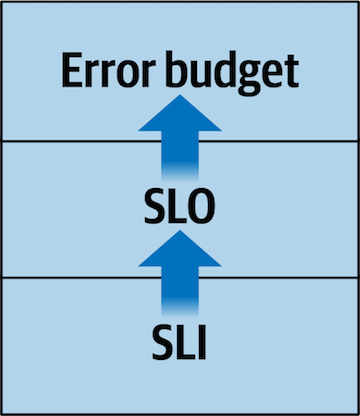
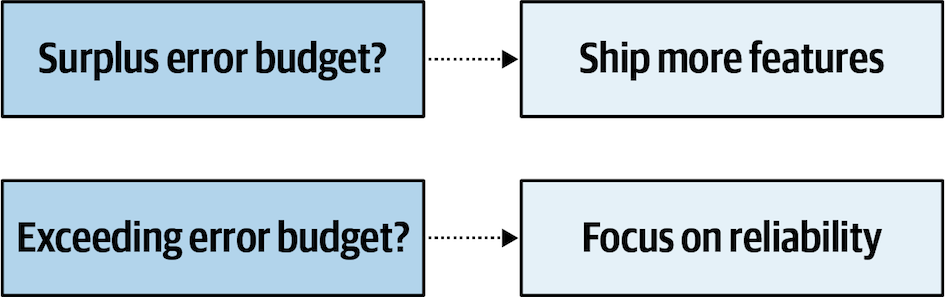
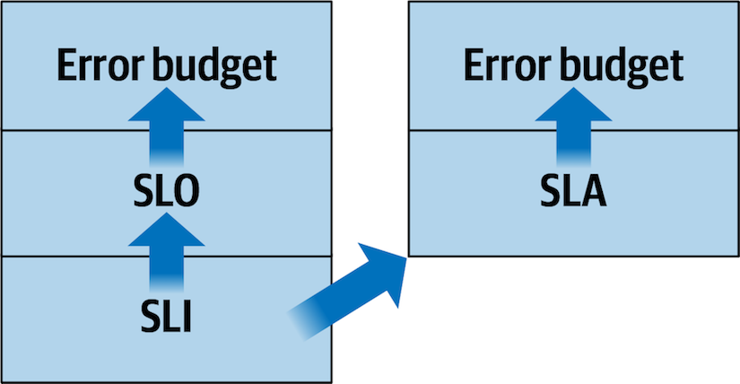

# Chapter 1: The Reliability Stack

> **Implementing Service Level Objectives** — Alex Hidalgo
> *SLIs, SLOs, Error Budgets — The Foundation of Everything*

This opening chapter establishes the conceptual foundation for the entire book. Hidalgo introduces three universal truths about services, defines the **Reliability Stack** (SLIs → SLOs → Error Budgets), distinguishes SLOs from SLAs, surveys the types of services the book covers, and sets philosophical guardrails for the journey. If you read only one chapter, this is it — every subsequent chapter is an elaboration of concepts introduced here.

The chapter's quiet thesis: SLOs are not a monitoring technique or an alerting framework. They are **a way of thinking about your service from your users' perspective**, and the math is just a means to make that thinking more efficient.

## Table of Contents

- [Three Service Truths](#three-service-truths)
- [The Reliability Stack](#the-reliability-stack)
  - [Service Level Indicators (SLIs)](#service-level-indicators-slis)
  - [Service Level Objectives (SLOs)](#service-level-objectives-slos)
  - [Error Budgets](#error-budgets)
  - [SLAs vs. SLOs — The Critical Distinction](#slas-vs-slos--the-critical-distinction)
- [What Is a Service?](#what-is-a-service)
  - [Service Types and Their SLO Challenges](#service-types-and-their-slo-challenges)
- [Things to Keep in Mind](#things-to-keep-in-mind)

**Block types:** [Core Concept] [Worked Example] [Implementation Guide] [Common Pitfall] [Organizational Reality] [Tool & Platform] [2025 Update] [AI & Observability] [Senior EM Application] [Math Explained] [Template]

---

## Three Service Truths

Hidalgo opens by establishing three things that are *always* true about any service:

**Truth 1: Reliability is the most important operational requirement.**

A service exists to perform reliably enough for its users. Reliability here is broader than just "availability" — it encompasses quality, dependability, responsiveness, correctness, and more. The question *"Is my service reliable?"* is equivalent to *"Is my service doing what its users need it to do?"*

**Truth 2: Your users determine whether you're reliable — not you.**

> *"It doesn't matter if you can point to zero errors in your logs, or perfect availability metrics, or incredible uptime; if your users don't think you're being reliable, you're not."*

This is a perspective shift that many engineering teams resist. Internal metrics may look green, but if customers experience slow responses, broken workflows, or degraded quality, the service is unreliable — *from the only perspective that matters.*

**Truth 3: Nothing is perfect all the time, so your service doesn't have to be either.**

> *"Not only is it impossible to be perfect, but the costs in both financial and human resources as you creep ever closer to perfection scale at something much steeper than linear."*

Perfection isn't achievable, and the cost curve for approaching it is exponential, not linear. The good news: software doesn't need to be 100% perfect. Users tolerate a certain amount of imperfection — the question is how much.

> **[Core Concept: The Three Truths as Design Principles]**
>
> These three truths aren't just philosophical — they are **design constraints** for the entire SLO system:
>
> | Truth | Design Implication |
> |-------|-------------------|
> | Reliability is the top requirement | SLIs must measure what users care about, not what's easy to instrument |
> | Users determine reliability | Measurement must reflect the user's perspective, not the server's |
> | Perfection is impossible and unnecessary | SLOs must be targets below 100%, and error budgets must quantify the allowed imperfection |
>
> Every concept in the book flows from these three truths. If you accept them, the Reliability Stack follows logically. If you reject any one of them (e.g., "we should aim for 100% uptime" or "our internal metrics are what matter"), the entire SLO framework won't make sense — and you'll fight it at every step.

> **[Common Pitfall: "Our Metrics Say We're Fine"]**
>
> Hidalgo's second truth directly challenges the most common engineering blind spot: dashboard tunnel vision. Your Prometheus says error rate is 0.01%. Your uptime monitor shows 99.99%. But users are complaining about slow search results, failed checkouts, and timeouts during peak hours.
>
> **Why the disconnect happens:**
> - You're measuring server-side latency; users experience client-side latency (which includes DNS, TLS, network, and rendering)
> - You're counting HTTP 200s as "success"; but the response body contains an error message or incomplete data
> - You're averaging latency; but the P99 tail is terrible and that's what 1% of your users actually experience
> - You're measuring component health; but the user journey spans 5 components and any one can degrade the experience
>
> **Hidalgo's solution:** Measure from the user's perspective (SLIs), not the server's perspective (infrastructure metrics). The SLI doesn't ask "is the server healthy?" — it asks "did the user get what they needed?"

Hidalgo also clarifies what "user" means:

> *"A user is anything or anyone that relies on your service. It could be an actual human, the software of a paying customer, another service belonging to an internal team, a robot, and so on."*

This broad definition is important: internal microservices have "users" too (the services that call them), and those users' experience matters just as much.

---

## The Reliability Stack

Hidalgo introduces the Reliability Stack as a three-layer model, where each layer builds on the one below:


*The basic building blocks of the Reliability Stack. SLIs (measurements from the user's perspective) form the base. SLOs (targets for those measurements) are built on SLIs. Error Budgets (how much failure you can tolerate over time) are built on SLOs. Each layer depends on and is informed by the layer below it.*

### Service Level Indicators (SLIs)

> *"SLIs are the single most important part of the Reliability Stack, and may well be the most important concept in this entire book."*

Hidalgo makes this bold claim and backs it up: even if you never set formal SLO targets or calculate error budgets, simply *thinking about your service from your users' perspective* and creating measurements that reflect that perspective is transformational.

**What an SLI is:** A measurement of your service's behavior from the user's perspective, most usefully expressed as a binary good/bad outcome for each event.

**The formula:**

```
SLI = good events / total events
```

> **[Worked Example: The Web Page Loading SLI]**
>
> Hidalgo walks through the canonical example:
>
> 1. Research determines that users are happy when pages load within 2 seconds
> 2. Any page load ≤ 2 seconds = "good event"
> 3. Any page load > 2 seconds = "bad event"
> 4. On a given day: 59,982 good events out of 60,000 total
>
> ```
> SLI = 59,982 / 60,000 = 0.9997 = 99.97%
> ```
>
> That 99.97% is your SLI value for that day. It tells you: "99.97% of our users had a good experience in terms of page load speed."

> **[Core Concept: SLIs as Binary Good/Bad Classification]**
>
> The most important design decision in SLI construction: reducing complex, continuous measurements to a binary **good or bad** classification for each event. This seems reductive, but it's what makes SLIs powerful:
>
> - A latency of 150ms is "good" (under 2s threshold). A latency of 2.5s is "bad." You don't need to care about the *degree* of goodness or badness — just which side of the threshold each event falls on.
> - This enables the simple ratio: good/total = percentage of happy users
> - This percentage is universally understandable — engineers, product managers, executives, and customers can all interpret "99.97% of requests were good"
>
> **The nuance Hidalgo adds:** The Google SRE book defined SLIs broadly. The SRE Workbook defined them as good/total ratios. This book takes a more layered view: the *system* starts with raw measurements, applies thresholds, classifies into good/bad, calculates a percentage, and compares against a target. Where exactly you draw the line between "SLI" and "SLO" in this pipeline doesn't matter — as long as your org uses consistent definitions.

**Two qualities of good SLIs:**

1. **User-perspective:** Measures what users experience, not what servers report. Not just "API availability" but "can a user authenticate and retrieve data in a timely manner" — the entire user journey.

2. **Expressible in plain language:** The math can be complex, but the *definition* must be understandable by all stakeholders. "99.97% of page loads complete within 2 seconds" is understandable. "The P99 of the 95th percentile of the rolling 5-minute average latency" is not.

> **[2025 Update: SLI Measurement Has Gotten Much Easier]**
>
> When Hidalgo wrote in 2020, instrumenting user-perspective SLIs required significant custom work. By 2025:
>
> | Measurement Approach | 2020 State | 2025 State |
> |---------------------|------------|------------|
> | **Real User Monitoring (RUM)** | Available but adoption was early | Standard in most observability platforms (Datadog RUM, Grafana Faro, New Relic Browser) — measures actual user experience including client-side latency |
> | **OpenTelemetry** | Pre-1.0, fragmented adoption | Graduated CNCF project; standard instrumentation for metrics, traces, and logs across all major languages. Makes consistent SLI measurement vastly easier. |
> | **eBPF-based observability** | Experimental (Cilium early days) | Production-ready (Pixie, Groundcover, Cilium). Kernel-level telemetry *without* application changes — enables SLI measurement for services you can't instrument. |
> | **OpenSLO** | Didn't exist | Open standard (openslo.com) for defining SLIs/SLOs as code in a vendor-neutral YAML format. Enables SLO definitions that are portable across Datadog, Nobl9, Dynatrace, etc. |
> | **SLO-as-Code** | Concept only | Implemented: Sloth (Prometheus), Google Cloud Service Monitoring, Nobl9, Datadog SLOs — define SLOs in config files, version-controlled, CI/CD deployed |
>
> **OpenSLO deserves special attention.** It's a vendor-neutral specification (think OpenTelemetry but for SLO definitions) that lets you define SLIs, SLOs, and alerting policies in YAML:
>
> ```yaml
> apiVersion: openslo/v1
> kind: SLO
> metadata:
>   name: checkout-latency
> spec:
>   service: checkout-service
>   indicator:
>     metadata:
>       name: checkout-request-latency
>     spec:
>       ratioMetric:
>         good:
>           metricSource:
>             type: prometheus
>             spec:
>               query: histogram_quantile(0.99, rate(http_request_duration_seconds_bucket{service="checkout"}[5m])) < 0.5
>         total:
>           metricSource:
>             type: prometheus
>             spec:
>               query: rate(http_requests_total{service="checkout"}[5m])
>   objectives:
>     - target: 0.999
>       timeWindow:
>         - duration: 30d
>           isRolling: true
> ```
>
> This is the direction the industry is heading: SLOs defined as code, version-controlled alongside application code, deployed via CI/CD, and portable across monitoring platforms.

### Service Level Objectives (SLOs)

> *"SLOs are targets for how often you can fail or otherwise not operate properly and still ensure that your users aren't meaningfully upset."*

The SLO is the target percentage: "We aim for 99.97% of page loads to be good." It sits between two failure modes:
- **Too lenient** → users are unhappy, they churn
- **Too strict** → you exhaust resources chasing perfection that users don't need

Hidalgo emphasizes: SLOs are **objectives, not contracts.** You should change them when circumstances change. They're tools for discussion and decision-making, not legal documents.

> *"Things in the world will change, and those changes may affect how your service operates... Sometimes you'll need to loosen your SLO because what was once a reasonably reachable target no longer is; other times you'll need to tighten your target because the demands or needs of your users have evolved."*

> **[Core Concept: SLOs Encode the Reliability-Velocity Trade-off]**
>
> At their deepest level, SLOs are an explicit, quantified answer to the question: **"How reliable do we need to be?"** This sounds simple but most organizations have never answered it explicitly. Instead they operate with implicit assumptions:
>
> - Product team assumes "as reliable as possible while shipping fast"
> - SRE team assumes "as reliable as possible, period"
> - Finance assumes "as cheap as possible"
> - Customers assume "at least as reliable as it has been"
>
> These assumptions conflict. The SLO makes the trade-off *visible and negotiated*:
> - At 99.9% SLO: you can tolerate 43 minutes of downtime per month → room for aggressive deployments
> - At 99.99% SLO: you can tolerate 4.3 minutes per month → deployments need canary validation, rollback automation
> - At 99.999% SLO: you can tolerate 26 seconds per month → extreme redundancy, limited change velocity
>
> The SLO is the *agreed-upon* balance point. Without it, every incident triggers a political argument about "how reliable should we be?" With it, the argument was had once, the answer is documented, and the error budget policy tells you what to do when you're off track.

> **[Senior EM Application: SLOs as Organizational Alignment Tool]**
>
> As a Senior EM, the SLO is your most powerful alignment mechanism. It answers the question that causes the most friction between SRE and product teams: *"Is our reliability good enough?"*
>
> **Without SLOs:**
> - SRE says "we need to stop shipping and fix reliability"
> - Product says "we need to ship features for the quarterly roadmap"
> - Director says "can't you both be right?"
> - Nobody has data to settle the argument
>
> **With SLOs:**
> - SLO is 99.9%. Current performance is 99.85%. Error budget is burning.
> - The pre-agreed error budget policy says: "When error budget is <25% remaining, dedicate one engineer full-time to reliability"
> - No argument needed — the data and the pre-agreed policy determine the action
>
> Your job as Senior EM: negotiate the SLO with product leadership *before* the crisis, get the error budget policy agreed *before* the budget burns, and then point to the policy when the moment arrives. The negotiation is hard. The execution is straightforward.

### Error Budgets

> *"An error budget is a way of measuring how your SLI has performed against your SLO over a period of time."*

Error budgets answer: "Over the last 30 days (or quarter, or year), how much of our allowed unreliability have we consumed?"

Hidalgo describes two calculation approaches:

**Events-based:** Count bad events. How many bad events can you have before exhausting the budget?
```
Allowed bad events = total events × (1 - SLO target)
Example: 1,000,000 requests/month × (1 - 0.999) = 1,000 bad requests allowed
```

**Time-based:** Count bad minutes. How many minutes of "bad" can you have?
```
Bad minutes allowed = total minutes × (1 - SLO target)
Example: 30 days × 24 hours × 60 min × (1 - 0.999) = 43.2 bad minutes/month
```

Both say the same thing — just framed differently. "We can have 1,000 bad requests per month" and "We can have 43 bad minutes per month" are different ways of expressing the same budget.


*Hidalgo's basic error budget decision model: If you have surplus error budget → ship features, experiment, deploy aggressively. If you're exceeding your error budget → focus on reliability. This is the simplest form of the decision framework — Chapter 5 adds much more nuance.*

> **[Core Concept: Error Budgets as a Communications Framework]**
>
> Hidalgo makes a crucial observation:
>
> *"In many ways error budgets are primarily a communications framework. They give you a common language to use in order to have discussions with others."*
>
> Error budgets translate abstract reliability into concrete, actionable statements:
>
> | Abstract (hard to act on) | Error Budget Language (actionable) |
> |--------------------------|-----------------------------------|
> | "Reliability is degrading" | "We've consumed 78% of our monthly error budget in 15 days" |
> | "We need to focus on reliability" | "At current burn rate, error budget exhausts in 6 hours — triggering the response policy" |
> | "Can we deploy this risky change?" | "We have 12 minutes of error budget remaining — deploying a risky change could exhaust it" |
> | "How was our reliability last quarter?" | "We stayed within budget for 2 of 3 months. October's overage was due to the database migration." |
>
> **The power isn't the math — it's the vocabulary.** Once everyone in your organization speaks "error budget," conversations about reliability priorities become dramatically easier.

> **[Math Explained: Events-Based vs. Time-Based Error Budgets]**
>
> Both approaches are valid. The choice depends on your data and what resonates with your stakeholders:
>
> | | Events-Based | Time-Based |
> |--|-------------|------------|
> | **Formula** | `budget = total_events × (1 - target)` | `budget = total_minutes × (1 - target)` |
> | **Example (99.9%, 30 days)** | 1M requests × 0.001 = **1,000 bad requests** | 43,200 min × 0.001 = **43.2 bad minutes** |
> | **Best for** | High-traffic services where event counts are meaningful | Services where duration of impact matters more than event count |
> | **Communicates as** | "We can have 1,000 more errors this month" | "We have 20 minutes of error budget left" |
> | **Pitfall** | Misleading for low-traffic services (100 requests/day × 0.001 = 0.1 bad requests — not useful) | "Bad minutes" requires defining what constitutes a "bad" minute |
>
> **Hidalgo's advice:** The approach doesn't matter as much as consistency. Pick one, use it everywhere, and make sure everyone interprets it the same way.

### SLAs vs. SLOs — The Critical Distinction


*SLAs are also informed by SLIs but differ from SLOs in critical ways. Both stacks may use the same (or similar) underlying measurements, but SLAs are business contracts with financial consequences.*

Hidalgo draws a sharp line:

| | SLO | SLA |
|--|-----|-----|
| **What it is** | Internal target for reliability | Contractual promise to a paying customer |
| **Consequence of violation** | A data point for discussion and prioritization | You owe someone something (credits, refunds, penalties) |
| **Flexibility** | Can be changed as needed | Changing requires contract renegotiation |
| **Purpose** | Drive internal decision-making | Protect customer expectations and business relationship |

> *"If you violate your SLO, you generate a piece of data you use to think about the reliability of your service. If you violate your SLA, you owe someone something."*

SLAs aren't covered in depth — Hidalgo explicitly scopes the book to SLOs. But the distinction matters because **your SLO should always be tighter than your SLA.** If your SLA promises 99.9% and your SLO target is also 99.9%, you have zero buffer — the first time you miss your internal target, you're already in SLA violation territory.

> **[Implementation Guide: SLO vs. SLA Relationship]**
>
> ```
> TIGHTER ←————————————————————————→ LOOSER
>
>   Internal SLO          SLA            No promise
>     99.95%            99.9%           (best effort)
>       ↑                 ↑
>   Your target      Customer contract
>   (catch problems    (financial
>    before SLA         consequences
>    violation)         if breached)
> ```
>
> **Rule of thumb:** Set your internal SLO 2-5x tighter than your SLA. If SLA is 99.9% (43 min/month downtime), target an internal SLO of 99.95% (21 min/month). This gives you a buffer zone where you detect and fix problems *before* they become SLA violations.

---

## What Is a Service?

Hidalgo defines broadly: *"A service is any system that has users."* He then surveys common service types, each with distinct SLO challenges:

### Service Types and Their SLO Challenges

| Service Type | Examples | SLI Difficulty | Key SLI Dimensions | Covered In |
|-------------|----------|---------------|-------------------|------------|
| **Web services** | Website, streaming service, webmail | Low-Medium | Availability, latency, correctness of content | Throughout the book |
| **Request/response APIs** | Microservices, REST/gRPC endpoints | Low | Availability, latency, error rate | Throughout |
| **Data processing pipelines** | Log processing, ETL, event streaming | High | End-to-end latency, data correctness, data freshness | Ch11 |
| **Batch jobs** | Scheduled jobs, queue processors | High | Start success rate, completion rate, data freshness/correctness | Ch11 |
| **Databases and storage** | PostgreSQL, S3, Redis | Medium-High | Availability, latency, data correctness, freshness, **durability** | Ch11 |
| **Compute platforms** | Kubernetes, VM infra, serverless | Medium | Provisioning time, pod stability, control plane latency | Ch12 |
| **Hardware and network** | Racks, switches, power, HVAC | Medium | Failure rates, network throughput, temperature, power availability | Ch12 |

Hidalgo notes that web services and APIs are easiest to start with (which is why they're used as examples throughout the book), but the approach applies to *all* service types.

> **[Tool & Platform: Where to Implement SLIs by Service Type]**
>
> | Service Type | Recommended Measurement Point | Tooling (2025) |
> |-------------|------------------------------|----------------|
> | **Web services** | Real User Monitoring (browser/client) | Datadog RUM, Grafana Faro, Google CrUX, Sentry Performance |
> | **APIs** | Load balancer / API gateway level + application-level | OpenTelemetry auto-instrumentation, Envoy/Istio service mesh metrics, Cloud provider LB logs |
> | **Pipelines** | End-to-end probe (insert record → retrieve record) | Custom probe + Prometheus, Datadog Monitors, Apache Kafka consumer lag metrics |
> | **Batch jobs** | Orchestrator metadata (start/complete/fail) + data verification | Airflow/Dagster metrics, Kubernetes job status, custom freshness checks |
> | **Databases** | Client-side query latency + data probes | pg_stat_statements, MySQL slow query log, Redis INFO, custom data integrity checks |
> | **Kubernetes** | Control plane metrics + pod lifecycle events | kube-state-metrics, Kubernetes Events, Prometheus + Grafana |

> **[AI & Observability: AI-Enhanced SLI Measurement]**
>
> AI is adding new capabilities to SLI measurement that didn't exist when Hidalgo wrote:
>
> | Capability | How AI Helps |
> |-----------|-------------|
> | **Auto-discovery of SLIs** | ML analyzes traffic patterns and user behavior to suggest which metrics best represent user experience — you don't have to guess what "good" looks like |
> | **Anomaly-based SLI thresholds** | Instead of hardcoded "2 seconds" latency thresholds, ML learns normal patterns and flags deviations dynamically — adapts to seasonal/time-of-day variation |
> | **Synthetic user journey generation** | AI generates realistic synthetic user journeys (not just health checks) that exercise critical paths — better functional testing of SLI measurement |
> | **SLI gap detection** | AI analyzes incident history and correlates with SLI coverage to identify blind spots — "You have incidents affecting checkout, but no SLI covers the checkout flow" |
> | **Natural language SLI definitions** | Tools like Nobl9 and Datadog are adding natural language interfaces: "Create an SLI measuring checkout success rate for the payments service" → generates the query/config |

---

## Things to Keep in Mind

Hidalgo closes with five philosophical guardrails:

### SLOs Are Just Data

> *"The ultimate goal is to provide you with a new dataset based on which you can have better discussions and make better decisions. There are no hard-and-fast rules."*

SLOs don't demand anything — they inform. They're better than raw telemetry but not flawless. Use them as guides, not gospel.

### SLOs Are a Process, Not a Project

> *"A common misconception is that you can just make SLOs an Objective and Key Result for your quarterly roadmap and somehow end up at the other end being 'done.'"*

You are never "done" with SLOs. They're a continuous practice — more like exercise than surgery.

> **[Common Pitfall: The "SLO Project" Anti-Pattern]**
>
> This is one of the most important warnings in the book. The pattern:
>
> 1. Leadership says "we need SLOs"
> 2. A team creates SLO definitions for 20 services in one quarter
> 3. Dashboards are built. The project is declared "complete."
> 4. Nobody looks at the dashboards. Error budgets aren't used for decisions. SLIs drift out of alignment with user experience.
> 5. Six months later: "SLOs didn't work for us"
>
> **Why it fails:** SLOs were treated as a *deliverable* (create definitions and dashboards) rather than a *practice* (continuously measure, discuss, iterate, and use for decisions). The dashboard is 10% of the value. The ongoing conversation about reliability priorities is 90%.

### Iterate Over Everything

SLIs, SLOs, error budgets, alerting thresholds — all should be iterated. Start with something imperfect and refine. Hidalgo describes the typical iteration cycle: you set an SLI, observe it, set an SLO, realize the SLI doesn't actually reflect user experience, update the SLI, which invalidates the SLO, which changes the error budget...

> *"This is all fine. It's a journey, not a destination. The map is not the territory."*

### The World Will Change

User needs change, dependencies change, technology changes. SLIs and SLOs must evolve. Chapter 14 covers when and how to change them.

### It's All About Humans

> *"If you ever find when trying to implement the approaches outlined in this book that the humans involved are frustrated or upset with things, take a step back and reflect on the choices you've made so far."*

The goal is happier users, happier engineers, happier product teams, happier business — not more nines.

> **[Organizational Reality: Why "It's All About Humans" Is the Most Important Guardrail]**
>
> SLO adoption fails more often for human reasons than technical ones:
>
> | Failure Mode | Symptom | Root Cause |
> |-------------|---------|-----------|
> | **SLO as punishment** | Engineers dread SLO reviews because missing target = blame | SLOs framed as accountability tool rather than learning tool |
> | **Alert fatigue from SLO alerts** | Teams mute burn-rate alerts | Thresholds too sensitive, too many SLOs, or alerts not actionable |
> | **Product team ignores error budget** | Error budget burns but feature work continues uninterrupted | Error budget policy wasn't agreed with product leadership beforehand |
> | **Over-engineering at launch** | Team spends 3 months perfecting SLI instrumentation before setting any target | Perfectionism. Hidalgo says: start imperfect, iterate. |
> | **SLO hoarding** | Team has 47 SLOs covering every micro-metric | Lost focus. Hidalgo: SLOs should be few enough to drive actual decisions. |
>
> **The test:** Are people using SLO data to have better conversations? If yes, the system is working regardless of how polished the dashboards are. If no, the system has failed regardless of how perfect the instrumentation is.

> **[Senior EM Application: How to Introduce Chapter 1's Concepts to Your Org]**
>
> If you're starting SLO adoption, Ch1 gives you the vocabulary. Here's how to seed it:
>
> 1. **Start with the three truths.** Share them with your product counterpart. Do they agree? If not, alignment starts here — not with tooling.
> 2. **Pick ONE service.** Not twenty. Hidalgo says iterate. Pick your most important user-facing service.
> 3. **Define ONE SLI.** The simplest meaningful one — probably "successful responses / total responses" or "requests under latency threshold / total requests."
> 4. **Set a provisional SLO.** Based on historical data. Not aspirational. "We've been running at 99.92% — let's target 99.9%."
> 5. **Don't calculate error budgets yet.** Just observe the SLI against the target for a month. See what it tells you.
> 6. **Discuss what you see.** In a staff meeting: "Here's our SLI for the last month. Here's our target. Here's where we missed. What does this tell us?" This conversation is the value — not the dashboard.
>
> This approach takes days, not quarters. It produces a real data point for a real discussion. And it sets the foundation for everything in Chapters 2-17.

---

## Chapter 1 Summary

The Reliability Stack:

```
┌─────────────────┐
│  Error Budget    │  ← How much failure you've consumed over a time window
│  (Ch 5)         │     Drives decisions: ship features vs. focus on reliability
├─────────────────┤
│  SLO            │  ← Target for what % of events should be "good"
│  (Ch 4)         │     The agreed-upon balance between reliability and velocity
├─────────────────┤
│  SLI            │  ← Measurement from the user's perspective: good events / total
│  (Ch 3)         │     The foundation — everything else is math on top of this
└─────────────────┘
```

**The three truths:** Reliability is the top requirement. Users determine reliability. Perfection is impossible and unnecessary.

**SLOs are just data** — for better discussions and better decisions. They're a process, not a project. Iterate over everything. Keep it human.

**Next: Chapter 2 — How to Think About Reliability, where Hidalgo explores what reliability actually means (it's broader than availability), introduces reliability engineering as a discipline, and walks through a worked example of a video streaming service.**

---

*Further reading:*
- *Site Reliability Engineering* (Google, 2016) — the original SLI/SLO/SLA definitions
- *The Site Reliability Workbook* (Google, 2018) — practical SLO implementation at Google
- *OpenSLO Specification* (openslo.com) — vendor-neutral SLO-as-code standard
- *Sloth* (github.com/slok/sloth) — Prometheus-native SLO generator based on multiwindow multi-burn-rate
- *Nobl9* (nobl9.com) — SLO management platform built on OpenSLO
- Alex Hidalgo's talks at SREcon — companion material to the book
