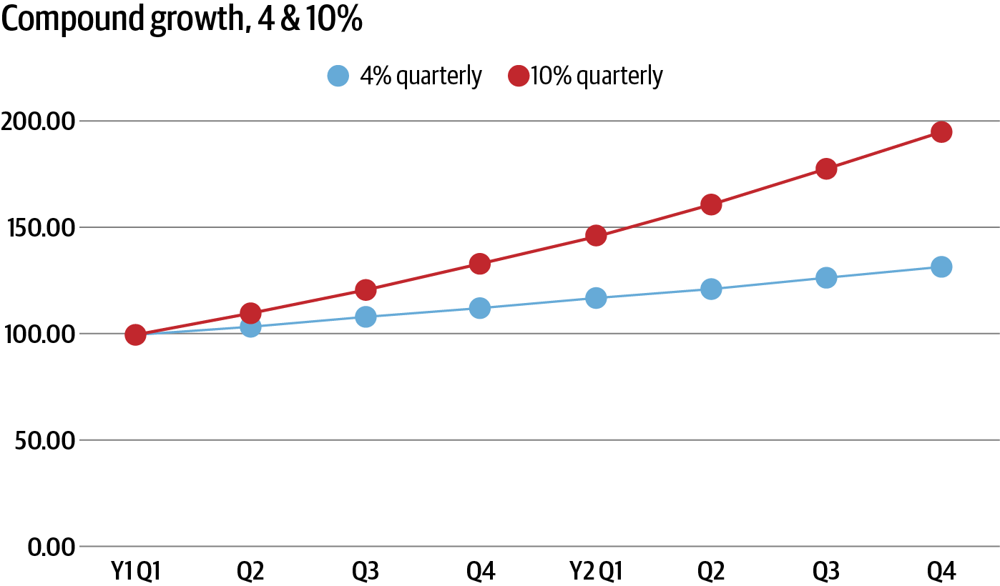
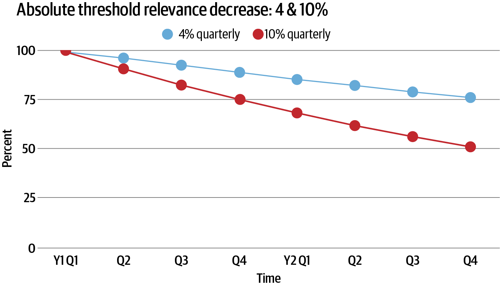
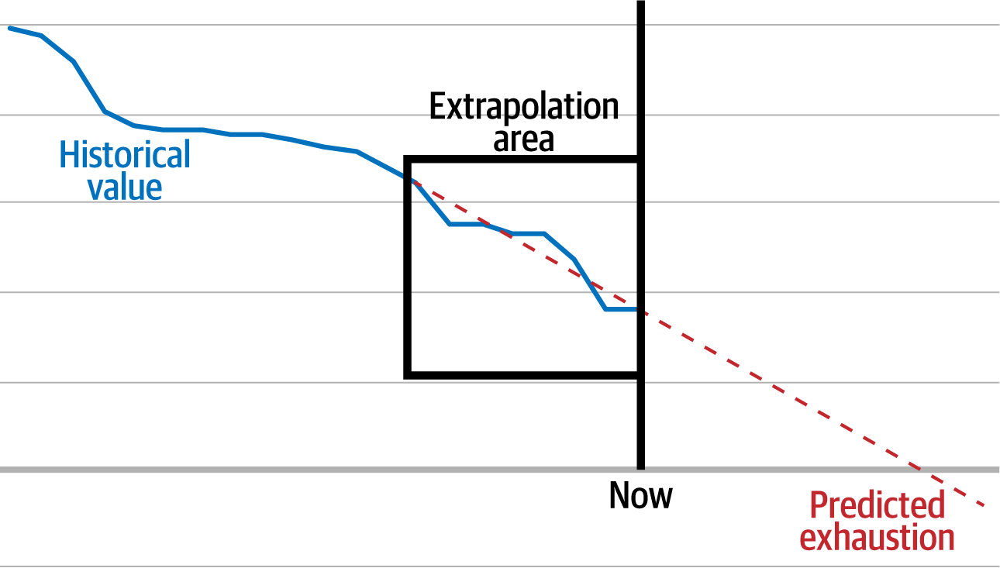
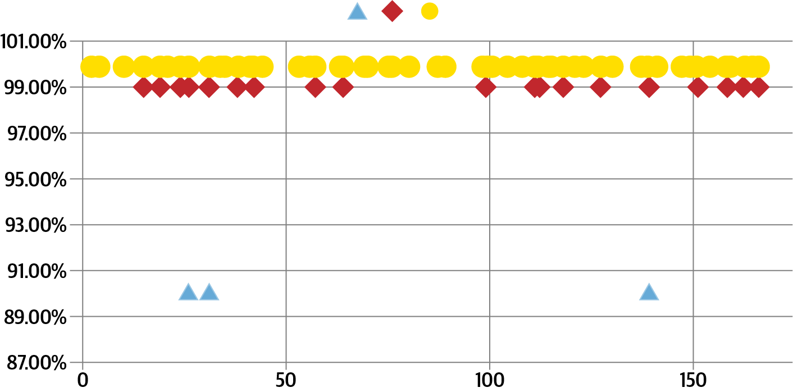

# Chapter 8: SLO Monitoring and Alerting

> **Implementing Service Level Objectives** — Niall Murphy
> *Why Threshold Alerting Fails, Burn Rate Mathematics, Multiwindow Alerting, and Brownfield Migration*

This is the operational heart of the book. Niall Murphy (co-author of the original SRE book, former SRE leader at Google and Microsoft) dismantles the conventional approach to alerting — static thresholds on internal metrics — and replaces it with a principled model built on error budget burn rates. The chapter is dense with math but ultimately practical: by the end you understand *exactly* how to configure burn-rate alerts, why multiwindow approaches reduce false positives, and how to migrate an existing brownfield alert corpus to SLO-based alerting without losing stakeholder confidence.

This chapter makes Chapter 5's error budget theory *operational*. Without this chapter, error budgets are a reporting mechanism. With it, they become a live decision-making system that pages you before budget exhaustion.

## Table of Contents

- [The Case Against Threshold Alerting](#the-case-against-threshold-alerting)
  - [Thresholds Don't Stay Relevant](#thresholds-dont-stay-relevant)
  - [Poor Proxies for User Experience](#poor-proxies-for-user-experience)
  - [Alert Fatigue and the Ratchet Problem](#alert-fatigue-and-the-ratchet-problem)
- [SLO Alerting: The Better Model](#slo-alerting-the-better-model)
  - [Error Budget Burn Rate](#error-budget-burn-rate)
  - [Rolling Windows](#rolling-windows)
  - [Fast Burn vs. Slow Burn](#fast-burn-vs-slow-burn)
- [Worked Example: Image Server at 99.9%](#worked-example-image-server-at-999)
- [Troubleshooting with SLO Alerting](#troubleshooting-with-slo-alerting)
- [Corner Cases](#corner-cases)
- [Brownfield Migration](#brownfield-migration)
- [Parting Recommendations](#parting-recommendations)

**Block types:** [Core Concept] [Worked Example] [Common Pitfall] [Implementation Guide] [Senior EM Application] [Organizational Reality] [2025 Update] [AI & Observability] [Production Thinking]

---

## The Case Against Threshold Alerting

Murphy spends the first half of the chapter building a systematic case against the dominant paradigm: pick a metric, guess a "bad" number, set an alert when it crosses. He identifies five fundamental problems.

### Thresholds Don't Stay Relevant

A static threshold set in January becomes meaningless by December as the business grows.


*Figure 8-1: Even modest 4% quarterly growth means your traffic is 116% of baseline within a year. A threshold set at 90 qps when you're doing 100 qps is now triggered at 77% of peak instead of 90%.*


*Figure 8-2: The effective relevance of a static threshold decays continuously. At 10% quarterly growth, your threshold is at ~50% relevance within two years.*

> **[Core Concept: The Threshold Decay Problem]**
>
> Murphy's key insight: thresholds decay *silently*. Nobody notices they've become irrelevant until either:
> - They fire constantly (too sensitive) → alert fatigue → team mutes them
> - They never fire (too loose) → false confidence → outage surprises everyone
>
> The fix isn't "revise thresholds regularly" — organizations don't do this. The fix is **alerting on a ratio** (error budget consumption) rather than an absolute value. Ratios self-adjust as traffic scales.

### Poor Proxies for User Experience

The most common threshold alerts — CPU usage, disk I/O, queue depth — are *proxies* for user experience, not measurements of it.

| What You Alert On | What Actually Matters | The Gap |
|---|---|---|
| Server CPU > 80% | User-perceived latency | CPU isn't even the primary latency determinant; network, disk I/O, and client-side factors matter more |
| Error count > 10 | Error *rate* relative to traffic | 10 errors at 100 qps = 10% failure; 10 errors at 100,000 qps = noise |
| Queue depth > 1000 | Processing freshness | A deep queue being drained quickly isn't a problem; a shallow queue that's stuck is |
| Disk usage > 90% | Service availability | Disk fills at different rates; 90% with 2TB free is very different from 90% with 2GB free |

> **[Common Pitfall: The Proxy Fixation Trap]**
>
> Murphy warns about a subtle organizational failure: after enough time alerting on CPU, teams *forget* that CPU was only ever a proxy. They start optimizing for low CPU rather than good user experience. This leads to bizarre outcomes — like rejecting a code change that improves latency because it increases CPU usage.
>
> The SLO approach prevents this by making the *actual target* (user experience via SLIs) the thing you alert on.

### Alert Fatigue and the Ratchet Problem

> **[Core Concept: The One-Way Ratchet]**
>
> Murphy identifies a devastating organizational dynamic:
>
> - After every outage, there's pressure to add alerts or lower thresholds ("Why didn't we catch this?")
> - There is *no* complementary pressure to raise thresholds or remove alerts
> - Over time, alerts accumulate and get tighter
> - Alert fatigue increases monotonically
> - Ability to respond to real incidents *decreases*
>
> This is a one-way ratchet. The only escape is changing the model entirely — from "alert on cause indicators" to "alert on effect indicators" (user experience via SLOs).

> **[Organizational Reality: "Perceived Negligence"]**
>
> Murphy names the political force driving the ratchet: *perceived negligence*. When leadership asks "why didn't we catch this?" the implied accusation is negligence. The safe response is always "we'll add an alert." Nobody gets in trouble for adding alerts. People get in trouble for removing them and then having an outage.
>
> SLO alerting breaks this dynamic because the alert is on *the thing that matters* (user experience). If users aren't impacted, there's nothing to alert on — and that's defensible.

---

## SLO Alerting: The Better Model

Murphy's alternative: alert on the rate at which you're consuming your error budget. If the current consumption rate will exhaust your budget before the window ends, page someone.

> **[Core Concept: From "Is This Metric Bad?" to "Will We Miss Our SLO?"]**
>
> The fundamental mental model shift:
>
> | Old Model (Threshold) | New Model (SLO/Burn Rate) |
> |---|---|
> | "Is CPU above 80%?" | "Are we burning error budget faster than we can afford?" |
> | Stateless — point-in-time comparison | Stateful — considers history and projects forward |
> | Fires on every transient spike | Only fires when *sustained* burn threatens the SLO |
> | No connection to user impact | Directly measures user impact |
> | Gets noisier as system grows | Self-adjusts with traffic (ratio-based) |
> | Threshold chosen by guessing | Threshold derived from SLO target and window |

### Error Budget Burn Rate

The core equation:

```
burn_rate = observed_errors_per_period / allowable_errors_per_period
```

- `burn_rate > 1` → consuming budget faster than allowed → will violate SLO
- `burn_rate < 1` → within budget → healthy
- `burn_rate = 1` → exactly at the edge

> **[Implementation Guide: Calculating Burn Rate]**
>
> For a 99.9% SLO over 30 days:
> - Total seconds in window: 2,592,000
> - Allowable error seconds: 2,592 (0.1% × 2,592,000 = 43.2 minutes)
> - If you observe 26 seconds of errors in the last hour → burn rate for that hour = 26 / (2,592 / 720) = 26 / 3.6 = 7.2×
> - A burn rate of 7.2× means: at this rate, you'll exhaust your entire 30-day budget in ~4.2 days
>
> The key insight: burn rate translates any current situation into "time until SLO violation" — a universally understandable metric.

### Rolling Windows

Murphy emphasizes that the *baseline window* (how much history you consider) and the *lookahead* (how far you extrapolate) must have an appropriate ratio.


*Figure 8-3: The extrapolation model. Historical error budget consumption (solid blue) is projected forward (dashed red) from a baseline window to predict when budget will be exhausted. The "Extrapolation area" box shows the baseline data used for the projection.*

> **[Common Pitfall: Short Baseline, Long Extrapolation]**
>
> If you use 15 minutes of history to extrapolate 3 days into the future, even a small blip triggers an alert. The ratio matters:
>
> | Baseline | Lookahead | Quality |
> |---|---|---|
> | 15 min | 3 days | Terrible — one blip = false alarm |
> | 1 hour | 10 hours | Reasonable for fast-burn detection |
> | 6 hours | 3 days | Reasonable for slow-burn detection |
> | 48 hours | 30 days | Good for slow-burn, but too slow for fast-burn |
>
> This is why you need *multiple* alert windows — not one universal window.

### Fast Burn vs. Slow Burn

Murphy divides SLO alerts into two classes:

| Alert Class | What It Catches | Window | Severity | Response |
|---|---|---|---|---|
| **Fast burn** | Major outages, rapid degradation | Short (≤ 1 hour baseline) | Page (high urgency) | Immediate human response |
| **Slow burn** | Gradual degradation, chronic issues | Long (days to weeks baseline) | Ticket (low urgency) | Planned investigation |

> **[Production Thinking: Why Two Classes Can't Be One]**
>
> Murphy explains the fundamental tension:
> - A 100% outage needs immediate response → short window, sensitive threshold
> - A 0.5% error rate sustained for 2 weeks also violates the SLO → long window, patient threshold
> - No single window/threshold combination catches both without also generating massive false positives
>
> The solution is separate alert definitions for each class:
> - Fast-burn alert: "1% of budget consumed in 1 hour" → page
> - Slow-burn alert: "10% of budget consumed in 1 week" → ticket
>
> These will sometimes fire for the *same* event (dual alerting). Most alerting systems offer deduplication to handle this.

---

## Worked Example: Image Server at 99.9%

Murphy walks through a complete configuration:

**Setup:**
- Service: Image server
- SLO: 99.9% availability over 30 days
- Error budget: 2,592 seconds (43.2 minutes) of 100% downtime equivalent

**Alert configuration:**

| Alert | Budget Threshold | Window | Triggers When | Action |
|---|---|---|---|---|
| Fast burn | 1% of budget (25.92 sec) | 1 hour | ~26 seconds of complete outage sustained | Page on-call |
| Slow burn | 10% of budget (259.2 sec) | 1 week | ~4.3 minutes of outage spread over a week | Create ticket |

> **[Worked Example: The "Sustained" Qualifier]**
>
> Murphy adds a critical refinement: for short durations (< 60 seconds), wait for the condition to be *sustained* before firing.
>
> Why? Internet infrastructure regularly produces 30–60 second blips (BGP reconvergence, VM migrations, transit connectivity issues) that resolve automatically. Paging a human for these wastes attention.
>
> Rule of thumb: Look at the typical duration of inactionable events. If 90% of blips last < 30 seconds, wait at least 30 seconds before alerting. This effectively converts a 1% alert into a ~2% alert for complete outages, but dramatically reduces false positives.

> **[Senior EM Application: SLO Tightness vs. Human Response Time]**
>
> Murphy makes a crucial point for engineering leaders choosing SLO targets:
>
> | SLO Target | Monthly Budget | Can Humans Respond? |
> |---|---|---|
> | 99% | 7.2 hours | Easily — plenty of time |
> | 99.5% | 3.6 hours | Yes — comfortable margin |
> | 99.9% | 43.2 minutes | Barely — 5-10 min response time eats significant budget |
> | 99.95% | 21.6 minutes | Extremely difficult — most of budget gone before human acts |
> | 99.99% | 4.3 minutes | Impossible for humans — need auto-remediation |
> | 99.999% | 26 seconds | Humans can't even *read the page* in time |
>
> **The practical limit for human-in-the-loop SLO defense is approximately 99.95%.** Anything tighter requires automated remediation (auto-rollback, traffic shifting, circuit breaking). If your organization sets a 99.99% SLO but relies on human paging, you've set a target you cannot defend.

---

## Troubleshooting with SLO Alerting

A common objection: "SLO alerts tell me *that* something is wrong, but not *what* or *where*."

Murphy acknowledges this and links SLO alerting to observability:

> **[Core Concept: Alerting Tells You THAT; Observability Tells You WHY]**
>
> SLO alerting is the *trigger*. Observability is the *investigation tool*. They are complementary, not competing.
>
> | Alert Type | Investigation Approach |
> |---|---|
> | Fast burn (sudden, large) | Start with coarse indicators: recent deploys, infrastructure changes, dependency status. Depth-first is usually efficient here because the cause is typically obvious and recent. |
> | Slow burn (gradual, diffuse) | Requires breadth-first search across high-cardinality dimensions. Some code path fails for specific users/regions/inputs. Need observability (traces, high-cardinality logs) to find the distinguishing factor. |
>
> Fast burns are usually caused by obvious events (bad deploy, dependency failure). Slow burns are insidious — they require genuine investigation. This is where distributed tracing and observability systems earn their keep.

> **[Production Thinking: The Slow Burn Investigation Pattern]**
>
> When you get a slow-burn alert ("10% budget consumed over 3 days"):
>
> 1. **Don't panic** — you have time. This is a ticket, not a page.
> 2. **Segment by dimensions** — break the error rate by endpoint, region, user segment, client version. Find what's different about failing requests vs. succeeding ones.
> 3. **Check for correlating changes** — deploy history, config changes, dependency updates, traffic pattern shifts in the relevant timeframe.
> 4. **Use traces** — sample failing requests and compare their trace structure to succeeding ones. What service, what code path, what data differs?
> 5. **Verify with SLI decomposition** — is it availability, latency, or correctness? Knowing *which SLI* is degraded narrows the search dramatically.

---

## Corner Cases

### Low-Event Systems

If a system only processes 10 events per SLO period, the math breaks:
- Can't have 99% availability with 10 events (half a request doesn't exist)
- Must permit at least 1 error → best possible SLO is 90%

**Murphy's fix:** Recast the SLO over the underlying work, not the batch events. A batch system receiving 10 uploads/month where each upload contains 10,000 records → define the SLO over the 100,000 records, not the 10 uploads.

### Extremely High-Availability Systems

At five or six nines, the budget is so small (2.63 seconds/year for six nines) that:
- Complete outages exhaust budget before any system can even *detect* the problem
- Human response is physically impossible
- Even automated remediation may be too slow

Murphy's advice: achieving six nines requires architectural approaches (partitioning, redundancy, graceful degradation) rather than operational ones (alerting + response). Consider whether the resources to achieve six nines could deliver more value improving a less reliable system.

---

## Brownfield Migration

> **[Organizational Reality: Alert Attachment (Stockholm Syndrome)]**
>
> Murphy identifies the primary obstacle to SLO alerting adoption in existing organizations: stakeholders are emotionally attached to existing alerts. They remember the one time alert X caught something. They fear that removing it means flying blind.
>
> Three techniques for overcoming this:

### 1. Show the Human Impact

Circulate evidence that on-call performance degrades with noisy alerting. Alert fatigue is well-documented in medicine, nuclear safety, and aviation — the same mechanisms apply to engineering teams.

### 2. Review the Existing Alert Footprint

Murphy describes doing this for a team with **117 defined alerts**:
- For each alert: how often fired, total outage footprint, assigned vs. actual severity, change frequency
- Result: clear evidence that most alerts are noise, few correlate with actual incidents
- Logical conclusion: some can be safely changed or removed

### 3. Run Old and New in Parallel

- Deploy SLO alerting alongside existing alerts
- Reduce existing alert severity (stop paging, start ticketing)
- Compare signal quality over a defined period
- **Critical:** commit to a sunset date for the old system, or you'll run both forever

> **[Implementation Guide: The Brownfield Migration Playbook]**
>
> | Phase | Duration | Actions |
> |---|---|---|
> | 1. Instrument | 2-4 weeks | Add SLI measurement. Don't change existing alerts yet. |
> | 2. Shadow | 4-8 weeks | Run SLO alerts in shadow mode (log, don't page). Compare with existing alerts: did SLO alerts catch what threshold alerts caught? What did they miss? What noise did they avoid? |
> | 3. Parallel | 4-8 weeks | SLO alerts page. Old alerts downgraded to tickets. Track false positive rate of both. |
> | 4. Sunset | 2-4 weeks | Remove old alerts that SLO alerts fully cover. Keep any that cover genuine gaps (infrastructure-specific alerts with no SLI equivalent). |
> | 5. Iterate | Ongoing | Tune burn-rate thresholds based on operational experience. Add slow-burn alerts for chronic issues discovered during incidents. |

---

## Parting Recommendations

Murphy closes with a priority-ordered progression:

```
Priority 1: Stop alerting on internal attributes (CPU, disk, queue depth)
            ↓
Priority 2: Alert on SLIs directly (error rate, latency percentile)
            ↓
Priority 3: Alert on SLO burn rate (full multiwindow approach)
```

Each step is independently valuable. Don't let the complexity of Priority 3 prevent you from achieving Priority 1.


*Figure 8-4: Empirical simulation showing alerts fired for 90% (yellow circles), 99% (red diamonds), and 99.9% (blue triangles) SLO targets. Tighter SLOs generate dramatically more alerts. The x-axis represents time periods; y-axis shows the measured availability for each period. At 99.9%, only extreme drops below ~90% trigger alerts — meaning very few events page the team.*

> **[Senior EM Application: Using Figure 8-4 to Negotiate SLO Targets]**
>
> This figure is ammunition for conversations with product leadership. When a PM says "we need five nines," show them:
>
> - At 99.9%: ~3 paging events over this period
> - At 99%: ~15+ events requiring human response
> - At 90%: routine alerts that barely need attention
>
> Then ask: "Do we have the team capacity to respond to N alerts per month? If not, we need either a looser SLO or investment in auto-remediation."
>
> The tighter the SLO, the higher the operational cost. This isn't a reason to avoid tight SLOs — it's a reason to *resource them properly*.

> **[2025 Update: SLO Alerting Tooling Has Matured]**
>
> When Murphy wrote in 2020, implementing multiwindow burn-rate alerting required hand-crafting Prometheus recording rules or custom code. By 2025:
>
> | 2020 State | 2025 State |
> |---|---|
> | Hand-craft Prometheus recording rules for burn rate | **Grafana Cloud SLO**, **Datadog SLO Alerts**, **Google Cloud SLO Monitoring** — click-to-create burn-rate alerts |
> | Manual multiwindow configuration | Native multiwindow support in SLO platforms (Nobl9, Datadog, Grafana) |
> | No standard for SLO-as-code | **OpenSLO** specification for declaring SLOs in YAML; **Sloth** generates Prometheus rules from OpenSLO |
> | Burn-rate math done by hand | SLO platforms auto-calculate optimal fast/slow burn thresholds from your target and window |
> | Shadow mode required custom plumbing | Native "dry run" / "informational" modes in most platforms |
>
> **Practical implication:** The implementation barrier Murphy describes is dramatically lower in 2025. The hard part is no longer "how do I configure this" — it's "how do I get organizational buy-in" (Chapter 6) and "how do I choose good SLIs" (Chapter 3).

> **[AI & Observability: AI-Assisted SLO Alerting (2025)]**
>
> AI is entering the SLO alerting space in several ways:
>
> - **Adaptive burn-rate thresholds:** ML models that learn traffic patterns (day/night, weekday/weekend, seasonal) and adjust alert sensitivity accordingly — reducing false positives during known-low-traffic periods
> - **Alert correlation:** When multiple SLO alerts fire simultaneously, AI groups them and identifies the likely common cause — reducing fog of war
> - **Slow-burn root cause suggestion:** AI analyzes high-cardinality data during slow burns and suggests which dimension (endpoint, region, user segment) is the primary contributor
> - **SLO target recommendation:** Based on historical reliability data and incident patterns, AI suggests where your SLO target should be to balance operational load with user satisfaction
> - **Auto-tuning alert windows:** ML analyzes false positive patterns and recommends window adjustments to reduce noise without missing real events

> **[Production Thinking: SLO Alerting as Organizational Architecture]**
>
> The deepest insight in this chapter isn't about math — it's about organizational design. SLO alerting changes *who has authority* and *what evidence is required* for decisions:
>
> | Decision | Without SLO Alerting | With SLO Alerting |
> |---|---|---|
> | "Should we deploy?" | Political (who has more org power, eng or ops?) | Data-driven (is there budget?) |
> | "Is this alert worth keeping?" | Emotional (someone remembers it catching something once) | Empirical (does it correlate with SLO violations?) |
> | "Do we need to invest in reliability?" | Subjective (ops team feels burned out) | Quantitative (budget is exhausted 3 months out of 6) |
> | "Is this SLO achievable?" | Aspirational (leadership wants five nines) | Demonstrable (historical burn rate shows it's unsustainable) |
>
> SLO alerting isn't just better monitoring — it's a governance framework that replaces political authority with empirical authority on reliability decisions.

---

**Chapter 8 establishes:** Static threshold alerting fails because thresholds decay, proxy wrong metrics, and ratchet toward unsustainable noise. SLO alerting replaces this with burn-rate monitoring: "are we consuming error budget faster than sustainable?" Multiwindow alerting (fast burn + slow burn) catches both sudden outages and chronic degradation. Human response is feasible up to ~99.95%; tighter targets require automation. Brownfield migration requires evidence-based persuasion and parallel operation. The organizational shift — from alerting on causes to alerting on effects — transforms reliability from a political argument into a data-driven process.

**Next: Chapter 9 — Responding to SLO Misses (Alex Hidalgo), covering what to do when the error budget is actually exhausted — escalation frameworks, error budget policies in action, and preventing the "SLOs are just numbers" failure mode.**
