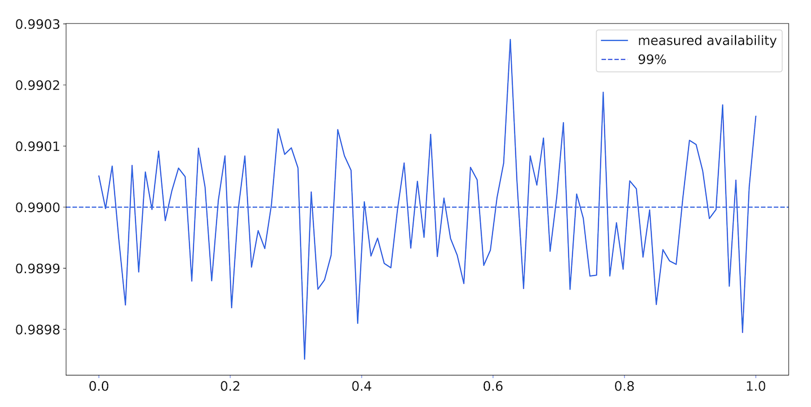
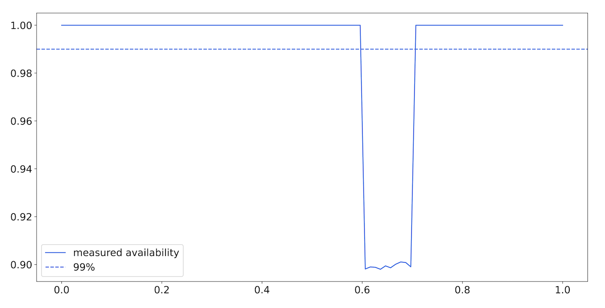

# Chapter 9: Probability and Statistics for SLIs and SLOs

> **Implementing Service Level Objectives** — Toby Burress and Jaime Woo
> *Using Probability to Set SLOs, Statistics to Measure SLIs, and Queuing Theory to Predict Latency*

This is the most mathematically rigorous chapter in the book. Burress and Woo provide the formal foundations for two problems that arise in SLO implementation: (1) figuring out what an SLO *ought* to be given system architecture and dependencies, and (2) interpreting measured SLI data correctly — especially for low-traffic services where naive measurement produces misleading results. The chapter covers Bernoulli trials, binomial and geometric distributions, Bayesian inference, Poisson processes, queuing theory, and durability SLIs.

You don't need this chapter to implement SLOs. You need it to *reason rigorously* about edge cases — especially low-traffic services, dependency chains, and durability guarantees.

## Table of Contents

- [Probability: Setting Achievable SLOs](#probability-setting-achievable-slos)
  - [Single vs. Multi-DC: Independence Buys Reliability](#single-vs-multi-dc-independence-buys-reliability)
  - [Why Retries Aren't the Same as Redundancy](#why-retries-arent-the-same-as-redundancy)
- [The Low-Traffic Problem](#the-low-traffic-problem)
  - [When Small Samples Mislead](#when-small-samples-mislead)
  - [Bayesian Solutions: Using Priors to Stabilize Measurement](#bayesian-solutions-using-priors-to-stabilize-measurement)
- [Queuing Theory for Latency SLOs](#queuing-theory-for-latency-slos)
  - [The Utilization Curve](#the-utilization-curve)
  - [Percentiles and Low-Traffic Systems](#percentiles-and-low-traffic-systems)
- [Durability SLIs](#durability-slis)
  - [Modeling Data Loss Probabilistically](#modeling-data-loss-probabilistically)
  - [Replication and Expected Lifetime](#replication-and-expected-lifetime)

**Block types:** [Core Concept] [Mathematical Foundation] [Worked Example] [Common Pitfall] [Implementation Guide] [Senior EM Application] [2025 Update] [Production Thinking]

---

## Probability: Setting Achievable SLOs

### Single vs. Multi-DC: Independence Buys Reliability

The chapter uses "Dewclaw" — a thumbnail service at fictional company Catz — to demonstrate how redundancy across failure domains compounds reliability.

> **[Mathematical Foundation: Independence and Failure Probability]**
>
> If Dewclaw runs in one DC, it must match its customer's SLO directly:
> - Frontend needs 99.99% → Dewclaw must provide 99.99%
>
> If Dewclaw runs in *two* independent DCs with automatic failover:
> - P(both fail) = P(DC1 fails) × P(DC2 fails) = P(f)²
> - For P(both fail) < 0.0001: P(f) < 0.01
> - **Each DC only needs 99% availability to deliver 99.99% combined**
>
> Two orders of magnitude less reliable individually → same compound reliability. This is the mathematical basis for multi-region architecture.
>
> **Critical assumption:** Independence. If both DCs share a common failure mode (same software version, same config push, same upstream dependency), P(DC1 fails | DC2 fails) ≠ P(DC1 fails), and the math breaks down.

### Why Retries Aren't the Same as Redundancy


*Figure 9-3: The mental model — availability is uniformly ~99% at every moment. In this model, retrying the same service would work because each attempt is independent.*


*Figure 9-4: The reality — services are mostly 100% available, then catastrophically unavailable. During outage periods, retries to the same DC are useless because failures are correlated.*

> **[Core Concept: Retries vs. Redundancy]**
>
> The distinction matters profoundly for SLO architecture:
>
> | Strategy | Works When | Fails When |
> |---|---|---|
> | **Retry same DC** | Transient errors (network blip, single request timeout) | Correlated failures (service down, overloaded, bad deploy) |
> | **Failover to different DC** | Correlated failures within one DC | Correlated failures across DCs (shared dependency, global config) |
>
> Real services fail *catastrophically* rather than *uniformly*. During catastrophic failure, retries to the same failure domain are useless (and potentially harmful — they add load to an already overloaded system).
>
> **Practical rule:** If you need to improve availability by redundancy, add capacity in a different failure domain. If you're retrying within the same domain, you're only handling transient errors — not protecting your SLO from real outages.

---

## The Low-Traffic Problem

### When Small Samples Mislead

The central problem: for a service receiving ~1 request per minute, the conventional 5-minute SLI calculation window gives you only 5 data points. A single failure drops measured availability to 80% — a catastrophic SLO violation even if real availability is 99.99%.

> **[Worked Example: Batch Service — False SLO Violations]**
>
> Setup:
> - Service: "Batch" — 1 request/minute average, SLO of 99.9%
> - Measurement window: 5 minutes → ~5 requests per window
> - True availability: 99.99% (one failure per ~10,000 requests)
>
> Using the geometric distribution:
> - Median time to first failure: ~6,932 requests ≈ 114 hours ≈ 5 days
> - **Result:** A service that's actually 99.99% reliable will appear to violate its 99.9% SLO roughly every 5 days
>
> This isn't a monitoring bug — it's a *statistical reality*. With small samples, individual failures dominate the measurement.

> **[Common Pitfall: Expected Value vs. Median]**
>
> - Expected (mean) time to first failure at p=0.9999: **10,000 requests**
> - Median time to first failure at p=0.9999: **6,932 requests**
>
> The expected value is skewed by the long tail (it's *possible* to go 100,000+ requests without failure, and this pulls the mean up). The median is more representative of "when will I typically see this happen?"
>
> For operational planning, use the median. For long-term budgeting, use the mean.

### Bayesian Solutions: Using Priors to Stabilize Measurement

The chapter's key statistical contribution: using Maximum a Posteriori (MAP) estimation to incorporate prior knowledge about service reliability into SLI calculation.

> **[Implementation Guide: MAP for Low-Traffic SLIs]**
>
> **The problem:** With 5 data points, Maximum Likelihood Estimation (MLE) gives p̂ = successes/total. One failure in 5 requests → p̂ = 0.8. Useless.
>
> **The solution:** Incorporate a *prior* — your pre-existing belief about service reliability. MAP multiplies the likelihood of the data by the prior probability:
>
> ```
> p̂_MAP = argmax P(E|p) × P(p)
>         (vs MLE: p̂_MLE = argmax P(E|p) alone)
> ```
>
> **Practical encoding:** If you believe the service is ~99.9% reliable, encode this as a prior of "999 successes and 1 failure." Now a single real-world failure barely moves the estimate.
>
> **The danger:** Too strong a prior makes you blind to real outages. The chapter's solution: use a *mixture prior* — one component for "service is up" (p ≈ 0.999) and one for "service is down" (p ≈ 0). The estimate flips between models once evidence is strong enough.
>
> **The practical result:** Allow up to 2 failures in a 30-minute window before alerting. Simple rule, rigorously derived.

> **[Senior EM Application: When to Apply Bayesian SLI Measurement]**
>
> Use standard measurement (MLE) when:
> - High traffic (> 1000 requests per measurement window)
> - Failures in a single window are statistically meaningful
>
> Use Bayesian measurement (MAP with priors) when:
> - Low traffic (< 100 requests per measurement window)
> - Single failures are statistically ambiguous
> - You have strong prior knowledge about service reliability
> - False SLO violation alerts are a problem
>
> Most SLO platforms don't support Bayesian measurement natively. For low-traffic services, the practical alternative is simply expanding the measurement window (from 5 minutes to 30 minutes or longer), which gives you more data points and reduces the impact of individual failures.

---

## Queuing Theory for Latency SLOs

The chapter introduces M/M/1 and M/M/c queuing models to reason about latency behavior.

> **[Core Concept: The Utilization-Latency Curve]**
>
> For a single-server queue (M/M/1):
>
> ```
> Mean latency = 1 / (μ_s - μ_a)
>
> where:
>   μ_s = service rate (requests server can handle per unit time)
>   μ_a = arrival rate (requests arriving per unit time)
>   ρ = μ_a / μ_s = utilization
> ```
>
> As utilization (ρ) approaches 1.0, latency approaches *infinity*. This is the famous "hockey stick" curve.
>
> **Key implications for SLOs:**
> - At 50% utilization: latency = 2× the service time
> - At 80% utilization: latency = 5× the service time
> - At 90% utilization: latency = 10× the service time
> - At 95% utilization: latency = 20× the service time
>
> **This is why latency SLOs degrade non-linearly under load.** You can't set a latency SLO independently of capacity planning.

> **[Production Thinking: Utilization Targets from SLO Constraints]**
>
> If your latency SLO says P99 < 500ms and your base service time is 50ms:
> - You need latency < 10× service time
> - That constrains utilization to < 90%
> - **Your capacity planning target follows directly from your SLO**
>
> This is why "target 70-80% utilization" isn't arbitrary ops wisdom — it's derived from the mathematical relationship between utilization and tail latency.
>
> Adding a second worker (M/M/c with c=2) doubles effective capacity but more-than-doubles the utilization threshold before latency explodes, because the probability of queueing decreases.

### Percentiles and Low-Traffic Systems

> **[Common Pitfall: Percentiles Need Sufficient Data]**
>
> The P95 latency requires at least 20 data points to be meaningful (19 below, 1 at-or-above). The P99 requires at least 100.
>
> For Batch at 1 request/minute:
> - P95 needs 20 minutes of data
> - P99 needs 100 minutes (1.7 hours)
>
> **For low-traffic services:** Use mean latency and standard deviation rather than percentiles. Or accept longer measurement windows for percentile-based SLIs.

---

## Durability SLIs

The hardest SLI to measure — you can't observe data loss without losing data.

> **[Core Concept: Durability as Expected Lifetime]**
>
> Definition: **The expected value of the lifetime of a unit of stored data.**
>
> This is fundamentally different from availability:
> - Availability: "Can I access this data right now?" (measured per-request)
> - Durability: "Will this data still exist tomorrow/next year?" (measured as expected time-to-loss)
>
> The paradox: if your system never loses data, you can't directly measure the durability SLI. Instead, you measure *precursor events* (disk failures, degraded replicas) and infer durability from them using probability models.

> **[Worked Example: How Replication Compounds Durability]**
>
> Given:
> - Mean time to disk failure (1/μ): 1,000,000 hours
> - Mean time to repair/re-replicate (1/λ): 1 hour
>
> | Replication Factor | Expected Data Lifetime | Improvement |
> |---|---|---|
> | 1 disk | 1,000,000 hours (~114 years) | Baseline |
> | 2 disks | ~60,000 years | 526× better |
> | 3 disks | ~1.9 × 10¹³ years | Astronomical |
>
> The math: with 2 disks, data is lost only if the second disk fails *during the 1-hour repair window* after the first disk fails. Probability ≈ 1/1,000,000 per disk failure event.
>
> **Critical caveat:** These numbers assume independent failures. Correlated failures (bad firmware batch, power event, software bug affecting all replicas) are not modeled and are the *actual* primary cause of data loss in practice.

> **[Production Thinking: Durability Engineering Priorities]**
>
> From the math:
> - Improving mean time to failure by 1% → improves 2-disk durability by ~2%
> - Improving mean time to repair by 1% → improves 2-disk durability by ~1%
>
> **Reducing repair time is less impactful than reducing failure rate** for multi-replica systems. But in practice:
> - Failure rate is determined by hardware (hard to change)
> - Repair time is determined by software (easy to change)
>
> So repair time optimization often has better ROI despite smaller mathematical impact — because the engineering cost is lower.
>
> The *real* durability work is protecting against correlated failures that the math doesn't model: software bugs, human error, and cascade failures. This is why all major storage systems invest heavily in checksumming, immutable backups, and blast-radius isolation.

---

> **[2025 Update: Statistical SLI Measurement in Practice]**
>
> The Bayesian approaches in this chapter are now partially automated:
>
> | Concept from Chapter | 2025 Implementation |
> |---|---|
> | MAP estimation for low-traffic SLIs | Datadog's "minimum sample size" setting; Nobl9's "low-volume SLO" mode |
> | Poisson arrival modeling | Native in capacity planning tools (AWS Auto Scaling predictive mode) |
> | Utilization-latency relationship | Load testing tools (k6, Locust) now visualize this curve automatically |
> | Durability inference from disk failures | Cloud providers publish durability numbers (S3: 99.999999999%) derived from exactly this type of analysis |
> | Percentile instability at low volumes | Prometheus `histogram_quantile` now warns about insufficient bucket samples |
>
> **The key insight remains:** at low traffic, your SLI measurements are *noisy*. Either expand the window, add synthetic traffic, or use Bayesian methods. Don't trust point estimates from small samples.

> **[AI & Observability: ML for Statistical SLI Problems (2025)]**
>
> - **Adaptive measurement windows:** ML automatically expands/contracts the SLI calculation window based on traffic volume — tight windows at high traffic, broader windows at low traffic
> - **Anomaly-aware priors:** Instead of static priors, ML learns the service's failure patterns and dynamically adjusts the prior based on time-of-day, recent deploys, and dependency health
> - **Correlation detection for durability:** ML identifies correlated failure patterns that violate independence assumptions — the blind spot in this chapter's durability math
> - **Automatic capacity SLO derivation:** Given latency SLOs and queuing theory constraints, ML recommends utilization targets and auto-scaling thresholds

---

**Chapter 9 establishes:** SLO implementation requires mathematical rigor for edge cases. Multi-DC redundancy with independence buys orders of magnitude in reliability. Low-traffic services need Bayesian measurement (or wider windows) to avoid false SLO violations. Queuing theory explains why latency degrades non-linearly with utilization — linking capacity planning directly to latency SLOs. Durability SLIs require probabilistic inference from precursor events since data loss itself is (hopefully) too rare to observe directly. Throughout: models are approximations, independence assumptions are never perfectly true, but imperfect models still guide better decisions than no model at all.

**Next: Chapter 10 — SLO Evolution and Aspiration (Alex Hidalgo), covering how SLOs change over time as systems and organizations mature.**
