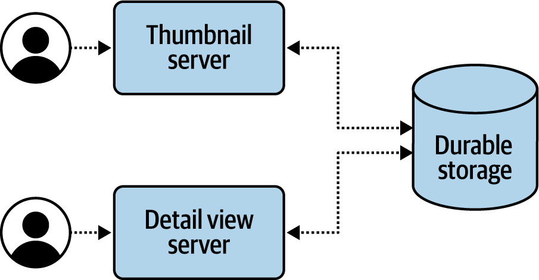
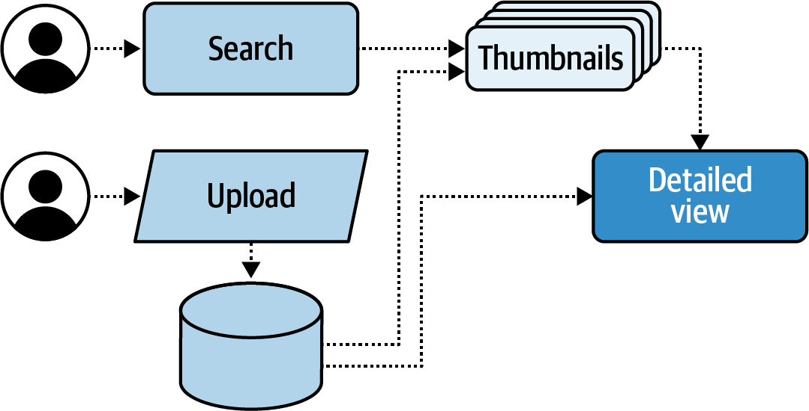
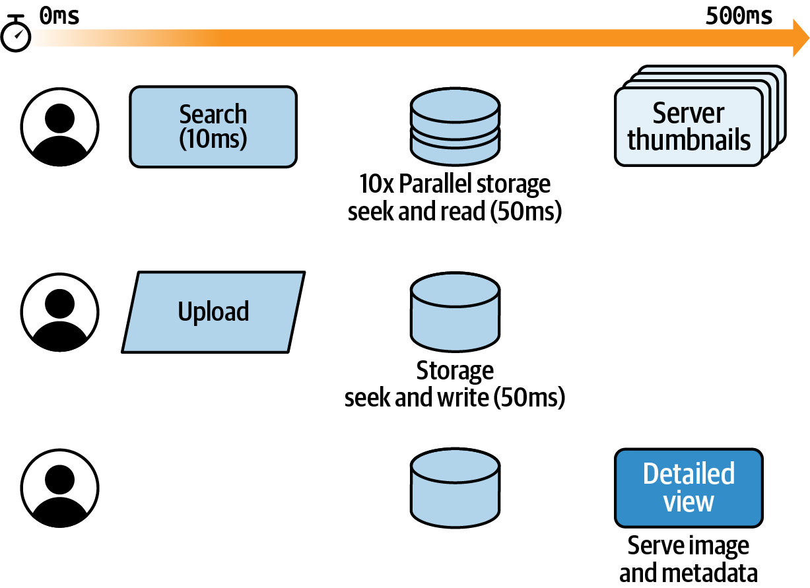
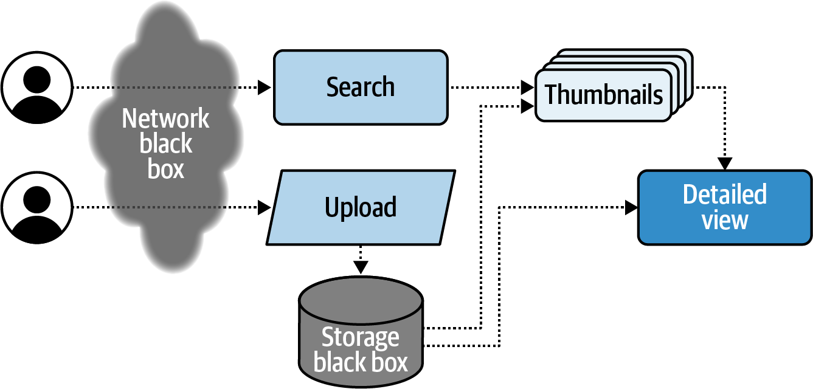

# Chapter 10: Architecting for Reliability

> **Implementing Service Level Objectives** — Salim Virji
> *SLO-Driven System Design, Hardware Trade-offs, Failure Mode Anticipation, and Dependency Analysis*

This chapter inverts the usual SLO narrative. Instead of "here's a running system, let's add SLOs," Virji asks: "given SLO targets, how should we *design* the system?" He walks through the architecture of an image-serving service (imaginit.app) from scratch, making hardware, software, and topology decisions driven by reliability requirements. The chapter connects system architecture decisions — storage type, caching strategy, service boundaries, request classification — directly to their SLO implications.

This is a Non-Abstract Large System Design (NALSD) chapter. It's most valuable for senior engineers and architects making decisions at system inception rather than after deployment.

## Table of Contents

- [SLO-First Architecture](#slo-first-architecture)
- [Hardware Choices and SLO Constraints](#hardware-choices-and-slo-constraints)
  - [Storage Latency Trade-offs](#storage-latency-trade-offs)
  - [MTTR: Dedicated Hardware vs. Services](#mttr-dedicated-hardware-vs-services)
- [Monolith vs. Microservices Through an SLO Lens](#monolith-vs-microservices-through-an-slo-lens)
- [Anticipating Failure Modes](#anticipating-failure-modes)
  - [Graceful Degradation](#graceful-degradation)
  - [Load Balancing as SLO Defense](#load-balancing-as-slo-defense)
- [Three Types of Requests](#three-types-of-requests)
- [Dependencies and Composed Availability](#dependencies-and-composed-availability)
- [The SLO Formula for System Reliability](#the-slo-formula-for-system-reliability)

**Block types:** [Core Concept] [Implementation Guide] [Worked Example] [Architecture Decision] [Common Pitfall] [Senior EM Application] [2025 Update] [Production Thinking]

---

## SLO-First Architecture

> **[Core Concept: Designing Backward from the SLO]**
>
> Traditional approach: Build system → Measure performance → Set SLOs based on what you observe
>
> Virji's approach: Define user journeys → Set SLO targets → Design architecture to meet those targets
>
> This inversion changes *which decisions are possible*. If you know upfront that you need 250ms P95 latency for thumbnail pages, that constrains your storage choice, caching strategy, and geographic distribution before you write any code.
>
> The manufacturing analogy: SLOs are like "lead time" specifications in manufacturing. The factory's layout, tooling, and process flow are all designed to meet the lead time requirement. Similarly, software architecture should be designed to meet SLO requirements.


*Figure 10-1: The initial boxes-and-arrows diagram for imaginit.app. Even at this high level, the architecture reflects SLO constraints — separate paths for thumbnails (latency-sensitive) vs. uploads (throughput-sensitive).*

---

## Hardware Choices and SLO Constraints

### Storage Latency Trade-offs

> **[Architecture Decision: Storage Hardware vs. Latency SLO]**
>
> | Storage Type | Latency for 1MB read | IOPS | Cost | SLO Impact |
> |---|---|---|---|---|
> | Hard disk (HDD) | 10ms seek + 5-40ms read | 1 | $ | Baseline — highly variable, may violate 250ms SLO under load |
> | Solid state (SSD) | ~1ms | 10,000 | $$ | Predictable, comfortably within SLO |
> | RAM | ~0.01ms | 100,000 | $$$$ | Negligible latency contribution |
>
> **The constraint:** If your SLO says 250ms for a page of 10 thumbnails, and HDD adds 15-50ms *per read* with high variance, you're already at risk of consuming half your latency budget on storage alone — before network, application logic, or serialization.
>
> **The decision framework:** Work backward from the SLO budget:
> 1. Total budget: 250ms
> 2. Subtract network RTT: ~50ms
> 3. Subtract application processing: ~20ms
> 4. Remaining for storage: ~180ms for 10 reads = 18ms each
> 5. HDD can do 18ms reads — but with high variance. SSD guarantees it.
>
> This is how SLO targets drive hardware investment decisions.

### MTTR: Dedicated Hardware vs. Services

> **[Core Concept: MTTR Determines Your SLO Ceiling]**
>
> A system cannot offer an SLO greater than its hardware allows. Specifically:
>
> ```
> MTTR(dedicated hardware) = acquisition_time + install_time + setup_time + verification
>                         = hours to days
>
> MTTR(cloud services) = rescheduling_time
>                      = seconds to minutes
> ```
>
> **Worked example:** 99.9% SLO over a quarter = 129.6 minutes of allowed downtime. If replacing a failed database server takes 3+ hours, a single hardware failure exhausts your entire quarterly error budget.
>
> **The architectural implication:** If your SLO is three nines or tighter, you cannot have single points of failure where recovery requires physical hardware intervention. You must either:
> - Use cloud-managed services (MTTR measured in seconds)
> - Build redundancy (failover eliminates the recovery step)
> - Accept that your actual SLO ceiling is lower than what you're promising

---

## Monolith vs. Microservices Through an SLO Lens

> **[Architecture Decision: Service Boundaries and SLOs]**
>
> Virji frames the monolith/microservice choice in SLO terms:
>
> | Architecture | SLO Advantages | SLO Risks |
> |---|---|---|
> | **Monolith** | Single deployment unit — fewer network hops, simpler debugging | Scaling requires scaling everything; failure of one component = failure of all |
> | **Service-oriented** | Independent scaling per SLI; failure isolation; component-specific SLOs | More network dependencies; composed availability is lower; more complex tracing |
>
> **The SLO-driven choice:** If different user journeys have *different* reliability requirements (thumbnail browsing vs. image upload vs. search), service-oriented architecture lets you invest differently in each path. A monolith forces uniform investment.
>
> **The iteration argument:** Systems change. SLOs change. A service-oriented architecture allows you to change one component's reliability investment without rebuilding everything. Closed-ended (monolithic) systems resist change; open-ended (service-based) systems embrace it.

---

## Anticipating Failure Modes

### Graceful Degradation

> **[Implementation Guide: Degradation Hierarchy]**
>
> Virji describes designing *intentional* degradation paths — not random failure, but planned fallbacks:
>
> | Degradation Level | What Happens | User Impact | SLO Status |
> |---|---|---|---|
> | Full service | All features at full quality | None | Meeting SLO |
> | Quality reduction | Lower-resolution images, lazy-load full-res later | Minor — user sees content, quality improves over time | Still meeting SLO (content served within latency target) |
> | Feature shedding | Thumbnails serve, but detail view is slow | Moderate — primary journey works, secondary doesn't | Partial SLO compliance (thumbnail SLI met, detail SLI violated) |
> | Emergency mode | Static cached content, no dynamic queries | Significant — stale data, no search | SLO violated but impact minimized |
>
> **The key architectural decision:** Build the degradation modes *into* the system design. A "bandwidth manager" that can prioritize thumbnail requests over full-image requests isn't an afterthought — it's a first-class architectural component.

### Load Balancing as SLO Defense

> **[Production Thinking: Load Balancers as Invisible SLO Protectors]**
>
> When a backend fails, a load balancer reroutes the request internally — the user never sees the failure. This is the simplest form of SLO defense:
>
> - From the *system* perspective: a backend failed (internal metric)
> - From the *user* perspective: the request succeeded (SLI unaffected)
>
> This is why SLO alerting (Chapter 8) is superior to component alerting. The load balancer handles the failure silently. A component alert would page someone; an SLO alert would not fire because the user wasn't impacted.

---

## Three Types of Requests

> **[Core Concept: Request Classification Drives Architecture]**
>
> Not all requests deserve the same reliability investment:
>
> | Type | Characteristics | SLO Focus | Architecture Pattern |
> |---|---|---|---|
> | **Synchronous** | User waits for response; in critical path | Latency + availability | Direct serving path, caching, load balancing |
> | **Asynchronous** | User doesn't wait; background processing | Completion rate (no latency SLO) | Queue-based, retry-friendly, eventual consistency |
> | **Batch** | Accumulated, processed together | Throughput + completion within window | Scheduled processing, accumulate-then-process |
>
> **The SLO implication:** Synchronous requests need the tightest latency SLOs and the most expensive infrastructure. Asynchronous requests can use cheaper, slower paths. Batch requests can be deferred to off-peak times.
>
> **The architectural implication:** Different request types should take *different paths* through the system. Mixing them on the same infrastructure means over-provisioning for batch (waste) or under-provisioning for synchronous (SLO violation).


*Figure 10-3: Upload, Search, and Detail view take distinct paths through the system. Each path has its own SLO because each represents a different user journey with different expectations.*


*Figure 10-4: Timeline view showing how latency budget is consumed across components. Architects can see where time is spent and where "wiggle room" exists for optimization or degradation.*

---

## Dependencies and Composed Availability


*Figure 10-5: Black boxes (third-party storage, network) set an upper bound on system availability. Caches and CDNs are architectural additions that work around dependency limitations.*

> **[Core Concept: You Can't Be More Reliable Than Your Least Reliable Critical Dependency]**
>
> If your critical-path storage dependency offers 99.9% availability, your system *cannot* offer better than 99.9% — unless you architect around it (caching, redundancy, fallbacks).
>
> **Composed availability formula:**
> ```
> System availability ≤ min(dependency₁, dependency₂, ..., dependencyₙ)
>                        for serial (all-required) dependencies
>
> System availability = 1 - ∏(1 - availabilityᵢ)
>                        for parallel (any-sufficient) dependencies
> ```
>
> **The architectural lever:** Caches, CDN edge nodes, and redundant paths *add parallel alternatives* to serial dependencies. A CDN edge cache means "if origin storage is down, serve from cache." This converts a serial dependency into a parallel one — improving composed availability.

> **[Senior EM Application: The Dependency Audit]**
>
> When inheriting or evaluating a system's SLO feasibility:
>
> 1. **Map all critical-path dependencies** (what must respond for the user to succeed?)
> 2. **For each dependency: what SLO does it offer?** (published SLA, or measured)
> 3. **Compose availability** — multiply for serial chains
> 4. **Compare composed availability to your target SLO**
> 5. **If target > composed:** you need architectural mitigation (caching, fallbacks, redundancy)
>
> This is often the fastest way to determine whether a proposed SLO is *architecturally feasible* with the current design.

---

## The SLO Formula for System Reliability

> **[Core Concept: The Operational SLO Equation]**
>
> Virji provides a formula that connects system reliability to human operational capacity:
>
> ```
> 1 - SLO ≥ (MTTD + MTTM) / MTBF × IMPACT
>
> Where:
>   MTTD  = Mean time to detect (how fast you notice)
>   MTTM  = Mean time to mitigate (how fast you fix)
>   MTBF  = Mean time between failures
>   IMPACT = Fraction of requests/users affected (0 to 1)
> ```
>
> **Reading this:** Your error budget (1 - SLO) must be larger than the fraction of time you spend in a degraded state. That fraction is: (detection + mitigation time) divided by (time between failures), weighted by impact scope.
>
> **Practical implications:**
> - Reduce MTTD: better monitoring, SLO alerting (Chapter 8)
> - Reduce MTTM: runbooks, auto-remediation, smaller blast radius
> - Increase MTBF: better testing, canary deploys, chaos engineering
> - Reduce IMPACT: isolation, graceful degradation, feature flags
>
> Each lever independently improves your ability to meet the SLO. Improving any one of them gives you room to set a tighter target.

> **[2025 Update: Cloud-Native Architecture and SLOs]**
>
> Virji wrote when cloud services were mature but cloud-native patterns were still emerging. By 2025:
>
> | 2020 Decision | 2025 Default |
> |---|---|
> | "HDD vs. SSD vs. RAM for storage" | Managed databases abstract this; you choose performance tier, not hardware |
> | "Build your own load balancer" | Cloud LB is a commodity; focus on LB *policies* (weighted routing, circuit breaking) |
> | "Capacity cache vs. latency cache" | CDN edge + application cache + managed Redis — layered caching is standard |
> | "Monolith vs. microservices" | The nuanced answer won: start monolithic, extract services at scaling boundaries |
> | "Big iron for reliability" | Distributed systems + orchestration (Kubernetes) + multi-AZ for reliability through redundancy |
>
> **The enduring principle:** SLO targets constrain architecture. That hasn't changed. What's changed is the building blocks are more commoditized — you spend less time choosing hardware and more time choosing *patterns* (circuit breakers, bulkheads, retry policies, fallback strategies).

> **[Production Thinking: Instrumentation as Architecture]**
>
> Virji's buried but crucial point: **monitoring infrastructure must be architecturally separate from the system it monitors.**
>
> He describes a system where the monitoring was co-located with the primary service — when the service hit resource limits, monitoring went blind at exactly the moment you needed it most.
>
> Rules:
> - SLI collection must have its own resource allocation (CPU, memory, network)
> - SLI data pipeline must not share failure domains with the measured system
> - SLO alerting infrastructure should be more reliable than what it monitors (as Sigelman noted in Ch7)
>
> This isn't gold-plating — it's architectural necessity. Monitoring that fails when the system fails provides zero value.

---

**Chapter 10 establishes:** System architecture should be designed backward from SLO targets. Hardware choices (storage type, redundancy) set a reliability ceiling. MTTR determines whether human response can defend an SLO — cloud services with seconds-to-recover beat dedicated hardware with hours-to-recover. Different request types deserve different paths and different SLOs. System availability is bounded by critical-path dependency availability unless you architect around it (caching, redundancy, fallbacks). The operational formula (MTTD + MTTM) / MTBF × IMPACT connects architecture to operational reality. Instrumentation must be architecturally independent of the system it monitors.

**Next: Chapter 11 — Data Reliability (David Griesinger and Salim Virji), covering durability SLOs, data integrity measurement, and designing storage systems for quantifiable reliability.**
