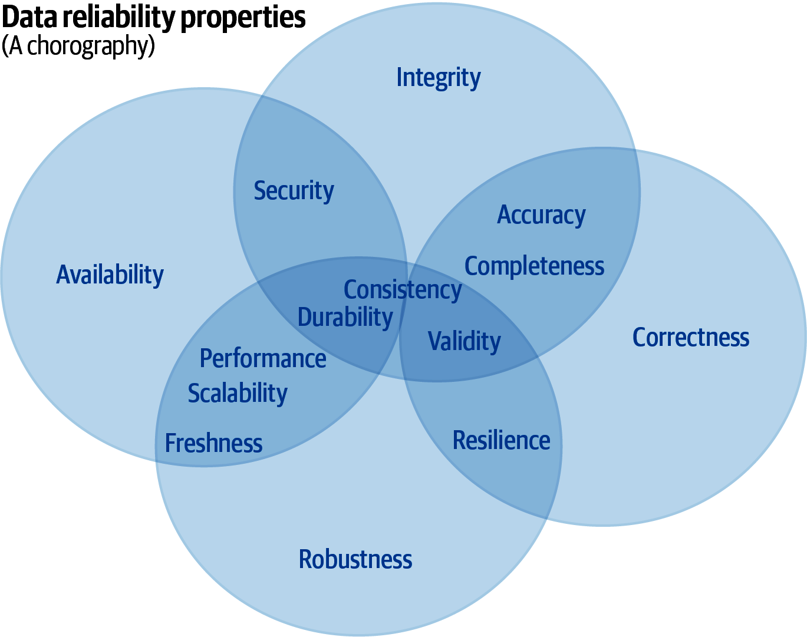

# Chapter 11: Data Reliability

> **Implementing Service Level Objectives** — Polina Giralt, Blake Bisset
> *Data Properties, Application Properties, Irrecoverable Loss, Property Conflicts, and Polyglot Persistence*

Data reliability is fundamentally different from service reliability. When a web service goes down, you restore it and users retry. When data is lost, corrupted, or leaked, there is often no recovery path. Giralt and Bisset systematize this by defining 13 measurable properties — 7 intrinsic data properties and 6 data application properties — each with concrete SLO examples. The chapter's deepest insight is that these properties frequently conflict: optimizing for one degrades another. The architectural challenge is choosing which trade-offs your users can tolerate and encoding those choices as SLOs.

This chapter is essential for any team running databases, data pipelines, ML training infrastructure, or analytics platforms — anywhere data is the product, not just a byproduct of serving requests.

## Table of Contents

- [Why Data Reliability Is Different](#why-data-reliability-is-different)
- [Seven Data Properties](#seven-data-properties)
  - [Freshness](#freshness)
  - [Completeness](#completeness)
  - [Consistency](#consistency)
  - [Accuracy](#accuracy)
  - [Validity](#validity)
  - [Integrity](#integrity)
  - [Durability](#durability)
- [Six Data Application Properties](#six-data-application-properties)
- [Property Conflicts and Trade-offs](#property-conflicts-and-trade-offs)
- [The System Design Concerns Matrix](#the-system-design-concerns-matrix)
- [Polyglot Persistence and SLOs](#polyglot-persistence-and-slos)

**Block types:** [Core Concept] [Implementation Guide] [Worked Example] [Common Pitfall] [Senior EM Application] [2025 Update] [Production Thinking] [Organizational Reality]

---

## Why Data Reliability Is Different

> **[Core Concept: The Irrecoverability Problem]**
>
> Service reliability follows a detect-mitigate-recover loop. Data reliability has a fundamentally different failure mode:
>
> | Failure Type | Service Impact | Data Impact | Recovery |
> |---|---|---|---|
> | Availability loss | Users get errors during outage | Users can't access data during outage | Restore service, users retry |
> | Data corruption | May serve wrong results | Data is silently wrong in storage | Must detect, find backup, restore — if one exists |
> | Data loss (durability) | N/A | Data ceases to exist | Impossible without backup. Period. |
> | Confidentiality breach | N/A | Data exposed to wrong parties | Cannot be "unexposed" — damage is permanent |
>
> The key insight: for durability, integrity, and confidentiality failures, **there is no rollback**. Once data is lost, corrupted beyond detection, or leaked, the damage cannot be undone by operational response. This makes prevention — not detection and response — the primary strategy.

*Figure 11-1: The 13 data reliability properties divided into intrinsic data properties (left) and data application properties (right). Properties within and across groups frequently conflict with each other.*

---

## Seven Data Properties

### Freshness

> **[Core Concept: How Old Is Too Old?]**
>
> Freshness measures the lag between when data was produced and when it becomes available for consumption.
>
> **Example SLO:** "95% of records in the analytics dashboard reflect data no older than 15 minutes."
>
> **Why it matters:** Stale data leads to wrong decisions. A stock trading dashboard with 10-minute-old prices is useless. A weekly business report that's 2 hours stale is fine.
>
> **Measurement:** `freshness = current_time - last_update_timestamp`
>
> The acceptable freshness window is entirely context-dependent. The SLO encodes what "too old" means for your specific users.

### Completeness

> **[Core Concept: Is Everything Here?]**
>
> Completeness measures whether all expected data has arrived and is available.
>
> **Example SLO:** "99.9% of events ingested into the pipeline appear in the queryable store within 1 hour."
>
> **Measurement approaches:**
> - Record counts at source vs. destination
> - Canary records injected at known intervals
> - Schema validation (all required fields populated)
>
> **The subtle failure:** Incomplete data often doesn't cause errors — it causes silently wrong results. A report that's missing 5% of transactions still renders. It just shows the wrong revenue number. This is why completeness needs its own SLO, not just availability.

### Consistency

> **[Implementation Guide: Consistency Across Replicas and Systems]**
>
> Consistency measures whether different views of the same data agree with each other.
>
> **Example SLO:** "99.95% of reads from any replica return data no more than 5 seconds behind the primary."
>
> **Types of consistency SLOs:**
> | Type | Measures | Example |
> |---|---|---|
> | Cross-replica | Lag between primary and read replicas | "Replica lag < 5s at P99" |
> | Cross-system | Agreement between derived datasets | "Search index matches source of truth within 10 minutes" |
> | Transactional | Atomicity of multi-record operations | "99.99% of transactions are fully committed or fully rolled back" |

### Accuracy

> **[Core Concept: Is the Data Correct?]**
>
> Accuracy measures whether the data reflects ground truth. This is the hardest property to measure because you need an independent source of truth to compare against.
>
> **Example SLO:** "GPS location data is accurate to within 10 meters for 99% of readings."
>
> **Measurement strategies:**
> - Spot-check against known-good reference data
> - Statistical validation (distributions match expected patterns)
> - Cross-validation between independent measurement systems

### Validity

> **[Implementation Guide: Does the Data Conform to Its Schema?]**
>
> Validity measures whether data conforms to defined structural and semantic rules.
>
> **Example SLO:** "99.99% of records pass schema validation on write."
>
> **Validity checks include:**
> - Type correctness (string in a string field, not null where required)
> - Range constraints (age > 0, temperature within physical bounds)
> - Referential integrity (foreign keys point to existing records)
> - Business rules (order total = sum of line items)

### Integrity

> **[Production Thinking: Silent Corruption Is the Worst Failure Mode]**
>
> Integrity measures whether data has been modified unexpectedly — by bugs, hardware faults, or malicious actors.
>
> **Example SLO:** "100% of stored objects pass checksum verification on read."
>
> **Why 100% is appropriate here:** Unlike availability or latency where some budget is acceptable, any integrity failure means data you trusted is wrong. The SLO target for integrity should be as close to 100% as measurement allows.
>
> **Detection mechanisms:**
> - Checksums on write and verify on read
> - Merkle trees for large datasets
> - Write-once storage for audit logs
> - Regular scrubbing (reading all data to verify checksums)
>
> Note: you cannot SLO your way out of undetected corruption. If you don't check, you don't know. The SLI measurement itself is the defense.

### Durability

> **[Core Concept: Will the Data Still Exist Tomorrow?]**
>
> Durability measures the probability that stored data will not be lost.
>
> **Example SLO:** "99.999999999% of objects stored will not be lost in a given year" (11 nines — this is AWS S3's published durability).
>
> **The arithmetic of durability:**
> - 11 nines over 1 billion objects = expect to lose 0.01 objects per year
> - 6 nines over 1 billion objects = expect to lose 1,000 objects per year
>
> **Durability is achieved through redundancy:**
> - Replication across disks (RAID)
> - Replication across machines
> - Replication across data centers
> - Replication across regions
>
> Each layer adds a nine of durability — and a multiplier of cost.

> **[Common Pitfall: Confusing Availability with Durability]**
>
> A system can be unavailable (can't access data right now) without losing durability (the data still exists, you just can't reach it). Conversely, a system can be highly available while silently losing durability (serving from cache while the durable store is corrupted).
>
> These are independent properties requiring independent SLOs:
> - **Availability SLO:** "99.9% of read requests succeed within 200ms"
> - **Durability SLO:** "99.9999999% annual object retention"
>
> You need both. Having either alone is insufficient.

---

## Six Data Application Properties

> **[Core Concept: How the Application Uses Data]**
>
> Beyond the data itself, the system that stores and serves it has its own reliability properties:
>
> | Property | What It Measures | Example SLO |
> |---|---|---|
> | **Security** | Data accessible only to authorized parties | "0 unauthorized access events per quarter" |
> | **Availability** | Data accessible when needed | "99.95% of queries return within 500ms" |
> | **Scalability** | System handles growth without degradation | "Latency P99 < 200ms at 2x current load" |
> | **Performance** | Speed of data operations | "Batch job completes within 4-hour window" |
> | **Resilience** | Recovery from failures | "RTO < 15 minutes, RPO < 5 minutes" |
> | **Robustness** | Handling unexpected inputs gracefully | "99.9% of malformed inputs are rejected with informative errors" |
>
> These map directly to the service-level SLOs from earlier chapters — but applied specifically to data infrastructure. The key addition is that data systems have properties (durability, integrity) that stateless services do not.

---

## Property Conflicts and Trade-offs

> **[Senior EM Application: The Trade-off Matrix]**
>
> Properties conflict. Optimizing for one often degrades another. Understanding these conflicts is essential for setting realistic combined SLOs.
>
> | Conflict | Why It Exists | Resolution Strategy |
> |---|---|---|
> | **Freshness vs. Completeness** | Waiting for all data to arrive makes data older; publishing immediately means some records are missing | Choose: publish partial data quickly, or complete data slowly. SLO makes the choice explicit. |
> | **Consistency vs. Availability** | The CAP theorem — during network partitions, you must choose | Per-operation consistency levels (strong for writes, eventual for reads) |
> | **Performance vs. Durability** | Synchronous replication to 3 data centers is slow; async is fast but risks loss | Tiered durability: critical data gets sync replication, bulk data gets async |
> | **Security vs. Performance** | Encryption, access control checks, and audit logging add latency | Hardware acceleration, caching of auth decisions, async audit trails |
> | **Accuracy vs. Freshness** | Validation and enrichment take time; skipping them is faster | Publish fast with provisional flag, update after validation completes |
>
> **The organizational implication:** These trade-offs should not be made by infrastructure teams alone. They encode business decisions ("is it worse to show stale data or incomplete data?") that require product input. SLOs make these trade-offs visible and negotiable.

> **[Production Thinking: You Cannot Maximize Everything]**
>
> The most common data reliability failure is attempting to maximize all 13 properties simultaneously. This leads to:
> - Over-engineered systems that are slow and expensive
> - Implicit trade-offs made by whoever wrote the code (not by deliberate business decision)
> - No clear SLO because "everything should be perfect" is not a measurable target
>
> The discipline of SLOs forces explicit prioritization: "For this data product, freshness matters more than completeness. We will publish within 5 minutes even if 2% of records haven't arrived yet." That's a real, measurable, defensible SLO.

---

## The System Design Concerns Matrix

> **[Implementation Guide: Mapping Properties to Architecture Decisions]**
>
> Giralt and Bisset provide a matrix connecting data properties to architectural dimensions:
>
> | Architectural Dimension | Properties It Affects | Design Choices |
> |---|---|---|
> | **Time** | Freshness, consistency, performance | Sync vs. async processing, batch window size, replication lag tolerance |
> | **Access** | Security, availability, performance | Read replicas, caching layers, access control granularity |
> | **Redundancy** | Durability, availability, resilience | Replication factor, geographic distribution, backup frequency |
> | **Sampling** | Completeness, accuracy, performance | Full processing vs. statistical sampling, aggregation granularity |
> | **Mutability** | Integrity, consistency, durability | Append-only vs. in-place update, event sourcing vs. state mutation |
> | **Distributed** | Consistency, availability, freshness | Single-leader vs. multi-leader, consensus protocols, conflict resolution |
>
> **How to use this matrix:** When setting data SLOs, identify which properties matter most for your use case. Then trace those properties to architectural dimensions. The dimensions reveal what design decisions you need to make — and what trade-offs are inherent in those decisions.

---

## Polyglot Persistence and SLOs

> **[2025 Update: Modern Data Stacks Multiply the SLO Challenge]**
>
> Most organizations now use multiple data stores — relational databases, document stores, search indexes, caches, data lakes, streaming platforms. Each has different reliability characteristics:
>
> | Store Type | Strong Properties | Weak Properties | SLO Focus |
> |---|---|---|---|
> | Relational DB (PostgreSQL) | Consistency, integrity, validity | Scalability, freshness at scale | Transactional correctness |
> | Document store (MongoDB) | Scalability, performance | Consistency (by default) | Read/write latency |
> | Search index (Elasticsearch) | Performance, freshness | Durability (derived data) | Query latency, index freshness |
> | Object store (S3) | Durability, scalability | Performance (latency) | Object retention, availability |
> | Streaming (Kafka) | Freshness, completeness | Long-term durability | End-to-end latency, no message loss |
>
> **The SLO implication:** You need different SLOs for different stores — and cross-store consistency SLOs for the pipelines connecting them. "Data written to PostgreSQL appears in Elasticsearch within 30 seconds at P99" is a cross-system freshness SLO that no single component owns.
>
> **In 2025:** Data observability platforms (Monte Carlo, Bigeye, Soda) now provide automated freshness, completeness, and validity monitoring — making data SLIs much easier to collect than when this chapter was written. The tooling gap between service reliability and data reliability has narrowed significantly.

> **[Organizational Reality: Who Owns Data Reliability?]**
>
> Service reliability has a clear owner (the team that runs the service). Data reliability often doesn't:
>
> - The producing team writes the data
> - The platform team stores it
> - The pipeline team transforms it
> - The consuming team reads it
>
> When data is stale, incomplete, or wrong — who is responsible?
>
> **The SLO answer:** Define ownership boundaries at each hand-off point. Each team owns the SLO for their stage:
> - Producer: completeness and accuracy at ingestion
> - Platform: durability and availability of storage
> - Pipeline: freshness and validity of transformation
> - Consumer: defines what "good enough" means and raises issues when SLOs are violated
>
> Without this explicit boundary, data quality issues fall into the gap between teams — discovered only when a downstream report looks wrong.

---

**Chapter 11 establishes:** Data reliability requires its own SLO framework because data failures (loss, corruption, leakage) are often irrecoverable — unlike service failures where users simply retry. Thirteen measurable properties divide into 7 data properties (freshness, completeness, consistency, accuracy, validity, integrity, durability) and 6 application properties (security, availability, scalability, performance, resilience, robustness). These properties frequently conflict — freshness vs. completeness, consistency vs. availability, performance vs. durability — requiring explicit business-driven prioritization encoded as SLOs. The system design concerns matrix maps properties to architectural decisions across six dimensions. Polyglot persistence multiplies the challenge, requiring cross-system SLOs at hand-off boundaries.

**Next: Chapter 12 — A Worked Example (Alex Hidalgo), demonstrating end-to-end SLO implementation across a multi-component retail architecture with customer-facing, vendor, internal, and platform SLOs.**
