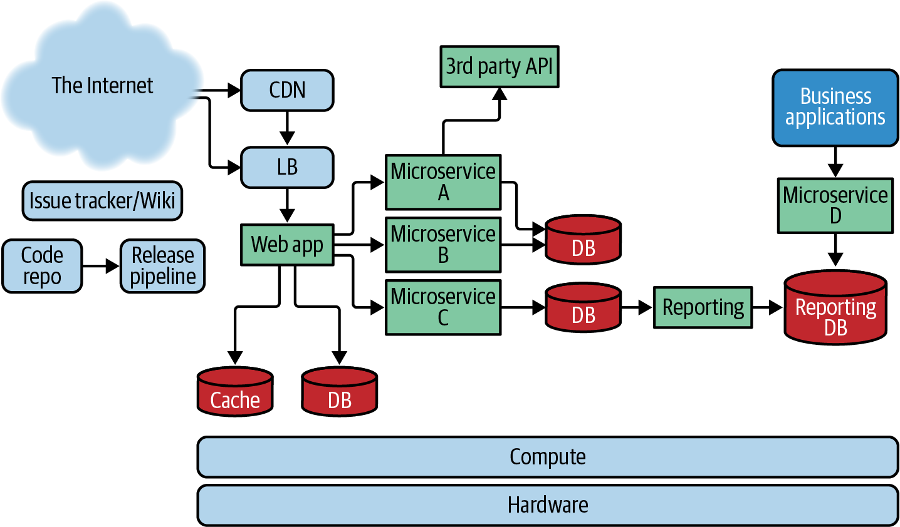
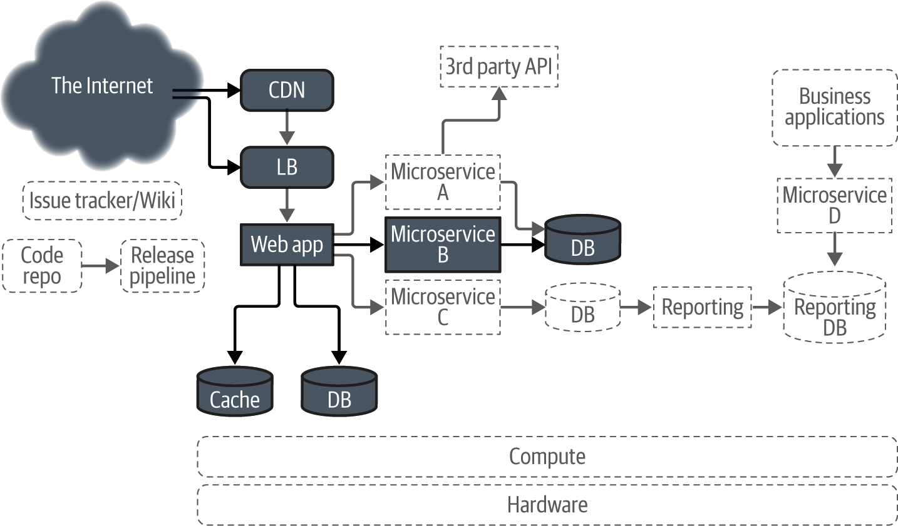
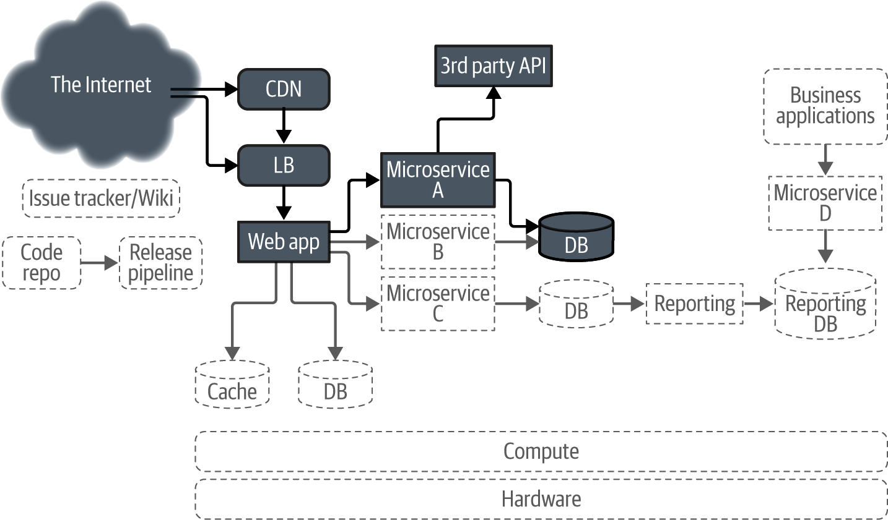
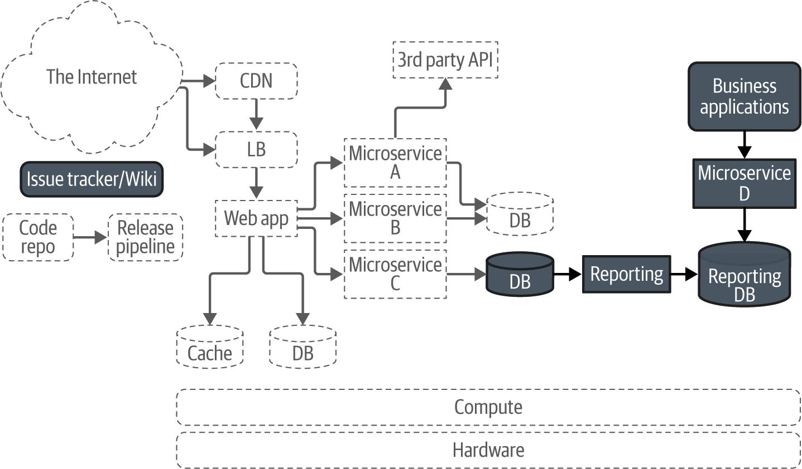
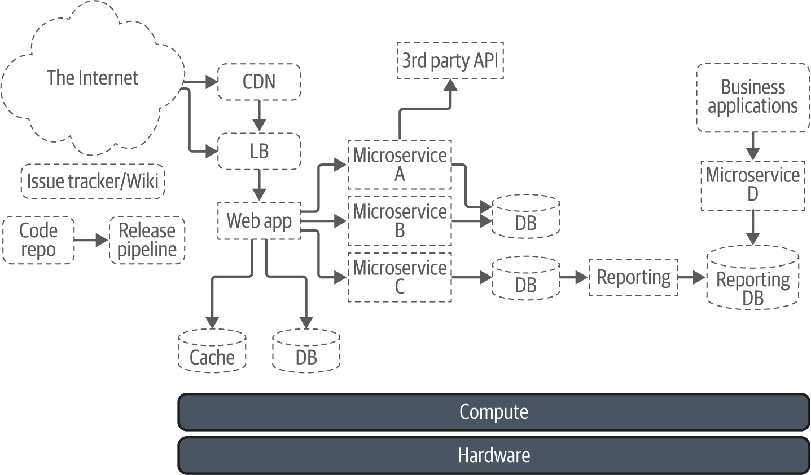

# Chapter 12: A Worked Example

> **Implementing Service Level Objectives** — Alex Hidalgo
> *End-to-End SLO Implementation for a Multi-Component Retail Architecture*

This chapter is the payoff. After eleven chapters of theory, principles, and individual techniques, Hidalgo constructs a complete SLO implementation for a fictional retail company — "The Wiener Shirt-zel Clothing Company." The example covers customer-facing web services, vendor dependencies, internal business tools, and platform infrastructure — demonstrating that SLOs apply everywhere, not just to external APIs. The composed dependency math, the tiered targets for different user populations, and the distinction between "what we promise externally" and "what we target internally" all come together here.

This is the chapter to reference when someone asks "but what does this actually look like in practice?"

## Table of Contents

- [The Architecture](#the-architecture)
- [Customer-Facing SLOs](#customer-facing-slos)
  - [Front Page Load](#front-page-load)
  - [Search](#search)
- [Vendor Dependencies and Composed Availability](#vendor-dependencies-and-composed-availability)
- [Internal User SLOs](#internal-user-slos)
  - [Desktop Analytics Application](#desktop-analytics-application)
  - [Internal Wiki](#internal-wiki)
- [Platform SLOs](#platform-slos)
  - [Container Platform Pod Availability](#container-platform-pod-availability)
- [Lessons from the Worked Example](#lessons-from-the-worked-example)

**Block types:** [Core Concept] [Implementation Guide] [Worked Example] [Common Pitfall] [Senior EM Application] [2025 Update] [Production Thinking] [Organizational Reality]

---

## The Architecture


*Figure 12-1: The Wiener Shirt-zel Clothing Company architecture. Multiple user-facing services (web storefront, internal tools) running on shared platform infrastructure, with external vendor dependencies for payment processing.*

> **[Core Concept: SLOs at Every Layer]**
>
> Hidalgo's architecture has four distinct layers, each requiring its own SLO strategy:
>
> | Layer | Examples | SLO Audience | Key Insight |
> |---|---|---|---|
> | Customer-facing services | Storefront, search, checkout | External users | These drive revenue; tightest targets |
> | Vendor dependencies | Payment processor, shipping API | Internal teams consuming external services | You can't control these; SLOs capture what you can *expect* |
> | Internal tools | Analytics app, wiki, admin dashboards | Employees | Lower targets acceptable; different "business hours" windows |
> | Platform infrastructure | Container orchestration, databases, networks | Engineering teams | Platform SLOs are *promises to internal customers* |
>
> The crucial insight: each layer has different users, different expectations, and different consequences of failure. A single SLO target applied uniformly across all layers is always wrong.

---

## Customer-Facing SLOs

### Front Page Load

> **[Worked Example: The Storefront SLO]**
>
> **Service:** Main storefront front page
> **Users:** Retail customers browsing products
>
> | SLI | SLO Target | Window | Rationale |
> |---|---|---|---|
> | Availability (successful HTTP responses) | 99.9% | 30-day rolling | Retail customers have low tolerance for errors; competitors are one click away |
> | Latency (page fully rendered) | 99.9% of requests < 2000ms | 30-day rolling | Research shows abandonment increases sharply above 2 seconds |
>
> **Error budget:** 0.1% of requests over 30 days. At 1 million daily page views, that's 1,000 allowed failures per day, or ~43 minutes of complete outage per month.
>
> **Why 99.9% and not 99.99%:** The team assessed their architecture, dependencies, and operational capacity. With their current infrastructure, 99.99% would require eliminating all single points of failure and automating all remediation — investment not yet justified by the business case.


*Figure 12-2: SLO dashboard for the storefront front page. The dashboard shows current SLI performance against the 99.9% target, remaining error budget, and burn rate trend.*

### Search

> **[Worked Example: Search SLO — Different Journey, Different Target]**
>
> **Service:** Product search
> **Users:** Customers actively looking for specific items
>
> | SLI | SLO Target | Window | Rationale |
> |---|---|---|---|
> | Availability | 99.8% | 30-day rolling | Search is important but not the only way to find products; browsing is an alternative |
> | Latency | 99.8% of requests < 4000ms | 30-day rolling | Search results are more complex; users expect slightly longer waits for "thinking" |
>
> **Why looser than the front page:**
> - Search has more complex backend dependencies (search index, ranking, personalization)
> - Users have an alternative path (browse categories) if search is degraded
> - The 4-second latency target accounts for complex queries that hit multiple shards
>
> **The pattern:** Different user journeys within the same application can and should have different SLO targets. Trying to apply 99.9% to everything forces over-investment in less critical paths.

---

## Vendor Dependencies and Composed Availability

> **[Core Concept: The Math of Composed Dependencies]**
>
> When your service depends on an external vendor, your maximum achievable reliability is bounded by their reliability multiplied by yours.
>
> **The Wiener Shirt-zel payment flow:**
> ```
> Customer → [Your checkout service] → [Payment vendor API] → [Bank]
> ```
>
> **Composed availability calculation:**
> ```
> Your internal service reliability:  99.99%
> Payment vendor published SLA:       99.99%
> 
> Maximum checkout availability = 0.9999 × 0.9999 = 0.9998 (99.98%)
> ```
>
> **Critical insight:** Even if both you and your vendor are independently excellent (four nines each), the composed system is worse than either component alone. With two dependencies at 99.99%, you can only promise 99.98% for the end-to-end flow.
>
> | Number of Serial Dependencies | Each at 99.99% | Composed Availability |
> |---|---|---|
> | 1 | 99.99% | 99.99% |
> | 2 | 99.99% | 99.98% |
> | 5 | 99.99% | 99.95% |
> | 10 | 99.99% | 99.90% |
>
> Every serial dependency degrades your ceiling. This is why minimizing critical-path dependencies is an architectural imperative.

> **[Production Thinking: Vendor SLAs Are Not Vendor SLOs]**
>
> Hidalgo makes a crucial distinction: a vendor's published SLA is their *contractual minimum* — the floor below which they pay penalties. Their actual performance is usually better. But you should:
>
> 1. **Measure their actual reliability** (your SLI of their service)
> 2. **Set your composed SLO based on observed performance** (not their SLA)
> 3. **Budget for their SLA** (the worst case you've agreed to accept)
>
> If a vendor publishes 99.99% SLA but you observe 99.999% performance, don't set your composed SLO assuming their 99.999% will continue. Budget at their SLA — you have no guarantee of anything better.


*Figure 12-3: Visual representation of composed availability. Each dependency in the critical path multiplies to reduce the maximum achievable end-to-end reliability.*

---

## Internal User SLOs

### Desktop Analytics Application

> **[Worked Example: SLOs for Non-Web Applications]**
>
> **Service:** Desktop analytics application (thick client, not web)
> **Users:** Business analysts (internal employees)
> **Critical operation:** Export report to CSV/PDF
>
> | SLI | SLO Target | Window | Rationale |
> |---|---|---|---|
> | Export success rate | 90% | 30-day rolling | Exports are complex operations hitting multiple data sources; some failures are expected |
> | Export latency | 90% complete within 60 seconds | 30-day rolling | Large exports take time; users are willing to wait for a desktop operation |
>
> **Why 90% is appropriate here:**
> - Internal users can retry without business impact
> - The analytics team provides support and workarounds
> - Export failures are usually due to data complexity (huge reports), not system failures
> - Investing in 99% reliability for exports would require significant re-architecture of the data layer
>
> **The lesson:** Not every SLO needs to be high. A deliberately chosen 90% target is better than no target at all. It still provides error budget math, alerting triggers, and a framework for improvement.

### Internal Wiki

> **[Worked Example: Time-Bounded SLOs]**
>
> **Service:** Internal documentation wiki
> **Users:** All employees
>
> | SLI | SLO Target | Window | Time Constraint | Rationale |
> |---|---|---|---|---|
> | Availability | 99.9% | 30-day rolling | Working hours only (M-F, 8am-6pm) | Nobody reads the wiki at 3 AM; maintenance windows at night are free |
> | Page load latency | 99% < 3000ms | 30-day rolling | Working hours only | Acceptable for internal tooling |
>
> **The time-bounded pattern:** By restricting SLO measurement to working hours, you gain:
> - Free maintenance windows (nights and weekends)
> - More realistic targets (you're only measuring when users are actually present)
> - Lower operational cost (no on-call for nights/weekends for this service)
>
> **The trade-off:** If someone does work on a weekend and the wiki is down, that's not counted against the SLO. The team accepts this because the operational cost of 24/7 support for an internal wiki doesn't justify the benefit.


*Figure 12-4: Comparison of SLO targets across different service types. Customer-facing services have tighter targets than internal tools, reflecting different user expectations and business impact.*

---

## Platform SLOs

### Container Platform Pod Availability

> **[Worked Example: Platform SLOs with Tiered Targets]**
>
> **Service:** Internal container orchestration platform (like Kubernetes)
> **Users:** Engineering teams deploying services
> **SLI:** Pod availability (percentage of time a pod is running and healthy)
>
> | Tier | Pod Count | SLO Target | Rationale |
> |---|---|---|---|
> | Critical | 1-2 pods | 99.99% | Single pod loss = complete service outage for the tenant |
> | Standard | 3-10 pods | 99.9% | Losing one pod is absorbed by the remaining replicas |
> | Batch | 10+ pods | 99.5% | Large-scale batch workloads expect some churn; designed for retries |
>
> **Why tiered targets make sense:**
> - A service running 1 pod has no redundancy — any pod failure is a complete outage for that service
> - A service running 10 pods can tolerate 1-2 pod failures without user-visible impact
> - Batch workloads running 100+ pods expect individual pods to fail and have built-in retry logic
>
> **The platform team's promise:** "We will keep your pods running at X% reliability depending on how many you run. If you want higher platform reliability, deploy more replicas."

> **[Senior EM Application: Platform SLOs as Internal Contracts]**
>
> Platform SLOs serve as contracts between the platform team and the product teams that build on the platform. They answer:
>
> - **For product teams:** "What reliability can I expect from the platform? Do I need to build my own redundancy?"
> - **For platform teams:** "What are we responsible for? How do we prioritize platform work?"
> - **For leadership:** "Is the platform team adequately staffed for the reliability they're expected to deliver?"
>
> Without platform SLOs, product teams either over-engineer (assuming the platform is unreliable) or under-engineer (assuming the platform handles everything). Both waste resources.


*Figure 12-5: Tiered platform SLO targets. The platform offers different reliability guarantees based on workload characteristics, creating clear expectations for tenant teams.*

---

## Lessons from the Worked Example

> **[Core Concept: Universal Applicability of SLOs]**
>
> Hidalgo's worked example demonstrates that SLOs are not just for:
> - Web APIs (the obvious case)
>
> They also apply to:
> - Desktop applications (analytics export)
> - Internal tools (wiki during business hours)
> - Platform infrastructure (pod availability)
> - Vendor-dependent flows (payment processing)
> - Composed multi-service journeys (end-to-end checkout)
>
> If something has users and those users have expectations, it can have an SLO.

> **[Common Pitfall: Cargo-Culting a Single Target]**
>
> The most common mistake after reading SLO literature: applying "99.9%" to everything.
>
> Hidalgo's example uses targets ranging from 90% to 99.99% — a 1000x difference in error budget. Each target is chosen based on:
> - User expectations for that specific journey
> - Business impact of failure
> - Architectural constraints (composed dependencies)
> - Operational capacity to defend the target
> - Cost of achieving the target vs. value delivered
>
> A 90% SLO for internal report exports is not "lazy" — it's *correct* given the context.

> **[2025 Update: SLO Tooling Enables This at Scale]**
>
> When Hidalgo wrote this, managing SLOs across multiple service types required significant custom tooling. By 2025:
>
> - **Service catalogs** (Backstage, Cortex, OpsLevel) link services to their SLO definitions
> - **SLO platforms** (Nobl9, Datadog, Google Cloud SLO Monitoring) handle the math for composed dependencies
> - **Business-hours windowing** is a native feature in most SLO tools
> - **Tiered platform SLOs** are implementable via label-based SLO definitions in Kubernetes-native tooling
>
> The conceptual framework Hidalgo describes is now directly implementable with off-the-shelf tooling — the barrier is organizational, not technical.


*Figure 12-6: Summary view of all SLOs across the Wiener Shirt-zel architecture. Different services, different targets, different windows — unified by a common framework.*


*Figure 12-7: SLO coverage across the full architecture — showing which components have defined SLOs and how they compose into end-to-end user journey reliability.*

---

**Chapter 12 establishes:** SLOs apply to every type of system — customer-facing web services, vendor-dependent flows, internal desktop applications, internal tools with time-bounded windows, and platform infrastructure with tiered targets. Composed availability math shows that serial dependencies multiply to reduce your reliability ceiling. Different user types (customers vs. employees vs. engineers) justify different SLO targets ranging from 90% to 99.99%. The key lesson is that SLO targets should be contextually appropriate, not uniformly ambitious. A 90% target for internal exports and a 99.9% target for customer-facing pages are both correct when derived from user expectations, business impact, and operational capacity.

**Next: Chapter 13 — Building an SLO Culture (Harold Treen), covering the organizational change management required to make SLOs a living practice rather than a one-time project.**
