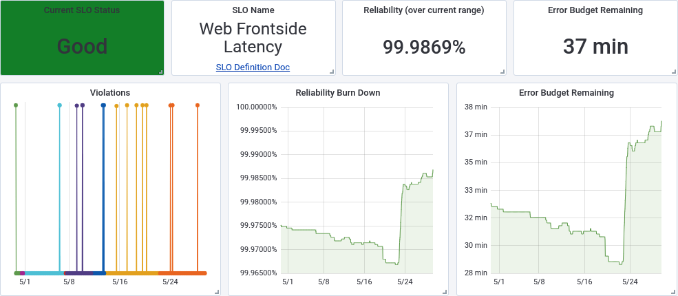
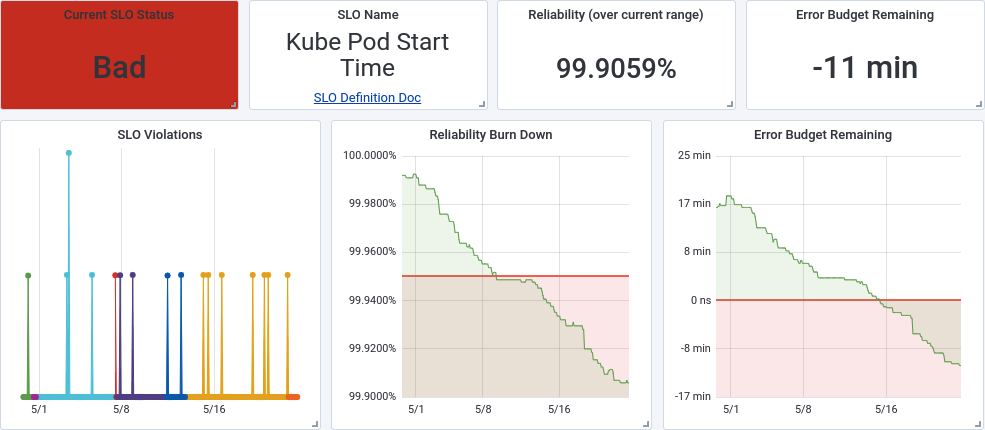

# Chapter 15: Discoverable and Understandable SLOs

> **Implementing Service Level Objectives** — Alex Hidalgo
> *SLO Definition Documents, Consistent Terminology, Centralized Repositories, and Dashboards*

An SLO that exists only in one team's monitoring configuration provides value to that team. An SLO that is discoverable, documented, and understandable provides value to the entire organization — product managers can check reliability before planning, directors can assess portfolio health, adjacent teams can understand dependency reliability, and new engineers can learn what matters for a service in minutes. This chapter covers the infrastructure of SLO communication: definition documents, naming conventions, centralized discovery, and dashboards that tell a story without requiring a PhD in observability.

This is the "last mile" chapter — the difference between SLOs that work for one team and SLOs that work for an organization.

## Table of Contents

- [SLO Definition Documents](#slo-definition-documents)
- [Phraseology and Consistent Terminology](#phraseology-and-consistent-terminology)
- [Discoverability](#discoverability)
- [SLO Dashboards](#slo-dashboards)
  - [Healthy Service Dashboard](#healthy-service-dashboard)
  - [Unhealthy Service Dashboard](#unhealthy-service-dashboard)
- [Connecting Documentation to Tooling](#connecting-documentation-to-tooling)

**Block types:** [Core Concept] [Implementation Guide] [Worked Example] [Common Pitfall] [Senior EM Application] [2025 Update] [Production Thinking] [Template]

---

## SLO Definition Documents

> **[Template: The SLO Definition Document]**
>
> Hidalgo provides a structured template for documenting each service's SLOs. Every SLO should have a document containing:
>
> | Section | Contents | Purpose |
> |---|---|---|
> | **Ownership** | Team name, team lead, oncall rotation | Who to contact when questions arise |
> | **Approvers** | Product manager, engineering lead, SRE lead | Who agreed to these targets |
> | **Definition status & dates** | Draft/Active/Deprecated; created date; last revised date | Lifecycle tracking; staleness detection |
> | **Service overview** | 2-3 paragraph description of what the service does and who uses it | Context for anyone discovering this SLO for the first time |
> | **SLO definitions** | Each SLI, its target, the measurement window, and links to live status | The actual SLOs — the core content |
> | **Rationale** | Why these SLIs were chosen; why these targets; what alternatives were considered | Prevents "why is this 99.9% and not 99.99%?" questions |
> | **Revisit schedule** | Next review date; review cadence; triggers for out-of-cycle review | Prevents staleness |
> | **Error budget policy** | What happens when budget is exhausted; escalation path; thaw procedures | Connects SLO to organizational action |
> | **External links** | Architecture docs, runbooks, dependency maps, dashboards | Quick navigation to related information |
>
> **Why documentation matters:** Without it, SLO knowledge is trapped in the heads of the people who created them. When those people leave, go on vacation, or simply forget the reasoning — the organization loses the ability to evaluate whether the SLOs are still correct.

> **[Implementation Guide: Keep It Alive, Keep It Short]**
>
> The definition document should be:
> - **1-2 pages maximum** — longer documents don't get read or maintained
> - **Machine-readable** where possible (YAML/JSON for SLO definitions, with human-readable wrapper)
> - **Linked to live status** — the document should never contain stale numbers; link to the dashboard
> - **Reviewed on a schedule** — a document without a review date will become stale
>
> **The anti-pattern:** A 15-page SLO document that was written once, never updated, and contains numbers from 18 months ago. This is worse than no document — it creates false confidence.

*Figure 15-1: Example SLO definition document structure. The document balances human-readable context (service overview, rationale) with machine-parseable definitions (SLI specifications, targets, windows).*

---

## Phraseology and Consistent Terminology

> **[Core Concept: Shared Language Enables Shared Understanding]**
>
> Hidalgo emphasizes that inconsistent terminology creates confusion at scale:
>
> | Inconsistent (Confusing) | Consistent (Clear) |
> |---|---|
> | Team A says "uptime," Team B says "availability," Team C says "success rate" | Organization standardizes on "availability" meaning "proportion of successful requests" |
> | "Our SLO is three nines" (is that 99.9% or 999ms?) | "Our availability SLO is 99.9% over a 30-day rolling window" |
> | "We're out of budget" (which budget? what window? how far out?) | "We've consumed 95% of our 30-day availability error budget" |
> | "The SLO is red" (what does red mean? 10% remaining? 0%? below target?) | "Error budget remaining: 12% (7.2 minutes). Status: at risk." |
>
> **Standard terminology to establish:**
> - **SLI:** The measurement (what you're observing)
> - **SLO:** The target (what percentage you're aiming for)
> - **Error budget:** The allowed failure (1 - SLO, expressed in time or request count)
> - **Burn rate:** How fast budget is being consumed relative to sustainable rate
> - **Window:** The time period over which the SLO is evaluated
>
> **The fix:** Publish a glossary. Reference it in onboarding. Use the terms consistently in dashboards, documents, and conversations. Correct deviations gently but consistently.

> **[Common Pitfall: The SLO/SLA Confusion]**
>
> The most persistent terminology confusion: conflating SLOs with SLAs.
>
> | | SLO | SLA |
> |---|---|---|
> | Audience | Internal teams | External customers/contracts |
> | Consequence of miss | Error budget policy (freeze, reliability sprint) | Financial penalties, contract breach |
> | Target relative to each other | SLO should be tighter than SLA | SLA is the floor; SLO is the internal target |
> | Who sets it | Engineering + Product | Legal + Business + Engineering |
>
> **Why this confusion matters:** If teams think the SLO is an external commitment, they'll resist tightening it (fear of contractual risk). If they think the SLA is the internal target, they'll be too lenient (the SLA is already the weakest acceptable performance).

---

## Discoverability

> **[Implementation Guide: Centralized SLO Repositories]**
>
> If you can't find an SLO, it doesn't exist for practical purposes. Hidalgo describes several approaches to discoverability:
>
> | Approach | Pros | Cons | Best For |
> |---|---|---|---|
> | **Wiki pages** (Confluence, Notion) | Easy to create, familiar to everyone | Manual upkeep, easily becomes stale | Small orgs, early adoption |
> | **Docs-as-code** (Markdown in service repos) | Versioned with the code, reviewed in PRs | Scattered across repos, hard to browse | Engineering-heavy orgs, GitOps culture |
> | **Centralized SLO platform** (Nobl9, Datadog) | Always up-to-date, auto-populated from config | Requires platform investment, vendor lock-in | Organizations at scale |
> | **Service catalog integration** (Backstage) | SLO visible alongside all service metadata | Requires service catalog adoption | Platform engineering orgs |
>
> **The key requirement:** Regardless of approach, there must be ONE place where someone can ask "what are the SLOs for service X?" and get a definitive, current answer. If the answer requires asking three people and checking four systems, discoverability has failed.

> **[Senior EM Application: SLO Reports for Leadership]**
>
> Beyond individual service dashboards, leadership needs aggregated views:
>
> - **Portfolio health:** "Of our 47 services with SLOs, 41 are healthy, 4 are at risk, 2 are in violation"
> - **Trend over time:** "Average SLO attainment has improved from 94% to 98% over 6 months"
> - **Budget exhaustion frequency:** "Service X has exhausted budget 4 of the last 6 months — needs investment"
> - **Coverage:** "23% of our services don't have SLOs defined yet — here's the adoption roadmap"
>
> These reports make SLO health visible at the organizational level — enabling resource allocation decisions based on reliability data rather than the loudest voice.

> **[2025 Update: Service Catalogs as SLO Discovery Layer]**
>
> By 2025, the dominant pattern for SLO discoverability is integration with service catalogs:
>
> - **Backstage** (Spotify's open-source IDP) has SLO plugins that surface SLO status on each service's catalog page
> - **Cortex** and **OpsLevel** include SLO tracking as a core scorecard dimension
> - **Datadog Service Catalog** links services to their SLO definitions natively
>
> The pattern: you discover a service in the catalog, and its SLO status is immediately visible alongside ownership, documentation, deployment status, and dependency map. No separate system to check.
>
> **Docs-as-code with auto-publish:** Teams define SLOs in YAML (OpenSLO format) in their service repo. CI/CD pipelines push these definitions to the SLO platform and service catalog automatically. The "source of truth" is the repo; the "display layer" is the catalog/dashboard.

---

## SLO Dashboards

> **[Implementation Guide: Dashboard Components]**
>
> An effective SLO dashboard communicates status at a glance. Hidalgo identifies five essential components:
>
> | Component | What It Shows | Why It Matters |
> |---|---|---|
> | **Status indicator** | Green/Yellow/Red based on budget remaining | Instant health assessment — anyone can understand |
> | **SLI violations graph** | Time series of SLI performance vs. target line | Shows when violations occurred and their severity |
> | **Burndown graph** | Error budget consumed over time, projected forward | Shows trajectory — are we heading toward exhaustion? |
> | **Error budget remaining** | Absolute and percentage of budget left | "How much room do we have?" — directly actionable |
> | **Links to definition docs** | Direct navigation to rationale, policies, ownership | Context for anyone who needs to understand or act |
>
> **The hierarchy of information:** Dashboard viewers have different needs. Design for progressive disclosure:
> 1. **Executive (5 seconds):** Status indicator — green or not?
> 2. **Manager (30 seconds):** Budget remaining + burn rate — do I need to act?
> 3. **Engineer (2 minutes):** Violation graph + burndown — what's happening and when?
> 4. **Investigator (10 minutes):** Drill into SLI data, correlate with deploys, check dependencies

*Figure 15-2: Example SLO dashboard showing a healthy service. Status indicators are green, error budget burndown shows sustainable consumption, and the SLI performance line stays above the target threshold.*

### Healthy Service Dashboard

> **[Worked Example: Reading a Healthy Dashboard]**
>
> A healthy SLO dashboard shows:
> - **Status:** Green
> - **Budget remaining:** 72% (well above comfortable threshold)
> - **Burn rate:** 0.4x (consuming less than half the sustainable rate)
> - **SLI graph:** Occasional minor dips, all recovering quickly, staying above target line
> - **Burndown:** Linear consumption trending toward ~30% remaining at window end
>
> **What this tells the team:** "We're healthy. We have room for risky deployments. No action needed."
>
> **What this tells product:** "Reliability is fine. Feature velocity can continue."
>
> **What this tells leadership:** "This service is well-managed. Budget being consumed, not hoarded."

### Unhealthy Service Dashboard

> **[Worked Example: Reading an Unhealthy Dashboard]**
>
> An unhealthy SLO dashboard shows:
> - **Status:** Red
> - **Budget remaining:** 3% (7.2 minutes left of 43.2 total)
> - **Burn rate:** 8.5x (catastrophic — budget will exhaust within hours)
> - **SLI graph:** Clear degradation starting at a specific timestamp, not recovering
> - **Burndown:** Steep consumption, projected exhaustion date is "today"
>
> **What this tells the team:** "Stop everything. Find and fix the cause. Consider rollback."
>
> **What this tells product:** "Feature work is paused. Reliability sprint activating."
>
> **What this tells leadership:** "There's an active reliability issue. Error budget policy may trigger."
>
> The dashboard tells the same story to different audiences without requiring specialized knowledge.

---

## Connecting Documentation to Tooling

> **[Production Thinking: The Documentation-Tooling Gap]**
>
> The most common failure mode: documentation says one thing, tooling measures another.
>
> | Symptom | Root Cause | Fix |
> |---|---|---|
> | Document says "99.9% availability" but dashboard shows different target | Document was updated, tooling wasn't (or vice versa) | Single source of truth — define SLO in one place, render to both |
> | Document defines SLI one way, alerting measures it differently | Drift between human intent and technical implementation | SLO-as-code: definition drives both documentation and alerting |
> | Dashboard shows green but error budget policy was triggered manually | Dashboard doesn't incorporate manual overrides or partial failures | Include policy status on dashboard |
>
> **The ideal state:** One definition (ideally in code/config) produces:
> - The documentation (auto-rendered)
> - The dashboard (auto-configured)
> - The alerts (auto-generated)
> - The reports (auto-populated)
>
> Any other approach introduces drift over time. Humans will forget to update one of the outputs when the definition changes.

> **[Organizational Reality: Who Maintains SLO Documentation?]**
>
> Hidalgo addresses the maintenance burden:
>
> - **Not a dedicated "SLO team"** — this creates a bottleneck and removes ownership from service teams
> - **Not "everyone"** — diffusion of responsibility means nobody does it
> - **The service team** — the people who own the service own its SLO documentation
> - **With platform support** — the platform team provides templates, tooling, and automation to reduce the burden
>
> **The practical minimum:** Each service team reviews their SLO documentation quarterly (30-minute meeting). The platform team provides a template and automated staleness reminders. Leadership includes "SLO documentation current" as a service readiness criterion.

> **[Common Pitfall: Dashboard Overload]**
>
> The opposite problem from no dashboards: too many dashboards with too much information.
>
> **Signs of dashboard overload:**
> - Dashboard has > 20 panels (no one reads all of them)
> - Multiple dashboards for the same service with conflicting information
> - Dashboard requires scrolling past 3 screens to see everything
> - Team built the dashboard once and never looks at it
>
> **The fix:** One dashboard per service. Five panels maximum for the SLO section. Progressive disclosure for detail. If a dashboard requires explanation to read, it needs simplification.

---

**Chapter 15 establishes:** SLOs provide organizational value only when they are discoverable and understandable by anyone who needs them — not just the team that defined them. SLO definition documents should be structured, short (1-2 pages), and linked to live status rather than containing stale numbers. Consistent terminology prevents confusion at scale. Centralized discovery (via wiki, service catalog, or SLO platform) ensures there's one authoritative place to find any service's SLOs. Dashboards should communicate through progressive disclosure: status indicator for executives (5 seconds), budget remaining for managers (30 seconds), violation graphs for engineers (2 minutes). The ideal architecture has a single definition driving documentation, dashboards, alerts, and reports — eliminating drift between what's documented and what's measured.

**Next: Chapter 16 — SLO Advocacy (Daria Barteneva, Eva Parish), covering the Crawl-Walk-Run framework for scaling SLO adoption from one team to an entire organization.**
