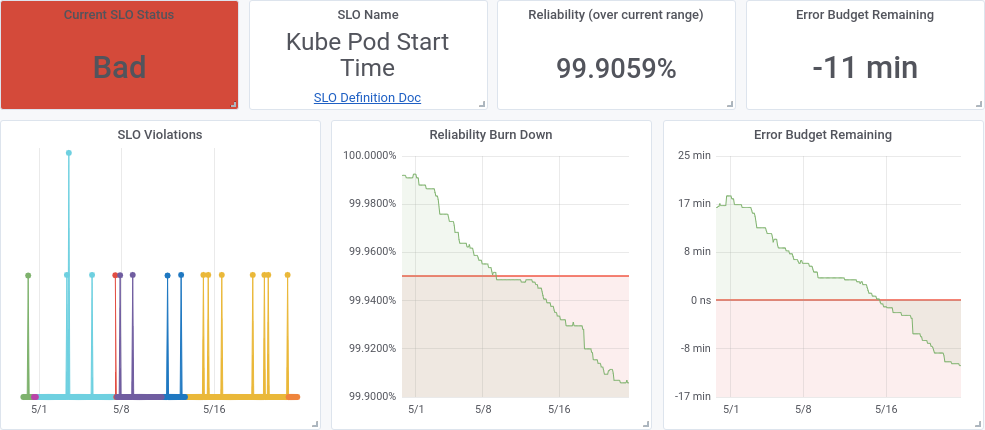

# Chapter 17: Reliability Reporting

> **Implementing Service Level Objectives** — Alex Hidalgo
> *Why Traditional Metrics Fail, Error Budget as Communication Tool, Advanced Reporting, and Worked Example*

This chapter completes the book's arc from measurement to communication. Hidalgo systematically dismantles the three dominant reliability reporting mechanisms — incident counts, severity levels, and MTTX metrics — showing how each fails to communicate actual user-perceived reliability. He then demonstrates how SLO-based reporting (error budget status, reliability burndown, and budget consumption trends) provides immediately actionable information that any stakeholder can understand without specialized training. The closing worked example — a DDoS attack on a restaurant review site — shows how SLO reporting tells a complete story of impact, response, and recovery in terms humans naturally understand.

This chapter is what you hand to leadership when they ask "how are we going to report on reliability?"

## Table of Contents

- [Why Traditional Reporting Fails](#why-traditional-reporting-fails)
  - [Counting Incidents](#counting-incidents)
  - [Severity Levels](#severity-levels)
  - [MTTX Metrics](#mttx-metrics)
- [SLO-Based Reporting](#slo-based-reporting)
  - [Error Budgets as Communication](#error-budgets-as-communication)
  - [SLO Status (Boolean)](#slo-status-boolean)
  - [Reliability Burndown (Flexible Window)](#reliability-burndown-flexible-window)
  - [Error Budget Status (Fixed Window)](#error-budget-status-fixed-window)
- [Worked Example: DDoS on Restaurant Review Site](#worked-example-ddos-on-restaurant-review-site)
- [Making Reports Actionable](#making-reports-actionable)

**Block types:** [Core Concept] [Implementation Guide] [Worked Example] [Common Pitfall] [Senior EM Application] [2025 Update] [Production Thinking] [Organizational Reality]

---

## Why Traditional Reporting Fails

### Counting Incidents

> **[Core Concept: Incident Counts Are Meaningless Without Context]**
>
> The most common reliability report: "We had 7 incidents this month, down from 12 last month."
>
> **Why this fails:**
>
> | Problem | Example | Why It Misleads |
> |---|---|---|
> | No standard definition of "incident" | Team A counts every alert as an incident; Team B only counts customer-reported issues | Incomparable across teams; decrease might just mean stricter/looser definition |
> | No impact weighting | 1 incident lasting 3 hours ≠ 1 incident lasting 30 seconds | "Fewer incidents" might mean fewer short ones (good) or it might be hiding one massive one |
> | Subjective boundaries | Does a flapping service count as 1 incident or 20? | Same event, wildly different counts depending on who's reporting |
> | No user impact correlation | 7 incidents, but how many users were affected? For how long? | Leadership can't translate incident count into business risk |
>
> **The damning comparison:** "We had 7 incidents this month" tells you nothing about whether users were happy. "We consumed 23% of our error budget this month" tells you exactly how much of your reliability allowance was spent — and how much remains before users are materially impacted.

### Severity Levels

> **[Common Pitfall: The Severity Level Illusion]**
>
> Severity levels (P1/P2/P3/P4 or Sev1/Sev2/Sev3) appear to provide structured reporting. In practice, they're subjective, inconsistent, and actively misleading:
>
> | Problem | Manifestation |
> |---|---|
> | **Ambiguous definitions** | "Major impact to customers" — is 1% of customers "major"? 10%? 50%? Every person reads this differently |
> | **Classification happens during crisis** | The on-call engineer at 3 AM must decide "is this P1 or P2?" while firefighting — they guess wrong regularly |
> | **Flapping defies classification** | A service that's up for 5 minutes, down for 2 minutes, up for 5 minutes... is this one P2 or many P4s? |
> | **Political inflation/deflation** | Teams over-classify to get resources ("this is P1!") or under-classify to avoid scrutiny ("just a P3") |
> | **Historical incomparability** | Severity definitions change over time; comparing "P1 count this year vs. last year" compares different definitions |
>
> **The fundamental flaw:** Severity levels try to discretize a continuous phenomenon (user impact over time) into 3-5 buckets. The information loss is massive. SLO reporting preserves the continuous measurement: "We consumed 0.3% of budget per incident-minute × 47 minutes = 14.1% of monthly budget."

### MTTX Metrics

> **[Core Concept: Why MTTX (Mean Time To X) Misleads]**
>
> MTTX metrics — MTTD (detect), MTTR (resolve), MTBF (between failures) — are the traditional engineering reliability metrics. Hidalgo shows why they fail for reporting:
>
> **The mean is a terrible summary statistic for incidents because incidents are not homogeneous.**
>
> | Scenario A | Scenario B | MTTR |
> |---|---|---|
> | 20 incidents, each resolved in 20 minutes | 1 incident, resolved in 3 hours | Scenario A: MTTR = 20 min; Scenario B: MTTR = 180 min |
> | Total downtime: 400 minutes | Total downtime: 180 minutes | Scenario A *looks worse* by MTTR despite *less total impact* |
>
> **The paradox:** Scenario A has 2.2x more total user-facing downtime than Scenario B, but reports a "better" MTTR (20 min vs. 180 min). Meanwhile, Scenario B looks terrible by MTTR despite causing less total harm.
>
> **Additional MTTX failures:**
> - **Each incident is unique** — averaging unique events produces a meaningless number
> - **Distributions are bimodal** — most incidents resolve quickly OR very slowly; the mean represents neither
> - **Gaming the metric** — teams can improve MTTR by not opening incidents for problems they can't fix quickly
> - **No user-impact weighting** — a 1-hour incident affecting 1 user and a 1-hour incident affecting 1 million users have the same MTTR

> **[Production Thinking: The Reporting Metric You Choose Shapes Behavior]**
>
> Metrics create incentives. Bad reporting metrics create perverse incentives:
>
> | Metric Reported | Perverse Incentive | Resulting Behavior |
> |---|---|---|
> | Incident count | Avoid opening incidents | Under-reporting, "this isn't really an incident" |
> | MTTR | Don't open incidents you can't close quickly | Cherry-picking easy incidents, ignoring chronic issues |
> | Severity distribution | Downgrade severity to improve ratios | Political pressure on incident commanders to classify low |
> | Uptime percentage | Avoid measuring during outages | "Scheduled maintenance doesn't count" loopholes |
>
> SLO-based reporting avoids these because it measures from the *user's perspective* — you can't game whether users experienced errors.


*Figure 17-1: Comparison of traditional reliability reporting (incident counts, severity) vs. SLO-based reporting (error budget consumption). The SLO report communicates actual user impact in immediately understandable terms.*

---

## SLO-Based Reporting

### Error Budgets as Communication

> **[Core Concept: "We Have 17 Minutes of Error Budget Remaining"]**
>
> This single statement — "we have 17 minutes of error budget remaining" — communicates more than any incident report:
>
> - **Immediately understandable** by anyone: engineers, product managers, executives, board members
> - **Inherently contextual** — 17 minutes out of 43.2 (monthly budget for 99.9%) means we've consumed 60% — that's concerning but not critical
> - **Forward-looking** — tells you how much room you have, not just what happened
> - **Actionable** — if you know the current burn rate, you know when this budget will hit zero
> - **Comparable** — this month vs. last month; this service vs. that service; all on the same scale
>
> No other reliability metric has this combination of simplicity, context, and actionability.

> **[Senior EM Application: The Executive-Friendly Report]**
>
> For leadership reporting, translate error budgets into time-based language:
>
> | Technical Statement | Executive Translation |
> |---|---|
> | "SLO compliance: 99.87% over 30 days" | "Our users experienced 93 minutes of degraded service this month, out of a 129-minute allowance" |
> | "Error budget consumption: 72%" | "We've used about three-quarters of our monthly reliability allowance" |
> | "Burn rate: 2.3x over the last week" | "At current pace, we'll exhaust our monthly budget with 10 days remaining" |
> | "Budget remaining: 36 minutes" | "We can tolerate about 36 more minutes of issues before our reliability target is missed" |
>
> **The key:** Express in minutes or hours, not percentages with many decimal places. Humans understand "36 minutes remaining" intuitively. They don't understand "0.028% of error budget remaining."

### SLO Status (Boolean)

> **[Implementation Guide: The Simplest Report — Met or Not Met]**
>
> The most basic SLO report is binary: did we meet the SLO this period, or didn't we?
>
> | Service | SLO | Status | Notes |
> |---|---|---|---|
> | Storefront | 99.9% availability (30d) | Met | 99.94% actual; 14 minutes of budget consumed |
> | Search | 99.8% availability (30d) | Met | 99.91% actual; comfortable margin |
> | Checkout | 99.95% availability (30d) | NOT MET | 99.89% actual; 31-minute overspend due to payment provider outage |
>
> **When to use:** Monthly or quarterly reliability reviews with leadership. Quick portfolio health check. "Are we delivering on our commitments?"
>
> **Limitation:** Boolean status loses nuance. "Barely met" and "dramatically exceeded" look the same. That's why you need the richer formats below for operational use.

### Reliability Burndown (Flexible Window)

> **[Core Concept: The Rolling Burndown Shows Trajectory]**
>
> A reliability burndown chart shows error budget consumption over a rolling window — typically 30 days. Unlike a fixed-window report (which resets each period), the rolling burndown always shows the current situation:
>
> - **X-axis:** Time (rolling 30-day window sliding forward)
> - **Y-axis:** Error budget remaining (from 100% down to 0%)
> - **Ideal line:** Flat at some positive value (sustainable consumption)
> - **Warning zone:** Below 20% remaining
> - **Danger zone:** Below 5% remaining or at 0%
>
> **What the shape tells you:**
> - **Flat line at ~70%:** Healthy — steady, sustainable consumption
> - **Steady downward slope:** Chronic slow burn — something is degrading reliability gradually
> - **Cliff (sudden drop):** Single severe incident consumed significant budget
> - **Recovery (upward trend):** Old incidents are aging out of the rolling window — reliability is recovering without action

### Error Budget Status (Fixed Window)

> **[Implementation Guide: Fixed Windows for Human Understanding]**
>
> While rolling windows are better for alerting, fixed windows (calendar month, quarter) are better for reporting because humans naturally think in these periods:
>
> **Monthly report format:**
> ```
> Service: Storefront API
> Period: April 2025
> SLO: 99.9% availability
> Budget: 43.2 minutes (0.1% of 30 days)
> Consumed: 27.4 minutes (63%)
> Remaining: 15.8 minutes (37%)
> Status: WITHIN BUDGET
> 
> Major events:
> - April 7: Database failover (12 minutes consumed)
> - April 19: Deploy rollback (8 minutes consumed)
> - Chronic: Background rate of ~0.24 min/day (7.4 minutes total)
>
> Trend: Budget consumption increasing month-over-month
>         (March: 41%, April: 63%) — investigate chronic burn
> ```
>
> **Why time-based expression:** "27.4 minutes consumed" is immediately meaningful to any human. "0.063% of error budget consumed" requires mental math that most stakeholders won't do.

---

## Worked Example: DDoS on Restaurant Review Site

> **[Worked Example: How SLO Reporting Tells the Incident Story]**
>
> **Scenario:** A restaurant review site (SLO: 99.9% availability over 30 days) is hit by a DDoS attack lasting 45 minutes. 80% of requests fail during the attack.
>
> **Traditional reporting of this incident:**
> - Incident count: +1 P1 incident this month
> - MTTR: 45 minutes (from detection to mitigation)
> - Severity: P1 (> 50% of users impacted)
>
> **SLO reporting of this incident:**
>
> | Metric | Value | Meaning |
> |---|---|---|
> | Error budget before attack | 38.2 minutes remaining (88% consumed already this month) | Already in a fragile state |
> | Budget consumed by attack | 80% of 45 minutes = 36 minutes of "effective" outage | Weighted by impact fraction |
> | Error budget after attack | 2.2 minutes remaining (95% consumed) | Critically low — one more minor incident exhausts budget |
> | Days remaining in window | 8 days | Must survive 8 days with only 2.2 minutes of budget |
> | Required reliability for remainder | 99.98% for the next 8 days | Significantly tighter than normal — consider freezing deploys |
>
> **What SLO reporting adds:**
> - Context: This wasn't the only reliability issue this month — budget was already low
> - Forward-looking: We know exactly how precarious the situation is going forward
> - Actionable: The team can decide whether to freeze deploys for 8 days or risk exhaustion
> - Proportional: The 80% impact (not 100%) is accurately reflected in budget consumption
>
> **The traditional report says:** "We had a P1 incident." **The SLO report says:** "We have 2.2 minutes of tolerance left for the next 8 days — should we invoke the error budget policy?"

> **[Common Pitfall: Confusing Total Outage with Partial Degradation]**
>
> Traditional reporting struggles with partial failures. Is a 50% error rate for 1 hour the same as a 100% outage for 30 minutes?
>
> - **By incident count:** Both are "1 incident" — indistinguishable
> - **By MTTR:** Both show 60 or 30 minutes — MTTR differs but total impact is equal
> - **By SLO budget:** Both consume exactly 30 minutes of error budget (50% × 60 min = 100% × 30 min) — they're correctly identified as equivalent in user impact
>
> SLO reporting naturally handles partial degradation through the error rate × duration formula. Traditional metrics cannot.

---

## Making Reports Actionable

> **[Production Thinking: Reports Must Trigger Decisions]**
>
> A report that doesn't lead to decisions is a waste of time. For each SLO report, the reader should be able to answer:
>
> | Question | What Answers It |
> |---|---|
> | "Do I need to act right now?" | Current budget status + burn rate |
> | "What happened?" | Budget consumption timeline with major events annotated |
> | "Is this getting better or worse?" | Month-over-month trend in budget consumption |
> | "Where should we invest?" | Decomposition of budget consumption by cause (which failures consumed the most budget?) |
> | "Are our targets appropriate?" | Comparison of budget status vs. user satisfaction signals (support tickets, churn) |
>
> **Report frequency recommendations:**
> - **Real-time:** Dashboard (for engineers managing the service)
> - **Weekly:** Brief status (for engineering management — "on track or not?")
> - **Monthly:** Full report with trend analysis (for leadership reviews)
> - **Quarterly:** Strategic assessment (for planning — "where should next quarter's reliability investment go?")

> **[2025 Update: Automated Reliability Reporting]**
>
> By 2025, many organizations have automated their SLO reporting:
>
> - **Automated weekly digests:** SLO platforms (Nobl9, Datadog) send weekly summaries to team Slack channels
> - **Automated escalation:** Budget drops below threshold → automated message to service owner and their manager
> - **Portfolio dashboards:** Real-time view of all services' SLO status on a single screen
> - **AI-generated narratives:** Some platforms now generate natural-language summaries: "Checkout service consumed 72% of budget this month, primarily due to two payment provider incidents on April 7 and 19"
> - **Integration with planning tools:** Budget consumption trends automatically surface in Jira/Linear as potential reliability work
>
> The reporting itself is no longer the bottleneck. The challenge is ensuring the reports reach the right people and trigger the right decisions — an organizational design problem, not a technical one.

> **[Organizational Reality: Reliability Reporting in the Boardroom]**
>
> Hidalgo's deepest point: SLO-based reporting makes reliability legible to non-engineers for the first time.
>
> | Traditional Board Report | SLO-Based Board Report |
> |---|---|
> | "We had 3 P1 incidents and 7 P2s" | "Our customer-facing services used 41% of their reliability budget — healthy" |
> | "MTTR improved from 47 to 38 minutes" | "Our median time from user impact to recovery improved from 47 to 38 minutes, saving approximately 9 minutes of error budget per incident" |
> | "Uptime was 99.87%" | "We delivered 35 minutes more reliability than our target requires — room to accelerate feature delivery" |
>
> The SLO versions connect to business outcomes: customer experience, feature velocity, investment decisions. The traditional versions are opaque to anyone without engineering context.
>
> **The ultimate test of a reliability report:** Can a non-engineer read it and make a correct decision about resource allocation? If yes, it's working. If no, it needs translation into SLO terms.

---

**Chapter 17 establishes:** Traditional reliability reporting fails because incident counts are undefined and subjective, severity levels are ambiguous and politically gamed, and MTTX metrics mislead by averaging non-homogeneous events. SLO-based reporting solves these problems by expressing reliability in terms any human understands: time-based error budgets ("we have 17 minutes of tolerance remaining"). Three reporting formats serve different needs: boolean SLO status (portfolio overview), reliability burndown (trajectory and early warning), and fixed-window error budget reports (monthly/quarterly reviews). The DDoS worked example demonstrates how SLO reporting provides context (budget was already low), proportionality (partial degradation correctly weighted), and actionability (specific decisions about the remaining window) that traditional reporting cannot deliver.

**This chapter concludes the book's technical arc. The progression is complete: define what matters (SLIs, Ch3) → set targets (SLOs, Ch4) → create budgets (Ch5) → get buy-in (Ch6) → measure (Ch7) → alert (Ch8) → respond (Ch9) → architect (Ch10) → extend to data (Ch11) → apply everywhere (Ch12) → build culture (Ch13) → evolve (Ch14) → document (Ch15) → scale (Ch16) → report (Ch17).**
