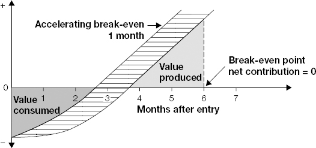
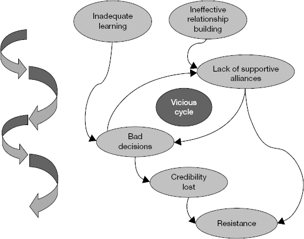
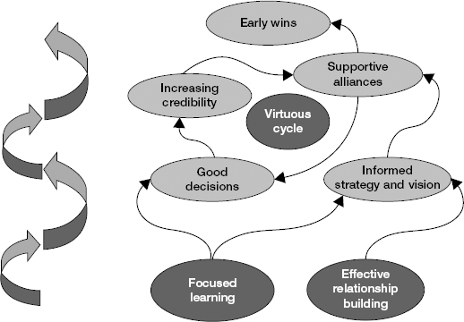
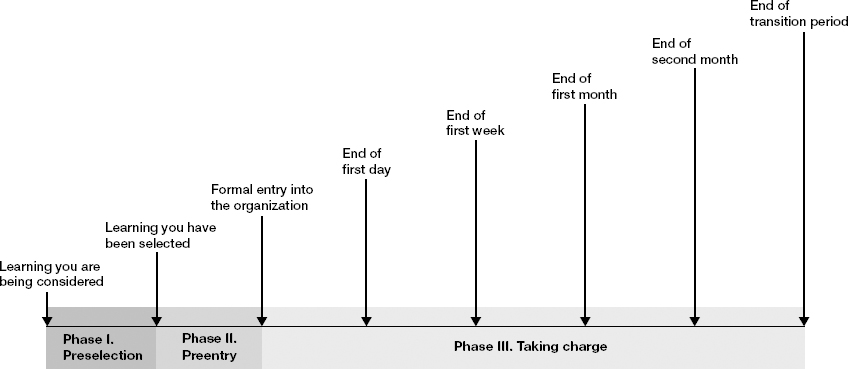

# Introduction: The First 90 Days

> *"The president of the United States gets 100 days to prove himself; you get 90."*

The actions you take during your first few months in a new role will largely determine whether you succeed or fail. When leaders derail, their problems can almost always be traced to vicious cycles that developed in the first few months on the job. And for every leader who fails outright, there are many who survive but never realize their full potential.

Watkins's research (1,300+ senior HR leaders surveyed): 90% agreed that transitions are the most challenging times in leaders' professional lives. Nearly 75% agreed that success or failure during the first few months is a strong predictor of overall success in the job. Opinions of your effectiveness form surprisingly quickly — and once formed, are very hard to change.

This introduction establishes: the break-even point concept, the seven transition traps, the vicious/virtuous cycle model, the ten fundamental transition tasks (which become the book's ten chapters), and the Transition Risk Assessment tool.

## Table of Contents

- [Building Career Transition Competence](#building-career-transition-competence)
- [The Break-Even Point](#the-break-even-point)
- [Transition Traps](#transition-traps)
- [Vicious Cycles and Virtuous Cycles](#vicious-cycles-and-virtuous-cycles)
- [The Ten Fundamental Transition Tasks](#the-ten-fundamental-transition-tasks)
- [Transition Risk Assessment](#transition-risk-assessment)
- [Mapping Your First 90 Days](#mapping-your-first-90-days)

**Block types:** [Core Framework] [Trap/Anti-Pattern] [Self-Assessment] [SRE/Platform Leader Lens] [2025 Context] [Real-World Application] [Comparison: Neff & Citrin]

---

> **[Comparison: Neff & Citrin — Complementary Framework]**
>
> These notes weave in insights from Thomas Neff & James Citrin's *You're in Charge — Now What?* (2005) — based on interviews with 50+ CEOs (named case studies: Kevin Sharer/Amgen, Anne Mulcahy/Xerox, Dan Vasella/Novartis, etc.). It complements Watkins in specific ways:
>
> | Dimension | Watkins (First 90 Days) | Neff & Citrin (You're in Charge) |
> |-----------|------------------------|-----------------------------------|
> | **Audience** | All levels (first-time manager to CEO) | Primarily C-suite and senior executive |
> | **Approach** | Framework-heavy, tools/checklists | Story-heavy, named CEO examples, pattern recognition |
> | **Pre-start period** | Brief mention ("even a few hours helps") | Deep treatment — the "Countdown" as a structured multi-week preparation |
> | **Day One** | Not specifically addressed | Treated as a symbolic event with deliberate choreography |
> | **Culture** | Culture pyramid, norms diagnostic | "Earn the right to change" — explicit social license concept |
> | **Stakeholders** | Covered in Ch4 (boss) and Ch8 (alliances) | Board/executive dynamics, managing up at C-level, peer-CEO relationships |
> | **Tone** | Prescriptive, research-backed | Narrative, wisdom-based, "here's what worked for real leaders" |
>
> Throughout these notes, `[Comparison: Neff & Citrin]` blocks appear where their framework genuinely adds beyond Watkins. They're drawn from training knowledge (not page-cited).

---

## Building Career Transition Competence

**Key data (Genesis/HBR/IMD study of 580 leaders):**
- Average 18.2 years of professional experience
- Promoted 4.1 times
- Moved between functions 1.8 times
- Joined a new company 3.5 times
- Moved between business units 1.9 times
- Moved geographically 2.2 times
- **Total: 13.5 major transitions per leader — one every 1.3 years**

Every successful career is a series of successful assignments, and every successful assignment is launched with a successful transition.

**Hidden transitions:** Substantial changes in role/responsibility without a title change. Common during rapid growth, restructuring, and acquisition. Particularly dangerous because leaders don't recognize them or give them appropriate attention. *The most dangerous transition can be the one you don't recognize is happening.*

**Ripple effect:** ~25% of managers in a Fortune 500 company change jobs each year. Each transition materially impacts ~12 other people (bosses, peers, direct reports, stakeholders). Even if you aren't in transition, others' transitions are being inflicted on you.

> **[SRE/Platform Leader Lens: Hidden Transitions in Platform Orgs]**
>
> Hidden transitions are extremely common in platform engineering:
> - Your company acquires another company → you now own their infrastructure too (no title change, massive scope change)
> - A reorg puts 3 more teams under you (no promotion, 3x the stakeholders)
> - The company adopts a "platform engineering" strategy → your infra/SRE team is now expected to deliver products, not just keep the lights on (same title, fundamentally different job)
> - AI/ML initiatives land on your platform → new domain, new stakeholders, new capacity patterns, same team
>
> Watkins's advice: treat these as full transitions requiring deliberate 90-day planning, even without the ceremony of a new role. If your scope, stakeholders, or success criteria changed significantly — you're in transition.

---

## The Break-Even Point

*Figure I-1. The break-even point. New leaders are net consumers of value early on; as they learn and act, they cross the break-even point and become net contributors. The goal: accelerate this crossing by up to 40%.*

> **[Core Framework: The Break-Even Point]**
>
> **Definition:** The point at which you have contributed as much value to your new organization as you have consumed from it.
>
> New leaders are **net consumers of value** early on — meaning the organization is investing more in YOU (people's time explaining things, meetings to get you up to speed, decisions delayed while you learn) than you're giving back. As you learn and begin to take action, you start creating value (making decisions that help, unblocking others, solving problems). The **break-even point** is where these cross: from that moment onward, you're giving more than you're taking — you're a net contributor.
>
> **Data:** 200+ CEOs and presidents estimated the break-even point for a typical midlevel leader (promoted or hired externally) at **6.2 months** on average.
>
> **Variation:**
> - Inherited disaster ("burning platform"): may create value from the moment your appointment is announced
> - Hired externally into a successful organization: may take a year or more
>
> **The book's promise:** Independent research shows you can reduce time to break-even by up to **40%** through rigorous application of these principles.
>
> **The goal is the same regardless of situation:** get to break-even as quickly and effectively as possible.

> **[SRE/Platform Leader Lens: Break-Even for a Senior Manager → Senior Director Transition into a New Company]**
>
> This is a compound transition: you're simultaneously making a level jump (manager → director-level scope), a culture jump (large established enterprise → growth-stage company that's past startup phase but still evolving its processes), a domain shift (your previous SaaS → IGA/identity security), and joining externally (no institutional trust, no existing relationships). The break-even point is further away than a simple lateral move — expect 4-6 months minimum, not 2-3.
>
> **What "consuming value" looks like in this compound transition:**
> - First 2-4 weeks: learning architecture, domain, people, AND learning what the new level expects of you (these are TWO separate learning curves running in parallel)
> - Weeks 4-8: forming opinions, but you're fighting imposter syndrome on two fronts — "do I really understand IGA well enough?" AND "am I operating at the right altitude for this level?"
> - Weeks 8-12: if you've learned well, you can start making decisions. But in a growth-stage company, the context can still shift (new customer wins, strategic pivots, org changes) — decisions made in week 8 may need revision by week 12.
>
> **What accelerates break-even for this specific transition:**
> - **Incident history is the fastest teacher.** Read the last 6 months of post-mortems. You'll learn architecture, failure modes, team dynamics, and pain in one compressed pass — AND you'll learn the domain (IGA concepts) through how they break.
> - **On-call shadow immediately.** Even as a senior director. You'll learn the system under pressure, signal humility, and earn respect from engineers who'll see you're not above getting hands dirty.
> - **Find what everyone hates.** Startup platform orgs accumulate pain fast. Find the one thing everyone complains about and fix it — this is your fastest credibility builder.
> - **Study the domain.** IGA has domain-specific concepts (certifications, SoD, JML, connectors, entitlements) that you MUST internalize. You can't lead strategy discussions if you don't speak the domain language. Invest first 2 weeks in understanding the product deeply as a user, not just the infrastructure.
> - **Accept that this company ≠ your previous enterprise.** Processes, tooling, and practices may be less formally structured — not because people are incompetent, but because the company grew fast while serving demanding enterprise customers and didn't have time to formalize everything. Your instinct will be "we need to fix all of this." Resist. Diagnose first, then prioritize ruthlessly. The team is already stretched serving production customers — they can't absorb 10 improvements at once.

> **[2025 Context: AI-Accelerated Break-Even]**
>
> Watkins wrote in 2013. In 2025, Gen AI dramatically compresses the "learning" phase:
>
> | Old approach (2013) | AI-assisted approach (2025) |
> |--------------------|-----------------------------|
> | Read architecture docs over weeks | Feed docs to Claude/GPT, ask targeted questions, get synthesized answers in hours |
> | Sit in on team meetings to learn culture | Analyze Slack channel history — patterns, tone, recurring complaints, who-defers-to-whom |
> | Manually trace request flows | Use AI to analyze codebase, trace dependencies, map service ownership |
> | Ask people "what's broken?" (filtered by politics) | Analyze support tickets + incident history programmatically — unfiltered signal |
> | Build stakeholder map through 1:1s over weeks | Map org chart + Slack interaction patterns + PR review graphs to identify actual influence networks |
>
> **The caveat Watkins would emphasize:** AI accelerates *information gathering* but NOT *relationship building*. The break-even point includes trust, credibility, and human connection — which still require time, presence, and human judgment. Don't mistake "I've ingested all the docs" for "I understand this organization."

---

## Transition Traps

> **[Trap/Anti-Pattern: The Seven Transition Traps]**
>
> Developed through interviews with experienced leaders + Genesis/HBR/IMD study data:
>
> **1. Sticking with what you know.**
> You believe you'll succeed by doing the same things as your previous role, only more so. You fail to see that the new role requires stopping some things and embracing new competencies.
>
> **2. Falling prey to the "action imperative."**
> You feel you need to take action. You try too hard, too early to put your stamp on the organization. You're too busy to learn, and you make bad decisions that catalyze resistance.
>
> **3. Setting unrealistic expectations.**
> You don't negotiate your mandate or establish clear, achievable objectives. You may perform well but still fail to meet the expectations of your boss and key stakeholders.
>
> **4. Attempting to do too much.**
> You rush off in all directions, launching multiple initiatives hoping some will pay off. People become confused; no critical mass of resources gets focused on key initiatives.
>
> **5. Coming in with "the" answer.**
> You arrive with your mind made up, or reach conclusions too quickly about "the" problems and "the" solutions. You alienate people who could help you understand what's going on.
>
> **6. Engaging in the wrong type of learning.**
> You spend too much time on technical/business learning and not enough on cultural and political dimensions. You don't build the relationships and information conduits to understand what is really going on.
>
> **7. Neglecting horizontal relationships.**
> You focus too much on vertical relationships (boss + direct reports) and not enough on peers and stakeholders. You miss early opportunities to build supportive alliances.

> **[SRE/Platform Leader Lens: How These Traps Manifest for Platform Leaders]**
>
> | Trap | How it shows up in a Manager→Senior Director + Enterprise→Startup + new domain transition |
> |------|--------------------------------------------------------|
> | **Sticking with what you know** | You were a great hands-on SRE manager. Now you're a senior director. The job is stakeholder management, strategy, and organizational design — not technical firefighting. But in a growth-stage company, the boundary is blurrier than at a Fortune 500: you MAY need to be more hands-on than a "Senior Director" title implies. The trap isn't "never touch tech" — it's not recognizing when you're doing tactical work because it's comfortable rather than because it's needed. |
> | **Action imperative** | You see the infra compared to your enterprise experience and things look less mature — maybe no formal SLOs, inconsistent deploy practices, alert noise. You jump to fix it all in week 2. But this company has been serving enterprise customers successfully in production — what looks like chaos may be "organized chaos that works for THIS company at THIS stage." Diagnose before prescribing. |
> | **Unrealistic expectations** | You don't align with your VP/CTO on what "success at 90 days" means. In a company that's growing fast and wearing many hats, your boss may not have PRECISE expectations — they hired you to FIGURE OUT what's needed. You need to co-create the success criteria, not just discover them. |
> | **Too much** | Coming from an enterprise where you managed large teams, you think in parallel workstreams. But your new team may be leaner. Launching 3 initiatives means each gets insufficient focus. ONE thing delivered well beats three things halfway — especially when the team is already stretched serving production customers. |
> | **Coming in with the answer** | "At my last company we had Datadog/PagerDuty/Terraform/SLOs/error budgets — we need all of that here." Your enterprise practices were designed for enterprise scale and budget. This company may already have some of these — or may have chosen alternatives for reasons you don't yet know (cost, integration constraints, customer requirements). Understand the choices before proposing replacements. |
> | **Wrong learning** | You spend 3 weeks deep in code and architecture (comfortable, feels productive) and zero time understanding: who has political power, which customers drive the most revenue, what the sales team promises, who the CTO trusts most. Power structures in a growth-stage company are less formal than enterprise — miss them and you're flying blind. |
> | **Neglecting horizontal** | At your enterprise, peer managers were collegial. In a growth-stage company, peer directors/VPs may see you as competition for budget, headcount, and leadership attention. You need allies FAST — especially the product/engineering leaders whose teams depend on your platform and whose customers depend on your reliability. |

> **[Comparison: Neff & Citrin — "Earn the Right" as Trap Antidote]**
>
> Neff provides a single overarching principle that counters most traps simultaneously: *You must earn the right to make changes.* No matter your title or mandate from recruiting — you haven't earned it until you demonstrate understanding of the current system and its history. This earning happens through listening, asking, acknowledging, and delivering small proof points — NOT through authority or a compelling deck on day 15.
>
> The traps Watkins lists (action imperative, coming in with the answer, sticking with what you know) are all forms of acting BEFORE earning this right. Neff's frame makes it simple: "Have I earned the right to make this change yet? No? Then I'm not ready — no matter how obviously correct it is."
>
> **Named example — Dan Vasella at Novartis:** When Vasella became CEO, he resisted pressure to immediately restructure. Instead he spent months understanding the portfolio, the people, and the culture before making moves. The patience was agonizing but meant that when changes came, they had broad organizational support and stuck.

---

## Vicious Cycles and Virtuous Cycles

*Figure I-2. The vicious cycle. Inadequate learning → bad decisions → credibility lost → resistance → lack of alliances → even worse learning. A downward spiral that's hard to escape once started.*

*Figure I-3. The virtuous cycle. Focused learning → good decisions → increasing credibility → supportive alliances → early wins → informed strategy → even better learning. An upward spiral that compounds.*

> **[Core Framework: Momentum — Vicious vs. Virtuous Cycles]**
>
> **Vicious cycle:** Bad initial decisions (from insufficient learning) → damaged credibility → people don't trust your judgment → harder to learn what you need → worse decisions → deeper hole.
>
> **Virtuous cycle:** Good initial decisions (from focused learning) → personal credibility grows → people share more information with you → better learning → better decisions → upward spiral.
>
> **The mechanism is the same:** early actions create feedback loops that either accelerate or trap you. You are planting seeds in the first 90 days that will grow into either momentum or quicksand.
>
> **The leadership leverage point:** You are one person. Success requires mobilizing the energy of many others. If you do the right things, your vision/expertise/drive serve as **"seed crystals"** for organizational momentum (in chemistry, a seed crystal is a tiny piece of solid dropped into a solution that causes the entire solution to crystallize around it — your early actions are that seed; they cause the organization to "crystallize" in a positive direction around your leadership). If you don't, you get caught in negative feedback loops from which escape may be impossible.
>
> **Root causes of transition failure:** Always a pernicious interaction between the new role (opportunities + pitfalls) and the individual (strengths + vulnerabilities). Never only about the leader's flaws (they succeeded before). Never only about a no-win situation (others succeed in similar situations). Failure happens because leaders either misunderstand the essential demands of the situation or lack the skill and flexibility to adapt.

> **[Real-World Application: Creating Virtuous Cycles in Platform Leadership]**
>
> **Seed crystal #1: Fix something visible and painful within 30 days.**
> Not a big rearchitecture — a small, concrete improvement that many people experience. This builds credibility (virtuous cycle entry point).
>
> - Reduce on-call pages by 30% through better alert tuning
> - Fix the #1 most-complained-about developer friction point
> - Produce a status dashboard that didn't exist (makes invisible platform work visible)
>
> **Seed crystal #2: Demonstrate you listen before you decide.**
> Conduct a structured "listening tour" (1:1s with every stakeholder in first 2-3 weeks). Then publish a written summary: "Here's what I heard. Here's what I think. Here's what I plan to do first." This creates the perception (and reality) that your actions are informed by context.
>
> **Seed crystal #3: Share credit aggressively early.**
> Any win in first 90 days — attribute it to the team. "The team had this partially solved; I just helped unblock it." This signals you're not a glory-seeker and makes people want to give you more information and support (virtuous cycle).

---

## The Ten Fundamental Transition Tasks

> **[Core Framework: The Ten Tasks — Book Structure]**
>
> Each task becomes one chapter. Together they form a comprehensive transition system:
>
> | # | Task | One-line summary |
> |---|------|-----------------|
> | 1 | **Prepare Yourself** | Mental break from old job. Understand what's different. Assess your vulnerabilities. |
> | 2 | **Accelerate Your Learning** | Systematic, focused approach to climbing the learning curve. Not **drinking from the fire hose** (being overwhelmed by too much information coming at you too fast with no filtering or prioritization). |
> | 3 | **Match Strategy to Situation** | Diagnose your situation (STARS model). Different situations require fundamentally different strategies. |
> | 4 | **Negotiate Success** | Build the relationship with your boss. Five critical conversations. Align on expectations + 90-day plan. |
> | 5 | **Secure Early Wins** | Build credibility and momentum. Create virtuous cycles. Identify A-item priorities. |
> | 6 | **Achieve Alignment** | Leader as organizational architect. Align strategy, structure, systems, skills, culture. |
> | 7 | **Build Your Team** | Evaluate, align, mobilize (or restructure) your inherited team. Make tough personnel calls. |
> | 8 | **Create Alliances** | Influence outside your direct line of control. Map networks. Build coalitions of support. |
> | 9 | **Manage Yourself** | Maintain equilibrium. Avoid isolation. Build advice-and-counsel network. |
> | 10 | **Accelerate Everyone** | Help all those around you (directs, boss, peers) accelerate their transitions too. |
>
> **How they interact:** These are not sequential steps — they happen in parallel. You're learning (task 2) while building relationships (task 8) while securing wins (task 5) while negotiating with your boss (task 4). The framework gives you ten lenses to check: "Am I neglecting any of these?"

---

## Transition Risk Assessment

> **[Self-Assessment: Transition Risk Index]**
>
> For each transition type below, check if it applies to your current situation, then rate difficulty 1-10. Sum the scores for your Transition Risk Index (max 100). Higher = more complex transition requiring more deliberate planning.
>
> | Transition type | Applies? | Difficulty (1-10) |
> |----------------|----------|-------------------|
> | Moving to a new industry or profession | | |
> | Joining a new company | | |
> | Moving to a new unit or group (same company) | | |
> | Being promoted to a higher level | | |
> | Leading former peers | | |
> | Moving from one function to another | | |
> | Taking on a cross-functional role for first time | | |
> | Moving geographically | | |
> | Entering a new national/ethnic culture | | |
> | Doing two jobs at once (finishing old while starting new) | | |
> | Taking on a newly created role (vs. existing role) | | |
> | Entering an org where major change is already underway | | |
>
> **Key insight:** Most leaders experience **2.2 major shifts in parallel** during a transition. The complexity of simultaneous shifts multiplies — each additional shift increases derailment risk non-linearly.

> **[SRE/Platform Leader Lens: Applying the Risk Assessment to Your Transition]**
>
> For a Senior Manager (enterprise SaaS SRE) → Senior Director of SRE/Platform Engineering (growth-stage IGA company serving enterprises), the transition profile is:
>
> | Transition type | Applies? | Difficulty | Notes |
> |----------------|----------|-----------|-------|
> | Joining a new company | **Yes** | 8/10 | New culture, relationships from zero, no institutional trust. Growth-stage company culture (fast-moving, less formal process, high customer stakes) is different from large enterprise. |
> | Being promoted to higher level | **Yes** | 7/10 | Manager → Director-level scope. Not just "one step up" — it's a qualitative shift from managing ICs/small teams to managing managers, setting strategy, owning org design. |
> | Moving to a new industry/domain | **Yes** | 6/10 | IGA/identity security is a specialized domain with its own concepts, compliance requirements, and customer expectations. New vocabulary, new stakeholders (CISO, auditors). |
> | Taking on cross-functional role | **Yes** | 5/10 | SRE/Platform spans product engineering, security, infrastructure, compliance. More cross-functional than a pure SRE manager role. |
> | Entering org where major change is underway | **Likely** | 6/10 | Startups in growth phase are ALWAYS in major change. Plus: they hired you because something needs to change in platform maturity. |
> | Taking on a newly created role | **Possibly** | 5/10 | If the Senior Director role didn't exist before, you're defining it from scratch — no predecessor to learn from. |
>
> **Transition Risk Index: ~37-47 (high).** This is one of the hardest transition profiles possible — 4-5 simultaneous shifts compounding each other. The domain shift alone would be manageable. The level jump alone would be manageable. The culture shift alone would be manageable. Together, they create a situation where you're simultaneously:
> - Learning a new domain (IGA)
> - Learning a new level (director-scope decisions)
> - Learning a new culture (growth-stage company after large enterprise)
> - Building trust from zero (external hire)
>
> **Implication:** Be MORE patient than you feel you should be. Expect break-even at 5-6 months, not 3. Build in explicit "I'm still learning" communication to your stakeholders so they calibrate expectations. The compound nature means any single trap from Watkins's list is MORE likely to catch you because you're cognitively overloaded.

---

## Mapping Your First 90 Days

Your transition begins the moment you learn you're being considered for the role — not when you sit in the chair.

*Figure I-4. Key transition milestones. Three phases: Preselection → Preentry → Taking Charge (day 1 through end of transition period). Note: the transition starts BEFORE formal entry — the preentry phase is when the Countdown happens.*

> **[Comparison: Neff & Citrin — The Countdown Principle]**
>
> Watkins says "even a few hours of preentry planning can go a long way." Neff goes further: the pre-start period is a structured *Countdown* deserving weeks of deliberate effort. You are never less observed and less constrained than before Day 1 — use this freedom to prepare intensively. Once you start, the scrutiny clock begins and every action carries weight.
>
> Neff's Countdown priorities:
> 1. **Consume information** — public filings, analyst reports, press, product (as a user), engineering blog posts, Glassdoor
> 2. **Form hypotheses** (not conclusions) — write down what you THINK the situation is, so you can TEST not confirm
> 3. **Arrange meetings** — ask your new boss to set up week-1 introductions so no time is wasted on logistics after start
> 4. **Plan Day One choreography** — first day is symbolic; decide what signal you want to send (listening? energy? curiosity?)
> 5. **Identify the "inherited mess"** — what problems exist that you'll be blamed for if you don't explicitly acknowledge them early?

**Planning horizons:**
- **Pre-start** (between offer acceptance and day 1): The Countdown. Structured preparation, not passive waiting. Read, hypothesize, plan meetings, design Day One.
- **End of day 1:** What impression do you want to leave? (Neff: curiosity + humility, NOT pronouncements)
- **End of week 1:** What do you want to understand?
- **End of month 1:** What do you want to have decided? What relationships established?
- **End of month 2:** What early wins should be visible?
- **End of month 3:** What should be clearly different? What should your 90-day plan review say?

By the three-month mark, key people (bosses, peers, direct reports) typically expect you to be getting traction.

> **[Real-World Application: 90-Day Milestone Map for SRE/Platform Senior Director]**
>
> | Milestone | Actions | Outputs |
> |-----------|---------|---------|
> | **Pre-start** | Read public architecture blogs, job postings (reveal pain), Glassdoor reviews. Study the product as a user. Identify the tech stack. | Written questions list for day 1. Initial hypothesis about situation type (STARS). |
> | **Day 1-7** | Meet your directs. Meet your boss. Get org chart. Get access to monitoring/dashboards/incident channel. Shadow on-call. | Stakeholder list. Initial relationship map. First impressions doc (private). |
> | **Day 8-21** | Listening tour: 1:1s with every peer VP/director, key product engineering leaders, CISO, CTO. Ask: "What should I know? What's working? What's not? What do you need from platform?" | Written synthesis: "What I heard." Preliminary stakeholder power-interest map. |
> | **Day 22-30** | Diagnose: architecture assessment, operational health review, team assessment, identify STARS type. Share initial findings with boss. | Draft situation diagnosis. First 5 conversations with boss started. Shared context. |
> | **Day 31-60** | Secure early win. Start on one visible improvement. Begin team evaluation (who's in right seat?). Formulate platform strategy hypothesis. | Early win delivered or visibly underway. Boss alignment on strategy direction. |
> | **Day 61-90** | Cement wins. Present strategy. Make first structural changes if needed (team, process, priorities). Build coalition. | 90-day review with boss. Written strategy. Next-quarter plan. Credibility established. |

---

## Questions to Ask: The Listening Tour Foundation

> **[Questions to Ask: The Universal Set (Ask Everyone the Same Questions)]**
>
> Asking the SAME core questions to every person in your first 2-3 weeks reveals contradictions, blind spots, and political fault lines that no single conversation can surface. When Person A and Person D give opposite answers to the same question — that's where the real story lives.
>
> **The Core Five (ask every stakeholder, peer, and direct report):**
>
> 1. **"What's working well that I should be careful not to break?"**
>    — Surfaces **sacred cows** (things the org treats as untouchable — either because they genuinely matter, or because a powerful person is emotionally attached to them), hidden strengths, and things people are attached to. Signals you won't bulldoze.
>
> 2. **"What's the biggest challenge this team/org faces that hasn't been solved yet?"**
>    — Reveals both the real problems AND what's been tried before. Follow-up: *"What's been attempted? Why didn't it work?"*
>
> 3. **"If you were in my role, what would you do in the first 90 days?"**
>    — Gives you their mental model of what the job IS. Differences between answers reveal misalignment on your role's purpose.
>
> 4. **"Who should I make sure to talk to that I might not find on an org chart?"**
>    — Reveals informal influence networks, institutional knowledge holders, culture interpreters.
>
> 5. **"What's something about this organization that took you a long time to understand?"**
>    — Gets at the deep culture layer — unwritten rules, hidden assumptions, "the way things really work here."
>
> **Why consistency matters:**
> - If 8 out of 10 people say "on-call is killing us" — that's your early win signal.
> - If your boss says the challenge is "scaling" but your directs say it's "tech debt" — that's a misalignment to navigate.
> - If peers say "platform team says no too much" but your team says "we don't have capacity" — that's the stakeholder gap from Platform Engineering Ch10.

> **[Questions to Ask: Phase-Specific Questions]**
>
> **Pre-start (ask your new boss via email or pre-start call):**
> - "What does success look like at 30/60/90 days for you?"
> - "What's the one thing you're most hoping I'll address first?"
> - "Who are the 3-5 people whose opinion of my success matters most to you?"
> - "Is there anything happening in the next 30 days I should know about before I start?" (reorgs, incidents, budget cycles, launches)
> - "What happened with my predecessor? What worked and what didn't?" (if applicable)
>
> **Week 1 (ask your direct reports in first 1:1):**
> - "What do you love about working here? What frustrates you most?"
> - "What should I know about this team that I won't find in any document?"
> - "What would you do differently if you had more authority/resources?"
> - "What's the thing you most wish your previous manager had done differently?"
> - "Is there anyone on the team I should be aware might be at risk of leaving?"
>
> **Week 2-3 (ask peers — other directors/VPs in engineering, product, security):**
> - "How does your team interact with the platform/SRE team today? What works? What's friction?"
> - "When platform/infra has an issue, how does it affect you? How quickly do you find out?"
> - "What would you build yourself if the platform team didn't exist? What would you gladly never think about?"
> - "When you've needed something from this team in the past, how did that go?"
> - "What's one thing the platform team could do in the next quarter that would make YOUR team faster?"
>
> **Month 1 (skip-level conversations with engineers on your team):**
> - "Walk me through what your typical week looks like."
> - "What's the dumbest thing you have to deal with regularly?" (reveals toil and broken processes)
> - "When something breaks at 2am, how confident are you in the runbooks and tooling?"
> - "Do you feel like you're working on the right things? If not, what should change?"
> - "What's one technical decision from the past that haunts you?"

> **[Questions to Ask: Second-Order Questions (The Follow-Ups That Go Deeper)]**
>
> Surface answers hide real information. These follow-ups break through:
>
> | When they say... | Ask... | What you're really learning |
> |-----------------|--------|----------------------------|
> | "It's fine" / "No issues" | "If I asked your team the same question, would they agree?" | Whether they're being political or genuinely fine |
> | "We've always done it that way" | "What would happen if we stopped? Who would notice?" | Whether it's **load-bearing** (other things actively depend on it — remove it and something breaks) or just **inertia** (nobody stopped doing it, but nothing actually depends on it continuing) |
> | "That team is hard to work with" | "Can you give me a specific recent example?" | Whether it's structural friction or personal conflict |
> | "We need more headcount" | "If you could only keep 80% of current projects, what would you cut?" | Whether the real problem is capacity or prioritization |
> | "Leadership doesn't support us" | "What specifically did you ask for and what was the response?" | Whether it's a communication failure, priority disagreement, or genuine neglect |
> | "The architecture is technical debt" | "Which specific part, and what breaks if we don't fix it in 6 months?" | Whether it's aesthetically offensive or operationally dangerous |
> | "We tried that before and it failed" | "What was different about the situation then? What would need to be true for it to work now?" | Whether circumstances have changed enough to revisit |

---

## Reading the Political Landscape: A Guide for Engineers Who Take Things at Face Value

> **[Deep Dive: Political Awareness as Pattern Recognition, Not Manipulation]**
>
> If you tend to take things at face value and miss subtext — you're not alone. Most technical leaders share this trait. The good news: political awareness is NOT about being manipulative, reading minds, or "playing games." It's about **observing patterns systematically** — which is what engineers do all day with systems. You just need to apply the same observational rigor to PEOPLE that you apply to architectures.
>
> **The core reframe:** Politics is not dirty. Politics is how decisions get made when reasonable people disagree and there's no objectively "right" answer. Every resource allocation, every priority decision, every hire/fire — these are political acts. You're already IN the political system. The only question is whether you navigate it consciously or get navigated by others who do.

> **[Core Framework: Observable Signals That Reveal Hidden Dynamics]**
>
> You don't need to "read people's minds." You need to observe behaviors and ask what they IMPLY. This is the same as debugging a system — you observe outputs and infer internal state:
>
> **Signal Category 1: Who defers to whom (reveals actual power, not org chart power)**
>
> | Observable behavior | What it likely means |
> |--------------------|--------------------|
> | In a meeting, Person A proposes something. Everyone looks at Person B before responding. | Person B has veto power — formal or informal. They're the real decision-maker regardless of title. |
> | Someone is cc'd on emails that seem above/below their level | They're either a power broker (people want them informed) or a watchdog (someone else wants oversight) |
> | When two people disagree in a meeting, the conversation pauses until a specific third person speaks | That third person is the tiebreaker — the one whose opinion resolves disputes |
> | A leader routinely says "let me check with [person]" before committing | That person has influence over this leader's decisions. Map them. |
> | An IC's opinion seems to carry more weight than their level suggests | They have accumulated credibility, institutional knowledge, or a senior patron. Treat them as more powerful than their title. |
>
> **Signal Category 2: What's NOT being said (reveals boundaries and danger zones)**
>
> | Observable behavior | What it likely means |
> |--------------------|--------------------|
> | A topic comes up and everyone suddenly gets vague or changes the subject | Political landmine. Someone got burned on this. Ask about it privately later, not in the group. |
> | Your question gets answered with a non-answer ("that's complex" / "it's historical") | There's a story they're not comfortable telling you yet. You haven't earned enough trust. Note it, revisit in 2 weeks. |
> | Someone says "that's a great idea" but doesn't offer to help or follow up | Polite disagreement. They don't support it but won't say so publicly. Watch if they quietly undermine later. |
> | Your boss says "I support you" but doesn't commit resources or public backing | Support in private ≠ support. Real support is visible — budget, headcount, public endorsement. Private encouragement without public commitment is a **hedge** (they're keeping their options open — if your initiative fails, they can say "I never committed to it"; if it succeeds, they'll say "I supported it from the start"). |
> | "We're all aligned" is declared but no one made eye contact or asked clarifying questions | Forced alignment. People may have disagreed but didn't feel safe speaking up. The "alignment" will unravel in execution. |
>
> **Signal Category 3: Actions vs. words (reveals real priorities)**
>
> | Observable behavior | What it likely means |
> |--------------------|--------------------|
> | Leadership says "platform is critical" but cuts your budget first during downturns | Platform is NOT considered critical — it's considered cost. Words are cheap; budget reveals truth. |
> | Someone promises to "help with your initiative" but never puts it on their team's roadmap | Polite deflection, not actual commitment. Commitment = calendar time + named people + deliverables |
> | A peer says "I don't disagree" (vs. "I agree") | They disagree. "Not disagreeing" is passive non-support. They won't block you, but they won't advocate either. |
> | After a meeting, someone walks over to talk to you privately about what was just discussed | They couldn't say what they really think in the group. This private channel is valuable — cultivate it. |
> | Decisions made in a meeting get "revisited" in a follow-up meeting with different attendees | The first meeting was **theater** (a performance for show — the outcome was never really decided there). The real decision-making forum is the second, smaller meeting with the actual power holders. Find out who's in that room — that's where you need to be present or have an advocate. |

> **[Real-World Application: The Political Pattern Log — A Debugging Tool for People]**
>
> Just like you'd keep an incident log to find patterns in system failures, keep a **political pattern log** during your first 60 days. A simple private document (Notion, Notes app, whatever) where you write down what you observe and what you THINK it means:
>
> ---
>
> **Entry 1 — June 2**
> - **Observed:** In product review, CTO deferred to an engineer who's been here since day 1 — not the VP.
> - **My interpretation:** This early employee has founder-level informal authority despite being an IC. Their opinion may override people with bigger titles.
> - **Confidence:** Medium
> - **How to verify:** Watch the next 2 meetings. Ask my culture interpreter about this person's history and influence.
>
> **Entry 2 — June 5**
> - **Observed:** I proposed an SLO framework in a team meeting. A senior engineer said "we tried that 2 years ago" and the room went silent. Topic died.
> - **My interpretation:** This is a **political landmine** — a topic that triggers strong negative reactions because someone got burned trying it before. Raising it carelessly "explodes" into resistance and costs credibility.
> - **Confidence:** Medium
> - **How to verify:** Ask privately: "What happened with the SLO attempt back then? What blocked it?"
>
> **Entry 3 — June 8**
> - **Observed:** My boss told me in our 1:1 "I fully support platform investment." But in the budget meeting, they didn't advocate for my headcount request.
> - **My interpretation:** Support in private ≠ support in public. Boss may be **hedging** (keeping options open), or may be facing pressure from THEIR boss that they haven't told me about.
> - **Confidence:** High
> - **How to verify:** Watch: does my boss defend platform in the next exec meeting? Or only in 1:1s with me? If only private, the "support" is not real support.
>
> **Entry 4 — June 12**
> - **Observed:** Two product leads went noticeably quiet when I mentioned re-platforming the connector framework.
> - **My interpretation:** Either they built it (identity/pride — criticizing it = criticizing them), or they tried to change it before and got burned, or their product depends on specific quirks of the current system.
> - **Confidence:** Low — could be any of these
> - **How to verify:** Have a 1:1 with each. Ask neutrally: "Tell me about the connector framework's history — who designed it? What's worked well?"
>
> **Entry 5 — June 15**
> - **Observed:** After the all-hands, 3 people DMed me separately saying "glad you're here, we need this" — but none of them said it in the public meeting.
> - **My interpretation:** They support my direction but don't feel safe saying so in the group. Something (or someone) is making public support feel risky for them.
> - **Confidence:** Medium
> - **How to verify:** These are potential allies. Cultivate the relationships privately. Ask: "What makes it hard to say this kind of thing in the group?"
>
> ---
>
> **Review weekly.** Patterns emerge after 5-10 entries. You'll start seeing: who actually holds power, which forums are real vs. theater, whose "yes" is real vs. polite, and which topics are landmines.
>
> **This is NOT paranoia.** It's the same observational discipline you'd apply to monitoring a distributed system — notice anomalies, form hypotheses, verify, update your mental model. The difference: the system is human, so signals are noisier and you need more data points before confident interpretation.

> **[Questions to Ask: Surfacing Political Dynamics Without Being "Political"]**
>
> These questions work precisely BECAUSE they're asked with genuine curiosity, not as manipulation:
>
> **To your boss (month 1):**
> - "Walk me through how the last big cross-team decision got made. Who was in the room? How did people weigh in?"
> - "When your peers disagree with each other, how does it typically get resolved?"
> - "Whose pushback should I take most seriously? Who should I not worry about as much?"
> - "Is there anyone whose support I absolutely need to succeed, who I might not obviously think of?"
>
> **To your culture interpreter (week 2-3):**
> - "Who are the informal opinion leaders — the people who aren't in senior titles but whose opinion sways decisions?"
> - "What's the fastest way to lose credibility here? What's an unforgivable mistake?"
> - "When someone's idea gets killed, how does that usually happen? In a meeting? In a back-channel? Via a boss's boss?"
> - "Are there any partnerships or rivalries between teams I should know about?"
>
> **To a trusted peer (month 2):**
> - "I'm trying to understand how decisions really get made here. From your experience — is it the meeting, the pre-meeting, or the hallway after that matters?"
> - "If I wanted [specific initiative] to succeed, who do I absolutely need onside beyond my own chain?"
> - "Is there anyone who tends to be a silent blocker — someone who doesn't say no publicly but makes things not happen?"

> **[SRE/Platform Leader Lens: Why Platform Leaders Are Especially Vulnerable to Political Blind Spots]**
>
> Three structural reasons platform leaders get blindsided — plus additional dynamics in growth-stage companies:
>
> **1. Your value is invisible (unlike product teams).**
> Product teams ship visible features → easy for stakeholders to value. Your team prevents invisible disasters + provides invisible infrastructure. When things work, nobody notices. This means your political position is ALWAYS weaker than peers with visible output — unless you actively build visibility (Platform Engineering Ch07's "Wins and Challenges").
>
> **2. You're a cost center competing with revenue drivers.**
> When budget gets tight, "the platform team is too big" is an easy argument for peers to make. They'll frame it as efficiency concern, but it's a political move to reallocate resources toward their teams. If you don't see this coming and build coalition support BEFORE budget season — you lose.
>
> **3. Your technical authority can make you dismiss politics.**
> "I'm the expert on infrastructure, so my judgment on platform investment should be obvious." It should be — but it's not. Expertise doesn't translate to influence without relationship investment. The peer who golfs with the CTO has more influence on your budget than your architecture diagram does.
>
> **Startup-specific amplifiers (beyond generic platform politics):**
>
> **4. Founder dynamics.**
> Startups often have founders or early employees with outsized informal power — they may hold modest titles but their word overrides the org chart. They "built this company from nothing" and have deep emotional investment in how things are done. If they resist your changes, no amount of CEO mandate will force it through — the CEO respects the founder's instinct. You MUST identify these people in week 1 and earn their respect specifically.
>
> **5. Speed of political shifts.**
> In a large enterprise, alliances are stable for quarters or years. In a growth-stage company, a major customer win, a board meeting, or a strategic shift can reprioritize everything in a week. Your ally VP today can become your resource competitor tomorrow because leadership redirected investment. Political awareness must be CONTINUOUS (weekly check-ins with your mental model), not periodic.
>
> **6. "OG" dynamics (early employees vs. new hires).**
> "OG" = "Original Gangster" — tech slang for the founding/early employees who were there from the beginning or early days, survived the hard growth phases, and carry outsized credibility because "they built this." You'll hear it in casual conversation: "Ask Ravi, he's an OG — been here since we were 50 people and pre-Series C."
>
> Startups have an in-group (OGs) and out-group (recent hires who joined after the company was already successful and funded). As an external senior hire, you're out-group by default. The in-group may view you with suspicion: "Why do we need a senior director from an enterprise? We built all this without one." You earn your way in by ASKING and RESPECTING what they built — not by telling them what's wrong with it.
>
> **7. Less separation between personal and professional.**
> Startup teams are often close personally — they socialize together, they share a founding mythology. When you propose changing a system someone built, you're not just challenging their technical decision — you may be challenging something that represents years of their life and identity. Handle with care that enterprise reorgs rarely require.
>
> **Practical protection:**
> - **Never assume your mandate is safe.** Even if the CEO said "platform is priority" during hiring — mandates expire when circumstances change. Maintain support continuously.
> - **Build 2-3 "champion" relationships** with peers who will publicly defend your team's value when you're not in the room. Feed them success stories they can repeat. Ideally at least one champion is an OG — their endorsement carries weight that no newcomer's can match.
> - **Make your work visible** without being self-promotional: dashboards, metrics, "here's what would happen without us" framing, testimonials from product teams you've helped.
> - **Assume every polite "yes" is actually "I'm not going to fight you on this today."** Real commitment = action (roadmap items, calendar holds, budget). Everything else is theater.
> - **Identify the 2-3 people with outsized informal power** (founders, early engineers, the CEO's trusted advisors) and build genuine relationships with them BEFORE you need something. If you wait until you need their support, it's too late.
> - **Respect the founding mythology.** Learn the company's origin story. Reference it positively. "You built an incredible product with 5 engineers and no platform team — that's remarkable. My job is to make sure the NEXT phase is as successful as the first." This frames you as continuing their success, not replacing it.

> **[2025 Context: Reading Political Signals in Remote/Hybrid Environments]**
>
> Political dynamics are HARDER to read remotely. You lose body language, side conversations, lunch tables, who walks with whom after meetings. Compensating strategies:
>
> | Lost signal | Remote substitute |
> |-------------|-----------------|
> | Body language in meetings | Who turns their camera on/off. Whose Slack reactions come first. Who DMs you after vs. speaks in the meeting. |
> | Hallway conversations | Watch Slack DMs that come immediately after a public discussion — that's the "hallway conversation" happening |
> | Lunch groups / coffee walks | Notice who co-presents, who tags whom in threads, whose messages get emoji'd quickly |
> | Meeting-after-the-meeting | Look for follow-up threads in smaller channels, or meetings that appear on calendars after the main meeting |
> | Office proximity / access to leaders | Who gets invited to which Slack channels. Private channels you're NOT in often contain the real discussions. |
>
> **Key remote insight:** In remote orgs, WRITTEN communication is the primary political medium. The way someone words a Slack message (helpful vs. territorial, inclusive vs. gate-keeping, public vs. DM) is their "body language." Pay attention to tone and framing in writing the way you'd pay attention to facial expressions in person.

---

## Acceleration Checklist (from the book)

These reflection questions appear at the end of the introduction. Use them as a pre-start exercise:

1. What will it take for you to reach the break-even point more quickly?
2. What are some traps you might encounter, and how can you avoid them?
3. What can you do to create virtuous cycles and build momentum?
4. What types of transitions are you experiencing? Which are most challenging, and why?
5. What are the key elements and milestones in your 90-day plan?

> **[2025 Context: The Modern Transition Landscape vs. 2013]**
>
> Things Watkins didn't have to address (but you do):
>
> | 2013 assumption | 2025 reality |
> |----------------|--------------|
> | You're physically present in an office | You may be remote/hybrid. Relationship-building requires more deliberate effort. "Hallway conversations" don't happen by accident. |
> | Learning = meetings + documents | Learning = meetings + documents + Slack archives + recorded calls + codebase + AI-assisted synthesis |
> | Building credibility = face time | Building credibility = async artifacts (written strategy docs, dashboards, data-driven proposals) travel further than presence in a distributed org |
> | Your team is co-located | Your team spans time zones. You can't manage by walking around. Written communication quality IS leadership quality. |
> | Political dynamics play out in rooms | Political dynamics play out in Slack channels, email threads, and who gets invited to which meetings. Harder to read without physical presence cues. |
> | "Early win" = visible project success | "Early win" can also be: a well-crafted RFC that crystallizes thinking, a dashboard that makes invisible work visible, a data analysis that reframes a stuck debate |
>
> **New tools for transition acceleration:**
> - **Donut/random-coffee bots** — force cross-org relationship-building in remote orgs
> - **Loom/async video** — record your "here's what I'm hearing and thinking" updates; scales better than repeating in 15 separate 1:1s
> - **Notion/Confluence "working in public"** — document your learning journey openly; invites correction and builds trust through transparency
> - **AI assistants** — synthesize large volumes of documentation, Slack history, incident reports in days rather than months
