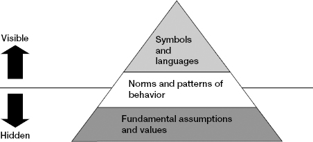

# Chapter 1: Prepare Yourself

> *"It's a mistake to believe that you will be successful in your new job by continuing to do what you did in your previous job, only more so."*

Preparing yourself means making a mental break from your old job and embracing the imperatives of the new situation. The biggest pitfall: assuming what made you successful before will continue to do so. The dangers of sticking with what you know, working extremely hard at it, and failing miserably are very real. You can exist in denial — believing that because you're being efficient, you're being effective — until the walls crash down.

This chapter covers the two most common transition types (promotions and external onboarding), introduces the four pillars of onboarding, and provides self-assessment tools for identifying vulnerabilities. The core message: what got you here won't get you there. Your strengths can become liabilities. You must consciously let go and prepare for a fundamentally different job.

## Table of Contents

- [Case Study: Julia Gould (Promotion Failure)](#case-study-julia-gould)
- [Getting Promoted: Five Core Challenges](#getting-promoted-five-core-challenges)
- [Onboarding into a New Company](#onboarding-into-a-new-company)
  - [Case Study: David Jones at Energix](#case-study-david-jones-at-energix)
  - [Four Pillars of Effective Onboarding](#four-pillars-of-effective-onboarding)
  - [Identifying Cultural Norms](#identifying-cultural-norms)
- [Preparing Yourself: Core Practices](#preparing-yourself-core-practices)
  - [Establish a Clear Breakpoint](#establish-a-clear-breakpoint)
  - [Assess Your Vulnerabilities](#assess-your-vulnerabilities)
  - [Watch Out for Your Strengths](#watch-out-for-your-strengths)
  - [Relearn How to Learn](#relearn-how-to-learn)
  - [Rework Your Network](#rework-your-network)
  - [Watch Out for People Who Want to Hold You Back](#watch-out-for-people-who-want-to-hold-you-back)
  - [Get Some Help](#get-some-help)

**Block types:** [Core Framework] [Case Study] [Checklist] [Self-Assessment] [Trap/Anti-Pattern] [SRE/Platform Leader Lens] [2025 Context] [Comparison: Neff & Citrin] [Real-World Application]

---

## Case Study: Julia Gould

> **[Case Study: Julia Gould — The Promotion That Failed]**
>
> **Context:** 8 years in marketing at a consumer electronics company. Stellar track record. Designated high-potential on fast track. Promoted to lead a major cross-functional product launch (marketing, sales, R&D, manufacturing).
>
> **What went wrong:**
> - Her strength was extraordinary attention to detail + high need for control
> - She tried to make decisions unilaterally in a role that required leading without authority
> - When team members challenged her knowledge, she retreated to what she knew (marketing details)
> - Micromanaged the marketing team members, alienating them
> - Within 6 weeks: removed from role, back in marketing
>
> **Root cause:** She didn't make the leap from strong functional performer to cross-functional project leader. Her strengths (detail orientation, decision authority, domain control) became liabilities in a role requiring influence without expertise, delegation of unfamiliar domains, and collaborative leadership.
>
> **The lesson:** "They put me in the job because of my skills" ≠ "I should keep using those exact skills." The role changed; the required behaviors didn't follow.

---

## Getting Promoted: Five Core Challenges

> **[Core Framework: Five Shifts Every Promotion Demands]**
>
> | What's really changed | What you must do differently |
> |----------------------|------------------------------|
> | **Broader impact horizon** — wider range of issues, people, ideas to focus on | **Balance depth and breadth.** What was the 50,000-foot view in your old role may be the 500-foot view now. |
> | **Greater complexity and ambiguity** — more variables, greater uncertainty | **Delegate more deeply.** At 5 people: delegate tasks. At 50: projects. At 500: products/platforms. At 5000: entire businesses. |
> | **Tougher organizational politics** — more powerful stakeholders | **Influence differently.** Positional authority becomes LESS important. Decisions are shaped by expert judgment, trust, and mutual support networks. |
> | **Further from the front lines** — more filters on information | **Communicate more formally.** Establish new channels to stay connected (skip-levels, customer visits, frontline meetings) without undermining chain of command. Also broadcast channels for strategic intent (town halls, written comms). |
> | **More scrutiny** — you're the lead actor in a public play | **Exhibit the right presence.** What does leadership "look like" at your new level? Private moments become fewer. Your behavior is always being interpreted. |
>
> **The paradox of promotion:** You'd think higher = easier to get things done. Not necessarily. Decision-making becomes more political because (a) issues are too complex for "right answers" from data alone, and (b) everyone at your level is also capable and driven — the game is more bruising. It's less about authority, more about influence.

> **[SRE/Platform Leader Lens: The Manager → Senior Director + Enterprise → Startup Shift]**
>
> This is not one shift — it's three simultaneous shifts, each of which would be challenging alone:
>
> **Shift 1: Level jump (Manager → Director-scope role)**
>
> | Watkins's shift | What this means coming from a senior manager role |
> |----------------|--------------------------------------|
> | **Breadth over depth** | As a manager, you likely still reviewed designs and were technically the strongest person in most rooms. At Senior Director, your job is organizational design + strategy + stakeholder management. If you're still reviewing Terraform PRs or debugging production issues at week 6, you're in Julia's trap. |
> | **Delegate more deeply** | As a manager, you delegated tasks and maybe small projects. Now you delegate *entire problem domains* to leads/managers under you. You're not reviewing their technical decisions — you're reviewing their strategy and outcomes. This feels scary when you're new and don't yet trust your team's judgment. Resist the urge to verify everything. |
> | **Influence differently** | As a manager, you got things done through your team (direct authority). Now you need product VPs, CISO, finance, and peer directors to cooperate. They don't report to you. Your authority means nothing to them — only credibility and demonstrated value. This is the biggest single shift. |
> | **Communicate formally** | As a manager, you told your team things in standup and 1:1s. Now you write strategy docs read by 50+ people. You present to the exec team. Your Slack messages in public channels are leadership signals, not casual chat. Every word carries more weight than you're used to. |
> | **Leadership presence** | Everyone is watching the new senior director. How do you handle pressure? How do you respond to criticism? Do you cave or hold firm? You're modeling what "senior platform leadership" looks like — and setting the standard for everyone below you. |
>
> **Shift 2: Culture jump (Enterprise → Startup)**
>
> | Enterprise habit | Startup reality | Adjustment required |
> |-----------------|----------------|---------------------|
> | Structured planning cycles (quarterly OKRs, annual roadmaps) | Plans change weekly. The CEO might redirect the company in a Thursday all-hands. | Hold plans loosely. Be comfortable with ambiguity. Plan in 2-4 week iterations, not quarters. |
> | Large teams, specialized roles | Small teams, everyone wears multiple hats | You may need to be more hands-on than a "Senior Director" title implies at an enterprise. That's OK — but distinguish intentional hands-on (needed) from comfort-zone hands-on (trap). |
> | Process and governance (change boards, architecture review, RFC process) | Move fast, few formal processes | Don't impose enterprise-weight process on a growth-stage company. Introduce LIGHTWEIGHT versions — "30 minutes of design review" not "multi-week RFC process." Match the weight of process to the company's stage. |
> | Support structures (executive assistants, program managers, dedicated recruiting, HR business partners) | You schedule your own meetings, run your own hiring, do your own program management | Budget your time differently. 30-40% of your week will be operational overhead that an enterprise support structure handled for you. |
> | Political dynamics are slow-moving and predictable | Political dynamics shift faster — a major customer deal, a board directive, or a strategic pivot can reshuffle priorities in a week | Read the room more frequently. Your political pattern log needs weekly updates, not monthly. |
>
> **Shift 3: Domain jump (previous SaaS → IGA/Identity Security)**
>
> | What stays the same | What's new |
> |--------------------|-----------|
> | SRE fundamentals (SLOs, incident management, observability, capacity planning) | IGA domain vocabulary: certifications, SoD, JML, connectors, entitlements, PAM, CIEM |
> | Platform engineering principles (all of Platform Engineering book applies) | Compliance as product (SOX, HIPAA, SOC2 are features, not overhead) |
> | Infrastructure patterns (K8s, cloud, CI/CD, databases) | Security-sensitive data handling (you're storing access to customer's crown jewels) |
> | Team leadership, hiring, organizational design | New stakeholders (CISO, auditors, compliance team have veto power you've never dealt with) |
>
> **The compound risk:** Each shift taxes cognitive capacity. Together, they mean you're simultaneously feeling like an imposter on three dimensions. This is NORMAL for this transition profile. Name it, plan for it, and give yourself permission to not know things for longer than feels comfortable.

---

## Onboarding into a New Company

### Case Study: David Jones at Energix

> **[Case Study: David Jones at Energix — The Organ Transplant Rejection]**
>
> **Context:** VP of new-product development at a renowned global manufacturer (strong process culture: TQM, lean, six sigma, command-and-control with people speaking their minds). Recruited as Head of R&D at Energix — a small, rapidly growing wind energy company (~2000 people, start-up culture transitioning to corporation).
>
> **CEO's mandate during recruiting:** "We need to become more disciplined. We've succeeded by staying focused and working as a team. But we need to be more systematic."
>
> **What David found:** Seat-of-pants operations. Poor financial processes. Dozens of R&D projects with inadequate specs. Next-gen turbine project: nearly a year behind, way over budget.
>
> **What David did:** Convened a meeting of R&D, ops, and finance heads. Presented a process redesign plan with resource commitments and external consultants.
>
> **What went wrong:**
> - Attendees stonewalled — wouldn't commit people or time
> - They told him to bring it to the full Senior Management Committee (consensus culture)
> - Two attendees went to the CEO: "Jones is a bull in a china shop"
> - Relationship with CEO chilled noticeably
> - David had mistaken "we need to be more disciplined" (the general wish) for "you have carte blanche to impose processes" (the specific authority). He didn't.
>
> **The key metaphor:** *"Joining a new company is akin to an organ transplant — and you're the new organ. If you're not thoughtful in adapting to the new situation, you could end up being attacked by the organizational immune system and rejected."*
>
> (Just as a transplanted organ gets attacked by the body's immune system because it's recognized as "foreign," a new leader from outside gets resisted by the organization's existing culture, relationships, and habits — not because they're doing anything wrong, but simply because they're new and different. The organization's "immune response" = people closing ranks, withholding information, going around you, or pushing back on your ideas purely because you haven't yet been accepted as "one of us.")
>
> **Root cause:** David applied what worked at his old company (structured, authority-driven process improvement) without adapting to the new culture (consensus-driven, relational, suspicious of outsiders imposing change). He had **technical mandate** (the CEO told him to do this) but no **social license** (the people affected hadn't accepted him as someone who had earned the right to change their world — mandate is granted by authority; social license is earned through relationships, respect, and demonstrated understanding).

> **[SRE/Platform Leader Lens: The David Jones Pattern — You Are David Jones]**
>
> This scenario IS your transition:
>
> - You come from an enterprise with excellent SRE practices (SLOs, error budgets, structured incident response, GitOps, IaC, change management, postmortem culture)
> - Startup hired you explicitly to "bring platform maturity" and "scale infrastructure practices"
> - You arrive and see: manual deploys, no SLOs, alert fatigue, tribal knowledge instead of runbooks, no formal postmortem culture, cowboy engineering that "works" (sort of)
> - Your enterprise brain screams: "This is all wrong. We need to fix EVERYTHING."
> - You start implementing what you know from your enterprise
> - Engineers resist: "That's not how we do things here." "That process is too heavy for our stage." "We move fast, that'll slow us down." "We don't need enterprise bureaucracy."
> - Your boss (who hired you for this!) gets nervous when people complain and says "Maybe go slower?"
>
> **You are almost certainly going to experience some version of this.** The question is how much damage it does before you course-correct.
>
> **The fix (which David didn't do, and which you MUST do):**
> 1. **Diagnose first.** Spend 3-4 weeks understanding WHY things are the way they are. Some of that "chaos" is actually working. Some of it was tried before and failed for reasons you don't know yet.
> 2. **Find allies.** There are ALWAYS 2-3 engineers who desperately want better practices. They've been asking for what you bring. Find them. Make them your partners, not your audience.
> 3. **Start with ONE pain.** Not a comprehensive "reliability improvement program." ONE thing that's undeniably hurting people RIGHT NOW. Fix that. Let success create demand.
> 4. **Match the weight.** Don't bring a 50-page incident response process. Bring a 1-page "when things break, do this" and iterate from there. The enterprise version is your DESTINATION, not your starting point.
> 5. **Earn social license.** David thought his title + CEO mandate = license to change things. It doesn't in a consensus/relationship culture. License comes from: (a) demonstrating you understand the current system, (b) fixing something people care about, (c) showing respect for what they built. THEN you can propose bigger changes.
>
> **The additional risk in a growth-stage company:** If enough engineers or early leaders push back and you're the new person, leadership may side with them — because they're the people who built the company and its customer base, and you're the outsider who "doesn't understand how we got here." In a large enterprise, political dynamics move slowly enough to recover from a misstep. In a growth-stage company with tighter-knit teams, you might get ONE chance to demonstrate you respect the existing culture before you're labeled "enterprise guy who doesn't fit here."

### Four Pillars of Effective Onboarding

> **[Core Framework: Four Pillars of Effective Onboarding]**
>
> Senior HR practitioners overwhelmingly assess external hire transitions as "much harder" than internal promotions. Barriers:
> - Not familiar with informal networks of information and communication
> - Not familiar with corporate culture → difficulty navigating
> - Unknown to the organization → less credibility than someone promoted from within
> - Tradition of internal promotion → organizational resistance to outsiders
>
> **The four pillars to overcome these barriers:**
>
> **1. Business Orientation**
> - Learn the company as a whole, not just your part
> - Beyond financials/products/strategy: understand brands, operating model, planning systems, performance evaluation systems, talent management systems
> - These often powerfully influence how you can most effectively have impact
>
> **2. Stakeholder Connection**
> - Identify key stakeholders and build productive relationships immediately
> - Natural but dangerous tendency: focus on vertical relationships (boss + directs) early
> - Critical miss: lateral relationship building with peers and constituencies outside your org
> - *"You don't want to be meeting your neighbors for the first time in the middle of the night when your house is burning down."*
>
> **3. Expectations Alignment**
> - Check and recheck expectations AFTER formally joining (not just during recruiting)
> - "Recruiting is like romance, and employment is like marriage" — pre-hire understandings may not be accurate in-role
> - Newly hired leaders easily believe they have more latitude than they actually have
> - Factor in expectations of constituencies beyond your boss (finance at HQ, peer VPs, etc.)
>
> **4. Cultural Adaptation**
> - Most daunting challenge. Think of yourself as an anthropologist studying a new civilization.
> - Culture = consistent patterns for communicating, thinking, and acting, grounded in shared assumptions and values

> **[Checklist: Onboarding Actions by Pillar]**
>
> **Business orientation:**
> - Get access to public financial/product/strategy/brand information ASAP
> - Identify additional sources (websites, analyst reports, internal wikis)
> - Ask for a briefing book to be assembled (appropriate at your level)
> - Schedule familiarization tours of key facilities before formal start date
>
> **Stakeholder connection:**
> - Ask your boss to identify and introduce key people to connect with early
> - Meet some stakeholders before formal start if possible
> - Take control of your calendar — schedule early meetings with key stakeholders
> - Be deliberate about lateral relationships (peers, others), not only vertical (boss, directs)
>
> **Expectations alignment:**
> - Understand and engage in business planning and performance management
> - Schedule explicit expectations conversation with boss in first week (no matter how clear you think things are)
> - Have explicit working-style conversations with boss and directs early
>
> **Cultural adaptation:**
> - Ask about culture during recruiting process
> - Schedule culture conversations with boss and HR; check back regularly
> - Identify "culture interpreters" — natural historians who can give insight into organizational evolution
> - After 30 days: informal 360 check-in with boss and peers on how adaptation is going

### Identifying Cultural Norms

> **[Self-Assessment: Cultural Norms Diagnostic]**
>
> Six domains where cultural norms vary significantly between companies. Use as a checklist when entering a new org:
>
> | Domain | Key question |
> |--------|-------------|
> | **Influence** | How do people get support for initiatives? Patron in senior team, OR peer/direct-report affirmation? |
> | **Meetings** | Dialogue on hard issues, OR forums for ratifying private agreements? |
> | **Execution** | Deep understanding of processes, OR knowing the right people? |
> | **Conflict** | Can people talk openly about difficult issues without retribution? Or is conflict avoided / pushed to lower levels? |
> | **Recognition** | Promote visible stars who vocally drive initiatives, OR team players who lead quietly and collaboratively? |
> | **Ends vs. means** | Are there restrictions on HOW you achieve results? Well-communicated values with reinforcement? |

> **[Core Framework: The Culture Pyramid]**
>
> 
> *Figure 1-2. The Culture Pyramid. Surface layer (visible, easy to learn) → middle layer (norms, takes weeks) → deep layer (hidden assumptions, takes months). The deeper you go, the more political danger lies in misreading.*
>
> Three layers, from visible to invisible:
>
> ```
> ┌───────────────────────────────┐
> │   SYMBOLS & LANGUAGE          │  ← Most visible. Logos, dress code, acronyms,
> │   (surface)                   │    office space allocation. Easy to learn.
> ├───────────────────────────────┤
> │   NORMS & BEHAVIORS           │  ← How things really get done. How support is
> │   (middle)                    │    built, recognition given, meetings run.
> │                               │    Takes weeks to discern.
> ├───────────────────────────────┤
> │   FUNDAMENTAL ASSUMPTIONS     │  ← Shared values, beliefs about power
> │   (deep)                      │    distribution, authority vs. consensus.
> │                               │    May take months to fully understand.
> └───────────────────────────────┘
> ```
>
> **Key insight:** "Learn to speak like the locals." Every org has a shared language (acronyms, project names, internal mythology). Investing early in this vocabulary signals belonging and accelerates trust.
>
> **The deep layer matters most:** Does power come from position, seniority, or persuasion? This determines everything about how you can operate. David Jones assumed position-based authority in a persuasion-based culture. Fatal mismatch.

> **[Questions to Ask: Diagnosing Culture Without Asking "What's the Culture Here?"]**
>
> Direct questions about culture ("What's the culture like?") get generic answers ("collaborative," "fast-paced," "innovative"). Instead, ask behavioral questions that reveal culture indirectly:
>
> | Question | What it reveals |
> |----------|----------------|
> | "Tell me about the last big decision that was controversial. How was it resolved?" | Decision-making style (consensus vs. authority vs. escalation) |
> | "When someone has a great idea that crosses team boundaries, what happens?" | Cross-functional collaboration norms; whether innovation is centralized or distributed |
> | "What gets people promoted here? What gets people stuck?" | Actual (not stated) values — what the org rewards vs. what it says it rewards |
> | "Tell me about a time someone failed publicly. What happened to them?" | Psychological safety, blame culture, recovery patterns |
> | "How do people here react when a deadline is going to be missed?" | Transparency norms, heroism expectations, pressure patterns |
> | "What's something that would get you in trouble here that would've been fine at your previous company?" | Unwritten rules, third-rail topics, cultural landmines |
> | "If I wanted to get something changed around here, what's the fastest path vs. the 'proper' path?" | Formal vs. informal power structures; whether process is respected or bypassed |
> |**For platform/SRE specifically:**||
> | "When there's a production incident, who runs the response? Engineering leadership or the on-call engineer?" | Incident culture — empowered vs. command-and-control |
> | "When platform and product disagree on priority, how does it get resolved?" | Your team's actual power vs. stated power |
> | "Has the platform team ever said 'no' to a senior stakeholder and had it stick?" | Whether platform has earned authority or is purely service-desk |

> **[Comparison: Neff & Citrin — Cultural Diagnosis]**
>
> Neff & Citrin's *You're in Charge — Now What?* emphasizes a more structured cultural assessment than Watkins. Their approach adds:
>
> **"Listen and learn before you lead"** — Neff argues for a more explicit "listening period" (first 30 days) where new leaders make NO significant changes, only ask questions and observe. This is stronger than Watkins's framing (which allows for early wins within 90 days).
>
> **Named example — Kevin Sharer at Amgen:** When Sharer joined as CEO, he spent extensive time in his first months doing "listening tours" — asking every leader the same three questions: What should we keep? What should we change? What should I know that no one will tell me? The discipline of asking the SAME questions to everyone reveals patterns and contradictions.
>
> **"Earn the right to make changes"** — Neff's core principle. You haven't earned it until you can demonstrate you understand the current system and its history. Premature action signals arrogance, not decisiveness.
>
> **For a Senior Director of SRE/Platform:** The Neff approach is particularly relevant because platform changes affect everyone. Deploying a new observability tool or restructuring on-call affects the daily lives of hundreds of engineers. You must earn social license before imposing change — even if you're technically correct about what's needed.

---

## Preparing Yourself: Core Practices

### Establish a Clear Breakpoint

The move between positions usually happens in a blur. You're finishing the old job while starting the new one. You may perform both jobs simultaneously until your old role is filled.

**The discipline:** Pick a specific time (a weekend, a day off) and use it to *mentally* make the shift:
- Consciously let go of the old job
- Embrace the new one
- Think hard about the differences — how must you now think and act differently?
- Celebrate the move (even informally) with family and friends
- Touch base with advisers/counselors and ask for advice

> **[Comparison: Neff & Citrin — The Countdown]**
>
> Neff's "Countdown" concept is the strongest complement to Watkins's "breakpoint" — it fills the gap between accepting the role and starting it:
>
> **Structure the pre-start period deliberately:**
> - Read everything publicly available about the company (10-K, analyst reports, press coverage, Glassdoor)
> - Study the product as a customer/user
> - Identify the 5-10 people you want to meet in week 1 (ask your new boss to set them up)
> - Write down your hypotheses (what do you THINK the situation is?) — so you can test them, not confirm them
> - Prepare your "first day" — what will you say, who will you meet, what signal do you want to send?
>
> **Neff's Day One guidance:**
> Day One is a symbolic event. People remember what you did on your first day. Specific advice:
> - Walk the floor / visit the teams physically (or the virtual equivalent)
> - Meet people at THEIR desks, not yours — signals humility and curiosity
> - Ask questions, don't make pronouncements
> - Don't reorganize anything, announce any strategies, or hint at changes
> - First day message should be: "I'm here to listen and learn, and I'm excited to work with you"
>
> **Contrast with Watkins:** Watkins's "breakpoint" is internal (mental shift). Neff's "Countdown" is external (structured preparation actions). You need both.

> **[SRE/Platform Leader Lens: Your Pre-Start Countdown (Enterprise SRE → Startup Platform Leader)]**
>
> Between accepting and starting — use this time aggressively. You have MORE to learn than someone joining a similar company in a similar role.
>
> | Day | Action | Why it matters for THIS transition |
> |-----|--------|-----|
> | **Accept + 1** | Get org chart and reporting structure. Who reports to you? Who are your peers? How big is the platform/SRE team today? | Understand scope. Is this 5 people or 30? Are you managing ICs or managers? |
> | **Week 1** | Study the IGA product as a user. Sign up for a trial/demo if possible. Watch sales demo videos on YouTube. Read their documentation. | Domain learning starts NOW. You need to understand what "access certifications" and "entitlement management" mean before day 1 conversations assume you know. |
> | **Week 1** | Read the company's engineering blog, conference talks, case studies, and job postings. | Job postings for YOUR team reveal pain (what they can't find). Product blog reveals how they talk about their tech. Case studies reveal who their customers are (enterprise vs. mid-market vs. government). |
> | **Week 2** | Research the tech stack. LinkedIn profiles of future team members (skills/endorsements). Check GitHub if anything is open-source. Look for tech radar/architecture docs if public. | Coming from enterprise SRE, you know many patterns. Map what's similar (you'll onboard fast there) vs. what's new (invest more time there). |
> | **Week 2** | Read Glassdoor/Blind specifically for: culture signals, on-call burden, management quality, growth pain ("moving too fast with no process" or "too bureaucratic for our size"). | Calibrate your enterprise instincts. If reviews say "no process, chaos" — your instinct for structure will be welcome BUT must be introduced gradually. If reviews say "too much process" — know NOT to add more. Also look for patterns about how platform/infra teams are perceived internally. |
> | **Week 3** | Ask your new boss: (1) org chart, (2) recent incident post-mortems if shareable, (3) top 3 platform/infra pain points from their perspective, (4) "What should I read before day 1?" | Signals preparedness and respect for their time. Also: their answer to "top 3 pain points" becomes testable hypothesis for your first weeks. |
> | **Week 3** | Learn IGA basics: what are SoD policies? What is a certification campaign? What's JML? What are connectors? How does provisioning work? (Industry blogs, Gartner reports, competitor websites all teach this.) | You don't need to be an expert by day 1. You need enough vocabulary to follow conversations without asking "what does that mean?" every 3 minutes. That threshold is achievable in a few hours of reading. |
> | **Final weekend** | Write your hypotheses: (1) What STARS type? (2) What's the biggest platform pain? (3) What's the team's morale? (4) What does my boss really want from me? (5) What will surprise me? | Having written hypotheses lets you TEST them in week 1 rather than arriving blank. If hypothesis 4 is wrong, you'll discover it fast because you're actively checking. |

### Assess Your Vulnerabilities

> **[Self-Assessment: Problem Preferences Diagnostic]**
>
> Watkins provides a structured tool for assessing what kinds of problems you naturally gravitate toward (and thus where your blind spots are):
>
> Rate your intrinsic interest (1-10) in each domain:
>
> | | Technical (systems/processes) | Political (power/influence) | Cultural (values/norms) |
> |---|---|---|---|
> | **HR** | Design of appraisal/reward systems | Employee morale | Equity/fairness |
> | **Finance** | Financial risk management | Budgeting | Cost-consciousness |
> | **Marketing** | Product positioning | Customer relationships | Organizational customer focus |
> | **Operations** | Product/service quality | Distributor/supplier relationships | Continuous improvement |
> | **R&D** | Project management systems | Cross-functional relationships | Cross-functional cooperation |
>
> **Sum columns:** Technical vs. Political vs. Cultural preferences
> **Sum rows:** Functional area preferences
>
> **Interpretation:**
> - Low column score = potential **blind spot** (an area you systematically neglect because it doesn't interest you — like a car's blind spot, it's the zone you can't see without deliberately turning to look. e.g., high technical + low political = you'll miss the power dynamics happening around you)
> - Low row score = functional area you'll neglect or avoid
>
> **Three compensators:**
> 1. **Self-discipline** — force yourself to devote time to areas you don't enjoy
> 2. **Team building** — actively hire/identify people strong in your weak areas
> 3. **Advice network** — advisers/counselors who push you beyond your **comfort zone** (the set of activities and decisions where you feel confident and in control — the danger is that you unconsciously stay inside this zone, avoiding the unfamiliar areas where growth and risk both live)

> **[SRE/Platform Leader Lens: Vulnerability Profile for Manager→Director + Enterprise→Startup]**
>
> | Dimension | Likely strong | Likely gap | Why the gap is amplified in this transition |
> |-----------|--------------|-----------|----------------------------------------------|
> | **Technical** | SRE fundamentals, systems design, operational discipline | IGA domain specifics, security/compliance depth | New domain means your technical confidence is partially invalidated. You know HOW to build platforms but not WHAT this specific platform needs to do. |
> | **Political** | Navigating within your team and direct chain | Exec-level influence, cross-functional coalition building, growth-company dynamics where early leaders carry outsized informal power | Enterprise politics are slow and rule-governed. In a growth-stage company, politics are faster, more informal, and more personality-driven. The skills don't transfer 1:1. |
> | **Cultural** | Deep engineering culture understanding | Startup culture (speed over quality, scrappy over polished, relationships over process) | Enterprise culture rewards thoroughness, documentation, process. Startup culture rewards speed, pragmatism, and shipping. You may be seen as "too slow" or "too process-heavy" if you apply enterprise habits. |
> | **Managerial scope** | Managing a team of ICs/leads (10-15 people) | Managing managers, org design, multi-team strategy | You've led people. But have you designed an organization? Hired managers? Set strategy across multiple teams with competing priorities? This is the level jump. |
>
> **The specific vulnerability in this transition:**
> You'll be tempted to lean hard on your technical strength (the ONE dimension where you feel confident) while avoiding the political/cultural/scope dimensions (where you feel uncertain). This is exactly Watkins's "sticking with what you know" trap — AND Maslow's hammer. Your technical strength becomes the crutch that prevents growth in the areas that actually determine success at this level.
>
> **Compensating:**
> - **Political:** Find a political counselor in the first 2 weeks. Ideally a peer director who's been at the company 2+ years. Ask them: "How do decisions really get made here? Who matters? What are the landmines?"
> - **Cultural:** Explicitly study this company's operating patterns. Don't just tolerate things that feel less structured than your enterprise — understand WHY they exist and what they enable. Some of that informality is actually the agility that let this company serve enterprise customers while growing fast. Preserve what works.
> - **Domain:** Dedicate 30 minutes daily in first month to learning IGA concepts. Use the product. Read customer case studies. Sit in on sales demos. You can't lead strategy in a domain you don't understand.
> - **Scope:** Find a mentor who's done the manager→director transition before. The loneliness of the scope jump is real — you have fewer peers, more ambiguity, and less feedback than you're used to.

### Watch Out for Your Strengths

> **[Questions to Ask: Self-Reflection Before Starting (Vulnerability Check)]**
>
> Ask yourself these BEFORE day 1. Write down answers. Revisit at day 30 to check honesty:
>
> 1. **"What am I most excited to do in this new role?"** — Your excitement signals your comfort zone. It's where you'll gravitate under pressure — and possibly where you'll over-invest at the expense of things you find less exciting.
>
> 2. **"What part of this job am I quietly hoping I won't have to do much of?"** — This is your blind spot. Name it. (Budget management? Difficult people conversations? Executive presentations? Writing strategy docs?)
>
> 3. **"In my last role, what feedback did I dismiss or resist?"** — The feedback you resist is often the most accurate. If three people said "you micromanage" and you thought "they just want less accountability" — you probably micromanage.
>
> 4. **"When I imagine failing in this role, what does that look like?"** — Your fear reveals your vulnerability. If you imagine failing because of politics — that's where to invest. If you imagine failing technically — that's less likely (it's your strength) but reveals you might not be imagining the ACTUAL risks.
>
> 5. **"What did my predecessor (or the person who held a similar role) struggle with?"** — Their struggles may predict yours — or may reveal what the organization does to people in this role.
>
> 6. **"What will I be tempted to change in week 2 that I should wait until month 3 to touch?"** — Name your impulses now so you recognize them as impulses later.

> **[Trap/Anti-Pattern: The Hammer Problem]**
>
> *"To a person with a hammer, everything looks like a nail."* — Abraham Maslow
>
> (Meaning: when you're really good at one thing, you unconsciously try to apply that skill to every problem — even problems that need a completely different approach. The hammer is your dominant skill; the "nail" is any problem you encounter. You swing the hammer because it's familiar, not because it's appropriate.)
>
> Your strengths become vulnerabilities when:
> - Attention to detail → micromanagement (Julia's pattern)
> - Decisiveness → acting before understanding (David's pattern)
> - Technical depth → solving the wrong problems brilliantly
> - Strong opinions → alienating people who could be allies
> - Bias for action → "action imperative" trap from Introduction
>
> **The key question to ask yourself:** What is MY hammer? What does every problem look like to me because of my strengths? Name it explicitly. Then watch for situations where you're applying it reflexively.

> **[SRE/Platform Leader Lens: The Enterprise SRE Manager's Hammers]**
>
> Coming from enterprise SRE management into a director role at a growth-stage company, you carry specific hammers shaped by years of enterprise culture:
>
> | Your hammer | What it makes every problem look like | When it fails in your new context |
> |-------------|--------------------------------------|---------------|
> | **Process & governance** | Every gap should have a process, a runbook, an SOP | Startup engineers will resist "bureaucracy." They associate process with slowness. You need to introduce structure as TOOLING (enabling) not GOVERNANCE (controlling). |
> | **Systems thinking** | Every problem is an architecture problem to redesign | The team may be stretched serving enterprise customers with limited engineers. Sometimes the "architecture problem" is actually "we have limited people and can't build the ideal solution while keeping production running — what's the minimum viable improvement that unblocks us?" |
> | **Enterprise-grade tooling** | We need Datadog/PagerDuty/Terraform/proper CI-CD everywhere | Maybe some of this already exists; maybe some was chosen deliberately for different reasons (cost, integration with the product, customer requirements). Understand the existing choices before proposing replacements. The company IS serving enterprises successfully — the tooling got them here. |
> | **Incident response maturity** | We need formal incident commanders, postmortem culture, severity levels, SLOs | All true — and may already exist in some form. But if the current approach is "CTO handles SEV1s personally" and "postmortem is a 10-min Slack thread" — introduce maturity incrementally, not with a 20-page incident response document on day 15. Meet them where they are. |
> | **"At my last company..."** | This company looks like my enterprise did 5 years ago, so I know the path | This company chose a DIFFERENT path for different reasons. Their constraints (IGA domain requirements, customer compliance needs, team composition, growth trajectory) are different from your enterprise's. Same symptoms can have completely different root causes. |
> | **Scale-first thinking** | We should build for 10x current load | Maybe — but maybe the company's growth bottleneck isn't infrastructure scale. It might be connector coverage, compliance features, or customer onboarding speed. Don't assume the scaling problem is the SAME shape as at your enterprise. Diagnose the actual bottleneck. |

### Relearn How to Learn

Having to start learning again evokes feelings of incompetence and vulnerability — especially after years of being the expert.

**The vicious cycle of denial:**
1. New role demands learning in unfamiliar areas
2. Early missteps trigger feelings of incompetence
3. You unconsciously gravitate toward areas where you feel competent
4. You gravitate toward people who reinforce your self-worth
5. You stop learning the things you most need to learn
6. Failure becomes inevitable (dramatic or death by a thousand cuts)

**The choice is binary:** Learn and adapt, or become brittle and fail.

> **[2025 Context: Relearning How to Learn — AI as Accelerator and Crutch]**
>
> In 2025, Gen AI creates a new version of this trap: you can USE AI to learn faster (good), but you can also use it to AVOID the discomfort of not knowing (dangerous).
>
> **Good use:** "Summarize the last 6 months of post-mortems and identify recurring themes" — compresses weeks of reading into hours.
>
> **Dangerous use:** Using AI answers as a substitute for asking humans — which means you learn facts but not relationships, not culture, not politics. Nobody feels heard when you already have all the answers from a machine.
>
> **The balance:** Use AI to prepare QUESTIONS (not answers) for human conversations. "I read that we had 3 incidents related to database connection pooling last quarter — what's the story there?" signals both preparation AND humility.

### Rework Your Network

> **[Core Framework: Network Evolution by Career Stage]**
>
> The advice you need changes as you advance:
>
> | Career stage | Primary network need |
> |-------------|---------------------|
> | **Early career** | Technical advisers — experts who help you do your work |
> | **Mid-career** | Technical + political counselors — people who help you understand org dynamics |
> | **Senior leadership** | Political counselors + personal advisers — people who help you maintain perspective and equilibrium |
>
> **Why this is hard:** Your current advisers may be close friends. Technical advisers whose domains you know well feel comfortable. But at senior director level, the limiting factor isn't "do I understand the technology?" — it's "do I understand the power dynamics, the history, the unwritten rules?"
>
> **Action:** Actively seek out political counselors and personal advisers. Don't let loyalty to existing network prevent building the network you actually need.

> **[Real-World Application: Building Your Network in the First 90 Days]**
>
> **Three types of network connections to make immediately:**
>
> 1. **Culture interpreters** (2-3 people) — long-tenured employees who can explain "why things are the way they are." Not necessarily senior — could be a staff engineer who's been there 8 years. Ask your boss or HR to suggest them.
>
> 2. **Political counselors** (1-2 people) — someone who understands the org's power dynamics and will be candid with you. Often a peer at your level in a different function. Build this relationship through reciprocity (share your own useful context).
>
> 3. **External sounding board** (1-2 people) — former colleagues or mentors who can give you perspective WITHOUT the political entanglement of being inside the org. These are the people you call when you're frustrated at 10pm and need someone to say "here's what I think you're missing."

### Watch Out for People Who Want to Hold You Back

**Your old boss:** May not want to let you go. Negotiate clear expectations about close-out immediately. Be specific about what WILL and WON'T be done. Write it down. Circulate. Hold everyone to it.

**Former peers now subordinates:** Must accept the relationship has changed. Others watch for favoritism and judge accordingly. Expect early tests of authority — meet them by being firm and fair. If you don't establish limits early, you'll regret it.

**Disappointed competitors:** People who wanted your role may work to undermine you. May subside with time — but if you conclude they'll never accept your role, find a way to move them out quickly.

> **[Comparison: Neff & Citrin — Managing What You Inherit]**
>
> Neff provides more explicit guidance on the "inherited mess" problem:
>
> **"The mess was here before you"** — Neff argues you should explicitly acknowledge (publicly if needed) that you're inheriting a situation, not creating it. This protects you from blame for pre-existing problems while giving you license to address them.
>
> **Named example — Anne Mulcahy at Xerox:** When Mulcahy took over as CEO, the company was in severe financial distress. Her first move was NOT to announce a turnaround plan. It was to publicly acknowledge the severity of the situation — setting expectations that recovery would take time. This gave her room to make painful decisions without being blamed for the pain.
>
> **For a senior manager entering a growth-stage company as a director:** Don't promise immediate transformation. The current state — whatever you think of it — has been serving enterprise customers in production. The people who built it are proud of getting here. It's their baby. Frame it as: "Here's what I'm learning. Here's what's impressive about what you've built — you're serving [major enterprises] on this infrastructure, and that's no small thing. Here's what I think we can improve together by [timeline]." The word "together" matters — you're joining THEIR story, not starting a new one.

### Get Some Help

Many organizations have formal transition support (high-potential programs, onboarding processes, coaching). Use everything available.

Even without formal programs:
- Engage HR and your boss about a 90-day transition plan
- If promoted: ask for competency models describing requirements of new role (but don't assume they tell the whole story)
- If from outside: ask for help identifying stakeholders, finding a cultural interpreter

> **[2025 Context: Modern Transition Support]**
>
> Beyond what Watkins describes (formal programs, HR support, coaching):
>
> - **Executive coaching** — increasingly common at Senior Director+ level. If offered, take it. If not offered, ask. The ROI on a good coach during transition is enormous.
> - **Internal documentation** — modern companies have architecture decision records, design docs, team charters. Find them. They're an accelerator Watkins couldn't have predicted.
> - **#new-hires or #onboarding Slack channels** — peer support from others in transition simultaneously
> - **Recorded all-hands / town halls** — watch the last 3-6 months. You'll hear what leadership is saying, what questions employees ask, what's celebrated and what's avoided.
> - **Your own 90-day doc** — write a public "here's what I'm working on learning" document. Update weekly. Invites correction and builds trust through transparency.

---

## Closing the Loop

Preparing yourself is a journey, not a destination. You'll constantly need to ensure you're engaging with real challenges rather than retreating to comfort zones. It's easy to backslide into habits that are both comfortable and dangerous.

> **[Checklist: Prepare Yourself (from the book)]**
>
> 1. If promoted: what are the implications for balancing breadth/depth, delegating, influencing, communicating, and leadership presence?
> 2. If joining new org: how will you orient to the business, connect with stakeholders, clarify expectations, and adapt to culture? What's the right balance between adapting vs. altering?
> 3. What has made you successful so far? Can you succeed by relying solely on those strengths? If not, what critical skills must you develop?
> 4. Are there aspects of the new job critical to success but that you prefer not to focus on? Why? How will you compensate?
> 5. How can you ensure you make the mental leap? From whom might you seek advice? What activities might help?

> **[Real-World Application: Week-Before-Start Preparation Ritual]**
>
> A concrete practice for the weekend before your start date:
>
> 1. **Write your "letting go" list:** What from your old role are you still holding onto? What habits must stop? What identity must shift?
> 2. **Write your "danger zones" list:** Based on the problem preferences assessment — what will you be tempted to avoid? What's your hammer?
> 3. **Write your "first week" intent:** Day 1 (who to meet, what signal to send). Day 2-3 (who to listen to). Day 4-5 (what to read, what to observe).
> 4. **Tell one trusted person** your vulnerabilities and ask them to check in at day 30: "Am I falling into any of these traps?"
> 5. **Schedule your own 30-day check-in:** Calendar invite to yourself. "Am I preparing, or have I already started reacting?"
