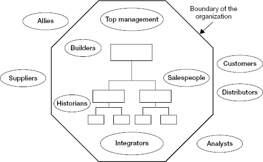

# Chapter 2: Accelerate Your Learning

> *"You've got to stop doing and start listening."* — Chris Hadley's boss, after Chris derailed by acting without learning

The first task in making a successful transition is to accelerate your learning. Effective learning gives you the foundational insights you need to build your 90-day plan. The more efficiently and effectively you learn, the more quickly you close your **window of vulnerability** (the period during which you're making decisions based on incomplete understanding — every decision in this window carries higher risk of being wrong).

This chapter presents learning as an *investment process* — your scarce time and energy are resources that deserve careful management, and the return is **actionable insights** (knowledge that enables you to make better decisions earlier). The chapter provides: a diagnostic of learning roadblocks, a structured learning agenda (questions about past/present/future), a map of internal and external information sources, structured learning methods, and a learning plan template with specific milestones.

The core message: your instinct will be to act. Resist it long enough to learn. Simply displaying a genuine desire to learn and understand translates into increased credibility and influence.

## Table of Contents

- [Case Study: Chris Hadley at Phoenix Systems](#case-study-chris-hadley-at-phoenix-systems)
- [Overcoming Learning Roadblocks](#overcoming-learning-roadblocks)
- [Learning as an Investment Process](#learning-as-an-investment-process)
- [Defining Your Learning Agenda](#defining-your-learning-agenda)
  - [Questions About the Past](#questions-about-the-past)
  - [Questions About the Present](#questions-about-the-present)
  - [Questions About the Future](#questions-about-the-future)
  - [Four Domains of Learning](#four-domains-of-learning)
- [Identifying the Best Sources of Insight](#identifying-the-best-sources-of-insight)
- [Structured Learning Methods](#structured-learning-methods)
- [Creating a Learning Plan](#creating-a-learning-plan)

**Block types:** [Core Framework] [Case Study] [Checklist] [Self-Assessment] [Trap/Anti-Pattern] [SRE/Platform Leader Lens] [2025 Context] [Questions to Ask] [Comparison: Neff & Citrin] [Real-World Application]

---

## Case Study: Chris Hadley at Phoenix Systems

> **[Case Study: Chris Hadley — Importing "The Answer" Without Learning]**
>
> **Context:** Chris headed quality assurance at Dura Corporation (world-class software development). His former boss recruited him to lead product quality and testing at Phoenix Systems (a struggling software developer). Lateral move, but a turnaround situation.
>
> **What Chris did:**
> - Visited Phoenix once before starting, saw the testing operation didn't measure up to Dura standards
> - Arrived and declared existing processes "outdated" — operation needed to be rebuilt "the Dura way"
> - Immediately brought in external consultants who delivered a scathing report calling technology "antiquated" and workforce skills "inadequate"
> - Shared the report with his directs, announced reorganization "the way we did things at Dura"
> - Within one month of the new structure: productivity plummeted, threatening a key product launch
>
> **What Chris didn't know (because he never asked):**
> 1. Senior management at Phoenix had systematically underinvested for years, despite local managers energetically fighting for upgrades
> 2. The operation had achieved *remarkable* results in quality and productivity *given what it had to work with*
> 3. The supervisors and workforce were justifiably proud of what they had accomplished with limited resources
>
> **His boss's rebuke (after 2 months):** "You've alienated just about everyone. I brought you here to improve quality, not tear it down. How much time did you spend learning about the operation?"
>
> **The recovery:** Chris held discussions with managers, supervisors, and workers. Learned about their creativity in dealing with lack of investment. Got direct feedback on what wasn't working. Called an all-hands and announced significant adjustments based on feedback. Committed to upgrading technology and training BEFORE making further structural changes.
>
> **The lesson:** Chris treated Phoenix as a blank canvas to paint with Dura's practices. But Phoenix wasn't blank — it was a canvas with a painting already on it, created under difficult constraints by skilled people. His failure to acknowledge that painting (by learning about it first) made everything he did afterward feel like an insult to the people who created it.

> **[SRE/Platform Leader Lens: Chris Hadley IS the Enterprise Leader Joining a Growth-Stage Company]**
>
> This story is almost a perfect preview of your transition risk:
>
> | Chris at Phoenix | You at new company |
> |------------------|--------------------|
> | Came from Dura (world-class) | Coming from established enterprise (mature SRE practices) |
> | Declared existing processes outdated | Risk: declaring current infra/platform practices immature |
> | Brought in consultants to validate his predetermined conclusions | Risk: using your enterprise experience as implicit "consultancy" that validates what you already believe |
> | Workforce had achieved remarkable results given constraints | Your new team has been serving enterprise customers in production with whatever they have |
> | People were proud of what they built with limited resources | People ARE proud — this isn't a failing company, it's a successful one that needs to scale better |
>
> **The anti-Chris approach:**
> - Week 1-2: Ask "How did you achieve what you've achieved?" not "Why is this so far behind?"
> - Frame everything as curiosity, not judgment: "Help me understand why X works this way" not "X is clearly wrong"
> - Acknowledge accomplishment before suggesting improvement: "The fact that you're serving [enterprise customers] on this infrastructure is impressive. Let's build on that."

---

## Overcoming Learning Roadblocks

> **[Trap/Anti-Pattern: Three Learning Roadblocks]**
>
> **1. Failure to understand history ("How did we get to this point?")**
>
> This is the question you must ALWAYS ask before proposing change. Without understanding history, you risk tearing down structures without knowing why they were built. Armed with history, you may indeed decide things need to change — or you may discover good reasons to leave things as they are.
>
> (In engineering terms: understanding history is like reading the git blame before refactoring. That "ugly" code may exist because of a constraint you don't see yet. The comment-free function may handle an edge case that broke production 18 months ago. The "weird" process may compensate for a system limitation that still exists.)
>
> **2. The action imperative (compulsive need to take action)**
>
> Effective leaders balance **doing** (making things happen) with **being** (observing and reflecting). But the pressure to "do" almost always comes from INSIDE the leader, not from outside forces — it reflects a lack of confidence and a need to prove yourself.
>
> (In psychological terms: the anxiety of not knowing + the discomfort of feeling unproductive + imposter syndrome = you DO something — anything — to feel in control. The action feels good. But it's treating YOUR anxiety, not solving the organization's problems.)
>
> **Key insight:** Simply displaying a genuine desire to learn and understand translates into increased credibility and influence. You don't need to "prove yourself" through action in week 2. Your curiosity IS demonstrating value.
>
> **3. Coming in with "the" answer**
>
> Having matured in an organization where things were done "the right way," leaders fail to realize that what works in one organization may fail miserably in another. The organ rejection analogy from Ch01: you bring practices from your old org like a transplanted organ. If the new org's "immune system" (culture) rejects them, it doesn't matter how good those practices are.
>
> Even in turnarounds where you've been hired to import new ways — you STILL have to learn the culture and politics to socialize and customize your approach. You can't just install "the Dura way" and expect compliance.

> **[SRE/Platform Leader Lens: Learning Roadblocks Specific to Your Transition]**
>
> **Your version of "failure to understand history":**
> - "Why do they use X instead of Y?" (the answer might be: a key customer requires it, or a limitation in the product architecture mandates it, or the team tried Y in 2022 and it caused a production incident)
> - "Why isn't there a proper [SLO/IaC/CI-CD/observability] setup?" (the answer might be: they know, they've been fighting for investment, leadership prioritized features over platform maturity)
>
> **Your version of "the action imperative":**
> - You see alert fatigue → you immediately start rewriting alert rules
> - You see manual deployment → you immediately start building CI/CD
> - You see no postmortem process → you immediately draft a postmortem template
> - All potentially correct actions. But done WITHOUT understanding context, they'll be resented rather than welcomed.
>
> **Your version of "coming in with the answer":**
> - "At my enterprise we used SLOs with error budgets — let's do that here"
> - "We need Terraform for all infrastructure"
> - "On-call should be structured like [my old company's rotation]"
> - These may all be correct. But the HOW and WHEN of introducing them matters as much as the WHAT.

---

## Learning as an Investment Process

> **[Core Framework: Learning as ROI Optimization]**
>
> **The framing:** Your time and energy are scarce resources (you have maybe 10-12 productive hours per day for 90 days = ~900 hours). Every hour spent learning is an investment. The return is **actionable insights** — knowledge that enables better decisions earlier.
>
> **Actionable insight** = information that changes what you WOULD DO. If you learn something interesting but it doesn't affect any decision, it wasn't an actionable insight — it was trivia. If you learn something that makes you say "oh, I would have done X, but now I should do Y" — that's return on your learning investment.
>
> **Effective learning** = figuring out WHAT to learn (not everything — the right things)
> **Efficient learning** = extracting maximum insight with minimum time (not talking to everyone — the right people, in the right order, with the right questions)
>
> **Chris's failure in ROI terms:** He spent his learning "budget" on confirming what he already believed (hiring consultants to validate his Dura-lens diagnosis) instead of on understanding what he didn't know (the history, the constraints, the culture). His ROI was negative — the "learning" he did made his decisions worse, not better.

> **[2025 Context: AI-Accelerated Learning ROI]**
>
> AI tools let you extract insights from written sources (docs, Slack history, incident reports, code) at 10x the speed of manual reading. This means:
>
> **Where to use AI for learning (high ROI):**
> - Summarize 6 months of incident post-mortems into themes and patterns
> - Analyze support ticket trends to find top pain points
> - Map code dependencies to understand architecture quickly
> - Identify who owns what (from git blame, PR reviewers, Slack conversations)
> - Synthesize customer feedback themes from sales notes or support channels
>
> **Where AI CANNOT help (still requires human time):**
> - Understanding WHY decisions were made (requires asking people)
> - Reading political dynamics (requires observing behavior in meetings)
> - Building relationships (requires presence and genuine interaction)
> - Assessing trust and capability (requires personal judgment over time)
> - Understanding culture (requires experiencing it, not reading about it)
>
> **The allocation:** Use AI for the ~40% of learning that's information-based. Invest your HUMAN time in the ~60% that's relationship-based and observation-based. Don't let AI efficiency in one area make you skip the other.

---

## Defining Your Learning Agenda

> **[Core Framework: The Learning Agenda — Past, Present, Future]**
>
> A learning agenda crystallizes your learning priorities into focused questions. It's iterative: at first, mostly questions. As you learn, you form hypotheses to test. Your learning shifts from "what's going on?" to "I think X is happening — let me verify."

### Questions About the Past

> **[Questions to Ask: About the Past]**
>
> **Performance:**
> - How has this organization performed? How do people INSIDE think it has performed? (The gap between these two reveals self-awareness or denial)
> - How were goals set? Too ambitious or too easy?
> - What measures were used? What behaviors did they encourage/discourage?
> - What happened when goals were not met? (Reveals accountability culture)
>
> **Root Causes:**
> - If performance was good — WHY? What contributed: strategy, structure, systems, talent, culture, or politics?
> - If performance was poor — WHY? Where do the issues live: strategy? structure? capabilities? culture? politics?
>
> **History of Change:**
> - What efforts have been made to change the organization? What happened? (This tells you what HAS been tried and what the org's "immune response" is to change)
> - Who has been instrumental in shaping this organization? (These are the people with outsized informal power)

> **[SRE/Platform Leader Lens: "Past" Questions for Platform/SRE]**
>
> - "What was the last major infrastructure/platform change? How did it go?" (Reveals change appetite and execution capability)
> - "What's the worst production incident in the last year? What happened after?" (Reveals incident culture, blame dynamics, learning capacity)
> - "Has the company tried to formalize SRE/platform practices before? What happened?" (Political landmine check — per your intro section)
> - "Who built the current infrastructure? Are they still here?" (Identifies the OGs whose buy-in you need)
> - "What promises were made to customers about reliability/security that constrain what we can change?" (Reveals external obligations you can't see from inside)

### Questions About the Present

> **[Questions to Ask: About the Present]**
>
> **Vision and Strategy:**
> - What is the stated vision and strategy?
> - Is the organization ACTUALLY pursuing that strategy? If not, why not?
> - If pursuing it, will it take the organization where it needs to go?
>
> **People:**
> - Who is capable, and who is not?
> - Who is trustworthy, and who is not?
> - Who has influence, and why? (The "why" part tells you whether influence comes from expertise, relationships, tenure, or political skill)
>
> **Processes:**
> - What are the key processes?
> - Are they performing acceptably in quality, reliability, and timeliness? If not, why not?
>
> **Land Mines** (things that could explode and derail you):
> - What lurking surprises could push you off track?
> - What potentially damaging cultural or political missteps must you avoid?
>
> **Early Wins:**
> - In what areas (people, relationships, processes, products) can you achieve early wins?

> **[SRE/Platform Leader Lens: "Present" Questions for Platform/SRE]**
>
> - "What's the current on-call burden? How many pages per week? How's team morale about it?" (Ch06 of Platform Engineering: > 5/week = operational hell)
> - "What's the deploy process today? How long from code commit to production? What breaks?" (Reveals CI/CD maturity)
> - "Where does the platform team spend most of its time? Feature work? KTLO? Firefighting?" (Reveals whether you're inheriting a turnaround or a realignment)
> - "Which enterprise customers are most demanding? What do they escalate about?" (In IGA: customer escalations about reliability/security are existential, not annoying)
> - "What's the security posture? When was the last pen test / SOC2 audit / compliance review?" (Domain-specific: in IGA, your security IS your product)

### Questions About the Future

> **[Questions to Ask: About the Future]**
>
> **Challenges and Opportunities:**
> - Where will the organization face stiff challenges in the coming year? What can be done NOW to prepare?
> - What are the most promising unexploited opportunities? What would need to happen to realize them?
>
> **Barriers and Resources:**
> - What are the most formidable barriers to needed changes? Technical? Cultural? Political?
> - Are there **islands of excellence** (pockets of high quality that you can leverage and expand)?
> - What new capabilities need to be developed or acquired?
>
> **Culture:**
> - Which elements of the culture should be PRESERVED? (Critical question — signals you won't destroy what works)
> - Which elements need to change?

### Four Domains of Learning

> **[Core Framework: Four Learning Domains]**
>
> Don't just learn the technical side. Balance across all four:
>
> | Domain | What you're learning | Risk if neglected |
> |--------|---------------------|-------------------|
> | **Technical** | Markets, technologies, processes, systems, products, architecture | You can't make good strategic decisions without understanding the platform's technical reality |
> | **Interpersonal** | Your boss, peers, direct reports — as people, not just roles | You miss who's capable, who's struggling, who's about to leave, who's a hidden gem |
> | **Cultural** | Norms, values, behavioral expectations — how things really work vs. how they're supposed to | You trigger the "immune system" by violating unwritten rules you didn't know existed |
> | **Political** | The **shadow organization** — informal processes and alliances that exist behind the formal structure and strongly influence how work actually gets done | You make proposals that die in back-channels you didn't know existed. You miss who the real decision-makers are. |
>
> **The shadow organization** (Watkins's term) = the informal network of relationships, alliances, and influence patterns that determine how things ACTUALLY happen — distinct from the org chart. It includes: who has the CTO's ear, which teams have informal veto power, where the unwritten "no-go zones" are, and who can kill a project by simply not cooperating.
>
> **The political domain is both the most important and hardest** — because it isn't visible to newcomers and because political landmines can easily stymie your efforts. This maps directly to your political pattern log from the Introduction.

> **[Comparison: Neff & Citrin — The 80/20 of Learning]**
>
> Neff argues that most leaders over-invest in technical learning (comfortable, feels productive) and under-invest in cultural/political learning (uncomfortable, feels "soft"). His rule of thumb:
>
> **Spend at least 50% of your learning time on people and politics — not technology.**
>
> For your transition, this means: yes, you need to learn the IGA domain and the technical architecture. But you ALSO need equivalent (or more) time understanding who makes decisions, how alliances work, what the informal power structure looks like, and what cultural landmines exist. If you spend 80% of your first month in code and architecture docs and 20% in relationships — you're doing it wrong for a director-level role.

---

## Identifying the Best Sources of Insight

*Figure 2-1. Sources of knowledge. Inside the organizational boundary: Top management, Builders (people who create the product), Salespeople, Integrators (cross-functional coordinators), and Historians (long-tenured people who carry institutional memory). Outside: Customers, Suppliers, Distributors, Analysts, and Allies.*

> **[Core Framework: Key Information Sources]**
>
> **External sources:**
>
> | Source | What they tell you |
> |--------|-------------------|
> | **Customers** | How is your platform/product perceived? What do they get from competitors that they don't get from you? What frustrates them? |
> | **Suppliers/vendors** | Your organization's reputation as a customer. Quality of your internal systems for managing relationships. |
> | **Analysts/industry observers** | Fairly objective assessment of strategy and capabilities vs. competitors. Broad market overview. |
>
> **Internal sources:**
>
> | Source | What they tell you | Why they matter |
> |--------|-------------------|----------------|
> | **Frontline R&D and operations** | Basic processes, relationships with external constituencies, how the rest of the org supports or undermines frontline work | They experience reality most directly — least filtered |
> | **Sales and customer-facing staff** | Trends, imminent market changes, what customers actually say (vs. what leadership thinks customers say) | They hear unfiltered customer voice |
> | **Staff functions** (finance, legal, HR) | Specialized perspectives on internal workings | They see cross-cutting patterns others miss |
> | **Integrators** (project managers, product managers, platform managers) | How cross-functional links work, where internal conflicts lie, the true political hierarchies | They're forced to navigate the political landscape daily — they KNOW it |
> | **Natural historians** | Company mythology, roots of culture and politics, why things are the way they are | They're your culture interpreters (see Introduction) — "old-timers" who naturally absorb institutional history |

> **[SRE/Platform Leader Lens: Your Specific Source Map]**
>
> | Source | Who this is for you | What to learn |
> |--------|--------------------|-|
> | **Customers (internal)** | Product engineering teams, application developers who use your platform | What's painful? What works? Where do they work around your platform? |
> | **Customers (external)** | Enterprise customers of the IGA product | What reliability/security promises were made? What SLAs exist? What breaks their trust? |
> | **Frontline ops** | SREs, on-call engineers, support engineers | Where does the system actually break? What's the real architecture vs. the documented one? What's the on-call experience? |
> | **Integrators** | Product managers, engineering managers who coordinate across teams | How do platform decisions get made? Where are the cross-team friction points? Who blocks what? |
> | **Natural historians** | Engineers/managers who've been there 3+ years | Why is the architecture like this? What was tried before? Who built what? Where are the bodies buried? |
> | **Your boss** | VP/CTO | What do THEY think success looks like? What political constraints exist that they haven't told you? |
> | **Peer directors** | Other engineering leaders at your level | How do they perceive platform/SRE? Do they see you as partner or obstacle? What do they need? |

> **[Questions to Ask: Source-Specific Opening Questions]**
>
> **To natural historians (your culture interpreters):**
> - "Walk me through the last 2-3 years. What were the major turning points?"
> - "What's changed about this place — for better and worse — as it's grown?"
> - "If I were to accidentally step on a landmine, what would it most likely be?"
>
> **To frontline engineers (the people doing the work):**
> - "What's the dumbest thing you have to deal with every week?"
> - "If you had a magic wand and could fix ONE thing overnight, what would it be?"
> - "When was the last time something broke badly? Walk me through what happened."
>
> **To integrators (PMs, cross-functional leads):**
> - "When platform/infra needs clash with product timeline, how does that usually get resolved?"
> - "Who are the people you go to when you need something unstuck?"
> - "What's the thing that SHOULD work smoothly between teams but doesn't?"

---

## Structured Learning Methods

> **[Core Framework: The Five Questions Method]**
>
> When diagnosing a new organization, start by meeting direct reports one-on-one. Ask everyone the SAME five questions:
>
> 1. **"What are the biggest challenges the organization is facing (or will face soon)?"**
> 2. **"Why is the organization facing these challenges?"**
> 3. **"What are the most promising unexploited opportunities for growth?"**
> 4. **"What would need to happen to exploit those opportunities?"**
> 5. **"If you were me, what would you focus on?"**
>
> **Why the SAME questions to everyone:**
> - You can compare answers side-by-side — what's consistent (likely true) vs. what diverges (needs investigation)
> - You avoid being swayed by the first or most articulate person you talk to
> - HOW people answer tells you about THEM: Who answers directly vs. evasively? Who takes responsibility vs. points fingers? Who has a broad view vs. silo thinking?
>
> **The sequence matters:**
> 1. First: meet each person individually (same questions)
> 2. Then: analyze patterns in responses — what converges? What diverges?
> 3. Then: convene the group, feed back your preliminary observations, invite discussion
>
> This sequence prevents groupthink (people won't say what they really think in front of peers initially), and the group discussion reveals dynamics you can't see in 1:1s.

> **[Core Framework: Structured Learning Methods (Table)]**
>
> | Method | What it reveals | Best for |
> |--------|----------------|----------|
> | **Employee surveys** (if they exist) | Culture and morale trends. Look at historical data — are things getting better or worse? | All levels — if granular enough for your unit |
> | **Structured interviews** (horizontal or vertical slices) | Shared and divergent perceptions. Horizontal = same level across functions. Vertical = multiple levels in one function. | Managers leading cross-functional groups |
> | **Focus groups** | Issues preoccupying key employee groups. Also reveals group dynamics and informal leaders. | Large groups of people in similar roles |
> | **Analysis of critical past decisions** | Decision-making patterns and sources of power/influence. Who exerted influence at each stage? | Higher-level managers (understanding how decisions REALLY get made) |
> | **Process analysis** | How departments interact. Where bottlenecks exist. | Managers of cross-functional units |
> | **Plant/site/market tours** | Firsthand experience. Meeting people informally. Customer perspectives. | Business unit managers — but for platform leaders: "shadow the on-call" or "sit with a customer support session" is your equivalent |
> | **Pilot projects** | Deep insight into technical capabilities, culture, and politics. How the org responds to initiatives. | All levels — size scales with seniority |

> **[SRE/Platform Leader Lens: Structured Methods for Your Transition]**
>
> | Method | Your version |
> |--------|-------------|
> | **Employee survey** | Check if engineering engagement surveys exist. Look for platform-related comments. If no survey exists — that's a data point about maturity too. |
> | **Horizontal slice** | Same 5 questions to every direct report. Then same questions to every peer director (product eng, security, etc.) |
> | **Vertical slice** | Talk to your director → managers → senior engineers → junior engineers. Ask "what's your biggest challenge?" at each level. Watch how answers change as you go down — shows you where information is filtered. |
> | **Analysis of past decisions** | "Tell me about the last major architecture decision. Who was in the room? How did it get decided?" — reveals the political decision-making structure |
> | **Process analysis** | Pick ONE critical process (deploy pipeline, incident response, or customer onboarding) and trace it end-to-end. Where are the handoffs? Where does it break? |
> | **"Plant tour" equivalent** | Shadow on-call for a day. Sit in on a customer escalation call. Watch a deploy happen. Observe — don't intervene. |
> | **Pilot project** | Your first "early win" (from Ch05) doubles as a learning exercise. How the org responds tells you about culture, speed, and political dynamics. |

---

## Creating a Learning Plan

> **[Core Framework: Learning Plan Template — Phased]**
>
> **Before Entry (the Countdown):**
> - Find everything about strategy, structure, performance, people (public sources)
> - Find external observers: former employees, retirees, people who've transacted business
> - Talk to your new boss
> - Write first impressions and initial hypotheses
> - Compile initial questions for your structured inquiry after arriving
>
> **Soon After Entry (Week 1-2):**
> - Review detailed operating plans, performance data, personnel data
> - Meet one-on-one with direct reports (same 5 questions)
> - Assess key interfaces — how does your org interact with other teams and external customers?
> - Test strategic alignment top-down: ask leaders about vision/strategy, then check how far down it penetrates
> - Test awareness bottom-up: ask frontline what the challenges are, then work up. See if top and bottom agree.
> - Update questions and hypotheses
> - Meet with boss to share hypotheses and findings
>
> **By End of First Month:**
> - Gather team to feed back preliminary findings — invite confirmation and challenges
> - Analyze key interfaces from the outside in (how do customers/partners perceive you?)
> - Analyze 1-2 key processes (map them with the people who do the work)
> - Meet with integrators and natural historians
> - Update questions and hypotheses
> - Meet with boss to discuss observations

> **[SRE/Platform Leader Lens: Your Learning Plan — Concrete Actions]**
>
> | When | Learn WHAT | Learn HOW | Output |
> |------|-----------|-----------|--------|
> | **Pre-start** | Domain (IGA concepts), tech stack, org structure, public company perception | Product docs, competitor analysis, job postings, LinkedIn, Glassdoor, boss conversations | Written hypotheses list, questions list |
> | **Day 1-7** | Architecture reality, team morale, immediate fires, key relationships | Shadow on-call, 1:1s with directs (5 questions), access dashboards/monitoring, read recent post-mortems | Architecture sketch (as you understand it), team initial assessment, urgent issues list |
> | **Day 8-14** | Cross-team dynamics, stakeholder needs, political landscape | 1:1s with peers (product VPs, CISO, CTO), same 5 questions adapted for peers | Stakeholder map, preliminary political pattern log entries |
> | **Day 15-21** | Deep process understanding, customer perspective, historical context | Trace a deploy end-to-end. Listen to a customer escalation. Talk to natural historians. | Process map with bottlenecks. "How we got here" narrative. |
> | **Day 22-30** | Synthesize into diagnosis + strategy hypothesis | Group meeting: feed back what you've learned, test hypotheses with team | Written "What I've learned" doc. Boss alignment conversation. STARS diagnosis. |

> **[Real-World Application: The "Learning Sprint" — First 30 Days as Deliberate Discovery]**
>
> Frame your first 30 days explicitly (to yourself and to others) as a **learning sprint**:
>
> **What to tell people:** "My first 30 days are focused on learning. I'm going to ask a lot of questions and listen more than I talk. I'm not going to make major changes during this period — I want to understand first. After 30 days, I'll share what I've learned and where I think we should focus."
>
> **Why this works:**
> - Sets expectations (nobody expects action from you in month 1)
> - Gives you permission to ask "dumb" questions without losing credibility
> - Signals respect for what exists ("I want to understand before I change")
> - Creates a natural deadline for yourself (day 30: you share findings)
> - Makes your eventual recommendations carry more weight (people watched you learn earnestly)
>
> **What to tell your boss:** "I'd like to use the first 30 days as a structured learning period. I'll share a synthesis with you at the end of month 1 with my initial diagnosis and proposed focus areas. Is there anything you need from me urgently before then?"
>
> **Caveat:** If there's a genuine crisis in progress (major incident, customer about to leave, imminent deadline), you may need to act sooner. But even then: learn as you act. Ask "what have you tried?" before proposing solutions.

> **[Comparison: Neff & Citrin — The Listening Tour as Formal Process]**
>
> Neff elevates the "listening tour" from informal suggestion to formal discipline:
>
> **Structure:** 15-20 meetings in first 2-3 weeks. Mix of directs, peers, key influencers, and a few frontline people. Same core questions to everyone (similar to Watkins's 5 questions).
>
> **Kevin Sharer's three questions at Amgen (asked of every leader):**
> 1. "What should we keep doing?"
> 2. "What should we change?"
> 3. "What should I know that nobody will tell me?"
>
> That third question is gold — it explicitly invites the political/cultural information that people normally self-censor. It signals that you KNOW there are things being hidden and you're creating space for candor.
>
> **After the tour:** Neff recommends a brief written synthesis shared with your boss — "Here's what I heard." This does three things: (1) proves you listened, (2) tests your interpretation, (3) creates a shared baseline for strategy discussions.

---

## Closing the Loop

Your learning priorities will shift as you dig deeper. As you interact with your boss, identify early wins, and build coalitions, you'll need additional insights. Plan to revisit your learning agenda monthly for the first quarter.

> **[Checklist: Accelerate Your Learning]**
>
> 1. How effective are you at learning about new organizations? Do you fall prey to the action imperative? To coming in with "the" answer?
> 2. What is your learning agenda? Based on what you know now, compose a list of questions. If you've formed hypotheses, what are they and how will you test them?
> 3. Given your questions, who is most likely to provide useful insights?
> 4. How might you increase efficiency? What structured methods will you use?
> 5. What support is available (onboarding programs, mentors, culture interpreters)?
> 6. Start creating your learning plan.

> **[Self-Assessment: Are You Falling Into Learning Traps?]**
>
> Check these warning signs weekly during your first 60 days:
>
> | Warning sign | What it means | Fix |
> |-------------|--------------|-----|
> | You spend most days in architecture docs and code | Over-indexing on technical learning at expense of political/cultural | Force yourself: 50% of meetings this week must be with humans, not systems |
> | You've already decided what needs to change | Coming in with the answer — you're confirming, not learning | Write down 3 alternative hypotheses for every conclusion you've drawn |
> | You haven't asked anyone "how did we get here?" | Failure to understand history | Schedule 3 historian conversations this week |
> | People seem to get defensive when you ask questions | Your questions may sound like judgments, not curiosity | Reframe: "Help me understand why..." not "Why do you..." |
> | You're feeling anxious about not having "done" anything yet | Action imperative kicking in | Remind yourself: learning IS doing. Day 30 is your action point, not day 5. |
> | Your boss is asking what your plan is and you don't have one yet | May be legitimate urgency — or may be boss's own action imperative | Have the conversation: "Here's what I'm learning. Here's my timeline for a recommendation. Is there something urgent that can't wait?" |
