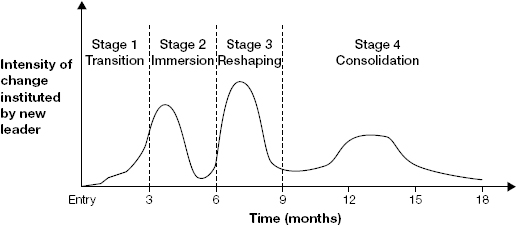
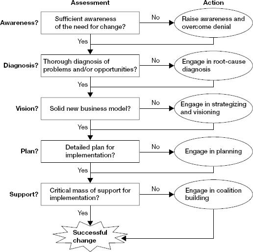

# Chapter 5: Secure Early Wins

> *"By the end of the first few months, you want your boss, your peers, and your subordinates to feel that something new, something good, is happening."*

Early wins build personal credibility and create momentum. They excite and energize people. Done well, they create value for your new organization earlier and reach break-even faster. Done wrong (too many, wrong type, wrong method), they scatter energy, burn goodwill, or set the wrong precedent.

Critical insight: early wins must do **double duty** — build short-term momentum AND lay foundations for longer-term goals. Pure low-hanging fruit with no strategic direction = a rocket with no second stage. You'll fall back to earth when initial momentum fades.

This chapter covers: the waves-of-change model, principles for choosing wins, building personal credibility in the first 30 days, launching early-win projects, leading change (planned vs. collective learning), and avoiding predictable surprises.

## Table of Contents

- [Case Study: Elena Lee](#case-study-elena-lee)
- [The Waves of Change Model](#the-waves-of-change-model)
- [Principles for Early Wins](#principles-for-early-wins)
- [Building Personal Credibility (First 30 Days)](#building-personal-credibility-first-30-days)
- [Launching Early-Win Projects](#launching-early-win-projects)
- [Leading Change: Planning vs. Collective Learning](#leading-change-planning-vs-collective-learning)
- [Avoiding Predictable Surprises](#avoiding-predictable-surprises)

**Block types:** [Core Framework] [Case Study] [Checklist] [Trap/Anti-Pattern] [SRE/Platform Leader Lens] [Questions to Ask] [Real-World Application]

---

## Case Study: Elena Lee

> **[Case Study: Elena Lee — Early Wins Through People and Process, Not Technology]**
>
> **Context:** Promoted to head customer service at a leading retailer. Tasked with improving slumping customer satisfaction. Also determined to change authoritarian leadership culture from her predecessor.
>
> **Her approach (sequenced deliberately):**
> 1. **Communicated goals** — told directs (her former peers, now reports) about quality improvement and participative culture vision. Got little obvious reaction initially.
> 2. **Established rhythm** — weekly meetings with each call center manager to review performance and discuss improvement. Stressed: "punishment culture is a thing of the past."
> 3. **Observed and identified** — learned which managers were adapting and which were still being punitive.
> 4. **Acted on personnel** — put worst offenders on performance improvement plans. One left (replaced with high-potential from her old unit). Other shaped up.
> 5. **Launched strategic project** — appointed her best leader to head a team of promising frontline managers. Task: new metrics + performance feedback processes. Engaged a consultant to advise on methodology.
> 6. **Implemented pilots** — promptly piloted recommendations in the unit whose manager had departed.
> 7. **Extended org-wide** — by end of year 1, new approach was universal. Customer service improved substantially. Climate surveys showed striking morale/satisfaction improvements.
>
> **Why this worked:**
> - Early wins served the LONG-TERM goal (participative culture), not just short-term metrics
> - Personnel actions sent a signal (behavior matters) without being punitive at scale
> - Project team modeled the NEW culture (participation, coaching) while solving the business problem
> - She moved at appropriate speed — fast enough to show change, slow enough to bring people along

---

## The Waves of Change Model

> **[Core Framework: Waves of Change]**
>
> 
> *Figure 5-1. Waves of change. Leaders plan and implement change in distinct waves, not a continuous stream. Each wave: learn → design → build support → implement → observe results.*
>
> Research on executives in transition shows change happens in **waves**, not a continuous flow:
>
> | Wave | Timing | Focus | Purpose |
> |------|--------|-------|---------|
> | **Learning period** | First ~30 days | Focused learning, relationship building | Build foundation for informed action |
> | **First wave** | Months 1-3 | Early wins — credibility + low-hanging fruit that serves long-term goals | Create momentum. Build personal credibility. Harvest quick improvements. |
> | **Consolidation** | After first wave | Pause. Let people catch their breath. Deeper learning. | Assess what worked. Prepare for bigger changes. |
> | **Second wave** | Months 4-8 | Deeper changes — strategy, structure, systems, skills | Reshape the organization fundamentally |
> | **Third wave** | Months 8-12+ | Fine-tuning. Maximize performance. | Polish and optimize |
>
> **Key implication:** Each wave has distinct phases — learning, designing, building support, implementing, observing. If you keep changing things without pausing to observe, you can't tell what worked. Unending change also burns out people.
>
> **The double-duty principle:** First-wave wins should advance second-wave goals. Elena's first-wave actions (personnel changes, project team) directly enabled her second-wave goal (org-wide culture change). If your early wins are disconnected from your strategic direction, you get momentum that leads nowhere.

> **[SRE/Platform Leader Lens: Your Waves of Change]**
>
> | Wave | What it might look like for you |
> |------|--------------------------------|
> | **Learning (days 1-30)** | Diagnose architecture, assess team, understand pain, map stakeholders. NO major changes. |
> | **First wave (days 30-90)** | 1-2 visible improvements: fix the worst on-call pain, ship a dashboard that makes invisible work visible, resolve one customer-facing reliability issue, introduce a lightweight practice (e.g., brief postmortems). |
> | **Consolidation (months 3-4)** | Let first wave settle. Observe what worked. Deepen relationships. Refine your strategy. Prepare proposals for bigger changes. |
> | **Second wave (months 4-8)** | Deeper: connector framework investment, SLO program, team restructuring, platform strategy implementation. |
> | **Third wave (months 8-12)** | Fine-tune: optimize processes, develop people, extend platform capabilities, measure outcomes against goals. |
>
> **The trap for your transition:** Your enterprise experience makes you SEE all the second-wave problems immediately (no SLOs, no IaC everywhere, missing observability). Your instinct will be to start second-wave work in month 1. Resist. First wave must build the credibility and coalitions that ENABLE second-wave changes to succeed.

---

## Principles for Early Wins

> **[Core Framework: Six Principles for Choosing Early Wins]**
>
> **1. Focus on a few promising opportunities.** (Not many at once)
> Taking on too much = ruinous. You can't achieve results in more than 2-3 areas during transition. Risk management: enough focal points for a good shot at success, not so many that effort is diffused.
>
> **2. Get wins that matter to your boss.** (Not just what YOU think is important)
> Your boss's opinion of your accomplishments is crucial for securing future resources and credibility. Address problems your boss cares about, even if they aren't your top personal priority.
>
> **3. Get wins in the right ways.** (Method matters as much as result)
> If you achieve results through manipulation, underhanded tactics, or behavior inconsistent with the culture — you set yourself up for trouble. A win achieved in a way that models the behavior you want to encourage = double win.
>
> **4. Take your STARS portfolio into account.** (Different situations need different wins)
>
> | STARS | What counts as an early win |
> |-------|---------------------------|
> | Turnaround | Decisive action on pressing problem. Show you CAN make tough calls. Shift mood from despair → hope. |
> | Realignment | Getting people to talk about problems. Introducing data/benchmarks. Shift mood from denial → awareness. |
> | Start-up | Getting first customers/users. Shipping something that works. Building a functioning team. |
> | Accelerated growth | Installing a process that prevents a failure. Introducing discipline that the team accepts. |
> | Sustaining success | Finding and fixing a subtle problem others missed. Demonstrating deep understanding of what made things successful. |
>
> **5. Adjust for the culture.** (What counts as a "win" varies)
> In some cultures: individual visible accomplishment. In others: being seen as a strong team contributor. In team-oriented cultures, individual glory-seeking is viewed as grandstanding. Know which culture you're in BEFORE choosing how to frame your wins.
>
> **6. Avoid the low-hanging fruit trap.** (Easy ≠ strategic)
> Low-hanging fruit is fine IF it serves long-term goals. But if you spend all energy on quick fixes that don't build toward your real objectives, you burn initial momentum without advancing strategy.

> **[Trap/Anti-Pattern: The Low-Hanging Fruit Trap]**
>
> **What it looks like:** You pick the easiest thing to fix (a broken script, a misconfigured alert, a missing dashboard). You fix it. People say "nice." You fix another easy thing. And another. By month 3, you've fixed 15 small things but nothing has structurally changed. Your boss asks "what's the strategy?" and you have nothing beyond a list of tactical fixes.
>
> **Why it feels right:** Each small fix gives a dopamine hit. You feel productive. People are happy in the moment. But you haven't changed the game.
>
> **The fix:** Before choosing any early win, ask: "Does this advance my 6-month goal? Does it model the behavior I want the team to adopt? Would my boss point to this in their leadership meeting as evidence of progress?" If no to all three — it might be satisfying but it's not strategic.

---

## Building Personal Credibility (First 30 Days)

> **[Core Framework: How People Judge New Leaders — The Credibility Questions]**
>
> People form opinions fast (days, not weeks) based on minimal data. They ask:
>
> 1. **Do you have the insight and steadiness to make tough decisions?**
> 2. **Do you have values that they relate to, admire, and want to emulate?**
> 3. **Do you have the right kind of energy?**
> 4. **Do you demand high levels of performance from yourself and others?**
>
> Once opinion hardens, it's very difficult to change. Confirmation bias (the tendency to notice information that confirms existing beliefs and ignore information that contradicts them) kicks in. Your first impression becomes the filter through which all future actions are interpreted.

> **[Core Framework: Six Balances of Credibility]**
>
> New leaders are perceived as credible when they display these balances:
>
> | Balance | What it means | Danger if off-balance |
> |---------|--------------|----------------------|
> | **Demanding but able to be satisfied** | Set high standards AND know when to celebrate. | Never satisfied → saps motivation. Too easily satisfied → people don't stretch. |
> | **Accessible but not too familiar** | Approachable, but preserves authority. | Too accessible → lose authority/boundaries. Too remote → lose information/trust. |
> | **Decisive but judicious** | Project decisiveness on low-stakes calls early. Defer high-stakes calls until you know enough. | Too decisive too fast → bad decisions. Too cautious → perceived as weak. |
> | **Focused but flexible** | Zero in on issues, but consult and encourage input. | Too rigid → alienate people. Too flexible → seem directionless. |
> | **Active without causing commotion** | Build momentum without overwhelming people. | Too active → burnout/panic. Too passive → "nothing is happening." |
> | **Willing to make tough calls but humane** | Do what needs doing in ways that preserve dignity. | Ruthless → feared not respected. Avoidant → problems fester. |

> **[SRE/Platform Leader Lens: Building Credibility in Platform Leadership Specifically]**
>
> **What builds credibility fast for a new platform/SRE leader:**
>
> | Action | What it signals | Why it works |
> |--------|----------------|-------------|
> | Shadow on-call in week 1 | "I'm not above the work. I want to understand YOUR reality." | Earns respect from engineers who've seen leaders stay in their office |
> | Fix one specific pain the team has been complaining about | "I listen and I deliver." | Shows you're not just a strategy person — you can make things better |
> | Ask the right diagnostic questions in an incident review | "I understand systems. I'm technically credible." | Proves you belong in the room without needing to prove it loudly |
> | Publicly acknowledge what the team has built well | "I see the strengths, not just the gaps." | Prevents the "enterprise guy who thinks everything is wrong" perception |
> | Write a clear, concise synthesis of what you've learned (shared with team) | "I'm a quick study. I listen well." | Shows learning without being threatening |
>
> **What DESTROYS credibility fast:**
> - Declaring things "broken" or "wrong" before you understand why they exist
> - Making promises you can't keep in 90 days
> - Focusing only on what's missing (no acknowledgment of what works)
> - Being unavailable when production breaks ("I'm too senior for on-call" energy)
> - Changing things before earning social license

> **[Real-World Application: Your First-Week Credibility Actions]**
>
> Plan these deliberately before day 1:
>
> 1. **How you introduce yourself** — not just your resume, but: why you're excited, what you value, how you plan to operate. Keep it brief. Focus on curiosity and respect for the existing team.
> 2. **Who you meet first** — meet SUPPORT staff and frontline engineers before focusing exclusively on other leaders. This gets noticed and signals accessibility.
> 3. **One small irritant you fix** — a broken process, an unnecessary meeting, an access problem people have been complaining about. Small, fast, visible.
> 4. **Your listening posture** — in your first meetings, the ratio should be 80% questions / 20% talking. Every time you share an opinion, you narrow people's willingness to tell you the truth.

---

## Launching Early-Win Projects

> **[Core Framework: FOGLAMP Project Checklist]**
>
> FOGLAMP = Focus, Oversight, Goals, Leadership, Abilities, Means, Process. Use for each early-win project:
>
> | Element | Question to answer |
> |---------|-------------------|
> | **Focus** | What's the goal? What early win are we targeting? |
> | **Oversight** | How will you oversee it? Who else should participate in oversight (to build buy-in for implementing results)? |
> | **Goals** | Specific goals, intermediate milestones, time frames? |
> | **Leadership** | Who leads the project? Do they need training/support? |
> | **Abilities** | What skills/representation must be included? Who for expertise? Who for constituency representation? |
> | **Means** | What resources (budget, facilitation, tools) does the team need? |
> | **Process** | Are there change models or structured processes the team should use? How will they learn the approach? |

> **[Core Framework: Early Wins Evaluation Tool]**
>
> Score each candidate early win (0-4) on four dimensions:
>
> 1. **Substantial improvement potential?** (0=not at all, 4=great extent)
> 2. **Achievable in short time with available resources?** (0-4)
> 3. **Would success help achieve agreed-to business goals?** (0-4)
> 4. **Will the process model the behaviors you want to encourage?** (0-4)
>
> Total (0-16). Higher = better candidate. But: if any single dimension scores 0, disqualify regardless of others. (An achievable win that doesn't advance your goals is a waste; an impactful win that's unachievable in the timeline is a fantasy.)

> **[SRE/Platform Leader Lens: Early Win Candidates Ranked]**
>
> | Candidate | Impact | Achievable in 30-60 days? | Advances long-term? | Models desired behavior? | Score |
> |-----------|--------|--------------------------|---------------------|------------------------|-------|
> | Fix top 3 flaky alerts (reduce page noise) | High — team feels relief immediately | Yes | Yes (moves toward SLO-based alerting) | Yes (data-driven, iterative) | 14-16 |
> | Ship per-team dashboard showing platform reliability | Medium — makes invisible work visible | Yes | Yes (foundation for SLOs and accountability) | Yes (transparency, metrics culture) | 12-14 |
> | Document and run a proper postmortem for next incident | Medium — demonstrates learning culture | Yes (next incident = opportunity) | Yes (builds postmortem muscle) | Yes (blameless, systematic) | 12-14 |
> | Reduce deploy time for one critical service | High — everyone feels it | Depends on complexity | Yes (CI/CD improvement) | Yes (automation, measurement) | 10-14 |
> | Propose full SLO framework and implement across all services | Very high eventually | NO — too big for 60 days | Yes | Yes | 8 (unachievable = disqualify) |
> | Rewrite all infrastructure as Terraform | Very high eventually | NO — months/years of work | Yes | Yes | 6 (unachievable) |

---

## Leading Change: Planning vs. Collective Learning

> **[Core Framework: When to Plan Change vs. When to Build Awareness First]**
>
> 
> *Figure 5-2. Diagnostic framework. Before you plan and implement change, check five conditions. If any is missing, you need collective learning before planning.*
>
> **Pure plan-then-implement works when ALL five conditions are met:**
>
> 1. ✅ **Awareness** — critical mass of people knows change is needed
> 2. ✅ **Diagnosis** — you know what needs to change and why
> 3. ✅ **Vision** — you have a compelling vision and solid strategy
> 4. ✅ **Plan** — you have expertise to put together a detailed implementation plan
> 5. ✅ **Support** — you have sufficiently powerful alliances to support implementation
>
> **If ANY condition is missing → you need collective learning first:**
>
> | Missing condition | What to do instead of planning |
> |-----------------|-------------------------------|
> | **Awareness** is missing (people don't see the problem) | Expose people to data: customer satisfaction scores, competitor benchmarks, external assessments. Don't tell them there's a problem — SHOW them. Let them arrive at the conclusion. |
> | **Diagnosis** is unclear | Set up cross-functional analysis. Get people to collectively study the problem. They learn and buy in simultaneously. |
> | **Vision** is weak | Run brainstorming/offsite. Let the group envision alternatives. They'll own what they create. |
> | **Plan** needs expertise you lack | Bring in experts to advise, but let internal team own the plan. |
> | **Support** is insufficient | Build alliances first (Ch08). Get key influencers on board before announcing the change. |
>
> **For your transition (likely realignment + accelerated growth):** You probably lack Awareness (people don't think the platform needs major change) and Support (you're new, haven't built coalitions). This means: DON'T arrive with a plan. Instead, build awareness through data/benchmarks, then co-create the plan WITH the team. The plan will be somewhat worse than what you'd design alone — but it'll actually get implemented because people own it.

> **[Trap/Anti-Pattern: The Enterprise Leader's "I Have a Plan" Trap]**
>
> Coming from enterprise SRE, you likely CAN produce a sophisticated plan (you've done this before). The trap: you produce a beautiful plan in week 3, present it, and... nobody follows it. Not because it's wrong. Because they weren't part of creating it, so they don't own it.
>
> **The alternative:** Present OBSERVATIONS, not solutions. "Here's what I'm seeing — our deploy time is X, incident MTTR is Y, comparable companies are at Z. What do you think we should do?" This takes longer. The plan that emerges may be less elegant than yours. But it gets executed because the team chose it.

---

## Avoiding Predictable Surprises

> **[Core Framework: Predictable Surprises — Scan These Areas]**
>
> **Predictable surprise** = a situation where all the information needed to recognize a time bomb exists, but nobody puts it together. New leaders get derailed by these because they don't look in the right places or ask the right questions.
>
> **Scan these areas for lurking problems:**
>
> | Area | What could explode? | How to check |
> |------|--------------------|-|
> | **External environment** | Regulatory changes, compliance deadlines, market shifts, customer contract renewals | Ask: "What deadlines or external events are coming in the next 6 months?" |
> | **Customers/competitors** | Major customer unhappy and about to leave. Competitor launching a better product. | Ask: "Which customers are at risk? What are competitors doing that we're not?" |
> | **Internal capabilities** | Key person about to quit. Critical system approaching capacity limits. Security vulnerability unfixed. | Ask: "What keeps you up at night? What breaks if we lose one specific person?" |
> | **Organizational politics** | Untouchable people you might accidentally offend. Peer subtly undermining you. | Ask: "Is there anything politically sensitive I should be aware of before making any changes?" (Ask your culture interpreter, not the people involved.) |

> **[SRE/Platform Leader Lens: Predictable Surprises in Platform/IGA]**
>
> Specific time bombs to scan for immediately:
>
> - **Expiring security certifications** (SOC2 audit coming up? FedRAMP renewal? Customer contract with SLA penalty clause?)
> - **End-of-life dependencies** (Kubernetes version going EOL? Database version losing support? Critical library deprecated?)
> - **Key person risk** (One engineer who's the only one who understands the connector framework? Someone holding institutional knowledge who's been interviewing elsewhere?)
> - **Customer escalation in progress** (A major enterprise customer threatening to leave over reliability? A regulatory audit finding that hasn't been remediated?)
> - **Budget/headcount changes incoming** (A hiring freeze about to be announced? Budget cuts in next quarter's planning?)
>
> Ask in week 1: "What's the thing that would surprise me most if I found out about it in month 3 instead of now?"

---

> **[2025 Context: Early Wins in the AI/Remote Era]**
>
> **New types of early wins that didn't exist in 2013:**
>
> | Win type | What it is | Why it works in 2025 |
> |----------|-----------|---------------------|
> | **Data-driven insight document** | Use AI to analyze incident history, support tickets, or deploy metrics. Produce a synthesis nobody had time to create manually. | Shows you're a quick study AND demonstrates a new capability (using AI for operational intelligence). Double signal. |
> | **Async-first process improvement** | Replace a painful synchronous process (a 1-hour weekly meeting nobody likes) with an async alternative (Slack bot, shared doc, automated report) | Remote/hybrid teams are drowning in meetings. Giving time back = instant goodwill. |
> | **Visibility dashboard** | Build/ship a dashboard showing platform health, team workload, or deployment metrics that stakeholders couldn't see before | In distributed orgs, visibility problems are amplified. Making invisible work visible = credibility builder for the whole team. |
> | **AI-assisted toil reduction** | Identify a repetitive manual task and automate it using modern tooling (AI-assisted runbook, auto-generated incident summaries, smart alert routing) | Shows technical freshness + immediate team relief. Fast to implement. High signal-to-effort ratio. |
>
> **Early win anti-patterns specific to 2025:**
> - Introducing a new tool/platform every week (tool fatigue is real in modern orgs)
> - Making your early win about AI for AI's sake (people are skeptical of "AI washing")
> - Shipping something flashy that nobody asked for (the "I'm so innovative" trap)
>
> **Remote-specific credibility tip:** In distributed teams, your written artifacts (strategy docs, RFCs, analysis documents, Slack messages) ARE your leadership presence. Invest disproportionate effort in writing quality during your first 90 days. A well-written synthesis doc that crystallizes a messy problem can be an early win in itself.

> **[Comparison: Neff & Citrin — Symbolic Early Actions]**
>
> Neff emphasizes the SYMBOLIC dimension of early wins more than Watkins:
>
> **"Day One is theater."** Your first day isn't about getting work done — it's about what your PRESENCE signals. Walk the floor. Meet people at their desks. Ask questions. The signal: "I'm here to understand, not to announce changes."
>
> **"Small symbolic acts carry outsized weight."** Named example — a new CEO who noticed the executive dining room was separate from the regular cafeteria. He ate in the regular cafeteria on day 1. Everyone noticed. Signal: "I'm not going to be a remote, elevated leader." For you: shadowing on-call, attending a customer escalation call, fixing a small irritant the team has complained about — these aren't substantial "wins" but they're SYMBOLIC wins that signal who you are as a leader.
>
> **"What you STOP is as important as what you START."** Early in a transition, killing something unnecessary (a pointless meeting, a report nobody reads, a process that exists only because "we've always done it") signals decisiveness and respect for people's time. It's a win achieved by SUBTRACTION — and it demonstrates you're paying attention to what's really happening.

> **[Checklist: Secure Early Wins]**
>
> 1. Given your goals, what creates momentum for achieving them during transition?
> 2. How do people need to behave differently? What behaviors to encourage/discourage?
> 3. How will you connect to the organization in the first days? Key audiences? Messages?
> 4. What are the most promising focal points for quick performance improvement?
> 5. What projects will you launch, and who leads them?
> 6. What predictable surprises could derail you? How will you scan for them?
> 7. Are your early wins doing DOUBLE DUTY — building momentum AND advancing long-term strategy?
