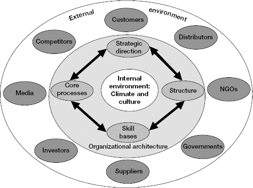
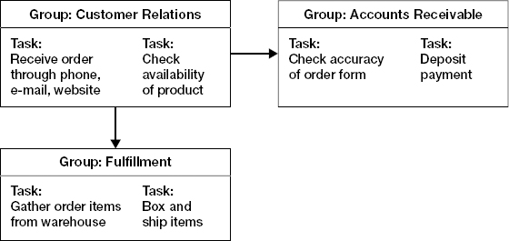

# Chapter 6: Achieve Alignment

> *"No matter how charismatic you are as a leader, you cannot hope to do much if your organization is fundamentally out of alignment. You will feel as if you're pushing a boulder uphill every day."*

The higher you climb, the more you become an **organizational architect** — creating and aligning key elements of the system: strategic direction, structure, core processes, and skill bases. If these elements fight each other (strategy says "customer focus" but incentives reward "product volume"), no amount of heroic individual effort overcomes the structural dysfunction.

This chapter provides: a framework for organizational architecture (four elements), common misalignment patterns, a diagnostic approach (coherence → adequacy → implementation), and guidance on sequencing structural changes by STARS situation. Key lesson: you probably can't do major realignment in your first 90 days, but you CAN diagnose where misalignment exists and plan for corrective action in your second wave of change.

Critical nuance for your level: even if you lack authority to redesign the WHOLE organization, understanding organizational alignment builds credibility with people above you and demonstrates senior-level thinking.

## Table of Contents

- [Case Study: Hannah Jaffey](#case-study-hannah-jaffey)
- [Common Traps in Alignment](#common-traps-in-alignment)
- [The Four Elements of Organizational Architecture](#the-four-elements-of-organizational-architecture)
- [Diagnosing Misalignments](#diagnosing-misalignments)
- [Getting Started: The Sequencing Logic](#getting-started-the-sequencing-logic)
- [Strategic Direction: Mission, Vision, Strategy](#strategic-direction)
- [Structure: Organizing People and Work](#structure)
- [Core Processes: How Value Gets Created](#core-processes)
- [Skill Bases: Capabilities of Your People](#skill-bases)
- [Changing Architecture to Change Culture](#changing-architecture-to-change-culture)

**Block types:** [Core Framework] [Case Study] [Checklist] [Trap/Anti-Pattern] [SRE/Platform Leader Lens] [Questions to Ask] [2025 Context] [Real-World Application]

---

## Case Study: Hannah Jaffey

> **[Case Study: Hannah Jaffey — Structure Was the Root Cause, Not People]**
>
> **Context:** Hired as corporate VP of HR. Company suffering intense conflict at the top — executives barely speaking to each other. CEO believed: "People are the problem. With the right people, the structure works."
>
> **What Hannah found:** Company had reorganized into product-line business units a year earlier. But units' customer bases overlapped, and incentive systems discouraged cooperation. Result: confused customers, turf wars over relationships, inability to offer integrated solutions. Top-line growth stalling.
>
> **Hannah's diagnosis:** Structure and incentives were the root cause, not people. The people conflict was a SYMPTOM of structural misalignment — rational actors responding to irrational incentives.
>
> **What she did:** Kept making the case to the reluctant CEO (who didn't want another reorg). Brought data — specific instances where incentive misalignment stoked conflict. Showed how other companies solved similar tensions. Eventually convinced CEO to move to a hybrid structure (marketing/sales by customer segment, ops/R&D by product line, shared services for support).
>
> **Result:** A year later — company functioning smoothly, customers happier, robust growth resumed. AND it became clearer which executives genuinely needed replacement (vs. which had been made to LOOK bad by broken incentives).
>
> **The lesson:** Don't blame people until you've checked the system. If your incentives reward competition, people will compete — even if you beg them to collaborate. Fix the architecture first; then assess who's truly a poor performer vs. who was set up to fail.

> **[SRE/Platform Leader Lens: Hannah's Lesson for Platform Engineering]**
>
> This pattern appears constantly in platform orgs:
>
> | What looks like a people problem | What's actually a structural problem |
> |----------------------------------|--------------------------------------|
> | "Product teams don't follow platform guidelines" | Incentives reward feature speed, not platform compliance. No consequence for bypassing platform. |
> | "Teams build shadow infrastructure instead of using platform" | Platform team is a bottleneck (Ch12 of Platform Engineering). Structure doesn't enable self-service. |
> | "Engineers don't write postmortems" | No time is allocated for it. No recognition for doing it. No consequence for not doing it. Incentive structure says: "ship features, not write retrospectives." |
> | "Nobody uses our observability tools" | Tools don't integrate with developer workflow. Using them requires extra steps. Structure (separate tooling team) creates disconnect from users. |
>
> **Before blaming people, check:** Do the structure, processes, and incentives ENABLE the behavior you want? If not, fix those first. People are remarkably rational — they do what the system rewards.

---

## Common Traps in Alignment

> **[Trap/Anti-Pattern: Five Alignment Traps]**
>
> 1. **Making changes for change's sake.** Pressure to "put your stamp on the organization." Ready-shoot-aim. Resist unless diagnosis supports the change.
>
> 2. **Not adjusting for STARS.** Turnaround alignment = rapid radical shifts. Realignment = subtle, incremental changes. One-size-fits-all → disaster.
>
> 3. **Restructuring your way out of deeper problems.** Changing the org chart when the real issues are processes, skills, or culture = "rearranging deck chairs on the Titanic" (moving furniture around on a ship that's sinking — the fundamental problem isn't where people sit, it's that the ship has a hole in it). Restructuring without addressing root cause creates NEW misalignments.
>
> 4. **Creating structures that are too complex.** Matrix structures CAN foster shared accountability. But over-complex structures diffuse decision-making and create gridlock. Strive for clear accountability. Simplify without compromising core goals.
>
> 5. **Overestimating capacity to absorb change.** People have limits. If they've experienced a string of recent changes, adding more = burnout and resistance. Move quickly only if STARS demands it (turnaround). Otherwise, proceed incrementally.

---

## The Four Elements of Organizational Architecture

> **[Core Framework: Four Elements That Must Be Aligned]**
>
> 
> *Figure 6-1. Elements of organizational architecture. An open system: external environment (customers, competitors, suppliers) + internal environment (culture, morale) + four architectural elements that must align with each other.*
>
> | Element | What it is | Key question |
> |---------|-----------|-------------|
> | **Strategic direction** | Mission (what), vision (why), strategy (how) | Are we headed in the right direction? |
> | **Structure** | How people are organized, coordinated, measured, incentivized | Does our org structure support the strategy? |
> | **Core processes** | Systems that transform inputs into value (information, materials → products/services) | Do our processes support the strategy and work with the structure? |
> | **Skill bases** | Capabilities of key groups — individual expertise, relational knowledge, embedded tech, metaknowledge | Do our people have the skills needed to execute the processes that support the strategy? |
>
> **The critical insight: these interact.** Changing one without thinking through impact on others creates new misalignments. Strategy drives the others, but is also constrained by them (you can't set a strategy your skills can't execute).
>
> **Culture is NOT a fifth element you change directly.** Culture is an OUTCOME of the four architectural elements + leadership behavior. To change culture, change the architecture and model the behaviors you want. This is why "culture change programs" without structural change rarely work — you're asking people to act differently while everything around them incentivizes the old behavior.

---

## Diagnosing Misalignments

> **[Core Framework: Common Misalignment Patterns]**
>
> | Misalignment | Example | How to spot it |
> |-------------|---------|---------------|
> | **Strategy ↔ Skills** | Strategy says "innovate faster" but team lacks modern techniques | People try but can't execute. Training requests pile up. Outcomes consistently below aspiration. |
> | **Strategy ↔ Processes** | Strategy says "focus on new customer segment" but no process exists to research those customers | Strategy is stated but nothing actually changes in daily work. |
> | **Structure ↔ Processes** | People organized by product line, but no process for sharing best practices across lines | Wheels reinvented in parallel. Teams solve the same problems independently. |
> | **Structure ↔ Skills** | Moved to matrix structure but people only know how to work in hierarchies | Confusion, dropped balls, conflict at intersection points. People lack influence/negotiation skills the structure requires. |

> **[SRE/Platform Leader Lens: Diagnosing Misalignments in IGA Platform]**
>
> Common misalignments you're likely to find:
>
> | Misalignment | What it looks like |
> |-------------|-------------------|
> | **Strategy says "platform as product" ↔ Structure is service-desk** | Company wants platform engineering, but the team is organized to take tickets and fulfill requests. No product managers, no roadmap, no self-service. |
> | **Strategy says "enterprise reliability" ↔ Processes are startup-grade** | Company sells to enterprises promising 99.9% uptime, but deploys are manual, monitoring is basic, incident response is ad-hoc. |
> | **Structure is centralized platform ↔ Skills are per-service only** | Platform team exists but engineers only know their one system (Kafka, or PostgreSQL, or CI). No one has platform-wide architectural thinking. |
> | **Strategy says "converged IGA+PAM+CIEM" ↔ Structure is siloed** | Product wants unified identity intelligence but teams are organized by legacy product line with no shared services or data model. |
>
> **Your first-90-days goal:** DIAGNOSE these misalignments (not fix them all). Document them. Use them to frame your strategy conversations with your boss: "Here's why we're struggling — it's not just people/skills, it's structural."

---

## Getting Started: The Sequencing Logic

> **[Core Framework: Alignment Sequencing — The Sailboat Analogy]**
>
> Aligning an organization is like preparing for a long sailing trip:
> 1. **Destination** (mission/goals) — are we going to the right place?
> 2. **Route** (strategy) — is the path correct?
> 3. **Boat** (structure) — do we have the right vessel for this route?
> 4. **Outfitting** (processes) — is the boat properly equipped?
> 5. **Crew** (skills) — do we have the right people with the right capabilities?
>
> **The logic:** You can't fully assess the crew until you know the destination, route, and boat. You can't choose the boat until you know the route. Work top-down: direction → structure → processes → skills.
>
> **BUT: sequencing differs by STARS situation:**
>
> | STARS | Where to focus alignment work |
> |-------|------------------------------|
> | **Turnaround** | Strategy first (often wrong/inadequate). Then structure (often bloated). Then processes and skills. |
> | **Realignment** | Strategy and structure often fine. Focus on processes and skills — that's where drift happened. |
> | **Accelerated growth** | Strategy fine, but structure hasn't kept up with growth. Add structure/processes to support scaling. |
> | **Start-up** | Everything from scratch — but keep structure simple initially. Don't over-architect. |
> | **Sustaining success** | All elements likely sound. Look for subtle drift — processes that worked at previous scale but won't at next scale. |

> **[Questions to Ask: Diagnosing Alignment in Your First 30 Days]**
>
> **About strategic direction:**
> - "What's our stated mission/strategy? Is everyone pursuing it, or are there divergent interpretations?"
> - "When was the strategy last revisited? Is it still adequate for where the business is going?"
>
> **About structure:**
> - "Why are teams organized the way they are? What drove this structure?"
> - "Where do turf wars or coordination failures happen? That's a structural misalignment signal."
> - "What decisions get escalated that shouldn't need to be? That suggests decision rights are unclear."
>
> **About processes:**
> - "What are the 3-5 most critical processes for this team? How well do they perform?" (For platform: deploy process, incident response, customer onboarding, connector development, certification campaigns)
> - "Where are the bottlenecks? Where do handoffs fail?"
>
> **About skills:**
> - "Where are our biggest capability gaps? What can't we do that we need to?"
> - "Are there people with underutilized skills? Experts doing toil work?"

---

## Strategic Direction

**Strategic direction = Mission (what) + Vision (why) + Strategy (how)**

Assess it on three dimensions:

1. **Coherence** — Do the pieces fit together logically? Do market analysis, product plans, resource commitments, and functional strategies align? If yes, connections are easy to spot.

2. **Adequacy** — Is the direction sufficient for the next 2-3 years? Will it support the larger org's goals? Use TOWS analysis (Threats/Opportunities first, THEN Weaknesses/Strengths — reversed from traditional SWOT, because starting with internal capabilities without external context leads to navel-gazing).

3. **Implementation** — Is the strategy being PURSUED energetically, or just stated? Look at what people DO, not what documents SAY. If strategy says "platform reliability" but all engineering time goes to features, implementation has failed regardless of how good the strategy document looks.

> **[SRE/Platform Leader Lens: Assessing Platform Strategic Direction]**
>
> Questions to evaluate your new platform team's strategic direction:
>
> | Dimension | What to look for |
> |-----------|-----------------|
> | **Coherence** | Does the platform roadmap connect to business goals? Or is it a collection of disconnected technical projects? |
> | **Adequacy** | Will current platform capabilities support the company's growth for 2-3 years? Or will you hit scaling walls? |
> | **Implementation** | Is the stated platform strategy actually being executed? Or has it been deprioritized in practice while remaining a PowerPoint aspiration? |

---

## Structure

**Structure = Units + Reporting relationships + Decision rights + Measurement/incentives**

Key trade-offs in organizational structure:

| Trade-off | Pro | Con |
|-----------|-----|-----|
| **Deep expertise (functional org)** | People accumulate specialized depth | Silos. Poor cross-functional coordination. |
| **Integration (cross-functional teams)** | Better coordination. Faster delivery. | Shallower expertise. Dual-reporting confusion. |
| **Centralized decisions** | Speed. Consistency. Clear accountability. | Bottleneck at the top. Ignores local knowledge. |
| **Decentralized decisions** | Uses local knowledge. Empowers people. | Inconsistency. May not align with broader strategy. |
| **Individual incentives** | Clear accountability. Motivates high performers. | Competition. Hoarding. Turf wars. |
| **Group incentives** | Collaboration. Knowledge sharing. | Free-riding. Unclear individual accountability. |

> **[SRE/Platform Leader Lens: Structural Decisions for Platform Teams]**
>
> Structural questions you'll face in your first 6 months:
>
> - **Organized by technology** (Kafka team, K8s team, DB team) **vs. by capability** (deploy platform, observability platform, data platform)?
> - **Centralized platform team vs. embedded SREs** in product teams? (Or hybrid?)
> - **Who has decision rights** for production changes? Platform team or product teams? Where's the boundary?
> - **How are platform engineers incentivized?** Customer satisfaction? Uptime? Platform adoption? Feature delivery? (Misaligned incentives = the Hannah Jaffey problem)
>
> Don't restructure in month 1. But DO diagnose whether the current structure creates the problems you're seeing. If yes — that's second-wave work (Ch05).

---

## Core Processes


*Figure 6-2. A simplified process map for order fulfillment. Process failures commonly occur at hand-offs between groups.*

**Evaluate each core process on four dimensions:**

| Dimension | Question |
|-----------|----------|
| **Productivity** | Does the process efficiently transform inputs into value? |
| **Timeliness** | Does it deliver value in a timely manner? |
| **Reliability** | Does it work consistently, or does it break too often? |
| **Quality** | Does it meet required quality standards? |

**Processes must align with structure.** When processes and structure mesh: smooth cross-team coordination, shared information, effective handoffs. When they're at odds: teams compete using different approaches, handoffs fail, effort is duplicated.

> **[SRE/Platform Leader Lens: Critical Processes to Assess]**
>
> For an IGA platform org, your core processes likely include:
>
> | Process | Questions to ask |
> |---------|-----------------|
> | **Deploy/release** | How does code get to production? How long? How often does it fail? Who can deploy? |
> | **Incident response** | Who gets paged? How is triage done? What happens after? Is there a postmortem process? |
> | **Connector development** | How long to build a new connector? What's the testing process? How are they deployed to customers? |
> | **Customer onboarding** | What happens when a new enterprise customer signs? What platform work is required? |
> | **Certification campaigns** | How are campaigns triggered, computed, and delivered? What's the performance at scale? |
> | **On-call rotation** | How is on-call scheduled? What's the burden? How do escalations work? |
>
> Pick 1-2 of these to deeply analyze in your first 30 days. Map the actual flow (who does what, where are the handoffs, where does it break). This gives you both UNDERSTANDING and a potential EARLY WIN (fix one broken process step).

---

## Skill Bases

**Four types of organizational knowledge:**

| Type | What it is | Example |
|------|-----------|---------|
| **Individual expertise** | Skills of specific people (from training, education, experience) | An engineer who deeply understands Kubernetes internals |
| **Relational knowledge** | How people work TOGETHER to integrate individual knowledge | The team's ability to coordinate during an incident across time zones |
| **Embedded knowledge** | Core technologies the org depends on (databases, frameworks, proprietary systems) | The connector framework, the identity data model, the workflow engine |
| **Metaknowledge** | Knowing where to GO for critical information | Who to ask about customer X's deployment, where the architecture decisions are documented, which external partners have expertise |

**Your goal:** Identify (1) critical gaps between needed and existing skills, and (2) underutilized resources (partially exploited technologies, squandered expertise).

> **[Questions to Ask: Skill Base Assessment]**
>
> - "What skill do we need most that we don't have today?"
> - "Is there someone on the team who's dramatically outperforming? What enables them? Can it be replicated?"
> - "Are there people doing work significantly below their capability? Why?"
> - "Where is critical knowledge concentrated in one person?" (Bus factor = if this ONE person leaves, what knowledge disappears?)
> - "What would we hire for next if we got one headcount? Why?"

---

## Changing Architecture to Change Culture

> **[Core Framework: Architecture → Culture (Not the Other Way)]**
>
> **Culture is not directly changeable.** It's an emergent property (something that arises from the interaction of many parts, not from any single component) of architecture + leadership behavior.
>
> **To change culture, change the inputs:**
> - Change METRICS (what you measure) → changes what people pay attention to
> - Change INCENTIVES (what you reward) → changes what people prioritize
> - Change STRUCTURE (who works with whom) → changes information flow and collaboration patterns
> - Change PROCESSES (how work is done) → changes daily habits
> - Change YOUR BEHAVIOR (what you model) → changes what people think leadership values
>
> Example: you want a "reliability culture." Don't just say "we value reliability." Instead:
> - Measure MTTR and incident rate (metrics)
> - Reward engineers who prevent incidents, not just those who ship features (incentives)
> - Embed reliability review in the deploy process (process)
> - Create an SRE function that partners with product teams (structure)
> - Attend incident reviews yourself and ask thoughtful questions (your behavior)
>
> Together, these architectural changes CREATE a reliability culture — without ever needing a "culture change program."

> **[2025 Context: Organizational Architecture in Remote/Distributed Teams]**
>
> Watkins's architecture framework assumed co-located teams. In 2025 distributed reality:
>
> - **Structure decisions have communication implications.** Teams in different time zones need more explicit coordination processes than co-located teams. Async-first documentation becomes a structural requirement, not a nice-to-have.
> - **Processes must be more explicit.** In person, implicit processes work ("just ask Sarah"). Distributed = must be written, discoverable, repeatable without asking anyone.
> - **Metrics matter more.** Without hallway visibility, leadership judges teams by measurable outputs. If your processes don't produce visible metrics, the team appears to do nothing.
> - **Culture is harder to transmit.** Without daily proximity, culture spreads through written norms, onboarding materials, and deliberate rituals — not osmosis.

---

> **[Comparison: Neff & Citrin — "Diagnose Before You Prescribe"]**
>
> Neff's guidance for senior leaders on organizational change aligns with Watkins but adds:
>
> **"The first reorg is always wrong."** Neff observes that leaders who reorganize in their first 90 days almost always have to reorganize AGAIN within a year — because they didn't understand the system deeply enough the first time. The exception: genuine turnaround where current structure is obviously preventing survival.
>
> **"Structure follows strategy follows understanding."** You cannot design the right structure until you understand the strategy. You cannot evaluate the strategy until you understand the business, the customers, and the competitive landscape. This takes time — which is why alignment is second-wave work, not first-wave.
>
> **"The biggest organizational dysfunction is usually at the seams."** Not within teams, but BETWEEN them. The most impactful alignment fixes are often at interfaces: how teams hand off work, how information flows between groups, how competing priorities get resolved. For platform engineering: the seam between platform team and product teams is almost always the highest-friction point. Fix the interface before reorganizing either side.

> **[Checklist: Achieve Alignment]**
>
> 1. What misalignments do you observe among strategic direction, structure, processes, and skills?
> 2. What decisions about customers, capital, capabilities, and commitments do you need to make? When?
> 3. How coherent, adequate, and well-implemented is the current strategic direction?
> 4. What are the structural strengths and weaknesses? What changes are you considering?
> 5. What are the core processes? How well are they performing? What are improvement priorities?
> 6. What skill gaps and underutilized resources have you identified?
> 7. How does your architecture need to change to produce the culture you want?

> **[Real-World Application: Your Alignment Diagnosis — One-Pager for Your Boss]**
>
> By day 45-60, produce a brief alignment assessment:
>
> ```
> ALIGNMENT DIAGNOSIS — [Platform/SRE Organization]
>
> Strategic direction: [Aligned / Partially aligned / Misaligned]
> - Assessment: [1-2 sentences on coherence, adequacy, implementation]
>
> Structure: [Aligned / Partially / Misaligned]
> - Key finding: [e.g., "Organized by technology silo, but strategy requires cross-platform thinking"]
>
> Processes: [Aligned / Partially / Misaligned]
> - Key finding: [e.g., "Deploy process is manual and brittle — doesn't support stated reliability goal"]
>
> Skills: [Aligned / Partially / Misaligned]
> - Key finding: [e.g., "Strong on individual expertise, weak on cross-team collaboration skills"]
>
> Proposed focus for next quarter: [1-2 alignment corrections to prioritize]
> ```
>
> This demonstrates director-level thinking and gives your boss a framework to understand WHY things are the way they are — not just "it's broken" but "HERE'S what's misaligned and HERE'S what fixing it requires."
