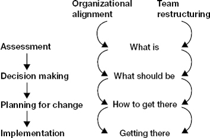
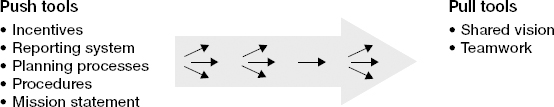

# Chapter 7: Build Your Team

> *"The most important decisions you make in your first 90 days will probably be about people. If you succeed in creating a high-performance team, you can exert tremendous leverage in value creation. If not, you will face severe difficulties, for no leader can hope to achieve much alone."*

Your team IS your leverage. As a Senior Director, you will not personally fix incidents, write Terraform, or configure pipelines. Your output is your team's output. This chapter is about the systematic process of inheriting a team, assessing who belongs where, making the hard calls on personnel, aligning everyone to a shared direction, and establishing the processes that make a team function as more than a collection of individuals.

The chapter covers the full arc: from the moment you walk in and meet your inherited team, through the assessment period (first 30-60 days), into the painful but necessary personnel decisions, and finally into team alignment and operating rhythm. Watkins emphasizes that this work must happen IN PARALLEL with organizational alignment (strategy, structure, systems) — you cannot sequence them; they inform each other continuously.

Critical framing: building a team you inherited is "like repairing a leaky ship in mid-ocean." You cannot ignore the repairs (you'll sink), but you cannot replace the hull while sailing (you'll also sink). The skill is finding the right balance between stability and change — making only the highest-priority personnel moves early, while preserving enough continuity to keep delivering.

## Table of Contents

- [Case Study: Liam Geffen](#case-study-liam-geffen)
- [Avoiding Common Traps](#avoiding-common-traps)
- [Assessing Your Team](#assessing-your-team)
- [The Six Evaluative Criteria](#the-six-evaluative-criteria)
- [Factors That Modify Your Assessment](#factors-that-modify-your-assessment)
- [How to Assess: Interviews and Observation](#how-to-assess-interviews-and-observation)
- [Evolving Your Team](#evolving-your-team)
- [Aligning Your Team: Push and Pull](#aligning-your-team-push-and-pull)
- [Leading Your Team: Processes and Decisions](#leading-your-team-processes-and-decisions)
- [Virtual Teams](#virtual-teams)

**Block types:** [Core Framework] [Case Study] [Checklist] [Trap/Anti-Pattern] [SRE/Platform Leader Lens] [Questions to Ask] [Real-World Application]

---

## Case Study: Liam Geffen

> **[Case Study: Liam Geffen — Assessing an Inherited Team with Skewed Data]**
>
> **Context:** Appointed to lead a troubled business unit at a process automation company. Inherited performance evaluations that were clearly skewed — everyone rated either "outstanding" or "marginal" with nobody in between. His predecessor had played favorites.
>
> **His approach (deliberate and sequenced):**
> 1. **Read the data skeptically** — recognized performance evaluations reflected predecessor's biases, not actual performance. Did not take ratings at face value.
> 2. **Gathered independent evidence** — had conversations with direct reports AND reviewed operating results independently. Cross-referenced words against numbers.
> 3. **Formed his own assessment** — VP of Marketing was "reasonably competent" but believed his own inflated ratings. VP of Sales was solid but had been scapegoated for predecessor's bad judgment calls. Marketing-Sales relationship was "understandably tense" given the unfair dynamic.
> 4. **Communicated expectations bluntly** — met each VP separately, told them directly how he viewed their actual performance (not the legacy ratings). Laid out specific two-month performance plans.
> 5. **Created options in parallel** — while giving VPs their chance, quietly launched external searches for both positions with HR. Also held skip-level meetings (one-on-ones with people below his directs) to find internal candidates.
> 6. **Acted on the evidence** — by month 3, signaled to Marketing VP that he wouldn't make it (he left; replaced by one of his own direct reports). Sales VP rose to the challenge and earned her place.
>
> **Why this worked:**
> - He didn't accept inherited narrative — he built his own assessment from multiple data sources
> - He gave people a fair chance with clear expectations (not arbitrary or surprise-based)
> - He created backups BEFORE he needed them (external search + skip-levels for internal talent)
> - He moved at the right speed — not so fast that it seemed arbitrary, not so slow that dysfunction continued
> - The "B-player who rose to the challenge" is real — sometimes people just needed better leadership and clearer expectations

> **[SRE/Platform Leader Lens: What Liam's Story Means for You]**
>
> You will inherit performance reviews, team reputation narratives, and "everyone knows X is the weak link" stories. **Do not trust any of them.** These often reflect:
> - Previous leader's biases (who they liked personally vs. who delivered)
> - Organizational politics (who annoyed the wrong VP vs. who is actually underperforming)
> - Cultural mismatch narratives (the "difficult" person who just disagrees with consensus)
> - Outdated assessments (the person who struggled 2 years ago but has grown since)
>
> Your first act: build YOUR OWN assessment from direct observation, results data, and cross-referencing what people say against what the metrics show. The person "everyone" says is great may be coasting on reputation. The person "everyone" says should go may be the only one telling the truth about systemic problems.

---

## Avoiding Common Traps

> **[Trap/Anti-Pattern: Eight Team-Building Traps for New Leaders]**
>
> | Trap | What it looks like | Why leaders fall in | The fix |
> |------|-------------------|--------------------|---------| 
> | **Criticizing previous leadership** | "Your old boss clearly didn't know what he was doing" | Feels like it builds rapport and signals competence | Concentrate on current behavior and results. Highlight problems without making it personal about predecessors. People who liked the old boss will resent you; people who didn't already know. |
> | **Keeping the existing team too long** | Still "giving people a chance" at month 6 | Hubris ("they failed because they lacked ME") or conflict avoidance | Set hard deadlines in your 90-day plan for assessment conclusions. Stick to them. |
> | **Not balancing stability and change** | Firing 3 people in week 2, OR changing nobody for 6 months | Either over-correction bias or avoidance | Focus ONLY on truly high-priority personnel changes early. B-players can wait. |
> | **Not working alignment and team in parallel** | Restructuring the team before knowing the strategy, or vice versa | Sequential thinking; desire to "finish one thing before starting another" | These are interdependent. Run them simultaneously. |
> | **Not holding on to good people** | Your best performer leaves because she assumed she'd be cut in the reshuffle | Underestimating how much uncertainty scares strong performers | Signal to top performers early that you see their value. Reassurance goes a long way. |
> | **Team-building before the core is in place** | Running an off-site "trust exercise" with people who are about to be let go | Desire to show collaborative intent quickly | Wait until your team is largely in place. Keep early group meetings focused on business, not bonding. |
> | **Making implementation-dependent decisions too early** | Committing to a platform strategy before your new hires arrive | Impatience; feeling pressure to show direction | Defer decisions that require buy-in until the people who must execute them are in place. |
> | **Trying to do it all yourself** | Navigating terminations, role changes, and legal considerations alone | Independence/self-reliance; not knowing what HR can do | Get a good HR partner. Restructuring has emotional, legal, and policy dimensions you cannot navigate alone. |

> **[SRE/Platform Leader Lens: The Traps Most Likely to Get YOU]**
>
> Based on your profile (enterprise SRE background, takes things at face value, moving to growth-stage):
>
> **Highest risk traps:**
> 1. **Criticizing previous leadership** — you'll see gaps in tooling, process, observability. Your instinct: "how did they let it get this bad?" The team built what they could with the resources and context they had. Acknowledge that FIRST.
> 2. **Keeping people too long** — you're conflict-averse enough that you might extend "observe" periods indefinitely. Set a hard date (day 45 for provisional assessment, day 75 for action plan) and hold yourself to it.
> 3. **Not holding on to good people** — your arrival + restructuring signals = anxiety. Your strongest engineers (who have the most options) will start interviewing first. Within 2 weeks, identify your top 2-3 performers and explicitly tell them you value them.
> 4. **Team-building before the core is in place** — resist the urge to do an "SRE team vision off-site" until you know who's staying.

---

## Assessing Your Team

> **[Core Framework: The Parallel Tracks — Organizational Alignment + Team Restructuring]**
>
> 
> *Figure 7-1. Organizational alignment and team restructuring must run in parallel, not sequentially. You cannot make good people decisions without knowing the destination (strategy), and you cannot set strategy without knowing what your people are capable of.*
>
> | Organizational Alignment Track | Team Restructuring Track |
> |-------------------------------|------------------------|
> | Assessment (what IS the org?) | What is (who do I have?) |
> | Decision making (what SHOULD it be?) | What should be (who do I NEED?) |
> | Planning for change (HOW do we get there?) | How to get there (what moves to make?) |
> | Implementation (DO it) | Getting there (execute personnel changes) |
>
> These tracks have **bidirectional arrows** between them at every stage. Your strategy assessment informs who you need; your team assessment constrains what strategy is feasible. They are not sequential steps — they are parallel, interleaved processes that inform each other continuously.

---

## The Six Evaluative Criteria

> **[Core Framework: Six Criteria for Evaluating Team Members]**
>
> Be conscious of the criteria you use to evaluate direct reports. Watkins identifies six:
>
> | Criterion | What it means | How to observe it |
> |-----------|--------------|-------------------|
> | **Competence** | Technical ability and experience to do the job effectively | Review their work products, ask probing technical questions, check with peers in that function |
> | **Judgment** | Making sound decisions, especially under pressure or when sacrificing for the greater good | Probe their reasoning on past decisions; test with scenario questions; observe in real incidents |
> | **Energy** | Bringing the right kind of engagement to the job (not burned out, not disengaged) | Watch for enthusiasm vs. going-through-the-motions; notice who volunteers vs. who avoids |
> | **Focus** | Setting priorities and sticking to them vs. riding off in all directions | Ask what their top 3 priorities are — if they list 10, they lack focus. Check if their time matches their stated priorities. |
> | **Relationships** | Getting along with others, supporting collective decisions, not being a destructive force | Observe team dynamics; ask others privately; notice who gets eye-rolls when they speak |
> | **Trust** | Keeping their word, following through on commitments | Track whether what they say matches what happens. Do they own mistakes or deflect? |
>
> **Exercise:** Divide 100 points among these six criteria based on YOUR weightings. Then identify your **threshold issue** — the one where if someone fails to meet a basic minimum, nothing else matters.
>
> **Example for SRE/Platform leader context:**
> - Competence: 20 (necessary but can be developed)
> - Judgment: 25 (critical in incident response and architectural decisions)  
> - Energy: 15 (burnout is real in SRE; must detect it)
> - Focus: 15 (platform work sprawls infinitely without discipline)
> - Relationships: 10 (less critical if operating independently; more if true team needed)
> - Trust: 15 (threshold issue* — if you can't trust someone's on-call report or their commitment timeline, nothing else matters)

> **[Questions to Ask: Probing for the Six Criteria]**
>
> Use a **standardized interview template** — ask every direct report the same questions so you can compare answers:
>
> 1. "What are the strengths and weaknesses of our existing strategy?"
> 2. "What are the biggest challenges and opportunities facing us in the short term? Medium term?"
> 3. "What resources could we leverage more effectively?"
> 4. "How could we improve the way the team works together?"
> 5. "If you were in my position, what would your priorities be?"
>
> **What to observe BEYOND the words:**
> - Does the person volunteer information, or do you have to extract it? (Trust signal)
> - Does she take responsibility for problems in her area, or subtly point fingers? (Judgment + Trust)
> - How consistent are facial expressions with words? (Authenticity)
> - What topics elicit strong emotional responses? (Motivation clues)
> - Outside 1:1s, how does this person relate to other team members? Cordial? Tense? Dismissive?

> **[SRE/Platform Leader Lens: Testing Judgment in Engineering Leaders]**
>
> Judgment is the hardest criterion to assess quickly but the most consequential. Watkins suggests an unconventional approach: ask people to make predictions in domains they care about (sports, politics, cooking — anything) and probe their reasoning. The idea: someone who exercises expert judgment in ANY domain likely does so in their professional domain too.
>
> **For your engineering context, better approaches:**
> - **Ask about past incidents:** "Walk me through the last major outage. What happened? What would you do differently?" Listen for: systems thinking vs. blame, learning orientation vs. defensiveness.
> - **Pose a scenario:** "If we had to cut our infrastructure cost by 30% in 6 months, how would you approach it?" Listen for: structured thinking, trade-off awareness, second-order effects.
> - **Check prediction calibration:** "What's the riskiest thing in our architecture right now? What's the probability it causes an incident in the next quarter?" Then track whether their mental model matches reality.
>
> **Red flags for poor judgment:**
> - Overconfidence without evidence ("That will never happen")
> - Inability to articulate trade-offs ("We should just rewrite it")
> - Pattern of being surprised by predictable failures
> - Unwillingness to commit to a prediction (hedging everything = inability to form a useful model)

---

## Factors That Modify Your Assessment

> **[Core Framework: Four Factors That Modify How You Evaluate]**
>
> Your raw assessment (the six criteria above) must be filtered through contextual factors:
>
> **1. Functional Expertise**
> If you're managing people across diverse functions (infrastructure, security, developer experience, observability), you need to assess competence in areas where you may not be the expert. Solutions:
> - Solicit opinions from respected peers in each function who know the individuals
> - Develop evaluation templates with function-specific KPIs, key questions, and warning signs
> - For unfamiliar functions, lean on the other five criteria more heavily
>
> **2. Extent of Teamwork Required**
> If your directs operate mostly independently (e.g., each owns a different platform component), individual performance matters most. If they must collaborate tightly (e.g., cross-cutting reliability initiative), Relationships and Focus matter much more. Adjust your weightings accordingly.
>
> **3. STARS Portfolio**
> - **Sustaining success:** You have time to develop B-players into A-players. Current B-level is OK if trajectory is up.
> - **Turnaround:** You need A-players NOW. Can't wait for development. If someone isn't performing at that level today, you need a replacement.
> - **Realignment:** You may have people who are A-players for "business as usual" but lack the skills for the change you need to drive. Not a competence problem — a fit problem.
> - **Start-up / Accelerated growth:** Need people who can build from scratch and operate in ambiguity, not just maintain.
>
> **4. Criticality of Positions**
> Not all positions matter equally. A B-player in a low-criticality role = tolerable. A B-player in YOUR most critical role = unacceptable. Rate each position's criticality (1-10) independently of the person currently in it. Then overlay your people assessment on the position assessment.

> **[SRE/Platform Leader Lens: Position Criticality for Your Context]**
>
> As a new Senior Director of SRE/Platform at a growth-stage IGA company, your position criticality map likely looks like:
>
> | Position/Role | Criticality | Why |
> |---------------|-------------|-----|
> | Lead SRE / Principal Engineer | 9-10 | Technical anchor. Sets architectural direction. If wrong person, everything else is on a bad foundation. |
> | Engineering Manager (if you have one) | 8-9 | Your operational multiplier. Handles day-to-day people management while you do strategy + cross-org. |
> | Security/Compliance Engineering | 8 | IGA company = identity governance. Security credibility is existential. |
> | On-call/Incident Response capability | 7-8 | Keeps the lights on. If this breaks, nothing else matters. |
> | Developer Experience / Platform UX | 6-7 | Important for adoption but less urgent than reliability. |
> | Tooling/Automation | 5-6 | Nice to have strong, but can develop over time. |
>
> The implication: if your Principal Engineer or EM is a B-player, that's a high-priority replacement. If your tooling engineer is a B-player, they can stay in the "develop" category while you address bigger issues.

---

## How to Assess: Interviews and Observation

> **[Core Framework: Assessing the Team as a Whole (Not Just Individuals)]**
>
> Beyond individual evaluations, assess how the GROUP functions:
>
> | Method | What to look for |
> |--------|-----------------|
> | **Read reports and meeting minutes** | How decisions were made. Who contributed. What was discussed vs. avoided. |
> | **Compare answers across interviews** | Are answers overly consistent? (May indicate a "party line" — agreed-upon narrative that hides real problems.) Are they wildly inconsistent? (May indicate lack of coherence or communication.) |
> | **Observe group dynamics in meetings** | Alliances. Deference patterns (who defers to whom on which topics). Eye-rolls or frustration when specific people speak. Who speaks first. Who stays silent. |
> | **Skip-level meetings** | Meet with people one level below your directs. Reveals: depth of talent, how directs are perceived as managers, what the "real story" is that directs may not tell you. |
>
> **Timeline:** By end of first 30-60 days (depending on STARS situation), you should be able to provisionally categorize everyone.

> **[Questions to Ask: In Your First Skip-Level Meetings]**
>
> Skip-levels (meetings with your directs' reports) serve dual purpose: assess talent depth AND get an unfiltered view.
>
> - "What's working well on this team?"
> - "If you could change one thing about how we work, what would it be?"
> - "What's the biggest risk nobody is talking about?"
> - "What does your manager do well? What could they do better?" (Be careful with this one — you're not building a case, you're triangulating)
> - "If you were me, starting fresh, what would you want to know that nobody would volunteer?"
>
> **Important:** Do NOT make promises in skip-levels. Do NOT share your developing assessments of their managers. Listen, thank them, and note patterns across multiple conversations.

---

## Evolving Your Team

> **[Core Framework: Six Categories for Team Evolution Decisions]**
>
> By day 30-45, provisionally assign each direct report to one of these categories (90%+ confidence required to act; if uncertain, use "observe"):
>
> | Category | Meaning | Action |
> |----------|---------|--------|
> | **Keep in place** | Performing well in current role | Acknowledge their value. Give them clarity on direction. Ensure they know they're valued (retention risk during transitions). |
> | **Keep and develop** | Needs development but you have time/energy to invest | Define specific development goals. Create stretch opportunities. Requires STARS situation that allows time. |
> | **Move to another position** | Strong performer, wrong seat | Find the right seat. This person is an asset — just misallocated. |
> | **Replace (low priority)** | Should be replaced but not urgent | Begin quiet search for successor. Don't let this become permanent procrastination. |
> | **Replace (high priority)** | Must be replaced ASAP | Act within 30-60 days of decision. Have backup plan ready. Work with HR. |
> | **Observe** | Still a question mark | Set a deadline for yourself to move them out of this category. Gather more data. |
>
> **The key timing discipline:** These assessments are provisionally due at day 30-60. Actions on high-priority replacements should begin by day 60-90. Do NOT let "observe" become a permanent state — set a hard deadline (e.g., "I will have a decision on this person by day 75").

> **[Core Framework: Alternatives to Termination]**
>
> Letting someone go is difficult, time-consuming, and may not even be possible (legal protections, cultural norms, political alliances). Before jumping to termination:
>
> | Alternative | When to use it | Risk |
> |-------------|---------------|------|
> | **Clear message + let them self-select out** | When the person has other options and some self-awareness | They might not get the hint. Be more direct if needed. |
> | **Shift their role** | When they have real skills but are in the wrong seat | Not a permanent solution for a problem performer; buys time. |
> | **Shrink responsibilities** | When they're actively destructive and removal is slow | Sends a clear signal. Having them "do nothing" is better than having them destroy value. |
> | **Move elsewhere in the org** | When they'd genuinely perform well in a different context | Only if genuine. Dumping your problem on someone else damages YOUR reputation. |
>
> **Critical practice: Develop backups.** As soon as you're reasonably sure someone won't make it, begin looking discreetly for a successor. Use skip-levels, internal talent reviews, and HR-driven external searches — all BEFORE you need the replacement.

> **[SRE/Platform Leader Lens: The "Treat People Respectfully" Imperative]**
>
> Watkins emphasizes this but it deserves amplification for your context:
>
> **The SRE/Platform world is small.** People you let go will end up at companies you work with, companies that are your customers, or companies that are potential future employers. How you handle personnel transitions becomes YOUR reputation in the industry.
>
> **What "respectful" looks like in practice:**
> - Give clear, specific feedback BEFORE it becomes a termination conversation. Nobody should be surprised.
> - Provide reasonable timelines and support for improvement (the "two-month plan" from Liam's example).
> - When someone must go, help with transition: references, timeline, networking introductions.
> - Never trash-talk departed team members. Ever. To anyone.
> - The team is watching HOW you handle this. They're asking: "If that's me someday, how would I be treated?"
>
> **Your direct reports will form lasting impressions of you based on how you manage this part of your job.** Handle it with dignity, and you earn deep loyalty from those who remain. Handle it callously, and your best people will quietly start interviewing — they know they could be next.

> **[Trap/Anti-Pattern: "When You Shake the Tree, Good People Fall Out Too"]**
>
> This is perhaps the most dangerous trap for a new leader making personnel changes:
>
> **The mechanism:** You announce (or hint at) upcoming changes. Uncertainty fills the air. Your B and C players have limited options — they hunker down and wait. Your A-players, who have the most external options, start taking recruiter calls. By the time you've finished your restructuring, you've lost the people you most wanted to keep.
>
> **Prevention:**
> - Within 2 weeks of starting, identify your top 2-3 performers
> - Have explicit 1:1 conversations: "I'm still learning, but I want you to know that I see your contributions and I'm excited to work with you."
> - Give them meaningful work immediately — interesting problems, not just "keep the lights on"
> - If possible, hint at growth opportunities: "As I think about where this team is going, I see roles that would leverage your strengths even more"
> - Watch for signals they're shopping: sudden calendar blocks, LinkedIn profile updates, less engagement in planning conversations

---

## Aligning Your Team: Push and Pull

> **[Core Framework: Push and Pull Tools for Team Alignment]**
>
> 
> *Figure 7-2. Push tools (authority, measurement, incentives) and pull tools (vision, teamwork) work together to align and motivate a team. The right mix depends on people's preferences and the STARS situation.*
>
> Having the right people is necessary but not sufficient. You must also align them — define how each person supports key goals, and create accountability for delivery.
>
> | Push Tools | Pull Tools |
> |-----------|-----------|
> | Goals and metrics | Compelling shared vision |
> | Performance measurement systems | Sense of teamwork and belonging |
> | Incentives (monetary and non-monetary) | Meaning and contribution |
> | Reporting/accountability structures | Autonomy and mastery |
> | Planning processes and procedures | Story and narrative |
> | Consequences for non-performance | Excitement about the future |
>
> **STARS variation:**
> - **Turnaround** provides plenty of natural push (the burning platform is obvious). Focus more on pull (hope, vision of what's possible).
> - **Realignment** lacks urgency (people don't see the problem). You need to CREATE push by surfacing data, or lean heavily on pull to inspire change.
> - **Sustaining success** needs subtle pull (we're good, but we could be GREAT) with light push (metrics that reveal where "good" isn't good enough).

> **[Core Framework: Defining Goals and Metrics (Push)]**
>
> **Rules for effective goals:**
> - Avoid ambiguous goals ("Improve reliability"). Instead: "Reduce P1 incidents from 8/month to 3/month within Q3" or "Achieve 99.9% availability on the identity service by end of Q4."
> - Make them quantifiable and time-bound
> - Each team member should have 2-4 goals max (more = no focus)
> - Goals should cascade from your priorities to their work
>
> **The incentive equation:**
> ```
> Total reward = nonmonetary reward + monetary reward
> Monetary reward = fixed compensation + performance-based compensation
> Performance-based = individual performance + group performance
> ```
>
> The mix depends on:
> - **Observability:** Can you clearly see individual contributions? (Lower in SRE — incidents are team efforts. Higher in feature development.)
> - **Interdependence:** Do people need to collaborate closely? If yes → weight group incentives more heavily. If independent work → weight individual more.
> - **Time lag:** Long time between action and result? → More fixed compensation (people can't be held accountable for what takes 18 months to manifest).

> **[Core Framework: Articulating Vision (Pull)]**
>
> An inspiring vision has three attributes:
>
> 1. **Taps into intrinsic motivators** — teamwork, contribution, mastery. Not just "hit the number."
> 2. **Makes people part of a story** — connects them to a narrative larger than their daily tasks. A quest, a transformation, a pioneering effort.
> 3. **Uses evocative language** — "Launching 12 rockets in 10 years" is a goal. "Putting a man on the moon and returning him safely by end of the decade" is a vision.
>
> **Principles for communicating vision:**
> - Use consultation to gain commitment (be clear on non-negotiables; flex on everything else)
> - Develop stories and metaphors (parables stick better than bullet points)
> - Reinforce constantly (repetition is how it sinks in; don't stop when you're tired of saying it)
> - Develop channels for scale (you can't personally convey it to everyone; build communication mechanisms)
> - **Live it yourself** (a vision undercut by your own behavior is worse than no vision at all)

> **[SRE/Platform Leader Lens: Your Push/Pull Mix for IGA Platform]**
>
> **Your situation (likely realignment + accelerated growth):**
> The team probably doesn't feel urgency — things are "working" (customers aren't leaving yet, systems aren't down every day). Natural push is low. You need to either CREATE push (surface data that shows the gap) or lean heavily on pull.
>
> **Push tools to deploy:**
> - SLOs that make reliability visible and measurable (people can't argue with numbers)
> - Incident metrics that show true cost of current state (MTTR, frequency, customer impact)
> - Industry benchmarks ("Companies our size and growth rate typically have X; we have Y")
> - Clear individual goals tied to platform outcomes, not activity metrics
>
> **Pull tools to deploy:**
> - Vision: "We're building the reliability foundation for an identity platform that protects millions of users. When we get this right, our engineers ship fearlessly and our customers trust us with their most sensitive operations."
> - Mastery: "You'll work on genuinely hard problems — distributed systems, security at scale, developer experience — with the autonomy to solve them well."
> - Narrative: "We're at the stage where the next 18 months determines whether this becomes a world-class platform or a pile of technical debt. You get to be the people who built it right."
>
> **A warning about vision in SRE:** Reliability is defensive work — preventing bad things. It's harder to make inspiring than building new features. Frame it around ENABLEMENT: "We don't just keep things running — we enable the entire engineering org to move fast safely." That reframe turns SRE from cost center to force multiplier.

> **[Questions to Ask: Alignment Conversations with Each Direct]**
>
> Once you've decided WHO stays, have explicit alignment conversations:
>
> 1. "Here are my top 3 priorities for the next 6 months. How do you see your work connecting to these?"
> 2. "What does success look like for you in the next quarter? How would we measure it?"
> 3. "What do you need from me to be successful? Resources? Air cover? Decisions?"
> 4. "What's the one thing that, if it went wrong, would derail your goals?"
> 5. "How do you prefer to be managed? Frequency of check-ins? Level of detail? How you want feedback?"

---

## Leading Your Team: Processes and Decisions

> **[Core Framework: Assess Existing Team Processes Before Changing Them]**
>
> Before introducing new ways of working, understand how the team worked before you arrived:
>
> | Process Area | Questions to answer |
> |-------------|-------------------|
> | **Participants' roles** | Who had the most influence? Was there a devil's advocate? An innovator? A peacemaker? Who did everyone listen to? |
> | **Team meetings** | How often? Who participated? Who set agendas? What was the actual purpose vs. stated purpose? |
> | **Decision making** | Who made what kinds of decisions? Who was consulted? Who was merely informed after the fact? |
> | **Leadership style of predecessor** | How did they learn, communicate, motivate, handle conflict? How does YOUR style differ, and what impact will that difference have? |
>
> **Then:** Preserve what worked. Change what didn't. But take care not to change everything at once — people can absorb only so much process change alongside personnel change and strategic change simultaneously.

> **[Core Framework: Decision-Making Spectrum — Consult-and-Decide vs. Build Consensus]**
>
> Most decisions fall between two extremes:
>
> | Approach | How it works | Best when... | Risk if misapplied |
> |---------|-------------|-------------|-------------------|
> | **Unilateral** | Leader makes the call alone | Almost never appropriate for a new leader (you lack context) | Miss critical info. Get lukewarm support. |
> | **Consult-and-decide** | Gather input from directs (individually or as group), then YOU make the call | Decision is divisive (winners/losers); team is inexperienced; you need to establish authority | Faster to decide, but may be slower to implement if people don't buy in |
> | **Build consensus** | Seek both information AND buy-in from the group. Goal: sufficient consensus (not unanimous) | Implementation requires energetic effort you can't directly observe; dealing with cultural/political issues | Takes longer to decide, but faster to implement. Risk: endless discussion without closure. |
> | **Unanimous consent** | Everyone must agree | Almost never appropriate (decision diffusion, lowest-common-denominator outcomes) | Nothing gets decided. Or what gets decided is useless. |
>
> **Rules of thumb for choosing:**
> 1. **Divisive decisions (sharing pain/losses):** Use consult-and-decide. Consensus will fail and make everyone angry at each other. YOU take the heat.
> 2. **Implementation-heavy decisions:** Use build-consensus. You may decide faster with consult-and-decide, but people won't execute what they didn't choose.
> 3. **Inexperienced team:** Use consult-and-decide until you've built their capability. Consensus with inexperienced people = frustration.
> 4. **Establishing authority (e.g., leading former peers):** Use consult-and-decide for early key decisions. Relax to consensus once people trust your judgment.
>
> **STARS variation:**
> - Start-ups and turnarounds → consult-and-decide works well (problems are technical, people want "strong" leadership)
> - Realignment and sustaining-success → build-consensus often necessary (problems are cultural/political, teams are strong and intact)
>
> **Critical principle: Run a FAIR process.** Even if people disagree with the decision, they'll support it IF they feel (1) their views were heard and taken seriously, and (2) you gave a plausible rationale for your call. The corollary: NEVER do fake consensus — pretending to build consensus for a decision already made. Everyone sees through it. It creates cynicism and kills future cooperation.

> **[SRE/Platform Leader Lens: Decision-Making in Your First 90 Days]**
>
> **Your likely default:** If you're coming from enterprise, you probably default to consult-and-decide (that's how large orgs work — leaders are expected to make calls). At a growth-stage company with strong senior ICs, you may need to lean MORE toward consensus-building than feels natural.
>
> **Tactical guidance:**
>
> | Decision type | Recommended approach | Example |
> |--------------|---------------------|---------|
> | On-call rotation changes | Consult-and-decide (people hate negotiating shared burden; just be fair and own it) | "After hearing everyone's constraints, here's the new rotation. Here's my rationale." |
> | Platform architectural direction | Build consensus (they have to implement it; they have deep context you lack) | "Based on what I'm learning, I see three options. Let's work through trade-offs together." |
> | Vendor/tooling choices | Consult-and-decide (too many opinions; analysis paralysis is real) | "I've heard the arguments for all three options. Here's what we're going with and why." |
> | Team process changes (meeting rhythm, etc.) | Consult-and-decide initially, then adjust based on feedback | "Let's try this cadence for 4 weeks and then reassess." |
> | Strategy and vision | Build consensus (people must own it or they'll passively resist) | Series of discussions → off-site → documented shared direction |
> | Personnel decisions | Consult-and-decide (always — never consensus-build on who gets fired) | Get input from HR and trusted advisors, then make the call |
>
> **Watch for this pattern:** You consult-and-decide on something. Implementation is lackluster. You think people are being difficult. Actually, you needed consensus and didn't build it. The decision was "right" but the process was wrong. Fix the process, not the people.

> **[Core Framework: Altering Meeting Participation]**
>
> A quick-win process change that sends a clear signal:
>
> | Problem | Signal you want to send | Action |
> |---------|------------------------|--------|
> | Key meetings are too inclusive (too many people, too slow, no one owns decisions) | "I value efficiency and focus" | Reduce core group size. Streamline the meeting. |
> | Key meetings are too exclusive (important voices systematically excluded) | "I won't play favorites or listen to only a few viewpoints" | Broaden participation judiciously. |
>
> This is a low-cost, high-signal move you can make in weeks 2-4 that communicates how you operate without requiring a formal announcement.

---

## Virtual Teams

> **[Core Framework: Additional Considerations for Distributed/Remote Teams]**
>
> If some or all team members work remotely (highly likely for SRE/Platform), standard principles apply but with additional structure:
>
> | Principle | Why it matters more for distributed teams | Tactical action |
> |-----------|----------------------------------------|-----------------|
> | **Bring team together early** (if at all possible) | Virtual relationships are weaker without an in-person foundation | Budget for a team on-site in first 60 days. Even 2-3 days creates lasting connective tissue. |
> | **Establish clear communication norms** | No hallway conversations to fill gaps; misunderstandings fester | Document: which channels for what, response time expectations, meeting norms (cameras, interruptions, etc.) |
> | **Define team support roles** | Information capture and follow-up happen informally in co-located teams | Assign rotating roles: note-taker, agenda-creator, action-item tracker |
> | **Create interaction rhythm** | Co-located teams get natural routines (coffee, arrivals, lunch); distributed teams don't | Set regular meeting cadence with specified agendas. Consistency creates psychological safety. |
> | **Celebrate success explicitly** | Easy for remote members to feel disconnected, especially if some are co-located | Pause to recognize accomplishments. Distributed people miss the energy of in-person celebration. |

> **[SRE/Platform Leader Lens: Distributed SRE Team Specifics]**
>
> SRE teams are almost always distributed (follow-the-sun on-call, if nothing else). Additional considerations:
>
> - **On-call handoff as a relationship ritual:** The handoff is your natural "daily standup." Make it a brief human interaction, not just a bot message.
> - **Incident response as team-building:** Incidents are the one time distributed teams naturally collaborate intensely. Use post-incident reviews to build relationships, not just fix systems.
> - **Async-first documentation:** If your team spans timezones, decisions MUST be documented. "We discussed it in the meeting" excludes whoever was asleep. Build the muscle of writing things down.
> - **Over-communicate your own thinking:** As a remote leader, your team can't read your body language or catch you in the hallway. Be more explicit about your reasoning, your priorities, and your state of mind than feels natural.

---

> **[Real-World Application: Your 90-Day Team-Building Plan]**
>
> | Phase | Timing | Key activities |
> |-------|--------|---------------|
> | **Observe and assess** | Days 1-30 | Meet every direct 1:1 (standardized questions). Conduct skip-levels. Read performance data. Observe team dynamics in meetings. Shadow on-call. Form initial impressions. |
> | **Provisional categorization** | Days 30-45 | Assign each direct to keep/develop/move/replace/observe. Identify top performers and signal value. Identify critical positions and assess fit. |
> | **Act on high-priority decisions** | Days 45-75 | Begin high-priority replacement processes (with HR). Give "develop" people specific plans. Reassure "keep" people. Continue observing "observe" people with hard deadline. |
> | **Align and structure** | Days 60-90 | Define goals and metrics for each direct. Establish decision-making norms. Adjust meeting structure. Begin building shared vision (conversations, not yet an off-site). |
> | **Team building** | Days 90+ | Once core team is in place, invest in team cohesion. Off-site (if warranted). Deeper alignment work. Process refinement. |
>
> **Your constraints to factor in:**
> - Growth-stage company = less HR infrastructure. You may not have a dedicated HRBP. Find out what support exists.
> - IGA/security context = compliance and audit requirements may constrain how fast you can change people (especially if they hold security clearances or compliance certifications).
> - You're establishing a new function at a higher level = some existing team members may have hoped for YOUR job. Handle that dynamic explicitly and early.

---

> **[2025 Context: Team Building in the Modern Engineering Org]**
>
> | 2013 assumption | 2025 reality |
> |----------------|--------------|
> | You observe people daily by working alongside them | Remote/hybrid = you assess through async output, meeting behavior, code reviews, Slack communication quality. Performance signals are different. |
> | "Hire and fire" are your primary levers | Modern market: firing is expensive (legal, knowledge loss), hiring is slow (6-month ramp). Developing existing people and reorganizing work often higher-ROI than replacement. |
> | Team assessment = performance + potential | Also assess: communication quality (critical in distributed teams), self-direction capability (can they operate without daily check-ins?), documentation discipline |
> | New hires onboard through proximity | New hires need DELIBERATE onboarding: buddy system, structured learning plan, 30/60/90 check-ins. Without proximity, osmosis doesn't happen. |
> | "Culture fit" in hiring | "Culture add" — what perspective/experience does the team LACK? In IGA platform: probably need people with security depth, compliance background, or enterprise SaaS scale experience that current team may not have. |
>
> **Gen AI for team assessment:**
> - Analyze PR review patterns: who reviews what? Who's thorough vs. rubber-stamp? Who mentors vs. gatekeeps?
> - Analyze on-call patterns: who resolves quickly? Who escalates everything? Who documents well?
> - These aren't performance reviews — they're DATA that informs your human judgment. Use as input, not as verdict.

> **[Comparison: Neff & Citrin — The "First Team Meeting" as Signal]**
>
> Neff emphasizes that your FIRST group meeting with the inherited team is a high-stakes symbolic moment:
>
> **What people are watching for:**
> - "Is this person going to fire people?" (anxiety management)
> - "Do they respect what we've built?" (pride/identity)
> - "Are they listening or already decided?" (openness signal)
> - "Do they seem competent enough to lead us?" (credibility assessment)
>
> **What to do:**
> - Acknowledge the team's accomplishments explicitly
> - State your intention to learn before changing: "I'm spending my first 30 days understanding"
> - Ask them what THEY think the team's biggest opportunity is (shows respect for their judgment)
> - Do NOT hint at personnel changes, even positively ("I'm sure you're all great" = patronizing)
>
> **What NOT to do:**
> - Present a "plan" for the team
> - Compare to your previous team/company
> - Ask people to justify their roles (they'll hear "prove why I shouldn't fire you")

> **[Checklist: Build Your Team]**
>
> 1. What are your criteria for assessing team members? How do weightings change based on function, teamwork requirements, STARS portfolio, and position criticality?
> 2. How will you conduct your assessment? (Standardized interviews, skip-levels, data review, observation)
> 3. What personnel changes are needed? Which are urgent vs. can wait? How will you create backups before you need them?
> 4. How will you make high-priority changes while preserving dignity and managing legal/policy requirements? Who is your HR partner?
> 5. How will you signal value to your top performers to prevent them from leaving during the transition uncertainty?
> 6. How will you align the team? What mix of push (goals, metrics, incentives) and pull (vision, meaning, teamwork) will you use?
> 7. How do you want the team to operate? Meeting cadence? Decision-making approach? Who's in the core group?
> 8. Are you running organizational alignment and team restructuring IN PARALLEL, not sequentially?
> 9. Have you set hard deadlines for assessment decisions — and are you committed to holding yourself to them?
> 10. What is your threshold criterion? What's the ONE thing where if someone fails, nothing else matters?
