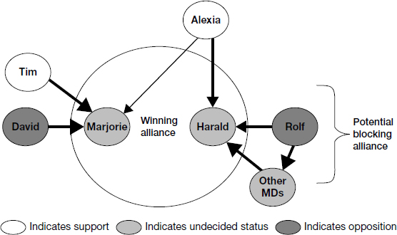

# Chapter 8: Create Alliances

> *"To succeed in your new role, you will need the support of people over whom you have no direct authority."*

This is arguably the most important chapter for someone who takes things at face value. Alliance building is the mechanism by which decisions actually get made in organizations — especially decisions that cross boundaries, require resources from others, or challenge the status quo. Formal authority is never enough. You need people to CHOOSE to support you — and that requires understanding what motivates them, what pressures they face, and how to make it easy for them to say yes.

The chapter provides: a systematic method for mapping influence networks, identifying supporters/opponents/persuadables, understanding what drives pivotal people, and crafting influence strategies using seven specific techniques. The core message: don't assume your good ideas will sell themselves. They won't. You must actively build coalitions.

For platform/SRE leaders specifically: your work is structurally disadvantaged in alliance-building because your value is invisible and your team is often perceived as a cost center. Without deliberate alliance work, you will lose budget battles, have initiatives blocked, and watch shadow platforms emerge — not because your ideas are wrong but because you didn't build the political support to make them happen.

## Table of Contents

- [Case Study: Alexia Belenko at MedDev](#case-study-alexia-belenko)
- [Defining Your Influence Objectives](#defining-your-influence-objectives)
- [Understanding the Influence Landscape](#understanding-the-influence-landscape)
  - [Winning and Blocking Alliances](#winning-and-blocking-alliances)
  - [Mapping Influence Networks](#mapping-influence-networks)
  - [Identifying Supporters, Opponents, and Persuadables](#identifying-supporters-opponents-and-persuadables)
- [Understanding Pivotal People](#understanding-pivotal-people)
- [Crafting Influence Strategies](#crafting-influence-strategies)

**Block types:** [Core Framework] [Case Study] [Checklist] [Trap/Anti-Pattern] [SRE/Platform Leader Lens] [Questions to Ask] [2025 Context] [Real-World Application]

---

## Case Study: Alexia Belenko

> **[Case Study: Alexia Belenko at MedDev — The Strength of Logic Is Not Enough]**
>
> **Context:** Alexia promoted from Russia country manager to regional VP Marketing for EMEA at MedDev (medical devices). Reports to Marjorie (corporate marketing, US-based) with dotted line to Harald (EMEA operations). She identifies a real problem: tension between centralizing and decentralizing marketing decisions for product launches.
>
> **What Alexia did:** Built a thorough business case with solid recommendations. Got both bosses to agree it had merit. Was told to "brief the stakeholders."
>
> **What went wrong:**
> - Presented to 30+ people in corporate marketing → they all pushed for MORE centralization (their interest)
> - Conference call with EMEA country managers → they wanted MORE flexibility (their interest) and closed ranks against anything that reduced autonomy
> - Key skeptic (Rolf, respected Nordic MD): "We've been promised flexibility before and it hasn't materialized"
> - Alexia was stuck — good analysis but no mechanism to get agreement
>
> **Root cause:** Alexia assumed the strength of her business case would carry the day. She presented a RATIONAL solution to a POLITICAL problem. She didn't:
> - Identify in advance whose support was essential (the winning alliance)
> - Figure out who might block and why (the blocking alliance)
> - Understand what motivated the pivotal people (David on corporate side, Rolf on EMEA side)
> - Sequence her conversations to build momentum before going to large groups
> - Address Rolf's legitimate concern about whether agreements would be honored
>
> **What she should have done:**
> - Met Tim Marshall (corporate strategy VP, already supportive) FIRST → armed him to influence Marjorie
> - Met Rolf 1:1 BEFORE the group call → understood his concerns, explored trades
> - Built a small coalition of support BEFORE presenting to large groups
> - Proposed incremental changes with built-in trust-building mechanisms (phased implementation, each step linked to honoring the previous commitment)

> **[SRE/Platform Leader Lens: You ARE Alexia]**
>
> This pattern will happen to you. You'll identify a real platform problem (e.g., "we need a connector framework" or "we need SLOs"), build a solid technical case, present it — and watch it die in a meeting because:
> - Product teams want something different (their interest)
> - Security team has concerns (their constraint)
> - A peer director thinks it steps on their turf (their territory)
> - Your boss says "sounds good" but doesn't push for it at the exec level (hedging)
>
> **The fix is the SAME as Alexia's fix:** Don't present to groups until you've built 1:1 support with the pivotal people. Identify the winning alliance. Sequence your conversations. Address concerns before they become public opposition.

---

## Defining Your Influence Objectives

> **[Core Framework: Alliance Building Starts with "Why Do I Need Others?"]**
>
> Before mapping influence, be clear about WHAT you're trying to accomplish that requires others' support:
>
> 1. Which of your early wins require decisions or resources from people outside your direct control?
> 2. For each initiative: who are the key decision makers? What do you need them to DO, and WHEN?
>
> | Who (decision maker) | What you need them to do | By when |
> |---------------------|-------------------------|---------|
> | [Name] | [Specific action or decision] | [Timeline] |
>
> Create this table for each early-win project. It forces precision: instead of vague "I need stakeholder buy-in," you get specific "I need VP Product to agree to allocate 2 engineers for 6 weeks by month 2."

> **[SRE/Platform Leader Lens: Your Influence Objectives]**
>
> | Objective | Who needs to agree | What specifically |
> |-----------|-------------------|-------------------|
> | Budget for tooling investment | Your boss + CFO/finance | Approve $X for observability/CI-CD/monitoring tooling |
> | Team uses your platform instead of building their own | Peer engineering directors | Direct their teams to adopt shared platform services |
> | Headcount for platform team growth | Your boss + HR | Approve N new positions, help with recruiting |
> | Customer-impacting changes (SLOs, deploy process) | VP Product + customer success | Agree that reliability investment is worth feature velocity trade-off |
> | Mandate for security/compliance improvements | CISO + your boss | Prioritize compliance as joint initiative |
> | Organizational recognition of platform value | CTO/CEO level | Include platform metrics in company-wide reporting |

---

## Understanding the Influence Landscape

### Winning and Blocking Alliances

> **[Core Framework: Winning Alliance vs. Blocking Alliance]**
>
> **Winning alliance** = the set of people who collectively have the power to make something happen. You don't need EVERYONE — you need ENOUGH of the right people.
>
> (Think of it like a quorum for a vote. You don't need unanimous agreement. You need the minimum combination of people whose combined authority, influence, or resources makes the decision go forward.)
>
> **Blocking alliance** = the set of people who collectively have the power to say no. They can prevent your initiative without actively fighting it — by simply not cooperating, by raising concerns that create delay, or by quietly undermining behind the scenes.
>
> **Key insight:** You don't need to eliminate ALL opposition. You need to: (1) build your winning alliance AND (2) prevent a blocking alliance from coalescing. Sometimes that means neutralizing one key opponent (moving them from "opposed" to "neutral") rather than winning them over completely.

### Mapping Influence Networks

> **[Core Framework: The Influence Network Map]**
>
> 
> *Figure 8-1. Alexia's influence diagram. Center circle = winning alliance (Marjorie + Harald). Arrows = who influences whom (heavier = stronger influence). Colors: white = support, medium gray = undecided, dark = opposition. Rolf + Other MDs = potential blocking alliance.*
>
> **How to map influence in your organization:**
>
> 1. **Identify formal decision makers** (whose approval you need)
> 2. **Identify who influences THEM** (who do they consult? defer to? respect?)
> 3. **Draw the arrows** (who → influences → whom, and how strongly)
> 4. **Color-code** support (allies), opposition (blockers), undecided (persuadables)
>
> **Observable signals to identify influence patterns** (see your political pattern log from Introduction):
> - In meetings: who do people look at before speaking? Who defers to whom on specific topics?
> - Who do people go to for advice? Who shares information first?
> - After decisions: who was consulted before the announcement? Whose fingerprints are on it?
>
> **Sources of power** that create influence:
> - Expertise ("they know this domain deeply")
> - Control of information ("they know things others don't")
> - Connections ("they know everyone")
> - Access to resources ("they control budget/headcount")
> - Personal loyalty ("people follow them because they trust them")
>
> **Power coalitions** = groups that implicitly cooperate to pursue shared goals or protect shared privileges. Understanding their agenda and linking yours to it can build powerful support. But beware of getting enmeshed in their politics.

> **[Questions to Ask: Mapping Your Influence Network]**
>
> **To your boss (week 2-3):**
> - "For [specific initiative], whose support do I absolutely need beyond yours?"
> - "Who might have concerns about this that I should talk to early?"
> - "Is there anyone who could quietly block this even if they don't oppose it publicly?"
>
> **To your culture interpreter:**
> - "When cross-team decisions get made here, who actually has to agree for things to move?"
> - "Are there people whose informal influence is bigger than their title suggests?"
> - "If I needed something from [peer director's team], what's the best path?"
>
> **To a trusted peer:**
> - "I'm thinking about proposing [initiative]. Who would you suggest I talk to first?"
> - "Is there anyone who'd feel threatened by this? Why?"
> - "If you were me, who would you want on your side before going public with this?"

### Identifying Supporters, Opponents, and Persuadables

> **[Core Framework: Three Categories of Stakeholders]**
>
> **Supporters** — look for:
> - People who share your vision (have pushed for similar changes before)
> - People quietly working on small-scale improvements (validate and elevate them)
> - New people who haven't been acculturated to "how things are" (fellow outsiders)
>
> **Don't take supporters for granted.** Preach to the converted — keep them informed and engaged. Ask them to be **force multipliers** (people who amplify your influence by advocating to their OWN networks on your behalf).
>
> **Opponents** — reasons for resistance:
>
> | Motivation | What drives their opposition | How to address |
> |-----------|-------------------------------|----------------|
> | **Comfort with status quo** | Change threatens their position or relationships | Show them how they fit in the new world. Protect what they care about where possible. |
> | **Fear of looking incompetent** | They worry they can't adapt | Help them build new skills. Frame change as growth opportunity, not replacement. |
> | **Threats to core values** | They believe you're promoting the wrong culture | Engage with their values. Show how your proposal honors what matters to them. |
> | **Threats to power** | Your change reduces their authority/control | Find ways they retain or gain influence in the new model. |
> | **Negative consequences for their allies** | They're protecting people they care about | Address those people's concerns directly — remove the proxy fight. |
>
> **CRITICAL: Don't label people as opponents too quickly.** When you meet resistance, probe for reasons BEFORE categorizing. Understanding WHY they resist may reveal that their concerns are legitimate and addressable — turning an opponent into a supporter is a powerful symbolic story.
>
> **Persuadables** (undecided/uncommitted) — figure out WHY:
> - **Indifferent** (don't care about this issue) → offer a trade: support mine, I'll support yours
> - **Undecided** (haven't made up their mind) → educate, provide information, give them time
> - **Waiting to see which way the wind blows** → demonstrate that momentum is building. Show them the bandwagon is forming and they should jump on before it passes.

> **[SRE/Platform Leader Lens: Your Likely Stakeholder Map]**
>
> | Person/Role | Likely stance | Why | How to move them |
> |-------------|--------------|-----|-----------------|
> | **Your boss (VP/CTO)** | Supporter (they hired you) | They want platform improvement — that's why you're here | Keep them informed. Make sure their support is PUBLIC not just private. Ask them to advocate in forums you're not in. |
> | **VP Product** | Persuadable → potential opponent | Platform investment = less feature velocity in short term | Show them how platform work ENABLES faster features later. Find a product pain (slow deploys, flaky tests) and fix it — then they experience the value directly. |
> | **CISO** | Potential strong ally | Security improvements serve their agenda directly | Frame your platform work as enabling THEIR compliance goals. Joint initiatives = shared credit. |
> | **Engineering OGs** | Could go either way | They built what you're proposing to improve. Could feel insulted OR relieved depending on framing. | Acknowledge what they built. Frame your work as extending their foundation, not replacing it. Involve them in design. |
> | **Finance/CFO** | Skeptic until proven | Platform is a cost line item with hard-to-quantify ROI | Frame in business terms: "reduces customer churn risk," "avoids SLA penalty costs," "enables N faster customer onboardings per quarter." |
> | **Peer engineering directors** | Persuadable | Busy with their own priorities. Platform is someone else's job. | Find the ONE thing their team hates about current platform. Fix THAT. Now they have a story about your value. |

---

## Understanding Pivotal People

> **[Core Framework: Three Lenses for Understanding Pivotal People]**
>
> For each pivotal person (the undecided or opposed people who could make or break your initiative), analyze through three lenses:
>
> **1. Intrinsic motivations** — what drives them as a person?
> - Need for recognition? (Give them credit/visibility)
> - Need for control? (Give them a role in the process)
> - Need for affiliation? (Build relationship first, ask later)
> - Need for personal growth? (Frame the change as learning opportunity)
>
> **2. Situational pressures** — what forces act on them BECAUSE OF THEIR POSITION?
> - **Driving forces** = things pushing them toward your direction (their own problems that your solution helps, their boss's expectations, competitive pressure)
> - **Restraining forces** = things pushing them away (budget constraints, team morale concerns, prior commitments that conflict, peer opinions)
>
> **Key psychology insight:** We overestimate the impact of PERSONALITY and underestimate the impact of SITUATIONAL PRESSURES in explaining why people act the way they do. Someone may seem "inflexible" or "opposed" when they're actually responding rationally to pressures you can't see. FIND those pressures. Remove restraints. Amplify drivers.
>
> **3. Perceived alternatives** — what choices do they believe they have?
> - Do they think resistance can succeed in preserving the status quo? If yes, they'll resist. If they believe change IS coming regardless, they'll shift to influencing WHAT the change looks like (much easier to work with).
> - Do they trust that agreements will be honored? (Rolf's concern at MedDev.) If trust is low, propose phased implementation where each step is contingent on the previous commitment being honored.

> **[Questions to Ask: Understanding a Pivotal Person (Your Internal Diagnostic)]**
>
> Before approaching someone you need to influence, answer these:
>
> 1. "What do they want MOST right now that they don't have?" (Their unmet need = potential trade)
> 2. "What pressures are THEIR boss putting on them?" (Their boss's priorities constrain their choices)
> 3. "What would make them look GOOD if they support me?" (Frame your ask as advancing their interests)
> 4. "What could make them look BAD if they support me?" (Address this explicitly or find a way around it)
> 5. "What have they already committed to publicly that might conflict with my ask?" (Don't ask people to reverse themselves — find a path that's consistent with their prior commitments)
> 6. "Who in THEIR network would they need approval from before saying yes to me?" (Their own alliance constraints)

---

## Crafting Influence Strategies

> **[Core Framework: Seven Influence Techniques]**
>
> | Technique | What it is | When to use |
> |-----------|-----------|-------------|
> | **Consultation** | Active listening — asking questions, hearing concerns, feeding back what you've heard. | Always. Before every other technique. People who feel heard are more open to influence. |
> | **Framing** | Crafting persuasive arguments person-by-person using logos (data/logic), ethos (principles/values), and pathos (emotion/vision). | When you need to convince someone your direction is right. Customize the argument to THEIR motivations, not yours. |
> | **Choice-shaping** | Influencing how people perceive their options. Making it hard to say no. Broadening or narrowing the frame of the decision. | When someone has a choice to make and you want to tilt it. Especially useful when the status quo feels safe — make inaction feel risky. |
> | **Social influence** | Leveraging the opinions of respected others. "Person X already supports this." | When a pivotal person respects someone you've already convinced. Sequence accordingly: convince the respected person FIRST. |
> | **Incrementalism** | Moving people step-by-step where they wouldn't go in a single leap. Each small commitment creates a new reference point for the next step. | When the full change is too big to accept at once. Start with shared diagnosis → then options → then criteria → then choice. By the end, people accept what they'd have rejected at the start. |
> | **Sequencing** | Being strategic about WHOM you approach FIRST to build momentum. Early wins in convincing respected people make later conversations easier. | Always. Who you convince first determines whether momentum builds or stalls. Start with the person most likely to say yes AND most influential with others. |
> | **Action-forcing events** | Setting deadlines, review meetings, and commitments that prevent people from deferring indefinitely. | When passive resistance (delay, avoidance) is the primary threat. Create events that make inaction impossible. |
>
> **Aristotle's three modes of persuasion (for framing):**
> - **Logos** = data, facts, reasoned arguments. "Here's the evidence."
> - **Ethos** = principles, values, fairness. "This is the right thing to do."
> - **Pathos** = emotion, vision, meaning. "Imagine what we could accomplish together."
>
> Different people respond to different modes. Technical people respond to logos. Values-driven people respond to ethos. Visionaries respond to pathos. Know your audience.

> **[SRE/Platform Leader Lens: Applying Influence Techniques for Platform Initiatives]**
>
> **Example: You want to establish an SLO program across engineering**
>
> | Technique | How to apply it |
> |-----------|----------------|
> | **Consultation** | Before proposing SLOs, ask product teams: "What frustrates you about reliability today? How do you know if things are working?" Their answers will tell you how to frame SLOs as solving THEIR problem, not imposing YOUR process. |
> | **Framing** | To product VP (logos): "Last quarter, 3 customer escalations cost us 40 eng-hours each. SLOs would catch these before customers notice." To CISO (ethos): "SLOs give us defensible evidence of our reliability posture for auditors." To CEO (pathos): "Imagine customers trusting us so deeply they expand their contract every year because we've never surprised them with an outage." |
> | **Choice-shaping** | Don't ask "should we do SLOs?" (easy to say no). Ask "Given that customers are asking about reliability guarantees, should we define our own SLOs or let customers define them for us?" (makes inaction feel risky). |
> | **Social influence** | If one respected engineering director says "my team found SLOs useful," it's 10x more persuasive than you saying it. Convince one ally first. Then have THEM advocate. |
> | **Incrementalism** | Don't propose "SLOs for every service." Start: "Let's try SLOs for one critical service for 30 days and see what we learn." Low commitment. Once people see it work, they'll ask to extend it. |
> | **Sequencing** | Convince the engineering director whose team has the MOST customer-facing reliability problems first (they have the most to gain). Then use their success story to convince others. |
> | **Action-forcing** | "I'd like to present our SLO pilot results at the next engineering all-hands. Can I put it on the agenda?" Creates a deadline and visibility that forces progress. |

> **[2025 Context: Alliance Building in Distributed/Remote Organizations]**
>
> Alliance building is HARDER remotely because:
> - You can't have hallway conversations or spontaneous coffee chats
> - You miss body language cues about who's supportive vs. skeptical
> - People are easier to ignore via async channels (they can just not respond)
> - Coalition conversations happen in DMs and private channels you may not be in
>
> **Compensating strategies:**
> - **Be more explicit about asking for support.** In person, a nod = "I'm with you." In remote, you need to explicitly say: "Can I count on your support when this comes up in the exec meeting?"
> - **Use writing as influence.** A well-crafted RFC/proposal document travels further than a meeting. Your framing can influence people you never meet with directly.
> - **Create shared spaces for coalition members.** A private Slack channel for people aligned on your initiative keeps the alliance warm between meetings.
> - **Invest more in 1:1s.** What would have been a 2-minute hallway chat in person now needs to be a 15-minute video call. Budget time for this — it IS your job at director level.

> **[Comparison: Neff & Citrin — Building Your "Kitchen Cabinet"]**
>
> Neff uses the concept of a "kitchen cabinet" — a small, trusted group of advisors and allies who meet informally to help you navigate political challenges. Not your formal leadership team, but 3-5 people across the org who:
> - Tell you the truth (even uncomfortable truth)
> - Give you early warning when politics are moving against you
> - Advocate for you in forums you're not in
> - Help you test-run ideas before going public
>
> For your transition: identify 3-5 potential kitchen cabinet members in your first 60 days. Mix of: a peer director, a senior IC who's well-connected, your culture interpreter, possibly someone from outside the company (former colleague, mentor). Meet with each regularly but informally. This is your political early-warning system.

---

> **[Checklist: Create Alliances]**
>
> 1. What critical alliances do you need — internally and externally — to advance your agenda?
> 2. What agendas are other key players pursuing? Where do they align with yours? Conflict?
> 3. Are there opportunities for long-term alliances? Shorter-term agreements on specific objectives?
> 4. How does influence work in this organization? Who defers to whom?
> 5. Who supports you? Who opposes? Who is persuadable?
> 6. What motivates pivotal people? What situational pressures act on them? How do they perceive their choices?
> 7. What influence strategies will you use? How will you sequence your approach?

> **[Real-World Application: Your Alliance-Building Plan (First 60 Days)]**
>
> | Week | Action | Purpose |
> |------|--------|---------|
> | 1-2 | Identify: who are the 5-7 people whose support I MUST have for my top priority? | Define winning alliance |
> | 2-3 | 1:1 with each: listen to their concerns, understand their pressures, test receptiveness | Map influence + identify pivotal people |
> | 3-4 | Identify the #1 opponent and understand WHY. What would it take for them to be neutral? | Prevent blocking alliance |
> | 4-5 | Convince 1 influential supporter to publicly advocate | Create social proof |
> | 5-6 | Small group discussion with early supporters: shared diagnosis of the problem | Build coalition through incrementalism |
> | 6-8 | Approach persuadables with framed argument customized to their motivations | Expand coalition |
> | 8-10 | Action-forcing event: present proposal at leadership meeting with coalition visibly behind it | Convert support into decision |
>
> **The cardinal rule:** Never present an important proposal to a group unless you already know you have majority support. The meeting is for RATIFICATION of what you built 1:1, not for PERSUASION in real-time. If you're hoping to convince people in the meeting itself — you started too late.
