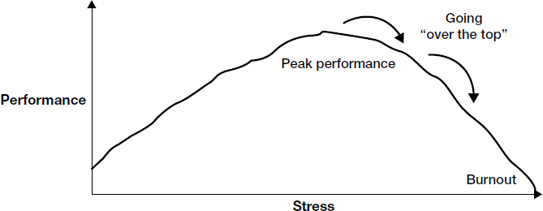

# Chapter 9: Manage Yourself

> *"The life of a leader is always a balancing act, but never more so than during a transition. The uncertainty and ambiguity can be crippling."*

Transitions amplify your weaknesses. The uncertainty, the lack of established relationships, the personal disruption (especially if relocation is involved) -- all of it compounds. You don't yet have a support network. You haven't built the routines that keep you grounded. You're expected to project confidence and create positive change while privately navigating unfamiliar terrain.

This chapter reframes self-management not as "soft" personal wellness advice but as a structural prerequisite for success. If you go over the top of your stress curve, you enter a vicious cycle: underperformance creates more stress, which drives further underperformance. The antidote is deliberate construction of three pillars: applying the 90-day strategies (previous chapters), developing personal disciplines, and building support systems.

Critical insight for your transition: Moving from a large enterprise (where infrastructure, relationships, and processes already exist) to a growth-stage company (where you must build all of those) means you are simultaneously doing the hardest work of your career AND operating with the fewest personal supports. This is the chapter that prevents the wheels from coming off.

## Table of Contents

- [Case Study: Stephen Erikson](#case-study-stephen-erikson)
- [Taking Stock: Structured Self-Reflection](#taking-stock-structured-self-reflection)
- [The Yerkes-Dodson Stress Curve](#the-yerkes-dodson-stress-curve)
- [Four Dysfunctional Patterns](#four-dysfunctional-patterns)
- [The Three Pillars of Self-Management](#the-three-pillars-of-self-management)
- [Pillar 1: Apply 90-Day Strategies](#pillar-1-apply-90-day-strategies)
- [Pillar 2: Develop Personal Disciplines](#pillar-2-develop-personal-disciplines)
- [Pillar 3: Build Your Support Systems](#pillar-3-build-your-support-systems)
- [The Advice-and-Counsel Network](#the-advice-and-counsel-network)

**Block types:** [Core Framework] [Case Study] [Checklist] [Trap/Anti-Pattern] [SRE/Platform Leader Lens] [Questions to Ask] [Real-World Application]

---

## Case Study: Stephen Erikson

> **[Case Study: Stephen Erikson -- When Personal and Professional Transitions Collide]**
>
> **Context:** After six successful years at a large media company's New York office, Stephen was promoted to a senior position at the firm's Canadian unit. Expected a smooth transition -- "Canadians and Americans are pretty much alike." Moved immediately; wife Irene (freelance interior designer) stayed behind to sell their apartment and prepare their two children (ages 12 and 9) for a mid-year school change.
>
> **What went wrong (cascading failures):**
> 1. **Cultural mismatch unrecognized** -- Stephen's lifelong New Yorker bluntness clashed with his Canadian colleagues' communication style. He found them "irritatingly polite" and couldn't find his usual go-to people. (He diagnosed the WRONG problem: "they won't engage." Real problem: HE hadn't adapted.)
> 2. **Family transition deferred, not managed** -- Children were unhappy about moving. Irene couldn't find acceptable schools. They decided to leave kids in New York until end of school year.
> 3. **Vicious cycle established** -- Stephen commuted Toronto/NY. Weekends were stressful. He arrived Mondays tired and unfocused. Work performance suffered. Increased stress. Further performance decline.
> 4. **Forced a decision too late** -- When he finally pushed Irene to commit to the move, it produced "the worst fight of their marriage." He ultimately told the firm he needed to return to New York or quit.
>
> **Key lessons:**
> - Professional transitions and personal transitions are not separate problems -- they are coupled systems. Failure in one propagates to the other.
> - "Diving in with his usual energy" is NOT a strategy. Energy without adaptation is just faster failure.
> - The absence of a support network (no go-to people, no cultural interpreters, family far away) left him isolated and without feedback loops.
> - He never built the local infrastructure (routines, relationships, community) that would have stabilized him.

> **[SRE/Platform Leader Lens: Your Version of Stephen's Story]**
>
> You probably aren't relocating physically, but you ARE relocating professionally. The enterprise-to-growth-stage move creates analogous disruptions:
>
> | Stephen's problem | Your equivalent |
> |-------------------|----------------|
> | Cultural mismatch (NY bluntness vs. Canadian politeness) | Enterprise formality vs. startup speed. Your instinct to build consensus/process may feel "slow" to the team. Their directness may feel disrespectful to you. |
> | Loss of go-to people | You had a network of peers, mentors, and trusted engineers built over years. At the new company, you start from zero. |
> | Family strain from transition | Even without relocation: longer hours during ramp-up, mental preoccupation, reduced presence at home. Your partner and family feel the transition too. |
> | Vicious cycle (stress -> underperformance -> more stress) | Taking on too much too fast at a growth company, feeling overwhelmed, then making worse decisions because you're exhausted. |
>
> **The meta-lesson:** You cannot outwork a structural problem. Stephen worked HARD. That wasn't the issue. He needed to work DIFFERENTLY -- adapt his style, build local support, manage the family transition as deliberately as the professional one.

---

## Taking Stock: Structured Self-Reflection

> **[Core Framework: Guidelines for Structured Reflection]**
>
> Watkins provides a self-assessment framework to use periodically during your transition. The three domains:
>
> **How Do You Feel So Far?** (Emotional temperature check)
> - Excited? If not, why not? What can you do about it?
> - Confident? If not, why not? What can you do about it?
> - In control of your success? If not, why not? What can you do about it?
>
> **What Has Bothered You So Far?** (Signal detection)
> - With whom have you failed to connect? Why?
> - Which meeting has been most troubling? Why?
> - Of all you've seen or heard, what has disturbed you most? Why?
>
> **What Has Gone Well or Poorly?** (Performance calibration)
> - Which interactions would you handle differently? Which exceeded expectations?
> - Which decisions turned out well? Not so well? Why?
> - What missed opportunities do you regret? Was the blocker you, or something beyond your control?
>
> **The honest question:** Are your difficulties situational, or do their sources lie within you? Experienced leaders often blame the situation rather than examining their own contribution to problems.

> **[SRE/Platform Leader Lens: Adapting the Reflection Framework]**
>
> Do this weekly for your first 90 days. Literally put 15 minutes on your calendar every Friday. Specific prompts for your context:
>
> | Reflection area | Platform leader-specific questions |
> |----------------|----------------------------------|
> | **Emotional state** | Am I energized by the problems here, or overwhelmed? Am I excited about building, or anxious about gaps? |
> | **Connection failures** | Which engineering lead or product manager have I NOT connected with yet? Is there a peer who seems cold or guarded? What might that signal? |
> | **Troubling meetings** | Was there a meeting where I talked too much? Where I proposed a solution before understanding the local context? Where someone pushed back and I didn't understand why? |
> | **Decision quality** | Did I make any commitments this week I'll regret? Did I say "yes" to a project or timeline without enough information? |
> | **Source of difficulty** | Am I struggling because this company genuinely has hard problems, or because I'm applying enterprise patterns to a growth-stage context? |

---

## The Yerkes-Dodson Stress Curve

> **[Core Framework: The Stress-Performance Relationship]**
>
> 
> *Figure 9-1. The Yerkes-Dodson curve. Performance improves with increasing stress up to a peak, then degrades. Going "over the top" creates a vicious cycle: underperformance generates additional stress, which further reduces performance. Rarely, this reaches burnout. More commonly, it produces chronic underperformance -- working harder while achieving less.*
>
> **Key dynamics:**
>
> - **Too little stress** = no motivation, no urgency. You stay in bed. (Not your problem during a transition.)
> - **Optimal stress** = productive pressure. You're stretched but performing well. Challenges feel energizing.
> - **Going over the top** = demands exceed capacity. You juggle too many balls or carry too heavy an emotional load. Performance begins to degrade.
> - **The vicious cycle** = degraded performance creates MORE stress (you're behind, people notice, you worry more), which further degrades performance. This is NOT a "bad week" -- it's a self-reinforcing spiral.
> - **Burnout** = the extreme endpoint. Rare, but the chronic underperformance zone is NOT rare. This is what happened to Stephen: working harder, achieving less.
>
> **Critical insight:** The vicious cycle is invisible from inside. You experience it as "I just need to work harder/longer." The correct response is the OPPOSITE: reduce load, restore capacity, rebuild from a sustainable base.

> **[SRE/Platform Leader Lens: Recognizing Your Stress Curve in Real Time]**
>
> **Signals you're approaching the top of the curve:**
> - You're in back-to-back meetings all day with no time to think
> - You're catching up on Slack/email at 10pm because the day was consumed by reactive work
> - You can't remember what your strategic priorities are because everything feels urgent
> - You're irritable in meetings -- shorter with people than you intend to be
> - Decisions feel harder than they should. Simple choices paralyze you.
> - You're skipping exercise, eating poorly, sleeping badly
>
> **Signals you've gone OVER the top:**
> - You dread Monday mornings
> - You're avoiding a hard conversation you know you need to have (work avoidance)
> - You've stopped your weekly reflection practice because "there's no time"
> - Your partner/family is commenting on your mood or absence
> - You're making commitments you know are unrealistic because saying "no" feels harder than failing later
>
> **The Platform Leader trap:** At a growth-stage company, there is ALWAYS more to do than capacity allows. The system will absorb everything you give it and ask for more. Unlike enterprise (where bureaucracy provides some natural pacing), growth-stage companies have no governor on your engine. YOU must be the governor.

---

## Four Dysfunctional Patterns

> **[Trap/Anti-Pattern: Four Vulnerabilities That Transitions Amplify]**
>
> Watkins identifies four patterns that are manageable under normal conditions but become dangerous during transitions because you lack the support systems and routines that normally keep them in check:
>
> **1. Undefended Boundaries**
> - **What it looks like:** You fail to establish limits on what you're willing to do. Bosses, peers, and reports take whatever you give. The more you give, the less they respect you, the more they ask. Eventually: anger and resentment at being "nibbled to death."
> - **The vicious cycle:** Saying yes to everything -> overload -> poor quality -> people route more work to you (since you always say yes) -> further overload.
> - **The fix:** "If you cannot establish boundaries for yourself, you cannot expect others to do it for you."
>
> **2. Brittleness (rigidity under uncertainty)**
> - **What it looks like:** The uncertainty of transition exacerbates your need for control. You overcommit to failing courses of action because admitting error feels like losing credibility. You decide YOUR way is the ONLY way, disempowering people with valid alternatives.
> - **The vicious cycle:** Premature decision -> inability to reverse -> escalating commitment to failing approach -> worse outcomes -> more defensiveness.
> - **The fix:** Deliberately build in decision review points. Separate "I'm exploring this direction" from "I'm committed to this direction." Give yourself permission to change course.
>
> **3. Isolation**
> - **What it looks like:** You end up disconnected from the people who make things happen and from the informal information flow. It creeps up on you -- you rely on a few people or official channels, you inadvertently discourage bad news, or people perceive you as captured by one faction.
> - **The vicious cycle:** Isolation -> uninformed decisions -> damaged credibility -> people trust you less -> share less information -> deeper isolation.
> - **The fix:** Deliberately diversify your information sources. Actively seek out dissenting views. Build multiple pathways to ground truth.
>
> **4. Work Avoidance**
> - **What it looks like:** Tough calls are needed (personnel, strategic direction, resource allocation) but you defer them by burying yourself in other work or convincing yourself "the time isn't ripe." The leadership literature calls this "work avoidance" -- the tendency to avoid grasping the bull by the horns.
> - **The vicious cycle:** Deferred tough call -> problem worsens -> tougher call needed -> more avoidance -> much bigger problem.
> - **The fix:** Name the call you're avoiding. Set a deadline. Get counsel from your advice network. Then decide.

> **[SRE/Platform Leader Lens: Which Patterns Will Get YOU?]**
>
> Based on your profile (enterprise background, takes things at face value, moving to growth-stage):
>
> | Pattern | Your specific risk | Why |
> |---------|-------------------|-----|
> | **Undefended boundaries** | HIGH | Growth-stage companies have infinite demand. As the "experienced enterprise person," everyone will want your input on everything. You'll feel obligated to help because you CAN help. Without boundaries, you'll be spread across 15 things and own none. |
> | **Brittleness** | MEDIUM | You have strong opinions built from enterprise experience. Some won't apply at growth-stage. The risk: doubling down on an enterprise approach when the team pushes back, because changing your mind feels like admitting you don't know the new context. |
> | **Isolation** | HIGH | You don't have existing relationships. You may default to spending time with your boss and your directs, missing the informal network where real information flows. Also: if you're the most senior SRE leader, there may be no peer at your level who "gets" your domain. |
> | **Work avoidance** | MEDIUM-HIGH | You'll discover team members who aren't performing or cultural problems inherited from the previous structure. Making personnel/organizational calls at a new company where you don't yet feel politically grounded is anxiety-inducing. Easy to defer "until I know more." |
>
> **Highest priority to address:** Isolation and undefended boundaries. These two feed each other -- isolation means you don't know what's reasonable to take on, and lack of boundaries means you're too busy to build relationships.

> **[Questions to Ask: Detecting Your Own Dysfunction]**
>
> Ask yourself these weekly. Better yet, ask a trusted peer or your coach:
>
> 1. "What am I saying yes to that I should be saying no to?" (Boundaries)
> 2. "Where am I stuck on a position I took early? Is it still right, or am I defending it out of ego?" (Brittleness)
> 3. "Who HAVEN'T I talked to this week that I should have? Am I getting information from only one or two channels?" (Isolation)
> 4. "What hard decision am I deferring? What's the real reason I haven't made it yet?" (Work avoidance)
> 5. "If I described my current week to a trusted mentor, what would they tell me to STOP doing?"

---

## The Three Pillars of Self-Management

> **[Core Framework: Three Pillars of Self-Efficacy]**
>
> Watkins structures self-management around three mutually reinforcing pillars:
>
> | Pillar | What it provides | Without it |
> |--------|-----------------|-----------|
> | **1. Apply 90-day strategies** (previous chapters) | Structure, direction, confidence from early successes | You're improvising. No framework means no way to diagnose what's going wrong. |
> | **2. Personal disciplines** | Daily/weekly routines that keep you productive and grounded | The urgent crowds out the important. You drift. Small bad choices accumulate. |
> | **3. Support systems** | People who help you maintain perspective, stay connected, and manage stress | You're isolated. No feedback loops. Stress compounds unchecked. |
>
> These are mutually reinforcing: strategies give you confidence, which makes disciplines easier to maintain, which frees mental space to invest in relationships, which provides information that improves your strategy.
>
> **They also fail together:** If you abandon your disciplines (stop planning, stop reflecting), you make worse strategic choices, which erodes confidence, which makes you withdraw from relationships, which isolates you, which... vicious cycle.

---

## Pillar 1: Apply 90-Day Strategies

> **[Core Framework: The Core Challenges Assessment]**
>
> Watkins provides a diagnostic table linking each chapter's core challenge to a self-assessment question. Use this to identify where you're stuck:
>
> | Core challenge | Diagnostic question |
> |----------------|-------------------|
> | Prepare yourself (Ch 1) | Are you adopting the right mindset for your new job and letting go of the past? |
> | Accelerate your learning (Ch 2) | Are you figuring out what to learn, from whom, and how to speed the process? |
> | Match strategy to situation (Ch 3) | Are you diagnosing the type of transition and its implications for action? |
> | Negotiate success (Ch 4) | Are you building your relationship with your boss and marshaling resources? |
> | Secure early wins (Ch 5) | Are you focusing on priorities that advance long-term goals AND build short-term momentum? |
> | Achieve alignment (Ch 6) | Are you identifying and fixing misalignments of strategy, structure, systems, and skills? |
> | Build your team (Ch 7) | Are you assessing, restructuring, and aligning your team? |
> | Create alliances (Ch 8) | Are you building internal and external support so you're not pushing rocks uphill? |
>
> **How to use:** At weeks 2, 4, 8, and 12, scan this table. Rate yourself honestly (green/yellow/red) on each. Where you're red, revisit that chapter's frameworks. Where you're yellow, identify one specific action for the coming week.

---

## Pillar 2: Develop Personal Disciplines

> **[Core Framework: Six Personal Disciplines for Transition]**
>
> Personal disciplines are routines you enforce on yourself ruthlessly. They are the daily/weekly practices that prevent drift and keep you on the productive side of the stress curve.
>
> **1. Plan to Plan**
> Devote time daily and weekly to a plan-work-evaluate cycle. At the end of each day, spend 10 minutes evaluating how well you met your goals and planning for the next day. Same at end of each week. Even when you fall behind, you'll be more in control because you KNOW what you're behind on.
>
> **2. Focus on the Important**
> The urgent crowds out the important every single day. Phone calls, meetings, Slack messages -- they consume the day and you never focus on medium or long-term work. Discipline: set aside a specific time each day (even 30 minutes) when you close the door, turn off notifications, and focus on your most important strategic work.
>
> **3. Judiciously Defer Commitment**
> Do you say yes on the spot and regret it later? Discipline: whenever anyone asks you to do something, respond "Sounds interesting. Let me think about it and get back to you." Never say yes immediately. If pressed: "If you need an answer now, I'll have to say no. But if you can wait, I'll give it thought." Begin with no -- it's easy to say yes later. It's damaging to say yes and then reverse.
>
> **4. Go to the Balcony**
> When caught in emotional escalation (a heated meeting, a difficult conversation, a crisis), discipline yourself to mentally step back to "fifty thousand feet." Observe the dynamics rather than being consumed by them. This is a skill from negotiation and leadership literature -- it can be cultivated with practice.
>
> **5. Check In with Yourself**
> Engage in structured reflection about your situation regularly. For some: jotting thoughts at end of each day. For others: weekly self-assessment. Find an approach that fits your style and ENFORCE it. Translate insights into action.
>
> **6. Recognize When to Quit**
> Transitions are marathons, not sprints. When you're going over the top of your stress curve, discipline yourself to STOP. One more hour past the point of diminishing returns may help short-term but costs steeply long-term. Learn to recognize your personal signals of diminishing returns and take a break.

> **[SRE/Platform Leader Lens: Making These Disciplines Concrete]**
>
> Abstract disciplines fail. Here's what each one looks like in practice for a Senior Director at a growth-stage company:
>
> | Discipline | Concrete implementation |
> |-----------|----------------------|
> | **Plan to Plan** | Friday 4pm: 30-min block. Review week. What progressed? What didn't? Write 3 priorities for next week. Monday 8am: 15-min block. Plan the day against weekly priorities. |
> | **Focus on the Important** | Block 2 hours Tuesday and Thursday mornings as "strategic time." No meetings, no Slack. Use for: writing your platform strategy, reviewing architecture proposals, preparing for your boss conversation. Defend this time ruthlessly. |
> | **Defer Commitment** | Default response to new requests: "Let me look at my priorities and get back to you by [specific day]." In meetings where action items are being assigned: "I want to make sure I can deliver before committing." |
> | **Go to the Balcony** | During a heated incident retrospective or a contentious architecture debate, pause. Ask yourself: "What's the real issue here? Is this about the technical question, or is something else driving the emotion?" Buy time: "Let me think about this and come back to you." |
> | **Check In with Yourself** | Friday evening (or Saturday morning): 10 minutes with a journal or voice memo. How do I feel? What's draining me? What's energizing me? Am I on the right side of my stress curve? |
> | **Recognize When to Quit** | Hard rule: no work email/Slack after 9pm during first 90 days. If you catch yourself grinding at 10pm, STOP. The decision you make at 10pm exhausted will be worse than the one you make at 8am rested. |
>
> **The meta-discipline:** Put these IN YOUR CALENDAR as recurring events. If they're not scheduled, they won't happen. Treat them as seriously as your 1:1 with your boss.

> **[Trap/Anti-Pattern: "I Don't Have Time for Disciplines"]**
>
> The deadliest trap: "I'm too busy to plan/reflect/take breaks." This is exactly the vicious cycle the chapter warns about. You're too busy BECAUSE you're not planning. You're making bad decisions BECAUSE you're not reflecting. You're exhausted BECAUSE you're not taking breaks. The disciplines are not overhead -- they are the mechanism by which you stay on the productive side of the stress curve.
>
> **The enterprise-to-growth-stage version:** At your previous company, there was probably organizational scaffolding that enforced some of these disciplines -- structured planning cycles, quarterly reviews, forced vacation policies. At a growth-stage company, that scaffolding doesn't exist. YOU must provide it for yourself. Nobody will tell you to slow down. Nobody will force you to plan. Nobody will insist you take a break. That makes personal discipline not optional but survival-critical.

---

## Pillar 3: Build Your Support Systems

> **[Core Framework: Three Dimensions of Support]**
>
> The third pillar has three components:
>
> **1. Assert Control Locally** (your immediate work environment)
> It's hard to focus if basic infrastructure isn't in place. Move quickly to: set up your office/workspace, develop daily routines, clarify expectations with your assistant or chief of staff (if you have one), establish your calendar structure. If permanent systems aren't ready, assemble TEMPORARY resources to tide you over.
>
> **2. Stabilize the Home Front** (your family and personal life)
> "It's a fundamental rule of warfare to avoid fighting on too many fronts." You cannot create value at work if you're destroying value at home. Professional transition stress amplifies personal transition stress and vice versa -- they are coupled systems (as Stephen learned).
>
> **3. Build Your Advice-and-Counsel Network** (your professional support system)
> No leader, no matter how capable, can do it all alone. You need trusted advisers within and outside the organization. This network prevents isolation, provides perspective, and gives you safe spaces to think aloud.

> **[SRE/Platform Leader Lens: Stabilizing YOUR Home Front]**
>
> Even without relocation, a Senior Director transition at a growth-stage company impacts your family:
>
> - **First 90 days = high intensity.** You'll be mentally consumed. Your partner/family will feel it.
> - **Proactive conversation:** Have an explicit discussion with your partner BEFORE day 1. "The next 90 days will be intense. Here's what I'm committing to protect: [specific family rituals, specific time blocks]. Here's where I'll need grace: [specific areas where you'll be less present]."
> - **Non-negotiable anchors:** Pick 2-3 family rituals that are INVIOLABLE during transition. Dinner together 3 nights/week. Saturday mornings. Whatever matters to your family. Put them in your calendar as hard blocks.
> - **Check-in cadence:** Monthly explicit conversation with your partner: "How is my transition affecting us? What do you need from me?"
>
> **Why this matters for work performance:** If your home life is unstable, you carry that emotional load into every meeting, every decision, every interaction. Stabilizing the home front IS work performance management.

---

## The Advice-and-Counsel Network

> **[Core Framework: Three Types of Advisers]**
>
> Watkins identifies three distinct roles your advisory network must fill:
>
> | Type | Role | How they help you |
> |------|------|-------------------|
> | **Technical advisers** | Provide expert analysis of technologies, markets, and strategy | Suggest applications for new approaches. Interpret technical data. Provide timely, accurate information about domain-specific questions. |
> | **Cultural interpreters** | Help you understand the new culture and adapt to it | Provide insight into cultural norms, mental models, and guiding assumptions. Help you learn to "speak the language" of the new organization. Decode what people MEAN vs. what they SAY. |
> | **Political counselors** | Help you navigate political relationships within your new organization | Help you implement your agenda. Serve as sounding board for political options. Challenge with "what-if" questions about how people will react to your moves. |
>
> **Critical distinction: Internal vs. External advisers**
>
> | | Strengths | Limitations |
> |-|-----------|------------|
> | **Internal advisers** | Know the organization, its culture and politics. Can tell you what's really going on. | Cannot be expected to give dispassionate or disinterested views. May have their own agendas. |
> | **External advisers** | Provide dispassionate perspective. Loyal to YOU, not the organization. Can tell you hard truths. | Don't know the internal context. May give advice based on their own (different) organizational experience. |
>
> **You need BOTH.** Internal advisers for ground truth about what's happening. External advisers for perspective and honest feedback.

> **[Core Framework: Advice-and-Counsel Network Assessment Matrix]**
>
> Use this matrix to map your current network and identify gaps:
>
> |  | Technical advisers | Cultural interpreters | Political counselors |
> |--|-------------------|---------------------|---------------------|
> | **Internal** (inside your new organization) | Who? | Who? | Who? |
> | **External** (outside your new organization) | Who? | Who? | Who? |
>
> **Assessment questions:**
> - Do you have the right MIX of technical, cultural, and political advisers?
> - Do you have the right MIX of internal and external?
> - Are your external supporters loyal to you personally, not to the organization?
> - Are your internal advisers trustworthy? Do their agendas conflict with yours?
> - Do you have representatives of KEY CONSTITUENCIES (not just one or two viewpoints)?
>
> **Forward-looking:** As you attain higher levels of responsibility, the need for good POLITICAL counsel increases dramatically. Most leaders underinvest in political counselors because political thinking doesn't come naturally to them.

> **[SRE/Platform Leader Lens: Building Your Network at the New Company]**
>
> **Your biggest gap will be: political counselors.** Here's why:
> - Technical advisers: You can find these easily (your engineering peers, your former enterprise colleagues, industry contacts).
> - Cultural interpreters: Harder but identifiable -- find the person who's been at the company 3+ years and is known for being candid. Often an engineering manager or a long-tenured IC.
> - Political counselors: This is where you're most vulnerable. You take things at face value. You need someone who can tell you "when VP-X said 'interesting idea,' they meant 'over my dead body'" or "that peer who seems friendly is actually competing with you for budget."
>
> **Concrete actions for your first 30 days:**
>
> | Network role | Who to look for | How to find them |
> |-------------|----------------|-----------------|
> | **Technical adviser (internal)** | The most senior IC or architect who's been there longest. The person everyone goes to for "how does this system actually work?" | Ask your directs: "Who's the person I should talk to if I want to understand how X really works?" |
> | **Technical adviser (external)** | A former peer from your enterprise role. An industry contact who's done the growth-stage transition before you. | Maintain 1-2 monthly check-ins with trusted former colleagues. |
> | **Cultural interpreter** | Someone who's navigated this company successfully for 2+ years. Ideally at your level or one level below. Known for being honest. | Ask your boss: "Who really understands how things work around here? Someone I could learn from?" Also: your HR Business Partner, if they're good. |
> | **Political counselor (internal)** | Someone with political savvy who has your best interests in mind. Perhaps your boss (if your relationship allows for candid political discussion). Perhaps a senior peer who's been through company changes. | This is the hardest to find. Start by asking your boss political questions: "How would people react if I proposed X?" Pay attention to who gives you the most nuanced answers. |
> | **Political counselor (external)** | A former boss, a mentor, an executive coach. Someone who understands organizational power dynamics and can help you decode what you're seeing. | If your company offers executive coaching, TAKE IT. If not, invest personally. The ROI on a good coach during transition is enormous. |

> **[Questions to Ask: Building Your Network]**
>
> Ask these of your boss, your HR partner, and any friendly peers in your first two weeks:
>
> 1. "Who are the informal influencers here -- the people whose opinions carry weight beyond their title?"
> 2. "Who's been here the longest and really understands the culture? I'd love an introduction."
> 3. "Is there anyone who's made a similar transition (from enterprise to here) successfully? I'd value their perspective."
> 4. "What's the best way to build relationships here -- is it hallway conversations, scheduled coffee chats, team events, Slack?"
> 5. "Are there any relationship dynamics I should be aware of before I start making changes?"
>
> **The question beneath the questions:** You're probing for who can fill the three adviser roles. But you're also signaling humility, curiosity, and willingness to learn -- which itself builds credibility (Ch 5).

> **[Trap/Anti-Pattern: The "I'll Figure It Out Myself" Trap]**
>
> **What it looks like:** You came from enterprise. You've been a senior leader for years. You feel like asking for help signals weakness or incompetence. So you don't ask. You try to decode the culture alone. You try to navigate politics alone. You make avoidable mistakes because you didn't have someone to warn you.
>
> **Why it's especially dangerous for you:** You take things at face value (by your own acknowledgment). This means the political and cultural signals that other leaders pick up intuitively -- you miss. A political counselor doesn't make you weak; they give you the pattern-recognition capability you need. Think of it like monitoring: you wouldn't run production without observability. Don't run your career transition without it either.
>
> **Reframe:** Building a support network is not a sign of weakness. It's a sign of strategic maturity. The most effective leaders at every level have extensive advisory networks. The difference between a leader who thrives and one who struggles is often not capability -- it's the quality of their information and counsel.

---

> **[Real-World Application: Your First-Week Self-Management Setup]**
>
> Actions to take BEFORE or during your first week:
>
> 1. **Calendar structure:** Block your strategic focus time, your planning time, your family anchors. Do this BEFORE the calendar fills with meetings.
> 2. **Identify adviser candidates:** List 2-3 people in each network category you want to pursue. Schedule introductory conversations.
> 3. **Home conversation:** Have the explicit "here's what the next 90 days will look like and here's what I'm protecting" discussion with your partner.
> 4. **Workspace setup:** Even if it feels trivial, get your physical/digital workspace functional immediately. Friction in basic logistics drains cognitive capacity you need for strategic thinking.
> 5. **Discipline commitment:** Pick your top 3 personal disciplines (from the six). Write them down. Put them in your calendar. Tell someone what they are (accountability).
> 6. **Stress baseline:** Note how you feel RIGHT NOW (excited? anxious? energized? overwhelmed?). This is your baseline. When you check in weekly, you'll be able to detect drift toward the top of your stress curve.

---

> **[2025 Context: Self-Management in Remote/Hybrid Leadership]**
>
> Watkins wrote for a world of office-based leadership. Remote adds specific self-management challenges:
>
> | Challenge | Why it's harder remote | Mitigation |
> |-----------|----------------------|------------|
> | **Boundaries** | Work is always 10 steps away. No commute = no natural off-switch. "Just one more email" at 10pm. | Hard calendar boundaries. Physical workspace separation (even if it's closing a laptop lid). Tell your team your working hours explicitly. |
> | **Isolation** | No hallway chats, no lunch with peers, no spontaneous "how are you?" from a colleague who notices you look tired | SCHEDULE informal time. Weekly coffee chats with peers (no agenda). Monthly external mentor calls. Without deliberate effort, isolation creeps up unnoticed. |
> | **Energy management** | Back-to-back video calls are uniquely draining (Zoom fatigue is neuroscientifically real — your brain works harder to read social cues on a screen) | Block 10-min gaps between meetings. Camera-off for internal meetings when possible. Walking 1:1s (phone only) for relationship conversations. |
> | **Feedback vacuum** | In person, you get micro-feedback constantly (facial expressions, tone shifts, body language). Remote = less signal about how you're perceived | Ask for explicit feedback more often: "How did that meeting land?" "Was my message clear?" Don't assume silence = approval. |
> | **Imposter syndrome amplification** | You can't SEE others struggling. Everyone LOOKS composed on video. You feel like you're the only one uncertain. | Name it to a trusted adviser. "I'm feeling uncertain about X — is that normal at this stage?" Almost always: yes, it is. |
>
> **The compound stress of your specific transition:**
> You're simultaneously: learning a new level (director scope), learning a new domain (IGA), learning a new culture (growth-stage company), learning new relationships (everyone), AND doing all of this potentially remote/hybrid. This is an extraordinary cognitive load. Give yourself permission to feel overwhelmed — and build recovery into your schedule deliberately.

> **[Comparison: Neff & Citrin — "Protect Your Energy for Decisions That Matter"]**
>
> Neff observes that senior leaders' most important asset is judgment quality — which degrades when they're exhausted, stressed, or isolated. His advice:
>
> **"Not every decision deserves your best thinking."** Develop a hierarchy: (1) decisions that are irreversible and high-stakes → give these your BEST energy, schedule them for when you're sharpest; (2) decisions that are reversible or low-stakes → decide quickly, don't agonize, save cognitive capacity; (3) decisions others can make → delegate completely.
>
> **"Your first big mistake will come from fatigue, not incompetence."** New leaders in transition work unsustainably long hours because they're anxious. The first major mistake usually happens at week 6-8 when accumulated fatigue finally degrades judgment. By then you've been running too hard to notice the degradation. Build PREVENTIVE rest, not reactive recovery.
>
> **For your transition specifically:** The temptation will be to work 70-hour weeks to "prove yourself" at the new level in the new company. Resist. Sustainable performance at 50 hours beats 3 weeks of 70 followed by a bad decision that takes 2 months to recover from.

> **[Checklist: Manage Yourself]**
>
> 1. What are your greatest vulnerabilities in your new role? How do you plan to compensate for them?
> 2. What personal disciplines do you most need to develop or enhance? How will you do that? What will success look like?
> 3. What can you do to gain more control over your local environment?
> 4. What can you do to ease your family's transition? What support relationships will you have to build? Which are your highest priorities?
> 5. What are your priorities for strengthening your advice-and-counsel network? To what extent do you need to focus on your internal network? Your external network? In which domain do you most need additional support -- technical, cultural, political, or personal?
> 6. Where are you on the Yerkes-Dodson curve RIGHT NOW? What signals will tell you that you're approaching the top?
> 7. Which of the four dysfunctional patterns (undefended boundaries, brittleness, isolation, work avoidance) are you most susceptible to? What specific actions will you take to prevent them?
