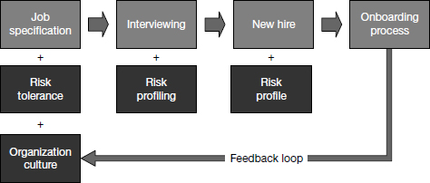

# Chapter 10: Accelerate Everyone

> *"Every failed transition -- whether outright derailment or less dramatic underperformance -- exacts costs from the organization as well. The magnitude of these costs is such that a state-of-the-art transition acceleration system can reduce enterprise risk, create competitive advantage, and speed up change implementation."*

This chapter shifts perspective from the individual leader to the organization. The argument: transition acceleration shouldn't be ad-hoc heroics by individual leaders applying a book's advice -- it should be a systematized organizational capability. Companies that build transition acceleration systems reduce enterprise risk, create competitive advantage (faster ramp = more nimble organization), and accelerate change implementation (every restructuring or acquisition is really a cascade of individual transitions).

Why this matters for YOU: As a Senior Director, you are both a consumer of transition support (your own transition) AND a provider of it (for your directs, your team, your hires). This chapter gives you the framework to think about transition acceleration as a platform-level concern -- something you design, systematize, and scale across your organization.

The chapter is less about personal action and more about organizational design. It provides ten principles for building acceleration systems. Below, the notes focus on the principles most relevant to a platform/SRE leader building a team.

## Table of Contents

- [The Business Case for Systematic Acceleration](#the-business-case-for-systematic-acceleration)
- [Principle 1: Identify Critical Transitions](#principle-1-identify-critical-transitions)
- [Principle 2: Identify Set-Up-to-Fail Dynamics](#principle-2-identify-set-up-to-fail-dynamics)
- [Principle 3: Diagnose Existing Support](#principle-3-diagnose-existing-support)
- [Principle 4: Adopt a Common Core Model](#principle-4-adopt-a-common-core-model)
- [Principle 5: Deliver Support Just in Time](#principle-5-deliver-support-just-in-time)
- [Principle 6: Use Structured Processes](#principle-6-use-structured-processes)
- [Principle 7: Match Support to Transition Type](#principle-7-match-support-to-transition-type)
- [Principle 8: Match Support to Leader Level](#principle-8-match-support-to-leader-level)
- [Principle 9: Clarify Roles and Align Incentives](#principle-9-clarify-roles-and-align-incentives)
- [Principle 10: Integrate with Talent Management](#principle-10-integrate-with-talent-management)
- [Putting It All Together](#putting-it-all-together)

**Block types:** [Core Framework] [Case Study] [Checklist] [Trap/Anti-Pattern] [SRE/Platform Leader Lens] [Questions to Ask] [Real-World Application]

---

## The Business Case for Systematic Acceleration

> **[Core Framework: Three Strategic Arguments for Acceleration Systems]**
>
> Watkins frames the organizational case around three arguments. Each represents a different lens through which executives can justify investment:
>
> | Argument | Logic | Example impact |
> |----------|-------|---------------|
> | **Enterprise risk management** | A single senior executive failure can cost hundreds of thousands in direct costs, plus lost opportunities and business damage. | "In one business, under a struggling new leader, growth slowed by half in one region... $7-8M impact." "A new product launch was delayed... impact could be $100M." |
> | **Performance improvement** | ~25% of leaders in Fortune 500 companies change jobs annually (~35% at top 3 tiers). Each transition impacts ~12 surrounding people. Accelerating ALL these transitions by even 10% compounds to massive organizational performance improvement. | If a leader reaches full contribution 40% faster, that's months of higher output across their team. Multiply by hundreds of transitions annually. |
> | **Change implementation** | Every major organizational change (restructuring, rapid growth, acquisition) is really a CASCADE of individual transitions. You can get the "hard side" right (structure, systems, staffing) but fail on the "soft side" (role clarity, relationship building, cultural adaptation). | "The soft side of change is the hard side." Post-acquisition integration fails when people can't establish roles, relationships, and decision rights. |
>
> **Independent research finding:** The 90-day framework can reduce time to break-even by up to 40%. A study of one program yielded 1,400% ROI on conservative salary assumptions.
>
> **The high-potential angle:** "Hi-potentials are a scarce resource, and we're tough on them. If they don't make it, you've washed out a hi-potential." Failed transitions don't just cost money -- they destroy talent pipeline.

> **[SRE/Platform Leader Lens: Why This Chapter Is About YOUR Team, Not Just the Company]**
>
> **Your immediate application:** You will be hiring. Growth-stage IGA company with a new Senior Director = you'll be building and reshaping a team. Every person you hire or promote is a transition that succeeds or fails. Every failed hire costs you:
>
> - 6-12 months of reduced team output during the failed person's tenure
> - Morale damage to the team that had to compensate
> - Another 3-6 months to recruit and ramp their replacement
> - YOUR credibility as a leader who "can't hire well"
>
> **The math for platform teams specifically:**
> - Platform/SRE engineers are scarce and expensive to recruit (3-6 month search typical)
> - The ramp time for platform engineers is LONG (understanding the full system takes months)
> - Each failed hire at the IC level costs ~1 year. At the manager level, ~1.5 years.
> - If you're building a team of 8-12, even ONE failed transition materially impacts your first-year results
>
> **Reframe this chapter as:** "How do I build onboarding and transition support as part of my platform team's operating system?" This isn't HR's job. This is YOUR job as a leader.

---

## Principle 1: Identify Critical Transitions

> **[Core Framework: The Transition Heat Map]**
>
> 
> *Figure 10-2. Linking recruiting and onboarding. Transition risk should be evaluated at every stage: job specification (risk tolerance), interviewing (risk profiling), new hire (risk profile), and onboarding process. A feedback loop from onboarding outcomes informs organization culture understanding, improving future risk tolerance decisions.*
>
> The starting point: understand how many transitions are occurring in your organization, what types they are, and focus on accelerating the most critical ones.
>
> **Data you need:**
> - How many people are being hired, promoted, moving between units, making lateral moves?
> - When are these transitions occurring? (You can't provide support if you don't know transitions are happening.)
> - What's the mix of onboarding vs. promotion vs. lateral moves?
>
> **The Transition Heat Map tool:**
>
> | Organizational unit | Major change events | Onboarding intensity | Promotion intensity | Geographic moves | Lateral moves |
> |--------------------|--------------------|---------------------|--------------------|-----------------|----|
> | Unit A | Rapid growth | High | Low | High | Medium |
> | Unit B | Turnaround | Medium | Low | Low | High |
> | Unit C | Acquisition | None | Low | Medium | High |
>
> **Rule of thumb:** Leaders at the frontline level should participate in transition support (workshop or equivalent) within their first 60 days. Use transition frequency data to plan where and when to offer this support.

> **[SRE/Platform Leader Lens: Your Team's Transition Map]**
>
> For your new team, build this picture in your first 30 days:
>
> | Question | Why it matters | How to find out |
> |----------|---------------|----------------|
> | How many open headcount do I have? | Each hire = a transition you'll need to support. | Ask your boss and HR. |
> | Who was recently promoted or moved into their role? | They may still be in THEIR transition. You arriving is another disruption for them. | Ask each direct: "When did you start in this role? How's it going?" |
> | Who's been here less than 6 months? | Still ramping. May not yet be at full productivity. Don't assess their performance as if they're fully ramped. | Team tenure data from HR or your manager tool. |
> | Is anyone about to be promoted? | A promotion is a transition. If you're changing the org structure, you may create several promotions simultaneously. | Discuss with your boss: pending promotions or role changes. |
> | Are there acquisition integrations underway or planned? | Each integration = many transitions simultaneously. | Ask about M&A pipeline in your first boss conversation. |
>
> **Your specific heat map (likely):**
>
> | Your org | Change event | Onboarding | Promotion | Lateral |
> |----------|-------------|-----------|-----------|---------|
> | SRE/Platform team | New leader (you) + likely restructuring | HIGH (you'll be hiring) | MEDIUM (you may promote existing strong performers) | LOW-MEDIUM |
>
> **Implication:** Your #1 transition support priority is onboarding -- both for yourself and for the people you'll hire in months 2-6. Build your onboarding system EARLY, even before you start hiring. It's much harder to build it while simultaneously onboarding three new people.

---

## Principle 2: Identify Set-Up-to-Fail Dynamics

> **[Core Framework: How Organizations Set Leaders Up to Fail]**
>
> Beyond individual mistakes (covered in earlier chapters), there are systematic organizational patterns that cause leaders to fail:
>
> **Problems that apply to ALL transitions:**
>
> | Organizational failure | What it looks like |
> |-----------------------|-------------------|
> | Insufficient clarity about expectations | Leaders aren't told clearly what success looks like, or they receive conflicting mandates from different stakeholders. |
> | Not matching STARS situation to person | Putting a turnaround specialist into a sustaining-success situation (or vice versa). The skills that made them successful previously don't match the current challenge. |
> | Pushing leaders to make leaps that are too big | Combining too many changes at once: new level + new function + new culture + new geography. Each additional variable compounds transition risk. |
> | Darwinian "sink or swim" culture | Company doesn't provide transition support because the culture reinforces a belief that "strong leaders figure it out on their own." |
>
> **Promotion-specific failures:**
> - Promoting people only because they're good at their CURRENT job (not evaluating ability at the next level)
> - Providing training too late or not at all
> - Requiring promoted leaders to keep doing their old job AND their new one (poor succession planning)
>
> **Onboarding-specific failures:**
> - Not considering cultural fit during recruiting (hiring for capability alone)
> - Not providing cultural adaptation support (expecting people to "figure out" the culture alone)
> - Not helping new hires identify and connect with key stakeholders

> **[SRE/Platform Leader Lens: Set-Up-to-Fail Patterns in Platform Teams]**
>
> **Patterns you'll encounter (and must avoid creating):**
>
> | Pattern | How it manifests in platform/SRE | What to do instead |
> |---------|----------------------------------|-------------------|
> | **Unclear expectations** | "Own reliability" without defining: which services? what SLO targets? what's your authority over product teams? | Negotiate explicit scope, authority, and success metrics with your boss BEFORE starting (Ch 4). Do the same for every person you hire. |
> | **STARS mismatch** | Hiring someone great at greenfield platform building when you actually need someone to stabilize and optimize an existing system (or vice versa). | Use STARS to characterize the specific challenge for each role, then hire/promote for THAT situation. |
> | **Leap too big** | Promoting a strong IC to manager of a team in crisis while also asking them to lead a platform migration. Two major challenges simultaneously. | Sequence the challenges. Stabilize first, then transform. Or provide intensive coaching for the combined leap. |
> | **Sink or swim** | Expecting a new SRE hire to "figure out" a complex distributed system, the on-call rotation, the team dynamics, AND the company culture simultaneously with no structured support. | Build explicit 30-60-90 day onboarding plans. Assign a buddy. Schedule checkpoints. |
> | **Doing old job + new job** | Promoting someone to lead but not backfilling their IC role. They're now managing AND being the primary on-call AND maintaining their old systems. | Plan succession BEFORE promoting. Even a temporary backfill or load reduction makes the difference between success and burnout. |
>
> **The meta-point:** If you set up your people to fail through these patterns, no amount of individual talent or effort will save them. Organizational design for transitions is a leadership responsibility.

> **[Questions to Ask: Are You Being Set Up to Fail?]**
>
> Ask these of YOURSELF about YOUR transition:
>
> 1. "Do I have explicit, written clarity on what success looks like at 90 days, 6 months, 1 year?" (If not, go back to Ch 4 and negotiate this with your boss.)
> 2. "Is the leap I'm making reasonable? Am I changing level + company + domain + culture all at once?" (If yes, ensure you have maximum support -- coach, extended ramp timeline, reduced initial scope.)
> 3. "Am I expected to 'figure it out' alone, or does this company invest in leader transitions?" (If sink-or-swim, build your own support structure -- it won't be provided.)
> 4. "Am I being asked to do my predecessor's job AND transform the function?" (If yes, negotiate: which comes first? What can be deferred?)
> 5. "Were the expectations that were communicated during recruiting the same as what my boss is saying now?" (Expectation gaps between recruiting and reality are one of the top derailment risks.)

---

## Principle 3: Diagnose Existing Support

> **[Core Framework: Assess Current State Before Building]**
>
> Before designing an acceleration system, assess what already exists. Most companies have a "patchwork quilt" of support -- one unit does onboarding well, another has executive coaching, a third has international move support. The assessment:
>
> 1. Identify existing acceleration frameworks and tools. What's been used? Why? How effective?
> 2. Examine delivery approaches (coaching, workshops, self-guided materials). What are the costs and benefits?
> 3. Assess overall coherence. Is there a common core model, or disconnected fragments?
> 4. Identify key stakeholders who do/could provide support (bosses, peers, HR, L&D).
> 5. Assess HR information systems. Can you tell WHERE and WHEN transitions are occurring?

> **[SRE/Platform Leader Lens: Diagnosing Your Team's Onboarding Status]**
>
> Apply this diagnostic to YOUR team immediately:
>
> | Question | What good looks like | What broken looks like |
> |----------|---------------------|----------------------|
> | Do we have a documented onboarding process for new SRE/platform engineers? | Written 30-60-90 plan, buddy system, checkpoint conversations, access runbook. | "Here's your laptop, Slack is over there, ask if you have questions." |
> | How long does it take a new hire to be productive (carry on-call, ship independently)? | 4-8 weeks for basic productivity, 3-4 months for full independence. | 6+ months before they can go on-call alone. No clear milestones. |
> | What's our retention rate for people in their first year? | >85% | <70% (people leaving before 12 months = onboarding failure, not hiring failure). |
> | Who's responsible for a new hire's success? | Clear: their manager, with buddy support and HR partnership. | Ambiguous. "The team" (meaning nobody specifically). |
> | Do we provide different support for different transition types? | Distinct paths for: new grad, experienced hire, internal promotion, lateral move. | One-size-fits-all (or nothing at all). |
>
> **Likely finding at a growth-stage company:** Support exists in fragments. Maybe there's a general company onboarding day. Maybe someone wrote a getting-started doc that's outdated. But there's probably no systematic, role-specific acceleration for platform engineers. This is a gap you can fill -- and it's also an early win (Ch 5) that serves long-term goals.

---

## Principle 4: Adopt a Common Core Model

> **[Core Framework: The Power of Shared Language]**
>
> The single most important step: adopt a unified, company-wide framework, language, and toolkit for talking about transitions. Watkins argues this is the highest-leverage investment because:
>
> 1. **Makes discussions dramatically more efficient.** When everyone knows what "STARS" means, what "the five conversations" are, what "early wins" means -- you skip the meta-conversation and go straight to substance.
> 2. **Causes conversations that wouldn't otherwise happen.** Shared language makes it SAFE to discuss transition challenges. "I'm in a realignment situation" is easier to say than "I'm struggling."
> 3. **Makes people more forthcoming.** Common models reduce shame and normalize the difficulty of transitions.
> 4. **Increases tolerance for transition struggles.** When the organization understands that ALL transitions have a performance dip, they're more patient with leaders who haven't reached peak performance yet.
>
> **What the common core enables people to discuss:**
> - Their STARS portfolio (the mix of situations they've inherited)
> - Their learning plan (technical, cultural, political)
> - Progress in the five conversations with boss and directs
> - Agreed priorities and early-win plans
> - The alliances they need to build

> **[SRE/Platform Leader Lens: Building Shared Transition Language for Your Team]**
>
> You don't need company-wide adoption to start. You can build shared language within YOUR organization:
>
> **Step 1: Introduce the vocabulary to your leadership team.** In your first month, share the STARS model and the 30-60-90 concept with your direct reports. Frame it as: "This is how I think about transitions. I'd like us to use this language when we're helping our people ramp up."
>
> **Step 2: Build it into your hiring process.** When you extend an offer, share a "here's how we'll support your transition" document that uses the framework language. Candidates will be impressed (few companies do this) and will arrive with shared expectations.
>
> **Step 3: Make it part of your 1:1s.** When a direct is struggling, use the diagnostic: "What's your STARS situation? Where are you in the five conversations with your team? What early win are you pursuing?" This teaches them the model through repeated use.
>
> **Why this matters at a growth-stage company:** Growth companies hire constantly. If you can systematize how transitions work in YOUR org, you become a model for the rest of the company. This is organizational leverage -- building a capability that scales beyond your direct attention.

---

## Principle 5: Deliver Support Just in Time

> **[Core Framework: Transition Support Must Match Transition Stage]**
>
> Transitions evolve through predictable stages, and support needs shift accordingly:
>
> | Stage | Leader's focus | Support needed |
> |-------|---------------|---------------|
> | **Pre-entry** (before day 1) | Initial learning, planning first days | Key documents, stakeholder connections, diagnostic tools, coach introduction |
> | **Early days** (weeks 1-4) | Intensive diagnostic work, relationship building | Learning acceleration, cultural interpretation, stakeholder mapping |
> | **Direction setting** (weeks 4-8) | Defining strategic direction (mission, goals, strategy) | Sounding board for strategy, feedback on direction, reality testing |
> | **Organization decisions** (weeks 6-12) | Structure, processes, talent, team decisions | Challenge on organizational design, help with people decisions |
> | **Driving change** (months 3-6) | Securing early wins, building momentum | Coalition-building support, feedback on how changes are landing |
>
> **Two critical principles:**
>
> 1. **Digestible blocks.** Once in role, leaders are immersed in the flow and can devote only limited time to structured learning/planning. Support must be brief, focused, and immediately applicable.
> 2. **Leverage pre-entry time.** The period between accepting the job and starting is PRICELESS. Leaders have mental bandwidth they'll never have again once the flow starts. Front-load learning into this period.

> **[SRE/Platform Leader Lens: Just-in-Time Support for Your Hires]**
>
> Design your team's onboarding to deliver the RIGHT support at the RIGHT time:
>
> | Timeline | What your new hire needs | What you provide |
> |----------|------------------------|-----------------|
> | **Pre-start** (offer to day 1) | Reduce anxiety. Begin learning. Feel welcomed. | Send: team overview doc, architecture diagrams, "here's what your first week looks like" note. Intro to buddy via email/chat. |
> | **Week 1** | Orient. Meet people. Understand the landscape. | Structured intro meetings (not random). Access setup. Architecture walkthrough. "Here's what you DON'T need to worry about yet." |
> | **Weeks 2-4** | Go deeper technically. Start contributing safely. | Paired work on low-risk tasks. Shadowing on-call. First incident observation (not ownership). Weekly check-in: "What's confusing? What do you need?" |
> | **Weeks 4-8** | Build independence. Take ownership of a defined scope. | First on-call rotation (with senior backup). Own a small project. Feedback on how they're doing. Adjust scope up or down based on progress. |
> | **Months 2-4** | Reach full contribution. Identify development areas. | Increasing scope. Regular 1:1 focused on growth, not just tasks. Explicit conversation: "Where do you want to go from here?" |
>
> **The trap to avoid:** Front-loading ALL information in week 1 ("drink from the firehose" onboarding). This is NOT just-in-time -- it's "dump everything and hope something sticks." People can't absorb architecture, process, culture, relationships, tools, AND their actual work all in one week.

---

## Principle 6: Use Structured Processes

> **[Core Framework: Action-Forcing Events]**
>
> The paradox of transition acceleration: leaders in transition feel too busy to plan their transitions. They KNOW they should use available resources and invest in planning, but urgent demands crowd out this important work.
>
> **Solution: action-forcing events.** Don't make transition planning optional. Build mandatory checkpoints into the process:
>
> - Preset coaching meetings at each stage
> - Scheduled cohort events (workshops with other transitioning leaders)
> - Structured 30-60-90 day reviews with the leader's boss
>
> **Key insight:** Transition support should NOT be a "free-flowing process where the leader sets the pace." If you leave it to the leader, they'll skip it because they're busy. Build structured events that PULL them out of the flow to reflect and recalibrate.

> **[SRE/Platform Leader Lens: Structured Checkpoints for Your Team]**
>
> Build these into your management operating system:
>
> | Event | When | Who | Purpose |
> |-------|------|-----|---------|
> | **30-day check-in** | Day 30 | You + new hire | "How's it going? What's working? What's confusing? Are you getting what you need?" Adjust the plan based on reality. |
> | **60-day review** | Day 60 | You + new hire + HR partner | More formal. "Are you on track? What support do you need for the next 30 days? Any concerns from either side?" |
> | **90-day assessment** | Day 90 | You + new hire | "You've completed the transition period. Here's where I see you excelling. Here's where I'd like to see growth. Here's your charter going forward." |
> | **Peer feedback** | Day 45 | You gather (informally) from peers and cross-functional partners | "How is [new person] landing with the team? Any concerns I should know about?" Gives you early warning if something's off. |
>
> **For yourself:** Ask your boss to commit to these same checkpoints for YOUR transition. If they don't offer structured check-ins, propose them: "I'd find it valuable to have a focused 30-day conversation about how my transition is going. Can we schedule that now?"

---

## Principle 7: Match Support to Transition Type

> **[Core Framework: Tailored Support for Promotion vs. Onboarding]**
>
> While the 90-day framework applies to all transitions, the EMPHASIS varies by type:
>
> **Promotion-specific needs:**
> - Understanding what success looks like at the new level (competencies change, behaviors change, engagement style changes)
> - Self-assessment against new-level requirements
> - Personal development plan for gaps
> - Help letting go of the old role (the skills that got you promoted may not be the skills that make you successful)
>
> **Onboarding-specific needs (also applies to moves between units):**
> - Cultural adaptation support (learning "how things really work here")
> - Stakeholder identification and connection (who matters, how to reach them)
> - Expectation alignment (reconciling what was promised in recruiting with reality)

> **[SRE/Platform Leader Lens: Three Transition Types in Your Team]**
>
> You'll likely deal with all three of these simultaneously:
>
> | Type | Example in your context | Primary support need |
> |------|------------------------|---------------------|
> | **Onboarding (external hire)** | New SRE you recruit from another company | Cultural adaptation (how we do things here), technical ramp (our specific systems), relationship building (who to go to for what) |
> | **Promotion** | Strong senior IC you promote to tech lead or manager | Role identity shift (from "doer" to "multiplier"), letting go of hands-on work, building management skills, new peer relationships |
> | **Lateral/restructure** | Existing engineer who moves from application SRE to platform engineering as you restructure | Scope change, new stakeholders, potentially new technical domain, maintaining relationships while building new ones |
>
> **Common mistake:** Treating all three the same way. The external hire needs CULTURAL support most. The promoted person needs ROLE IDENTITY support most. The lateral mover needs SCOPE CLARITY most.

---

## Principle 8: Match Support to Leader Level

> **[Core Framework: Cost-Effective Support Across Levels]**
>
> If cost were not an issue, every transitioning leader would get intensive personalized coaching. In reality, you must match the intensity (and cost) of support to the level and impact of the role:
>
> | Level | Recommended support mode | Rationale |
> |-------|-------------------------|-----------|
> | **Senior executives** | Dedicated transition coach (distinct from developmental coach), pre-entry diagnosis, stakeholder interviews | High impact on business. Cost of failure is enormous. ROI of coaching is clear. |
> | **Mid-level leaders** | Cohort workshops (groups of 15-20 leaders in transition together), coaching lite, structured self-guided tools | Significant impact but too many to coach 1:1. Peer learning is powerful at this level. |
> | **Frontline leaders** | Virtual workshops, self-guided materials with key frameworks, buddy systems | High volume. Need scalable solutions. But each individual transition still matters. |
>
> **Important distinction: Transition coaching vs. developmental coaching:**
>
> | Transition coaching | Developmental coaching |
> |--------------------|----------------------|
> | Helps leader assess the situation AND themselves in the new role | Helps leader assess existing competencies and behaviors |
> | Creates a strategy to build momentum | Identifies competency gaps and dysfunctional behaviors |
> | Creates a strategy for self-management | Corrects challenges and builds capabilities |
> | Develops an action plan | Requires business acumen in the coach |
> | Requires business acumen AND organizational knowledge in the coach | |
>
> **Warning:** It can be dangerous for newly hired leaders to bring in their own coaches (from outside), as external coaches may lack understanding of the culture and political system the leader is entering. Transition coaches must understand the organizational context.

> **[SRE/Platform Leader Lens: Support Tiers for Your Org]**
>
> Apply this principle within your own organization:
>
> | Level in your org | Who | Support you provide |
> |------------------|-----|-------------------|
> | **Your directs** (managers/leads) | 3-5 people | Direct coaching from YOU. Monthly career conversations. Explicit 90-day plans when they take new scope. Your investment in their transitions IS your leadership work. |
> | **Senior ICs / Tech leads** | 5-10 people | Structured onboarding plan. Buddy assignment. Monthly skip-level with you. Cohort sessions if multiple people are onboarding simultaneously. |
> | **Individual contributors** | 10-30 people | Documented onboarding process. Buddy system. Manager-led check-ins. Self-guided materials (architecture docs, on-call guides, team norms doc). |
>
> **Your own transition support:** As a Senior Director at a growth-stage company, you should be getting transition coaching or at minimum structured support from your boss. If it's not offered, ASK for it. "I'd like to work with an executive coach for my first 6 months. Can the company support that?" The answer is often yes for director-level hires.

---

## Principle 9: Clarify Roles and Align Incentives

> **[Core Framework: Transition Support as a Team Sport]**
>
> For any new leader, many people can impact transition success: bosses, peers, direct reports, HR generalists, coaches, mentors. Key principles:
>
> - Primary responsibility should be clearly vested with ONE person (coach or HR generalist or the leader's boss)
> - All key players need guidelines AND tools to be efficient in their support
> - Key players need INCENTIVES to invest in supporting transitions (not just goodwill)
>
> **Boss's role:** Obvious stake in getting new leader up to speed. But bosses have competing demands. They need: efficient frameworks for the five conversations, clear expectations about their support role, minimal time investment for maximum impact.
>
> **HR generalist's role:** Can provide invaluable cultural navigation support. But they need to know what to do AND have incentives to do it.
>
> **Peer's role:** Often overlooked. Peers can be the most effective cultural interpreters and informal advisers -- if they see it as part of their job.

> **[SRE/Platform Leader Lens: Designing the Support System for Your Hires]**
>
> For each person you hire, explicitly assign roles:
>
> | Role | Who fills it | What they do | Time commitment |
> |------|-------------|-------------|-----------------|
> | **Primary owner** | You (their manager) | Weekly 1:1 focused on transition (first 90 days). Setting goals. Removing blockers. Providing feedback. | 1 hour/week |
> | **Technical buddy** | Senior IC on the team | Daily availability for questions. Pair programming. Architecture walkthroughs. "No question is too basic." | 2-3 hours/week for first month |
> | **Cultural guide** | Tenured team member (not the buddy) | Explain unwritten rules. Decode communication norms. Warn about political landmines. "Here's how things REALLY work." | 1 hour/week |
> | **HR partner** | HR Business Partner | Logistics, benefits, company-wide orientation. Check in at day 30 and 60. | 2-3 hours total |
> | **Cross-functional connector** | A product manager or engineering peer outside your team | Introduce the new hire to their key stakeholders. Help them understand how platform fits into the broader org. | 1-2 meetings |
>
> **Incentive alignment:** Make "supporting new team members' transitions" an explicit expectation in your team norms. Recognize people who do it well. Include it in performance feedback. If being a buddy is invisible unrecognized work, people won't do it well.

---

## Principle 10: Integrate with Talent Management

> **[Core Framework: Linking Recruiting, Development, and Acceleration]**
>
> Acceleration systems work best when linked with recruiting and leadership development:
>
> **Recruiting -> Onboarding link:**
> - Evaluate transition risk DURING recruiting (not just capability fit)
> - Feed risk assessments from interviews INTO the onboarding process
> - Use onboarding successes and failures as FEEDBACK to improve recruiting criteria
>
> **Leadership development -> Acceleration link:**
> - Include transition acceleration concepts in development programs (leaders learn the model BEFORE they transition)
> - Use STARS to chart progression of high-potentials through situations that build broad capability
> - Identify development gaps (e.g., "this leader has only done turnarounds -- they need sustaining-success experience")
>
> **The Development Grid:** Chart your career history across functions (rows) and STARS situation types (columns). Blank cells reveal experience gaps and potential blind spots for future roles.

> **[SRE/Platform Leader Lens: Your Development Grid and Your Team's]**
>
> **Your own grid (fill this in):**
>
> | Function/Domain | Start-up | Turnaround | Realignment | Sustaining Success |
> |----------------|----------|-----------|-------------|-------------------|
> | SRE/Operations | ? | ? | ? | ? |
> | Platform Engineering | ? | ? | ? | ? |
> | People Management | ? | ? | ? | ? |
> | Strategy/Architecture | ? | ? | ? | ? |
>
> **Your likely profile:** Deep in Sustaining Success (large enterprise). Some Turnaround experience (incident-driven). Probably thin on Start-up and Accelerated Growth. This is EXACTLY the gap your new role will fill -- but it also means you're in unfamiliar territory and should acknowledge that to yourself.
>
> **For your high-potential team members:** Use this grid in career conversations. Help them see: "You've done a lot of sustaining-success work. To grow toward director level, you need experience in a turnaround or start-up situation. Let's find that opportunity for you." This is how you become a leader who DEVELOPS other leaders -- which is the job at director level.

> **[Questions to Ask: Building Transition Acceleration Into Your Org]**
>
> Ask these of yourself, your HR partner, and your leadership team:
>
> 1. "What's our current onboarding experience? Have we asked recent hires what worked and what didn't?"
> 2. "How long does it take a new hire to be fully productive here? Is that acceptable? Could we cut it by 30%?"
> 3. "When I hire my next 3-5 people, do I have a structured plan for their first 90 days, or will I be improvising?"
> 4. "Am I evaluating transition risk during recruiting? Am I just hiring for capability, or also for likelihood of successful integration?"
> 5. "What happens when I promote someone internally? Do we provide any transition support, or do we assume promotion = immediate performance at new level?"
> 6. "If I'm restructuring the team, have I thought about the fact that every role change is a transition, and cascading transitions compound risk?"

---

## Putting It All Together

> **[Core Framework: Design Principles Summary]**
>
> Best-in-class acceleration systems:
>
> 1. Are founded on a **common core framework** and language
> 2. Provide support **just in time** (not front-loaded dumps or too-late interventions)
> 3. Are **customized** for transition types (onboarding vs. promotion vs. lateral)
> 4. Are deployed in **cost-effective** ways throughout the organization (intensive for executives, scalable for frontline)
> 5. **Align incentives** so all stakeholders are motivated to support transitions
> 6. Are **linked** to recruiting and leadership development systems
> 7. Include **action-forcing events** so support doesn't get deprioritized
> 8. Account for **organizational context** (culture, politics, existing systems)

> **[SRE/Platform Leader Lens: Your Action Plan for Systematic Acceleration]**
>
> You don't need to build a company-wide system. Start with YOUR team. Prioritize:
>
> **Month 1 (during your own transition):**
> - Document your own transition experience. What worked? What was missing? This becomes the basis for what you build for others.
> - Audit existing onboarding materials for your team. What exists? What's outdated? What's missing?
>
> **Month 2-3 (as you start hiring):**
> - Build a 30-60-90 day onboarding template for platform/SRE engineers at your company.
> - Define the buddy system: who, what, how much time, what incentives.
> - Create your "first week" experience: scheduled meetings, access setup, orientation materials.
>
> **Month 4-6 (as you scale):**
> - Refine based on feedback from your first hires: "What helped? What was missing?"
> - Extend to promotion transitions: build a "new tech lead" support package.
> - Share your system with peers: if it works, it's a contribution to the broader org and builds your influence.
>
> **The meta-win:** Building a transition acceleration system for your team is ITSELF an early win. It demonstrates: operational excellence, care for people, systems thinking, and long-term investment in team capability. It signals to the organization that you're building something that lasts, not just fighting fires.

> **[Trap/Anti-Pattern: "We'll Figure Out Onboarding Later"]**
>
> **What it looks like:** "Right now we're too busy. We'll build proper onboarding after we hire the next 3 people."
>
> **Why it's a trap:** Those 3 people will have a subpar experience. One may leave within a year. The team will be too busy supporting struggling new hires to build the system. You'll always be too busy because you never invested in the accelerant.
>
> **The SRE analogy:** This is exactly like saying "we'll build monitoring after we launch." You won't. And the cost of NOT having it compounds with every passing month. Build the minimum viable onboarding system BEFORE your first hire, then iterate.

---

> **[2025 Context: Accelerating Transitions with Modern Tools]**
>
> **AI-assisted onboarding:** The biggest shift since 2013 — new hires can use AI to compress learning dramatically:
> - Feed architecture docs, runbooks, and incident history into Claude/GPT → new hire asks questions and gets synthesized answers in their first week (what used to take 3-4 weeks of reading)
> - AI-generated "glossary of terms" for new domain (IGA concepts, internal acronyms, product terminology)
> - AI-summarized team norms from Slack history ("here's how this team communicates, decides, escalates")
>
> **But AI doesn't replace:**
> - Relationship building (still human, still takes time)
> - Cultural integration (understanding WHY things work the way they do, not just WHAT)
> - Trust-building with peers and directs (earned through presence and reliability, not information)
>
> **Modern onboarding systems that accelerate transitions:**
> - **Buddy programs** (pair new hire with a peer who's been there 1+ year — not their manager)
> - **30/60/90 day plans** (explicitly structured, shared with manager, reviewed at each milestone)
> - **Onboarding Notion/Confluence spaces** (centralized "start here" documentation — not scattered across 15 systems)
> - **Recorded architecture walkthroughs** (Loom videos by senior engineers explaining systems — new hires watch at their own pace)
> - **"First PR in first week"** expectation (for engineering hires — small, guided, but real contribution immediately builds confidence)
>
> **For YOUR team specifically:** You're building a platform org. The onboarding experience INTO your platform team IS a platform product in itself. If your team's onboarding is painful, that signals your platform-product-thinking muscle is weak. Use your own team's onboarding as a forcing function for good documentation, clear architecture, and accessible systems.

> **[Comparison: Neff & Citrin — "Set Them Up to Succeed, Not Prove Themselves"]**
>
> Neff observes that many leaders unconsciously apply a "sink or swim" philosophy to new hires — especially at senior levels. "If they're senior enough to have this title, they should figure it out." This is the **set-up-to-fail dynamic** (a situation where lack of support causes underperformance which then confirms the leader's belief that the person isn't capable — a self-fulfilling prophecy).
>
> **Neff's counter-principle:** The more senior the hire, the MORE deliberate the onboarding should be — because the blast radius (potential damage from a failed transition) is larger, the role is more ambiguous, and the political landscape is more complex.
>
> **For you as a new leader building a team:**
> - Every person you hire in your first year reflects on YOU. If they fail, it's partly your failure to set them up.
> - Invest disproportionate time in the first 30 days of each new hire. 1:1s twice per week initially (not weekly).
> - Give them explicit permission to ask "dumb questions" — the same permission you needed when you started.
> - Share YOUR transition framework with them: "Here's how I structured my first 90 days. Let me help you do the same."
>
> **The golden rule of transitions** (Watkins): Transition others as you would wish to be transitioned yourself. If you wished someone had given you a clearer onboarding, give that to your people.

> **[Checklist: Accelerate Everyone]**
>
> 1. What are the most important transitions in your organization, and how often do they occur?
> 2. Is the organization able to identify where and when transitions are occurring?
> 3. Is there a common core transition acceleration framework, language, and toolkit?
> 4. Do leaders have the support they need, when they need it, and throughout their transitions? What could be done to provide focused resources for onboarding and promotion transitions?
> 5. Are the company's systems for recruiting and accelerating transitions linked in appropriate ways?
> 6. Should transition acceleration be part of your organization's curriculum for developing high-potential leaders?
> 7. How might the 90-day framework be used to accelerate organizational change -- for example, restructuring or post-acquisition integration?
> 8. What's YOUR plan for building transition acceleration into your team's operating system from day one?
